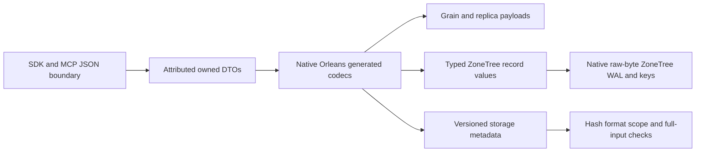

# InternalSerialization

The owner requires generated Orleans10.3.1 binary serialization for all owned internal typed payloads. Public HTTP/MCP JSON, exact user content and frozen canonical identities remain explicit concrete boundaries. This cross-cutting codec is genuinely shared; each model's behavior remains in its existing canonical slice. Frontend is N/A because no UI behavior is introduced; public API JSON stays unchanged.

## Requirements and acceptance

REQ-IS-001 through REQ-IS-009 respectively require the complete attributed DTO closure, pooled strict native codec, typed persistence/accounting, versioned storage metadata, secure bounded replication, native grain/membership contracts, versioned native signed claims, explicit non-destructive migration and exact-source qualification. They map one-to-one to AC-IS-001..009 and the test/flow matrix in the root acceptance file. Each missing or malformed case must fail before effects; deserialize defaults are not authorization or semantic validation.

## Ownership and verification

[ADR-060](../ADR/ADR-060-native-internal-serialization.md) owns formats and ordered implementation. Abstractions owns Features/InternalSerialization and generated public DTOs; Core owns each model's private records/readers/accounting; Replication owns ClusterReplication persistence/protocols; Storage.ZoneTree owns StorageRecovery/BackupRestore metadata; Orleans owns ClusterRouting/ClusterReplication internal transport. Existing public ClientApi remains its actual JSON protocol boundary.

Tests mirror InternalSerialization and the affected existing slices. Generated codecs and small real-file fixtures cover type/null/default/empty/byte/DOM/enum/polymorphism boundaries. Real process fault cuts and genuine Docker RF3 SDK/MCP prove recovery/runtime behavior only at the qualified SHA. Local tests/benchmarks are forbidden; enabled build/format/governance are static checks. Current status: accepted contract, attributes partly applied and complete native runtime candidates staged separately. Dependent runtime calls are reversibly held until the shared codec can be installed; one existing ValueOperand constructor-to-static-factory join remains staged. The active checkout retains its earlier formats during this hold. Shared codec/token/inter-node installation is blocked by automatic approval review pending explicit rollout consent; native runtime qualification is open. Prior ADR-057 WAL receipt is historical proof only for its exact unchanged source.
