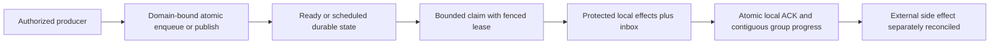
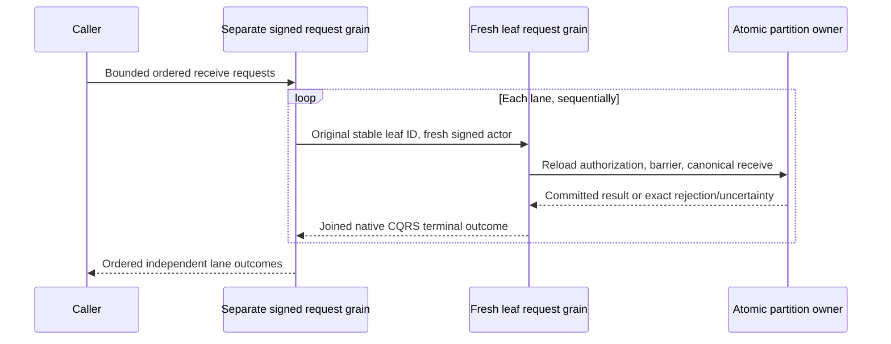
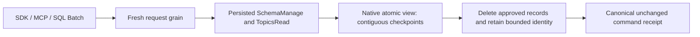

# Messaging

[RemoteTransfers](Messaging/RemoteTransfers.md) and ADR-088 define the current
bounded cross-partition intent/receipt delivery stage. Source implementation does
not close recovery, coordinator, RF3 or the original Messaging acceptance gates.

TASK-RUNTIME-READ-BUDGET-W3 preserves REQ-MSG-009 and AC-MP-005/011/012 after
the exact fa80c701 macOS failure of
SourceReadBudgetTests.AcMp005ExactRawReadBudgetSucceedsAndOneByteShortBudgetFails.
Measure the existing four raw record byte counts from one real persisted store,
then construct exact and one-byte-short DatabaseEngine wrappers over that same
store and authority. Run sequentially without writes. Assert the isolated actual
provider PointExaminedBytes delta equals the computed oracle, the exact read
returns its event and the short read fails BudgetExceeded; a following exact read
must still succeed. Different real timestamp serialization widths across three
independent stores cannot define an exact byte boundary. No budget tolerance,
clock, provider or production/API/data change is accepted. One worker owns only
SourceReadBudgetTests.cs; root owns review, build/format and renewed exact-SHA
multi-OS GitHub proof. ADR035's existing scoped-read contract suffices; rollback
reverts the fixture coordination while keeping its strict negative oracle.

Status: queue, topic, subscription-group, and inbox behavior exists in Core source and unit-test cases; full scheduler/worker/deployment capabilities and GitHub qualification remain pending. The accepted target contract is in [product design sections 37–46](../design/architecture-v0.3.uk.md).

## Purpose, actors, and entry points

Messaging owns durable work-queue state, topic event sources, persistent subscription groups, delivery leases/checkpoints, and atomic database inbox effects. Actors are producers, consumers, subscription managers, internal command processing, and time-transition workers. Current concrete operations are mutation/operation handling in `src/KeyLoad.Core/DatabaseEngine.cs`, queue behavior in `Messaging.cs`, topic/read-source behavior in `EventSources.cs`, and groups in `SubscriptionGroups.cs`. The public command/request contracts live in `src/KeyLoad.Abstractions/Contracts.cs` and `Subscriptions.cs`. No route or external bus compatibility is defined by this feature.

## Canonical slice map and boundaries

| Surface | Current source | Target owner |
|---|---|---|
| Contracts | `src/KeyLoad.Abstractions/Contracts.cs`, `Subscriptions.cs` | `src/KeyLoad.Abstractions/Features/Messaging/` |
| Backend | `src/KeyLoad.Core/Features/Messaging/Execution/Messaging.cs`, `EventSources.cs`, `SubscriptionGroups.cs`, `DatabaseEngine.cs` dispatch | `src/KeyLoad.Core/Features/Messaging/` |
| Tests | `tests/KeyLoad.UnitTests/Features/Messaging/` message/subscription suites; atomic batch cases in `Features/ResourceExecution/TransactionTests.cs` | Messaging and shared ResourceExecution slices; legacy declarations removed with assertions preserved |
| Durable specification | This file | `docs/Features/Messaging.md` |
| HTTP | `src/KeyLoad.Server/ApiEndpoints.cs`: command submit, queue receive/delivery/process/inspect, event read, and subscription configure/seek/pause/receive/delivery/process/status | Shared HTTP transport belongs to `src/KeyLoad.Server/Features/ClientApi/`; business behavior belongs to this Messaging slice. Publish/enqueue mutations use the shared command endpoint. |
| .NET SDK | `src/KeyLoad.Client/KeyLoadClient.cs`: `CommitAsync`, `ReceiveAsync`, `CompleteAsync`, `CommitProcessingAsync`, `InspectAsync`, event-source and subscription methods | Shared client transport belongs to `src/KeyLoad.Client/Features/ClientApi/`; typed queue/topic/group behavior maps to this Messaging slice |
| Official MCP | Not present in current source; official C# SDK MCP integration is planned through ClientApi | Messaging operations must map to this slice after ADR-039 freezes capability/tool mapping; no tool names or routes are asserted |
| UI | No dedicated database messaging UI is specified | N/A: producer/consumer and operations behavior is exposed through API/SDK/MCP, not a separate frontend surface |
| External brokers | No AMQP/Kafka/Redis wire compatibility is implemented here | N/A: adapters are independent, future capabilities with separate contracts and qualification |

Legacy root-level Core and test files are ADR-032 migration debt. Messaging does not own ZoneTree/WAL lifecycle, node placement, search indexes, or external side effects. Work-queue state is atomic only within its bound partition/domain; remote transfer is a separate planned protocol.

## Current source behavior and status boundary

- Enqueue validates message identity/payload/headers and queue policy, applies stored-message/byte quotas, and writes body, metadata, counters, plus scheduled or ready index in the same command. Duplicate lane identity and invalid expiry fail explicitly.
- Receive performs bounded lane scans and deterministic time-based sweeps, enforces byte/message/in-flight/lease limits, and issues signed tokens scoped to incarnation, lane, principal, delivery generation, and lease version. ACK/NACK/renew checks ownership, current lease, and expiry. Retry transitions use configured backoff/attempt limits; terminal states include dead-lettered, cancelled/expired/acked as encoded in the current model.
- `CompleteProcessing` applies protected database effects, inbox outcome, and local ACK in one transaction. This protects database effects within the stored identity/horizon; it does not make CPU handler execution exactly once or external calls atomic.
- Topics are retained source records with positions/generation and bounded source reads. Subscription groups have separate delivery state, filters, leases, seek generation, bounded gaps, and contiguous checkpoint advancement. Independent groups retain independent progress.
- Scheduled message due/lease-expiry transitions are evaluated by command processing from logged evaluation time; the complete persisted scheduler service, clock-sanity/failover protocol, worker SDK/coordinator deployment, remote transfer, recurring occurrences, sagas, and paused cluster restore are not established by these files/tests. Do not present them as source-present.

## Requirements and acceptance

### Accepted TASK-MP-007F queue read-work repair

REQ-MSG-007 maps AC-MSG-001/002/004/005 and AC-MP-006/012 to reuse of real stored
body lengths, counters and validated leases. Enqueue serializes its MessageBody
once, checks quotas against those exact bytes and stages that same payload through
the existing owned provider write. Sweep, Receive and delivery completion decode
borrowed body bytes once and carry their observed stored length; they retain
existing absent/corrupt-body checks and do not reserialize for byte subtraction.
Valid persisted bodies retain the same counters, quotas and format.

Carry a lane's counters through each bounded Sweep/Receive loop and stage the
final value before return; no counters read is required for an empty sweep.
Processing verifies token scope before inbox replay, then validates the lease
once and passes it to the same private delivery transition. Direct delivery keeps
resource validation before lease validation; processing keeps its existing lease
error before subsequent resource validation. The ACK counters/body transition is
staged before effects so released input quota can fund an atomic output. Preserve
FIFO/ready sequence, recorded command time, expiry/backoff/attempts, generation,
token fencing, field projection, receipts and rollback. No scheduler, public API,
signing, schema or cross-partition protocol change is authorized.

Ready receive also visits borrowed ready-index records and stops as soon as it
has staged the requested number of deliverable messages. Expired entries still
count toward the fixed 256-record examination ceiling and are expired in FIFO
order. Since a range visitor may not mutate its transaction, it records only the
bounded transition inputs during traversal and applies them afterward. A real
store diagnostic regression with more than 256 ready messages requires a
single-message receive to examine only its first index entry.

Worker owns only Messaging.cs private queue/body/lease/processing regions and new
matching Core/UnitTests Features/Messaging helpers/tests; Sign/Verify/Inspect,
EventSources, shared contracts/DatabaseEngine/docs/CI remain lead-owned. Real-store
tests precede code: exact stored body bytes and one-byte-short quotas, multiple
ready/scheduled/expired/leased entries, NACK/ACK/renew, stale/foreign/expired token,
producer/effects failure rollback, inbox replay and healthy next claims. Existing
tests are preserved. CI owns TUnit/recovery/RF3 execution; provider lookup counters
and server allocation/RSS evidence remain separate MP-011 work before measured
read or memory improvement claims.

TASK-RUNTIME-QUEUE-W2 completes the preceding TASK-MP-007F contract after exact
run37015193756 at ad594642b4f1a05ac5df0fff0a33b562f4aebf87 proves a remaining
257-index-entry scan for one delivery. Its regression matrix retains the existing
300-message one-entry/FIFO assertion and adds actual stored expired-before-live
and fixed256-examined-entry cases. The callback captures only bounded owned
transition inputs; every transaction mutation follows traversal. Existing
MaxMessages/MaxBytes/in-flight quotas, counter reuse, recorded expiry time,
signed-token/lease fencing, projection, rollback and receipts are unchanged.

The same worker repairs the absent-body negative fixture to assert propagated
KeyLoadException(Corruption), the existing atomic command fail-closed contract,
and unchanged ready index/counters/body/position/apply state. Malformed-body
Validation, restoration and successful subsequent receive remain required.
The worker owns only QueueReadyClaims.cs, necessary new Messaging input helper,
ReadyQueueRangeTests.cs and QueueBodyAccountingTests.cs; lead owns docs and the
integration join. Tests-first source precedes implementation; exact multi-OS
GitHub unit/recovery/RF3 proof follows enabled build/format/governance. No
persisted/wire/data migration; source rollback restores only traversal/fixtures.
This is not a measured throughput, physical-I/O or memory improvement claim.

### Accepted TASK-MP-007G topic publication read-work repair

REQ-MSG-008 maps AC-MSG-003/005 and AC-MP-006/012 to a single SourceResource and
TopicHead read during Publish. Carry the same retained raw head's tail, first
available position, generation and stored bytes through publication. A shared
topic-head helper supplies the existing absent-head defaults and generation error;
other SourceHead callers keep their validation and stream behavior. Event bytes
are already serialized once and reused for staging; preserve that property.

Worker owns EventSources.cs private TopicHead/SourceHead/Publish regions and new
matching Messaging helpers/tests only. Public reads/cursors, SourceRecord,
Subscriptions, queue work, shared contracts/docs/CI remain out of scope. Real-store
tests first cover exact/one-byte-short retained byte quota, absent/stale head,
multiple events, duplicate IDs, paused/invalid input and producer rollback with
unchanged source tail/partition event sequence. Serialized shapes, generation/error
order and persisted/wire formats remain; source rollback needs no conversion.
Build/static review and GitHub TUnit/recovery/RF3 proof are required; measured
point-read reduction awaits provider counters under MP-011.

### Accepted TASK-MP-007H source-read work and output contract

REQ-MSG-009 maps AC-MP-005/006/012 to unified retained topic/stream reads and the
shared private SourceRecord decoder. ReadEventSource adds optional caller
cancellation, uses the DatabaseEngine business clock, and starts one budget before
entering the actual store gate. A gate-scoped ResourceExecution read-view adapter
charges principal, catalog, head and every event lookup before copy/decode while
reusing existing persisted authorization helpers. It cannot escape the gate.
SourceResource is validated once; a private validated-head helper and cursor check
reuse that exact resource/schema. Existing independent SourceHead/cursor callers
still validate their own authority; subscription state/claim algorithms are outside
this task.

SourceRecord decodes the real topic/stream record directly from borrowed bytes,
without an owned raw array, for all existing callers. Missing history retains its
typed failure; a persisted source/stream identity or position mismatch is Corruption
rather than returning or processing another record. Valid wire/persistence/position
and projection semantics stay identical. The read loop increments only while below
the tail, so an empty long.MaxValue tail does not wrap. Incremental projected-event
measurement rejects excess before adding it, and full EventSourcePage measurement
includes source/head/cursor/cut/HasMore even for an empty page. No serialized
temporary byte array, new persistence format or public cursor purpose is introduced.

TASK-MP-007H owns EventSources.cs SourceRecord, SourceHead/SourceCursorPosition
and ReadEventSource regions only, new Core/UnitTests Features/Messaging source-read
helpers/tests and the new Core/Features/ResourceExecution budgeted view. Publish,
TopicPublishReads, queue/group state, shared contracts, DatabaseEngine.cs, server/
Orleans routes and shared docs are forbidden worker writes. Lead adds the budget's
internal cancellation accessor before delegation; API/grain token forwarding awaits
the concurrent routing owner's join.

Tests first use real ZoneTree/persisted policies: topic and stream page/order/cursor/
redaction, absent/stale source and wrong-scope/expired/tampered cursors, missing or
corrupt records, exact/one-byte-short measured raw work, complete-envelope rejection,
pre-/mid-cancellation and a healthy subsequent read. Compare quiescent provider
counter deltas for one principal/catalog/head lookup and one lookup per returned
event; restored data survives negative tests. Real response cursor time can vary,
so envelope tests assert definite metadata rejection, without a timing-dependent
single-byte expected cursor length. GitHub runs all tests and RF3 proof; source
rollback needs no data conversion. Authored counters/tests are not measurements.

| Requirement | Measurable acceptance | Existing TUnit evidence or planned test |
|---|---|---|
| REQ-MSG-001: persist queue state and enforce lease fencing | AC-MSG-001 passes when enqueue is quota-atomic, bounded receive creates a current lease, stale/expired/foreign tokens cannot ACK or renew, and NACK/retry reaches a visible terminal policy state. | `QueueQuotaFailureRollsBackProducerDocument`, `ExpiredWorkerCannotAckAfterReclaimAndAttemptsReachDeadLetter`; planned malformed token, lease renewal race, expiry/cancel matrix. CI pending. |
| REQ-MSG-002: protect database effects with inbox plus ACK | AC-MSG-002 passes when effects and ACK commit or roll back together, same handler input/fingerprint reuses its receipt, changed effects conflict, and stale delivery cannot commit. External calls remain outside the transaction. | `InboxEffectsAndAckAreAtomicAndReplayCannotApplyDifferentEffects`, `ProcessingReleasesInputQuotaAtomicallyAndFailureRestoresItsLease`, `ProcessingEffectsAndAcknowledgementRollBackTogetherAndInboxSurvivesReplay`, `InboxCanAcknowledgeAHandlerWithNoAdditionalMutations`. CI pending. |
| REQ-MSG-003: isolate topic/group delivery and advance only contiguous prefixes | AC-MSG-003 passes when groups keep independent progress, filters/seek generations do not skip retained inputs, later ACK cannot advance beyond a gap, and quota failure rolls back the publishing producer batch. | `IndependentGroupsRetainOnePayloadAndAckOnlyAContiguousPrefix`, `GapWindowStopsNewClaimsUntilTheMissingPrefixIsAcknowledged`, `CursorStartAndDeterministicFilterDoNotSkipPendingEvents`, `SeekFencesOldTokensAndRequiresExplicitResume`, `TopicQuotaFailureRollsBackTheProducerDocumentAndEventCounter`. CI pending. |
| REQ-MSG-004: apply scheduled and retry time transitions from recorded command time | AC-MSG-004 passes when not-yet-due work is not delivered, due work is discoverable on a later receive, retry delay/expiry and lease races produce deterministic visible states, and no worker-local timer is treated as authority. | Existing `ExpiredWorkerCannotAckAfterReclaimAndAttemptsReachDeadLetter`; planned logged-time boundary, restart, skew, renew-vs-expiry, and late-delivery tests. No completed scheduler qualification claimed. |
| REQ-MSG-005: atomically batch local document/event/queue effects | AC-MSG-005 passes when a same-domain producer failure leaves no partial document/event/message and command retry does not repeat the effects; unrelated domains are rejected. | `DocumentEventAndQueueCommitTogetherAndCommandRetryDoesNotRepeatEffects`, `UniqueConflictRollsBackDocumentIndexEventAndEnqueue`, `SameLiteralPartitionKeyCannotCrossTransactionDomains`. CI pending. |
| REQ-MSG-006: deliver remote outputs and recurring occurrences under frozen contracts | AC-MSG-006 (PLANNED) passes only when a remote output intent remains pending until destination dedup receipt is committed, and retry after crash, timeout, or unknown ACK creates one destination effect and a visible source outcome; recurring scheduling produces a stable occurrence identity under the approved timezone/misfire rules and survives restart without silently skipping or duplicating an occurrence. | Planned `RemoteTransferRetryCrashAndUnknownAckHasOneDestinationEffect`, `RecurringOccurrenceIdentityTimezoneMisfireAndRestartAreStable`; KL-094/KL-100 failure suites. The protocol choices must be frozen before implementation; current source does not satisfy or qualify this AC. |

## Flows and failure behavior

Positive: producer commits a local message; consumer claims a bounded batch, executes permitted work, and commits inbox effects with ACK. Negative: quota, permission, validation, stale token, exhausted retry, or required-input failure rejects or parks without silently advancing a checkpoint. Edge: lost response is resolved by stable request/command identity; expired worker cannot complete a newer lease; out-of-order group completion retains a gap; a topic/group cursor is scoped by generation. Errors must not leak delivery tokens or protected payload. Cancellation is an input to the caller operation; it is not evidence that an already committed command was undone.

## Decisions and verification

Related: [ADR-002](../ADR/ADR-002-command-idempotency.md), [ADR-003](../ADR/ADR-003-durability-ack-barrier.md), [ADR-007](../ADR/ADR-007-replica-consensus-bootstrap.md), [ADR-008](../ADR/ADR-008-backup-log-retention.md), [ADR-010](../ADR/ADR-010-query-budgets-security.md), [ADR-014](../ADR/ADR-014-principals-rbac-row-policy.md), [ADR-015](../ADR/ADR-015-sensitive-data-lineage.md), and [ADR-016](../ADR/ADR-016-atomic-physical-placement.md). Cross-resource and delivery decisions: [ADR-024](../ADR/ADR-024-transaction-domain-binding.md), [ADR-026](../ADR/ADR-026-fenced-delivery-inbox.md), [ADR-027](../ADR/ADR-027-contiguous-subscription-checkpoints.md), [ADR-028](../ADR/ADR-028-persisted-scheduling-time.md), [ADR-029](../ADR/ADR-029-event-message-classification.md), [ADR-030](../ADR/ADR-030-retention-paused-restore.md), and [ADR-031](../ADR/ADR-031-modular-all-in-one-resource-isolation.md).

Current test method names are source references, not results. Product qualification remains GitHub Actions only: TUnit, recovery, and Aspire RF3 through .NET SDK and official MCP clients. Official MCP RF3 parity is required and pending. No exactly-once handler or external action claim is made. AMQP/Kafka/Redis compatibility, remote partition transfers, recurring schedules, sagas, and a full scheduler/worker service remain planned.

## TASK-EVENT-QUEUE-WHOLEFLOW-001 — bounded native operation regression proposal

This source-only regression batch preserves the existing ADR-002/024/026/028
contracts and REQ/AC-EVENT-004/005 plus REQ/AC-MSG-001/002/005. Its original
architecture task subset is KL-083 (append OCC/content identity), KL-087 (lost
claim/ACK reply recovery) and KL-091 (same-domain batch precondition rollback).
It does not close those tasks or qualify the full EventStreams/Messaging feature.

The owning unit cases are
[EventAppendWholeFlowTests](../../tests/KeyLoad.UnitTests/Features/EventStreams/Cases/EventAppendWholeFlowTests.cs)
(two concurrent Exact append instances and four rejection instances),
[QueueLostResponseWholeFlowTests](../../tests/KeyLoad.UnitTests/Features/Messaging/Cases/QueueLostResponseWholeFlowTests.cs)
(one claim/ACK retry workflow with real ZoneTree reopen), and
[QueueAdmissionCancellationWholeFlowTests](../../tests/KeyLoad.UnitTests/Features/Messaging/Cases/QueueAdmissionCancellationWholeFlowTests.cs)
(two pre-admission cancellation instances). They use actual native storage,
joined workers, literal complete results, persisted-state assertions, stable
receipt replay and a healthy follow-up. Failed commands may retain authorized
outcome/clock records; rejection tests assert complete affected domain-family
state rather than falsely requiring no committed failure outcome. Pre-admission
cancellation asserts the entire store and position remain unchanged and checks
the original token. It does not claim cancellation after commit undoes effects.

The exact proposed native inventory is nine. Current normal/scalar execution,
seeded process-crash criteria and real RF3 SDK/MCP qualification remain required;
source review is not execution evidence. Original historical passing cases and
retained global failures remain separate from this proposal.

TASK-EVENT-APPEND-SEEDED-CRASH-001 preserves REQ-MSG-005/AC-MSG-005 and original KL091 through the exact seven native during-append process cuts and original child/readers/store-lock ownership frozen in [EventStreams](EventStreams.md#task-event-append-seeded-crash-001) and ADR002. The new complete recovered doc/event/head/dedup/queue/outbox/receipt and same-ID/healthy-follow-up assertions use real ZoneTree and current serialization. No runtime qualification, timeout change, multi-lane or power-loss claim follows from source. Existing required Linux/RF3/coverage gates remain unchanged.

## TASK-KL087-MULTI-LANE-RECEIVE-001

Source implementation contract, not runtime qualification. Original KL-087 and
architecture §39.3 require a multi-lane response which truthfully reports partial
claims. REQ-MSG-007 / AC-MSG-007 refine REQ-MSG-001 / AC-MSG-001 under
[ADR-026](../adr/ADR-026-fenced-delivery-inbox.md#multi-lane-receive-composition).

REQ-MSG-007: one bounded public multi-lane receive composes ordered, independent
canonical lane claims. `MultiLaneReceiveRequest.RequestId` identifies the outer
request; each `Requests` entry retains its own nonempty stable ReceiveRequestId,
unchanged canonical lane, message/byte ceiling and lease duration. The group has
no persisted receipt or group-wide deduplication identity. Lost responses are
reconciled by retrying the exact original per-lane requests; a new outer ID does
not change a lane claim identity. Reordered/changed groups are different
compositions; changing an existing lane payload under its stable ID follows the
existing conflict contract. There is no global FIFO, common read cut, cross-lane
rollback or cross-partition atomicity.

Before the first lane, validate nonempty unique lane references and request IDs,
no outer/leaf ID overlap, centrally bounded lane count (default/ceiling eight),
and sums of positive message and byte ceilings against the existing maximum
receive-message policy and DatabaseLimits.MaxBatchBytes. Each lane's lease and
persisted quota are independently validated by the unchanged canonical receive.
There is one outstanding child stream, no detached work, and the original outer
execution token/deadline bounds every child. Every child uses a fresh separately
signed request actor, subject-only native identity scope with exact restoration,
current persisted authorization, its own quorum barrier and canonical atomic
commit. No parent principal/grants authorize a child mutation. The parent reloads once before
any lane work only to publish the native subject-only child identity. Later policy
changes/revocation are evaluated by each child after its own quorum barrier; they
return independent lane failures rather than replacing earlier committed outcomes.

Every normally completed response has exactly one outcome per original entry,
in original order. `Committed` contains the exact native ReceiveResult, including
its durable token and possibly an empty delivery page; `Rejected` contains only
the exact bounded safe error/detail returned by that lane, no deliveries or
invented commit token. `Unknown` preserves the reported uncertainty error and
stops dispatch; following lanes are `NotAttempted`, with no claim/error/result.
OwnershipLost, Cancelled and UnknownWriteOutcome conservatively classify an
attempt as Unknown. A malformed successful child value is Unknown, with a fixed
safe uncertainty detail, after logging the original closed failure category; it
stops later dispatch without pretending that the child rejected. If the original
parent expires between lanes after any completed outcome, and its native identity
and incarnation still validate, retain earlier outcomes and mark every remaining
lane NotAttempted: no leaf was dispatched. The result carries the actual parent
TokenInvalidated StopError and bounded SafeDetail. Other post-attempt parent
identity/scope failures prevent safely releasing retained payloads and fail the
outer operation as UnknownWriteOutcome; before any lane they preserve the original
definitive error. Other transport/cleanup failures retain the native outer
unknown-write boundary; they are not converted to manufactured lane rejections.
Cancellation before first dispatch has no lane effect; cancellation after a
submitted lane can leave committed leases, and may prevent returning any response.
It stops later dispatch and joins actual native stream cleanup; unchanged stable
lane retries recover receipts. No successful partial response is promised after
caller cancellation.

SDK `ReceiveAcrossLanesAsync`, POST `/v1/queues/receive-across-lanes`, and the
on-demand operation tool `keyload_messages_receive_across_lanes` share the same
native operation. Existing gateway catalog remains bounded; no operation tool is
added to initial discovery. SQL operation envelope v1, queryDialectVersion=1
supports `CALL keyload_messages_receive_across_lanes(@args)` through the same
canonical descriptor; SELECT dialect2 and full SQL/protocol claims are unchanged.
Schemas include typed ordered outcomes; hints are mutating, destructive and
non-idempotent for the group (individual unchanged leaf requests are idempotent).

AC-MSG-007: actual native request grains and real ZoneTree must demonstrate two
committed lanes and exact stable replay without new store changes; one committed,
one denied and later healthy committed lane with no effects on the denied lane;
whole-group structural/budget rejection and pre-cancel preserve full store bytes
and position; healthy next request returns complete literal payload/headers,
lease metadata and token. SDK, official MCP and SQL CALL must return equal complete
ordered partial outcomes from unchanged leaf IDs, with persisted message-state
checks, ACK/replay and healthy follow-up. Real cancellation/uncertainty after
submission additionally requires native ownership observation; no fake provider,
sleep/race success branch or getter test can qualify it.

Ownership: Abstractions/Messaging/Contracts owns wire contracts; Core/Messaging
owns the validated lane-count setting and existing claim; Orleans/Messaging/Execution
owns composition; ClusterRouting/RequestGrain integrates its native branch and
explicit request-to-request graph transition; Server/Messaging owns the route,
Client/Messaging owns SDK adapter and ClientApi owns explicit catalog/schema/hints.
Unit Messaging cases and Integration Messaging cases own native whole operations.
No new dependency, storage format, migration or alternate dispatcher is introduced.
Existing single-lane contracts/aliases/IDs and replica log formats remain unchanged.
Rollback removes the new composition ingress after draining owned work; committed
leaf leases/receipts retain their existing expiry/retry semantics. Required build,
normal/scalar unit, process recovery, RF3 and exact-source Linux gates remain open
until their original native receipts exist. KL-087 remains in progress.

### TASK-KL087-POST-DISPATCH-DRAIN-001 and caller cancellation follow-on

REQ-MSG-007 / AC-MSG-007: once an actual child stream creation is invoked, a typed KeyLoad transport/stream-validation exception is an uncertain child outcome, not a definitive whole-group rejection. Retain already confirmed lane outcomes, emit UnknownWriteOutcome with the canonical static interrupted detail for that child, and mark the undispatched suffix NotAttempted. Preserve original exceptions in closed native diagnostics. Exceptions before invocation retain their original classification. Cancellation and cleanup aggregate failures are not caught or rewritten. This is a source correction; KL-087 remains in progress.

The required caller-after-submit RF3 regression uses the existing RequestCqrsProbeFixture Hold at SubmitReturned for the first original stable ReceiveRequestId, bound to the persisted principal and signed discovery voter. Observe the marker and the public persisted first-lane claim before cancelling the original caller token; join the existing settlement and ProducerDisposed boundary before examining the outcome. SDK must expose its actual UnknownWriteOutcome; official MCP must retain its actual safe unknown tool result or actual transport/cancellation exception. No synthetic tool reply is permitted. The next lane must retain its complete original message state and have no original receipt. Retire the owned arm, retry unchanged original leaf IDs through the real callers, compare the durable first receipt and full literal deliveries, then ACK and run a complete healthy continuation. Original outer cancellation, deadlines, per-lane authorization and cleanup remain unchanged. Existing probe ownership, current-image Aspire orchestration and private marker trust are reused; no new production test hook, delay or retry loop. Native execution is mandatory and not claimed by this contract.

### TASK-KL087-CALLER-AFTER-SUBMIT-RF3-001

REQ-MSG-007 / AC-MSG-007, related REQ-CRS-003/004: two native tests, SDK and official MCP, use one actual separately Aspire-owned current-image RF3 wave each. The fixture arms the first original leaf ReceiveRequestId at existing SubmitReturned/Hold for the persisted non-admin queue principal; the signed-voter-bound marker plus complete public MessageInspection proves the first claim committed while the original caller is pending. No second leaf is submitted until this held first leaf finishes. Cancel the original caller CTS only after this observation. Require the native Cancelled settlement marker and ProducerDisposed join; original SDK must return UnknownWriteOutcome without a success payload; official MCP must expose its actual safe unknown tool error or its actual transport/cancellation exception. A nested leaf marker RequestId is not the outer MCP execution ID.

Compare complete first and second MessageInspection bytes after settlement; the second is still Ready with original metadata/body/headers. Retire the exact owned arm before receipt reconciliation. Recover the unchanged first leaf via actual SDK and official MCP single-lane Receive, require complete result bytes and unchanged committed message bytes, then retry the entire unchanged group through both actual public clients: first result equals recovered durable receipt, second contains its first lease only. Full SDK/MCP group result bytes match and replay leaves complete inspections unchanged. ACK both exact recovered tokens through SDK and replay ACK through official MCP, verify the complete literal Acked metadata (state version3, attempt1, lease version1, generation1, original ready sequence1), cleared lease and null payload/headers because native ACK deletes message body. The healthy message uses the literal next ready sequence2. Delivered payload/headers remain checked before ACK. Then enqueue, claim and ACK a complete healthy literal message. This proves receipt recovery and exactly one observable first claim; it does not claim a public receipt-inspection endpoint for an undispatched leaf.

The existing shared cleanup accepts a non-generic original Task solely to join any native SDK result type; it cancels admission, releases only owned open arms, joins original calls and producers, disposes clients, stops Aspire, joins controls, preserves primary and cleanup errors, and removes owned roots only on complete cleanup. Deadlines and image admission remain unchanged. New tests live in Messaging/Cases and Messaging/Helpers. Required native filters are /*/*/MultiLaneReceiveCancellationRf3Tests/* (two authored cases, not discovered inventory). Existing local-image standard8 selection is not expanded. Use the owning full RF3 image/fixture entry or separately reviewed explicit admission. Fresh build, actual native discovery, exact-source Linux execution and original output receipts remain mandatory. KL-087 remains in progress until its complete original criteria are qualified.

### TASK-BACKUP-EVENTING-CUT-001 (KL-098 local capability-state proof)

Freeze before code under REQ/AC-BACKUP-001/002/003/004, REQ/AC-EVENT-004/005/006 and REQ/AC-MSG-003/005/006: seed actual native resources, three canonical source events, two independent subscription groups, an out-of-order completion gap, one persisted subscription-processing inbox with document+queue effects, and a real leased queue message. Capture the native backup cut, pack/unpack the genuine current-format artifact, restore into a clean target and reopen real ZoneTree. Independently require stable positions/content/generation, literal group checkpoint/issued/gap state, exact document/message state and byte-identical retained event/subscription/inbox/queue/outbox records. Manifest/source cut and single restore-authority position increment are exact; archive bytes remain unchanged.

Before explicit operator resume, fresh subscription and queue receive must fail exactly DispatchPaused and old source cursor/delivery tokens and pre-restore original command outcomes must fail exactly TokenInvalidated without effects. Persisted narrow principal denial remains enforced. Failed owned Apply outcomes commit exactly once and same-ID failed replay preserves complete result and store position. Old stored outcomes are retained; no old incarnation receipt is fabricated as current success.

Reconcile through existing public native operations only: explicitly seek the restored group from retained beginning to a new subscription generation, clear that group's explicit pause, explicitly set dispatch running as administrator, and obtain genuine new-incarnation claims. Reprocess the already completed source position using the same handler scope/execution generation: the persisted inbox returns AlreadyProcessed with original effects token and no second document/enqueue. Close contiguous gaps with actual acknowledgements. A new bounded producer/claim/ack and final close/reopen prove healthy continuation and all canonical state. Use no sleeps, fake providers, raw system-key resume or implementation-only migration APIs.

This closes only the missing local eventing artifact-state regression. KL-098 consumer/rebuild/transfer retention pins, event/topic purge/receipt horizon, history-loss reconciliation, remote-transfer KL094 and cluster-wide per-partition backup cut remain distinct open criteria. Current public event/topic APIs expose caps, reads and subscription seek, but no event/topic purge/pin implementation; the test must not synthesize history loss by deleting canonical keys or advertise local backup as a cluster cut. Existing outbox purge/pin and remote-transfer suites remain mandatory.

Ownership: UnitTests BackupRestore Cases/Fixtures/Assertions/Helpers; native artifacts and ZoneTree product APIs unchanged. Ordered join: contract, test-only implementation, root format/build and full normal/scalar native execution with exact original source/DLL identities; Linux recovery/RF3/global gates unchanged. No coverage inventory edit or status closure. Failure retains owned source/backup/target root and original primary plus joined disposal errors. No product seam, format/serializer/public contract change. Rollback removes this task and its test-only flow; no old report is rewritten.

### TASK-TEST-R382-NATIVE-OWNER-EXPIRY-001

REQ-TEST-010 / AC-TEST-010 and REQ-MSG-007 / AC-MSG-007: original R382 native failure evidence is retained. Each actual native TestCluster builder carries one private fixture-owner token in its Properties; actual ISiloBuilder.Configuration resolves only that owning fixture. A separately owned fixture cannot replace or clear another builder's owner. Register before native build/start, unregister only the same owner during its original joined cleanup; startup failures retain original failure and database cleanup failures. No new product hook, alternate coordinator, timeout or provider. Existing shared PerTestSession and owned boundary fixtures keep their actual native Orleans/ZoneTree lifetimes.

The parent expiry whole-flow advances the actual owning clock two minutes after the first committed claim. Its unchanged default30second lease has then expired. Canonical receive replay reauthorizes that lease (CommandOutcomes.ValidateCachedQueueReceive -> Messaging.Lease) and must return exact Rejected/LeaseExpired with null result; serializing that null as a recovered receipt was the test error. Assert complete outer/lane identity, typed failure, no stop error, unchanged original persisted ReceiveResult bytes, every native store byte and position, followed by fresh healthy receive. Never extend lease or parent deadline, reset clock, disable strict native validation or invent a result. Existing valid receipt replay cases remain intact. Fresh original focused normal/scalar, full native and Linux gates are required; no source-only PASS or closure.

## TASK-NATIVE-PARENT-PAYLOAD-BOUNDARY (2026-10-07)

REQ-MSG-007 / AC-MSG-007 and REQ-IS-001/002/005/006 / AC-IS-001/002/005/006 preserve ADR026 multi-lane composition and ADR060 native codecs. ReceiveAcrossLanes is an Orleans parent orchestration capability, intercepted before canonical Core command submission. Its real generated MultiLaneReceiveRequest public/native DTO is decoded by the existing HTTP/MCP/SQL typed descriptor; only each original Receive leaf is a canonical atomic command. Do not add a parent Core payload/identity/normalization mapping or group receipt. The exact enum mapping oracle must explicitly require the parent mapping absent and every other current operation mapping present. Genuine Core native command creation of this parent rejects UnsupportedCapability without storage effects; the real MCP descriptor JSON/native roundtrip preserves literal outer/leaf IDs, lane and ceilings with actual array/stream writer parity. Existing native parent/leaf and SDK/official MCP/SQL whole-operation flows remain mandatory. Original R390/R391 stale oracle failures are retained; no runtime success or coverage follows from source.

## TASK-KL098-TOPIC-RETENTION-001 — bounded native topic purge

REQ-EVENT-RETENTION-001: `PurgeTopic(Topic, ThroughPosition, Generation)` is an inclusive same-partition Batch mutation through SDK CommitAsync, existing official MCP documents_commit and shared SQL CALL documents_commit decoder/request grain. Persisted SchemaManage AND TopicsRead are required before cached outcome replay. No new transport, provider or physical owner.

REQ-EVENT-RETENTION-002: delete only retained positions FirstAvailablePosition..ThroughPosition inclusive; reject nonpositive, beyond-tail or already-retained-away cuts, stale generation and scan/byte exhaustion. Every persisted same-source/generation group's contiguous Checkpoint pins all positions greater than Checkpoint, including paused/parked groups; IssuedPosition/ACK gaps do not release pins. Therefore requested cut must be <= every Checkpoint. Refusal is ResourceExhausted and cannot alter topic/group/inbox/queue state.

Every original native observer charges one examined record plus bytes before decoding, including range lookahead and missing point lookup; callbacks never escape native read ownership. All PurgeTopic effects in one owned ApplyMutations batch share one monotonically charged MaxScanRecords/MaxBatchBytes ledger; no reset per mutation. Native atomic write cancellation/admission remains owned by the original apply gate; this adds no separate token or deadline.

REQ-EVENT-RETENTION-003: atomically advance FirstAvailablePosition to cut+1 and subtract exact native serialized source bytes; preserve TailPosition, partition event sequence, generation, group/inbox/queue state, incarnation and backup identity. Retain only generated native typed event-ID digest/original position/generation in existing topic-event-id family. No bodies, fallback, migration or receipt pruning. Fresh identical event reuse remains DuplicateEventId; conflicting content remains Conflict; same immutable original command ID returns byte-identical receipt after purge.

AC-EVENT-RETENTION-001: genuine ZoneTree seeded three-event/two-group operation refuses unread and paused pins, releases only by existing exact ACK/explicit seek; bounded approved purge leaves literal event3 at original position/sequence3 and unchanged other model bytes, old read yields exact HistoryUnavailable; same-ID purge replay retains complete receipt and stable store cut.
AC-EVENT-RETENTION-002: post-purge original publish replay returns exact original receipt, fresh identical/conflicting event commands preserve exact distinct errors; denied caller cannot purge or replay privileged receipt, stale generation/cut/record/byte budget failures retain complete logical state and stable same-ID rejected outcomes; healthy next publish is position/sequence4.
AC-EVENT-RETENTION-003: native store reopen retains exact head, digest identities, group/checkpoint/inbox/queue state and receipts; shared real SQL compiler/decoder admits same Batch mutation; root must run native unit/scalar/recovery and genuine RF3 SDK/MCP before qualification. Automated owning cases: TopicRetentionOperationTests, TopicRetentionBoundaryTests; no source-only proof.

Implementation order: this contract first; Abstractions/EventStreams Contracts + generated native alias; Core/EventStreams Commands and Messaging publisher identity; existing Batch validation/auth/apply joins; UnitTests/EventStreams native operation fixtures/cases. Roll out only as a homogeneous freshly built native server cohort; do not downgrade a store whose journals/records retain the new generated aliases. Existing formats/aliases/field IDs are unchanged, with no mixed-version fallback. Historical digest count and receipt-horizon-wide storage bounds remain unqualified; active MaxEvents/MaxBytes is not reinterpreted as a lifetime-ID limit. Rollback source before qualification; persisted purge is deliberate irreversible data removal and has no migration rollback. Rebuild/transfer pins, receipt-horizon pruning, remote KL094 and complete KL098 closure remain explicitly incomplete.

### Original 4e18 RF3 multi-lane cancellation fixture policy repair

REQ-MSG-007 / AC-MSG-007 under ADR026 retains all original native leaf cancellation, independent partial outcomes, same-ID receipt reconciliation and SDK/official MCP healthy flows. Original run37666943488 attempt1 produced both cancellation-case failures before queue seeding: the already persisted principal policy epoch1 was replaced with default epoch1, correctly rejected by the canonical strict policy update fence. The owning fixture now submits literal epoch2 and verifies persisted epoch2; no fence, capability or deadline change. Original failures remain immutable; both actual cancellation whole-operation RF3 cases must pass after a genuine fresh-image build, with every previous state/receipt/cancellation/cleanup assertion retained. Separate independent MCP catalog correction is required before their later discovery stage; it is owned in its own disjoint packet. These source changes are not execution or KL087 closure.

### Due cold-restart cancellation phase binding

REQ/AC-DUE-003 under ADR-082 retains exact autonomous schedule/saga outcomes, leader loss/rejoin, current cold restart, same receipts and healthy consume. The existing two-minute native wave bound is unchanged. DueFaultRf3Run and its actual wave lifetime reuse bounded closed C1 lifecycle evidence for original first/cold wave, seed, leader fault/rejoin, status/discovery/outcome reads and final consume; first failure is captured before native stop/disposal. Original cancelled run37666943488 is retained; context is diagnosis only and cannot qualify autonomous effects. No new observer framework, restart retry, compatibility fallback or timeout allowance.
