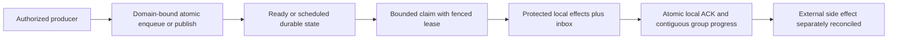
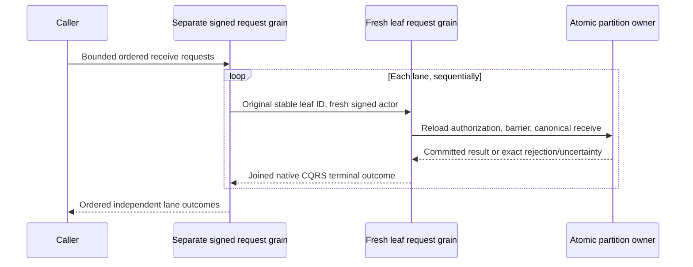
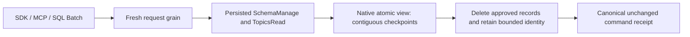
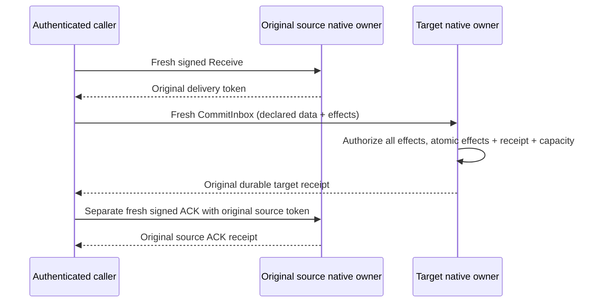

# Messaging

[RemoteTransfers](Messaging/RemoteTransfers.md) and ADR-088 define the current
bounded cross-partition intent/receipt delivery stage. Source implementation does
not close recovery, coordinator, RF3 or the original Messaging acceptance gates.

TASK-RUNTIME-READ-BUDGET-W3 preserves REQ-MSG-009 and AC-MP-005/011/012 after
the exact fa80c701 macOS failure of
SourceReadBudgetTests.AcMp005ExactRawReadBudgetSucceedsAndOneByteShortBudgetFails.
Measure the existing four raw record byte counts from one real persisted store,
then construct exact and one-byte-short DatabaseEngine wrappers over that same
store and authority. Run sequentially without writes. Assert the isolated actual
provider PointExaminedBytes delta equals the computed oracle, the exact read
returns its event and the short read fails BudgetExceeded; a following exact read
must still succeed. Different real timestamp serialization widths across three
independent stores cannot define an exact byte boundary. No budget tolerance,
clock, provider or production/API/data change is accepted. One worker owns only
SourceReadBudgetTests.cs; root owns review, build/format and renewed exact-SHA
multi-OS GitHub proof. ADR035's existing scoped-read contract suffices; rollback
reverts the fixture coordination while keeping its strict negative oracle.

Status: queue, topic, subscription-group, and inbox behavior exists in Core source and unit-test cases; full scheduler/worker/deployment capabilities and GitHub qualification remain pending. The accepted target contract is in [product design sections 37–46](../design/architecture-v0.3.uk.md).

## Purpose, actors, and entry points

Messaging owns durable work-queue state, topic event sources, persistent subscription groups, delivery leases/checkpoints, and atomic database inbox effects. Actors are producers, consumers, subscription managers, internal command processing, and time-transition workers. Current concrete operations are mutation/operation handling in `src/KeyLoad.Core/DatabaseEngine.cs`, queue behavior in `Messaging.cs`, topic/read-source behavior in `EventSources.cs`, and groups in `SubscriptionGroups.cs`. The public command/request contracts live in `src/KeyLoad.Abstractions/Contracts.cs` and `Subscriptions.cs`. No route or external bus compatibility is defined by this feature.

## Canonical slice map and boundaries

| Surface | Current source | Target owner |
|---|---|---|
| Contracts | `src/KeyLoad.Abstractions/Contracts.cs`, `Subscriptions.cs` | `src/KeyLoad.Abstractions/Features/Messaging/` |
| Backend | `src/KeyLoad.Core/Features/Messaging/Execution/Messaging.cs`, `EventSources.cs`, `SubscriptionGroups.cs`, `DatabaseEngine.cs` dispatch | `src/KeyLoad.Core/Features/Messaging/` |
| Tests | `tests/KeyLoad.UnitTests/Features/Messaging/` message/subscription suites; atomic batch cases in `Features/ResourceExecution/TransactionTests.cs` | Messaging and shared ResourceExecution slices; legacy declarations removed with assertions preserved |
| Durable specification | This file | `docs/Features/Messaging.md` |
| HTTP | `src/KeyLoad.Server/ApiEndpoints.cs`: command submit, queue receive/delivery/process/inspect, event read, and subscription configure/seek/pause/receive/delivery/process/status | Shared HTTP transport belongs to `src/KeyLoad.Server/Features/ClientApi/`; business behavior belongs to this Messaging slice. Publish/enqueue mutations use the shared command endpoint. |
| .NET SDK | `src/KeyLoad.Client/KeyLoadClient.cs`: `CommitAsync`, `ReceiveAsync`, `CompleteAsync`, `CommitProcessingAsync`, `InspectAsync`, event-source and subscription methods | Shared client transport belongs to `src/KeyLoad.Client/Features/ClientApi/`; typed queue/topic/group behavior maps to this Messaging slice |
| Official MCP | Not present in current source; official C# SDK MCP integration is planned through ClientApi | Messaging operations must map to this slice after ADR-039 freezes capability/tool mapping; no tool names or routes are asserted |
| UI | No dedicated database messaging UI is specified | N/A: producer/consumer and operations behavior is exposed through API/SDK/MCP, not a separate frontend surface |
| External brokers | No AMQP/Kafka/Redis wire compatibility is implemented here | N/A: adapters are independent, future capabilities with separate contracts and qualification |

Legacy root-level Core and test files are ADR-032 migration debt. Messaging does not own ZoneTree/WAL lifecycle, node placement, search indexes, or external side effects. Work-queue state is atomic only within its bound partition/domain; remote transfer is a separate planned protocol.

## Current source behavior and status boundary

- Enqueue validates message identity/payload/headers and queue policy, applies stored-message/byte quotas, and writes body, metadata, counters, plus scheduled or ready index in the same command. Duplicate lane identity and invalid expiry fail explicitly.
- Receive performs bounded lane scans and deterministic time-based sweeps, enforces byte/message/in-flight/lease limits, and issues signed tokens scoped to incarnation, lane, principal, delivery generation, and lease version. ACK/NACK/renew checks ownership, current lease, and expiry. Retry transitions use configured backoff/attempt limits; terminal states include dead-lettered, cancelled/expired/acked as encoded in the current model.
- `CompleteProcessing` applies protected database effects, inbox outcome, and local ACK in one transaction. This protects database effects within the stored identity/horizon; it does not make CPU handler execution exactly once or external calls atomic.
- Topics are retained source records with positions/generation and bounded source reads. Subscription groups have separate delivery state, filters, leases, seek generation, bounded gaps, and contiguous checkpoint advancement. Independent groups retain independent progress.
- Scheduled message due/lease-expiry transitions are evaluated by command processing from logged evaluation time; the complete persisted scheduler service, clock-sanity/failover protocol, worker SDK/coordinator deployment, remote transfer, recurring occurrences, sagas, and paused cluster restore are not established by these files/tests. Do not present them as source-present.

## Requirements and acceptance

### Accepted TASK-MP-007F queue read-work repair

REQ-MSG-007 maps AC-MSG-001/002/004/005 and AC-MP-006/012 to reuse of real stored
body lengths, counters and validated leases. Enqueue serializes its MessageBody
once, checks quotas against those exact bytes and stages that same payload through
the existing owned provider write. Sweep, Receive and delivery completion decode
borrowed body bytes once and carry their observed stored length; they retain
existing absent/corrupt-body checks and do not reserialize for byte subtraction.
Valid persisted bodies retain the same counters, quotas and format.

Carry a lane's counters through each bounded Sweep/Receive loop and stage the
final value before return; no counters read is required for an empty sweep.
Processing verifies token scope before inbox replay, then validates the lease
once and passes it to the same private delivery transition. Direct delivery keeps
resource validation before lease validation; processing keeps its existing lease
error before subsequent resource validation. The ACK counters/body transition is
staged before effects so released input quota can fund an atomic output. Preserve
FIFO/ready sequence, recorded command time, expiry/backoff/attempts, generation,
token fencing, field projection, receipts and rollback. No scheduler, public API,
signing, schema or cross-partition protocol change is authorized.

Ready receive also visits borrowed ready-index records and stops as soon as it
has staged the requested number of deliverable messages. Expired entries still
count toward the fixed 256-record examination ceiling and are expired in FIFO
order. Since a range visitor may not mutate its transaction, it records only the
bounded transition inputs during traversal and applies them afterward. A real
store diagnostic regression with more than 256 ready messages requires a
single-message receive to examine only its first index entry.

Worker owns only Messaging.cs private queue/body/lease/processing regions and new
matching Core/UnitTests Features/Messaging helpers/tests; Sign/Verify/Inspect,
EventSources, shared contracts/DatabaseEngine/docs/CI remain lead-owned. Real-store
tests precede code: exact stored body bytes and one-byte-short quotas, multiple
ready/scheduled/expired/leased entries, NACK/ACK/renew, stale/foreign/expired token,
producer/effects failure rollback, inbox replay and healthy next claims. Existing
tests are preserved. CI owns TUnit/recovery/RF3 execution; provider lookup counters
and server allocation/RSS evidence remain separate MP-011 work before measured
read or memory improvement claims.

TASK-RUNTIME-QUEUE-W2 completes the preceding TASK-MP-007F contract after exact
run37015193756 at ad594642b4f1a05ac5df0fff0a33b562f4aebf87 proves a remaining
257-index-entry scan for one delivery. Its regression matrix retains the existing
300-message one-entry/FIFO assertion and adds actual stored expired-before-live
and fixed256-examined-entry cases. The callback captures only bounded owned
transition inputs; every transaction mutation follows traversal. Existing
MaxMessages/MaxBytes/in-flight quotas, counter reuse, recorded expiry time,
signed-token/lease fencing, projection, rollback and receipts are unchanged.

The same worker repairs the absent-body negative fixture to assert propagated
KeyLoadException(Corruption), the existing atomic command fail-closed contract,
and unchanged ready index/counters/body/position/apply state. Malformed-body
Validation, restoration and successful subsequent receive remain required.
The worker owns only QueueReadyClaims.cs, necessary new Messaging input helper,
ReadyQueueRangeTests.cs and QueueBodyAccountingTests.cs; lead owns docs and the
integration join. Tests-first source precedes implementation; exact multi-OS
GitHub unit/recovery/RF3 proof follows enabled build/format/governance. No
persisted/wire/data migration; source rollback restores only traversal/fixtures.
This is not a measured throughput, physical-I/O or memory improvement claim.

### Accepted TASK-MP-007G topic publication read-work repair

REQ-MSG-008 maps AC-MSG-003/005 and AC-MP-006/012 to a single SourceResource and
TopicHead read during Publish. Carry the same retained raw head's tail, first
available position, generation and stored bytes through publication. A shared
topic-head helper supplies the existing absent-head defaults and generation error;
other SourceHead callers keep their validation and stream behavior. Event bytes
are already serialized once and reused for staging; preserve that property.

Worker owns EventSources.cs private TopicHead/SourceHead/Publish regions and new
matching Messaging helpers/tests only. Public reads/cursors, SourceRecord,
Subscriptions, queue work, shared contracts/docs/CI remain out of scope. Real-store
tests first cover exact/one-byte-short retained byte quota, absent/stale head,
multiple events, duplicate IDs, paused/invalid input and producer rollback with
unchanged source tail/partition event sequence. Serialized shapes, generation/error
order and persisted/wire formats remain; source rollback needs no conversion.
Build/static review and GitHub TUnit/recovery/RF3 proof are required; measured
point-read reduction awaits provider counters under MP-011.

### Accepted TASK-MP-007H source-read work and output contract

REQ-MSG-009 maps AC-MP-005/006/012 to unified retained topic/stream reads and the
shared private SourceRecord decoder. ReadEventSource adds optional caller
cancellation, uses the DatabaseEngine business clock, and starts one budget before
entering the actual store gate. A gate-scoped ResourceExecution read-view adapter
charges principal, catalog, head and every event lookup before copy/decode while
reusing existing persisted authorization helpers. It cannot escape the gate.
SourceResource is validated once; a private validated-head helper and cursor check
reuse that exact resource/schema. Existing independent SourceHead/cursor callers
still validate their own authority; subscription state/claim algorithms are outside
this task.

SourceRecord decodes the real topic/stream record directly from borrowed bytes,
without an owned raw array, for all existing callers. Missing history retains its
typed failure; a persisted source/stream identity or position mismatch is Corruption
rather than returning or processing another record. Valid wire/persistence/position
and projection semantics stay identical. The read loop increments only while below
the tail, so an empty long.MaxValue tail does not wrap. Incremental projected-event
measurement rejects excess before adding it, and full EventSourcePage measurement
includes source/head/cursor/cut/HasMore even for an empty page. No serialized
temporary byte array, new persistence format or public cursor purpose is introduced.

TASK-MP-007H owns EventSources.cs SourceRecord, SourceHead/SourceCursorPosition
and ReadEventSource regions only, new Core/UnitTests Features/Messaging source-read
helpers/tests and the new Core/Features/ResourceExecution budgeted view. Publish,
TopicPublishReads, queue/group state, shared contracts, DatabaseEngine.cs, server/
Orleans routes and shared docs are forbidden worker writes. Lead adds the budget's
internal cancellation accessor before delegation; API/grain token forwarding awaits
the concurrent routing owner's join.

Tests first use real ZoneTree/persisted policies: topic and stream page/order/cursor/
redaction, absent/stale source and wrong-scope/expired/tampered cursors, missing or
corrupt records, exact/one-byte-short measured raw work, complete-envelope rejection,
pre-/mid-cancellation and a healthy subsequent read. Compare quiescent provider
counter deltas for one principal/catalog/head lookup and one lookup per returned
event; restored data survives negative tests. Real response cursor time can vary,
so envelope tests assert definite metadata rejection, without a timing-dependent
single-byte expected cursor length. GitHub runs all tests and RF3 proof; source
rollback needs no data conversion. Authored counters/tests are not measurements.

| Requirement | Measurable acceptance | Existing TUnit evidence or planned test |
|---|---|---|
| REQ-MSG-001: persist queue state and enforce lease fencing | AC-MSG-001 passes when enqueue is quota-atomic, bounded receive creates a current lease, stale/expired/foreign tokens cannot ACK or renew, and NACK/retry reaches a visible terminal policy state. | `QueueQuotaFailureRollsBackProducerDocument`, `ExpiredWorkerCannotAckAfterReclaimAndAttemptsReachDeadLetter`; planned malformed token, lease renewal race, expiry/cancel matrix. CI pending. |
| REQ-MSG-002: protect database effects with inbox plus ACK | AC-MSG-002 passes when effects and ACK commit or roll back together, same handler input/fingerprint reuses its receipt, changed effects conflict, and stale delivery cannot commit. External calls remain outside the transaction. | `InboxEffectsAndAckAreAtomicAndReplayCannotApplyDifferentEffects`, `ProcessingReleasesInputQuotaAtomicallyAndFailureRestoresItsLease`, `ProcessingEffectsAndAcknowledgementRollBackTogetherAndInboxSurvivesReplay`, `InboxCanAcknowledgeAHandlerWithNoAdditionalMutations`. CI pending. |
| REQ-MSG-003: isolate topic/group delivery and advance only contiguous prefixes | AC-MSG-003 passes when groups keep independent progress, filters/seek generations do not skip retained inputs, later ACK cannot advance beyond a gap, and quota failure rolls back the publishing producer batch. | `IndependentGroupsRetainOnePayloadAndAckOnlyAContiguousPrefix`, `GapWindowStopsNewClaimsUntilTheMissingPrefixIsAcknowledged`, `CursorStartAndDeterministicFilterDoNotSkipPendingEvents`, `SeekFencesOldTokensAndRequiresExplicitResume`, `TopicQuotaFailureRollsBackTheProducerDocumentAndEventCounter`. CI pending. |
| REQ-MSG-004: apply scheduled and retry time transitions from recorded command time | AC-MSG-004 passes when not-yet-due work is not delivered, due work is discoverable on a later receive, retry delay/expiry and lease races produce deterministic visible states, and no worker-local timer is treated as authority. | Existing `ExpiredWorkerCannotAckAfterReclaimAndAttemptsReachDeadLetter`; planned logged-time boundary, restart, skew, renew-vs-expiry, and late-delivery tests. No completed scheduler qualification claimed. |
| REQ-MSG-005: atomically batch local document/event/queue effects | AC-MSG-005 passes when a same-domain producer failure leaves no partial document/event/message and command retry does not repeat the effects; unrelated domains are rejected. | `DocumentEventAndQueueCommitTogetherAndCommandRetryDoesNotRepeatEffects`, `UniqueConflictRollsBackDocumentIndexEventAndEnqueue`, `SameLiteralPartitionKeyCannotCrossTransactionDomains`. CI pending. |
| REQ-MSG-006: deliver remote outputs and recurring occurrences under frozen contracts | AC-MSG-006 (PLANNED) passes only when a remote output intent remains pending until destination dedup receipt is committed, and retry after crash, timeout, or unknown ACK creates one destination effect and a visible source outcome; recurring scheduling produces a stable occurrence identity under the approved timezone/misfire rules and survives restart without silently skipping or duplicating an occurrence. | Planned `RemoteTransferRetryCrashAndUnknownAckHasOneDestinationEffect`, `RecurringOccurrenceIdentityTimezoneMisfireAndRestartAreStable`; KL-094/KL-100 failure suites. The protocol choices must be frozen before implementation; current source does not satisfy or qualify this AC. |

## Flows and failure behavior

Positive: producer commits a local message; consumer claims a bounded batch, executes permitted work, and commits inbox effects with ACK. Negative: quota, permission, validation, stale token, exhausted retry, or required-input failure rejects or parks without silently advancing a checkpoint. Edge: lost response is resolved by stable request/command identity; expired worker cannot complete a newer lease; out-of-order group completion retains a gap; a topic/group cursor is scoped by generation. Errors must not leak delivery tokens or protected payload. Cancellation is an input to the caller operation; it is not evidence that an already committed command was undone.

## Decisions and verification

Related: [ADR-002](../ADR/ADR-002-command-idempotency.md), [ADR-003](../ADR/ADR-003-durability-ack-barrier.md), [ADR-007](../ADR/ADR-007-replica-consensus-bootstrap.md), [ADR-008](../ADR/ADR-008-backup-log-retention.md), [ADR-010](../ADR/ADR-010-query-budgets-security.md), [ADR-014](../ADR/ADR-014-principals-rbac-row-policy.md), [ADR-015](../ADR/ADR-015-sensitive-data-lineage.md), and [ADR-016](../ADR/ADR-016-atomic-physical-placement.md). Cross-resource and delivery decisions: [ADR-024](../ADR/ADR-024-transaction-domain-binding.md), [ADR-026](../ADR/ADR-026-fenced-delivery-inbox.md), [ADR-027](../ADR/ADR-027-contiguous-subscription-checkpoints.md), [ADR-028](../ADR/ADR-028-persisted-scheduling-time.md), [ADR-029](../ADR/ADR-029-event-message-classification.md), [ADR-030](../ADR/ADR-030-retention-paused-restore.md), and [ADR-031](../ADR/ADR-031-modular-all-in-one-resource-isolation.md).

Current test method names are source references, not results. Product qualification remains GitHub Actions only: TUnit, recovery, and Aspire RF3 through .NET SDK and official MCP clients. Official MCP RF3 parity is required and pending. No exactly-once handler or external action claim is made. AMQP/Kafka/Redis compatibility, remote partition transfers, recurring schedules, sagas, and a full scheduler/worker service remain planned.

## TASK-EVENT-QUEUE-WHOLEFLOW-001 — bounded native operation regression proposal

This source-only regression batch preserves the existing ADR-002/024/026/028
contracts and REQ/AC-EVENT-004/005 plus REQ/AC-MSG-001/002/005. Its original
architecture task subset is KL-083 (append OCC/content identity), KL-087 (lost
claim/ACK reply recovery) and KL-091 (same-domain batch precondition rollback).
It does not close those tasks or qualify the full EventStreams/Messaging feature.

The owning unit cases are
[EventAppendWholeFlowTests](../../tests/KeyLoad.UnitTests/Features/EventStreams/Cases/EventAppendWholeFlowTests.cs)
(two concurrent Exact append instances and four rejection instances),
[QueueLostResponseWholeFlowTests](../../tests/KeyLoad.UnitTests/Features/Messaging/Cases/QueueLostResponseWholeFlowTests.cs)
(one claim/ACK retry workflow with real ZoneTree reopen), and
[QueueAdmissionCancellationWholeFlowTests](../../tests/KeyLoad.UnitTests/Features/Messaging/Cases/QueueAdmissionCancellationWholeFlowTests.cs)
(two pre-admission cancellation instances). They use actual native storage,
joined workers, literal complete results, persisted-state assertions, stable
receipt replay and a healthy follow-up. Failed commands may retain authorized
outcome/clock records; rejection tests assert complete affected domain-family
state rather than falsely requiring no committed failure outcome. Pre-admission
cancellation asserts the entire store and position remain unchanged and checks
the original token. It does not claim cancellation after commit undoes effects.

The exact proposed native inventory is nine. Current normal/scalar execution,
seeded process-crash criteria and real RF3 SDK/MCP qualification remain required;
source review is not execution evidence. Original historical passing cases and
retained global failures remain separate from this proposal.

TASK-EVENT-APPEND-SEEDED-CRASH-001 preserves REQ-MSG-005/AC-MSG-005 and original KL091 through the exact seven native during-append process cuts and original child/readers/store-lock ownership frozen in [EventStreams](EventStreams.md#task-event-append-seeded-crash-001) and ADR002. The new complete recovered doc/event/head/dedup/queue/outbox/receipt and same-ID/healthy-follow-up assertions use real ZoneTree and current serialization. No runtime qualification, timeout change, multi-lane or power-loss claim follows from source. Existing required Linux/RF3/coverage gates remain unchanged.

## TASK-KL087-MULTI-LANE-RECEIVE-001

Source implementation contract, not runtime qualification. Original KL-087 and
architecture §39.3 require a multi-lane response which truthfully reports partial
claims. REQ-MSG-007 / AC-MSG-007 refine REQ-MSG-001 / AC-MSG-001 under
[ADR-026](../adr/ADR-026-fenced-delivery-inbox.md#multi-lane-receive-composition).

REQ-MSG-007: one bounded public multi-lane receive composes ordered, independent
canonical lane claims. `MultiLaneReceiveRequest.RequestId` identifies the outer
request; each `Requests` entry retains its own nonempty stable ReceiveRequestId,
unchanged canonical lane, message/byte ceiling and lease duration. The group has
no persisted receipt or group-wide deduplication identity. Lost responses are
reconciled by retrying the exact original per-lane requests; a new outer ID does
not change a lane claim identity. Reordered/changed groups are different
compositions; changing an existing lane payload under its stable ID follows the
existing conflict contract. There is no global FIFO, common read cut, cross-lane
rollback or cross-partition atomicity.

Before the first lane, validate nonempty unique lane references and request IDs,
no outer/leaf ID overlap, centrally bounded lane count (default/ceiling eight),
and sums of positive message and byte ceilings against the existing maximum
receive-message policy and DatabaseLimits.MaxBatchBytes. Each lane's lease and
persisted quota are independently validated by the unchanged canonical receive.
There is one outstanding child stream, no detached work, and the original outer
execution token/deadline bounds every child. Every child uses a fresh separately
signed request actor, subject-only native identity scope with exact restoration,
current persisted authorization, its own quorum barrier and canonical atomic
commit. No parent principal/grants authorize a child mutation. The parent reloads once before
any lane work only to publish the native subject-only child identity. Later policy
changes/revocation are evaluated by each child after its own quorum barrier; they
return independent lane failures rather than replacing earlier committed outcomes.

Every normally completed response has exactly one outcome per original entry,
in original order. `Committed` contains the exact native ReceiveResult, including
its durable token and possibly an empty delivery page; `Rejected` contains only
the exact bounded safe error/detail returned by that lane, no deliveries or
invented commit token. `Unknown` preserves the reported uncertainty error and
stops dispatch; following lanes are `NotAttempted`, with no claim/error/result.
OwnershipLost, Cancelled and UnknownWriteOutcome conservatively classify an
attempt as Unknown. A malformed successful child value is Unknown, with a fixed
safe uncertainty detail, after logging the original closed failure category; it
stops later dispatch without pretending that the child rejected. If the original
parent expires between lanes after any completed outcome, and its native identity
and incarnation still validate, retain earlier outcomes and mark every remaining
lane NotAttempted: no leaf was dispatched. The result carries the actual parent
TokenInvalidated StopError and bounded SafeDetail. Other post-attempt parent
identity/scope failures prevent safely releasing retained payloads and fail the
outer operation as UnknownWriteOutcome; before any lane they preserve the original
definitive error. Other transport/cleanup failures retain the native outer
unknown-write boundary; they are not converted to manufactured lane rejections.
Cancellation before first dispatch has no lane effect; cancellation after a
submitted lane can leave committed leases, and may prevent returning any response.
It stops later dispatch and joins actual native stream cleanup; unchanged stable
lane retries recover receipts. No successful partial response is promised after
caller cancellation.

SDK `ReceiveAcrossLanesAsync`, POST `/v1/queues/receive-across-lanes`, and the
on-demand operation tool `keyload_messages_receive_across_lanes` share the same
native operation. Existing gateway catalog remains bounded; no operation tool is
added to initial discovery. SQL operation envelope v1, queryDialectVersion=1
supports `CALL keyload_messages_receive_across_lanes(@args)` through the same
canonical descriptor; SELECT dialect2 and full SQL/protocol claims are unchanged.
Schemas include typed ordered outcomes; hints are mutating, destructive and
non-idempotent for the group (individual unchanged leaf requests are idempotent).

AC-MSG-007: actual native request grains and real ZoneTree must demonstrate two
committed lanes and exact stable replay without new store changes; one committed,
one denied and later healthy committed lane with no effects on the denied lane;
whole-group structural/budget rejection and pre-cancel preserve full store bytes
and position; healthy next request returns complete literal payload/headers,
lease metadata and token. SDK, official MCP and SQL CALL must return equal complete
ordered partial outcomes from unchanged leaf IDs, with persisted message-state
checks, ACK/replay and healthy follow-up. Real cancellation/uncertainty after
submission additionally requires native ownership observation; no fake provider,
sleep/race success branch or getter test can qualify it.

Ownership: Abstractions/Messaging/Contracts owns wire contracts; Core/Messaging
owns the validated lane-count setting and existing claim; Orleans/Messaging/Execution
owns composition; ClusterRouting/RequestGrain integrates its native branch and
explicit request-to-request graph transition; Server/Messaging owns the route,
Client/Messaging owns SDK adapter and ClientApi owns explicit catalog/schema/hints.
Unit Messaging cases and Integration Messaging cases own native whole operations.
No new dependency, storage format, migration or alternate dispatcher is introduced.
Existing single-lane contracts/aliases/IDs and replica log formats remain unchanged.
Rollback removes the new composition ingress after draining owned work; committed
leaf leases/receipts retain their existing expiry/retry semantics. Required build,
normal/scalar unit, process recovery, RF3 and exact-source Linux gates remain open
until their original native receipts exist. KL-087 remains in progress.

### TASK-KL087-POST-DISPATCH-DRAIN-001 and caller cancellation follow-on

REQ-MSG-007 / AC-MSG-007: once an actual child stream creation is invoked, a typed KeyLoad transport/stream-validation exception is an uncertain child outcome, not a definitive whole-group rejection. Retain already confirmed lane outcomes, emit UnknownWriteOutcome with the canonical static interrupted detail for that child, and mark the undispatched suffix NotAttempted. Preserve original exceptions in closed native diagnostics. Exceptions before invocation retain their original classification. Cancellation and cleanup aggregate failures are not caught or rewritten. This is a source correction; KL-087 remains in progress.

The required caller-after-submit RF3 regression uses the existing RequestCqrsProbeFixture Hold at SubmitReturned for the first original stable ReceiveRequestId, bound to the persisted principal and signed discovery voter. Observe the marker and the public persisted first-lane claim before cancelling the original caller token; join the existing settlement and ProducerDisposed boundary before examining the outcome. SDK must expose its actual UnknownWriteOutcome; official MCP must retain its actual safe unknown tool result or actual transport/cancellation exception. No synthetic tool reply is permitted. The next lane must retain its complete original message state and have no original receipt. Retire the owned arm, retry unchanged original leaf IDs through the real callers, compare the durable first receipt and full literal deliveries, then ACK and run a complete healthy continuation. Original outer cancellation, deadlines, per-lane authorization and cleanup remain unchanged. Existing probe ownership, current-image Aspire orchestration and private marker trust are reused; no new production test hook, delay or retry loop. Native execution is mandatory and not claimed by this contract.

### TASK-KL087-CALLER-AFTER-SUBMIT-RF3-001

REQ-MSG-007 / AC-MSG-007, related REQ-CRS-003/004: two native tests, SDK and official MCP, use one actual separately Aspire-owned current-image RF3 wave each. The fixture arms the first original leaf ReceiveRequestId at existing SubmitReturned/Hold for the persisted non-admin queue principal; the signed-voter-bound marker plus complete public MessageInspection proves the first claim committed while the original caller is pending. No second leaf is submitted until this held first leaf finishes. Cancel the original caller CTS only after this observation. Require the native Cancelled settlement marker and ProducerDisposed join; original SDK must return UnknownWriteOutcome without a success payload; official MCP must expose its actual safe unknown tool error or its actual transport/cancellation exception. A nested leaf marker RequestId is not the outer MCP execution ID.

Compare complete first and second MessageInspection bytes after settlement; the second is still Ready with original metadata/body/headers. Retire the exact owned arm before receipt reconciliation. Recover the unchanged first leaf via actual SDK and official MCP single-lane Receive, require complete result bytes and unchanged committed message bytes, then retry the entire unchanged group through both actual public clients: first result equals recovered durable receipt, second contains its first lease only. Full SDK/MCP group result bytes match and replay leaves complete inspections unchanged. ACK both exact recovered tokens through SDK and replay ACK through official MCP, verify the complete literal Acked metadata (state version3, attempt1, lease version1, generation1, original ready sequence1), cleared lease and null payload/headers because native ACK deletes message body. The healthy message uses the literal next ready sequence2. Delivered payload/headers remain checked before ACK. Then enqueue, claim and ACK a complete healthy literal message. This proves receipt recovery and exactly one observable first claim; it does not claim a public receipt-inspection endpoint for an undispatched leaf.

The existing shared cleanup accepts a non-generic original Task solely to join any native SDK result type; it cancels admission, releases only owned open arms, joins original calls and producers, disposes clients, stops Aspire, joins controls, preserves primary and cleanup errors, and removes owned roots only on complete cleanup. Deadlines and image admission remain unchanged. New tests live in Messaging/Cases and Messaging/Helpers. Required native filters are /*/*/MultiLaneReceiveCancellationRf3Tests/* (two authored cases, not discovered inventory). Existing local-image standard8 selection is not expanded. Use the owning full RF3 image/fixture entry or separately reviewed explicit admission. Fresh build, actual native discovery, exact-source Linux execution and original output receipts remain mandatory. KL-087 remains in progress until its complete original criteria are qualified.

### TASK-BACKUP-EVENTING-CUT-001 (KL-098 local capability-state proof)

Freeze before code under REQ/AC-BACKUP-001/002/003/004, REQ/AC-EVENT-004/005/006 and REQ/AC-MSG-003/005/006: seed actual native resources, three canonical source events, two independent subscription groups, an out-of-order completion gap, one persisted subscription-processing inbox with document+queue effects, and a real leased queue message. Capture the native backup cut, pack/unpack the genuine current-format artifact, restore into a clean target and reopen real ZoneTree. Independently require stable positions/content/generation, literal group checkpoint/issued/gap state, exact document/message state and byte-identical retained event/subscription/inbox/queue/outbox records. Manifest/source cut and single restore-authority position increment are exact; archive bytes remain unchanged.

Before explicit operator resume, fresh subscription and queue receive must fail exactly DispatchPaused and old source cursor/delivery tokens and pre-restore original command outcomes must fail exactly TokenInvalidated without effects. Persisted narrow principal denial remains enforced. Failed owned Apply outcomes commit exactly once and same-ID failed replay preserves complete result and store position. Old stored outcomes are retained; no old incarnation receipt is fabricated as current success.

Reconcile through existing public native operations only: explicitly seek the restored group from retained beginning to a new subscription generation, clear that group's explicit pause, explicitly set dispatch running as administrator, and obtain genuine new-incarnation claims. Reprocess the already completed source position using the same handler scope/execution generation: the persisted inbox returns AlreadyProcessed with original effects token and no second document/enqueue. Close contiguous gaps with actual acknowledgements. A new bounded producer/claim/ack and final close/reopen prove healthy continuation and all canonical state. Use no sleeps, fake providers, raw system-key resume or implementation-only migration APIs.

This closes only the missing local eventing artifact-state regression. KL-098 consumer/rebuild/transfer retention pins, event/topic purge/receipt horizon, history-loss reconciliation, remote-transfer KL094 and cluster-wide per-partition backup cut remain distinct open criteria. Current public event/topic APIs expose caps, reads and subscription seek, but no event/topic purge/pin implementation; the test must not synthesize history loss by deleting canonical keys or advertise local backup as a cluster cut. Existing outbox purge/pin and remote-transfer suites remain mandatory.

Ownership: UnitTests BackupRestore Cases/Fixtures/Assertions/Helpers; native artifacts and ZoneTree product APIs unchanged. Ordered join: contract, test-only implementation, root format/build and full normal/scalar native execution with exact original source/DLL identities; Linux recovery/RF3/global gates unchanged. No coverage inventory edit or status closure. Failure retains owned source/backup/target root and original primary plus joined disposal errors. No product seam, format/serializer/public contract change. Rollback removes this task and its test-only flow; no old report is rewritten.

### TASK-TEST-R382-NATIVE-OWNER-EXPIRY-001

REQ-TEST-010 / AC-TEST-010 and REQ-MSG-007 / AC-MSG-007: original R382 native failure evidence is retained. Each actual native TestCluster builder carries one private fixture-owner token in its Properties; actual ISiloBuilder.Configuration resolves only that owning fixture. A separately owned fixture cannot replace or clear another builder's owner. Register before native build/start, unregister only the same owner during its original joined cleanup; startup failures retain original failure and database cleanup failures. No new product hook, alternate coordinator, timeout or provider. Existing shared PerTestSession and owned boundary fixtures keep their actual native Orleans/ZoneTree lifetimes.

The parent expiry whole-flow advances the actual owning clock two minutes after the first committed claim. Its unchanged default30second lease has then expired. Canonical receive replay reauthorizes that lease (CommandOutcomes.ValidateCachedQueueReceive -> Messaging.Lease) and must return exact Rejected/LeaseExpired with null result; serializing that null as a recovered receipt was the test error. Assert complete outer/lane identity, typed failure, no stop error, unchanged original persisted ReceiveResult bytes, every native store byte and position, followed by fresh healthy receive. Never extend lease or parent deadline, reset clock, disable strict native validation or invent a result. Existing valid receipt replay cases remain intact. Fresh original focused normal/scalar, full native and Linux gates are required; no source-only PASS or closure.

## TASK-NATIVE-PARENT-PAYLOAD-BOUNDARY (2026-10-07)

REQ-MSG-007 / AC-MSG-007 and REQ-IS-001/002/005/006 / AC-IS-001/002/005/006 preserve ADR026 multi-lane composition and ADR060 native codecs. ReceiveAcrossLanes is an Orleans parent orchestration capability, intercepted before canonical Core command submission. Its real generated MultiLaneReceiveRequest public/native DTO is decoded by the existing HTTP/MCP/SQL typed descriptor; only each original Receive leaf is a canonical atomic command. Do not add a parent Core payload/identity/normalization mapping or group receipt. The exact enum mapping oracle must explicitly require the parent mapping absent and every other current operation mapping present. Genuine Core native command creation of this parent rejects UnsupportedCapability without storage effects; the real MCP descriptor JSON/native roundtrip preserves literal outer/leaf IDs, lane and ceilings with actual array/stream writer parity. Existing native parent/leaf and SDK/official MCP/SQL whole-operation flows remain mandatory. Original R390/R391 stale oracle failures are retained; no runtime success or coverage follows from source.

## TASK-KL098-TOPIC-RETENTION-001 — bounded native topic purge

REQ-EVENT-RETENTION-001: `PurgeTopic(Topic, ThroughPosition, Generation)` is an inclusive same-partition Batch mutation through SDK CommitAsync, existing official MCP documents_commit and shared SQL CALL documents_commit decoder/request grain. Persisted SchemaManage AND TopicsRead are required before cached outcome replay. No new transport, provider or physical owner.

REQ-EVENT-RETENTION-002: delete only retained positions FirstAvailablePosition..ThroughPosition inclusive; reject nonpositive, beyond-tail or already-retained-away cuts, stale generation and scan/byte exhaustion. Every persisted same-source/generation group's contiguous Checkpoint pins all positions greater than Checkpoint, including paused/parked groups; IssuedPosition/ACK gaps do not release pins. Therefore requested cut must be <= every Checkpoint. Refusal is ResourceExhausted and cannot alter topic/group/inbox/queue state.

Every original native observer charges one examined record plus bytes before decoding, including range lookahead and missing point lookup; callbacks never escape native read ownership. All PurgeTopic effects in one owned ApplyMutations batch share one monotonically charged MaxScanRecords/MaxBatchBytes ledger; no reset per mutation. Native atomic write cancellation/admission remains owned by the original apply gate; this adds no separate token or deadline.

REQ-EVENT-RETENTION-003: atomically advance FirstAvailablePosition to cut+1 and subtract exact native serialized source bytes; preserve TailPosition, partition event sequence, generation, group/inbox/queue state, incarnation and backup identity. Retain only generated native typed event-ID digest/original position/generation in existing topic-event-id family. No bodies, fallback, migration or receipt pruning. Fresh identical event reuse remains DuplicateEventId; conflicting content remains Conflict; same immutable original command ID returns byte-identical receipt after purge.

AC-EVENT-RETENTION-001: genuine ZoneTree seeded three-event/two-group operation refuses unread and paused pins, releases only by existing exact ACK/explicit seek; bounded approved purge leaves literal event3 at original position/sequence3 and unchanged other model bytes, old read yields exact HistoryUnavailable; same-ID purge replay retains complete receipt and stable store cut.
AC-EVENT-RETENTION-002: post-purge original publish replay returns exact original receipt, fresh identical/conflicting event commands preserve exact distinct errors; denied caller cannot purge or replay privileged receipt, stale generation/cut/record/byte budget failures retain complete logical state and stable same-ID rejected outcomes; healthy next publish is position/sequence4.
AC-EVENT-RETENTION-003: native store reopen retains exact head, digest identities, group/checkpoint/inbox/queue state and receipts; shared real SQL compiler/decoder admits same Batch mutation; root must run native unit/scalar/recovery and genuine RF3 SDK/MCP before qualification. Automated owning cases: TopicRetentionOperationTests, TopicRetentionBoundaryTests; no source-only proof.

Implementation order: this contract first; Abstractions/EventStreams Contracts + generated native alias; Core/EventStreams Commands and Messaging publisher identity; existing Batch validation/auth/apply joins; UnitTests/EventStreams native operation fixtures/cases. Roll out only as a homogeneous freshly built native server cohort; do not downgrade a store whose journals/records retain the new generated aliases. Existing formats/aliases/field IDs are unchanged, with no mixed-version fallback. Historical digest count and receipt-horizon-wide storage bounds remain unqualified; active MaxEvents/MaxBytes is not reinterpreted as a lifetime-ID limit. Rollback source before qualification; persisted purge is deliberate irreversible data removal and has no migration rollback. Rebuild/transfer pins, receipt-horizon pruning, remote KL094 and complete KL098 closure remain explicitly incomplete.

### Original 4e18 RF3 multi-lane cancellation fixture policy repair

REQ-MSG-007 / AC-MSG-007 under ADR026 retains all original native leaf cancellation, independent partial outcomes, same-ID receipt reconciliation and SDK/official MCP healthy flows. Original run37666943488 attempt1 produced both cancellation-case failures before queue seeding: the already persisted principal policy epoch1 was replaced with default epoch1, correctly rejected by the canonical strict policy update fence. The owning fixture now submits literal epoch2 and verifies persisted epoch2; no fence, capability or deadline change. Original failures remain immutable; both actual cancellation whole-operation RF3 cases must pass after a genuine fresh-image build, with every previous state/receipt/cancellation/cleanup assertion retained. Separate independent MCP catalog correction is required before their later discovery stage; it is owned in its own disjoint packet. These source changes are not execution or KL087 closure.

### Due cold-restart cancellation phase binding

REQ/AC-DUE-003 under ADR-082 retains exact autonomous schedule/saga outcomes, leader loss/rejoin, current cold restart, same receipts and healthy consume. The existing two-minute native wave bound is unchanged. DueFaultRf3Run and its actual wave lifetime reuse bounded closed C1 lifecycle evidence for original first/cold wave, seed, leader fault/rejoin, status/discovery/outcome reads and final consume; first failure is captured before native stop/disposal. Original cancelled run37666943488 is retained; context is diagnosis only and cannot qualify autonomous effects. No new observer framework, restart retry, compatibility fallback or timeout allowance.

### TASK-MSG-NATIVE-MULTILANE-FAILURE-CAPTURE-001

REQ-MSG-007 / AC-MSG-007 and ADR-125: preserve the original fourteen native failures from full-unit coverage R1. This fixture-only prerequisite observes existing GrainFailureDiagnostics Event3 on the actual silo ILoggerFactory used by ConnectionGrain. One bounded provider per original RequestCqrsClusterFixture is installed only when its real MultiLaneReceiveNativeFlow first executes; the native silo LoggerFactory owns provider disposal. No shared fixture, product logger, activation, connection identity, context, option, deadline or native effect path changes.

Capture only the existing typed and Enum.IsDefined Stage/Category/ErrorCode fields, without calling the formatter, retaining the Exception, arbitrary state, body, credentials or scope. Its record count uses the original validated MaximumTotalFrames; exhaustion is explicit diagnostic evidence, never a passing oracle. A weak fixture registry cannot retain the original fixture owner. Snapshot retained fields after the original awaited native operation; preserve original terminal Error/SafeDetail under its original validated public detail bound, and attach this summary to the same null-error assertion through Because. Return the SAME reply; do not synthesize success/failure or loosen any result/receipt/expiry/unknown assertion. Original cancellation and joined TestCluster storage cleanup remain unchanged.

Automated operation identities remain MultiLaneReceiveWholeFlowTests (two committed lanes/receipt replay/ACK, rejected middle lane/healthy, nine malformed groups/no-effects/healthy, precancelled/no-effects/healthy) and MultiLaneReceiveBoundaryWholeFlowTests (original parent expiry after first committed claim, genuine oversized submitted reply unknown without a following claim, exact retry and healthy). Existing full operation assertions are unchanged except diagnostic text. Root alone builds and executes these native selectors in normal/scalar; original fourteen failures remain failed until exact-source reproduction and owning repair. This observation does not establish their cause or qualify RF3.

## TASK-KL086-ENQUEUE-COLD-WHOLE-001 — original enqueue image and receipt

REQ-MSG-001/005 and AC-MSG-001/005, KL-086 architecture acceptance: one genuine native batch writes a document plus ready and scheduled messages. Assert complete persisted bodies, metadata, indexes and exact byte counters, then join the original ZoneTree owner and reopen the same directory. The original command result and complete lane image replay unchanged. Changed original-command payload, duplicate message ID with a new producer document, exhausted lane quota and a freshly persisted inspect-only principal reject without business/lane changes; native failed outcomes remain legitimate metadata and are not falsely called a no-commit. Release quota with a genuine claim/ACK, grant a new policy epoch through the native administrator operation, then a fresh publisher command succeeds, survives another joined cold reopen, and preserves original receipts.

Existing `MessagingTests.QueueQuotaFailureRollsBackProducerDocument`, `TransactionTests.DocumentEventAndQueueCommitTogetherAndCommandRetryDoesNotRepeatEffects`, `QueueBodyAccountingTests` and `QueueLostResponseWholeFlowTests` remain intact. The new case is `QueueEnqueueColdWholeFlowTests.OriginalEnqueueImageAndReceiptSurviveColdReplayRefusalsThenAuthorizedHealthyContinuation`; it is supporting real ZoneTree Unit scope, not process-kill/RF3/power-loss qualification. Required normal/scalar native discovery/execution, existing genuine process recovery and public Docker/Aspire SDK+official MCP flows remain open until original Linux evidence. No strict UID/count/status change.

## Same-owner MultiLane child execution, 2026-10-10

TASK-MSG-CONNECTION-CHILD-001; REQ-MSG-007 / AC-MSG-007; ADR-125.
REQ-CLIENT-CONNECTION-CHILD-001: an already running connection parent borrows that actual owner's existing ExecuteStreamAsync method for each signed MultiLane leaf, instead of invoking an outgoing RPC to itself. The callable is passed privately by the actual owner; it is not DI, a caller credential, a public interface, a new dispatcher or an authorization capability.
AC-CLIENT-CONNECTION-CHILD-001: two genuine queue claims use the same observed native GrainId/ActivationId as their parent, unique operation identities, actual signed Receive commands, complete deliveries and canonical outcomes. All three producers settle. Exact original-leaf replay leaves the complete canonical image and position unchanged; original delivery ACKs and a following document operation succeed on that same activation; signed close joins and removes it. Existing 14 MultiLane whole cases and three public RF3 cases remain mandatory for denial, invalid groups, expiry, unknown replies, cancellation and healthy continuation.

Ordered implementation: preserve actual parent validation and fresh persisted principal; create the original native child identity scope and signed envelope; call the borrowed method with the original cancellation token; use unchanged bounded native stream admission, VerifyRequest/ValidateConnection, partition routing, Graph-authorized partition call and native work leases; drain and join the actual producer before exact parent context restoration. Keep all catch filters, partial outcome meanings, pending/unknown contracts, quotas and deadlines. The only changed invocation is self-RPC to private method-group. No public/serializer/persistence identity changes.

Ownership: ConnectionGrain, MultiLaneReceiveExecution, existing test ConnectionOperationObservation plus a Messaging same-owner complete-operation case/trial. ConnectionGrain preimage is the exact approved KL039 post-Capture proposed file, including its OnlineText GrainContext argument. Preserve that independently owned path. Audit confirms analogous self-RPC in Ann/Text/Online children; those are explicitly separate scope and not repaired by this packet.

Rollback is the two invocation changes together; tests/docs remain accurate. No dependency repair is claimed: pinned Graph intentionally refuses unqualified self-transitions. R32 mixed-binary Event3 is retained as history, not proof of cause or qualification. Root-only clean normal/scalar14, new native case and genuine Docker/Aspire SDK/MCP/Q1 cases are pending; no UID/count/PASS edits.

## TASK-KL086-PRODUCER-RF3-COLD-002 — mixed producer batch and real returned-response cancellation

REQ-MSG-001/005 → AC-MSG-001/005 → architecture KL-086 → ADR-026. Existing Core Enqueue/PersistEnqueuedMessage writes the original stored body, metadata, ready/scheduled index and counters in the same atomic transaction as a producer document. No product gap or new public/persisted boundary is asserted. Existing QueueEnqueueColdWholeFlowTests, MessagingTests.QueueQuotaFailureRollsBackProducerDocument, QueueBodyAccountingTests and TransactionTests retain their exact native raw-byte/count/rollback oracles and mandatory normal/scalar/process gates.

Add a genuine private-ClusterFixture RF3 operation with ordinary and caller-cancellation variants. Configure an explicit MaxStoredMessages=2 through the existing persisted resource operation while preserving every other QueuePolicy default. One persisted publisher has actual scoped document-write/read and queue-publish/inspect/consume/ACK capabilities. One SAME-partition CommandRequest writes a literal producer document, one ready message and one future scheduled message. Preserve original command ID and immutable body.

Narrow approved test-owned transport contract: create the SAME native IHttpMessageHandlerFactory default handler and apply its actual HttpClientFactoryOptions and Aspire endpoint, exactly as existing McpCallerHttp.CreateObserved. A private borrowed DelegatingHandler selects ONLY the exact original command GUID header and existing Commands route. It awaits one original base.SendAsync(request, original caller token). Only actual successful command response headers trigger cancellation of the original linked caller CTS. Return the SAME response; the native HTTP/SDK machinery settles naturally. No manufactured exception, response-stream substitution, lost-response result or fabricated receipt. Retain only the closed response-observed fact. SDK may genuinely return UnknownWriteOutcome/null or may already have completed successfully; preserve and independently reconcile whichever actual result occurred. Genuine official MCP SAME-ID submission obtains the original native receipt. All task/response/client/handler/caller lifetimes remain joined, with original plus cleanup failure ledger. No server redispatch, signature/body/nonce/options/deadline/authority/DI change. A guaranteed network-loss fault is NOT qualified by this cancellation scope.

Complete public oracles: literal producer document and complete actual ready/scheduled MessageInspection; original receipt exact SDK/MCP replay; changed original body Conflict; fresh duplicate identity Conflict and absent producer document; fresh over-count ResourceExhausted and absent producer document/message, complete original business image unchanged. First cold restart the SAME original volumes; fresh SDK/MCP must replay the exact original epoch1 receipt and full ready/scheduled/document image. Then persist inspect/read-only epoch2, fresh mixed write PermissionDenied with no model change; restore epoch3 through actual administrator, original epoch1 receipt replay PermissionDenied (never epoch-rebind). Both cold restarts use all original three Aspire resources and original volumes, preserving all resource join/health checks and original operation token. Original messages/document remain complete. Actual claim/ACK of ready item releases exactly one stored-message slot. Fresh epoch3 mixed command succeeds, same-ID SDK/MCP replay returns exact actual receipt; second cold proves scheduled item unchanged, ACKed old item complete and healthy literal document/message, then actual healthy claim/ACK and empty receive while original scheduled sibling remains future.

Cancellation here follows actual returned successful command headers and retains the genuine terminal result. It is not an assertion of pre-commit cancellation or guaranteed response loss; existing native lost-response whole-flow tests remain mandatory and a public real network-loss criterion remains OPEN. Whole existing native negative/cancellation/unknown, process recovery, RF3 and future horizon gates remain mandatory. Ordinary cases run native50; each new case owns independent actual Aspire resources. No strict native selectors/UID/count/PASS/status change. Root-only build/analyzers/discovery/source-PDB-UID/Linux normal+scalar/process/RF3 gates remain unqualified. Rollback removes only additive fixture/tests/docs; production remains unchanged.

## Public renewal/reclaim cold fencing, 2026-10-10

# KL087 genuine public renew/reclaim fencing and cold receipt continuation

TASK-KL087-RENEW-RECLAIM-RF3-001; REQ-MSG-001/004 and AC-MSG-001/004, ADR-026. Architecture KL087 requires committed delivery, original claim/ACK reconciliation and stale token isolation. Native QueueLeaseReuseTests covers direct renew/foreign/expired/stale tokens; QueueLostResponseWholeFlowTests covers full native cold claim/ACK result and whole-store byte replay. Existing public RF3 multi-lane cases have no complete renew/NACK/cold same-message reclaim and old-token ACK+renew refusal.

Implement only a new complete Messaging RF3 operation regression. One privately owned existing ClusterFixture starts the genuine original Aspire RF3; no shared fixture's resources are stopped. Use original McpCallerDeadline and unchanged default queue policy/Receive lease duration. Persist distinct scoped worker and foreign credentials through the actual root SDK. Claim the genuine seeded message, replay its complete Receive result through official MCP while current, renew with the original token, inspect actual persisted new deadline/state and replay the identical renew receipt. Invalid renewal above the actual configured policy ceiling and a currently authorized foreign principal with the original token must reject without changing the complete original message inspection.

Genuine NACK retains scheduled body/state and a real receipt. Dispose all original callers before actual all-three Aspire container kill/restart on SAME volumes; preserve individual failures, original token/deadline and existing native health waits. No added timer, request retry, fake time, cache mutation or grant regeneration. Use ONLY existing DueRecurringRf3Assertions.WaitForDueTimeAsync(original Scheduled.Metadata.NotBefore, original token): it waits to that absolute persisted due time with original TimeProvider, without polling or deadline reset. Cold elapsed alone is never the authority. A separate same-partition queue retains a genuine public Enqueue NotBefore one hour in the future, default policy unchanged; before/after each cold cohort, SDK empty receive and its official MCP replay must leave the complete literal inspection unchanged. The future record stays unclaimed until normal owned-fixture teardown; no unsupported CancelMessage API is invented. Fresh signed receive reclaims the SAME message with attempt/lease version incremented exactly and unchanged generation/body/headers. Old token ACK and renew refuse StaleLease through BOTH SDK and official MCP, complete inspected state unchanged. Original old claim replay also refuses StaleLease; original known renew/NACK receipts still replay byte-identically under fresh current persisted authority. No rejected original result is manufactured or called uncommitted.

ACK the actual new token and replay the complete receipt; real empty claim proves no redelivery. Enqueue healthy work, cold-restart SAME owned cohort again, reauthorize with the SAME persisted credential, replay original producer/renew/NACK/ACK receipts and inspect original Acked state, then actually claim/ACK the literal healthy body/headers with SDK and official MCP and replay its receipt. All operations/tasks are awaited; native SDK/MCP/client and Aspire cleanup share original failure ledger. No payload/token/credential diagnostics, new observer, activation, production code, options, clocks, timeouts, signing/authorization, aliases/Ids, strict UID/count/status/selector edits.

Native contracts reviewed: DatabaseEngine.ApplyDeliveryTransition moves the exact lease index and increments state while renewal retains lease version; Lease compares incarnation/lane/principal/current version/generation and deadline; AddLeaseReadyInput increments real attempts/version. CommandOutcomes reauthorizes current policy and cached Receive lease, while old Delivery receipts remain historical results. Case source identity is QueueLeaseFencingRf3Tests.ActualRenewAndNackReceiptsSurviveColdReclaimStaleTokensThenAcknowledgedHealthyWork. Root-only compile/analyzers/native discovery/exact-source Linux normal/scalar/native Unit/process Recovery/public RF3 gates remain pending. This test is not a product defect claim, power-loss proof or whole KL087 closure.

## TASK-KL088-RETRY-DLQ-EXPIRY-COLD-001 — complete retained retry operation

REQ-MSG-001/004/005 and AC-MSG-001/004/005 preserve original KL-088's bounded retry, durable pending payload and versioned transition requirements. Freeze before source this real native ZoneTree reference flow: same-partition queue policy has three attempts, two stored-message slots, base retry1000ms capped1500ms; these are bounded actual fixture configuration, not changed production defaults or a relaxed quota. Seed independently literal retry payload/headers/ordering key plus one future scheduled/expiring message under persisted administrator and inspect-only principals.

Canonical Apply uses its existing recorded evaluation instant; no host clock replacement, timer, delay/sleep, timeout or scheduler exemption. First claim/NACK writes scheduled state/version3 with exact1000ms delay; a not-due claim is empty. Join the native store and reopen the SAME root, preserving every actual body/meta/counter/ready/scheduled/lease/dead-letter/inbox lane byte and original full command/delivery receipts. The second original claim/NACK uses the exact1500ms cap; claim3/NACK reaches DeadLettered version9 at attempts3 with exact original raw body, full payload/headers/fingerprint/ordering identity, retained queue storage bytes and canonical dead-letter marker.

The full original queue refuses a new mixed producer document+message batch without either effect, while preserving every original lane byte including pending DLQ content. Stale original ACK and renew, inspect-only privileged DLQ read and denied receive retain the complete business image; failed command outcome/clock metadata are legitimately distinct from business no-effects. An actual already-cancelled ApplyEmbedded receive preserves whole native store bytes/position and the original cancellation token. No committed operation is said to be undone by cancellation.

At the original recorded expiry cut, native receive expires ONLY the scheduled message and removes its body, freeing its original slot under unchanged policy. A fresh literal message is enqueued, claimed and ACKed, with complete receipt and final metadata/body/counter checks. Join/reopen again, replay complete original enqueue and every original NACK/ACK receipt, retain pending DLQ content and exact whole lane image, then run an empty healthy claim. Replay of the now-stale first receive must refuse StaleLease with no payload while its ORIGINAL persisted receive outcome remains byte-identical; no expired delivery is fabricated as a recovered success.

Ordered test-only ownership: Messaging Cases QueueRetryDeadLetterColdWholeFlowTests; Contracts QueueRetryColdProtocol; Models QueueRetryColdState (bounded original receipt references); Helpers Trial/Phases/Refusals; Assertions QueueRetryColdAssertions and QueueRetryColdIndices. Every leased/scheduled/DLQ/expired/healthy phase independently checks complete native index rows (no extra ready, lease or inbox entries), full signed delivery lineage and original full metadata/body; healthy producer and denied saturated producer retain their stable command identities through cold replay. Existing QueueWholeFlowStorage/native DatabaseEngine/ZoneTree APIs and central UnitExecutionOptions remain unchanged. Root owns docs-first join, real compiler/analyzers, normal/scalar originals, process and public SDK/official MCP RF3 qualification. New source declaration is not native UID/count/PASS. Rollback removes only this complete test flow after actual store cleanup; no persistence/wire/serializer migration.

Original whole088 still requires parked/full-DLQ-specific policy, redrive generation, jitter and StrictPerKey contracts/implementation where absent, stale expiry/renew race qualification, all transition reference fixtures and actual public/Linux recovery/RF3 proof. Saturated existing stored-message quota is precisely labelled; it is not claimed to be a separate implemented DLQ capacity or parked transition. This supporting cold operation does not close the original task.

## TASK-KL088-PUBLIC-DLQ-COLD-001 — original public terminal receipt and preserved payload

REQ-MSG-001/004/005, AC-MSG-001/004/005 and original KL-088 pending DLQ acceptance gain a separate genuine Aspire RF3 supporting flow. Two original parameterized cases select SDK or official MCP as first terminal NACK caller, then replay the identical complete public producer/NACK receipt through both actual clients. Configure only unique fixture resources: MaxAttempts1 and MaxStoredMessages1. These are explicit bounded test policies; production defaults/ceilings and original McpCallerDeadline are unchanged.

Seed an independently literal message/body/headers/ordering key; claim, terminal NACK, exact complete DeadLettered metadata/payload/header inspection through both clients. A mixed document+enqueue producer refuses ResourceExhausted through both SDK and MCP with the SAME command identity; inspect both proposed effects absent and original full DLQ inspection identical. A genuinely persisted QueueInspect-only principal lacks DeadLettersRead and must receive PermissionDenied without private body/header/credential in the real official MCP response. No caller trusted roles.

Healthy continuation uses an independently configured sibling lane under the SAME persisted database and source partition: real fresh enqueue/receive/ACK with full literal metadata/delivery/receipt replay. It does not free or reinterpret the saturated DLQ lane. Dispose/join original clients; capture actual node1 owner status before all three retained Aspire-owned containers are killed/restarted. Observe every original kill/restart error, await native healthy readiness, acquire fresh actual SDK/MCP clients, require same NodeId/incarnation and nondecreasing read-generation/applied horizon. Recheck full original DLQ literal, replay original producer and NACK receipt and the refused producer, then execute another real sibling healthy operation. All original errors and client cleanup are joined through existing ServerFailureObserver; fixture owns final host shutdown.

Ordered owning files: Cases QueueDeadLetterPublicRf3Tests; Contracts QueueDeadLetterRf3Protocol; Models QueueDeadLetterRf3State; Helpers Scenario/Trial/Cold; Assertions QueueDeadLetterRf3Assertions. This packet depends on the exact sealed TASK-KL088-RETRY-DLQ-EXPIRY-COLD-001 three documentation postimages and appends to them. No public/signed/persisted contract or new topology/clock/probe/timeout/quota. Root alone joins and runs compiler, native normal/scalar discovery and genuine Linux RF3. Source declarations are not compiled UID/count or runtime PASS. Original parked/redrive/jitter/StrictPerKey/full-DLQ-specific policy and stale expiry/renew race remain unsupported/open, and process/RF3/whole-task qualification remains mandatory.

## TASK-KL088-NATIVE-LIFECYCLE-001 — proposed whole-product implementation contract

Status: Proposed for root contract review BEFORE public/persisted/index seams. Original architecture §39.5 and KL-088 remain authoritative; supporting Unit11/publicRF3-10 are immutable and do not implement these missing product criteria. Dependencies: exact publicRF3-10 documentation postimages (which depend on Unit11), KL-087 lease/claim ownership, current atomic Batch and ADR-125 connection pipeline. The Core Messaging local policy's read-only discovery boundary remains unchanged: new command owners belong in Commands, not DueWorkDiscovery or an alternate writer.

### Requirements, acceptance and finite stages

* REQ-MSG-088-PARK / AC-MSG-088-PARK: max-attempt NACK or due lease exhaustion atomically retains body/header/fingerprint; admits same-lane parked reference only inside configured DLQ sublimits, otherwise persists PendingDeadLetter with no deliverable index and no discarded payload. Both remain charged to the original queue stored grant. Bounded explicit pending promotion, cancellation and redrive must be real same-partition Batch effects with full receipts. A later failing document/event/message effect rolls back EVERY preceding lifecycle/index/counter mutation.
* REQ-MSG-088-REDRIVE / AC-MSG-088-REDRIVE: genuinely persisted administrator plus explicit scoped DeadLettersRedrive authorizes exact-state/generation redrive; current source raw-use and current queue field/header write admission are required. Stable CommandId returns the original complete receipt without incrementing twice, changed content conflicts. Fresh delivery generation fences every old receive/ACK/NACK/renew/processing token; original inbox/execution receipt history stays immutable. A new explicit handler ExecutionGeneration is required for business re-execution: redrive never silently reuses or rewrites an old inbox.
* REQ-MSG-088-CANCEL / AC-MSG-088-CANCEL: explicit scoped administrative cancellation from a nonterminal lifecycle state removes only actual current indexes/body and adjusts actual stored/inflight/DLQ usage in the SAME commit. Caller cancellation is distinct: cancellation before admission has no effects; after committed or unknown outcome it neither proves rollback nor frees ownership. Unknown outcome uses the original receipt protocol. ACK/Cancelled/Expired cannot be resurrected.
* REQ-MSG-088-ORDER / AC-MSG-088-ORDER: explicitly configured StrictPerKey admits at most the oldest unresolved original ordering head. Its scheduled retry blocks later same-key delivery, while unrelated keys may progress within the original scan bound. Parked-head Continue/Block is explicit; terminal ACK/cancel/expiry releases head. No promise of external side-effect completion order, global order, wait-until-work, starvation freedom, or cross-lane serialization.
* REQ-MSG-088-JITTER / AC-MSG-088-JITTER: bounded retry uses configured exponential factor and None/Full jitter, with the selected absolute retry instant logged in the original leader-admitted replicated command. Replay, followers and cold restart apply that instant exactly; no follower or caller clock/random generator supplies it. Keep original recorded-time strictness and original retry/max-attempt ceilings.

Only stage1 fields/capability/mutations/families ship with stage1 implementations; later reserved ordering/jitter fields are added only WITH their real semantics, never as ignored flags. Stage1 priority is bounded same-lane parked/pending/redrive/cancel plus full native Unit/process/RF3 real operations; stage2 adds real StrictPerKey original lineage/head ownership; stage3 adds actual leader-preappend retry decision and deterministic replay. Remote DLQ does not become a local destructive shortcut: it must use existing source CreateQueueTransfer, destination AcceptQueueTransfer and source CompleteQueueTransfer authority, current destination capacity/permissions, retained source body until authentic destination receipt. Exact remote lifecycle and jitter envelope fields require native owner review before their separate code stage; absence is not complete implementation.

### Exact proposed stable reservations (no existing IDs/values change)

QueuePolicy retains Id0..7 and original defaults. Append Id8 nullable MaxDeadLetterMessages and Id9 nullable MaxDeadLetterBytes: null explicitly means inherit THAT same configured MaxStoredMessages/MaxStoredBytes grant, preserving every existing smaller fixture/resource configuration; a supplied value must be positive and <= that configured grant. These are sublimits of the SAME grant, never additional quota. Null is a typed inheritance policy, not legacy deserialization, silent clamp, fallback, an unlimited cap or ignored flag; validation and apply resolve it identically under the existing resource definition. Append Id10 QueueOrderingProfile (CompetingConsumers=0 default, StrictPerKey=1), Id11 ParkedHeadPolicy (Continue=0 default, Block=1), Id12 QueueRetryJitter (None=0 default, Full=1), Id13 RetryExponentialFactor (original2 default). Reject unknown enums, nonpositive factor and Block with CompetingConsumers rather than ignore a flag. Original defaults, lease/scan/deadline/buffer quotas stay unchanged.

MessageState original Scheduled0..Expired6 remain exact; append PendingDeadLetter=7. Existing DeadLettered=4 is the admitted parked state; do not invent a second synonymous Parked enum. MessageMetadata retains Id0..11, appends Id12 ParkedSequence (zero outside admitted DLQ), Id13 OriginalEnqueueSequence (immutable), Id14 ActiveOrderSequence (new generation gets new sequence). QueueCounters retains Id0..4, appends Id5 DeadLetterMessages, Id6 DeadLetterBytes, Id7 NextParkedSequence, Id8 NextEnqueueSequence. Zero initial counts, checked monotonic sequence arithmetic; overflow refuses without partial effects. StoredBytes continues actual native MessageBody serialized bytes, not claimed total CLR/physical index heap bytes; original atomic encoded-frame and record/scan admission still bound all added records.

Append three public typed Batch mutations in Abstractions/Features/Messaging/Contracts/QueueLifecycleContracts.cs, each derived from existing Mutation(Queue), generated native serializer, exact per-derived field IDs (base Resource Id0 remains in its own serializer scope):
- RedriveQueueMessage: Id0 Queue, Id1 MessageId, Id2 ExpectedStateVersion, Id3 ExpectedDeliveryGeneration, Id4 NotBefore nullable; discriminator redriveQueueMessage, alias keyload.contract.redrive-queue-message.v1.
- CancelQueueMessage: Id0 Queue, Id1 MessageId, Id2 ExpectedStateVersion, Id3 ExpectedDeliveryGeneration; discriminator cancelQueueMessage, alias keyload.contract.cancel-queue-message.v1.
- ParkPendingQueueMessage: Id0 Queue, Id1 MessageId, Id2 ExpectedStateVersion, Id3 ExpectedDeliveryGeneration; discriminator parkPendingQueueMessage, alias keyload.contract.park-pending-queue-message.v1.
All IDs mandatory for conditional mutation; nonpositive expected state/generation refuses Validation. No new OperationKind, public route/tool, caller role or signed control ID. Append Capability.QueueCancel at bit38, extend All through bit38 preserving bits0..37. Cancel requires current persisted administrator AND explicit QueueCancel scope; park/redrive require current persisted administrator AND explicit DeadLettersRedrive scope. Administrator is not a substitute for scoped data grants: use a copy with ClusterAdministrator=false for current scope/raw-use/write checks exactly like existing queue-transfer authorization.

Stage1 native new family queue-pending-dead-letter keyed queue/messageId contains no payload and a closed sanitized reason; native new family queue-dead-letter-order keyed queue/parkedSequence/messageId contains QueueDeadLetterReference alias keyload.core.queue-dead-letter-reference.v1 with Id0 MessageId, Id1 Sequence, Id2 DeliveryGeneration, Id3 SafeFailureCode. Preserve current dead-letter/queue/messageId marker bytes for existing exact native inventory/inspection contracts. Stage2 family queue-order keyed queue/orderingKey/activeOrderSequence/messageId contains original message identity only. Native alias of pending reference is keyload.core.queue-pending-dead-letter-reference.v1 with Id0 MessageId, Id1 DeliveryGeneration, Id2 SafeFailureCode. No directory/index scan becomes authority. Add EVERY actual family to PartitionRecordFamilies.All and source-bound complete backup/restore/movement/deletion rosters and independent full inventory tests before acceptance; no count-only update.

### Canonical transaction and fences

1. Existing authenticated signed Batch reaches reused ConnectionGrain, original command ID/fingerprint, current principal policy and node-local atomic apply gate. Validate all typed mutations, current resource kind/domain, administrator/scope, field/header policies and exact metadata stateVersion+deliveryGeneration before writes.
2. Max-attempt NACK/expired lease retires the actual lease index/inflight reservation. If DLQ count/bytes fit, insert both original dead-letter marker and ordered parked reference, increment DLQ counters/sequence, persist DeadLettered stateVersion+1. Otherwise insert bounded pending reference and PendingDeadLetter stateVersion+1, keep body, keep stored usage, and remove ready/scheduled/lease references. Never release payload to reduce backlog.
3. ParkPendingQueueMessage is an explicit single-message bounded operator transaction; if admission still fails return ResourceExhausted/no effects. Successful promotion changes version once and appends a real monotonic parked sequence. No automatic unbounded scan or timers.
4. Redrive is restricted to PendingDeadLetter/DeadLettered with actual body and unexpired ORIGINAL ExpiresAt. Past expiry or invalid NotBefore refuses without deleting protected body; it does not fabricate an extension. Validate current resource is unpaused and field/header policies. Remove exact pending/parked marker/reference and decrement ONLY actual DLQ usage. Preserve original raw body/fingerprint/ordering key; increment stateVersion, deliveryGeneration and leaseVersion, reset Attempts=0 and lease owner/until/safe failure, choose new ready sequence or valid scheduled NotBefore, preserve immutable original enqueue sequence. Resetting generation cannot rewrite original command/inbox history. Later fresh claim consumes attempt1 under existing persisted lease signing key/incarnation.
5. Cancel accepts Ready/Scheduled/Leased/PendingDeadLetter/DeadLettered under exact condition; removes every actual current reference and body, decrements counters once, increments version/generation/leaseVersion and writes Cancelled minimal metadata. Already terminal state refuses Conflict; stable replay returns original receipt. Expiry of deliverable or leased messages uses original command-time path, same ordered gate and actual current indexes; stale due key/version after a renew must never delete a renewed lease or decrement twice. Dead-letter/pending original payload is retained until explicit operator cancellation/redrive/retention authority; inspection is read-only.
6. Batch success exposes original CommitReceipt/Token/complete ordered MutationReceipt (redriveQueueMessage/cancelQueueMessage/parkPendingQueueMessage, exact queue/id/new state version), only after original RF3 acknowledgement. Failed later effect aborts every staged lifecycle mutation. Existing cached-outcome reauthorization enforces fresh administrator/scopes/policy/raw-use/write permissions; replay does not demand mutable source version/body after successful later ACK, and never rewrites receipt history. No transaction/view/lock crosses await.

### Strict ordering and logged jitter finite owner boundaries

Strict ordering must use one canonical queue-order row per unresolved keyed message, created with actual successful enqueue under existing transaction (no sampled counters). Null OrderingKey follows competing behavior. OriginalEnqueueSequence is immutable; ActiveOrderSequence is monotonic per generation. Receive inspects bounded canonical same-key head; only matching oldest row can lease. Retry retains head; DeadLettered/Pending retains or removes its row according to explicit Block/Continue policy. Redrive enters at a NEW active sequence; it cannot steal another held head. Configuration profile change requires an empty stored queue and no unresolved keyed rows, otherwise Conflict; no migration/reindex/fallback of existing populated queue. Existing EnqueueMessage fields/fingerprint/producer behavior remain intact and movement worker owns separate producer tests; exact append integration is coordinated before source.

Jitter cannot be implemented by accepting an unauthenticated public RetryAt or selecting randomness in replicated Apply. Native ReplicaLeader must prepare a closed retry transition decision AFTER canonical clock/authority/current metadata admission and BEFORE original ordered append, signed/replicated with that operation; original public payload/CommandId remains identity input and callers cannot inject a decision. The exact existing native envelope field/alias/IDs, signature verification and prepared decision-to-current metadata fence require a separate precise native contract from actual owner APIs. Stage1 must not pretend fixed exponential is jitter. Factor computation saturates to existing RetryMaxMilliseconds within existing MaximumRetryExponent; Full jitter selects a positive delay <= capped factor, never immediate infinite retry. Actual selected time is persisted in command and Scheduled metadata. This paragraph reserves semantics, not unverified envelope IDs or runtime proof.

### Exact source/caller map, verification and integration

Abstractions owns MessagingContracts append enums/IDs, QueueLifecycleContracts, AuthorizationContracts capability, Contracts.cs three discriminators and NativeContractAliases. Core Commands QueueLifecycleCommands/QueueDeadLetterAdmission/QueueLifecycleIndexes own transitions under original IAtomicTransaction; existing QueueDeliveryTransition and QueueSweepTransitions delegate admission; ProtocolValidation/AtomicMutationApplication/BatchMutationAuthorization/CommandAuthorization/ReauthorizeExtendedOutcome integrate typed Batch, permissions and cached authority. ResourceConfiguration validates real sublimits/enums; no duplicate public dispatcher. Stage2 modifies actual Enqueue and QueueReadyClaims with owning queue-order helpers only after source ancestry coordination. Storage remains native ZoneTree and ordered atomic WAL; shared canonical rosters/backup/restore receive exact family additions. Server/Orleans public Batch JSON/native derived contracts flow through existing codecs/connection execution. SDK CommitAsync, official MCP keyload_documents_commit and existing SQL executeSql CALL documents.commit use the SAME typed CommandRequest; qualify all available original Q1 routes and exact generated public schema/effect hints (cancel is destructive) before advertising them. No new tools or false SDK compatibility claim.

Phase1 meaningful Unit reference sequences: body-preserving full-DLQ pending; quota refusal/mixed-batch rollback; explicit park after capacity-freeing cancel; redrive→new claim→stale old token/inbox protection→healthy processing; cancel/expiry/renew ordering both serializations with original full counters/index/body/receipt; persisted denied operator/raw-use/write scope→repair grant→healthy; before-admission cancellation and same-root cold at pending/parked/redriven cuts. Genuine process-kill at original commit boundaries; RF3 SDK/MCP/Q1 persisted admin/scoped denial→same-ID receipt lookup→same-owner cold/full independent literals and counters where native observation is available. Phase2 two same-key messages plus unrelated key: head retry blocks successor, Continue/Block parked policies, concurrent receive/cancel/failover and cold full page. Phase3 chosen-time original command/leader failover/follower/clock-skew/renew-race references and complete public operations. No getter/mock-only cases, synthetic compiled UID or source-based PASS. Ordinary50/heavy1, original suite/deadline/grants/native package versions remain unchanged.

Rollout: homogeneous exact-source first-release cohort; native generated append fields preserve existing aliases/IDs, no legacy JSON reader, migration, hidden reindex or mixed image. Reject unsupported profile/state/envelope rather than promote pending/newest data. Rollback requires no deployment with these new canonical records unless exact current-format feature authority and operator contract support it; code revert alone is not recovery. Root reviews/fixes final format/cohort admission contract before product seam join. Root sole live writer/build/test/Git; worker private guarded packets, movement peer append union, native exact diagnostics and authenticated Linux original evidence. Proposed contract is not Implemented or qualified.

### TASK-KL088-PHASE1-NATIVE-PRODUCT-WHOLE-001 — guarded executable source stage

This stage implements only the approved Phase1 contract above: REQ-MSG-088-PARK/REDRIVE/CANCEL with AC-MSG-088-PARK/REDRIVE/CANCEL, and original REQ-MSG-001/004/005 / AC-MSG-001/004/005. Three typed Batch mutations retain the existing public Commit, official MCP documents.commit and Q1 CALL entry. QueueCancel is capability bit38; no new operation discriminator or trusted caller role is introduced. StrictPerKey, leader-selected jitter and remote DLQ transfer remain explicit product gates, with no ignored Phase2/3 fields. Source preparation does not close any runtime acceptance.

Ordered integration: exact Unit11 supporting flow and its documentation, public RF3-10 flow and its documentation, approved native-product R2 documentation, then this guarded source. Four supporting oracle owners use their sealed predecessor postimages as bases, not an absent live file. Abstractions appends QueuePolicy nullable Id8/9 (positive, no greater than the original stored grant), MessageMetadata ParkedSequence Id12, QueueCounters Id5..7, PendingDeadLetter7 and the three generated Mutation types. Existing aliases and fields remain unchanged. The new native reference aliases/Ids and sortable pending/parked keys are exactly those frozen above. Core authorization strips administrator privilege for scoped queue/raw/use/write admission while also requiring the current persisted administrator. Stable replay reauthorizes the original effect against current persisted policy without re-evaluating an already-completed mutable transition.

Within the original atomic transaction: NACK and due-lease exhaustion remove the actual lease/in-flight usage, then retain the original native body and admit a parked reference or PendingDeadLetter under the same stored grant and configured DLQ sublimit. Cancel frees only actual current body/reference/counter usage once. Park validates the current version/generation and pending reference, refuses a full DLQ atomically, then allocates the next ordered parked sequence. Redrive preserves original body/fingerprint/ordering/expiry, increments generation/version/lease fences and creates one fresh ready or scheduled reference. The ready counter is unchanged for a future scheduled redrive. No wall clock, delay, quota increase, secondary store or consumer-side fallback is added.

Counters are authoritative native records. A missing counter with an existing body/metadata record, contradictory usage, an unsupported pre-admission dead-letter marker, or a missing/mismatched selected pending/parked reference refuses RecoveryRequired. The bounded marker witness never reconstructs counters or resets cold usage. RecoveryRequired follows the existing ExecuteAndBuildOutcome uncaught authority-failure contract; it is not a synthetic stored business failure. The complete Unit corruption flow saves the original bytes, deletes the actual ordered reference, proves read and mutation refusal without an append, restores precisely those bytes, then continues healthy and cold. Dead-letter and pending bodies retain original expiry; expired redrive refuses, and only explicit authorized cancel/redrive/retention changes their protected body. Existing deliverable expiry and retry paths retain their original command-time behavior.

Whole test mapping (declarations only, never compiled UID/count evidence): QueueLifecyclePhaseOneTests retains two original count/byte sublimit Args and performs three-message parked/pending/held setup, full counters/body/native references, saturated refusal, late mixed-batch rollback, persisted field-denied administrator, genuine already-cancelled admission, missing-authority exact repair, unchanged original command retry, park/redrive/new claim/stale old tokens/ACK/cancel, full original receipt replay and two same-root cold continuations. The same case performs actual native CreateBackup/Restore, full nine-family bytes, new-incarnation rejection of old receipts/tokens, fresh authorized lifecycle/healthy processing and target cold replay without changing the source. PartitionRecordInventoryTests independently includes both new canonical families in the full ordinal inventory and real page assertions.

QueueLifecycleProcessRecoveryTests maps the existing five canonical HeaderWritten/PayloadWritten/JournalFlushed/MutationApplied/ApplyCompleted process-kill boundaries to a real original atomic cancel+park+redrive operation. Existing MessagingCrashTrial deadlines, StorageTrialLease ownership, process kill/drain and native recovery entry are unchanged. Recovery requires the journal-flushed stages to expose the original committed outcome, checks complete independent before/after metadata/body/counters, reconciles the same original receipt, then completes original processing, exact same-root cold receipt/image replay and a fresh full healthy message. These are process-kill controls, not power-loss proof.

QueueLifecyclePublicRf3Tests retains four source Args for SDK, official MCP, Q1 SDK and Q1 MCP as the first-operation route. Every argument invokes all four routes for complete independent public MessageInspection literals, failed original command replay and full binary CommitReceipt equality. Persisted scoped administrators with and without actual field grants exercise denial and unchanged healthy state. The fixture owns actual Aspire RF3, all three retained-owner kill/restart cycles, discovered clients, cancellation and joined cleanup. Two cold phases preserve NodeId/incarnation and nondecreasing fresh generation/applied cut; no old cursor/read cut is reused. Original McpCallerDeadline, ordinary50 and exclusive-heavy1 remain unchanged.

Ownership/join: Core mutations and replay run under the existing native commit/apply owner; tests retain original command/receipt references only for their bounded case lifetime. Original caller, CTS, official SDK/HTTP sessions, native stores/process pipes and Aspire resources retain their existing initiating-plus-cleanup/fatal error ledger and disposal joins. No live proposal write, build/test/format, publication or status promotion accompanies this private stage. Shared Messaging append text is root-unioned with KL086/089; public/persisted fields above are not re-numbered.

Remaining gates: canonical compiler/analyzers/format, native normal/scalar discovery and image/source/PDB/DLL binding, full normal/scalar Unit and process recovery, actual SDK/MCP/Q1 Linux RF3 originals, and final cleanup/resource gates are unqualified. Actual messaging movement capture/import is the next independently guarded successor with its own native source cut; frozen existing movement index/receipt oracles are unchanged here. Full task completion also requires StrictPerKey, true leader-selected jitter, remote DLQ transfer, remaining expiry/renew races and full hardware/scalar/fault/resource qualification. This source stage is not Implemented/PASS and does not turn a declaration or family count into authentic evidence.

# TASK-KL089-FILTER-GENERATION-CAS-001 — explicit paused filter generation update

Root-reviewed implementation contract. Private source remains uncompiled and unqualified. KL-089 canonical work requires independent groups, competing workers, bounded gaps, filter generations, coverage discovery and ownership epochs. REQ-MSG-003 / AC-MSG-003 and ADR-027 own contiguous progress; existing SubscriptionTests and SubscriptionRecoveryTests already prove native bounded contiguous ACK/seek basics. Their source does not prove the required Linux/public cohort. Current ConfigureSubscription always refuses a changed SubscriptionDefinition fingerprint with Conflict. Existing callers must create a new group identity; there is no in-place explicit filter-generation update. The proposed scope adds only that missing bounded operation. Dynamic new-partition coverage discovery is a distinct requirement, kept OPEN rather than implicitly advertised.

## Proposed public contract and exact schema ownership

Preserve ConfigureSubscriptionRequest existing alias and Id0 CommandId, Id1 Subscription, Id2 Definition, Id3 Start, Id4 Cursor exactly. Append nullable ExpectedGeneration Id5 (audited currently unused) with native generated serialization and public JSON omit-when-null. Existing requests with null retain exact create/identical-definition behavior and changed-definition Conflict. ExpectedGeneration is an explicit CAS request, never trusted role or read proof. Positive expected value and EXISTING group required; absent group must refuse, not silently create. CAS filter update permits ONLY Start.FromBeginning plus Cursor=null as closed unused-offset shape; it cannot implicitly seek a caller offset. No new OperationKind/GrainReadKind/alias/routes/tool variant, no legacy/migration fallback. Existing SDK and official MCP ConfigureSubscription carry the same additive typed field. Source owner: Abstractions/Features/EventStreams/Contracts/Subscriptions.cs.

## Native ordered behavior proposed for review

Keep the current command dispatch, actual ConnectionGrain call-local child, signed request, SourceResource, Definition limits/event-type checks, fresh DataPrincipal authorization/worker-input authorization and current SubscriptionManage caller authority unchanged and ahead of state mutation. For explicit expected generation: require actual existing group.Generation exact (RevisionConflict otherwise), group.Paused=true (Conflict otherwise), and actual Checkpoint lies in [head.FirstAvailablePosition-1, head.TailPosition] (HistoryUnavailable otherwise), allowing a genuinely caught-up or empty group. Preserve SAME subscription/source/partition identity and actual contiguous Checkpoint; no offset supplied by caller authorizes skipping.

If definition is byte/fingerprint-identical, return actual unchanged state under the same valid CAS and pause prerequisites. Otherwise bound the current-generation window scan using the actual existing Policy.MaxWindow+1 and current native batch/read guards; reject over-bound/corrupt rows before any mutation. Delete ONLY actual old-generation window rows in the SAME atomic transaction. Set the freshly validated Definition, Generation+1, OwnershipEpoch+1, IssuedPosition=existing.Checkpoint, Paused=true, SafeFailureCode=null; retain existing.Checkpoint and original completed historic rows/outcomes. Store through existing native GroupState codec and GroupInfo (no GroupState field/alias change). An explicit existing SetSubscriptionPaused with actual new generation is still required to deliver. Old tokens fail TokenInvalidated; new filter deterministically evaluates retained pending positions from Checkpoint+1. No lease retry, deadline/quota/default change, fake time or second dispatcher.

Core owner: Features/Messaging/Commands/SubscriptionDefinitionUpdates.cs new small native partial helper reached ONLY from the existing validated ConfigureSubscription branch in Execution/SubscriptionGroups.cs. Do not alter seek/ordinary Configure/Receive/ACK behavior. New constants are feature-local domain-named; no public error-detail weakening. Existing native apply/WAL/RF3 rollback and original failed-outcome retention remain authoritative. Storage ownership remains PartitionHost.

## Complete regression and rollout gates

Native Unit: real topic with retained positions and two independent groups; out-of-order ACK leaves true pending prefix; active update rejects with complete raw group/window/source/receipt image unchanged except exact original failed outcome; pause, stale CAS/offset/cursor/absent group/malformed definition/fresh denied manager reject; correct CAS changes only actual bounded window/current group, preserves checkpoint, advances both fences, retains source history; old token refuses, explicit resume replays all still-pending matching positions, closes gaps; actual same-directory cold owner reopen retains original receipts/group state, fresh healthy publisher and ACK succeed. Preserve all existing SubscriptionTests Args and meaningful full operation oracles.

Public RF3: genuine private Aspire three-owner SAME volumes; .NET SDK and official MCP Configure/status/receive/ACK/pause/update/seek/read. Two actual competing persisted principals and independent groups; bounded window/backpressure, genuine out-of-order ACK and actual failed CAS with unchanged public full state; original operation receipts replay through both transports; first SAME-root cold BEFORE generation update proves retained progress. Perform valid paused update under actual persisted manager, old tokens/refused epoch unchanged, resume explicitly and deliver retained history under new filter; second cold plus full literal source/topic/document processing/no-repeat/healthy receipt proof. Original lifetime/clock/limits/50 independent slots unchanged. No raw node-local substitute for public proof.

Root approved this exact public semantics before implementation. Root alone integrates/builds/discovers actual Linux source/PDB/native UID and runs normal/scalar Unit, mandatory process recovery and full RF3 SDK/MCP gates. Source does not close coverage discovery, restore/failover, race/resource/performance or whole KL-089 acceptance. Rollback removes the additive field/helper/cases before release; existing old field IDs/aliases and persisted records remain exact. Shared append docs Messaging/ADR027 are root-unioned with current KL086/KL088 ancestors, never blind guard refresh.

### TASK-KL089-FILTER-GENERATION-CAS-001 implementation and exact source map

The finite source proposal appends only ConfigureSubscriptionRequest.ExpectedGeneration Id5 and the Core SubscriptionDefinitionUpdates owner. GroupState and GroupDelivery fields/aliases stay unchanged: actual per-delivery PrincipalId/LeaseVersion belong to the old window; existing GroupClaims checks both generation and ownership epoch before lease expiry. The update scans only the old current-generation prefix (MaxWindow+1), validates complete decoded record/key/position/state and page exhaustion before any delete, then atomically advances both fences. Same-definition valid paused CAS is an actual no-op state result. Null ExpectedGeneration preserves the original behavior. A caught-up/empty source is admitted by the explicit retained checkpoint interval; no implicit seek occurs.

Automated source identities (uncompiled/unexecuted in this worker):
- KeyLoad.UnitTests.Features.Messaging.SubscriptionFilterGenerationTests.PausedFilterCasPreservesGapFencesBothWorkersAndColdOriginalReceipts: actual native topic/window/gap, CAS/policy-shape refusals, exact scoped raw image, copied actual own-row corruption/excess-window refusal then exact owned row repair, two native same-directory cold cuts, original result replay, pending filter replay, independent progress, caught-up group and healthy publish/ACK.
- KeyLoad.IntegrationTests.Features.Messaging.SubscriptionFilterGenerationRf3Tests.CompetingWorkersPausedFilterCasAndContiguousGapsSurviveTwoColdCutsWithOriginalReceipts: actual two persisted workers/manager; SDK and official MCP claim/ACK/status/window backpressure; active/stale/offset/cursor/absent/malformed/null-change refusals; paused identical CAS; policy2 deny/restored3 historic receipt fencing; two true same-volume RF3 cold cuts; original current-policy update receipt through SDK/MCP/Q1 CALL; pending refilter/gap closure; atomic processing/document/source history and healthy empty receive. Original HTTP/ConnectionGrain/task/auth owners, same-partition atomicity and the existing whole cancellation lifetime remain unchanged; fresh GUID-owned fixture is ordinary native50, no blanket serial attribute.
- KeyLoad.RecoveryTests.Features.Messaging.SubscriptionFilterProcessRecoveryTests.FilterGenerationAndOldWindowRecoverAsOneNativeTransaction: seven native CommitStage/MutationApplied arguments (HeaderWritten0, PayloadWritten0, JournalFlushed0, MutationApplied0/1/2, ApplyCompleted0). Real original child is killed at the existing canonical boundary. Recovery permits only the original old generation+whole window/no outcome or new generation+no old window/actual outcome; JournalFlushed-or-later requires the new state. Same saved original CAS replay, old token refusal, explicit resume/ACK and healthy publish/ACK are required. Existing original20s process bound remains unchanged; process-kill is not power-loss evidence.

Root owns actual canonical build/analyzers, native source/PDB/UID discovery, normal/scalar Unit, all required process recovery and genuine Linux Docker/Aspire RF3. These nine authored source-case identities are not a compiled/native census or PASS. Dynamic new-partition coverage discovery, race/endurance/performance and the rest of whole KL089 remain OPEN; this finite CAS stage does not claim task completion. Existing SubscriptionTests, SubscriptionRecoveryAndPolicyTests and seven SubscriptionProcessRecoveryTests remain mandatory and unchanged. Shared Messaging appendage requires root's explicit append-union with other pending queue stages rather than overwriting their text.

## TASK-KL090-LOCAL-INBOX-PUBLIC-COLD-001

REQ-MSG-002 / AC-MSG-002 and canonical KL090: the existing local ProcessingRequest/native CompleteProcessing contract is exercised by InboxProcessingPublicColdTests.FailedEffectsOriginalInboxReceiptsAndRestoredPolicySurviveTwoRf3ColdCutsThenHealthyProcessing. Actual fresh persisted queue/effect authorization precedes inbox replay. Preserve token scope, exact handler/input/generation/effect/principal fingerprint, original inbox receipt, native ACK-before-effects quota release and all-or-nothing apply. No product/schema/route/activation/default/clock change is proposed.

One unique Aspire RF3 fixture uses a persisted nonadministrator worker and real SDK plus official MCP. A failed document CAS must preserve the exact input lease/body and absent effects; genuine processing writes document+output+inbox+ACK. Two same-volume three-owner cold cuts retain exact original receipt/full public input/output/document bytes. Changed effects conflict, policy epoch2 refuses both routes without changes, restored epoch3 still fences original epoch1 command receipts while a new command with the same existing inbox identity returns the original effects receipt. Genuine output claim and empty-effects processing complete a healthy continuation. All owners/clients use existing lifetimes and original McpCallerDeadline, original failures and cleanup retained; independent native50 scheduling. No manufactured lost response, fake clock or public receipt proves raw bytes.

Existing Unit inbox rollback/lease/quota and subscription-processing seven process cuts remain mandatory, with fresh Linux normal/scalar/recovery and genuine current-image RF3 required. This supporting local flow does not close remote target-inbox, redrive identity or universal dedup-horizon resource acceptance. There is no native UID/PASS from source.

### TASK-KL090-TARGET-INBOX-001 — explicit target inbox atomic operation

REQ-MSG-002 / AC-MSG-002 add the approved target-only application-dedup operation to existing local processing. Source implementation is authored, not runtime-qualified. The immutable boundary review is KL090 target inbox R3 (SHA256 1d6bdda86ed9a6d7ffa27b5a32d2975236f06b850232baefadb34282bcbedeb6); the following exact implementation preserves its authority separation.

`CommitInbox=38` follows reserved EventFeedControl36/SourcePhase37. `InboxWrite=1L<<39` follows reserved QueueCancel38; integration composes the canonical All once. ResourceDefinition nullable InboxPolicy Id14 requires a positive explicitly configured receipt count and retained key+record byte bound, no larger than that WorkQueue's actual existing stored-message/byte limits. Null is UnsupportedCapability, not a default. ResourcePolicyUpdates remains unchanged: inbox quota cannot be raised through an unsupported policy-only CAS. No pruning or retention migration is promised.

Generated request alias `keyload.contract.commit-inbox-request.v1` retains Id0 CommandId /1 Target /2 Source /3 MessageId /4 DeliveryGeneration /5 HandlerScope /6 ExecutionGeneration /7 Effects. Result alias `keyload.contract.commit-inbox-result.v1` retains Id0 original CommitReceipt /1 AlreadyProcessed /2 original CommitToken. Policy alias `keyload.contract.inbox-policy.v1` retains Id0 MaxReceipts /1 MaxBytes. Native target record alias `keyload.core.target-inbox-record.v1` Id0 canonical full-input identity fingerprint /1 effects fingerprint /2 original receipt; the exact full input tuple also appears in its native key. Capacity alias `keyload.core.target-inbox-capacity.v1` Id0 Count /1 Bytes. Families processing-inbox and processing-inbox-capacity enter the original closed ordinal roster and actual movement/backup capture. Existing local InboxRecord, ProcessingRequest and principal-scoped fingerprint remain unchanged.

The existing native factory/normalization/fingerprint/partition resolver/dispatcher and server-owned ConnectionGrain execute this one target-partition operation. Fresh target InboxWrite and every actual mutation permission precede cached command/inbox lookup, and repeat in ordered atomic apply. Failed effects/quota retain their real failed native outcome, but roll back all business effects, inbox and capacity writes. Another currently authorized worker can reconcile the same target input; changed effects Conflict. Original command outcomes still reject a changed policy epoch. Target results neither validate source existence nor authorize source ACK. Explicit execution-generation changes deliberately begin a new application processing lifetime.

Source/public selection (authored identities, not native UIDs):

- `TargetInboxAtomicProcessingTests.TargetEffectsInboxAndQuotaSurviveTwoColdCutsWhileSourceAckRemainsSeparateAndFreshlyFenced`: genuine source claim, failed target CAS, literal document/event/output and exact native inbox byte accounting, unchanged source lease, two original cold opens, current other-worker reuse, epoch2/3 denials, changed-effects refusal, separate real source ACK, quota refusal without effects, replay at quota and genuine output ACK.
- `TargetInboxCancellationTests.CancelledTargetAdmissionHasNoNativeCommitThenSameOriginalOperationAndSourceAckComplete`: original cancelled coordinator admission, exact token/position/full raw rows unchanged, same command healthy and byte-identical replay, real source ACK.
- `TargetInboxPolicyTests.UnconfiguredTargetInboxRefusesWithoutEffectsThenExplicitConfiguredTargetCompletes`: null capability refusal with full native business cut unchanged followed by configured target effects/receipt/counter.
- `TargetInboxProcessRecoveryTests.TargetInboxCrashRecoversWholeTargetEffectsReceiptAndQuotaWhileSourceAckIsSeparateThenColdHealthy`: actual CrashHost HeaderWritten0/PayloadWritten0/JournalFlushed0/MutationApplied0,1,2/ApplyCompleted0 cuts. Actual recovered document/output/inbox/capacity/original outcome must be all absent or all present, with flushed cuts all present. Original source remains leased, same original operation reconciles, genuine source ACK follows target, next actual cold replay leaves all native bytes/position unchanged, then real output claim/ACK. Existing MessagingCrashTrial90s/cleanup30s ownership and all old scenarios remain unchanged.
- `TargetInboxPublicColdTests.TargetPartitionInboxReceiptsRemainAtomicAndSourceAckSeparateThroughPolicyRefusalsTwoColdCutsAndHealthySdkMcpQ1`: genuine Aspire RF3 SDK source claim and target CAS refusal; original successful response headers cancel ONLY the original caller CTS. Actual SDK success or UnknownWriteOutcome is retained, never manufactured; independent official MCP reconciles the exact original target result. Source ACK occurs immediately through its true token before cold cuts, avoiding any assumption that cold time preserves a default30s lease. Two joined same-volume three-node cold cuts preserve target receipts and complete literal models. SDK/official MCP/Q1 SDK/Q1 MCP dedup replay, epoch2 demotion/epoch3 restore denials, exact source ACK receipt replay, changed-effects and quota no-effect refusals, actual stale source ACK refusal, then fresh output claim/ACK complete. The header callback is fixture-only and exports no payload/credentials; it does not guarantee or qualify a lost socket outcome.

MCP/Q1 canonical catalog and typed native decode inventory add the operation without deleting any old entry. Independent literal partition family inventory adds the two current families. Existing local queue/subscription whole operations and all required normal/scalar/recovery/RF3 suites remain mandatory. Test source/census is not a discovered UID, PASS or full task closure. Fresh root-owned build/normal+scalar/process/Docker RF3 Linux images and original reports are required; no current run, performance, endurance or power-loss claim is made.

Rollout/join: preserve all old IDs/aliases/enum values and root's KL08436/37/KL08838 shared reservations; compose shared dispatch/capability/doc appendages exactly once. Homogeneous generated current native contracts are required, no legacy fallback or copied storage codec. Private postimages are guarded; root owns source join/build/runtime delivery. Rollback before writes removes the additive source stage; after persisted target records exist, removing their native family/serializer without a separately approved format boundary is invalid.

### Subscription window corruption oracle correction 2026-10-10

KL-089 preserves the existing fatal corruption contract of the atomic commit gate: malformed native delivery-window references throw the closed Corruption refusal and abort the transaction before deletion. The whole filter-CAS flow must repeat the same original failed operation, verify unchanged store position and complete native bytes, repair only its scoped injected references, and then complete the healthy filter replacement and cold continuation. It must not expect a persisted ordinary OperationResult for Corruption or normalize fatal corruption into an acknowledged receipt. No product error, storage or authorization contract changes.

## TASK-KL088-R54-COLD-CALLER-RESTORE-001 — original cold operation prerequisites

REQ-MSG-001/004 and AC-MSG-001/004 retain the full native retry, dead-letter, fencing, expiry, quota, cancellation and two-cold-owner operation assertions. Caller Delivery, MessageInspection and native MessageBody payloads use the independently literal canonical enqueue JSON oracle (ordinal property order and escaped Unicode). Native MessageBody retains that exact original committed canonical body, headers, ordering key and fingerprint of the independently declared original typed EnqueueMessage, whose original input JSON remains distinct from its committed canonical body through every retry and cold replay. No JSON comparison normalization or reduced byte oracle is introduced.

The original FullDeadLetterPendingAtomicRefusalRedriveCancellationAndSameRootCold(true/false) backup continuation first proves exact restored lane image and refusal of original-incarnation operation/delivery tokens. It then uses the existing persisted lifecycle administrator through actual OperationKind.SetDispatch with false, requires the actual true result, and retains that command in original receipt replay before new claims. Restore continues to pause dispatch by default; no product, clock, timeout, limit, field ID or policy change.

Ordered ownership: QueueRetryColdProtocol independent CallerPayload; QueueRetryColdAssertions full caller and canonical native MessageBody expectations; QueueLifecycleRestoredContinuation explicit authorized resume before its existing batch/claim. QueueLifecycleOperations replays that retained SetDispatch outcome as its exact native bool, including JSON, error, safe detail, runtime type and value, while all original mutation outcomes retain full CommitReceipt assertions. Existing full operation identities are QueueRetryDeadLetterColdWholeFlowTests.ActualCappedRetryDeadLetterQuotaRefusalExpiryAndCancellationPreservePendingBodyThenHealthyAckAndColdReplay and QueueLifecyclePhaseOneTests.FullDeadLetterPendingAtomicRefusalRedriveCancellationAndSameRootCold(bool). R54 original failures remain retained; fresh complete normal/scalar native runs and all original process/RF3 gates are pending. Rollback removes only this fixture correction; no persisted format or production default changes.

## TASK-KL088-STRICT-JITTER-RACES-001 — Phase2 exact native contract proposal

Status: private contract proposal for root review; no new public/persisted source seam is joined or qualified. Depends on approved Phase1 whole64 postimages. Related architecture39.3/39.4/39.5 and original KL088; REQ-MSG-088-ORDER/AC-MSG-088-ORDER, REQ-MSG-004/AC-MSG-004 and REQ-MSG-001/005 with their original acceptance. Remote DLQ is outside this phase until its separate trust/durability contract. Preserve source50 ordinary/exclusive-heavy1, original request/suite/fixture deadlines, MaxBatchBytes/MaxScanRecords/QueueScanPageSize, RF3 ordered journal/quorum and connection-local signed identity.

### Frozen proposed fields and native families

QueuePolicy append only after Phase1 Id8/9: Id10 OrderingProfile (CompetingConsumers0 default, StrictPerKey1), Id11 ParkedHeadPolicy (Continue0 default, Block1), Id12 RetryJitter (None0 default, Full1), Id13 RetryExponentialFactor (original2 default). They are actually consumed and validated in this phase; unknown enums, nonpositive factor and Block with CompetingConsumers refuse Validation. MaxAttempts/lease/stored/inflight/retry base/max defaults stay exact. Factor arithmetic saturates to existing RetryMaxMilliseconds within original MaximumRetryExponent and never wraps.

MessageMetadata append Id13 EnqueueSequence (original immutable per-message admission order), Id14 ActiveOrderSequence (current strict generation admission order), default0 outside StrictPerKey. QueueCounters append Id8 NextOrderSequence default0; it is distinct from readiness and parked sequences. Native family queue-order key queue/orderingKey/activeOrderSequence/messageId stores QueueOrderReference alias keyload.core.queue-order-reference.v1, Id0 MessageId, Id1 ActiveOrderSequence, Id2 DeliveryGeneration. Native sequence and identity arise only from successful same-gate enqueue/redrive. No inferred count or scan reconstructs sequence authority. Every actual family joins canonical inventory/backup/restore/movement/deletion and complete independent page/image oracles.

StrictPerKey requires an explicit nonempty bounded OrderingKey; missing key refuses before body/counter/index publication. Existing CompetingConsumers admits the original optional key exactly. A resource cannot switch its OrderingProfile while the actual queue has stored input (including protected pending/DLQ); refuse Conflict rather than reindex, reset usage, reinterpret old records or introduce a migration reader. Enable StrictPerKey only for a genuinely empty current resource; first enqueue obtains EnqueueSequence=ActiveOrderSequence=++NextOrderSequence and publishes its actual ordered reference with body/meta/ready/scheduled under the original transaction. Current policy changes use persisted administration and existing resource authorization; no caller-trusted profile.

### Native strict eligibility and completion

CaptureReadyItem reads the original same native body/metadata and validates its order reference. Under StrictPerKey the first native key of that exact ordering prefix is the only eligible message. The reference must equal its current metadata/generation; missing/corrupt authority refuses, never falls back to ready order. Scheduled retry and a live lease retain their entry, so later same-key ready inputs remain blocked while a different key can progress within the original bounded ready scan. Claim's deferred ReadyClaimInput list does not create a second head: the original head entry remains retained during leasing, and every later candidate rechecks it inside the same transaction. No full queue/map/corpus copy, extra snapshot, writer owner or await is added.

ACK, explicit cancel and deliverable expiry delete the exact current order entry atomically with current body/counter/metadata transition. Internal ReadyClaimInput appends Id5 optional StrictOrderKey (existing0..4 unchanged); deferred expiry applies its real deletion in ApplyReadyInputs, without mutating the view during native VisitRange. Original buffers/record ceilings bound the additional key copy and serialized representation under the same operation, with real retained allocation/resource qualification still required.

For Block, PendingDeadLetter/DeadLettered retain their original order entry and block successors; explicit cancel removes it, and authorized redrive preserves its original ActiveOrderSequence while advancing generation/reference. For Continue, protected pending/DLQ remains fully stored but its order entry is removed at parking; later same-key input may progress. Redrive does not jump ahead of an already admitted successor: it joins the current strict tail with a fresh ActiveOrderSequence=++NextOrderSequence, retaining immutable EnqueueSequence and original body/fingerprint. This makes the explicit new delivery generation's order visible without creating two active heads. Redrive may remain Ready behind an existing lease/scheduled head. A park-policy change with nonempty strict input refuses Conflict, preventing silent index reinterpretation.

### Signed logged bounded jitter, precise native integration

ReplicatedOperation retains public/generated Id0..5 and public JSON unchanged. Existing NativeCommandPayload alias keyload.core.v1.NativeCommandPayload appends Id5 RetryDecisions as a bounded owned native byte representation, empty for no selected timing. Existing NativeCommandAuthority alias keyload.core.native-command.authority.v1 appends Id9 RetryDecisionHash, empty if no decisions, otherwise exact SHA256 of those bytes. Preserve original purpose/incarnation/operation/kind/principal/fingerprint/value hash/error/detail Id0..8. IssueNativeOperation signs the updated claims with the actual existing identity signing key; VerifyOperationAuthority validates decisions hash and signature as well as original public identity/value. No public JSON/SDK/MCP caller can insert a choice; generic normalization has no caller decision input. No alternate operation family, public RetryAt or public byte-field escape is added.

QueueRetryDecisions alias keyload.core.queue-retry-decisions.v1 uses Id0 Version=1, Id1 EvaluatedAt, Id2 Items. Each QueueRetryDecision alias keyload.core.queue-retry-decision.v1 uses Id0 Lane, Id1 MessageId, Id2 ExpectedStateVersion, Id3 ExpectedLeaseVersion, Id4 DeliveryGeneration, Id5 Attempts, Id6 DueIndexKey (empty for original NACK), Id7 PolicyDigest (SHA256 of the exact native QueuePolicy), Id8 DelayMilliseconds, Id9 RetryAt. The native collection is bounded by existing QueueScanPageSize and the original combined MaxBatchBytes/native budget; selected identities are distinct, order follows the original native due scan, and all bytes are owned before releasing the gate. No new limit option or unbounded decision materialization.

Deterministic full-range jitter uses server-owned existing signing key and HMACSHA256 over a native QueueRetrySeed alias keyload.core.queue-retry-seed.v1, Id0 original OperationId, Id1 Lane, Id2 MessageId, Id3 DeliveryGeneration, Id4 Attempts, Id5 StateVersion. Interpret the first unsigned64 digest bits in big-endian order; delay=1+(sample modulo saturated cap), positive and <=cap. This is bounded deterministic pseudorandom spreading, not a claim of statistically exact uniformity or measured acceleration. The full native decision and chosen absolute RetryAt are recorded once in the canonical command. Public command identity/fingerprint excludes choice just as it excludes evaluated time; signed choice is separate immutable execution authority. A stable original replay returns its actual existing outcome without choosing/replacing timing; a changed public command remains Conflict.

Native ReplicaLeader.SubmitAsync owns rounds plus state.LockedAsync. After original RequireReadyLeader and actual final clock selection, invoke the feature-owned DatabaseEngine preparation against a single current read view before constructing/appending the original ReplicaEntry. No storage view/gate crosses await. Native journal entry retains the signed selection. Existing authorized operation is verified before preparation; no replacement coordinator. Embedded ApplyCore selects its original final clock inside Store.Commit then prepares against THAT transaction view before original ApplyCommittedCommand, without nested Store.Read. Explicit replica Apply receives prepared canonical timing; it never chooses jitter. Empty selections are valid only where no Full-profile retry transition is taken. Missing required/extra/duplicate/stale selection, differing clock/policy/current state/version/generation/due-key or bad hash refuses before protected partial effects. Apply current persisted authorization/clock/expiry and original ordered state-machine guards remain authoritative.

Preparation first checks the actual same-scope CommandOutcomeKeyResolver selection; an already recorded original outcome is left untouched, and ordinary cached-result/current-policy validation owns its replay. Metadata/policy sampled for a new selection is disposable evidence, never a cached role or final authority. The actual current lease/ref/state/policy is revalidated by apply. A leader/state race results in a precise rejection/unknown outcome according to the original coordinator, no hidden reselection, retries, new deadline or newest-state promotion.

NACK with RetryJitter.None retains the original fixed exponential delay, now using validated configured factor2 default. Full uses its exact signed RetryAt. Due lease reclaim under Full stages a bounded retry with its selected RetryAt rather than selecting follower time; scheduled promotion at RetryAt retains canonical retry attempt/order and proceeds through the original sweep. None retains the current due-lease ready behavior and positive lease-duration bound; this profile limitation remains explicit. Max-attempt due/NACK still uses approved Phase1 pending/park admission, and original expiry takes precedence. The native due-entry check validates that actual indexed deadline/key/state still matches current metadata before deletion/counter changes; a stale candidate cannot delete a renewed lease or double-decrement.

### Exact owners, joins and whole operation tests

Abstractions MessagingContracts/feature-local enum contracts own policy and metadata/counter fields. Core Messaging QueueOrderAdmission/QueueOrderEligibility/QueueOrderTransitions own one canonical queue-order family and exact checks; existing PersistEnqueuedMessage, QueueReadyClaims, QueueDeliveryTransition, QueueSweepTransitions and Phase1 QueueLifecycleCommands/Indexes integrate it. Core internal serialization NativeCommandPayload/NativeCommandAuthority/NativeOperationAuthority own appended signed decision binding; Messaging QueueRetryPreparation/QueueRetrySelection/QueueRetryApply own closed choice/fences. Existing AtomicCommandCommit.ApplyCore is the embedded join and native ReplicaLeader.SubmitAsync is the RF3 join. Existing CoreNativeContracts/ReadyClaimInputFields append deferred order-key deletion. No independent file/provider/store owner, public IAtomicStore API, role cache or connection lifetime fork. Root composes shared field/roster documentation and live source; all worker implementation stays private/guarded.

Meaningful Unit parameterized Continue/Block full flow: genuine two same-key messages plus an unrelated key, first claim/NACK retry blocks successor while unrelated key progresses, original receipt/empty blocked claim and full native rows/counters; due retry/MaxAttempts parks or retains pending under actual sublimit; policy-specific successor behavior; forbidden stale token/conditional cancel/redrive and unchanged full state; repair by actual authorized transition, fresh processing, complete same-ID receipts and same-root cold independent images/literals. Cold revalidates exact order/counters/ref metadata; missing-reference failure uses actual removal and exact-byte repair before healthy/cold. No private map/getter proof.

Jitter flow uses actual prepared command to compare complete signed selection with independently checked positive cap and native NotBefore, not an assumed delay/time. Same original command/receipt/decision remains identical through replica replay, process kill, leader failover and cold. Explicit forged/missing/stale choices refuse without private results or partial counter/index effects, followed by a new genuine healthy submission. Preserve native current signing keys from output; tests never export secret/header/body/exception strings in diagnostics.

Expiry/renew/reclaim two serializations: real current delivery; successful renew then stale original expiry candidate cannot alter the renewed deadline/usage/body; real expiry/reclaim first then stale renew/ACK cannot alter the fresh owner/generation. Full metadata, raw native refs/counters, original durable receipts, denied state and current token payload equality are independent oracles. Follow each refusal with fresh healthy claim/ACK and same-root cold full replay. Fixture advances only its original recorded native operation time/actual owning test clock; production TimeProvider, deadlines and clock-sanity semantics remain unchanged. Genuine RF3 public SDK/official MCP/Q1 flows use existing actual connection/Aspire owner and bounded signed probe barriers only where an original operation must overlap; no polling, manufactured hold, timeout relaxation or retry.

Required stages: docs/root review before fields; private strict/index implementation and positive/negative/race reference flows; signed preparation/apply/current clock plumbing; process and four-route RF3/cold integration; exact native compiler/analyzers/format/discovery/source-image/PDB/DLL/original Linux execution. No invented UID, compiled count, local qualification or source PASS. Rollout is a homogeneous current-format source cohort, no migration/fallback/reindex. Unsupported old strict authority refuses; public competing/None original behavior remains unchanged. Rollback cannot discard admitted order/decision authority or protected input; freeze exact deployed-current-format recovery before release.

Phase2 native configuration join clarification: ResourcePolicyUpdates currently permits only field/header policy CAS. The approved extension normalizes only WorkQueue OrderingProfile, ParkedHeadPolicy, RetryJitter and RetryExponentialFactor when checking the non-policy definition. All original queue capacity, retry-base/max, lease, attempt and DLQ sublimit values, every other resource field, schema CAS and current authorization remain exact. Ordering/park-policy changes require a bounded current database message-metadata scan under the same transaction, filtering the exact resource key component and checking native body/state/counter authority. The existing QueueScanPageSize bounds the scan; incomplete absence evidence refuses ResourceExhausted rather than assuming empty. Actual retained input refuses Conflict. No quota reset, rebuilt ordering, new cap or metadata migration. Terminal historical metadata without stored input is not a retained delivery. Native apply and same-ID replay remain subject to current policy authorization.

Phase2 borrowed-native peer join: existing ReplicaNativeCommandInspectionCodec reads/writes the same NativeCommandPayload appended Id5 RetryDecisions and ReplicaNativeOperationAdmission forwards its original borrowed bytes to Core VerifyNativeAuthority. The original signed authority's appended Id9 hash authenticates those exact bytes; empty decision bytes require empty hash. No separate transport/schema/alias, owned body copy, changed native entry budget or old-format fallback. Original peer memory owner remains joined and stable through synchronous verification and original subsequent owned admission. All runtime peer/follower/current-format tests remain required.

Phase2 stale preparation classification: a correctly authenticated original decision whose sampled current state, generation, due candidate set or policy changes before ordered apply refuses the existing Conflict domain outcome, before execution effects, with the normal original atomic reset/persisted receipt and same-ID replay. A malformed/missing required canonical decision or invalid signed digest remains Corruption; missing/corrupt native index authority remains the existing hard RecoveryRequired contract. Legitimate leader/apply sampling races are not classified as corrupt WAL or repaired by reselection, waiting, retry, increased deadlines or follower-side choices. Actual lease expiry/staleness keeps its original LeaseExpired/StaleLease failure.

The empty delivery-policy CAS proof includes both native metadata and body prefixes: metadata authority/state and body absence are checked in borrowed read-only VisitRange callbacks under the original transaction. Each family uses the existing QueueScanPageSize and their combined examined bytes are admitted before callbacks under the same original MaxBatchBytes grant. No body corpus copy, mutations inside a visitor, nested Store.Read, cached role or new quota. Orphan retained body cannot be treated as empty; incomplete absence evidence refuses, and historical terminal metadata must still have exact current counter authority.

### Phase 2 native backup boundary and restored continuation

The same original StrictPerKey Continue/Block whole case captures the actual ten-family queue image while A is parked, C is acknowledged and B is either genuinely leased or blocked-ready. Native CreateBackup/Restore must preserve every queue-order key/value together with body, metadata, counters, lease, retry and parking families. The restored incarnation is distinct; a fresh normalization of the original public command retains the original command ID and must refuse the prior-incarnation outcome without mutation. The original source lease likewise cannot authorize restored delivery. On the restored owner, one actual same-partition command cancels B and redrives A using exact observed version/generation fences, then a fresh current lease acknowledges A. Full independent metadata, body absence, counters and empty native order inventory precede same-root cold reopen, original complete receipt replay and a fresh literal healthy delivery. Source cut and every original native family byte remain unchanged. Cleanup joins actual native stores before deleting fixture-owned paths and retains initiating plus cleanup failures; no new quota, deadline, format, migration or movement fixture index is introduced. Related REQ/AC remain the Phase 2 ordering/retry, replay, authorization, cold and native family completeness requirements above; source declarations are not native discovery or PASS evidence.

### Phase 2 signed retry process boundary

The owning CrashHost creates a real StrictPerKey/Full queue with A and B on the same key, obtains A's original lease and freezes the actual normalized signed NACK with its one native retry decision before arming the existing canonical commit fault observer. The fixture-owned files retain native generated bytes for the exact original operation and Delivery; JSON cannot retain the JsonIgnore native payload. Five original HeaderWritten/PayloadWritten/JournalFlushed/MutationApplied/ApplyCompleted stages use the existing MessagingCrashTrial process kill, deadline and joined cleanup. Recovery requires one complete leased or scheduled native image, exact persisted choice/authority hash and full receipt replay, then advances only the existing logged-operation fixture evaluation clock to that authenticated RetryAt to claim and ACK A and B in strict order. A same-root reopen retains every native queue family and original receipts before a genuine fresh literal healthy delivery. These deterministic operation timestamps do not change the product clock, live RF3 timing, limits or deadlines; process kill is not power-loss qualification. Existing CrashHost modes and other task families remain exact.

### Phase 2 public RF3 ordering and recorded retry deadline

Eight real cases retain the existing exclusive fixture-owned RF3 topology and four native SDK/official MCP/Q1 SDK/Q1 MCP routes, with Continue/Block as the second original policy axis. A fresh persisted administrator with scoped queue capabilities and full field grant creates the bounded two-body/two-attempt test queue. A and B share one strict key. Actual NACK publishes Scheduled metadata with its recorded positive bounded retry deadline; the caller waits once only for that actual persisted NotBefore under the unchanged McpCallerDeadline, never polls or retries a failed receive. Full public literal inspection precedes fresh claim, attempts exhaustion/park, denied redrive state preservation, same-partition redrive and exact stale-token refusal. Continue must preserve B ahead of redriven A; Block must retain A ahead of B. Every original complete command/delivery receipt is replayed through all four public routes. After all leases/tasks/client sessions settle, the same three retained native roots restart and preserve identity/nondecreasing generation before full terminal literals, a fresh healthy literal delivery and original receipt replay. The case subsequently repeats same-root cold and full terminal/empty receive. Live server clocks, quotas, original deadlines and scheduling are unchanged; no source declaration implies native UID or PASS.

### Empty-profile CAS complete operation control

After the same ordering case has genuinely acknowledged every retained body, an actual expected-schema-version ConfigureResource changes only the four approved delivery profile fields. Full original capacity/lease/attempt fields remain exact and historical metadata/counter sequences are not reset. The empty native queue-order image is preserved. A fresh body with no strict key is then genuinely enqueued, claimed and acknowledged under the new competing-consumer/None profile; complete native/public literals, original resource result and command receipts, and same-root cold image/replay prove continuation. This is part of the existing two whole cases, not a standalone policy getter or a new quota.

### Strict leased expiry after race settlement

Both existing renew-first/reclaim-first whole cases continue after their original healthy cold delivery with an actual expiring same-key enqueue and real current lease. At that original observed lease deadline the unchanged logged fixture clock executes the real receive/sweep path: expiry wins over retry sampling, releases the body/usage and exact strict head once, and records the complete Expired metadata. Old renew/ACK both refuse StaleLease with the full protected native image unchanged. A new same-key literal succeeds and acknowledges, then the exact full image and every original nonreceive result replay through a second same-root native reopen. No product TTL, clock, lease duration, deadline or quota is altered.

The same eight RF3 ordering cases additionally perform a genuine original-token Renew before the first Full NACK, retaining the original lease generation/version and its complete renewal receipt in all-route/cold replay. NACK samples the actual post-renew state version; the independent scheduled/parked/redriven/ACK public metadata versions include this real transition. Default lease seconds, command timeout and policy caps remain unchanged. The original redrive invalidates the renewed old token, while a current fresh claim proceeds healthy. Unit renewed-before-sampling Conflict and due-reclaim-before-renew StaleLease controls separately retain their full native state and exact cold continuation.

## TASK-KL088-STRICT-JITTER-RACES-001 — finite guarded implementation source stage

The owner approved the exact Phase2 fields, aliases and semantics above before source integration. This appendix supersedes only the earlier proposal disposition; the preserved approved contract remains readable and no prior immutable packet is rewritten. This private stage has not been joined, compiled, discovered or executed. It maps REQ-MSG-088-ORDER to AC-MSG-088-ORDER and original REQ-MSG-001/004/005 to AC-MSG-001/004/005; parked/redrive/cancel retain approved Phase1 requirements and full operation gates.

Ordered source integration is documentation first, then Abstractions policy/order metadata and exact native authority fields, Core same-view admission/eligibility/transition/fence helpers, existing atomic embedded and actual RF3 leader/borrowed-codec entry points, canonical literal family roster, and full existing native test entries. Original OperationKind36/37 event feed and38 target inbox, QueueCancel38/InboxWrite39/All40, current connection pipeline, processing-inbox families and every existing CrashHost mode remain exact. The actual current canonical67-family roster acquires queue-order as one additional real family, independently listed in the full inventory/page oracle; this source inventory is not a compiled case count or qualification result. ApplyCancelQueueMessage is intentionally instance-bound again because the new actual Resource(tx,...) call enforces original physical/resource ownership; no static cached policy substitutes for that owner.

The exact test entry declarations are QueueOrderedRetryWholeTests.StrictHeadSignedRetryParkRedriveNegativeHealthyAndSameRootCold with original Continue/Block Args, QueueRetryLeaseRaceWholeTests.RenewBeforeExpiryOrReclaimBeforeRenewRetainsFullStateAndColdContinuation with original true/false Args, QueueOrderedRetryProcessRecoveryTests.StrictHeadSignedRetryProcessKillRetainsOneCompleteCutAndOriginalReceiptThroughHealthyColdContinuation with five actual canonical CommitStage Args, and QueueOrderedRetryPublicRf3Tests.StrictHeadRecordedJitterParkDeniedRedriveOriginalReceiptsHealthyAndSameOwnerCold with eight actual route/policy Args. These are source declarations only; original native discovery must supply every UID and strict missing/extra count. Unit supports full original payload/headers/body/fingerprint/private metadata/counters/references, authority deletion→exact byte repair, missing/forged recorded choice refusal, positive and denied delivery-profile CAS, sampled-before-renew Conflict, actual expired-lease staging before stale renew/ACK, strict expiry precedence, healthy operations, native backup/restore new-incarnation refusal and complete receipt/image cold continuation. Process recovery retains actual native signed choice bytes and exact before/after images and independently recalculates keyed choice and signed hash; original process deadlines/joins are unchanged. RF3 exercises real SDK, official MCP, Q1 SDK and Q1 MCP, all-route complete receipt replay, actual renewal and recorded retry deadline, Continue-tail versus Block-head ordering, denied admin without actual field grant, stale original token, full healthy public literals and two actual same-owner cold phases.

The additional retained policy/key/decision material uses the original native MaxBatchBytes and QueueScanPageSize bounds. Existing general VisitRange callers are unchanged; callbacks make no writes, no Store.Read is nested, and no gate crosses await. Generation/lease/current policy/expiry and signed current operation are revalidated under the actual apply transaction. Correctly signed but no-longer-current sampled state/policy/due candidate refuses the original domain Conflict with atomic rollback and persisted original failure; malformed/missing required choice or invalid signed hash remains Corruption. Missing canonical order/counter/index authority remains RecoveryRequired. No retry/resample/timeout relaxation is introduced.

Qualification remains open: canonical Release compiler/analyzers/format, actual normal/scalar native discovery and source/PDB/DLL/image binding, original complete Unit/recovery results, Linux RF3 originals and resource/cleanup/source identity gates. Focused source selectors are the four exact declared classes above plus original PartitionRecordInventoryTests, preserving native50 ordinary and heavy1. No guessed UID/count, power-loss durability or performance claim is made. Full KL088 additionally retains remote-DLQ trust/durability/product and actual movement capture/import continuation as explicit subsequent independently guarded gates; this stage does not implement ignored remote flags, migration/read fallback or alter frozen movement fixture identities.

### TASK-KL091-PUBLIC-TRIAD-COLD-001

TASK-KL091-PUBLIC-TRIAD-COLD-001 — REQ-DSTORE-004/006, REQ-MSG-005; AC-DSTORE-004/006, AC-MSG-005; ADR024/002.
Existing TransactionTests and genuine CommandIdempotencyProcessRecoveryTests remain mandatory; no duplicate native process fixture or product behavior change. Extend the existing QueueProducerAtomicRf3Tests two arguments, original deadlines, response cancellation and two same-volume cold cycles. Configure an actual same-domain StreamSet and a separate-domain StreamSet through the original administrator; grants are persisted. Original and healthy batches stage document, actual event and queue mutations in one existing CommandRequest. Late queue quota/duplicate failure must leave document/event head/records/sequence/queue unchanged; an actual existing-stream NoStream refusal exercises the event precondition; foreign transaction-domain stream refuses before effects. Replays on SDK/MCP and both Q1 paths retain every original CommitReceipt field; actual stream head and full event records are compared across replay/cold/current epoch refusal. Independently validate stream identity, exact EventData, revision/generation and sequence; retain original native RecordedAt verbatim across reads/restarts. Read-cut/cursor values belong to each real read, are not falsely frozen across replicated log progress. Persisted demotion/restore keeps historical receipt rejection and fresh healthy continuation. Production contracts/aliases/Ids, RF3 storage, same-partition atomicity, quotas and deadlines are unchanged. Ordinary independent cases retain native concurrency. Source-only; root native build/discovery, Linux normal/scalar Unit/process and actual Docker SDK/MCP/Q1 two-cold gates remain required. Rollback removes additive test coverage only; no data migration.

Actual source traceability (no UID or execution qualification):
- Unit normal+scalar: TransactionTests.DocumentEventAndQueueCommitTogetherAndCommandRetryDoesNotRepeatEffects; UniqueConflictRollsBackDocumentIndexEventAndEnqueue; SameLiteralPartitionKeyCannotCrossTransactionDomains; MessagingTests.QueueQuotaFailureRollsBackProducerDocument. These preserve canonical same-domain commit, late document refusal, domain refusal and queue quota atomicity.
- Genuine process cuts: EventAppendProcessRecoveryTests.AcEventCrash001002SeededProducerRecoversOneWholeCutAndStableReplay: HeaderWritten/0, PayloadWritten/0, JournalFlushed/0, MutationApplied/0, /3, /6, ApplyCompleted/0. EventAppendCrashScenario submits the real document/event/queue producer; EventAppendRecoveryOracle requires one whole cut, exact durable original outcome/outbox, changed-content refusal with unchanged native bytes, dedup and authorized healthy continuation.
- Genuine acknowledged process/cold replay: CommandIdempotencyProcessRecoveryTests.AcDocument006OneHundredCommandRetriesSurviveRealProcessRestart; no duplicate process case is added.
- Existing Docker leader/minority: ClusterTests.ReplicatedAtomicBatchSurvivesLeaderContainerKillAndMinorityRejectsWrites. Existing initial full mixed batch and leader-loss flow retained.
- Deepened Docker public flow: QueueProducerAtomicRf3Tests.ActualMixedProducerBatchRefusalsAndOriginalResponseCancellationSurviveColdHealthyContinuation(bool cancelAfterResponse), exact existing Arguments(false) and Arguments(true), original McpCallerDeadline and ClusterFixture. Same original SDK response cancellation may return actual success or UnknownWriteOutcome; neither is fabricated. Official MCP independently reconciles the complete original receipt.
- New event assertions compare every stable StreamHead/EventRecord field and original RecordedAt across real reads/replay/cold. Initial stream/id/EventData/revision/generation and original sequence1/healthy sequence2 are independent literals. RecordedAt is captured from the original native record, checked nonempty, and retained exactly; no invented clock equality. Dynamic read CutPosition/Cursor are never presented as stable business records.
- Cross-domain refusal uses a genuinely configured foreign-domain resource, exact Conflict, no document/message/event effect, then a separately authorized read of that actual foreign domain proves the stream empty. This does not claim distributed atomicity.
- Runtime gates OPEN: fresh root Release/analyzers/native discovery/current Source+PDB+case identities; Linux normal/scalar required Unit/process and actual SDK/official MCP/Q1 Docker two-cold flows; no current pass/runtime/native UID inferred from source. Entire required suites remain mandatory.

## TASK-KL088-ORDERED-RESTORE-AUTHORITY-001 — original scope refusal and genuine repaired continuation

REQ-MSG-088-ORDER/AC-MSG-088-ORDER and REQ/AC-MSG-001/004/005; existing ADR-026. Original canonical R65 normal Unit Block/Continue failures are retained: fresh restored Cancel(second)+Redrive(first) failed PermissionDenied at QueueOrderedRetryRestoredContinuation line11. Source proof: TestDatabase bootstrap root belongs to system; AuthorizeQueueLifecycle strips ClusterAdministrator for scoped data authorization; AuthorizationPolicy.Require requires the actual partition tenant. Native Restore preserves principal/resource records and creates fresh identity with dispatch paused. The existing ordered restored helper also omitted the actual SetDispatch(false) operation. This is a fixture authority/composition defect, not a reason to weaken product authorization or stale-token fences.

Test-only ordered stages: provision a real persisted ordered administrator with the exact queue tenant/database/resource capabilities and explicit field grant through existing bootstrap administrator BEFORE original ordered commands. Existing process peers retain the State default root; only the existing two Unit cases select the new stored principal. Preserve original initial body/order/counter/jitter/error/receipt oracles and all original Block/Continue Args. Capture actual native historical operation bytes and resource bytes from the restored original cut. Before changing policy, retain original old receipt and original held-token TokenInvalidated/no-effect assertions. Persist a higher-epoch scoped inspect-only policy for that same administrator, execute a genuine fresh Cancel+Redrive batch, and require PermissionDenied/null protected result with the full queue image unchanged. Restore the original complete scoped grants at the next policy epoch through the original administrator. Old epoch1 command and old refused epoch2 command stay denied; exact original native stored outcome bytes remain immutable local history.

Fresh epoch3 operations genuinely resume dispatch via existing SetDispatch(false), cancel second, redrive first, claim and ACK under original versions/order semantics. Root-owned ConfigurePrincipal operations retain their own original PrincipalRecord results and full replay; SetDispatch retains its actual bool result. Complete independent metadata/body/counter/queue-order assertions remain unchanged. Join the same restored owner, reopen the same native directory, verify exact complete resource/native history/current persisted principal and full lane image, replay every current native result, then perform original healthy literal work and terminal assertions. Original source remains unchanged by target repair and its original scoped epoch1 receipt results still replay after its own same-root cold. No new product/public/persisted/clock/limit/deadline/role/provider seam, migration, fallback, retry or expected-error bypass.

Owners: existing QueueOrderedRetryTrial/State/BackupRestore/RestoredContinuation/RestoreRefusal/Operations plus the existing MissingChoiceRefusal/Message assertion identity call sites and one feature-local RestoreAuthority helper. The unprepared NACK and public native message inspection use the SAME selected persisted operator so missing-choice corruption and healthy privacy cannot accidentally be tested under bootstrap-root bypass. Docs precede source; root alone guard-joins, builds, discovers and executes. Rollback removes only this unqualified test correction after exact guards; original cases and acceptance remain mandatory. Actual normal/scalar whole cases, original genuine process/RF3 routes and native discovery/source/image/cleanup evidence remain OPEN until root execution; source/preview is not PASS.

## TASK-KL092-QUEUE-DEADLINE-NATIVE-001 — scoped canonical due advancement

REQ-MSG-004 / AC-MSG-004 and ADR-028/094: the approved additive `AdvanceQueueDeadline` Batch mutation uses QueueConsume, fresh persisted worker input permissions, the existing original native signed EvaluatedAt and exact state/version/lease/deadline/index CAS. Fields Id0..6 and alias `keyload.mutation.advance-queue-deadline.v1` are frozen; JSON discriminator `kind` is `advanceQueueDeadline`; the `Kind` value uses the distinct JSON property `deadlineKind`, preserving Orleans Id6 and the enum contract; kinds PromoteScheduled0/ExpireLease1/ExpireMessage2. This mutation is direct Batch only. Nested processing/inbox/projection effects cannot use it. It never creates a lease, trusts a business timestamp as current time, or creates a scheduler principal.

The nullable host-selected QueueDeadlinePrincipalId names an EXISTING persisted principal; null is unavailable, malformed/empty selection is invalid, revoked/expired/missing permission is refused. Native Principal reads actual persisted identity; Authorization.Require ties its grants to the full actual partition and queue, including tenant/database scope. Every dispatch and cached-result replay uses current permissions. Resource/dispatch pause prevents transitions. Existing Phase2 signed retry decisions and StrictPerKey order authority are preserved; a lease expiry uses the same actual operation, not a generated retry time.

Discovery remains read-only over canonical scheduled/lease/message-meta records with central original record/byte/deadline budgets, fixed upper tails and incarnation/read-generation resets. It retains only bounded metadata hints and charges all native visited bytes, point reads and lookahead; no queue bodies, credentials or second registry. The existing per-silo service alternates its ordinary recurring/saga branch with the queue branch, preserves leader/quorum checks and joins the original task/token/deadline. Stable partition coordinator dispatch uses the existing ConnectionGrain/CQRS identity path. Null selection gives no autonomous success.

Implementation is private source-only pending full Unit/process/public SDK/official MCP/Q1/RF3 cold/paused/revoke/restore/leader-loss gates. Physical lateness/drift qualification remains OPEN, distinct from peer transport ClockSkew. Existing KL092 finite19 original operation tests remain immutable; Phase2 lineage/counter composition requires exact explicit successor oracles, never silent source-based PASS.

### KL092 bounded metadata predecessor at the original minimum

When the original admitted MaximumRecordsPerPage is two, an indexed hint plus its genuine metadata point read and lookahead cannot fit. The read-only scanner skips those indexed prefixes and selects due schedule/lease/lifetime hints from the same existing canonical metadata prefix, charging each record/value/lookahead and fixed upper-tail acquisition. This is selection only: the actual signed Batch effect independently requires its original scheduled/lease index and exact state/version/deadline CAS. Ordinary larger pages retain all three prefixes. No new registry, count exemption, copied body, limit change, or source-based qualification.

## REQ-MSG-092-DEADLINE / AC-MSG-092-DEADLINE — actual canonical pending advancement

The existing per-silo owner may select canonical pending scheduled/lease/lifetime metadata under the original leader/quorum/fixed-tail/count/byte/cancellation budgets. Every effect is the additive direct Batch AdvanceQueueDeadline with actual fresh scoped QueueConsume and worker-input permissions, exact retained state/version/lease/deadline/index CAS, actual native signed EvaluatedAt, and original transactional counter/body/order semantics. Null host subject is explicit unavailable; configuration never grants roles. No effect is credited merely from a discovery hint or marker.

AC-MSG-092-DEADLINE requires the actual not-due Conflict, stale RevisionConflict, paused DispatchPaused and revoked/current-policy refusal to retain complete message bodies/metadata/index/counters; exact original successful receipt replay must survive two owned cold opens and fresh healthy work. Native full-jitter lease expiry additionally retains actual signed native retry choice, cold receipt, stale original token refusal, inclusive scheduled promotion and healthy work. Process cuts use the existing MessagingCrashTrial ninety-second original lifetime/thirty-second cleanup, actual thirty-second BUSINESS ExpiresAt, native System remaining absolute wait, same sealed operation and original commit boundaries; no trusted client clock, retry or new process deadline.

The public autonomous case owns the original three-resource Aspire RF3 fixture. It configures only the approved existing-principal selection, creates that persisted scoped principal through actual administrator SDK, pauses before cold/due, refuses the original condition through SDK/MCP/both Q1 routes, revokes the selected subject before unpause, restores its actual epoch, and requires canonical Ready BEFORE any Receive that could otherwise advance due state. Complete independently literal inspection/claim/ACK receipts and future sibling survive the second original-volume restart; fresh healthy producer/official claim continues. Caller SDK/MCP sessions close before each original cold resource stop; every actual primary and cleanup failure remains in the shared ledger.

Automated source identities: QueueDeadlineNativeWholeFlowTests.ActualDeadlineCasRefusesNotDueStaleAndRevokedThenAdvancesReplaysAcrossTwoColdOwnersAndHealthyWork (typed PromoteScheduled/ExpireLease/ExpireMessage); QueueDeadlineNativeWholeFlowTests.ActualSignedLeaseRetryDeadlineRetainsChosenTimeAcrossColdFencesOldTokenThenPromotesAndHealthyWork; QueueDeadlineProcessRecoveryTests.ExpiredReadyDeadlineProcessCutRecoversWholeBodyCountersReceiptThenSameRootHealthy (five original CommitStage args); QueueDeadlineAutonomousRf3Tests.ExistingScopedPrincipalRevokeColdRefusesDueThenRestoresAutonomousReadyAndOfficialClaimReceiptColdHealthy. Lower-budget and canceled discovery run WITH the genuine native operation predecessor, not a getter-only test.

Qualification remains OPEN until root's current-source native build/discovery, normal/scalar Unit, real process and actual Linux Docker RF3 execute. Null-selected service operation qualification, queue-specific leadership/migration and physical drift/lateness remain explicit OPEN; old recurring/saga cases do not substitute these queue gates. No strict UID/count/status changes belong to this source packet.

## TASK-KL092-QUEUE-DEADLINE-NATIVE-R2 — current Phase2 composition and complete catalog input

Preserve every original deadline65 owner and finite19 operation flow. Rebase the two retry owners from actual joined Phase2 identity import/formatter bytes, keeping native leader-selected signed retry decisions and deterministic apply unchanged. The original Batch must reach ApplyMutations through its actual ReplicatedOperation; current Receive/Delivery already carry their Phase2 operation and remain byte-preserved. Preserve all current CrashHost modes, including current-format checksum profile, and add the deadline mode once. Current Messaging and ADR028 appendages remain intact.

AC-MCP-001 also executes the actual canonical schema/typed native decode/public JSON full-value roundtrip with one independently authored AdvanceQueueDeadline input (Scheduled, positive state version, zero lease version, UTC deadline, PromoteScheduled). Append its discriminator alongside that real sample and update only the exact declared mutation union expectation35→36. This is schema source inventory, never a compiled/native discovery or PASS count. Alias and Id0..6, all old sample values, schemas and rejection/roundtrip assertions remain exact.

Original source bounds, authority, RF3, suite deadlines, ordinary50 and exclusive heavy ownership remain unchanged. No new product quota/policy/clock/family or transport. Native read-only preview is not compilation; original full normal/scalar/recovery/RF3/native source-image-census and final cleanup qualification remain OPEN. Root owns joined writes/checks.

## TASK-KL098-MIXED-RETAINED-ARCHIVE-001 traceability join

REQ/AC-BACKUP-003/004 and REQ/AC-EVENT-RETENTION-001–005 map to the exact current-format mixed-cut operation, ordering, native source owners, higher-epoch privacy repair and remaining qualification in [BackupRestore](BackupRestore.md#task-kl098-mixed-retained-archive-001--current-format-common-eventing-cut). Existing original local artifact, Phase1 queue backup, target-inbox cold/process and topic purge/process cases remain unchanged. The proposed new Unit case creates real original subscription gap/inbox, pending/parked/leased queue, target inbox/effects and separately purged source under ONE original native archive cut; no empty-family count or fake rows. Both actual atomic partitions, immutable outcomes and complete source/archive bytes stay exact. Paused new-incarnation restore, original authority refusal, explicit authorized continuation, current persisted privacy/revoke/repair and joined same-root cold/healthy follow.

Ordered join is this docs contract before new Unit BackupRestore Cases/Contracts/Models/Helpers/Assertions, then root native preview/build/normal+scalar discovery and original Linux source/DLL/PDB/images. No product/schema/public/family/option/default/timeout/clock change. Rollback removes this test-only addition and append, preserving original source/history. Actual 67 inventory and one source declaration are not native UIDs/PASS. Mixed six-owner SDK/official MCP/both Q1/process gates, queued Phase2 order, reviewed B/C source pins, receipt horizon/rebuild/transfer/remote KL094 and physical-erasure/endurance/power-loss requirements remain OPEN.

### TASK-KL088-ORDERED-RESTORE-AUTHORITY-BOUNDARY-001

The original current-source R70 ordinary and scalar whole-operation trials both reached the genuine fresh-incarnation backup restore, then incorrectly submitted an original source-store native proof as if it were a freshly authenticated public retry. AC-MSG-088-ORDER and AC-MSG-088-REDRIVE retain all original policy, raw body, queue image, historical outcome, cold and healthy continuation checks. The existing native authority and fresh-restore contracts are sufficient; ADR: N/A for this test-oracle correction because no product trust, format or public API changes.

Before implementation, freeze these distinct observable refusals in `QueueOrderedRetryRestoreAuthority`: the exact original source-store native operation must throw `Corruption` on both Apply and ResolveOutcome before any store-position or full queue-image change. Its original bytes are retained; they are never re-signed as a replication tail. A separate newly authenticated public retry uses the same original public ID, kind, principal, timestamp and JSON body, with the restored owner issuing its own native proof through the existing normalization API. The current-owner retry of an original source-incarnation outcome must return exactly `TokenInvalidated` before the existing replay policy check, with no native/JSON value, store-position change or queue effects. A new command first refused under the restored owner's narrow epoch2 policy remains exactly `PermissionDenied`; repeating that same new command after epoch3 grant repair must preserve the complete epoch2 failure receipt and cut. These two cases retain their separate IDs, original timestamps and actual normalization path. The complete historical resource/outcome bytes remain unchanged and the subsequent genuinely new healthy operation must still succeed through the second real same-root cold cut.

Root owns the native guarded helper correction and whole-operation normal/scalar execution through the canonical TUnit entry at50 slots. Preserve the actual failed R70 and R78 reports and source/DLL/PDB guards; a new successful local subset remains development evidence. Linux/full-suite/RF3/fault and complete product coverage gates stay open. This stage changes no live signing key, restore incarnation, policy grant, receipt, command identity, journal, parser, migration or compatibility path. Existing native `DatabaseEngine.ReplayCommand` checks the stored incarnation before fingerprint/scope/policy; higher current grants must never stamp a historical receipt as current. The helper must require one real failed-outcome commit for the fresh denied ID and byte-identical existing outcome plus unchanged cut for each replay, then retain the original genuine healthy continuation and both same-root cold checks.

## TASK-KL091-DOCUMENT-CAS-COLD-001 — same original failed command after cold

REQ-MSG-005/AC-MSG-005, REQ-DSTORE-004/006 and AC-DSTORE-004/006 retain the existing native transaction/process gates and the SAME QueueProducerAtomicRf3Tests false/true Args, original deadline, signed authorization, grants, response-cancellation flow and two cold cycles. Original producer17 already covers triad success, event precondition, queue quota/duplicate/domain refusal, complete original and fresh healthy receipt/model/cold operations. This additive test-only edge closes the missing public document-CAS precondition replay: stage a genuinely new event first, then PutDocument of the original existing document with independent ExpectedRevision0; require RevisionConflict before the remaining queue effect. No product/API/schema/persisted IDs or quota change.

Retain the SAME actual CommandRequest and complete original safe five-field Problem. SDK, official MCP and both Q1 routes must return null success body and exactly that semantic Problem before and after first real same-root RF3 cold restart. Each rejection is immediately followed by full four-route original document/event/head/message/scheduled-image equality, refused document/message absence, empty refused stream with independent head0/first1/generation1, then the original full receipt replay and unchanged images. Problem JSON comparison preserves every field/value/null and never compares volatile outer execution IDs. MCP output must omit private credential/payload. Native physical read cuts remain current per real request, not falsely invariant across replicated failure metadata.

Original policy epoch demotion/repair, historical receipt refusal, actual fresh healthy event sequence2 (proving failed event sequence/dedup was rolled back), original ready/scheduled counters, ACK and second same-root cold continuation remain intact. No invented failure, wait, fallback, polling, retry or longer timeout. Ordered integration: this appendix and ADR024/DatabaseComposition source map; two feature-local helper/assertion owners plus the existing Trial and named fixture literal; native previews and guarded join; canonical compiler/analyzers/formatter, original Unit normal/scalar and genuine process cases, full current-image Docker SDK/official MCP/Q1 two Args. Source/native preview does not qualify runtime UID or acceptance; root retains full exact-source/image/PDB/discovery and cleanup gates. Rollback removes only this additive test/doc edge with exact guards, never stored data or product behavior.

## TASK-DSTORE-NONRETRY-BATCH-PREFLIGHT-001 — Messaging selection join

The DocumentStorage contract above maps REQ-DSTORE-005 / AC-DSTORE-005 to the existing queue recorded-choice and AC-MSG-092-DEADLINE full flows. Only a bounded native Batch value with no `AdvanceQueueDeadline` may skip queue retry preparation before ordered apply. Every Batch containing any deadline mutation retains original preparation, same-view outcome/authority/paused/lease/policy/due validation, full-jitter signed choice bytes, expiry precedence and deterministic apply. Receive/Delivery and existing recorded decisions are unchanged. Error markers/default mutation arrays keep their original handling. Authoritative current identity, policy, command receipt and physical placement remain validated in the ordered commit path. Native deadline, strict retry, process and public RF3 evidence remain distinct mandatory gates; no source change raises scan, quota, lifetime or retry limits. Ownership and verification are in [DocumentStorage](DocumentStorage.md#task-dstore-nonretry-batch-preflight-001--retain-one-mutation-image-read); ADR-028 retains the recorded retry implementation contract.

## TASK-MSG-RESTORED-HELD-CANCEL-ORDER-001

REQ/AC-MSG-088-ORDER and REQ/AC-BACKUP-MIXED-RETENTION-001 retain the original version/generation cancellation guard and complete cold queue models. The restored continuation must cancel its independent original held message before the fresh Receive can perform native due-lease maintenance; the same command and full terminal values remain fixed. The complete mixed backup operation naturally crosses its unchanged thirty-second source lease under actual current target authority and proves the whole original queue image/cut unchanged before that cancel. The docs-first exact ownership, passive clock/cancellation boundary, original whole and adjacent native normal/scalar cases, rollback and separate Linux qualification are in [BackupRestore](BackupRestore.md#task-backup-restored-lease-order-001--original-held-cancellation-before-native-receive). No product, schema, policy, quota, timestamp or lifetime changes.

### TASK-BACKUP-NATURAL-LEASE-STATE-002

The original mixed restore now independently requires the complete naturally requeued derived message after fresh native Receive and again after cold reopen: Ready, attempts1, StateVersion3, ReadySequence3, LeaseVersion1, DeliveryGeneration1, null lease owner/deadline and unchanged body/headers/all remaining fields. Original seed/archive assertions still require Leased until a real operation performs due maintenance; passive time leaves the complete native image/cut unchanged. The original healthy message still requires its full Acked inspection and the other fixed-time fixtures retain their original Leased oracle. See [BackupRestore](BackupRestore.md#task-backup-natural-lease-state-002--complete-current-target-lifecycle-oracle) for the frozen docs-first ownership and unchanged acceptance gates. No runtime or persisted contract changes.
