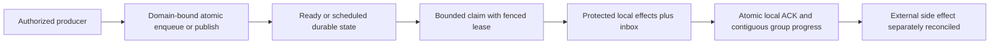

# Messaging

[RemoteTransfers](Messaging/RemoteTransfers.md) and ADR-088 define the current
bounded cross-partition intent/receipt delivery stage. Source implementation does
not close recovery, coordinator, RF3 or the original Messaging acceptance gates.

TASK-RUNTIME-READ-BUDGET-W3 preserves REQ-MSG-009 and AC-MP-005/011/012 after
the exact fa80c701 macOS failure of
SourceReadBudgetTests.AcMp005ExactRawReadBudgetSucceedsAndOneByteShortBudgetFails.
Measure the existing four raw record byte counts from one real persisted store,
then construct exact and one-byte-short DatabaseEngine wrappers over that same
store and authority. Run sequentially without writes. Assert the isolated actual
provider PointExaminedBytes delta equals the computed oracle, the exact read
returns its event and the short read fails BudgetExceeded; a following exact read
must still succeed. Different real timestamp serialization widths across three
independent stores cannot define an exact byte boundary. No budget tolerance,
clock, provider or production/API/data change is accepted. One worker owns only
SourceReadBudgetTests.cs; root owns review, build/format and renewed exact-SHA
multi-OS GitHub proof. ADR035's existing scoped-read contract suffices; rollback
reverts the fixture coordination while keeping its strict negative oracle.

Status: queue, topic, subscription-group, and inbox behavior exists in Core source and unit-test cases; full scheduler/worker/deployment capabilities and GitHub qualification remain pending. The accepted target contract is in [product design sections 37–46](../design/architecture-v0.3.uk.md).

## Purpose, actors, and entry points

Messaging owns durable work-queue state, topic event sources, persistent subscription groups, delivery leases/checkpoints, and atomic database inbox effects. Actors are producers, consumers, subscription managers, internal command processing, and time-transition workers. Current concrete operations are mutation/operation handling in `src/KeyLoad.Core/DatabaseEngine.cs`, queue behavior in `Messaging.cs`, topic/read-source behavior in `EventSources.cs`, and groups in `SubscriptionGroups.cs`. The public command/request contracts live in `src/KeyLoad.Abstractions/Contracts.cs` and `Subscriptions.cs`. No route or external bus compatibility is defined by this feature.

## Canonical slice map and boundaries

| Surface | Current source | Target owner |
|---|---|---|
| Contracts | `src/KeyLoad.Abstractions/Contracts.cs`, `Subscriptions.cs` | `src/KeyLoad.Abstractions/Features/Messaging/` |
| Backend | `src/KeyLoad.Core/Features/Messaging/Execution/Messaging.cs`, `EventSources.cs`, `SubscriptionGroups.cs`, `DatabaseEngine.cs` dispatch | `src/KeyLoad.Core/Features/Messaging/` |
| Tests | `tests/KeyLoad.UnitTests/Features/Messaging/` message/subscription suites; atomic batch cases in `Features/ResourceExecution/TransactionTests.cs` | Messaging and shared ResourceExecution slices; legacy declarations removed with assertions preserved |
| Durable specification | This file | `docs/Features/Messaging.md` |
| HTTP | `src/KeyLoad.Server/ApiEndpoints.cs`: command submit, queue receive/delivery/process/inspect, event read, and subscription configure/seek/pause/receive/delivery/process/status | Shared HTTP transport belongs to `src/KeyLoad.Server/Features/ClientApi/`; business behavior belongs to this Messaging slice. Publish/enqueue mutations use the shared command endpoint. |
| .NET SDK | `src/KeyLoad.Client/KeyLoadClient.cs`: `CommitAsync`, `ReceiveAsync`, `CompleteAsync`, `CommitProcessingAsync`, `InspectAsync`, event-source and subscription methods | Shared client transport belongs to `src/KeyLoad.Client/Features/ClientApi/`; typed queue/topic/group behavior maps to this Messaging slice |
| Official MCP | Not present in current source; official C# SDK MCP integration is planned through ClientApi | Messaging operations must map to this slice after ADR-039 freezes capability/tool mapping; no tool names or routes are asserted |
| UI | No dedicated database messaging UI is specified | N/A: producer/consumer and operations behavior is exposed through API/SDK/MCP, not a separate frontend surface |
| External brokers | No AMQP/Kafka/Redis wire compatibility is implemented here | N/A: adapters are independent, future capabilities with separate contracts and qualification |

Legacy root-level Core and test files are ADR-032 migration debt. Messaging does not own ZoneTree/WAL lifecycle, node placement, search indexes, or external side effects. Work-queue state is atomic only within its bound partition/domain; remote transfer is a separate planned protocol.

## Current source behavior and status boundary

- Enqueue validates message identity/payload/headers and queue policy, applies stored-message/byte quotas, and writes body, metadata, counters, plus scheduled or ready index in the same command. Duplicate lane identity and invalid expiry fail explicitly.
- Receive performs bounded lane scans and deterministic time-based sweeps, enforces byte/message/in-flight/lease limits, and issues signed tokens scoped to incarnation, lane, principal, delivery generation, and lease version. ACK/NACK/renew checks ownership, current lease, and expiry. Retry transitions use configured backoff/attempt limits; terminal states include dead-lettered, cancelled/expired/acked as encoded in the current model.
- `CompleteProcessing` applies protected database effects, inbox outcome, and local ACK in one transaction. This protects database effects within the stored identity/horizon; it does not make CPU handler execution exactly once or external calls atomic.
- Topics are retained source records with positions/generation and bounded source reads. Subscription groups have separate delivery state, filters, leases, seek generation, bounded gaps, and contiguous checkpoint advancement. Independent groups retain independent progress.
- Scheduled message due/lease-expiry transitions are evaluated by command processing from logged evaluation time; the complete persisted scheduler service, clock-sanity/failover protocol, worker SDK/coordinator deployment, remote transfer, recurring occurrences, sagas, and paused cluster restore are not established by these files/tests. Do not present them as source-present.

## Requirements and acceptance

### Accepted TASK-MP-007F queue read-work repair

REQ-MSG-007 maps AC-MSG-001/002/004/005 and AC-MP-006/012 to reuse of real stored
body lengths, counters and validated leases. Enqueue serializes its MessageBody
once, checks quotas against those exact bytes and stages that same payload through
the existing owned provider write. Sweep, Receive and delivery completion decode
borrowed body bytes once and carry their observed stored length; they retain
existing absent/corrupt-body checks and do not reserialize for byte subtraction.
Valid persisted bodies retain the same counters, quotas and format.

Carry a lane's counters through each bounded Sweep/Receive loop and stage the
final value before return; no counters read is required for an empty sweep.
Processing verifies token scope before inbox replay, then validates the lease
once and passes it to the same private delivery transition. Direct delivery keeps
resource validation before lease validation; processing keeps its existing lease
error before subsequent resource validation. The ACK counters/body transition is
staged before effects so released input quota can fund an atomic output. Preserve
FIFO/ready sequence, recorded command time, expiry/backoff/attempts, generation,
token fencing, field projection, receipts and rollback. No scheduler, public API,
signing, schema or cross-partition protocol change is authorized.

Ready receive also visits borrowed ready-index records and stops as soon as it
has staged the requested number of deliverable messages. Expired entries still
count toward the fixed 256-record examination ceiling and are expired in FIFO
order. Since a range visitor may not mutate its transaction, it records only the
bounded transition inputs during traversal and applies them afterward. A real
store diagnostic regression with more than 256 ready messages requires a
single-message receive to examine only its first index entry.

Worker owns only Messaging.cs private queue/body/lease/processing regions and new
matching Core/UnitTests Features/Messaging helpers/tests; Sign/Verify/Inspect,
EventSources, shared contracts/DatabaseEngine/docs/CI remain lead-owned. Real-store
tests precede code: exact stored body bytes and one-byte-short quotas, multiple
ready/scheduled/expired/leased entries, NACK/ACK/renew, stale/foreign/expired token,
producer/effects failure rollback, inbox replay and healthy next claims. Existing
tests are preserved. CI owns TUnit/recovery/RF3 execution; provider lookup counters
and server allocation/RSS evidence remain separate MP-011 work before measured
read or memory improvement claims.

TASK-RUNTIME-QUEUE-W2 completes the preceding TASK-MP-007F contract after exact
run37015193756 at ad594642b4f1a05ac5df0fff0a33b562f4aebf87 proves a remaining
257-index-entry scan for one delivery. Its regression matrix retains the existing
300-message one-entry/FIFO assertion and adds actual stored expired-before-live
and fixed256-examined-entry cases. The callback captures only bounded owned
transition inputs; every transaction mutation follows traversal. Existing
MaxMessages/MaxBytes/in-flight quotas, counter reuse, recorded expiry time,
signed-token/lease fencing, projection, rollback and receipts are unchanged.

The same worker repairs the absent-body negative fixture to assert propagated
KeyLoadException(Corruption), the existing atomic command fail-closed contract,
and unchanged ready index/counters/body/position/apply state. Malformed-body
Validation, restoration and successful subsequent receive remain required.
The worker owns only QueueReadyClaims.cs, necessary new Messaging input helper,
ReadyQueueRangeTests.cs and QueueBodyAccountingTests.cs; lead owns docs and the
integration join. Tests-first source precedes implementation; exact multi-OS
GitHub unit/recovery/RF3 proof follows enabled build/format/governance. No
persisted/wire/data migration; source rollback restores only traversal/fixtures.
This is not a measured throughput, physical-I/O or memory improvement claim.

### Accepted TASK-MP-007G topic publication read-work repair

REQ-MSG-008 maps AC-MSG-003/005 and AC-MP-006/012 to a single SourceResource and
TopicHead read during Publish. Carry the same retained raw head's tail, first
available position, generation and stored bytes through publication. A shared
topic-head helper supplies the existing absent-head defaults and generation error;
other SourceHead callers keep their validation and stream behavior. Event bytes
are already serialized once and reused for staging; preserve that property.

Worker owns EventSources.cs private TopicHead/SourceHead/Publish regions and new
matching Messaging helpers/tests only. Public reads/cursors, SourceRecord,
Subscriptions, queue work, shared contracts/docs/CI remain out of scope. Real-store
tests first cover exact/one-byte-short retained byte quota, absent/stale head,
multiple events, duplicate IDs, paused/invalid input and producer rollback with
unchanged source tail/partition event sequence. Serialized shapes, generation/error
order and persisted/wire formats remain; source rollback needs no conversion.
Build/static review and GitHub TUnit/recovery/RF3 proof are required; measured
point-read reduction awaits provider counters under MP-011.

### Accepted TASK-MP-007H source-read work and output contract

REQ-MSG-009 maps AC-MP-005/006/012 to unified retained topic/stream reads and the
shared private SourceRecord decoder. ReadEventSource adds optional caller
cancellation, uses the DatabaseEngine business clock, and starts one budget before
entering the actual store gate. A gate-scoped ResourceExecution read-view adapter
charges principal, catalog, head and every event lookup before copy/decode while
reusing existing persisted authorization helpers. It cannot escape the gate.
SourceResource is validated once; a private validated-head helper and cursor check
reuse that exact resource/schema. Existing independent SourceHead/cursor callers
still validate their own authority; subscription state/claim algorithms are outside
this task.

SourceRecord decodes the real topic/stream record directly from borrowed bytes,
without an owned raw array, for all existing callers. Missing history retains its
typed failure; a persisted source/stream identity or position mismatch is Corruption
rather than returning or processing another record. Valid wire/persistence/position
and projection semantics stay identical. The read loop increments only while below
the tail, so an empty long.MaxValue tail does not wrap. Incremental projected-event
measurement rejects excess before adding it, and full EventSourcePage measurement
includes source/head/cursor/cut/HasMore even for an empty page. No serialized
temporary byte array, new persistence format or public cursor purpose is introduced.

TASK-MP-007H owns EventSources.cs SourceRecord, SourceHead/SourceCursorPosition
and ReadEventSource regions only, new Core/UnitTests Features/Messaging source-read
helpers/tests and the new Core/Features/ResourceExecution budgeted view. Publish,
TopicPublishReads, queue/group state, shared contracts, DatabaseEngine.cs, server/
Orleans routes and shared docs are forbidden worker writes. Lead adds the budget's
internal cancellation accessor before delegation; API/grain token forwarding awaits
the concurrent routing owner's join.

Tests first use real ZoneTree/persisted policies: topic and stream page/order/cursor/
redaction, absent/stale source and wrong-scope/expired/tampered cursors, missing or
corrupt records, exact/one-byte-short measured raw work, complete-envelope rejection,
pre-/mid-cancellation and a healthy subsequent read. Compare quiescent provider
counter deltas for one principal/catalog/head lookup and one lookup per returned
event; restored data survives negative tests. Real response cursor time can vary,
so envelope tests assert definite metadata rejection, without a timing-dependent
single-byte expected cursor length. GitHub runs all tests and RF3 proof; source
rollback needs no data conversion. Authored counters/tests are not measurements.

| Requirement | Measurable acceptance | Existing TUnit evidence or planned test |
|---|---|---|
| REQ-MSG-001: persist queue state and enforce lease fencing | AC-MSG-001 passes when enqueue is quota-atomic, bounded receive creates a current lease, stale/expired/foreign tokens cannot ACK or renew, and NACK/retry reaches a visible terminal policy state. | `QueueQuotaFailureRollsBackProducerDocument`, `ExpiredWorkerCannotAckAfterReclaimAndAttemptsReachDeadLetter`; planned malformed token, lease renewal race, expiry/cancel matrix. CI pending. |
| REQ-MSG-002: protect database effects with inbox plus ACK | AC-MSG-002 passes when effects and ACK commit or roll back together, same handler input/fingerprint reuses its receipt, changed effects conflict, and stale delivery cannot commit. External calls remain outside the transaction. | `InboxEffectsAndAckAreAtomicAndReplayCannotApplyDifferentEffects`, `ProcessingReleasesInputQuotaAtomicallyAndFailureRestoresItsLease`, `ProcessingEffectsAndAcknowledgementRollBackTogetherAndInboxSurvivesReplay`, `InboxCanAcknowledgeAHandlerWithNoAdditionalMutations`. CI pending. |
| REQ-MSG-003: isolate topic/group delivery and advance only contiguous prefixes | AC-MSG-003 passes when groups keep independent progress, filters/seek generations do not skip retained inputs, later ACK cannot advance beyond a gap, and quota failure rolls back the publishing producer batch. | `IndependentGroupsRetainOnePayloadAndAckOnlyAContiguousPrefix`, `GapWindowStopsNewClaimsUntilTheMissingPrefixIsAcknowledged`, `CursorStartAndDeterministicFilterDoNotSkipPendingEvents`, `SeekFencesOldTokensAndRequiresExplicitResume`, `TopicQuotaFailureRollsBackTheProducerDocumentAndEventCounter`. CI pending. |
| REQ-MSG-004: apply scheduled and retry time transitions from recorded command time | AC-MSG-004 passes when not-yet-due work is not delivered, due work is discoverable on a later receive, retry delay/expiry and lease races produce deterministic visible states, and no worker-local timer is treated as authority. | Existing `ExpiredWorkerCannotAckAfterReclaimAndAttemptsReachDeadLetter`; planned logged-time boundary, restart, skew, renew-vs-expiry, and late-delivery tests. No completed scheduler qualification claimed. |
| REQ-MSG-005: atomically batch local document/event/queue effects | AC-MSG-005 passes when a same-domain producer failure leaves no partial document/event/message and command retry does not repeat the effects; unrelated domains are rejected. | `DocumentEventAndQueueCommitTogetherAndCommandRetryDoesNotRepeatEffects`, `UniqueConflictRollsBackDocumentIndexEventAndEnqueue`, `SameLiteralPartitionKeyCannotCrossTransactionDomains`. CI pending. |
| REQ-MSG-006: deliver remote outputs and recurring occurrences under frozen contracts | AC-MSG-006 (PLANNED) passes only when a remote output intent remains pending until destination dedup receipt is committed, and retry after crash, timeout, or unknown ACK creates one destination effect and a visible source outcome; recurring scheduling produces a stable occurrence identity under the approved timezone/misfire rules and survives restart without silently skipping or duplicating an occurrence. | Planned `RemoteTransferRetryCrashAndUnknownAckHasOneDestinationEffect`, `RecurringOccurrenceIdentityTimezoneMisfireAndRestartAreStable`; KL-094/KL-100 failure suites. The protocol choices must be frozen before implementation; current source does not satisfy or qualify this AC. |

## Flows and failure behavior

Positive: producer commits a local message; consumer claims a bounded batch, executes permitted work, and commits inbox effects with ACK. Negative: quota, permission, validation, stale token, exhausted retry, or required-input failure rejects or parks without silently advancing a checkpoint. Edge: lost response is resolved by stable request/command identity; expired worker cannot complete a newer lease; out-of-order group completion retains a gap; a topic/group cursor is scoped by generation. Errors must not leak delivery tokens or protected payload. Cancellation is an input to the caller operation; it is not evidence that an already committed command was undone.

## Decisions and verification

Related: [ADR-002](../ADR/ADR-002-command-idempotency.md), [ADR-003](../ADR/ADR-003-durability-ack-barrier.md), [ADR-007](../ADR/ADR-007-replica-consensus-bootstrap.md), [ADR-008](../ADR/ADR-008-backup-log-retention.md), [ADR-010](../ADR/ADR-010-query-budgets-security.md), [ADR-014](../ADR/ADR-014-principals-rbac-row-policy.md), [ADR-015](../ADR/ADR-015-sensitive-data-lineage.md), and [ADR-016](../ADR/ADR-016-atomic-physical-placement.md). Cross-resource and delivery decisions: [ADR-024](../ADR/ADR-024-transaction-domain-binding.md), [ADR-026](../ADR/ADR-026-fenced-delivery-inbox.md), [ADR-027](../ADR/ADR-027-contiguous-subscription-checkpoints.md), [ADR-028](../ADR/ADR-028-persisted-scheduling-time.md), [ADR-029](../ADR/ADR-029-event-message-classification.md), [ADR-030](../ADR/ADR-030-retention-paused-restore.md), and [ADR-031](../ADR/ADR-031-modular-all-in-one-resource-isolation.md).

Current test method names are source references, not results. Product qualification remains GitHub Actions only: TUnit, recovery, and Aspire RF3 through .NET SDK and official MCP clients. Official MCP RF3 parity is required and pending. No exactly-once handler or external action claim is made. AMQP/Kafka/Redis compatibility, remote partition transfers, recurring schedules, sagas, and a full scheduler/worker service remain planned.

## TASK-EVENT-QUEUE-WHOLEFLOW-001 — bounded native operation regression proposal

This source-only regression batch preserves the existing ADR-002/024/026/028
contracts and REQ/AC-EVENT-004/005 plus REQ/AC-MSG-001/002/005. Its original
architecture task subset is KL-083 (append OCC/content identity), KL-087 (lost
claim/ACK reply recovery) and KL-091 (same-domain batch precondition rollback).
It does not close those tasks or qualify the full EventStreams/Messaging feature.

The owning unit cases are
[EventAppendWholeFlowTests](../../tests/KeyLoad.UnitTests/Features/EventStreams/Cases/EventAppendWholeFlowTests.cs)
(two concurrent Exact append instances and four rejection instances),
[QueueLostResponseWholeFlowTests](../../tests/KeyLoad.UnitTests/Features/Messaging/Cases/QueueLostResponseWholeFlowTests.cs)
(one claim/ACK retry workflow with real ZoneTree reopen), and
[QueueAdmissionCancellationWholeFlowTests](../../tests/KeyLoad.UnitTests/Features/Messaging/Cases/QueueAdmissionCancellationWholeFlowTests.cs)
(two pre-admission cancellation instances). They use actual native storage,
joined workers, literal complete results, persisted-state assertions, stable
receipt replay and a healthy follow-up. Failed commands may retain authorized
outcome/clock records; rejection tests assert complete affected domain-family
state rather than falsely requiring no committed failure outcome. Pre-admission
cancellation asserts the entire store and position remain unchanged and checks
the original token. It does not claim cancellation after commit undoes effects.

The exact proposed native inventory is nine. Current normal/scalar execution,
seeded process-crash criteria and real RF3 SDK/MCP qualification remain required;
source review is not execution evidence. Original historical passing cases and
retained global failures remain separate from this proposal.

TASK-EVENT-APPEND-SEEDED-CRASH-001 preserves REQ-MSG-005/AC-MSG-005 and original KL091 through the exact seven native during-append process cuts and original child/readers/store-lock ownership frozen in [EventStreams](EventStreams.md#task-event-append-seeded-crash-001) and ADR002. The new complete recovered doc/event/head/dedup/queue/outbox/receipt and same-ID/healthy-follow-up assertions use real ZoneTree and current serialization. No runtime qualification, timeout change, multi-lane or power-loss claim follows from source. Existing required Linux/RF3/coverage gates remain unchanged.
