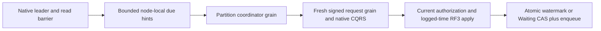

# DueCoordination within Messaging

Accepted S2 contract for KL-100, REQ/AC-JOBS-005 and
[ADR-094](../../ADR/ADR-094-orleans-due-coordination.md). S1 canonical records,
UTC due arithmetic, caller/creator checks, occurrence identities, queue limits
and atomic transitions remain the authority. No separate durable due index or
storage-format transition is introduced.

TASK-DUE-NATIVE-BUDGET-ORACLE preserves REQ/AC-DUE-001 after the original
Linux run37249197752 exact-byte test failure. Expected native bytes must use
the actual fixture's lane and canonical persisted record, and account for
both the fixed-tail capture and forward scan including native lookahead.
Retain inclusive exact-cap success, one-byte-less BudgetExceeded and distinct
admitted-value bytes. Luna query_wave owns only a private correction to
DueWorkNativeReadBudgetTests and a cohesive test helper if necessary. It must
not change storage charging, limits, canonical data or the criterion; a source
charging defect requires root review before expanding scope. Root integrates,
runs the actual Aspire normal/scalar caller and retains original failures.

TASK-DUE-RF3-AUTH-ORACLES preserves REQ/AC-DUE-002/003/004 and
REQ/AC-JOBS-004/005 after original run37242346547 at5fa61f2. Luna lifecycle_wave
owns a private overlay of DueFaultRf3SeedWriter, DueNoQuorumRf3Run,
RecurringSagaRf3Support, RecurringSchedulePolicyRf3Tests and
DueRecurringRf3Assertions, plus a feature-local pure creator model and identity
writer if required. Root owns these docs, source joins and all gates.
Configure the leader/cold-wave schedule and saga using a real persisted scoped
principal/API key created by the private profile administrator. The administrator
may configure resources and identity; it must not substitute for the retained
schedule/saga creator or receive an authorization bypass. Bind the exact three
queue scopes, required capabilities and actual payload/header policies and
field grants; preserve every canonical identity, deadline, replay and cold/fault
assertion. Keep credentials only in the private owned fixture, never a receipt.
For the no-quorum case, keep the restricted creator for all database work and
use the existing profile administrator only for the restored/survivor Status
topology assertions. Preserve exact leader, voter, caught-up and single-effect
checks. Protected schedule redaction paths are JSON pointers: the independent
oracle is payload:/secret and headers:/secret, with unchanged projected bodies,
ordered paths, cross-client parity and no-disclosure checks. No product change,
new fault, clock, role supplied by a client, corpus/timing reduction or weakened
assertion is authorized. Existing ADR-092/094 remain sufficient; no new wire,
storage, trust boundary or topology is introduced. Implement setup authority,
restricted-work/admin-status separation, then exact projection oracles; review
all base/post hashes before root joins and runs serialized Aspire RF3. Source
and compiler success alone do not close these criteria or the full118-case gate.

TASK-DUE-RF3-C adds the genuine no-quorum public recurrence gate for AC-DUE-003.
TASK-DUE-RF3-BUILD preserves AC-DUE-002/003/004 and ADR-094 while making the
existing S1 and S2 Messaging RF3 fixtures compile under the unchanged repository
analyzers. Luna lifecycle_wave owns a private overlay of Messaging test files
only, using the exact diagnostics from build56. Resolve actual contract members,
unnecessary imports and nullable checks; extract executable units without
changing their assertions, corpus, timing, faults or client paths. Each actual
wave and official MCP client must have explicit ownership and unconditional
joined disposal on every path, retaining both primary and cleanup failures.
Use try/finally and the existing failure observer rather than swallowing a broad
primary exception. Never replace cleanup with detached work or suppress a
diagnostic. Root reviews the complete diff, joins after the current build ends,
and owns full solution build, formatter and actual Aspire RF3 execution. A
compiler fix is source evidence only and cannot close the runtime gate.

TASK-DUE-ACK-DISCOVERY maps AC-DUE-003 to the remaining actual lost-ACK gate.
Luna lifecycle_wave reads the native request phase observers and existing scoped
RF3 fault fixtures and writes only a private source-bound proposal. Identify the
exact real phase between committed autonomous due effects and receipt delivery,
the original task/stream cleanup join, persisted creator and stable command
identity, and independently observed SDK/MCP outcomes after restart/retry. No
new test hook, public endpoint, trusted caller role or write-capable change is
approved by discovery. Root freezes the exact fault/ownership contract before
implementation; a delayed or rejected uncommitted attempt is not lost-ACK proof.

Luna lifecycle_wave owns only new Messaging Cases/Helpers/Assertions/Models files
in a private current-source overlay; root owns the shared wave fault join and
gates. Start an isolated all-current Aspire RF3 wave with its immutable image
proof and persisted profile. Configure a unique future UTC recurring schedule
through the actual SDK, next interval one day, protected persisted creator and
an independently derived expected occurrence ID. Require exact SDK/MCP ordinal0
and no occurrence before the due instant. Capture actual leader/voter identities,
kill two scoped owned voters before the deadline (including the actual leader),
and retain their genuine failure receipts; never launch independent Docker nodes.

Keep only one voter through the real due instant plus a five-second observation
window. Its readiness must be503 and SDK plus official MCP authorized database
reads must reject with the actual closed unavailable-quorum contract; MCP initial
503 is acceptable only before a session exists. Do not infer a readable zero
watermark from a failed read or claim to have inspected uncommitted storage.
Restore exactly one original killed voter using the owned AppHost resource, prove
its discovery address changes while the continuously running survivor's does
not, and require autonomous ordinal1 with the exact ID/due instant/definition,
full projected cross-client parity and no ordinal2. Restore the last voter and
verify caught-up applied state and unchanged one-occurrence outcomes on all3.
All resources, actual tasks and native handles must settle on every path; retain
primary and cleanup failures. No manual Emit, fake clock, service-disable switch,
direct Apply or trusted caller roles. This proves the public quorum boundary and
resumed single effect; exact offline no-quorum-state and lost-ACK injection remain
separate mandatory evidence and cannot be claimed from this case.

| Requirement | Measurable acceptance and automated mapping |
|---|---|
| REQ-DUE-001: finite fair discovery | AC-DUE-001: real ZoneTree schedules/sagas spanning more than a page, canceled/not-due/terminal records, mixed full partitions and concurrent lower/higher-key insertions preserve a fixed sweep upper bound; every readable preexisting key is visited, page count is at most32, actual examined bytes include lookahead and differ explicitly from admitted bytes, cancellation rejects executable work, no payload or open view escapes. Unreadable provider frames fail explicitly. `DueJobDiscoveryTests` |
| REQ-DUE-002: native isolated Orleans execution | AC-DUE-002: per-silo grain service wakes the current leader only; a partition-keyed coordinator grain creates a fresh request GUID and signs the existing typed Batch, consumes native ManagedCode CQRS to settlement, scopes the creator ID through ManagedCode identity/RequestContext, and reloads persisted authority. Production DI/Graph joins and actual Aspire RF3 autonomous emissions pass. `DueCoordinationRf3Tests` |
| REQ-DUE-003: canonical retries and lifecycle | AC-DUE-003: duplicate hints/timers, lost ACK, cancel/completion, creator revocation, restart and leader loss preserve one occurrence identity or one saga timeout; no-leader does not change canonical state; stop cancels and joins all started work before storage shutdown. Native process and RF3 tests |
| REQ-DUE-004: bounded admission and visible failures | AC-DUE-004: one page and one dispatched job per service at a time; fixed tick and total job deadline, at most one retry with the same command ID for uncertain transport, failed jobs cannot monopolize the page, safe structured failure diagnostics contain no templates/credentials/IDs; healthy subsequent jobs still run. Unit and actual RF3 failure/cancellation cases |

Discovery is a trusted node-local internal API, never an SDK/MCP operation. It
reads unchanged `recurring-schedule` and `saga-state` native prefixes. Each prefix
has its own disposable owned cursor: incarnation, ReadGeneration, fixed encoded
upper key and last visited key. Capture the tail with bounded reverse VisitRange;
scan forward up to that captured tail, then begin a new sweep. Alternate prefixes
after completing each page. New keys behind the cursor are found on the next
sweep; new keys beyond the captured tail cannot indefinitely delay older keys.
Reset cursors after incarnation/ReadGeneration change and restart. They are hints
and never claim a cross-page snapshot or authoritative due ordering.

Use borrowed VisitRange bytes, charge examined bytes (including lookahead) before
native decoding, cap a page at32 records and admitted/decoded value bytes at
DatabaseLimits.MaxBatchBytes, and
check a100ms discovery deadline before/after work. A single corrupt or oversized
record within the readable provider range yields a safe rejected-record marker and advances its bounded key rather
than executing it or indefinitely starving the following key. Actual examined
bytes include the borrowed lookahead/rejected row and remain bounded by the
native ZoneTree64MiB range-work ceiling; they must never be reported as admitted
bytes. If a valid next value would cross the admitted page budget, stop before
decoding/copying it and retain the preceding key so the value is revisited. A
single value above MaxBatchBytes is not decoded/copied: reject it, advance only
its canonical bounded key and stop that page. A physically unreadable frame or
range exceeding the native ceiling fails explicitly; no unknown key is invented.
The cursor key ceiling is4,096 bytes. A raw key above that ceiling, including
captured-tail discovery, fails the page/prefix with Corruption before copying;
it cannot be skipped using an incomplete key or a lossy cursor. The service
defers this prefix and permits the alternate prefix to progress on later ticks.
Such rejection
must remain observable; it is not a successful complete index. Decode and check
the entire canonical key, full lane, identity, revision/generation/ordinal,
supported UTC definition and checked due arithmetic. Return only owned metadata
(kind, full lane, ID, creator ID, generation/revision/ordinal and due instant),
never templates/state JSON or retained views. Local time only selects wake hints;
leader-logged EvaluatedAt is the sole due decision at apply.

`RecurringDueGrainService` runs on each silo; after native runtime readiness it
uses the borrowed consensus leader check and quorum read barrier before one
page. It keeps at most32 owned hints and drains them before advancing the scan.
Only one job is in flight. Every page cycle waits1second through TimeProvider. Routing
uses `IRecurringDueCoordinatorGrain` keyed by complete AtomicPartitionId; moving
this activation cannot move native storage handles. The service is not a new
write authority and does not call DatabaseEngine.Apply or SubmitNativeAsync.

The coordinator creates one Batch containing EmitRecurringOccurrences(max1) or
ExpireSaga(expected revision), preserving full identity and current creator.
Each newly admitted ProcessDueAsync dispatch owns a fresh nonempty command GUID,
chosen once after the real barrier and persisted creator reload. Keep that GUID
and payload unchanged across its one uncertainty retry; each native request still
uses a fresh request GUID. Later scans and post-restart dispatches are new attempts
and use new command GUIDs, including after a definite denied or not-yet-due result.
The canonical schedule generation, logged due time, monotonically advanced ordinal
and occurrence message identity, and saga Waiting/revision CAS remain the durable
effect authority. An identical external retry using the actual service-attempt
command GUID, creator and body keeps the existing canonical receipt semantics.
No public deterministic command-ID derivation from a hint is promised.
For each attempt it creates a fresh IRequestGrain GUID, sets the existing bounded
native request state and subject-only claims, signs via GrainRequestCodec, and
drains the existing native CQRS stream. One5second dispatch deadline includes
both attempts; an uncertain result may retry once using the SAME command ID and
payload but a new request GUID. After a definite failure or exhausted uncertainty,
release the job and continue the page. Creator reload, hint validation and handled
transport failures are isolated per job; a rejected creator cannot repeatedly
abort the page before healthy following jobs. The service deadline includes
routing and activation as well as native stream settlement. Stop cancellation
still escapes the per-job error boundary and joins all started work. Future
discovery rechecks canonical state;
restart does not require retaining the command ID because S1 atomic watermarks
and Waiting CAS already prevent duplicate occurrence/timeout effects. Definite
NotDue caused by clock skew is deferred, never treated as an emitted occurrence.
Fresh command IDs on later scans cannot weaken canonical generation/cancel/CAS.

The existing identity scope/admission helpers move to ClusterRouting/Identity
in the Orleans assembly and are shared by Server and this coordinator. Preserve
exact native limits, claims, context restoration and request/command correlation;
do not copy a second weaker implementation. The native grain-service marker is
`IRecurringDueGrainService`, alias `keyload.orleans.messaging.due-service.v1`,
and derives from the actual Orleans IGrainService system-target contract. Native Graph permits service entry
into this coordinator and coordinator-to-IRequestGrain only; the existing request
to database-grain edges remain unchanged. Core grants internal visibility only
to Orleans/Server for this trusted node-local discovery join.

Ordered tasks: root freezes requirements/ADR and shared visibility/identity/DI/
Graph joins; Luna cluster_wave prepares new Core Messaging Queries/Models/
Validation, Orleans Messaging GrainServices/Grains/Contracts/Execution and new
Messaging UnitTests in a private patch while root tests a stable compilation.
Root reviews and integrates; an independent worker creates actual autonomous
RF3 SDK/MCP cases after the runtime is frozen. Root owns Aspire build/unit/
recovery/RF3 and exact-source Linux receipts and stage commits. No worker runs
gates, edits shared composition or changes public/persisted S1 contracts.

TASK-DUE-RF3-A refines AC-DUE-002/003/004 with independent public observations.
Luna cluster_wave owns only new Messaging Cases/Helpers/Assertions/Models/
Contracts files in a private patch; root owns all shared fixtures, service/Graph
registration, gates and integration. Reuse the existing genuine Aspire
ClusterFixture and real SDK/official MCP clients, a unique canonical partition,
persisted resource policies and persisted scheduler identities. Never call
EmitRecurringOccurrences or ExpireSaga, invoke internal grains directly, alter
clock/storage bytes, disable the service or synthesize a successful response.

Use future UTC definitions with a long next interval so each schedule has
exactly one due ordinal during the finite test. Before the due instant, revoke
the protected creator's field-use grant while retaining scheduler/write grants,
and cancel a separate schedule through the real API. A healthy eligible schedule
in that same partition must progress autonomously while the revoked schedule
keeps its exact revision/generation/watermark and the canceled one emits
nothing. Restore persisted creator authority and require exactly one occurrence
with the independently derived full identity and exact NotBefore; repeated
SDK/MCP inspection cannot create a second ordinal. Assert exact projected copy
and complete cross-client value parity, not only nonnull responses.

A separate healthy future Waiting saga with a configured timeout must reach
TimedOut revision2 without an explicit expiry caller, enqueue exactly one
independently named timeout at its stored deadline, and remain unchanged under
later public inspection. Use the real destination consume/ack flow to prove
that no second timeout remains. All native SDK/MCP errors, cancellation and
test cleanup stay observable. This first autonomous public stage does not
qualify actual leader loss, RF3 cold restart or lost-ACK phase injection; those
remain mandatory follow-on cases and may not be closed by these source tests.

TASK-DUE-RF3-B refines AC-DUE-003 for actual leadership and cold restart. Luna
lifecycle_wave owns only new IntegrationTests Messaging files named
`DueFaultRf3*` under Cases/Helpers/Assertions/Models/Contracts, prepared privately.
Reuse RequestCqrsRf3Wave's owned current-image AppHost and the exact verified
current image/profile contract; no old executable, migration, alternative
Docker launch or shared-fixture fault is needed. Seed one future schedule with
a long interval and one future Waiting saga through SDK/official MCP. Capture
authoritative physical node statuses and signed current discovery, identify the
actual leader from those statuses, and stop that owned voter before either due
instant. Prove setup completed before due rather than racing the clock.

Through the two real surviving endpoints, observe a compatible replacement
leader and autonomous one-occurrence/one-timeout outcomes with independent IDs,
exact stored due times, watermark1 and TimedOut revision2. Never issue emit or
expiry commands or call internal coordinators. Restart the same physical voter
through the owned AppHost, require changed signed runtime generation and caught
up state, and verify the same SDK/MCP values without another canonical effect.
Fully settle the wave, then cold start homogeneous current RF3 on those same
owned targets/profile. Use new real client sessions, require changed generation
on all three voters, preserved occurrence/timeout/state and real destination
consume/ACK/no-second-timeout evidence. Retain roots on primary or cleanup
failure; delete success roots only after every owned process and disposal joins.
Root owns all production/shared joins and execution. This source stage does not
qualify lost-ACK interruption, no-quorum fault or performance/endurance gates.

The sole shared B fault join is root-owned
`RequestCqrsRf3Wave.KillLeaderAsync(string, CancellationToken)`, delegating to
the existing scoped ContainerRuntimeControl with the exact scenario
`messaging-due-leader-loss`. Preserve the existing KillAsync follower-loss
scenario and all native resource/ownership checks. Do not record a leader stop
as a follower-loss receipt.

Frontend N/A: scheduling is exposed through existing Batch SDK/MCP operations
and current inspection. New SDK/MCP syntax N/A; existing S1 commands are used.
Rollback stops the coordinator under a capable epoch7 reader and retains all
canonical data. No compatibility fallback, automatic migration, power-loss or
production qualification claim follows from local development evidence.

### Accepted definite-outcome retry repair, 2026-10-05

TASK-DUE-FRESH-ATTEMPT maps REQ/AC-DUE-002..004 to the concrete original CB5
recurring revocation/restoration failure. The former deterministic v1 hint hash
reused a durable PermissionDenied forever after authority restoration. It also
retained a successful no-op if leader-logged time preceded the hinted due instant.
Replace only that active internal attempt selection with one fresh Guid.NewGuid
per newly admitted coordinator dispatch. Remove its obsolete deterministic
helper and hash-only unit case; do not retain a runtime compatibility dispatcher.
The existing original command outcomes and frozen canonical entity/occurrence
digests are unchanged. No stored record, alias, Id, public mutation, codec or
reader-format version changes. Old command receipts remain addressable by their
original IDs through unchanged replay; no live store is rewritten.

cluster_wave Luna/high owns only the coordinator's one command-ID selection,
removal of DueWorkCommandIdentity and its obsolete test, and new Messaging
Cases/Helpers demonstrating on actual ZoneTree that a denied original command
remains durably denied after current persisted grant restoration while a fresh
command emits one exact canonical occurrence. Include a repeated original/fresh
retry and original schedule/queue/outbox state oracle; do not weaken outcome
caching or call direct Apply from Orleans. Root owns the docs/shared joins and
actual Aspire gates. The unchanged full RF3 recurring autonomous case must pass
without manual Emit, service disabling, fake time, threshold or wait increases.
Real lost-ACK/native service retry, no-quorum/restart and complete Linux evidence
remain mandatory separately; source or Core regression alone does not close S2.
Rollout is homogeneous current capable nodes, retaining all original outcomes,
watermarks and native recovery journals. Rollback of this repair reintroduces the
denied-result retry defect and cannot be described as restoring correctness.

The fresh-attempt unit oracle distinguishes denied/no-op effects from a real
successful Batch. Denial and denied replay leave the captured outbox head
unchanged. A successful one-mutation emission appends exactly one canonical
OutboxEntry containing the original typed EmitRecurringOccurrences, receipt,
commit token and committed timestamp. Compare every typed field, including empty
composition references, independently; capture that first native stored byte
snapshot and require byte-for-byte stability on original/fresh replay, with exact
stored-byte counter delta. Generated record equality includes private/default
ImmutableArray backing identity and is not a semantic receipt oracle. Native
object-reference encoding is not an independent canonical byte encoding for a
newly constructed equivalent object graph. Original/fresh replay cannot append
a second entry. Root owns the
DueFreshAttemptAssertions correction and tests through Aspire. This preserves
the existing committed projection contract and strengthens the first source
fixture, whose unchanged-head success assertion was incorrect.

TASK-DUE-RF3-CREATOR-CALLERS refines the existing AC-DUE-003 B fixture before
implementation. Actual R196 reached replacement leadership, then the first SDK
schedule inspection failed with PermissionDenied: the seed discarded its
persisted scoped creator credential and subsequent data calls used the separate
cluster administrator. RecurringSaga intentionally disables the administrator
bypass for data inspection. Preserve that production authorization contract.

Carry the existing redacted `DueFaultRf3Creator` with the private seed, and redact
the seed's own generated ToString. Use that persisted creator for every schedule,
saga, queue-message, receive and ACK operation after leader loss, voter rejoin and
cold restart. Give this fixture-owned principal the existing QueueConsume scope
needed by the already-required consume/ACK flow, alongside its existing scoped
SchedulerManage/QueuePublish/QueueInspect and field grants. Persist grants through
the real admin configuration API; no caller role, fabricated principal or broad
administrator data privilege. Administrator credentials remain exclusively on
the existing status/dashboard/discovery control calls. Split the survivor scope
so native dashboard assertions retain admin authority and data inspection uses
the creator; preserve every original assertion, command/occurrence identity,
read barrier, deadline, signed discovery observation, process join and cleanup.
No credential may enter diagnostic artifacts, assertion-generated object text or
provider logs. The shared no-quorum fixture retains its same authority boundary.

Exact ownership: IntegrationTests Messaging Models `DueFaultRf3Seed` and the
existing `DueFaultRf3Creator` redacted credential; Helpers `DueFaultRf3SeedWriter`,
`DueFaultRf3IdentityWriter`, `DueFaultRf3Leadership`, `DueFaultRf3Run`, and, only
where it performs the same data operations, `DueNoQuorumRf3Run`. Root owns this
freeze, review/joins and genuine SDK/official-MCP RF3 gate; ci_failure_evidence
Luna prepares the guarded private fixture correction. Native unit/format/build
and actual leader-loss/rejoin/cold-restart/ACK operation outcomes verify the
stage, followed by original delivered Linux evidence. Rollback removes only
fixture ownership changes; production authorization, current formats and broad
DUE acceptance remain mandatory. No migration, compatibility reader, new public
API, dependency or relaxed test outcome is introduced.

R204 executed the retained-creator leader/rejoin/cold-restart/outcome flow and
reached its existing final MCP ACK. The creator also needs the distinct persisted
`Capability.QueueAck` for that actual delivery operation, alongside QueueConsume,
on the same existing recurring/saga/timeout lane scopes. Add exactly those
consumption/ACK capabilities in DueFaultRf3IdentityWriter.Scope; preserve every
field grant, principal identity, capability enforcement, token, receipt/replay
and no-second-delivery assertion. This fixture authority correction does not
change product authorization. The prior R204 case failed rather than passed.

R206 completed `AcDue003AutonomousOutcomesSurviveLeaderRejoinAndCurrentColdRestart`
through native TUnit and fixture-owned Aspire Docker RF3 on2026-10-07. The real
SDK/official-MCP flow passed with creator authorization, replacement leadership,
voter rejoin, cold restart, exact outcomes and final ACK/replay/exhaustion checks.
The shared two-case run passed2/2 without skips or source/assembly drift; its
original TRX SHA-256 is
`6b915c662396baa4f25d09e2f3d64b7ff435d07338f3c03ae4e3bab942a62f6f`.
R205 full native Release build also passed with zero warnings/errors or source
drift. This is local development proof; no-quorum, complete current-source Linux
RF3 and the other DUE acceptance gates remain individually open.
