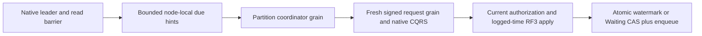

# DueCoordination within Messaging

Accepted S2 contract for KL-100, REQ/AC-JOBS-005 and
[ADR-094](../../ADR/ADR-094-orleans-due-coordination.md). S1 canonical records,
UTC due arithmetic, caller/creator checks, occurrence identities, queue limits
and atomic transitions remain the authority. No separate durable due index or
storage-format transition is introduced.

| Requirement | Measurable acceptance and automated mapping |
|---|---|
| REQ-DUE-001: finite fair discovery | AC-DUE-001: real ZoneTree schedules/sagas spanning more than a page, canceled/not-due/terminal records, mixed full partitions and concurrent lower/higher-key insertions preserve a fixed sweep upper bound; every preexisting key is visited, page count is at most32, read bytes include lookahead, cancellation rejects the page, no payload or open view escapes. `DueJobDiscoveryTests` |
| REQ-DUE-002: native isolated Orleans execution | AC-DUE-002: per-silo grain service wakes the current leader only; a partition-keyed coordinator grain creates a fresh request GUID and signs the existing typed Batch, consumes native ManagedCode CQRS to settlement, scopes the creator ID through ManagedCode identity/RequestContext, and reloads persisted authority. Production DI/Graph joins and actual Aspire RF3 autonomous emissions pass. `DueCoordinationRf3Tests` |
| REQ-DUE-003: canonical retries and lifecycle | AC-DUE-003: duplicate hints/timers, lost ACK, cancel/completion, creator revocation, restart and leader loss preserve one occurrence identity or one saga timeout; no-leader does not change canonical state; stop cancels and joins all started work before storage shutdown. Native process and RF3 tests |
| REQ-DUE-004: bounded admission and visible failures | AC-DUE-004: one page and one dispatched job per service at a time; fixed tick and total job deadline, at most one retry with the same command ID for uncertain transport, failed jobs cannot monopolize the page, safe structured failure diagnostics contain no templates/credentials/IDs; healthy subsequent jobs still run. Unit and actual RF3 failure/cancellation cases |

Discovery is a trusted node-local internal API, never an SDK/MCP operation. It
reads unchanged `recurring-schedule` and `saga-state` native prefixes. Each prefix
has its own disposable owned cursor: incarnation, ReadGeneration, fixed encoded
upper key and last visited key. Capture the tail with bounded reverse VisitRange;
scan forward up to that captured tail, then begin a new sweep. Alternate prefixes
after completing each page. New keys behind the cursor are found on the next
sweep; new keys beyond the captured tail cannot indefinitely delay older keys.
Reset cursors after incarnation/ReadGeneration change and restart. They are hints
and never claim a cross-page snapshot or authoritative due ordering.

Use borrowed VisitRange bytes, charge examined bytes (including lookahead) before
native decoding, cap a page at32 records and DatabaseLimits.MaxBatchBytes, and
check a100ms discovery deadline before/after work. A single corrupt or oversized
record yields a safe rejected-record marker and advances its bounded key rather
than executing it or indefinitely starving the following key. Such rejection
must remain observable; it is not a successful complete index. Decode and check
the entire canonical key, full lane, identity, revision/generation/ordinal,
supported UTC definition and checked due arithmetic. Return only owned metadata
(kind, full lane, ID, creator ID, generation/revision/ordinal and due instant),
never templates/state JSON or retained views. Local time only selects wake hints;
leader-logged EvaluatedAt is the sole due decision at apply.

`RecurringDueGrainService` runs on each silo; after native runtime readiness it
uses the borrowed consensus leader check and quorum read barrier before one
page. It keeps at most32 owned hints and drains them before advancing the scan.
Only one job is in flight. Idle polling is1second through TimeProvider. Routing
uses `IRecurringDueCoordinatorGrain` keyed by complete AtomicPartitionId; moving
this activation cannot move native storage handles. The service is not a new
write authority and does not call DatabaseEngine.Apply or SubmitNativeAsync.

The coordinator creates one Batch containing EmitRecurringOccurrences(max1) or
ExpireSaga(expected revision), preserving full identity and current creator.
For each attempt it creates a fresh IRequestGrain GUID, sets the existing bounded
native request state and subject-only claims, signs via GrainRequestCodec, and
drains the existing native CQRS stream. One5second dispatch deadline includes
both attempts; an uncertain result may retry once using the SAME command ID and
payload but a new request GUID. After a definite failure or exhausted uncertainty,
release the job and continue the page. Future discovery rechecks canonical state;
restart does not require retaining the command ID because S1 atomic watermarks
and Waiting CAS already prevent duplicate occurrence/timeout effects. Definite
NotDue caused by clock skew is deferred, never treated as an emitted occurrence.
Fresh command IDs on later scans cannot weaken canonical generation/cancel/CAS.

The existing identity scope/admission helpers move to ClusterRouting/Identity
in the Orleans assembly and are shared by Server and this coordinator. Preserve
exact native limits, claims, context restoration and request/command correlation;
do not copy a second weaker implementation. Native Graph permits service entry
into this coordinator and coordinator-to-IRequestGrain only; the existing request
to database-grain edges remain unchanged. Core grants internal visibility only
to Orleans/Server for this trusted node-local discovery join.

Ordered tasks: root freezes requirements/ADR and shared visibility/identity/DI/
Graph joins; Luna cluster_wave prepares new Core Messaging Queries/Models/
Validation, Orleans Messaging GrainServices/Grains/Contracts/Execution and new
Messaging UnitTests in a private patch while root tests a stable compilation.
Root reviews and integrates; an independent worker creates actual autonomous
RF3 SDK/MCP cases after the runtime is frozen. Root owns Aspire build/unit/
recovery/RF3 and exact-source Linux receipts and stage commits. No worker runs
gates, edits shared composition or changes public/persisted S1 contracts.

Frontend N/A: scheduling is exposed through existing Batch SDK/MCP operations
and current inspection. New SDK/MCP syntax N/A; existing S1 commands are used.
Rollback stops the coordinator under a capable epoch7 reader and retains all
canonical data. No compatibility fallback, automatic migration, power-loss or
production qualification claim follows from local development evidence.

