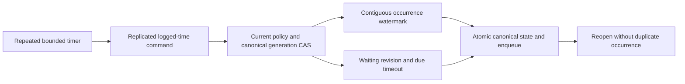

# RecurringSaga within Messaging

Root accepts S1 on 2026-10-04 for KL-100 under
[ADR-092](../../ADR/ADR-092-recurring-saga.md). The product contract is versioned
durable schedules, stable occurrences, saga CAS and atomic timeout messages;
general workflow replay or external exactly-once execution is not advertised.

TASK-JOBS-RF3-PROJECTED-DELIVERY preserves REQ/AC-JOBS-003/004/005 and
AC-DUE-003 after original run37242346547. Luna query_wave owns only private
SagaTimeoutRf3Assertions and DueSagaRf3Assertions, plus only their two receive
helper callsites in SagaTimeoutRf3Tests and SagaDueRf3Tests to pass the actual
already-owned identity.Secret for the no-disclosure oracle. The existing creator has
protected field use/write grants but lacks read permission; receiving a timeout
must therefore return the independently expected empty payload/header objects,
while retaining exact request/message identity, one delivery, lease metadata,
ACK/replay parity and the empty subsequent receive. Add direct no-disclosure
checks on the official MCP receive reply for the protected payload/header and
credential; preserve all existing projected inspection and one-transition
checks. Do not grant new read authority, weaken field policies, change product
projection or omit the receipt/lease oracle. Existing ADR-092/094 suffice since
this corrects the fixture's contradictory read expectation only. Root reviews,
joins and runs the actual Aspire RF3 clients before recording runtime evidence.

## Frozen S1 contracts

Generated native v1 records use sequential IDs from0 and feature-owned literal
`keyload.contract.<kebab-type-name>.v1` aliases. New mutations reuse public Batch
and its stable command inbox. Root owns the central discriminators, validation,
capability/apply/replay joins, public inspection adapters and version admission.

`RecurringScheduleDefinition(QueueLaneRef Lane, Guid ScheduleId,
DateTimeOffset FirstDueAt, TimeSpan Interval, string TimeZone,
RecurringMisfirePolicy Misfire, string PayloadJson, string HeadersJson,
string? OrderingKey=null, TimeSpan? MessageTimeToLive=null)` is the first fixed
interval profile. TimeZone must equal ordinal `UTC`, dates have zero offset,
Interval is1second..365days, and only `RecurringMisfirePolicy.CatchUp` is accepted.
Unsupported timezone/calendar/misfire profiles fail explicitly. TTL, when given,
is positive, no greater than365days, and is relative to the occurrence's due time;
expired catch-up fails without advancing rather than silently losing work.

Mutations and root apply signatures are:

- `ConfigureRecurringSchedule(Definition, ExpectedRevision)` owns
  Definition.Lane.Queue; revision0 creates only an absent schedule. Replacement
  requires exact current revision, increments revision AND generation, and resets
  the next occurrence ordinal to0. Preserve the original persisted creator ID.
- `EmitRecurringOccurrences(Lane, ScheduleId, ExpectedGeneration,
  MaxOccurrences=1)` owns Lane.Queue. It emits at most32 currently due contiguous
  occurrences, leaving further backlog due. It uses only the supplied replicated
  operation's logged `now`, never a worker-local clock. A stale generation fails
  TokenInvalidated. No currently due occurrence returns the existing revision.
- `CancelRecurringSchedule(Lane, ScheduleId, ExpectedRevision)` cancels only the
  expected revision. Canceled schedules never emit; replacement is explicit CAS
  and a new generation. Retain canceled state and its issued watermark.
- `CompareExchangeSaga(Lane, SagaId, ExpectedRevision, Phase, StateJson,
  Deadline=null, Timeout=null)` owns Lane.Queue. SagaPhase is Waiting, Completed,
  Cancelled or TimedOut. Revision0 creates Waiting only; exact CAS can update
  Waiting or terminate it with Completed/Cancelled. Direct TimedOut is invalid.
  Terminal state cannot be revived or overwritten. Deadline and Timeout are
  supplied together only in Waiting; deadline is UTC and a valid future instant
  at configuration, while SagaTimeoutDefinition holds Queue, PayloadJson,
  HeadersJson, optional OrderingKey and TimeToLive as above.
- `ExpireSaga(Lane, SagaId, ExpectedRevision)` owns Lane.Queue. It succeeds only
  for the expected Waiting revision whose stored deadline is due according to
  logged now. Enqueue the defined timeout and write TimedOut in the SAME atomic
  transaction. Not-due fails Validation, canceled/completed or changed revision
  fails RevisionConflict. Queue capacity/auth/expiry errors leave Waiting intact.

Each apply helper is `internal MutationReceipt Apply<Type>(IAtomicTransaction,
PrincipalRecord, PartitionRef, <Type> request, DateTimeOffset now)`; root invokes
it through the existing ordered atomic apply gate. Feature-owned authorizers
`AuthorizeRecurringSagaRequest(IKeyValueView, PrincipalRecord, PartitionRef,
Mutation)` and `ReauthorizeRecurringSagaEffect(...)` support new/failed and
successful inbox replay respectively without reapplying old CAS or effects.

Schedule occurrence message ID is the invariant ASCII
`recurring-{ScheduleId:N}-{Generation:x16}-{Ordinal:x16}`; identity is additionally
scoped by the complete lane key. Due time is FirstDueAt+Ordinal*Interval with
checked UTC tick arithmetic. Overflow fails Validation before mutation. Retain
the next ordinal in the canonical schedule transaction with every enqueued
occurrence: repeated timers/unknown response/reopen cannot emit that ordinal
again. No source payload is unpinned or lazily fetched from an ACKed message.
Saga timeout ID is `saga-timeout-{SagaId:N}-{WaitingRevision:x16}` in its configured
destination queue; both queues must share the exact atomic partition.

Persisted SchedulerManage plus relevant QueuePublish grants are required for
configuration/cancellation/emission/saga writes; root adds the next unused
Capability bit. All payload/header write grants apply. Explicit persisted
scheduler/publish capabilities are required even for a cluster
administrator, using the existing policy evaluator with its administrator bypass
disabled for these checks. This applies to both caller and retained creator.
Emission additionally
reloads the original creator and its CURRENT scheduler/data/field/header-use
authority before using retained templates; a revoked creator cannot emit jobs.
Timeout similarly rechecks the persisted saga creator and source field-use plus
destination publish/write policy. No captured role/policy epoch substitutes for
current authority. Inspection requires QueueInspect and projects payload, headers
and StateJson with the current resource policies, never exposes unredacted raw
templates merely because the caller may manage a scheduler.

TASK-JOBS-S1-CREATOR-CAS refines REQ/AC-JOBS-004: each fresh saga update must
reload the retained creator inside the same canonical transaction, after the
existing revision/phase validation and before any state, capacity or queue
write. Require its current scheduler, source state/header write and any new
timeout destination publish/write authority independently of the caller.
Creation has no retained creator and keeps the existing caller checks. Reuse
the already validated retained record rather than decoding it again; successful
receipt replay retains its existing current-authority recheck. Root owns this
shared apply/authorization join. The real-store
`ReplacementAndSagaCasRecheckRetainedCreatorFieldWriteAuthority` must reject a
different authorized caller after creator revocation with unchanged revision
and exact state, then succeed once after restoring the creator. No wire,
storage epoch, policy bypass or autonomous scheduling claim changes.

Canonical schedule/saga records, watermarks and finite per-lane counters are
native generated ZoneTree values. Combined retained schedule/saga record count
is capped by MaxScanRecords and serialized retained bytes by MaxBatchBytes;
replacement accounts old/new native sizes atomically. Every emitted message also
obeys real destination queue quotas. Validate all nested identities, enums,
JSON/default arrays, input bytes and same-partition scope before writes. Read
inspection uses one Clock-based ReadExecutionBudget, current principal, and
cancellation; never return partial lists or invented timing guarantees.

Inspection DTOs are `InspectRecurringScheduleRequest(Lane,ScheduleId)` and
`RecurringScheduleInspection(Definition,Revision,Generation,NextOrdinal,
Cancelled,Redacted,RedactedFields)`. Definition payload and headers are projected
under their respective current policies, with distinct payload/header redacted
paths. `InspectSagaRequest(Lane,SagaId)` returns
`SagaInspection(Lane,SagaId,Revision,Phase,StateJson,Deadline,Redacted,
RedactedFields)`, projecting StateJson and omitting the raw timeout template.
Neither reply exposes persisted creator identity. Public Core
`InspectRecurringSchedule`/`InspectSaga` take principalId, Lane, Guid and final
optional CancellationToken and return nullable replies. Root owns their
HTTP/SDK/official MCP adapters. SchedulerManage is appended at bit37; existing
numeric capability values remain frozen and prior All grants gain no implicit bit.
The public reads are `/v1/queues/schedules/inspect` and
`/v1/queues/sagas/inspect`, .NET `InspectRecurringScheduleAsync` and
`InspectSagaAsync`, and MCP `keyload_schedule_inspect` and `keyload_saga_inspect`.
Each reuses the native separate request grain and existing bounded read transport.

## Requirements, acceptance and stages

| Requirement | Acceptance and automated mapping |
|---|---|
| REQ-JOBS-001: versioned logged-time recurrence | AC-JOBS-001: independent UTC due/ordinal oracle, exact due boundary, not-yet-due, bounded32 catch-up, stale generation, cancellation, overflow and unsupported profiles pass. `RecurringScheduleTests` |
| REQ-JOBS-002: stable durable occurrences | AC-JOBS-002: duplicate timer/command, different command at same time, lost-response retry, replacement and real-store reopen leave one message per full occurrence identity and preserve pending backlog. `RecurringOccurrenceTests` |
| REQ-JOBS-003: explicit saga/timeout CAS | AC-JOBS-003: restart preserves Waiting/state; completion/cancel vs due timeout has one serialized winner, one timeout message at most, and capacity/error rolls back state. `SagaStateTests`, `SagaTimeoutTests` |
| REQ-JOBS-004: persisted authority and finite retained work | AC-JOBS-004: current creator/caller revocation, protected template/header/state writes/uses/projection, cross-partition inputs and exact record/byte/queue caps fail safely; cancellation followed by healthy inspection passes. `RecurringSagaPolicyTests`, `RecurringSagaBudgetTests` |
| REQ-JOBS-005: restartable Orleans scheduling and public qualification | AC-JOBS-005: S2 native CQRS coordinator reconstructs current authority, scans bounded due records fairly and produces logged-time commands after restart; genuine Aspire RF3 .NET/official MCP timer/lost-ACK/leader-loss cases pass. Planned `RecurringSagaRf3Tests`; not closed by S1 |

Ordered execution: root freezes this contract and ADR; Luna cluster_wave owns
new Abstractions/Core Messaging contracts/commands/storage/authorization/inspection
and mapped new Messaging UnitTests, without changing transfer F1 or shared files.
Root joins central source and public APIs, reviews, builds/formats and runs actual
Aspire development gates while other agents implement their scopes, then commits
the coherent stage. S2 freezes the periodic coordinator/fair due-index and real
process/RF3 failure contract before implementation. Root records all original
Linux acceptance and source/run/job/artifact results before complete KL-100 closure.

After S1 source handoff, Luna cluster_wave owns new IntegrationTests Messaging
Cases/Helpers for S1 public mutation and inspection parity over the existing
genuine Aspire RF3 fixture: SDK/official MCP configure, emit/catch-up/CAS,
unknown-response replay, timeout atomicity, current creator revocation and
redacted inspection. These qualify the canonical S1 transitions, not autonomous
S2 scheduling. The same worker may add the already-required F1 RemoteTransfers
public intent/accept/receipt/complete and repeated target acceptance oracles.
Do not change shared fixtures/topology, manufacture failures, bypass discovered
endpoints, weaken outcomes or run gates. Root owns combined execution and faults.

### S1 canonical process recovery stage

TASK-JOBS-S1-AUTONOMOUS-RF3 adapts the existing public S1 fixtures to active S2
without disabling the native service. For the schedule CAS fixture, create a
future generation1 and prove its exact zero watermark before replacement;
replace with generation2 having exactly two past due instants separated by one
hour and a third safely in the future. Public bounded catch-up and autonomous
work may interleave, but the final generation2 watermark must be exactly2,
both independent occurrence IDs/due instants must exist and the third must not.
Replay the complete original public receipt through the other client.
For creator/caller policy tests, create future work, revoke the creator before
the real due instant, and prove unchanged state after it. Check caller rejection
while creator remains revoked; restore the caller and then creator before the
positive transition and full projected SDK/MCP inspection. Use a long interval
so the one accepted due occurrence remains exact. For saga expiry, leave the
native service active and do not derive or expose its private command ID. After
the autonomous transition reaches TimedOut revision2, replay the exact previously
admitted Waiting-create command through the other public client and require the
original complete receipt. Then submit an ExpireSaga with a fresh command ID and
the stale expected revision through both SDK and MCP; both must report
RevisionConflict while state remains terminal and the single timeout message
remains unchanged. The coordinator creates a fresh private command ID for each
new dispatch and reuses it only for that dispatch's single uncertainty retry;
lost-ACK remains a separate acceptance case. Retain real early Validation,
Waiting before deadline, TimedOut revision2, one timeout ID/message, ACK replay
and no second transition.
The service is always active; no fake clock, private expiry call, weakened
terminal assertion or expected-response race may stand in for these proofs.
Luna cluster_wave owns only the three existing Messaging RF3 cases and their
RecurringSagaRf3Support/SagaTimeoutRf3Assertions helpers plus a feature-local
test identity helper. Root owns integration, all gates and original evidence.

Luna cluster_wave next owns new CrashHost Messaging Helpers and RecoveryTests
Messaging Cases/Assertions/Helpers for recurring emission and saga expiry at the
existing canonical CommitStage boundaries: HeaderWritten, PayloadWritten,
JournalFlushed, MutationApplied and ApplyCompleted. Use the actual
CanonicalCrashBoundary and existing owned child/StorageTrialLease/readiness
mechanisms. Root alone joins the new modes into CrashHostApplication; do not add
another test caller or modify the physical recovery observer.

AC-JOBS-001/002/003 require genuine process kill, reopen and stable retry through
the real ZoneTree/Core path: schedule watermark plus its single due occurrence,
or Waiting/TimedOut plus one timeout message, recover as one canonical cut.
Before durable flush, recovered state may be wholly before or wholly after;
JournalFlushed and later must preserve the committed effect and receipt. Retry
the same persisted operation and command ID, verify its exact original token,
one message and unchanged outbox tail. Never relax the atomicity oracle. Use a
real past recurring due instant with the next interval safely in the future;
configure the saga with a valid future deadline and await that actual deadline
before arming expiry. No clock double, direct timestamp rewrite or power-loss
claim is permitted. Root runs the actual Aspire recovery suite; this process
stage does not qualify autonomous S2 coordination or RF3.

TASK-JOBS-S1-RECOVERY-RECEIPTS refines the retry oracle for AC-JOBS-001/002/003:
compare the complete receipt's deterministic native serialized value, including
every nested mutation result and array, rather than record reference equality.
Recovered, repeated and resolved outcomes must equal that same complete value;
retain the independent exact token, queue counters, retained state and outbox
tail assertions. Luna cluster_wave owns only the two Messaging recovery
assertion files and a feature-local assertion helper if needed, in a private
patch. No production serialization, fault timing or atomicity contract changes.
Root reviews the patch, joins it after the active compiled gate, and runs the
actual Aspire recovery suite before recording evidence.

The worker prepares its scoped source patch outside the checkout while root
verifies the prior frozen compilation, with exact base/post hashes and explicit
dispatch join instructions. It runs no builds/tests/formatter/Git. Root reviews,
applies the complete harness and dispatch together, then executes the mapped
cases and required full gates before recording runtime evidence.

No dependency or automatic migration is introduced. New persisted contracts need
the epoch7 old-reader rejection/explicit stopped-copy upgrade workstream before
delivery; rollback never opens these stores using an unaware reader. Interactive
UI N/A; SDK/MCP inspect and Batch mutations are this database capability's surface.

