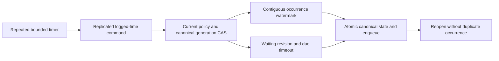

# RecurringSaga within Messaging

Root accepts S1 on 2026-10-04 for KL-100 under
[ADR-092](../../ADR/ADR-092-recurring-saga.md). The product contract is versioned
durable schedules, stable occurrences, saga CAS and atomic timeout messages;
general workflow replay or external exactly-once execution is not advertised.

## Frozen S1 contracts

Generated native v1 records use sequential IDs from0 and feature-owned literal
`keyload.contract.<kebab-type-name>.v1` aliases. New mutations reuse public Batch
and its stable command inbox. Root owns the central discriminators, validation,
capability/apply/replay joins, public inspection adapters and version admission.

`RecurringScheduleDefinition(QueueLaneRef Lane, Guid ScheduleId,
DateTimeOffset FirstDueAt, TimeSpan Interval, string TimeZone,
RecurringMisfirePolicy Misfire, string PayloadJson, string HeadersJson,
string? OrderingKey=null, TimeSpan? MessageTimeToLive=null)` is the first fixed
interval profile. TimeZone must equal ordinal `UTC`, dates have zero offset,
Interval is1second..365days, and only `RecurringMisfirePolicy.CatchUp` is accepted.
Unsupported timezone/calendar/misfire profiles fail explicitly. TTL, when given,
is positive, no greater than365days, and is relative to the occurrence's due time;
expired catch-up fails without advancing rather than silently losing work.

Mutations and root apply signatures are:

- `ConfigureRecurringSchedule(Definition, ExpectedRevision)` owns
  Definition.Lane.Queue; revision0 creates only an absent schedule. Replacement
  requires exact current revision, increments revision AND generation, and resets
  the next occurrence ordinal to0. Preserve the original persisted creator ID.
- `EmitRecurringOccurrences(Lane, ScheduleId, ExpectedGeneration,
  MaxOccurrences=1)` owns Lane.Queue. It emits at most32 currently due contiguous
  occurrences, leaving further backlog due. It uses only the supplied replicated
  operation's logged `now`, never a worker-local clock. A stale generation fails
  TokenInvalidated. No currently due occurrence returns the existing revision.
- `CancelRecurringSchedule(Lane, ScheduleId, ExpectedRevision)` cancels only the
  expected revision. Canceled schedules never emit; replacement is explicit CAS
  and a new generation. Retain canceled state and its issued watermark.
- `CompareExchangeSaga(Lane, SagaId, ExpectedRevision, Phase, StateJson,
  Deadline=null, Timeout=null)` owns Lane.Queue. SagaPhase is Waiting, Completed,
  Cancelled or TimedOut. Revision0 creates Waiting only; exact CAS can update
  Waiting or terminate it with Completed/Cancelled. Direct TimedOut is invalid.
  Terminal state cannot be revived or overwritten. Deadline and Timeout are
  supplied together only in Waiting; deadline is UTC and a valid future instant
  at configuration, while SagaTimeoutDefinition holds Queue, PayloadJson,
  HeadersJson, optional OrderingKey and TimeToLive as above.
- `ExpireSaga(Lane, SagaId, ExpectedRevision)` owns Lane.Queue. It succeeds only
  for the expected Waiting revision whose stored deadline is due according to
  logged now. Enqueue the defined timeout and write TimedOut in the SAME atomic
  transaction. Not-due fails Validation, canceled/completed or changed revision
  fails RevisionConflict. Queue capacity/auth/expiry errors leave Waiting intact.

Each apply helper is `internal MutationReceipt Apply<Type>(IAtomicTransaction,
PrincipalRecord, PartitionRef, <Type> request, DateTimeOffset now)`; root invokes
it through the existing ordered atomic apply gate. Feature-owned authorizers
`AuthorizeRecurringSagaRequest(IKeyValueView, PrincipalRecord, PartitionRef,
Mutation)` and `ReauthorizeRecurringSagaEffect(...)` support new/failed and
successful inbox replay respectively without reapplying old CAS or effects.

Schedule occurrence message ID is the invariant ASCII
`recurring-{ScheduleId:N}-{Generation:x16}-{Ordinal:x16}`; identity is additionally
scoped by the complete lane key. Due time is FirstDueAt+Ordinal*Interval with
checked UTC tick arithmetic. Overflow fails Validation before mutation. Retain
the next ordinal in the canonical schedule transaction with every enqueued
occurrence: repeated timers/unknown response/reopen cannot emit that ordinal
again. No source payload is unpinned or lazily fetched from an ACKed message.
Saga timeout ID is `saga-timeout-{SagaId:N}-{WaitingRevision:x16}` in its configured
destination queue; both queues must share the exact atomic partition.

Persisted SchedulerManage plus relevant QueuePublish grants are required for
configuration/cancellation/emission/saga writes; root adds the next unused
Capability bit. All payload/header write grants apply. Emission additionally
reloads the original creator and its CURRENT scheduler/data/field/header-use
authority before using retained templates; a revoked creator cannot emit jobs.
Timeout similarly rechecks the persisted saga creator and source field-use plus
destination publish/write policy. No captured role/policy epoch substitutes for
current authority. Inspection requires QueueInspect and projects payload, headers
and StateJson with the current resource policies, never exposes unredacted raw
templates merely because the caller may manage a scheduler.

Canonical schedule/saga records, watermarks and finite per-lane counters are
native generated ZoneTree values. Combined retained schedule/saga record count
is capped by MaxScanRecords and serialized retained bytes by MaxBatchBytes;
replacement accounts old/new native sizes atomically. Every emitted message also
obeys real destination queue quotas. Validate all nested identities, enums,
JSON/default arrays, input bytes and same-partition scope before writes. Read
inspection uses one Clock-based ReadExecutionBudget, current principal, and
cancellation; never return partial lists or invented timing guarantees.

## Requirements, acceptance and stages

| Requirement | Acceptance and automated mapping |
|---|---|
| REQ-JOBS-001: versioned logged-time recurrence | AC-JOBS-001: independent UTC due/ordinal oracle, exact due boundary, not-yet-due, bounded32 catch-up, stale generation, cancellation, overflow and unsupported profiles pass. `RecurringScheduleTests` |
| REQ-JOBS-002: stable durable occurrences | AC-JOBS-002: duplicate timer/command, different command at same time, lost-response retry, replacement and real-store reopen leave one message per full occurrence identity and preserve pending backlog. `RecurringOccurrenceTests` |
| REQ-JOBS-003: explicit saga/timeout CAS | AC-JOBS-003: restart preserves Waiting/state; completion/cancel vs due timeout has one serialized winner, one timeout message at most, and capacity/error rolls back state. `SagaStateTests`, `SagaTimeoutTests` |
| REQ-JOBS-004: persisted authority and finite retained work | AC-JOBS-004: current creator/caller revocation, protected template/header/state writes/uses/projection, cross-partition inputs and exact record/byte/queue caps fail safely; cancellation followed by healthy inspection passes. `RecurringSagaPolicyTests`, `RecurringSagaBudgetTests` |
| REQ-JOBS-005: restartable Orleans scheduling and public qualification | AC-JOBS-005: S2 native CQRS coordinator reconstructs current authority, scans bounded due records fairly and produces logged-time commands after restart; genuine Aspire RF3 .NET/official MCP timer/lost-ACK/leader-loss cases pass. Planned `RecurringSagaRf3Tests`; not closed by S1 |

Ordered execution: root freezes this contract and ADR; Luna cluster_wave owns
new Abstractions/Core Messaging contracts/commands/storage/authorization/inspection
and mapped new Messaging UnitTests, without changing transfer F1 or shared files.
Root joins central source and public APIs, reviews, builds/formats and runs actual
Aspire development gates while other agents implement their scopes, then commits
the coherent stage. S2 freezes the periodic coordinator/fair due-index and real
process/RF3 failure contract before implementation. Root records all original
Linux acceptance and source/run/job/artifact results before complete KL-100 closure.

No dependency or automatic migration is introduced. New persisted contracts need
the epoch7 old-reader rejection/explicit stopped-copy upgrade workstream before
delivery; rollback never opens these stores using an unaware reader. Interactive
UI N/A; SDK/MCP inspect and Batch mutations are this database capability's surface.

