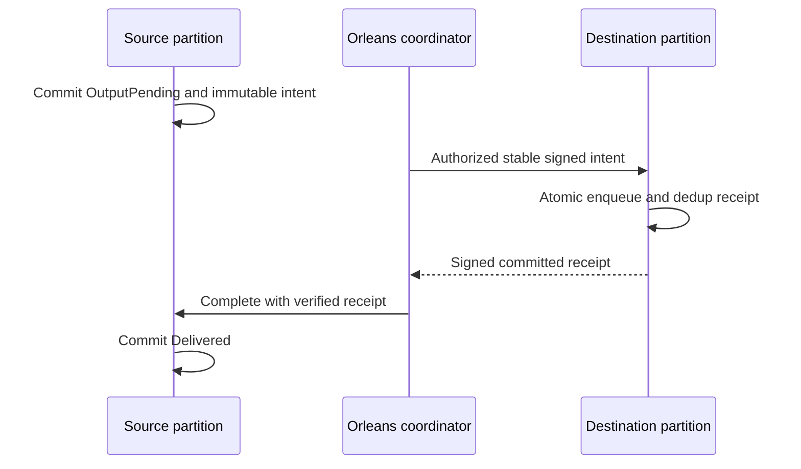

# RemoteTransfers within Messaging

Root accepts the KL-094 implementation contract on 2026-10-04.
Decision: [ADR-088](../../ADR/ADR-088-remote-queue-transfers.md).
Scope is durable queue-to-queue outputs within one tenant/database and the same
KeyLoad cluster incarnation. Source and destination atomic partitions differ.
This provides separate source and destination commits, never distributed atomic
commit or exactly-once external handler execution.

## Frozen source and destination protocol

Use three typed batch mutations: `CreateQueueTransfer(SourceQueue, TransferId,
Destination, Message)`, `AcceptQueueTransfer(DestinationQueue, IntentToken)` and
`CompleteQueueTransfer(SourceQueue, TransferId, ReceiptToken)`. IDs are nonempty
caller-stable GUIDs scoped by complete source QueueLaneRef. Immutable destination
and exact EnqueueMessage fingerprint are retained with the source intent. A
same-ID/same-body retry returns its existing outcome; different content conflicts.
The source is OutputPending until a destination receipt is verified and committed.

Core signs native-generated versioned intent claims using the existing cluster
signing key. Claims bind purpose, cluster incarnation, complete source and target,
TransferId, original persisted principal ID and exact message/fingerprint. Target
requires the current authenticated principal to match, reauthorizes QueuePublish
and all target field/header grants, then atomically enqueues and stores an immutable
dedup receipt. Target retries return the exact receipt without enqueueing again,
even after the message was acknowledged. It signs receipt claims over the complete
identity, payload fingerprint and committed target effect. Source verifies purpose,
incarnation, identity, target and fingerprint before moving to Delivered. Public
callers cannot invent a trusted receipt, role or timestamp.

F1 restricts transfer administration/inspection to persisted cluster administrators
and also checks resource/data grants. A bounded `InspectQueueTransfer` read returns
the actual state and signed intent/receipt to that authorized operator. It does not
claim a general worker authorization model. Tokens/PII are never diagnostics.
Source stores an owned payload; it does not depend on a disposable source message
or unpinned external blob. Pending intents and destination dedup records are not
automatically expired/GCed. Finite record/byte admission must reject excess before
mutation; no guessed horizon may discard unresolved state. Destination permission,
schema/quota/expiry failures leave source pending and remain explicit. Retrying
uses the original identity after timeout or unknown ACK; cancellation cannot undo
a committed enqueue. A remote DLQ is an ordinary durable destination queue.

The accepted concrete caps per source/destination lane are MaxScanRecords retained
records and MaxBatchBytes native retained-state bytes, with atomic counters. Encoded
intent-token bytes also fit MaxBatchBytes before source admission; never commit an
intent which the destination cannot accept under its token contract. Administrator
status is checked on the original persisted principal; data/field/header checks
reuse the same authorization evaluator with ClusterAdministrator=false, preserving
the principal identity and normal grant/path semantics. Inspection also requires
QueueInspect and source field/header use before disclosing its signed token.
The destination receipt is exposed only by a separate committed, authorized
`InspectQueueTransferReceiptRequest(DestinationQueue, SourceQueue, TransferId)`
read. Its result contains the persisted signed receipt and actual target commit
token; it does not assert source completion. Target enqueue MutationReceipt keeps
its original shape and contains no overloaded token. The coordinator performs a
fresh per-request-grain read barrier before using this proof to complete source.

| Requirement | Acceptance and mapped tests |
|---|---|
| REQ-XFER-001: persist immutable source intent atomically | AC-XFER-001: producer rollback creates no intent; same identity replays; changed destination/payload conflicts; pending survives real store reopen. `RemoteTransferIntentTests` |
| REQ-XFER-002: target effect and dedup receipt are atomic | AC-XFER-002: repeat/unknown-ACK/reopen gives one enqueue and byte-identical receipt; failed quota/auth creates neither effect nor receipt. `RemoteTransferDestinationTests` |
| REQ-XFER-003: only authenticated committed receipt completes source | AC-XFER-003: wrong purpose/incarnation/principal/source/target/fingerprint/tampered receipt rejects; duplicate completion is stable; source stays pending on every target failure. `RemoteTransferReceiptTests` |
| REQ-XFER-004: retention and resources cannot lose unresolved work | AC-XFER-004: exact/excess record/byte/token/work bounds, source message removal and destination ACK/retry preserve intent/dedup; no premature GC. `RemoteTransferRetentionTests` |
| REQ-XFER-005: Orleans owns bounded coordination and real clients | AC-XFER-005: separate per-request grain calls perform source/destination/completion without network I/O under the apply gate; restart/loss at each stage through .NET and official MCP RF3 yields one target effect. Planned `RemoteTransferRecoveryTests`/`RemoteTransferRf3Tests` |

## Ordered execution and ownership

1. Luna cluster_wave owns new Abstractions/Core Features/Messaging QueueTransfer
   contracts, native claims/state/helpers and named UnitTests/Messaging files.
   Add local slice policy before a new technical module. May use DatabaseEngine
   partial methods to reuse existing Enqueue, Sign/Verify, policy and transactions.
2. Root owns central mutation discrimination/validation/authorization/apply joins,
   public inspection dispatch, SQL/SDK/MCP surfaces and negotiated epochs. No new
   generic dispatcher or parallel command log. Existing canonical outbox is not
   repurposed as the transfer authority.
3. Add real reopen/rollback/failure tests with the implementation. Root integrates,
   reviews and executes actual Aspire tests after the coherent stage is complete.
4. A bounded Orleans coordinator follows using the native Communication CQRS stream;
   maximum one transfer per turn, joined cancellation, logged retry timing and
   persisted-principal reload. Source admission can pause without discarding work.
5. KL-100 recurring/saga semantics follow a separately frozen stage; delayed queue
   fields alone do not satisfy it. Complete original KL-094 includes the process,
   RF3, coordinator, redrive and aligned retention-horizon evidence.

Baseline: existing unit18 passed3060; scalar22 has one unrelated comparison host
failure. Local build22/formatter22 passed. Shared data epoch compatibility must be
explicit before RF3/release; rollback pauses transfers while preserving all new
intent/receipt records, never reverting acknowledged target effects. UI N/A.

