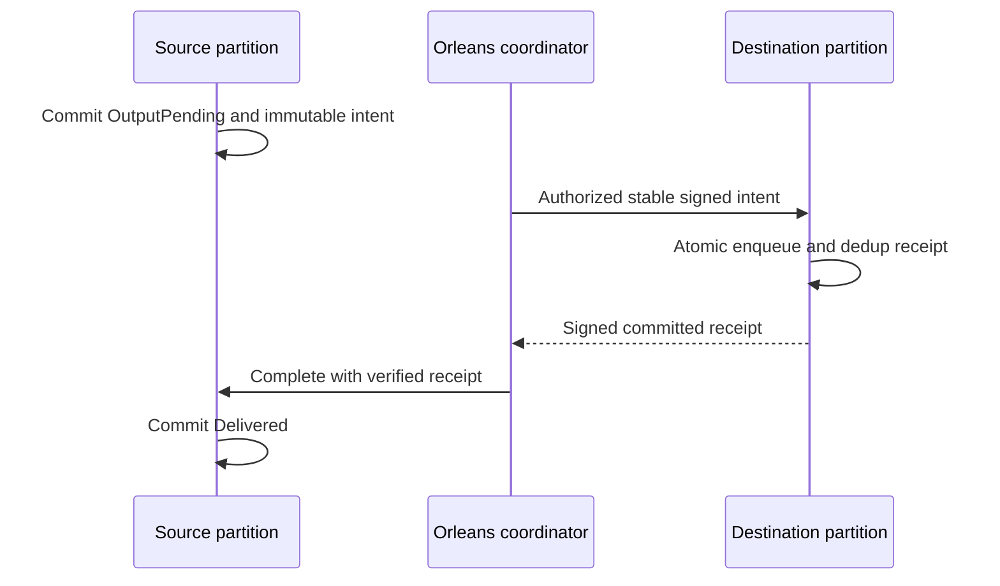
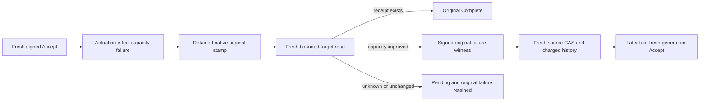

# RemoteTransfers within Messaging

TASK-XFER-RF3-RECEIPT-VALUE preserves REQ/AC-XFER-002/003/005 after original
run37242346547. Luna query_wave owns only the SDK/official MCP ACK comparison
inside RemoteTransfersRf3Tests. Compare every field of both independently
deserialized public receipts using the existing canonical public JSON serializer;
ImmutableArray backing-array identity is not receipt-value equality. Preserve
command IDs, mutation count/content, token, exact duplicate replay, target ACK
and empty-receive checks. No production, public wire or native format change;
existing ADRs suffice. Root owns integration and actual Aspire RF3 verification.

Root accepts the KL-094 implementation contract on 2026-10-04.
Decision: [ADR-088](../../ADR/ADR-088-remote-queue-transfers.md).
Scope is durable queue-to-queue outputs within one tenant/database and the same
KeyLoad cluster incarnation. Source and destination atomic partitions differ.
This provides separate source and destination commits, never distributed atomic
commit or exactly-once external handler execution.

## Frozen source and destination protocol

Use three typed batch mutations: `CreateQueueTransfer(SourceQueue, TransferId,
Destination, Message)`, `AcceptQueueTransfer(DestinationQueue, IntentToken)` and
`CompleteQueueTransfer(SourceQueue, TransferId, ReceiptToken)`. IDs are nonempty
caller-stable GUIDs scoped by complete source QueueLaneRef. Immutable destination
and exact EnqueueMessage fingerprint are retained with the source intent. A
same-ID/same-body retry returns its existing outcome; different content conflicts.
The source is OutputPending until a destination receipt is verified and committed.

Core signs native-generated versioned intent claims using the existing cluster
signing key. Claims bind purpose, cluster incarnation, complete source and target,
TransferId, original persisted principal ID and exact message/fingerprint. Target
requires the current authenticated principal to match, reauthorizes QueuePublish
and all target field/header grants, then atomically enqueues and stores an immutable
dedup receipt. Target retries return the exact receipt without enqueueing again,
even after the message was acknowledged. It signs receipt claims over the complete
identity, payload fingerprint and committed target effect. Source verifies purpose,
incarnation, identity, target and fingerprint before moving to Delivered. Public
callers cannot invent a trusted receipt, role or timestamp.

F1 restricts transfer administration/inspection to persisted cluster administrators
and also checks resource/data grants. A bounded `InspectQueueTransfer` read returns
the actual state and signed intent/receipt to that authorized operator. It does not
claim a general worker authorization model. Tokens/PII are never diagnostics.
Source stores an owned payload; it does not depend on a disposable source message
or unpinned external blob. Pending intents and destination dedup records are not
automatically expired/GCed. Finite record/byte admission must reject excess before
mutation; no guessed horizon may discard unresolved state. Destination permission,
schema/quota/expiry failures leave source pending and remain explicit. Retrying
uses the original identity after timeout or unknown ACK; cancellation cannot undo
a committed enqueue. A remote DLQ is an ordinary durable destination queue.

The accepted concrete caps per source/destination lane are MaxScanRecords retained
records and MaxBatchBytes native retained-state bytes, with atomic counters. Encoded
intent-token bytes also fit MaxBatchBytes before source admission; never commit an
intent which the destination cannot accept under its token contract. Administrator
status is checked on the original persisted principal; data/field/header checks
reuse the same authorization evaluator with ClusterAdministrator=false, preserving
the principal identity and normal grant/path semantics. Inspection also requires
QueueInspect and source field/header use before disclosing its signed token.
The destination receipt is exposed only by a separate committed, authorized
`InspectQueueTransferReceiptRequest(DestinationQueue, SourceQueue, TransferId)`
read. Its result contains the persisted signed receipt and actual target commit
token; it does not assert source completion. Target enqueue MutationReceipt keeps
its original shape and contains no overloaded token. The coordinator performs a
fresh per-request-grain read barrier before using this proof to complete source.

| Requirement | Acceptance and mapped tests |
|---|---|
| REQ-XFER-001: persist immutable source intent atomically | AC-XFER-001: producer rollback creates no intent; same identity replays; changed destination/payload conflicts; pending survives real store reopen. `RemoteTransferIntentTests` |
| REQ-XFER-002: target effect and dedup receipt are atomic | AC-XFER-002: repeat/unknown-ACK/reopen gives one enqueue and byte-identical receipt; failed quota/auth creates neither effect nor receipt. `RemoteTransferDestinationTests` |
| REQ-XFER-003: only authenticated committed receipt completes source | AC-XFER-003: wrong purpose/incarnation/principal/source/target/fingerprint/tampered receipt rejects; duplicate completion is stable; source stays pending on every target failure. `RemoteTransferReceiptTests` |
| REQ-XFER-004: retention and resources cannot lose unresolved work | AC-XFER-004: exact/excess record/byte/token/work bounds, source message removal and destination ACK/retry preserve intent/dedup; no premature GC. `RemoteTransferRetentionTests` |
| REQ-XFER-005: Orleans owns bounded coordination and real clients | AC-XFER-005: separate per-request grain calls perform source/destination/completion without network I/O under the apply gate; restart/loss at each stage through .NET and official MCP RF3 yields one target effect. Planned `RemoteTransferRecoveryTests`/`RemoteTransferRf3Tests` |

## Ordered execution and ownership

1. Luna cluster_wave owns new Abstractions/Core Features/Messaging QueueTransfer
   contracts, native claims/state/helpers and named UnitTests/Messaging files.
   Add local slice policy before a new technical module. May use DatabaseEngine
   partial methods to reuse existing Enqueue, Sign/Verify, policy and transactions.
2. Root owns central mutation discrimination/validation/authorization/apply joins,
   public inspection dispatch, SQL/SDK/MCP surfaces and negotiated epochs. No new
   generic dispatcher or parallel command log. Existing canonical outbox is not
   repurposed as the transfer authority.
3. Add real reopen/rollback/failure tests with the implementation. Root integrates,
   reviews and executes actual Aspire tests after the coherent stage is complete.
4. A bounded Orleans coordinator follows using the native Communication CQRS stream;
   maximum one transfer per turn, joined cancellation, logged retry timing and
   persisted-principal reload. Source admission can pause without discarding work.
5. KL-100 recurring/saga semantics follow a separately frozen stage; delayed queue
   fields alone do not satisfy it. Complete original KL-094 includes the process,
   RF3, coordinator, redrive and aligned retention-horizon evidence.

Baseline: existing unit18 passed3060; scalar22 has one unrelated comparison host
failure. Local build22/formatter22 passed. Shared data epoch compatibility must be
explicit before RF3/release; rollback pauses transfers while preserving all new
intent/receipt records, never reverting acknowledged target effects. UI N/A.

## TASK-XFER-THREE-STAGE-COLD-001 — source-authored RF3 stage

REQ/AC-XFER-001/002/003/005, ADR-088 and ADR-125. Dedicated genuine Aspire-owned three-node RF3 scenario with independently generated source and destination atomic partitions in one tenant/database/incarnation. This is not a claim of separate physical groups or distributed atomicity. Reuse current SDK, official MCP, Q1 CALL, persisted administrator with exact QueuePublish/Inspect/Consume/Ack/Query and raw field/header grants, original McpCallerDeadline and existing joined cold lifecycle.

Stages: commit stable source Create with actual immutable intent; cold original volumes and verify OutputPending/no target. Reject tampered intent, conflicting source body and freshly revoked target publisher through all4 existing routes; target metadata/receipt absent, source exact original. Restore actual current persisted publisher. Commit target Accept and retain original full native receipt/signed target proof/full literal message metadata/body; cold with source still OutputPending. Complete only from that original actual target receipt; cold and verify Delivered plus original exact command receipts and full state on every route. ACK genuine target delivery, submit new commandId Accept against original intent and prove retained dedup/no resurrected message; complete a fresh independent healthy transfer and verify literal new body/receipt/state.

No API/schema/alias/fieldId/product/clock/default/limit/ownership/scheduler change. New test roles only under Features/Messaging, append RemoteTransfers/ADR088. Original warm case and all Unit identity/retention/cap/malformed claims cases remain unchanged. Ordinary independent fixture50 slots; no blanket serialization. Real source/source-target commit receipts remain separate; never manufacture unknown response or regard canceled caller as rollback.

OPEN: bounded autonomous native coordinator; original process cut at each stage; genuine lost-response/unknown outcome boundary; physically separate RF3 groups/movement and aligned retention-horizon evidence; all Linux runtime/source-image/UID qualification. This finite three-stage cold case does not close whole KL094. Root-only compile/native discovery/tests.

### TASK-KL094-COLD-ORIGINAL-EPOCH-002 — current policy fence

Source correction only: original Create receipt positively replays across the FIRST cold cut before persisted policy changes. Actual revoke/restore increments the persisted principal epoch; the same historical Create command MUST then return PermissionDenied on SDK, official MCP and both Q1 routes, including the third cold cut, while original source intent and literal receipt evidence remain retained. Fresh target Accept/source Complete use genuine new command IDs under current authority; their original same-epoch receipt replay remains complete and exact. This maps existing AC-XFER-003 and TASK-KL094-THREE-STAGE-COLD-001; current Core ValidateCachedResult owns the frozen epoch fence. No product/alias/schema/deadline/oracle weakening; Linux qualification OPEN. R1 immutable, superseded only by this corrected R2.

## TASK-KL094-NATIVE-COORDINATOR-F1-001 — finite source stage

This implements the approved F1 subset of REQ/AC-XFER-001..005 under ADR-088/094/125. The R3 review document historically used the noncanonical REMOTE-TRANSFER spelling; XFER is the canonical requirement identity. No requirement is renamed. Source-only, native Linux/UID/process/RF3 qualification OPEN.

One real persisted technical principal may be selected by nullable TransferCoordinatorPrincipalId; null skips transfer discovery without changing recurring cadence. The setting selects an existing subject only, never creates credentials, grants roles or impersonates another creator. The subject must equal the actual retained source creator and tenant and is freshly authorized for each signed native source/target inspection and Batch. Existing connection-owned CQRS, original node storage, leader/quorum fences, dispatch cancellation/deadline and joined task lifetimes remain authorities.

Bounded discovery uses one scoped native read grant for reverse-tail capture, forward scan/lookahead and all selected principal/resource/counter reads. The original native count/byte/work/result ceilings and fixed tail are retained. Cursor resets on both store incarnation and ReadGeneration. Store.Position is captured within the same actual Store.Read gate with the native Token placement witness. Failed dispatch retains the actual discovered cursor, so a known failed intent does not starve later hints.

Only one enabled branch executes per original service cycle. Closed rotation has recurring, queue deadline and transfer branches; bounded skipping of disabled selections preserves recurring every cycle when both optional selections are null. No new wait/poll/provider/dispatcher.

The new INTERNAL generated hint alias is keyload.core.queue-transfer-coordination-hint.v1, Id0 Source/1 Destination/2 TransferId/3 PrincipalId/4 Fingerprint/5 IntentDigest/6 SourceCut. The existing coordinator interface appends ProcessQueueTransferAsync; original aliases/versions/methods and KL092 queue branch are preserved. Hint data never authorizes apply. Exact canonical IDs are SHA256 over native KeyCodec(domain keyload.queue-transfer.coordinator-command.v1, closed accept/complete, full source/target identities, original TransferId/PrincipalId/Fingerprint/IntentDigest/source Incarnation), first16 Guid bytes. Read position, policy changes, random cycle identity and DurableJobs DequeueCount are excluded.

Fresh actual source pending inspection precedes target receipt inspection. If no proof exists, one canonical Accept is submitted. The result is followed by target inspection; missing proof remains UnknownWriteOutcome. Before Complete, both source and target receipt are freshly reread; changed proof refuses. Complete carries only the actual native signed target proof. Same immutable ID/body reconciles genuine uncertainty/restart, with no new effect identity.

F1 deliberately retains a known terminal failed canonical outcome and pending source. Restoring policy/quota does not mint a new command ID. A genuinely authorized operator must use existing fresh public Accept/Complete as appropriate. The coordinator may observe that actual receipt and finish the unchanged source. Automatic dependency-bound retry/attempt advancement and full AC-XFER-005 closure are NOT implemented; F2 requires a separately reviewed authoritative durable bounded-attempt contract.

Automated source bindings: RemoteTransferCoordinationColdTests.NativePendingDiscoveryDoesNotMutateAndColdCanonicalAcceptCompleteRetainOriginalReceipts (native ZoneTree whole cold operation); RemoteTransferCoordinatorRf3Tests.NativeCoordinatorUsesActualReceiptAcrossColdAndKnownQuotaFailureRequiresFreshPublicRepair(bool), arguments false/true. The latter uses genuine Aspire RF3, actual persisted selected principal before Create, original SDK/official MCP/both Q1, literal target body/headers/metadata, source proof and complete original receipts across two same-volume cold cuts. Full-target setup passes an optional target QueuePolicy through the existing scenario producer at initial resource creation, preserving the ordinary null/default path. It creates one genuine filler under that one-message native QueuePolicy, rejects the canonical Accept with no transfer effect/receipt, retains it after cold, ACKs the original filler and performs fresh public Accept repair. It does not claim which producer won the first canonical-ID submission race. No fabricated failure, marker, clock or response. Existing Cold12R2 supplies independent original epoch denial/auth/unknown-stage/manual three-cut coverage; it is a required exact predecessor, not duplicated.

Ownership: Core Messaging Contracts/Identity/Models/Queries; Orleans Messaging Configuration/Contracts/Execution/GrainServices/Grains; test-owned typed ClusterFixture selection and shared MessagingRf3Identity producer from KL09265, with new feature-local Configuration/Contracts/Helpers/Assertions/Cases. No public/persisted family or user schema changes. Rollback removes the optional config/branch/hint; original transfer intent/receipt bytes remain readable unchanged. Root joins KL09265 and Cold12R2 first or explicitly composes their preserved bytes once, then this guarded successor.

OPEN gates: fresh native compiler/analyzers/50-slot Unit normal+scalar discovery; Linux exact-source/image/PDB/UID RF3 execution; genuine uncertainty/failure-at-specific-cut coordinator proof; distinct physical source/target group failover; retention horizon/GC; F2 automatic bounded retries. No qualification from authored source.

## TASK-KL094-ACCEPT-CAPACITY-ATTEMPT-002 — finite native capacity repair

REQ-XFER-002/003/004/005 → AC-XFER-F2-001/002/003 → ADR-088/094/125. This source stage is the approved finite target Accept capacity retry boundary, not universal automatic transfer recovery. `DatabaseLimits.MaxQueueTransferAcceptAttempts` is nullable, native Id20, default null, centrally validated positive and <=MaxScanRecords. A newly created source intent reserves its immutable ceiling/generation1 and retained history; original intents with null state remain unchanged. Actual source history count and native serialized bytes stay charged under current MaxScanRecords/MaxBatchBytes. No GC, arbitrary retry, clock, default, role, timeout or capacity changes.

- REQ-XFER-F2-001 / AC-XFER-F2-001: only a genuine single Accept's ordinary no-effect ResourceExhausted from owning queue storage or transfer retention can retain nullable original authority in StoredOutcome Id9. Capture follows fresh original authorization/fences/clock and precedes actual Execute; original Reset remains authoritative. Unknown, early authorization errors, unclassified/transitive failures, success/replay have no eligible stamp. One charged same-native-view target read freshly validates the subject and original signed intent, successful receipt FIRST, original scoped outcome/stamp/native raw-byte digest/current dependency/owner cut. Directional capacity repair is required; no witness or Advance is produced by an unrelated commit/read cut.
- REQ-XFER-F2-002 / AC-XFER-F2-002: source authorized Batch `AdvanceQueueTransferAttempt` uses alias `keyload.queue-transfer.advance-attempt.v1`, discriminator `advanceQueueTransferAttempt`, derived Id0 SourceQueue/1 TransferId/2 ExpectedGeneration/3 FailureWitness. Source verifies the actual target signature and exact immutable intent/accept tuple; one same-transaction CAS appends one history reference, increments generation, charges one record plus exact native bytes. Ceiling/current limits, history/signatures and stale generation refuse without business effects. Original successful target receipt always wins; no ACKed target is recreated. New private read QueueTransferCoordination=72 follows actual live0..68 and separately reserved Streams69..71, with no dummy members or renumbering.
- REQ-XFER-F2-003 / AC-XFER-F2-003: generation1 Accept and every Complete retain exact F1 IDs. New Accept changes only source-committed generation. Advance ID derives from immutable tuple, expected generation and authenticated ORIGINAL outcome digest; refreshed witness/native read position never creates new IDs. A failed source Advance keeps that same ID and requires explicit authorized public operator repair. The existing serialized service dispatches at most one Advance per turn; a later turn rereads source state before a new Accept. No recursive loop, dispatcher, new activation or service-created principal.

Automated source bindings: Unit `RemoteTransferAttemptColdTests.GenuineTargetCapacityFailureRequiresRepairBeforeBoundedAttemptAndTwoColdReceiptReplays` uses actual native queue filling, failed original Apply, unchanged refusal, original raw StoredOutcome bytes, unknown/malformed/stale no-effects, genuine ACK repair, source CAS, new Accept/Complete, ACK with no resurrection and two real same-root reopen cuts. RF3 `RemoteTransferAttemptRf3Tests.GenuineCapacityRepairUsesBoundedCommittedAttemptOrOriginalManualRepairAcrossTwoColdCuts(int ceiling)` has typed arguments1/2: the one-attempt case requires the existing fresh operator Accept; the two-attempt case must reconcile the exact generation2 native receipt. Both use actual Aspire Docker resources, original SDK/official MCP/both Q1, exact persisted subject, full literal message/source/receipt assertions and two same-volume cold process cuts. Existing native cases/Args and ordinary50 slots remain unchanged.

This stage is PRIVATE SOURCE ONLY until root join/build and original Linux discovery/runtime. Mandatory native normal/scalar/full recovery/Docker RF3 gates remain open; UID/count contracts unchanged. Separate precise source-Advance/target-receipt unknown-at-commit crash cuts, independently placed physical groups, full negative boundary matrix, automatic Complete/policy/auth failures and AC-XFER-005 overall remain OPEN. No primitive or full SQL/protocol qualification is inferred from this finite stage.

Ordered ownership: Core Messaging owns stamp/read/history/CAS helpers; shared AtomicCommandCommit and generated native StoredOutcome append only9; Abstractions owns mutation/config append only; existing Orleans service/connection-native CQRS reuses fresh scope and joined lifetimes; test fixture only passes the explicit validated attempts selection to its original resources. Rollback disables optional advancement; retained generation/history/outcomes must remain validated and cannot be silently erased. Root composes actual DeadlineR2/F1 and Streams ordinal ancestors, then runs native discovery and exact-source Linux. See the immutable exact field/alias freeze in the reviewed implementation contract; no copied codec or signing material is exposed.

### TASK-KL094-F2-SOURCE-CAS-PROCESS-001
The genuine existing CrashHost test-only mode `remote-transfer-capacity-attempt` creates a real full-target failure/native witness, performs actual authorized filler ACK and arms the original CanonicalCrashBoundary only for the source Advance transaction. `RemoteTransferAttemptProcessRecoveryTests.ActualSourceAttemptCrashRetainsAtomicHistoryFailureAndCompletesOriginalTransferThenCold(CommitStage)` has HeaderWritten/JournalFlushed/ApplyCompleted arguments, uses existing MessagingCrashTrial original90-second operation/30-second cleanup/8192 stderr bounds, real kill/exit/native file readiness and joined root cleanup. Native source history/reference count/counter/outcome must form one complete atomic image; flushed stages must be present. Unknown early durability is reconciled by the SAME original command, never a fabricated result. Parent performs new actual signed-generation target Accept/source Complete, checks complete literal message/receipt/source state, retains original failed outcome bytes and reopens the same root for exact replay. CrashDatabase only accepts an optional centrally validated test limits object; ordinary paths remain unchanged. No production inspection, signer export, fake clock/provider, new journal contract, power-loss inference or runtime qualification. Full Linux recovery/RF3 remains OPEN.

### TASK-KL094-F2-CEILING-NATIVE-COLD-001
`RemoteTransferAttemptColdTests.GenuineCapacityWitnessCannotExceedRetainedCeilingThenFreshOperatorRepairSurvivesTwoColdCuts` completes the independently configured ceiling1 negative operation. A real full-target Accept first fails, a real ACK repairs capacity and produces the original signed witness, and a genuine source Advance refuses without intent/history/counter/message/receipt effects. Its complete original failed result and raw native outcome survive two same-root cold reopen cuts. Explicit existing authorized fresh operator Accept/Complete then succeeds; full literal message, target proof, original source state and original failed Accept bytes remain checked. It never retries a failed Advance with a new identity. Ceiling2 success additionally checks every historical reference field and independent native raw intent bytes plus original receipt reservation against actual retained counter bytes within one store read. Current/original principal policy epoch and field/header-policy digest must remain identical for capacity-only improvement; policy repairs cannot qualify this stage. Closed internal read results have exactly one source-state, witness or receipt variant, and expanded-frame rejections clear the ineligible failure stamp. All compiler/normal+scalar/real-process/Linux RF3 gates remain OPEN.

### TASK-KL094-F2-NATIVE-VIEW-OPTIONS-002
The finite capacity witness reads one actual committed native view under ZoneTreeStore.Read's original read gate. ReadGeneration is the monotonic committed position of that same view, taken from the exact already captured TargetCut.Position; IAtomicStore has no independent ReadGeneration API. This field is an observation, never an attempt ID, directional capacity repair or retry authority. Preserve the actual owner/incarnation/placement and full original outcome/dependency checks. The CrashHost scenario obtains its explicitly selected limits from the existing ConfigurationBinding owner through its validated IOptions factory. Exact-code exception assertions and caller cancellation remain part of the complete negative/healthy/cold flows. Existing ADR-088/094/125 suffice; no public format, deadline, topology or capacity default changes. Fresh compiler and all runtime qualification remain OPEN.

# KL094 F3A exact current-authority repair freeze

Root approved F3 R2 (108401a4d4f0369574d0718a1fbf23104d82174394c926ccc70a5d18b59086a9). This private implementation contract precedes source. REQ-XFER-005 / AC-XFER-005 / ADR088,094,125 / TASK-KL094-CURRENT-AUTHORITY-REPAIR-003. Source-only, no runtime acceptance.

## Existing native facts and finite prerequisite
AtomicCommandCommit stores the actual Principal.PolicyEpoch before AuthorizeOperation. Its early PermissionDenied retains that epoch and exact original CommandFingerprint, scope, incarnation, result; it does not retain the original field/header digest. Therefore this finite implementation qualifies a real changed persisted epoch and fresh FULL original authorization. Same-epoch field-only denial cannot qualify without genuine retained prior policy evidence; it remains OPEN. Failed Complete has no F2 capacity stamp. Capacity-only Complete directional repair is OPEN until its original dependency is genuinely retained; a current fit or new read position is insufficient. Accept F2 directional capacity handling is unchanged.

## Exact additive contracts
No OperationKind / GrainReadKind is allocated. Existing QueueTransferCoordination72 remains the sole read. Existing F1/F2 IDs and histories remain unchanged.

* Public QueueTransferRepairStage enum Accept=0, Complete=1. AdvanceQueueTransferRepair alias keyload.queue-transfer.advance-repair.v1; JSON discriminator advanceQueueTransferRepair; generated fields0 SourceQueue,1 TransferId,2 Stage,3 ExpectedCapacityGeneration,4 ExpectedPolicyGeneration,5 ExpectedCompleteGeneration,6 FailureWitness. Existing Batch remains actual authorized operation.
* Intent nullable Repairs field16; old0..15 unchanged. DatabaseLimits nullable MaxQueueTransferRepairAttempts field21, default null/unavailable, positive<=MaxScanRecords through actual central validation. Immutable selected ceiling is captured only on genuine new Create. No default changed.
* RemoteTransferRepairState alias keyload.core.queue-transfer.repair-state.v1: fields0 Ceiling(int),1 AcceptPolicyGeneration(long, initially1),2 CompleteGeneration(long, initially1),3 History(ImmutableArray<RemoteTransferRepairReference>). History length <=min(retained ceiling,current validated ceiling)-1; each real reference charges one source record plus exact encoded bytes. Ceiling counts the initial generation; no zero-cost attempts.
* RemoteTransferRepairReference alias keyload.core.queue-transfer.repair-reference.v1: fields0 Stage,1 CapacityGeneration,2 PolicyGeneration,3 CompleteGeneration,4 FailedCommandId,5 Fingerprint,6 OutcomeDigest,7 WitnessToken. Chronological references bind BOTH prior generations and original capacity generation. No failed CAS manufactures a reference.
* RemoteTransferRepairClaims alias keyload.core.queue-transfer.repair-claims.v1: fields0 Purpose,1 Source,2 Destination,3 TransferId,4 PrincipalId,5 MessageFingerprint,6 IntentDigest,7 Stage,8 CapacityGeneration,9 PolicyGeneration,10 CompleteGeneration,11 FailedCommandId,12 CommandFingerprint,13 OutcomeDigest,14 OriginalPolicyEpoch,15 CurrentPolicyEpoch,16 CurrentFieldHeaderDigest,17 OwnerCut,18 ReadGeneration,19 ReceiptDigest(nullable, required ONLY Complete). Existing Core Sign/Verify owns the opaque witness. Purpose keyload.queue-transfer.current-authority-repair.v1.
* Existing read request appends fields7 RepairStage(nullable),8 PolicyGeneration(default1),9 CompleteGeneration(default1),10 ReceiptToken(nullable). New closed purpose keyload.queue-transfer.repair-failure-read.v1. Old purposes require null RepairStage/ReceiptToken; old failure purpose retains initial policy generation, while source refresh validates the exact retained repair generations; new purpose requires exact positive generations and Complete-only receipt. Existing request.AcceptCommandId is the exact selected failed command ID for this purpose, not a renamed ID in old purposes.
* Existing read result appends nullable RepairWitness field3. Exactly one old/new variant, mixed variants refuse. Hint appends9 AcceptPolicyGeneration(default1),10 CompleteGeneration(default1),11 RepairCeiling(nullable). Old F2 readers/refresh must preserve and validate these fields.

## Ordering and trust
Fresh actual principal/admin/QueueInspect/QueuePublish/tenant/field/header authorization precedes selected outcome. Reconstruct the exact canonical one-mutation original Accept or Complete from genuinely retained intent/proof; compare native scoped outcome, owner incarnation, original deterministic command ID and native CommandFingerprint. Require exact failed PermissionDenied/null Json/null NativeValue, OriginalPolicyEpoch < actual current PolicyEpoch, and full AuthorizeOperation on that reconstructed original. Unknown/missing/success/other error emits no repair. Receipt observation FIRST wins for Accept and must never re-enqueue ACKed output.

Same Store.Read gate captures raw outcome SHA256, current policy/digest and ONE Token(view, selected atomic partition, Store.Position); ReadGeneration stores that exact OwnerCut.Position as committed-view observation only. Existing charged read wrapper accounts every key/value/result. Witness does not say the denied effect was formerly authorized. Source CAS freshly authorizes original creator/source, validates actual own signed witness and exact pending identity/generation tuple, charges history before write, atomically appends exactly one reference/increments selected generation. Successful replay revalidates exact recorded witness; original failed outcome remains byte-identical. History validation accepts historically authentic policy witnesses but never turns their stale policy into current effect authorization.

Identity: policyGeneration1 Accept delegates to original F2 AcceptId (including every capacity generation). CompleteGeneration1 delegates to original F1 CompleteID. Repaired Accept domain keyload.queue-transfer.accept-policy-command.v1 binds immutable F1 identity tuple, capacity generation and policy generation. Repaired Complete domain keyload.queue-transfer.complete-repair-command.v1 binds immutable F1 tuple and complete generation. Repair CAS domain keyload.queue-transfer.advance-repair-command.v1 binds immutable tuple, closed stage, all expected generations, exact ORIGINAL outcome digest. KeyCodec/SHA256/Guid native primitives; no cut/witness bytes/time/random. Capacity advancement under a repaired policy must not reinterpret F2 original authority: unless original F2 history can be independently proven, that combined failure remains explicit operator repair pending.

## Whole source/regression scope
Core Messaging new Contracts/Identity/Queries/Validation/Commands/Execution plus actual shared Batch dispatch/authorization/JSON/config owners; Orleans existing signed read/apply and one serialized coordinator turn. No new dispatcher/provider/activation. Unit actual denied Accept, unchanged denial/refused witness, persisted authority repair, source CAS, original failure raw bytes, one target effect and ACK, genuine denied Complete, second source repair CAS, old result retained/new completion, stale/malformed/ceiling/body conflict/no effects, two same-root cold cuts. Genuine source CAS crash cuts HeaderWritten/JournalFlushed/ApplyCompleted; full pre/post inventories and receipts. Real SDK/official MCP/both Q1 RF3 two-volume cold/public scope; all existing Args/clocks/defaults retained. All required fresh Linux/native UID/compiler/runtime gates OPEN. Full AC-XFER-005 also retains distinct-group F3B and capacity-only Complete/universal retry gates OPEN.

Rollback disables only new nullable selection; existing admitted histories/records are never erased or upcast. F3B is separate and receives no implementation credit from this contract.

### Finite F3A authored whole-operation mapping (source only)
The exact generated/native source proposal maps TASK-KL094-CURRENT-AUTHORITY-REPAIR-003 to:
- `RemoteTransferRepairColdTests.NativeDeniedAcceptAndCompleteRequireFreshPolicyRepairAndBoundedSourceCasAcrossTwoColdCuts` and `NativeRepairCeilingRetainsOriginalDenialsThenExplicitOperatorCompleteSurvivesTwoColdCuts`: real persisted epochs, original failure raw bytes, complete literal state/receipt/accounting, invalid witness/body/stale CAS refusals, source ceiling, ACK and two same-root cold opens.
- `RemoteTransferRepairProcessRecoveryTests.OriginalSourceRepairCasCrashRetainsExactDeniedOutcomeAtomicHistoryAndColdHealthy(CommitStage, QueueTransferRepairStage)`: six source arguments HeaderWritten/JournalFlushed/ApplyCompleted crossed with Accept/Complete. Actual original source CAS, retained failed operation/outcome, atomic recovered history/counters, exact saved-operation replay and two cold opens. Process cuts are not power-loss proof.
- `RemoteTransferRepairRf3Tests.ActualKnownDeniedTransferStageRequiresPolicyRepairAndSourceCasBeforePublicHealthyAndTwoColdCuts(QueueTransferRepairStage)`: two source arguments Accept/Complete, real persisted credential/subject, failed original command, cold under denied policy, policy repair, existing coordinator observation/CAS, SDK/official MCP/both Q1, full Ready then ACKed literal state and second cold. Setup that lacks an actual durable known denial is a failed setup, never qualifying credit.
- Existing independent `McpPolymorphicSchemaTests`/`McpMutationTestData` preserve all original37 and append the actual AdvanceQueueTransferRepair discriminator as source census38.

These are ten new source candidate cases, not native discovered UIDs or runtime results. Root must compile/discover fresh Linux Source/PDB/UID metadata and run normal/scalar Unit, genuine process recovery and Docker/Aspire RF3 gates; existing mandatory suites and strict selection contracts are unchanged. AC-XFER-005 is not closed: same-epoch field-only repair, capacity-only Complete, combined capacity-after-policy repair, generic source-CAS terminal repair/unknown reconciliation qualification, distinct physical-group F3B, automatic universal retry, endurance/performance and all new Linux runtime gates remain explicitly OPEN.

### TASK-KL094-F3A-NATIVE-DIAGNOSTICS-001

Source-only corrective successor preserves the approved F3A policy-repair contract: document existing Accept=0/Complete=1 and optional limit field21, and remove the second identical null-result predicate before the unchanged PermissionDenied/no-payload checks. No aliases, IDs, defaults, authorization order, history, limits or whole-operation assertions change. Fresh native diagnostics recorded CS1591 at enum6:5/7:5 and limit105:17, CA1508 at failure-read32:39; root checkOnly returned NotSupported for XML sites and NotFound for the duplicate predicate. Build, Unit/process/RF3 and original Linux acceptance remain required; no execution claim.

### TASK-KL094-HISTORY-NUMERIC-R78-002 — exact cold/process history equality
R78 original Unit two complete cold flows and Recovery eight process-cut flows reject Int32 actual History.Length versus Int64 expected generation/count through TUnit numeric conversion. Widen only actual Length to Int64 at RemoteTransferRepairColdHealthy.ProveAsync, RemoteTransferAttemptRecoveryCut.AssertAsync and RemoteTransferRepairRecoveryCut.AssertAsync. All original expected count/generation formulas, raw intent/outcome bytes, source/target counter bytes, absence/ACK/receipt/continuation assertions, cut arguments, deadlines and principal fences stay exact. No product or storage contract change. Reproduce both RemoteTransferRepairColdTests complete named cases and all original RemoteTransferAttemptProcessRecoveryTests/RemoteTransferRepairProcessRecoveryTests native cut arguments via canonical native runner, normal/scalar and recovery, retaining fresh source/image/exit/TRX. The independent attempt ApplyCompleted discovery deadline failure remains original unknown cause and is not repaired or hidden by numeric widening. This source-only repair does not qualify AC-XFER005 or remote F3B.

## TASK-KL094-COMPLETE-COORDINATION-READ-001

# KL094 complete coordination-read admission

REQ-XFER-COORDINATION-READ-001: a complete freshly authenticated coordination read must charge every examined native authorization, resource, intent/history, outcome, receipt and token-placement record against its existing centrally validated operation read limits. A due-discovery page-size limit is not a substitute for that complete operation admission.

AC-XFER-COORDINATION-READ-001: the two existing RemoteTransferRepairColdTests must complete both original cold flows after the lossless History.Length assertion repair; exact histories/outcomes/receipts/models/ceiling refusals remain unchanged. A genuine operation MaxScanRecords/MaxQueryReadBytes refusal remains a failed result without partial output/effects. Recovery selectors remain mandatory.

Actual isolated evidence: numeric-unit-r1.original.log and TRX under /private/tmp/keyload-kl094-f3b-isolated-lane-r1-20261010; both failures occur in ReadRemoteTransferRepairFailure -> Token -> ReadPlacementWitness -> ReadDirectory -> ChargeReadGrant. Numeric conversion no longer preempts this read. This is development evidence, not original Linux qualification.

Current owning API: RemoteTransferPendingBudget(DatabaseEngine,CancellationToken) allocates its grant from min(DueExecution.MaximumRangeBytes, budget.MaximumNativeReadBytes) and min(DueExecution.MaximumRecordsPerPage,budget.MaximumNativeScanRecords). ReadRemoteTransferCoordination uses the same owner as range discovery even though it executes a complete authorization/receipt/history/cut read.

Proposed exact split: preserve the existing constructor/discovery path byte-for-byte. Add a private constructor accepting a closed internal budget mode, with an internal Coordination factory that reserves the actual ReadExecutionBudget.MaximumNativeReadBytes and MaximumNativeScanRecords. Keep the same original clock, DueDiscoveryDeadline, query deadline/cancellation, scoped grant lease, all read charges and result admission. Change only ReadRemoteTransferCoordination to use Coordination. No bool on public RPC, new trusted flag, configured limit/default increase, uncharged record, body export, retries, timer, schema or alias change.

Ownership: Core/Features/Messaging/Queries/RemoteTransferPendingBudget.cs and RemoteTransferAttemptReads.cs; append RemoteTransfers.md/ADR088 before source. Existing two Unit full operations plus original attempt/repair process recovery are regression oracles; no new getter/helper test.

Gate: root reviewed and approved this exact boundary before source; integrated/runtime qualification remains pending. Unknown elapsed discovery failure remains separate. Universal remote automatic retries, full F3B and Linux qualification remain OPEN.
