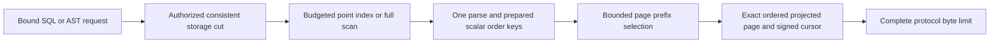

# QueryExecution

TASK-QUERY-FACTORY-WHOLE-OPERATION replaces the two shape-only
`KeyLoadQueryFactoryTests` cases under REQ/AC-ROC-005 and the existing bounded
query execution requirements. AC-QUERY-FACTORY-001 requires the public
`KeyLoadQuery.From<T>` builder, including predicate/projection/order/limit, to
execute against the actual TestDatabase/ZoneTree QueryEngine and return the
independently expected rows, canonical references, revisions and scoped read
cut. AC-QUERY-FACTORY-002 retains null partition/collection/expression rejection,
then requires an unchanged native store position and a successful query against
the same seeded database. Initial AST/getter assertions alone cannot qualify
these cases or contribute functional coverage. Use the current builder and
executor APIs, persisted operation state and existing bounded test options;
no duplicated translator, fake store or new product behavior is permitted.

ADR-041 owns the existing factory contract and ADR-033/117 own functional
test/coverage qualification; no new public or persisted contract is introduced.
Canonical ownership is UnitTests `Features/ClientApi/Cases/KeyLoadQueryFactoryTests.cs`
and cohesive same-slice helpers if required. Backend/client contracts remain
unchanged; frontend, new transport and RF3 fixture changes are N/A to this
unit-operation gap. Root freezes, reviews, joins and runs native owning
normal/scalar tests; a Luna worker prepares a private guarded source packet.
Source integration and exact-source Linux qualification remain pending. All
broader query/ClientApi gates stay mandatory.

## Event and queue SQL sources in the 104-task completion

[ADR-072](../ADR/ADR-072-authorized-sql-model-views.md) freezes the following
concrete implementation stage for KL-095 and SQL/AST/SDK equivalence. Existing
query/full-SQL requirements remain mandatory. Implementation precedes broad
stabilization; tests are authored with code and run after coherent self-review.

| Requirement | Acceptance / positive, negative, edge and error | Automated mapping |
|---|---|---|
| REQ-SQLVIEW-001: SQL source syntax lowers to one normalized typed AST | AC-SQLVIEW-001: EVENTS/QUEUE_MESSAGES literals, aliases, existing predicates/order/LIMIT/EXPLAIN and JSON AST return equal rows/errors; quoted source-like collection names stay collections; wrong arguments, source enum/generation, extra statements and model UPDATE reject before execution | SqlModelViewParserTests, SqlModelViewAstTests, real SDK/MCP RF3 |
| REQ-SQLVIEW-002: views are pure authorized reads in one cut | AC-SQLVIEW-002: current Query+EventsRead/QueueInspect are required, dead letters require their grant, SELECT leaves queue states/claims/stream head/store position unchanged, stale generation and corrupt identity/history fail closed | SqlModelViewReadTests, SqlModelViewAuthorityTests |
| REQ-SQLVIEW-003: protected input/output and delivery authority never leak | AC-SQLVIEW-003: payload/header field use is denied before row scans, unprivileged star/nested/alias output omits protected canaries, full grants expose expected values, no SQL row or Explain includes lease tokens/owner/fingerprint; revocation immediately denies the next request | SqlModelViewAuthorityTests plus actual persisted-policy RF3 SDK/MCP |
| REQ-SQLVIEW-004: every model operator has bounded work and output | AC-SQLVIEW-004: AllowFullScan is explicit; configured scan/raw/result/depth/token limits and cancellation/deadline reject whole requests, cursor is explicitly unsupported, empty/terminal rows and exact metadata bounds hold; a following authorized read works | SqlModelViewBudgetTests, real ZoneTree and bounded TUnit cancellation |
| REQ-SQLVIEW-005: deployment preserves canonical RF3 execution | AC-SQLVIEW-005: each SQL/AST/SDK/MCP request uses existing request/read actors and persisted rights; real Aspire RF3 append/enqueue/read and follower restart preserve rows and leave queue delivery state unchanged | root-owned SqlModelViewRf3 parity/authority/validation tests, exact-source CI; source review for unchanged transport/native fields |

Canonical slice map and task graph are in ADR-072. Root owns Abstractions and
transport/integration/docs/status; one Luna/high worker owns the specified
Query/Core read helpers and matching new tests. Search, movement, native sessions,
JOIN/DML and all foreign benchmark changes remain separate stages of the same
parent plan. Source-stage completion does not close KL-095 until its full mapped
acceptance and qualification pass. UI N/A; no dependency or persisted migration.

REQ-SQLC-006 / AC-SQLC-006A / TASK-SQLC-BETWEEN adds the bounded typed
[SqlBetween stage](QueryExecution/SqlBetween.md) under Accepted ADR065. Existing
scalar/null/eager-error semantics, expanded AST budgets, field authority and
cursors remain canonical. First-authored real ZoneTree and genuine RF3 SDK/MCP
tests qualify the new syntax at source7d1196 with44 original execution rows;
the receipt (report removed from repository) retains
full exact-source CI. Coverage, full SQL/native protocol and measured performance
remain unfinished.

REQ-SQLC-003 / AC-SQLC-003P adds independent full public/native value and
same-instance native writer tests under the Accepted
[ADR-065 oracle stage](../ADR/ADR-065-full-sql-client-compatibility.md).
Existing SQL-to-canonical byte parity, original IDs/kinds/input and disposal
ownership remain mandatory. Actual366 normal CI has47passed/1error among48
selected SQL/backup cases; the invalid trailing byte oracle requires correction
without hiding a serializer defect. Full source/scalar/RF3 remain unqualified.
Canonical test paths are UnitTests QueryExecution SQL compiler/comment tests and
ClientApi typed corpus/new McpNativePayload cases; production/frontend/data
changes are N/A because this stage corrects evidence only.

SQL exists because KeyLoad is one composable database for AI agents: documents,
typed tables, graphs, blobs, queues, events, vectors/search and time series can
reference and use one another. [DatabaseComposition](DatabaseComposition.md) /
[ADR-067](../ADR/ADR-067-composable-agent-database.md) specify queue -> linked
entities -> knowledge graph and graph -> queued actions in one authorized bounded
request. The first server-derived stage uses composing mutations through existing
canonical SQL CALL; full declarative model sources/JOIN/DML remain required under
ADR-065. One shared language must not stop at independent calls per model.

Owner clarification2026-10-03 makes full SQL syntax and a client connection
protocol required. [ADR-065](../ADR/ADR-065-full-sql-client-compatibility.md) owns
the ordered implementation contract; [conformance inventory](../implementation/sql-client-conformance.json)
distinguishes syntax, executed semantics and native interoperability. Current
Q1/SELECT/CALL is a stage; full SQL and native protocol remain pending.

| Requirement | Acceptance | Task/test/evidence |
|---|---|---|
| REQ-SQLC-001/006: full versioned typed SQL | AC-SQLC-001/006 | TASK-SQLC-R7/FULL; [183-command index](../implementation/sql-client-commands-postgresql18.json), explicit semantic stages and real differential fixtures pending |
| REQ-SQLC-002/003/004: bounded comments preserve canonical results/authority | AC-SQLC-002–004 | TASK-SQLC-I1/Q1/S1/I2; first-authored shared/parser/compiler real-store and RF3 SDK/official MCP comment cases; source/qualification pending |
| REQ-SQLC-005: conservative SQL transport outcomes | AC-SQLC-005 | TASK-SQLC-C1; exact commented/unknown-root write outcomes over genuine Kestrel, pending |
| REQ-SQLC-009/010: honest native performance and search choice | AC-SQLC-009/010 | TASK-SQLC-R4/FULL; pinned ZoneTree.FullTextSearch review then genuine correctness/fault/isolated workloads, pending |

The lexical stage uses one internal allocation-free scalar trivia reader and
existing configured byte/token/depth/cancellation budgets; quote readers retain
their exact contents. No second statement, DTO/data format, package or alternate
authority. Backend Query/Server/Abstractions, Client and matching tests use the
same QueryExecution slice; frontend N/A because callers use APIs. Root owns shared
contracts/docs/Git and actual final evidence; disjoint worker scopes and rollback
are fixed by ADR-065. TUnit/MTP runs only in GitHub; source checks are not passes.

Owner direction2026-10-02 requires SQL as the central language for one linked AI
database. [ADR-054](../ADR/ADR-054-central-sql.md) adds a versioned unified SQL
operation envelope: existing Q1 SELECT plus CALL into the sole canonical public
operation catalog. [RelationalStorage](RelationalStorage.md)/ADR-055 supplies typed
rows using those same document query/index paths. This is the first invocation
stage; declarative model sources, arbitrary JOIN and FK remain required pending
product stages. Exact source/qualification coverage is [central SQL evidence](../implementation/central-sql.md).

| Requirement | Acceptance | Task/test/evidence |
|---|---|---|
| REQ-AISQL-001: one server supports linked model operations with SQL central | AC-AISQL-001/005/006 | TASK-AISQL-004/006/008, strict compiler and real SDK/official MCP RF3 differential cases |
| REQ-AISQL-003: versioned single-statement SQL preserves canonical authority and resources | AC-AISQL-005–007/011 | TASK-AISQL-006/008/011, rejection/ID/retry/permission/cancellation/admission/metadata and initial-RPC native failure cases |
| REQ-AISQL-004: native indexed work and honest comparable performance | AC-AISQL-008–010 | TASK-AISQL-007/008, reversed equality real-store regressions and exact GitHub gates |

TASK-DBHP-012/AC-DBHP-012 adds a bounded genuine SDK observation to the existing
AC-AISQL-007 RF3 admission flow. The node and verified-scope control counts must
both reach exactly zero within five seconds after completed direct HTTP/MCP
control operations. Fifty-millisecond polls preserve caller cancellation and
every SDK failure. The native MCP server retains admission until its endpoint
drains, so client receipt alone is not the zero-count observation boundary.
[ADR-054](../ADR/ADR-054-central-sql.md) owns the unchanged lifetime contract and
ordered test-only repair. Original Tests37113337508 at9e053 RF3 is62/63; new
exact-source CI qualification is required before claiming this repair passes.

Status: Accepted repair contract; qualification pending. Requirements map to
[ResourceExecution](ResourceExecution.md), AC-MP-003/012 and
[ADR-035](../ADR/ADR-035-memory-performance.md).

| Requirement | Acceptance | Automated evidence |
|---|---|---|
| REQ-QUERY-001: one cancellation/deadline/raw key-value budget covers SQL parsing plus point, index and full-scan candidates | AC-MP-003 | Real-store SQL/AST index-plus-point accounting, full-scan rejection before page copies, cancellation during a long SQL token, and pre-tokenization rejection above the byte cap |
| REQ-QUERY-002: prepare JSON paths/order keys once and retain only the prefix needed for the requested page | AC-MP-003 | Real-store mixed scalar ordering, ties, filters, page concatenation and large-value allocation cases |
| REQ-QUERY-003: preserve authorization, redaction, explain, cursor cut/epoch and complete response limits | AC-MP-003/012 | Existing QueryAdapter/Security/LiveQuery cases plus new exact metadata/output and negative cases |
| REQ-QUERY-008: SQL/AST/live and Search share node-local analytical admission even across engine instances | AC-MP-003/004/011/012 | TASK-MP-006C real ZoneTree saturation, cancellation/error release and independent-database cases in Features/ResourceExecution |

Owning paths: Query/Features/QueryExecution/ helpers and matching UnitTests feature
tests. Existing QueryEngine, QueryAst evaluator and LiveQueries files are ADR-032
migration debt; repairs must not add layer folders. Abstractions query contracts
and Core shared JSON/storage budgets belong to the lead. Server cancellation
forwarding is serialized through the lead; no database schema or SQL/AST wire
format change. UI: N/A, typed caller operations are the entry point.

The preserving quality join is specified by AC-CQ-011/012 in
[quality-gates acceptance](CodeQuality.md) and ADR-033.
QueryEngine keeps the public SQL/AST/live facade; its private live owner is
`Features/ChangeFeeds/LiveQueryExecutor.cs`. Actual query suites cover the owning
operation results, authorization, cancellation and budget boundaries.
The numeric-enabled Query build is clean; exact-SHA test qualification is pending.

AC-CQ-014 accepts the preserving migration of the three legacy adapter/live/security
query test files to this canonical feature test slice. All original method/assertion
coverage remains, with internal cohesive classes, invariant inputs and explicit
deterministic200-document/50-query and100-mutation/12-identity flow assertions.
REQ-QUERY-003..006 map to this additional test-source acceptance and TASK-MP-010UQ;
the detailed matrix, exact worker ownership and required GitHub proof are in
the [CodeQuality](CodeQuality.md) acceptance and execution contract.
Existing SqlParserContract/QueryResource cases retain their error-precedence,
cancellation and budget boundary assertions where paired with whole operations.
ADR-033/032 suffice: only test ownership/input selection changes, no production
or public/data contract. Canonical paths/evidence are updated after the source join.

TASK-QUERY-BYTE-ASSERT preserves AC-QUERY-003/005 in QueryAdapterTestSupport,
LiveQueryTests and the RF3 AuthorizedQueryScenario. Canonical UTF8 arrays are
compared with explicit ordered SequenceEqual, rather than array identity or an
unordered byte comparison. The reported RF3 failure is run36988949282; UnitTests
were blocked by governance in that run. New exact-SHA UnitTests/RF3 evidence is
required before declaring the correction qualified. ADR: N/A, the canonical
query/replay contract and all production boundaries are unchanged.

TASK-MP-006 owns QueryEngine/QueryAst/LiveQueries and new QueryExecution helpers
and tests only; it cannot change parser/validation, public DTOs, core, server,
Search or central settings. New optional caller cancellation and an operation
clock do not alter the host clock. Tests use actual ZoneTree and real persisted
policies, without service doubles. Release build precedes GitHub TUnit/recovery/
RF3 checks. No performance or numeric-coverage result is inferred from source.

## Повний query contract

Актори: .NET/SQL/JSON caller і authorized reader. Entry points: [QueryEngine](../../src/KeyLoad.Query/Features/QueryExecution/Queries/QueryEngine.cs), [SqlParser](../../src/KeyLoad.Query/Features/QueryExecution/Execution/SqlParser.cs), [public AST](../../src/KeyLoad.Abstractions/Features/QueryExecution/Contracts/QueryAst.cs), [SDK query builder](../../src/KeyLoad.Client/Features/QueryExecution/Queries/KeyLoadQuery.cs), [HTTP query operations](../../src/KeyLoad.Server/ApiEndpoints.cs). Current Q1 — bounded read-only scalar dialect, а не PostgreSQL wire/full SQL compatibility.

| Вимога | Acceptance / flows | Test mapping |
|---|---|---|
| REQ-QUERY-004: versioned capability/grammar не виконують unsupported expressions | AC-QUERY-004: supported Q1/AST проходить validation; unknown version/operator, non-scalar parameter, malformed AST або unsupported CLR expression дає explicit rejection до scan чи execution application code | Existing `AstRejectsUnknownVersionOperatorsNonScalarParametersAndBudgetsBeforeScanning`, `MalformedPolymorphicAstIsRejectedByTheProtocolDeserializer`, `UnsupportedExpressionsNeverInvokeApplicationGettersOrDelegates` у [QueryAdapterTests](../../tests/KeyLoad.UnitTests/QueryAdapterTests.cs) |
| REQ-QUERY-005: SQL/JSON/C# є adapters одного authorized AST і typed scalar semantics | AC-QUERY-005: equivalent requests повертають той самий order/access path/PII omissions та interchangeable cursor; null/missing/IN/parameters визначені; builder branches не ділять mutable query context | Existing `SqlJsonAndCSharpAdaptersHaveTheSameSeededResultsAndAccessPath`, `CursorContinuesAcrossEquivalentSqlJsonAndCSharpForms`, `NullMissingAndInHaveExplicitCanonicalSemantics`, `BuilderBranchesHaveIndependentQueryContexts` у QueryAdapterTests |
| REQ-QUERY-006: planner/Explain і continuation зберігають cut, scope та policy authority | AC-QUERY-006: point/index/full-scan paths obey однакову authorization; tampered/wrong-scope/stale cursor відхилено; зміна source/policy invalidates відповідний cursor; protocol metadata входить у result bound | Existing `InvalidCursorIsRejectedBeforeACollectionScanUsesItsBudget`, `CatalogAndOtherCollectionWritesPreserveTheCursorButSourceWritesInvalidateIt`, `QueryResultByteBudgetIncludesIdentityAndRedactionMetadata`; [SecurityAndQueryTests](../../tests/KeyLoad.UnitTests/SecurityAndQueryTests.cs) revocation cases |
| REQ-QUERY-007: extended/distributed operators оголошуються тільки після versioned semantics і qualification | AC-QUERY-007: PLANNED capability fixtures та real RF3 tests доводять declared partition cuts/failure/cursor/budget semantics; unsupported joins/graph/search extensions залишаються explicit unsupported, без client-side silent evaluation | PLANNED suites для KL-037/055/095 та distributed/extended AST ADR contracts |

Q1 source-present: typed adapter validation, authorization, deterministic scalar order, bounded current-cut query/cursor та capability manifest. Global serializable snapshot, arbitrary joins/user delegates, cross-shard execution і всі proposed graph/event/search extensions не оголошені реалізованими. [Search](Search.md) і [ChangeFeeds](ChangeFeeds.md) мають власні behavior contracts; live scalar query використовує той самий safe query boundary.

Рішення: [ADR-004](../ADR/ADR-004-committed-read-views.md), [ADR-010](../ADR/ADR-010-query-budgets-security.md), [ADR-012 dialect](../ADR/ADR-012-sql-dialect.md), [ADR-013 AST](../ADR/ADR-013-authorized-query-ast.md), [ADR-020 contexts](../ADR/ADR-020-independent-query-contexts.md), [ADR-022 policy epoch](../ADR/ADR-022-policy-epoch-revocation.md). Один integration owner володіє shared AST/codec/security/cursor contracts; parser/planner/executor work scopes відділені після freeze. Qualification тільки exact GitHub TUnit/recovery/RF3 SDK/MCP; test source не є passing outcome.

## Unit test traceability crosswalk

These candidate references do not certify an AC or a native run. The R111 input was a failed, normal-only census and is used only for historical case identities.

| Existing case family | Candidate REQ/AC traceability | Functional contributor boundary |
|---|---|---|
| `PartitionQuery*` cases | REQ/AC-PQUERY-001..005 as listed per method in the current contributor registry and private per-case map | The 25 unique unit methods already in the registry are explicit candidates; contract-only assertions count only when paired in the same method with a real query outcome/state. REQ/AC-PQUERY-006 remains the separate RF3 gate. |
| `LiveQueryTests` | REQ/AC-FEED-003; cursor/policy subflows additionally REQ-QUERY-003 / AC-MP-003, AC-MP-012 where asserted | Snapshot/tail, replay, or persisted policy outcomes are actual operation candidates. Does not close all ChangeFeeds behavior. |
| `EqualityAccessPath*` | REQ-AISQL-004 / AC-AISQL-008; budget/security subflows also REQ-QUERY-001/003 / AC-MP-003 | Real indexed query outcomes are candidates; they do not establish comparative performance or full SQL. |
| `SqlBetween*` | REQ-SQLC-006 / AC-SQLC-006A; store, authority, boundary, and recovery methods use the exact subcriteria listed per case | Real ZoneTree SQL/AST results, null/missing query outputs and state-preserving retry are candidates. Parser/lowering-only grammar checks and parser rejection helpers remain contract evidence, not standalone operation contributors. Field authorization and cancellation cases are candidates only where the method asserts the healthy admin/retry result. |
| `SqlGraphPath*`, `SqlGraphSearch*` | REQ/AC-GRAPH-007..010 and REQ/AC-GSEARCH-002..006, only the per-case criteria actually asserted | Direct-vs-SQL real-store comparisons, authenticated policy outcomes, bounded positive-label/terminator flows, and reject-then-healthy-retry methods are candidates. Parser-only, standalone typed-rejection without state oracle, and capability-descriptor methods are not product coverage contributors. |
| Query adapter/resource/cursor tests | REQ-QUERY-001..006 and REQ-QUERY-008; the per-case map selects AC-MP-003/012 or AC-QUERY-004..006 only where the method asserts them | Real data, budget, cursor, cancellation, or store-preservation flows are candidates; parser/constructor guards alone are not. |
| SQL comment/parser/budget tests | REQ/AC-SQLC-002..004, REQ-AISQL-003 / AC-AISQL-007, and REQ-QUERY-004 / AC-QUERY-004 where applicable | Parser shape and byte-boundary checks are traceable but not sufficient contributor flows by themselves; query execution/result assertions are required. |

Existing comments on `NativeQueryCursorTests` (`AC-IS-001`) and parser cases (`AC-ROC-006`) do not match their current owning criteria and should not be copied into the crosswalk.

TASK-OWNER-REJECTED-TRIVIAL-PRUNE removes the standalone null-constructor case
under the owner's whole-flow test rule. It never executes a query or establishes
an owning acceptance criterion. Preserve all actual query operation cases and
production guards. Root owns the source deletion, full build and normal/scalar
operation regressions; regenerate the native coverage census after removal.
ADR: N/A, no product behavior, public/data contract or architecture changes.

TASK-REL-004-INNER-JOIN-001..006 extends REQ-QUERY-007 only with the exact bounded
Q2/AST2 Text primary-key INNER equijoin in [ADR-118](../ADR/ADR-118-bounded-relational-inner-join.md).
AC-QUERY-007-JOIN-001/002 and AC-REL-004-JOIN-001..006 map to explicit language/AST
admission, declared schemas/aliases, both persisted resource and row grants,
join/order field-use, safe projection, one committed read-cut, deterministic
ordinal order and cumulative existing work/byte/result/deadline limits. The
linked ADR owns exact public optional metadata, version inventories, source
roles, error/reopen/concurrency and real Aspire RF3 SDK/official-MCP flows. Q1 and
AST1 operations stay current. Arbitrary/distributed joins, FK semantics, full SQL
and native SQL client protocol remain required and open. This first operator's
source is joined; local native evidence is recorded below. Current-source public
RF3/Linux qualification remains pending; its contract alone closes no plan task.

TASK-REL-004-INNER-JOIN-007 additionally maps AC-QUERY-007-JOIN-002 and the
existing relational limit/caller criteria to actual RF3 work, read-byte and
result-byte rejection followed by a healthy join. ADR-118 freezes the complete
typed test-fixture limit mapping, exact shared/test source ownership and state
oracle before code. Existing unit boundary arithmetic and all current query,
authorization, cancellation and complete-suite gates remain mandatory.

TASK-REL-004-INNER-JOIN-008 maps the native R270 corrections in ADR-118 to the
same AC-REL-004-JOIN-001/003/004/005 and AC-QUERY-007-JOIN-002. Required initialized
capability arrays preserve native schema export; repaired persisted policy epochs,
canonical AST pointers and nullable edge fixtures must exercise successful real
operations. SQL retains its existing over-limit Validation result while the typed
AST proves BudgetExceeded, unchanged state and a healthy boundary query. This
correction adds no language, storage, authority or qualification exception.

The same task also owns the three observed R272 failures: exact additive MCP
schema enumeration, independent join-key raw-read/field-use grants with safe
projected-name redaction, and 32 concurrent-cut joins scheduled within the
existing reader admission limit. ADR-118 freezes exact file ownership, every
retained operation/state oracle, joined task cleanup and final healthy read
before these corrections. The failed 602/605 cohort is development evidence;
normal/scalar follow-up, recovery and real RF3/Linux qualification are required.

Stage VII source includes TASK-REL-004-INNER-JOIN-009's admitted declared-column
repair and real ZoneTree whole-flow regression. It executes the exact accepted
`r.id` SQL, literal complete projections, SQL/AST page parity, source identities
and committed cut, unchanged position and healthy Q1 metadata read. R290 full
Release and R294 formatter pass; R291/R292 owning normal/scalar each 606/606 and
R293 real indexed/idempotency process recovery 2/2 pass without source/assembly
drift or skips. See the exact hashes and failed-original retention in the
[status tracker](../implementation/status.json). The private 52-flow rejection
inventory, admitted server-work RF3 cancellation, actual new SDK/official-MCP
RF3 and current-source Linux qualification remain open. No full SQL, native
client protocol, complete product coverage or parent REQ closure is inferred.

## Independent query output ceiling, TASK-QUERY-RESULT-CAP-001

REQ-QUERY-007 / AC-QUERY-007-JOIN-001 and AC-REL-004-JOIN-004/006 require the literal4096 complete joined-result rejection without disabling native RF3 startup. Authentic run37612238705 attempt1 SHA24c0ac47 job112762012221 retains node1/node2/node3 native startup failures: RuntimeJournalClient.ValidateOptions rejects default MaximumJournalBytes2097152 against MaxBatchBytes4096 minus required EnvelopeMetadataBytes65536. Even a minimum journal cannot fit a negative capacity. These are actual original log diagnostics; no bind or image mismatch is established. Raising4096 or reducing invalid journal quotas is inadmissible.

Freeze before implementation: add nullable positive QueryExecutionOptions.MaximumResultBytes; null applies the existing MaxBatchBytes ceiling, explicit values add a ceiling min(configured, native MaxBatchBytes), never expand it. This is server-owned typed query/read output configuration, not a caller request field, native command budget or persisted format. Existing Core ReadExecutionBudget adds a monotonic result-byte constraint over its original captured limits, cancellation and deadline. It changes only bounded exact UTF8 output counting; it does not restart a clock, native read/work grant, admission lease, authorization or read cut. Default null preserves original calls and clock checks. Callback/page state and complete response accounting remain shared across SQL/AST/SDK/official MCP execution.

Map every existing output owner before implementation: QueryEngine scalar/Q2/model/explain and GraphPath SQL, live-query snapshot/delta, partition query plan/leaf retained grants/merge/public mapping, SearchEngine text/vector/hybrid/graph results and SQL graph search consume the same bound. Existing cumulative selected-result/retained byte checks use the constrained budget; native store scanned-byte/record limits remain unchanged. Exact final serializer accounting includes response metadata and must throw existing BudgetExceeded without a successful partial result. No serialization alias/field IDs, policy/authority, cursors, native journal limits, HTTP input admission or database MaxBatchBytes changes. Existing server native QueryExecutionOptions binding/Validate remains configuration authority.

Ownership: Core ReadExecutionBudget owns monotonic counter constraint; Query QueryExecution/Validation/QueryResultBudgetPolicy.cs resolves/composes the typed ceiling; existing feature execution owners consume it. Integration ClusterFixture gets an explicitly validated query-options overload and feature-local ClusterReplication helper applies only the explicit MaximumResultBytes environment setting to every owned Aspire node before Build. Existing twenty DatabaseLimits properties are unchanged. Result-budget RF3 case keeps4096 and all original source/payload/no-effect/error/healthy SDK/official MCP assertions, configuring only the independent query cap with default valid native batch/journal limits. Existing work/read-byte cases remain unchanged.

Native QueryExecution QueryResultByteLimitTests must execute real scalar and Q2 SQL/AST large-page rejection at4096, default successful baseline, complete persisted-source equivalence and a complete healthy smaller projection with unchanged position; null/default and explicit larger cap cannot expand native MaxBatchBytes. Shared constraint uses original token/deadline and no reset. Root owns guarded join/fresh strict build/native normal/scalar/current RF3 and original Linux gates; this private source stage is unexecuted. Original151/165 report and all node diagnostics remain immutable. No performance/SIMD/durability/readiness claim. Rollback removes this query configuration and its consumer composition, never changes stored bytes, native admission or old outcomes.

TASK-QUERY-RESULT-CAP-002 composition amendment (source-stage; unqualified): REQ-QUERY-007 and AC-QUERY-007-GRAPH-002 require SQL graph parsing, graph owner admission, native graph reachability, selected document/context projection and final protocol serialization to share the original ReadExecutionBudget. QueryEngine may receive a SearchEngine with different frozen options: effective output/retained cap is the monotonic minimum of the original native ceiling, SQL owner configured cap and SearchEngine configured cap. No new clock/start, token, examined-record/read-byte grants or task boundary may replace that parser budget. The public SearchEngine GraphSearchAsync entry still creates its original budget, then delegates to one feature-local internal owned-budget overload; that overload constrains its own frozen output policy, admits with the original initiating token, awaits the original worker, and disposes its actual admission. SQL delegates to that same overload and retains existing final checks. No duplicated dispatcher or worker exists.

AC-QUERY-007-GRAPH-002 maps to SqlGraphSearchResultCompositionTests: actual persisted ZoneTree documents and graph, mismatched caps in both directions, exact projected-search cumulative BudgetExceeded diagnostic before final graph serialization, no returned partial result, complete ordered raw native record bytes and commit position unchanged, then literal healthy graph hit/entity/revision/JSON/rank/empty-expansion oracle under the same owners. This specifically distinguishes early retained projection enforcement from post-allocation wrapper rejection. Root must run native full normal/scalar, focused graph cases and RF3 gates; this amendment does not claim runtime qualification. Rollback removes the shared-budget composition and regression coherently with its accepted query-cap contract; native journal/auth/storage/SQL dialect contracts remain unchanged.

## Live delta retained output composition, TASK-QUERY-RESULT-CAP-LIVE-002

REQ-QUERY-001/003, AC-MP-003/012 and REQ/AC-FEED-002/003 under ADR-004/010/013/022/118 require the existing constrained result budget to admit each retained selected live delta before retention. Core keeps its existing public ReadChangeFeedView signature and adds an internal synchronous before-retain overload, invoked only after original request.MaxBytes admits the change and before changes.Add/checkpoint advancement. LiveQueryResultByteAdmission uses exact original budget.MeasureResult and cumulative MaximumResultBytes; overflow is existing QueryEngine.ResultLimitExceeded BudgetExceeded, not partial success. Full wrapper serializer check remains. No operation clock/token/read grants/admission/read cut reset or new request/serialization/persistence field. Install this additional callback only for an explicit configured result cap; null/default preserves old feed behavior.

LiveQueryResultCompositionTests use actual ZoneTree Start->multirow mutation->Read, individually fitting changes whose combined output exceeds4096, exact terminal error/noPartial/fullnative store bytes and position invariance, healthy smaller literal projection and complete checkpoint/cut/receipt/row metadata. A separate original request.MaxBytes page/resume flow proves candidates excluded by original pagination are not charged against retained query cap. Root owns discovery/native normal/scalar/full RF3 proof; source-only packet is unexecuted. Rollback removes internal callback, live admission helper and matching cases together; R2 default cap/native journal/auth contracts remain unchanged.

## Original KL013 indexed/reference whole operation, TASK-KL013-INDEX-REFERENCE-WHOLEFLOW-001

REQ-QUERY-002/003/005/006, AC-QUERY-005/006 and AC-MP-003 under ADR-004/010/012/013/020/022 retain the original KL013 acceptance: index plan/reference scan agreement, stable declared pagination, tampered/expired cursor rejection. IndexedReferenceWholeFlowTests uses real ZoneTree and four ASC/DESC x page-size1/2 instances. Fixed operation UTC comes from the owning DatabaseEngine.EvaluationClock, passed through the existing operation clock API. No direct static system UTC sampling, sleep, production hook or storage fake.

Freeze before code: indexed status='open' versus reference status='open' OR number=-1. All seeded numbers are >=0, so both select exactly the literal b/a/d/g corpus order (or g/a/d/b descending), preserving null/missing nonmatches and number ties. Actual QueryCandidateReader.Equalities decomposes AND only and yields no OR index equality, so reference must assert bounded-full-scan while indexed asserts index:status. Current Compare returns unknown on null/missing; Or with false stays unknown; no production semantic change or relaxed expected rows. Full literal projected JSON/revision/redaction/source metadata, every page cut/path/terminal cursor, tampered/expired exact errors/noPage, original healthy continuation and complete native store/position invariance are required.

Root must discover/execute all four under /*/*/IndexedReferenceWholeFlowTests/* after guarded build and normal/scalar/current required gates. Historical original23 selected query cases per lane and global three failures remain separate; this source stage does not close KL013 or qualify full SQL/feature/RF3.
