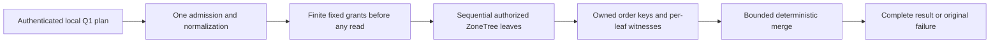

# KL-037 prerequisite: bounded local partition-leaf merge

Status: Accepted internal prerequisite; implementation and qualification pending.

This is a prerequisite-only internal stage. It exercises the existing Q1
operator against multiple real atomic partitions in one `TestDatabase` and
merges its bounded native leaf outputs. Every leaf remains on the same
`DatabaseEngine`/ZoneTree owner and must report that owner's actual node,
incarnation and read generation. Atomic partitions and RF3 replicas are not
physical shards. This stage adds no route, public contract, grain fan-out,
placement choice, cursor, or claim of distributed/RF3 execution. Full KL-037
remains pending actual independently placed physical owners and the later
Orleans/SDK/official-MCP stages.

## Requirements and acceptance

| Requirement | Acceptance | Automated evidence for this prerequisite |
|---|---|---|
| REQ-DQUERY-PREREQ-001: represent a validated bounded Q1 read plan and native leaf evidence without widening public admission | AC-DQUERY-PREREQ-001: generated internal plan accepts 1–8 unique partition leaves only; every leaf has a finite pre-granted candidate, examined-record, raw-byte and retained-byte allowance before the first leaf executes. Request version/shape, duplicate partitions, mismatched leaf/request partition, cursor, model source and inconsistent Q1 shape fail before storage reads. No caller identity or trusted role is carried in the plan. | Real ZoneTree validation tests; exact/one-over leaf-count and grant cases; generated Orleans serializer round-trip |
| REQ-DQUERY-PREREQ-002: execute each leaf through canonical local persisted authorization and expose its actual scoped evidence | AC-DQUERY-PREREQ-002: each leaf invokes the existing `QueryEngine`/`DatabaseEngine.WithQueryView` path with the authenticated principal supplied by the existing caller, reloading persisted principal, resource, row and field policy. A denial in any leaf fails the whole operation without returning earlier leaf rows. Each result retains full `EntityRef`, local cut position, policy epoch, schema version, owner node/incarnation/read generation and access path. No scalar global cut is synthesized. | Native ZoneTree positive tests across 2+ real atomic partitions; persisted denial/revocation and healthy-follow-up cases; per-leaf witness assertions |
| REQ-DQUERY-PREREQ-003: merge exact Q1 order before projection can erase sort data | AC-DQUERY-PREREQ-003: each leaf retains canonical encoded ORDER BY keys before projection. Merge compares each key using Q1 direction semantics, then breaks complete ties by ordinal `EntityRef` components `(TenantId, DatabaseId, TransactionDomainId, PartitionKey, Collection, Id)`. It emits at most `min(request.Limit, MaxResults)` rows; duplicate full references across leaves are `Corruption`. An independent central oracle compares full identity, revision, projected JSON/redaction and exact order, including a sort field omitted from projection. | Real native multi-partition store, shuffled insertion, identical textual IDs across partitions, tie and duplicate-result cases, independent in-memory seeded oracle |
| REQ-DQUERY-PREREQ-004: debit finite global work and memory grants before leaf execution/retention | AC-DQUERY-PREREQ-004: canonical request parsing/admission occurs once. The operator preallocates deterministic fixed per-leaf grants whose sums do not exceed the remaining existing `MaxScanRecords` (10,000), `MaxQueryReadBytes` (67,108,864) and `MaxBatchBytes` (8,388,608); candidates are charged/reserved before their owned order keys or projected rows are retained. Result count remains within `MaxResults` (1,000). Exact inclusive and one-over aggregate record, byte and retained-memory cases fail with `BudgetExceeded` and return no partial result. There is no work stealing or per-leaf reset of global totals. | Exact/one-over real ZoneTree reads and merge reservations; no partial rows on budget failure; later healthy query |
| REQ-DQUERY-PREREQ-005: preserve one operation token/deadline and honest leaf completion | AC-DQUERY-PREREQ-005: the existing caller token and one 30-second `QueryDeadlineSeconds` lifetime cover validation, all sequential leaf reads and merge. Caller cancellation remains cancellation; elapsed/work limits use the existing typed budget errors. Each synchronous local leaf has settled before the next starts or the method returns. During-work cancellation is asserted only through an actual native read-progress observation that cancels a real `ReadExecutionBudget`, then proves no result and a healthy follow-up. A persisted authorization/budget failure in a later leaf produces no partial page. | Real progress-observed native cancellation following existing graph/partition cancellation patterns; persisted-failure and healthy-follow-up tests |

The stage86q scalar original report establishes a test race: its async polling
monitor accepted positive bytes after the synchronous query had already returned.
TASK-DQUERY-CANCEL-OBSERVATION repairs only that test synchronization under
AC-DQUERY-PREREQ-005. Keep the same 5,000 native ZoneTree rows, request, original
CTS, 30-second operation budget and exact-token/no-result/healthy-follow-up
assertions. A QueryExecution-local native observer thread is started and signals
that it is armed BEFORE the synchronous query begins on the test thread. It
observes the actual budget byte counter, retains the observed value and requests
the same CTS on positive native work; no Task.Run/async-yield monitor races query
completion. Bound arming, observation and the initial join to 15 seconds, retain
and ultimately join the original thread before any CTS/event/store disposal,
and preserve actual primary plus observer/settlement failures with the native
ManagedCode fatal classification. A returned query, missed native progress or
failed observer is still a test failure, never a successful cancellation or
retry-to-green. No larger corpus, changed limit, fake clock/provider, product
test hook or weaker assertion is permitted. The observed native OCE and exact
caller token establish the passing flow; an armed thread alone is not that proof.
Ownership is `tests/KeyLoad.UnitTests/Features/QueryExecution/Cases/PartitionQueryCancellationTests.cs`
and populated QueryExecution `Helpers/` for its observer/failure settlement.
ADR-100 already defines the same native synchronous/cancellation boundary;
this test-only correction adds no public, persisted or runtime contract.

### Frozen internal contract

These are internal Orleans-generated value contracts in
`KeyLoad.Query.Features.QueryExecution`; they are not published or sent to a
grain by this prerequisite. Every type has `[GenerateSerializer]`, a unique
`keyload.query.<name>.v1` alias and sequential zero-based IDs. The exact names, field order and aliases are frozen for this internal stage.

| Type / alias | Ordered fields |
|---|---|
| `PartitionQueryPlanV1` / `keyload.query.partition-query-plan.v1` | `Version:int`, `NodeId:Guid`, `Incarnation:Guid`, `ReadGeneration:long`, `ImmutableArray<PartitionQueryLeafPlanV1> Leaves`, `Limit:int`, `MaxExaminedRecords:int`, `MaxReadBytes:long`, `MaxRetainedBytes:long` |
| `PartitionQueryLeafPlanV1` / `keyload.query.partition-query-leaf-plan.v1` | `Version:int`, `Partition:PartitionRef`, `AstQueryRequest Request`, `MaxExaminedRecords:int`, `MaxReadBytes:long`, `MaxRetainedBytes:long`, `MaxCandidates:int` |
| `PartitionQueryCandidateV1` / `keyload.query.partition-query-candidate.v1` | `Version:int`, `EntityRef Reference`, `QueryRow Row`, `ImmutableArray<ImmutableArray<byte>> OrderKeys` |
| `PartitionQueryLeafResultV1` / `keyload.query.partition-query-leaf-result.v1` | `Version:int`, `Partition:PartitionRef`, `NodeId:Guid`, `Incarnation:Guid`, `ReadGeneration:long`, `CutPosition:long`, `PolicyEpoch:long`, `SchemaVersion:long`, `ExaminedRecords:int`, `ReadBytes:long`, `RetainedBytes:long`, `AccessPath:string`, `ImmutableArray<PartitionQueryCandidateV1> Candidates` |
| `PartitionQueryResultV1` / `keyload.query.partition-query-result.v1` | `Version:int`, `bool Complete`, `ImmutableArray<PartitionQueryLeafResultV1> Leaves`, `ImmutableArray<PartitionQueryCandidateV1> Rows`, `ExaminedRecords:int`, `ReadBytes:long`, `RetainedBytes:long` |

Field order is stable and version is `1`. Principal identity is supplied only
from the existing authenticated operation context; the native plan contains no
principal, role, signing key, SQL text, or policy authority. The plan rejects
any leaf whose AST differs other than its partition, whose `Partition` differs
from `Request.Partition`, or whose request has a cursor, EXPLAIN, or non-null
`ModelSource`. All leaf plans share the same Q1 query, parameters, scan opt-in
and limit. Each leaf's `Limit` is the root result limit, so the global top-L is
contained in the union of each leaf's top-L. Leaf candidate storage retains
the canonical Q1 sort bytes while the result exposes only the authorized
projected `QueryRow`.

The owner identity in this prerequisite is copied from the actual single
`DatabaseEngine.Store.Identity`, not selected by a caller. All results must
match it. `CutPosition`, `PolicyEpoch` and `SchemaVersion` are per-leaf
witnesses. Policy epochs must agree across all completed leaves; otherwise the
operator fails closed with `OwnershipLost`. Cuts may differ and are never
collapsed into a global position. An unauthorized leaf preserves the existing
`PermissionDenied` result. Invalid inputs map to `Validation`, malformed
duplicate/result identity to `Corruption`, ownership/witness mismatch to
`OwnershipLost`, budget exhaustion to `BudgetExceeded`, and cancellation to
the original `OperationCanceledException`. There is no incomplete/partial
success mode.

### Bounds and operation order

1. Validate the 1–8 leaf shape, duplicate full partitions, leaf consistency,
   common Q1 AST, cursor/model/EXPLAIN exclusions and request limits before a
   database read. Admit once using current `QueryEngine` admission.
2. Create one root operation budget/deadline and normalize or compile Q1 once.
   Allocate fixed quotient/remainder grants over the canonical ordinally sorted
   partition list. Sum of all leaf record, raw-byte and retained-byte grants
   must stay within the configured remaining aggregate budgets after request
   parsing. No leaf starts before every grant exists.
3. Execute leaves sequentially through the existing local query operator.
   Each leaf consumes its grant during native scans/lookups and before owned
   candidates are retained. Preserve the current Q1 predicate, access-path,
   field authorization, projection/redaction and local read view. Do not expose
   a `PreparedRow`/borrowed `IKeyValueView` outside its `Store.Read` callback.
4. Require identical owner identity and policy epoch. Keep one cut/policy/schema
   witness per leaf. Merge the already bounded sorted runs with a k-way
   comparator; charge merge descriptors and result retention before allocation.
   Validate the complete bounded output before returning `Complete=true`.
5. Any failure or cancellation returns no rows. Each current leaf is synchronous
   and fully settled before continuation. There is no concurrent leaf queue or
   backpressure claim in this prerequisite.

The existing limits are configured limits, not new hard-coded public promises:
query bytes 65,536; tokens 2,048; AST depth 32; deadline 30 seconds; examined
records 10,000; raw read bytes 67,108,864; rows 1,000; result/retained batch
bytes 8,388,608. Every custom lower `DatabaseLimits` setting remains effective.
Per-leaf grants are deterministic and non-borrowable. They may conservatively
reject skewed data; no grant can be multiplied by the number of leaves.

### Explicit KL-037 boundaries still open

This prerequisite cannot prove independent physical owners, catalog routing,
Orleans fan-out, remote producer backpressure/settlement, bounded owner
availability, SDK/official MCP transport parity, partial-result policy, query
statistics epochs or any RF3 distributed behavior. Current `QueryEngine.Execute`
and `WithQueryView` are synchronous; a deterministic slow in-flight *remote*
leaf oracle does not exist without the later native Orleans leaf route. Do not
add a fake provider, artificial delay hook, or production observer to simulate
one. The synchronous local leaf still proves persisted later-leaf failure,
real during-work cancellation, per-leaf budget exhaustion and whole-result
failure. Slow-owner timeout, capacity-one native stream backpressure, original
remote-task join, and real multi-owner exact-source RF3 remain pending and must
be added only with their owning KL-037 stage.

## Source basis and ownership

The original architecture acceptance is
[`architecture-v0.3.uk.md:765-770`](../../design/architecture-v0.3.uk.md).
Current Q1 contracts are `QueryRequest`/`AstQueryRequest`, `QueryPage`, and
`QueryRow` under `src/KeyLoad.Abstractions/Features/QueryExecution/Contracts/`.
The local operator is `src/KeyLoad.Query/Features/QueryExecution/Queries/QueryEngine.cs`;
`PreparedQuery` owns canonical encoded order keys and currently ties on only
encoded `EntityId`; `QueryCandidateReader` applies the existing native read
budget and candidate scan. `DatabaseEngine.WithQueryView` at
`src/KeyLoad.Core/Features/DocumentStorage/Execution/Documents.cs:107` provides
per-leaf persisted authorization and scoped native read view.
`ReadExecutionBudget` at `src/KeyLoad.Core/ReadExecutionBudget.cs` provides
current token, time, raw-byte and output bounds. `TestDatabase` opens a
real temporary `ZoneTreeStore`, bootstraps persisted root identity and exposes
its actual `DatabaseEngine`; no mock storage seam is needed.

Source ownership is limited to Query feature-local internal contracts,
models, validation/admission and executor helpers plus a narrow private
`QueryEngine` join, with real ZoneTree tests in UnitTests `Features/QueryExecution`
role folders. Query owns no physical placement or transport. The Core grant seam below enforces native leaf read ceilings; never perform
post-hoc accounting.

The exact broader KL-037 target remains in `docs/design/architecture-v0.3.uk.md`;
this file is a prerequisite-only stage. The implementation must not mark
KL-037 complete or change its status evidence. UI, SDK, MCP, SQL grammar, server,
Orleans routing and physical catalog are N/A for this stage.

## Canonical slice and implementation map

| Owner | Exact owned paths |
|---|---|
| QueryExecution native values | `src/KeyLoad.Query/Features/QueryExecution/Contracts/PartitionQueryPlanV1.cs`, `PartitionQueryLeafPlanV1.cs`, `PartitionQueryCandidateV1.cs`, `PartitionQueryLeafResultV1.cs`, `PartitionQueryResultV1.cs` |
| Query validation and execution | QueryExecution feature-local `Validation/` and `Execution/`, with `Execution/PartitionQueryExecution.cs` and one internal owner accessor in `Queries/QueryEngine.cs` |
| Native regression cases | `tests/KeyLoad.UnitTests/Features/QueryExecution/Cases/PartitionQuery*Tests.cs`, with actual fixtures and assertions in their owning role folders |
| Core grant dependency | Existing `src/KeyLoad.Core/ReadExecutionBudget.cs` and a ResourceExecution role-owned grant helper, only after its exact contract is separately frozen below |
| Durable ADR | [ADR-100](../../ADR/ADR-100-local-partition-query-merge.md) |

This internal stage does not export a product result stream. Native Orleans
fan-out and ManagedCode.Communication streaming remain required in the later
KL-037 distributed stage before any public SDK or MCP route is delivered.

## Frozen native read-grant dependency

`ReadExecutionBudget.CreateReadGrant(long maximumBytes, int maximumRecords)` is internal and
returns the internal `ReadExecutionBudgetReadGrant`. Core exposes these only
to its explicitly declared `KeyLoad.Query` friend assembly. The helper lives
at `src/KeyLoad.Core/Features/ResourceExecution/Execution/ReadExecutionBudgetReadGrant.cs`;
its genuine native tests are `ReadExecutionBudgetGrantPointTests`,
`ReadExecutionBudgetGrantRangeTests`, `ReadExecutionBudgetGrantReservationTests`
and `ReadExecutionBudgetGrantCancellationTests` under UnitTests
ResourceExecution/Cases. No public budget API or transport is added.

Every grant is reserved before any leaf starts. Nonnegative ceilings are
accepted (zero permits only zero-charge reads); negative internal API input
is `ArgumentOutOfRangeException`. Creation checks the original root token
and deadline and uses subtractive overflow-safe admission. Accepted native
`ReadBytes` plus every outstanding reserved remainder stays within configured
`MaxQueryReadBytes`. Ordinary root `ChargeBytes` excludes those reservations
from available capacity. A native grant charge first checks original root
cancellation/deadline and its own remaining ceiling, then converts that
accepted count from reserved remainder to cumulative root `ReadBytes`, before
any visitor, copy or deserialization. Rejected charges do not mutate counters.
Unused remainder remains reserved for the operation; no later leaf borrows it.

Grant `ReadValue`/`VisitRange` invoke the actual original `IKeyValueView`
with its native pre-read charge callback and root token. Do not wrap an
already budgeted view, create another deadline/CTS or debit a read twice.
Reservation or leaf exhaustion preserves the existing safe read-byte
`BudgetExceeded` error. Ordinary root behavior is identical when no grants
exist. This stage remains synchronous and sequential and makes no concurrent
budget thread-safety claim. Exact/one-byte-under native reads prove the
visitor never executes on rejected charge, original cancellation/deadline
remains effective, and later ungranted work cannot consume reserved capacity.

The new internal leaf and merge use ordinal full-reference ties consistently
before top-L selection, including Unicode boundary cases. Existing public
Q1 `PreparedQuery` UTF-8 ID tie ordering remains its current contract.

The grant also reserves a fixed examined-attempt allowance within configured
`MaxScanRecords`. One native `StorageReadObserver` callback is one examined
attempt, including a missing point lookup and charged range lookahead. Every
callback checks both leaf ceilings before converting one reserved attempt and
its raw-byte charge into accepted totals. Either rejection mutates neither
counter. Grant `ReadBytes` and `ExaminedRecords` expose accepted work; parser
`ChargeBytes` is not an examined native attempt. Examined exhaustion has the
safe `BudgetExceeded` diagnostic "The read execution examined-record budget
is exceeded." Ordinary root behavior is unchanged when no grants exist.

## Frozen conservative retained-byte model

This model bounds logical retained query state and does not promise process
RSS. Constants are: pointer slot8, array descriptor32, string descriptor32,
candidate/reference/projected-row descriptors256, heap entry64 and seen-full-
reference entry64 bytes. Use checked or subtractive overflow-safe arithmetic.

A candidate costs256 plus `(32 + 2 * Length)` for each of its six full
EntityRef strings, `(32 + 2 * Row.Json.Length)`,
`(32 + 8 * Row.RedactedFields.Length)` plus `(32 + 2 * Length)` for each
redacted field string, and `(32 + 8 * OrderKeys.Length)` plus
`(32 + key.Length)` for each canonical order byte array. Row.Id reuses
Reference.Id and is not charged again. Repeated field strings may make this
logical model conservative even when native objects share storage.

Before fixed per-leaf retention grants are divided, reserve128 root descriptor
bytes,256 per leaf,64 per total planned MaxCandidates for the full-reference
seen set,64 per leaf for merge heap entries, and32+8*rootLimit for final row
slots. Each leaf reserves32+8*(L+1) heap/scratch reference slots and charges
owned candidate payload before retaining it in top-L, releasing rejected or
evicted payload. Before allocating the final leaf candidate array, reserve
its own32+8*n bytes while the scratch heap is still held; relinquish scratch
charges only after that helper relinquishes its containers. Final retained
totals cover surviving payload and owned leaf/result containers. Leaf result
candidates and merged Rows reference the same objects: row-slot arrays cost
bytes, candidate payload is never charged as a second allocation.

The existing canonical KeyCodec remains unchanged. Only one temporary
candidate's encoding/projection is present at once, bounded by admitted native
raw bytes and configured document limits; that transient bound is distinct
from final retained accounting. This stage makes no peak-RSS claim. Exact and
one-under tests compute the frozen retained formula independently from their
scalar seeds, including Unicode, escaped JSON and redacted fields.

The internal leaf top-L uses one custom binary heap backed by exactly L+1
reference slots. It compares canonical order bytes and ordinal full EntityRef
before admission; the public Q1 PriorityQueue and its existing UTF-8 EntityId
tie contract remain unchanged. Compute and reserve the exact owned candidate
payload before inserting it. Reservation failure leaves the previous heap and
output unchanged. Before transferring candidates, reserve the final array
while heap scratch is still held, clear and relinquish every heap reference,
then release its scratch reservation. One callback-local temporary candidate
is bounded by admitted raw bytes and document limits; it is not retained output.

## TASK-PQUERY-PUBLIC: accepted same-owner SDK/MCP contract

Status: contract accepted before implementation; source integration and all runtime qualification remain open. This stage does not complete KL-037 remote execution.

This stage publishes a typed multi-partition request over the already implemented bounded local partition-leaf merge. It runs all leaves through one existing authenticated request grain, one local DatabaseReadGrain, and one node-local QueryEngine/ZoneTree owner. The RF3 peers remain replicas of one physical shard. The stage does not add placement, remote leaf fan-out, a global transaction snapshot, cursors, SQL grammar, or independent-shard qualification.

## REQ/AC

- REQ-PQUERY-001: expose a bounded generated request that carries only up to eight full atomic `PartitionRef`s, one existing `SelectQuery`, existing query parameters, full-scan opt-in, and AST version. AC-PQUERY-001: reject default/empty/over-eight or duplicate partitions, invalid AST version/shape, oversized request, cursor-bearing or otherwise unsupported query semantics, `Explain`, and non-null `ModelSource` before any storage read; do not accept caller identity, roles, cut, owner/catalog witness, read grant, physical placement, or deadline.
- REQ-PQUERY-002: retain the native persisted-authority and catalog fence. AC-PQUERY-002: each SDK/MCP call follows signed request verification, native request identity validation, `NativeRequestWorkOwner` admission, the existing quorum `ReadBarrierAsync`, request freshness validation, persisted `GrainRequestAuthority.Reload`, and normal `GrainQueryReadCapabilities` execution. No admin-only `ReadPhysicalShardCatalog` or `ReadAtomicPartitionPlacement` public API is invoked for a non-admin. The node startup/per-request catalog admission fence remains the authority that the local server is a current member of the configured physical owner.
- REQ-PQUERY-003: bind each authorized leaf to the canonical placement visible in that same leaf's native `Store.Read`. AC-PQUERY-003: call the internal placement view reader only *inside* the existing `WithQueryView` callback, after it has loaded persisted principal and passed `Authorization.Require(Query | DocumentsRead)` for that leaf's partition/collection. That internal helper reads and validates SCAT plus descriptive PMAP from the provided `IKeyValueView`, performs no principal/admin check and no separate `Store.Read`, and returns only an internal typed owner witness. Compare its full physical-shard ID, incarnation, exact ordered voters and placement epoch with the server-owned expected local physical-owner tuple supplied by the authenticated DatabaseReadGrain composition; validate each row/fallback revision against its own same-view directory and row; valid leaves may differ in row revision and fallback state. Same-tuple placement is supported. A valid assignment to another physical owner fails `UnsupportedCapability` in this stage; corrupt/inconsistent catalog/placement fails `Corruption`; a catalog tuple that no longer matches this node's expected owner fails `OwnershipLost`. No fallback or refresh of malformed/mismatched PMAP records.
- REQ-PQUERY-004: reuse exact DQUERY r2 semantics and budgets. AC-PQUERY-004: one admission/normalization/compilation and one original `ReadExecutionBudget`/caller token/deadline cover all sequential leaves and merge. Reserve the complete 1–8 leaf grants before any read; each leaf rechecks persisted principal/resource/row/field policy, same-view SCAT+PMAP owner evidence, exact owner identity/read-generation, and policy epoch. Any later denial or witness mismatch returns no rows. Preserve separate per-leaf cut positions; never synthesize a scalar global cut. Keep the internal DQUERY exact comparator, full EntityRef tie-break, candidate/work/read/retained bounds and no partial result.
- REQ-PQUERY-005: expose only complete typed replies through the existing native CQRS stream. AC-PQUERY-005: the one RequestGrain returns one typed `PartitionQueryPageV1` after all local leaves and merge settle; faults/cancellation dispose/join the actual stream under existing native lifecycle rules. SDK and official MCP logical results match; no second dispatcher, unbounded materialization, or partial-page mode.
- REQ-PQUERY-006: qualify the public same-owner capability on the real AppHost Docker RF3 topology. AC-PQUERY-006: direct .NET SDK and official MCP cover independent ordered oracle, same textual IDs in distinct partitions, hidden sort fields, ties, empty/no-hit partitions, persisted denial/revocation on a later leaf, caller cancellation/limits with healthy follow-up, acknowledged write/read through a survivor, scoped supported leader loss/rejoin, and malformed/version/oversized input. The real official MCP schema oracle checks exact request/result properties and required fields; nested `PartitionRef` includes computed `atomicPartitionId` as an optional schema property in addition to its four required identity strings. For nullable `Parameters: Dictionary<string, JsonElement>?`, the type oracle admits only scalar `object`, singleton type-array `[object]`, or the exact unordered two-member set `{object, null}`; the latter is permitted only at this nullable dictionary site. Non-nullable schema fields accept only their exact scalar or singleton type array. Extra, duplicate, empty, non-string, or contradictory type arrays fail. Local references remain bounded to depth 8. Ordered tie fixtures use the native non-unique rank index without changing duplicate-rank inputs; separate native unique-index rejection cases remain mandatory. Evidence does not claim independent physical owners, remote fan-out, or full KL-037 completion.

## Public generated contracts

The frozen public error map distinguishes the request envelope from the AST: an unsupported `PartitionQueryRequestV1.Version` returns `Validation`; an unsupported `AstVersion` returns `UnsupportedCapability`. Neither returns a successful partial page. Empty, duplicate or over-eight leaves are `Validation`; configured request/result/retained limits are `BudgetExceeded`.

All contracts live in `KeyLoad` alongside current query contracts; aliases are feature-local named constants in Abstractions `Features/QueryExecution/Serialization`, not a new global alias layer.

- `PartitionQueryRequestV1`, alias `keyload.contract.partition-query-request.v1`: `[Id(0)] int Version` (must be 1); `[Id(1)] ImmutableArray<PartitionRef> Partitions`; `[Id(2)] SelectQuery Query`; `[Id(3)] Dictionary<string, JsonElement>? Parameters`; `[Id(4)] bool AllowFullScan`; `[Id(5)] int AstVersion` (must be 1). `SelectQuery.Limit` remains the sole row-limit field. Cursor, explanation, and model-source are absent/rejected. The server caps partitions at 8 and enforces the current configured query/result/body/read/scan/retention limits; no caller-settable work grant exists.
- `PartitionQueryRowV1`, alias `keyload.contract.partition-query-row.v1`: `[Id(0)] EntityRef Reference`; `[Id(1)] QueryRow Row`. The full reference distinguishes equal textual IDs in different partitions. No canonical sort bytes or unprojected record is public.
- `PartitionQueryLeafWitnessV1`, alias `keyload.contract.partition-query-leaf-witness.v1`: `[Id(0)] PartitionRef Partition`; `[Id(1)] long CutPosition`; `[Id(2)] long PolicyEpoch`; `[Id(3)] long SchemaVersion`; `[Id(4)] string AccessPath`. Owner NodeId/incarnation/read-generation and physical catalog/PMAP tuple are validated internally and are not exposed. These are per-leaf witnesses and can differ in cut/schema/access path; policy epoch and actual owner identity must agree.
- `PartitionQueryPageV1`, alias `keyload.contract.partition-query-page.v1`: `[Id(0)] int Version`; `[Id(1)] ImmutableArray<PartitionQueryRowV1> Rows`; `[Id(2)] ImmutableArray<PartitionQueryLeafWitnessV1> Leaves`; `[Id(3)] bool Complete`. Every successful reply has `Complete=true`; all failure paths return no rows and there is no incomplete mode.

## Concrete owner/read-view seam proposal

PMAP r2 adds an admin-gated public reader and an internal overload that also performs the administrator check; those are not suitable for an ordinary query leaf. Add the Core-internal `ReadAtomicPartitionPlacementForAuthorizedQuery(IKeyValueView view, PartitionRef partition, ReadExecutionBudgetReadGrant grant)` seam specified below. Only the Query caller invokes it after persisted ordinary leaf authorization, and all three metadata reads consume that actual leaf grant.

The DatabaseReadGrain composition passes a server-owned immutable expected-local-owner tuple into the Query capability from the already-fenced startup configuration (configured `PhysicalShardId`, actual ordered voter IDs, local incarnation, and configured/current placement epoch). It is never derived from request data. If exposing this tuple from the current host composition requires an exact additional internal interface or DI type, root must approve that single join before implementation. Do not call the public admin catalog methods to obtain it and do not add an alternate public capability.

## Ordered ownership and joins

1. Contract/ADR review freezes aliases/IDs/error map/response witnesses and explicitly says no global cut or multi-owner claim.
2. Core owns only the internal same-view descriptive placement reader in its current `ClusterRouting/Queries` role folder and its real ZoneTree tests. It must not weaken PMAP/SCAT public admin checks.
3. Query owns the public generated DTOs/aliases, bounded request validation, mapping to existing internal `PartitionQueryExecution`, per-leaf placement witness check inside the already-authorized `WithQueryView`, and projection from internal candidates to the complete public page. It retains the existing QueryEngine/one-budget path; no second admission/deadline.
4. Root owns append-only `GrainReadKind.PartitionQuery` and `GrainQueryReadCapabilities` binding inside `DatabaseReadGrain`, existing request-envelope/payload validation and capability inventory; no second grain/dispatcher.
5. Root owns HTTP `POST /v1/query/partitions`, SDK `PartitionQueryAsync(PartitionQueryRequestV1, CancellationToken)`, MCP `keyload_query_partitions` at `/v1/query/partitions` with read-only hints/catalog description, and typed response mapping, all through the normal signed read path.
6. Add generated-native codec/strict public-input cases; real ZoneTree unit tests; then genuine AppHost RF3 .NET SDK + official MCP tests. Build/format/analyzers and complete unit/recovery/RF3 gates precede any acceptance claim.

## Source-grounded current joins

- `SelectQuery` is generated native Q1 and already owns `Limit` (IDs 0–7; `QueryAst.cs`); `AstQueryRequest` has one `Partition`, optional `Cursor`, and `AstVersion` (IDs 0–5). The proposed public request deliberately does not embed it.
- `PartitionQueryExecution.ExecutePartitionQuery` is internal and already creates one `ReadExecutionBudget`, admits once, normalizes once, reserves all grants, executes sequential real local leaves and merges complete output.
- `PartitionQueryLeafExecutor.Execute` calls existing `DatabaseEngine.WithQueryView`, whose callback runs only after persisted principal/resource authorization. It captures owner identity and per-leaf cut/policy/schema/access-path witnesses.
- `DatabaseReadGrain` currently owns signed validation, native read admission, one quorum barrier, freshness and persisted authority reload before `GrainQueryReadCapabilities.ExecuteAsync`; the new kind must be appended without changing existing numeric enum values.
- `PhysicalShardCatalogReader.ReadPhysicalShardCatalog` and `DatabaseEngine.ReadAtomicPartitionPlacement` are explicitly administrator-gated. They cannot be called as an ordinary query user's placement check. PMAP r2's internal resolution currently opens its own store read; the new authorized-query method must instead accept the existing view.
- Existing transport joins are `QueryApi.Map`, `KeyLoadClient`, `McpReadCatalog`, `McpToolNames`, `McpToolRoutes`, `McpToolHints`, and `ApiGrainDispatch`. Root owns all of them.

## Required same-view owner-check and public mapping amendments

The PMAP prerequisite's ordinary APIs are intentionally administrator-gated. Query MUST NOT call those public methods, and no administrator identity or capability is added to ordinary reads.

The same-view Core seam has this exact proposed signature:

`internal static AtomicPartitionPlacementResolution ReadAtomicPartitionPlacementForAuthorizedQuery(IKeyValueView view, PartitionRef partition, ReadExecutionBudgetReadGrant grant)`

The only Query caller invokes it within the existing `DatabaseEngine.WithQueryView` callback, which has already loaded the current persisted principal and passed the leaf's ordinary Query/DocumentsRead resource authorization. Core validates the full partition; reads and validates the SCAT catalog, PMAP directory, and assignment row from that exact view using the supplied actual native grant's bounded `ReadValue` calls (no `GetRecord` bypass, new Store.Read, admin gate, write, repair, fallback around corruption, or borrowed view escape); and returns the validated internal resolution. Existing mismatched row/DefaultShard owner tuples remain `Corruption`. Query compares the returned physical ID, incarnation, exact ordered voter IDs and placement epoch to the immutable internal `PhysicalShardRecord` supplied by the already-fenced native DatabaseReadGrain host composition. A mismatch between current catalog and this server's expected tuple is `OwnershipLost`. A valid different owner is `UnsupportedCapability` until native KL-037 remote fan-out is implemented. Directory/row/fallback revision is checked against each leaf's own same-view header/row. Valid row revisions and fallback states may differ between partitions; directory revisions may differ across the distinct scoped cuts. Only the full owner tuple and existing node/incarnation/read-generation/policy consistency are required across leaves, without a global snapshot. The three metadata point reads consume the same leaf grant's raw bytes and examined-attempt allowance before decode, leaving no uncharged metadata lookup. All authorization stays in the existing `WithQueryView` path and no caller-controlled tuple exists.

The public mapper has this exact operation shape: `PartitionQueryPageV1 MapPublic(PartitionQueryResultV1 result, DatabaseLimits limits, ReadExecutionBudget budget)`. It computes and admits the checked public mapping retention *before allocating* page arrays, row wrappers, or witness records, while the internal candidate buffers and their sort keys are still held. The conservative logical additional charge is named and frozen as: page descriptor64; each returned-row array uses descriptor32 plus8 per reference and each new row wrapper costs32; each leaf-witness array uses descriptor32 plus8 per reference and each new witness wrapper costs64. `EntityRef`, `QueryRow`, their strings, and the existing partition/access-path values are references reused from the already owned internal result; no payload/sort-key/JSON bytes are copied by the mapper. Checked sum of `result.RetainedBytes` plus this additional mapping charge must remain ≤ configured `MaxBatchBytes` before allocation; otherwise throw typed `BudgetExceeded` with no page. After mapping, call the existing `budget.CheckResult(publicPage)` to enforce serialized response-byte bounds and cancellation. This is an intentional conservative overlap reservation while internal source buffers remain live; it makes no process-RSS claim, opens no second budget/deadline, and leaves the internal result unreachable after return.

Root-owned native composition supplies the current `PhysicalShardRecord` only from the successfully fenced host startup state; it is an immutable server value, never derived from request or public catalog read. The expected-record source, lifetime, and stale-fence error path must be frozen at the Orleans join before code. The internal call receives the existing `ReadExecutionBudgetReadGrant` already assigned to the leaf, so the owner's SCAT/PMAP values are included in exact existing byte/attempt grants before native decode.

The final public page field order is fixed as accepted: Version `[0]`, Rows `[1]`, Leaves `[2]`, Complete `[3]`. Exact aliases and IDs in the preceding tables remain unchanged.

### Frozen native composition and acceptance evidence

Root registers one immutable `PhysicalShardRecord` in `OrleansSiloConfiguration.RegisterBorrowedServices`, constructed only from `NodeOptions.PhysicalShardId`, `PartitionHost.Configuration.Incarnation`, an immutable copy of its exact ordered voter IDs, and `PhysicalShardCatalogStartupProtocol.InitialPlacementEpoch`. `DatabaseReadGrain` receives this server-owned singleton and passes it to `GrainQueryReadCapabilities`. Public execution remains behind the existing successful startup/per-request catalog admission fence; every authorized leaf validates fresh same-view committed SCAT/PMAP against this expected tuple and returns `OwnershipLost` on a stale host tuple. No separate provider, public request field, admin credential or public admin read supplies it.

`PartitionQueryExecution.ExecutePartitionQuery` retains its existing internal calls unchanged and gains the typed expected-owner overload used by the public wrapper. Metadata checks run only in that overload; existing internal local primitive tests retain their stated local contract. Query's public entry accepts the server tuple as an explicit composition argument; neither the HTTP/SDK/MCP request nor native grain payload accepts that argument. Public normalization validates every requested partition first and uses the first canonical sorted partition as the server-generated `AstQueryRequest.Partition` anchor. All leaves remain in the plan and are authorized separately.

REQ/AC-PQUERY-001/004/005 map to `PartitionQueryPublicContractTests`, `PartitionQueryPublicBudgetTests` and `PartitionQueryPublicMergeTests` under `tests/KeyLoad.UnitTests/Features/QueryExecution/Cases/`; REQ/AC-PQUERY-002/003 map to real ZoneTree `AtomicPartitionPlacementQueryViewTests` under `tests/KeyLoad.UnitTests/Features/ClusterRouting/Cases/` and `PartitionQueryPublicAuthorizationTests`; AC-PQUERY-006 maps to `PartitionQueryPublicRf3Tests` under `tests/KeyLoad.IntegrationTests/Features/QueryExecution/Cases/`. Root joins the append-only native read kind, persisted authority path, signed SDK/HTTP/MCP route and complete independent MCP inventory/schema/native-codec corpus. All of these tests use the Aspire-owned caller. A focused pass is development evidence; original full Linux unit/scalar/recovery/RF3/fault/endurance evidence remains required.

The same-view Core helper is static because it uses only the already authorized borrowed view, complete partition and actual leaf grant. This implementation modifier adds no API, authority, storage view or state.

### Complete-flow contract regressions, 2026-10-05

TASK-PQUERY-FUNCTIONAL-CONTRACT-001 strengthens the existing seven
`PartitionQueryMcpContractTests` under REQ/AC-PQUERY-001/005 and
REQ-CQ-009/AC-CQ-021. Each positive test configures an actual persisted collection,
commits a literal document to genuine ZoneTree, decodes the real native/public
request, executes `QueryEngine.QueryPartitions`, and checks the full returned
reference, projected content, persisted revision, leaf witness and unchanged
committed state. Alias/field-ID, schema/effect-hint and writer equality checks
remain additional assertions inside those operations. Page serialization consumes
the actual returned page, never a constructed successful reply.

The canonical MCP request without full-scan permission executes and rejects with
`UnsupportedCapability`, preserving the stored document and position. Decode a
request with explicit permission through the same catalog and execute a healthy
follow-up on that same store. Invalid envelope/AST versions retain their actual
pre-storage rejection, exact errors, zero storage reads and unchanged position.
Keep the existing test names and normal/scalar contributor identity. These local
native-codec flows do not replace the official MCP/SDK RF3 AC-PQUERY-006 cases.

Canonical MCP AST/partition-query fixtures use a valid RFC6901 field pointer
while preserving their identifier alias. A bare identifier path is malformed
input and must not mask the intended full-scan denial. The same decoded canonical
request must pass normal validation, produce the specified consent rejection,
then return the complete persisted row after explicit consent; correcting fixture
input does not weaken production validation or change its error contract.

Ownership: existing ClientApi/Cases/PartitionQueryMcpContractTests.cs and
ClientApi/Helpers/PartitionQueryMcpTestData.cs in the QueryExecution test slice;
production contracts, aliases, field IDs and execution paths are unchanged.
ADR: the existing ADR-100 public-query contract is sufficient; no new boundary,
data format or transport is introduced. First complete source review and the
strict Release build, then run the normal/scalar functional profile through
Aspire with fresh source/DLL/PDB/contributor guards and retain its original native
reports. Actual collection and complete mandatory suites remain acceptance gates.
