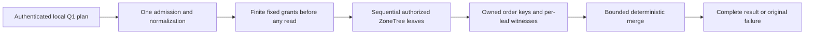

# KL-037 prerequisite: bounded local partition-leaf merge

Status: Accepted internal prerequisite; implementation and qualification pending.

This is a prerequisite-only internal stage. It exercises the existing Q1
operator against multiple real atomic partitions in one `TestDatabase` and
merges its bounded native leaf outputs. Every leaf remains on the same
`DatabaseEngine`/ZoneTree owner and must report that owner's actual node,
incarnation and read generation. Atomic partitions and RF3 replicas are not
physical shards. This stage adds no route, public contract, grain fan-out,
placement choice, cursor, or claim of distributed/RF3 execution. Full KL-037
remains pending actual independently placed physical owners and the later
Orleans/SDK/official-MCP stages.

## Requirements and acceptance

| Requirement | Acceptance | Automated evidence for this prerequisite |
|---|---|---|
| REQ-DQUERY-PREREQ-001: represent a validated bounded Q1 read plan and native leaf evidence without widening public admission | AC-DQUERY-PREREQ-001: generated internal plan accepts 1–8 unique partition leaves only; every leaf has a finite pre-granted candidate, examined-record, raw-byte and retained-byte allowance before the first leaf executes. Request version/shape, duplicate partitions, mismatched leaf/request partition, cursor, model source and inconsistent Q1 shape fail before storage reads. No caller identity or trusted role is carried in the plan. | Real ZoneTree validation tests; exact/one-over leaf-count and grant cases; generated Orleans serializer round-trip |
| REQ-DQUERY-PREREQ-002: execute each leaf through canonical local persisted authorization and expose its actual scoped evidence | AC-DQUERY-PREREQ-002: each leaf invokes the existing `QueryEngine`/`DatabaseEngine.WithQueryView` path with the authenticated principal supplied by the existing caller, reloading persisted principal, resource, row and field policy. A denial in any leaf fails the whole operation without returning earlier leaf rows. Each result retains full `EntityRef`, local cut position, policy epoch, schema version, owner node/incarnation/read generation and access path. No scalar global cut is synthesized. | Native ZoneTree positive tests across 2+ real atomic partitions; persisted denial/revocation and healthy-follow-up cases; per-leaf witness assertions |
| REQ-DQUERY-PREREQ-003: merge exact Q1 order before projection can erase sort data | AC-DQUERY-PREREQ-003: each leaf retains canonical encoded ORDER BY keys before projection. Merge compares each key using Q1 direction semantics, then breaks complete ties by ordinal `EntityRef` components `(TenantId, DatabaseId, TransactionDomainId, PartitionKey, Collection, Id)`. It emits at most `min(request.Limit, MaxResults)` rows; duplicate full references across leaves are `Corruption`. An independent central oracle compares full identity, revision, projected JSON/redaction and exact order, including a sort field omitted from projection. | Real native multi-partition store, shuffled insertion, identical textual IDs across partitions, tie and duplicate-result cases, independent in-memory seeded oracle |
| REQ-DQUERY-PREREQ-004: debit finite global work and memory grants before leaf execution/retention | AC-DQUERY-PREREQ-004: canonical request parsing/admission occurs once. The operator preallocates deterministic fixed per-leaf grants whose sums do not exceed the remaining existing `MaxScanRecords` (10,000), `MaxQueryReadBytes` (67,108,864) and `MaxBatchBytes` (8,388,608); candidates are charged/reserved before their owned order keys or projected rows are retained. Result count remains within `MaxResults` (1,000). Exact inclusive and one-over aggregate record, byte and retained-memory cases fail with `BudgetExceeded` and return no partial result. There is no work stealing or per-leaf reset of global totals. | Exact/one-over real ZoneTree reads and merge reservations; no partial rows on budget failure; later healthy query |
| REQ-DQUERY-PREREQ-005: preserve one operation token/deadline and honest leaf completion | AC-DQUERY-PREREQ-005: the existing caller token and one 30-second `QueryDeadlineSeconds` lifetime cover validation, all sequential leaf reads and merge. Caller cancellation remains cancellation; elapsed/work limits use the existing typed budget errors. Each synchronous local leaf has settled before the next starts or the method returns. During-work cancellation is asserted only through an actual native read-progress observation that cancels a real `ReadExecutionBudget`, then proves no result and a healthy follow-up. A persisted authorization/budget failure in a later leaf produces no partial page. | Real progress-observed native cancellation following existing graph/partition cancellation patterns; persisted-failure and healthy-follow-up tests |

### Frozen internal contract

These are internal Orleans-generated value contracts in
`KeyLoad.Query.Features.QueryExecution`; they are not published or sent to a
grain by this prerequisite. Every type has `[GenerateSerializer]`, a unique
`keyload.query.<name>.v1` alias and sequential zero-based IDs. The exact names, field order and aliases are frozen for this internal stage.

| Type / alias | Ordered fields |
|---|---|
| `PartitionQueryPlanV1` / `keyload.query.partition-query-plan.v1` | `Version:int`, `NodeId:Guid`, `Incarnation:Guid`, `ReadGeneration:long`, `ImmutableArray<PartitionQueryLeafPlanV1> Leaves`, `Limit:int`, `MaxExaminedRecords:int`, `MaxReadBytes:long`, `MaxRetainedBytes:long` |
| `PartitionQueryLeafPlanV1` / `keyload.query.partition-query-leaf-plan.v1` | `Version:int`, `Partition:PartitionRef`, `AstQueryRequest Request`, `MaxExaminedRecords:int`, `MaxReadBytes:long`, `MaxRetainedBytes:long`, `MaxCandidates:int` |
| `PartitionQueryCandidateV1` / `keyload.query.partition-query-candidate.v1` | `Version:int`, `EntityRef Reference`, `QueryRow Row`, `ImmutableArray<ImmutableArray<byte>> OrderKeys` |
| `PartitionQueryLeafResultV1` / `keyload.query.partition-query-leaf-result.v1` | `Version:int`, `Partition:PartitionRef`, `NodeId:Guid`, `Incarnation:Guid`, `ReadGeneration:long`, `CutPosition:long`, `PolicyEpoch:long`, `SchemaVersion:long`, `ExaminedRecords:int`, `ReadBytes:long`, `RetainedBytes:long`, `AccessPath:string`, `ImmutableArray<PartitionQueryCandidateV1> Candidates` |
| `PartitionQueryResultV1` / `keyload.query.partition-query-result.v1` | `Version:int`, `bool Complete`, `ImmutableArray<PartitionQueryLeafResultV1> Leaves`, `ImmutableArray<PartitionQueryCandidateV1> Rows`, `ExaminedRecords:int`, `ReadBytes:long`, `RetainedBytes:long` |

Field order is stable and version is `1`. Principal identity is supplied only
from the existing authenticated operation context; the native plan contains no
principal, role, signing key, SQL text, or policy authority. The plan rejects
any leaf whose AST differs other than its partition, whose `Partition` differs
from `Request.Partition`, or whose request has a cursor, EXPLAIN, or non-null
`ModelSource`. All leaf plans share the same Q1 query, parameters, scan opt-in
and limit. Each leaf's `Limit` is the root result limit, so the global top-L is
contained in the union of each leaf's top-L. Leaf candidate storage retains
the canonical Q1 sort bytes while the result exposes only the authorized
projected `QueryRow`.

The owner identity in this prerequisite is copied from the actual single
`DatabaseEngine.Store.Identity`, not selected by a caller. All results must
match it. `CutPosition`, `PolicyEpoch` and `SchemaVersion` are per-leaf
witnesses. Policy epochs must agree across all completed leaves; otherwise the
operator fails closed with `OwnershipLost`. Cuts may differ and are never
collapsed into a global position. An unauthorized leaf preserves the existing
`PermissionDenied` result. Invalid inputs map to `Validation`, malformed
duplicate/result identity to `Corruption`, ownership/witness mismatch to
`OwnershipLost`, budget exhaustion to `BudgetExceeded`, and cancellation to
the original `OperationCanceledException`. There is no incomplete/partial
success mode.

### Bounds and operation order

1. Validate the 1–8 leaf shape, duplicate full partitions, leaf consistency,
   common Q1 AST, cursor/model/EXPLAIN exclusions and request limits before a
   database read. Admit once using current `QueryEngine` admission.
2. Create one root operation budget/deadline and normalize or compile Q1 once.
   Allocate fixed quotient/remainder grants over the canonical ordinally sorted
   partition list. Sum of all leaf record, raw-byte and retained-byte grants
   must stay within the configured remaining aggregate budgets after request
   parsing. No leaf starts before every grant exists.
3. Execute leaves sequentially through the existing local query operator.
   Each leaf consumes its grant during native scans/lookups and before owned
   candidates are retained. Preserve the current Q1 predicate, access-path,
   field authorization, projection/redaction and local read view. Do not expose
   a `PreparedRow`/borrowed `IKeyValueView` outside its `Store.Read` callback.
4. Require identical owner identity and policy epoch. Keep one cut/policy/schema
   witness per leaf. Merge the already bounded sorted runs with a k-way
   comparator; charge merge descriptors and result retention before allocation.
   Validate the complete bounded output before returning `Complete=true`.
5. Any failure or cancellation returns no rows. Each current leaf is synchronous
   and fully settled before continuation. There is no concurrent leaf queue or
   backpressure claim in this prerequisite.

The existing limits are configured limits, not new hard-coded public promises:
query bytes 65,536; tokens 2,048; AST depth 32; deadline 30 seconds; examined
records 10,000; raw read bytes 67,108,864; rows 1,000; result/retained batch
bytes 8,388,608. Every custom lower `DatabaseLimits` setting remains effective.
Per-leaf grants are deterministic and non-borrowable. They may conservatively
reject skewed data; no grant can be multiplied by the number of leaves.

### Explicit KL-037 boundaries still open

This prerequisite cannot prove independent physical owners, catalog routing,
Orleans fan-out, remote producer backpressure/settlement, bounded owner
availability, SDK/official MCP transport parity, partial-result policy, query
statistics epochs or any RF3 distributed behavior. Current `QueryEngine.Execute`
and `WithQueryView` are synchronous; a deterministic slow in-flight *remote*
leaf oracle does not exist without the later native Orleans leaf route. Do not
add a fake provider, artificial delay hook, or production observer to simulate
one. The synchronous local leaf still proves persisted later-leaf failure,
real during-work cancellation, per-leaf budget exhaustion and whole-result
failure. Slow-owner timeout, capacity-one native stream backpressure, original
remote-task join, and real multi-owner exact-source RF3 remain pending and must
be added only with their owning KL-037 stage.

## Source basis and ownership

The original architecture acceptance is
[`architecture-v0.3.uk.md:765-770`](../../design/architecture-v0.3.uk.md).
Current Q1 contracts are `QueryRequest`/`AstQueryRequest`, `QueryPage`, and
`QueryRow` under `src/KeyLoad.Abstractions/Features/QueryExecution/Contracts/`.
The local operator is `src/KeyLoad.Query/Features/QueryExecution/Queries/QueryEngine.cs`;
`PreparedQuery` owns canonical encoded order keys and currently ties on only
encoded `EntityId`; `QueryCandidateReader` applies the existing native read
budget and candidate scan. `DatabaseEngine.WithQueryView` at
`src/KeyLoad.Core/Features/DocumentStorage/Execution/Documents.cs:107` provides
per-leaf persisted authorization and scoped native read view.
`ReadExecutionBudget` at `src/KeyLoad.Core/ReadExecutionBudget.cs` provides
current token, time, raw-byte and output bounds. `TestDatabase` opens a
real temporary `ZoneTreeStore`, bootstraps persisted root identity and exposes
its actual `DatabaseEngine`; no mock storage seam is needed.

Source ownership is limited to Query feature-local internal contracts,
models, validation/admission and executor helpers plus a narrow private
`QueryEngine` join, with real ZoneTree tests in UnitTests `Features/QueryExecution`
role folders. Query owns no physical placement or transport. The Core grant seam below enforces native leaf read ceilings; never perform
post-hoc accounting.

The exact broader KL-037 target remains in `docs/design/architecture-v0.3.uk.md`;
this file is a prerequisite-only stage. The implementation must not mark
KL-037 complete or change its status evidence. UI, SDK, MCP, SQL grammar, server,
Orleans routing and physical catalog are N/A for this stage.

## Canonical slice and implementation map

| Owner | Exact owned paths |
|---|---|
| QueryExecution native values | `src/KeyLoad.Query/Features/QueryExecution/Contracts/PartitionQueryPlanV1.cs`, `PartitionQueryLeafPlanV1.cs`, `PartitionQueryCandidateV1.cs`, `PartitionQueryLeafResultV1.cs`, `PartitionQueryResultV1.cs` |
| Query validation and execution | QueryExecution feature-local `Validation/`, `Execution/`, `Models/` and the narrow `Queries/QueryEngine.PartitionQuery.cs` integration |
| Native regression cases | `tests/KeyLoad.UnitTests/Features/QueryExecution/Cases/PartitionQuery*Tests.cs`, with actual fixtures and assertions in their owning role folders |
| Core grant dependency | Existing `src/KeyLoad.Core/ReadExecutionBudget.cs` and a ResourceExecution role-owned grant helper, only after its exact contract is separately frozen below |
| Durable ADR | [ADR-100](../../ADR/ADR-100-local-partition-query-merge.md) |

This internal stage does not export a product result stream. Native Orleans
fan-out and ManagedCode.Communication streaming remain required in the later
KL-037 distributed stage before any public SDK or MCP route is delivered.

## Frozen native read-grant dependency

`ReadExecutionBudget.CreateReadGrant(long maximumBytes, int maximumRecords)` is internal and
returns the internal `ReadExecutionBudgetReadGrant`. Core exposes these only
to its explicitly declared `KeyLoad.Query` friend assembly. The helper lives
at `src/KeyLoad.Core/Features/ResourceExecution/Execution/ReadExecutionBudgetReadGrant.cs`;
its genuine native tests are `ReadExecutionBudgetGrantTests` under UnitTests
ResourceExecution/Cases. No public budget API or transport is added.

Every grant is reserved before any leaf starts. Nonnegative ceilings are
accepted (zero permits only zero-charge reads); negative internal API input
is `ArgumentOutOfRangeException`. Creation checks the original root token
and deadline and uses subtractive overflow-safe admission. Accepted native
`ReadBytes` plus every outstanding reserved remainder stays within configured
`MaxQueryReadBytes`. Ordinary root `ChargeBytes` excludes those reservations
from available capacity. A native grant charge first checks original root
cancellation/deadline and its own remaining ceiling, then converts that
accepted count from reserved remainder to cumulative root `ReadBytes`, before
any visitor, copy or deserialization. Rejected charges do not mutate counters.
Unused remainder remains reserved for the operation; no later leaf borrows it.

Grant `ReadValue`/`VisitRange` invoke the actual original `IKeyValueView`
with its native pre-read charge callback and root token. Do not wrap an
already budgeted view, create another deadline/CTS or debit a read twice.
Reservation or leaf exhaustion preserves the existing safe read-byte
`BudgetExceeded` error. Ordinary root behavior is identical when no grants
exist. This stage remains synchronous and sequential and makes no concurrent
budget thread-safety claim. Exact/one-byte-under native reads prove the
visitor never executes on rejected charge, original cancellation/deadline
remains effective, and later ungranted work cannot consume reserved capacity.

The new internal leaf and merge use ordinal full-reference ties consistently
before top-L selection, including Unicode boundary cases. Existing public
Q1 `PreparedQuery` UTF-8 ID tie ordering remains its current contract.

The grant also reserves a fixed examined-attempt allowance within configured
`MaxScanRecords`. One native `StorageReadObserver` callback is one examined
attempt, including a missing point lookup and charged range lookahead. Every
callback checks both leaf ceilings before converting one reserved attempt and
its raw-byte charge into accepted totals. Either rejection mutates neither
counter. Grant `ReadBytes` and `ExaminedRecords` expose accepted work; parser
`ChargeBytes` is not an examined native attempt. Examined exhaustion has the
safe `BudgetExceeded` diagnostic "The read execution examined-record budget
is exceeded." Ordinary root behavior is unchanged when no grants exist.

## Frozen conservative retained-byte model

This model bounds logical retained query state and does not promise process
RSS. Constants are: pointer slot8, array descriptor32, string descriptor32,
candidate/reference/projected-row descriptors256, heap entry64 and seen-full-
reference entry64 bytes. Use checked or subtractive overflow-safe arithmetic.

A candidate costs256 plus `(32 + 2 * Length)` for each of its six full
EntityRef strings, `(32 + 2 * Row.Json.Length)`,
`(32 + 8 * Row.RedactedFields.Length)` plus `(32 + 2 * Length)` for each
redacted field string, and `(32 + 8 * OrderKeys.Length)` plus
`(32 + key.Length)` for each canonical order byte array. Row.Id reuses
Reference.Id and is not charged again. Repeated field strings may make this
logical model conservative even when native objects share storage.

Before fixed per-leaf retention grants are divided, reserve128 root descriptor
bytes,256 per leaf,64 per total planned MaxCandidates for the full-reference
seen set,64 per leaf for merge heap entries, and32+8*rootLimit for final row
slots. Each leaf reserves32+8*(L+1) heap/scratch reference slots and charges
owned candidate payload before retaining it in top-L, releasing rejected or
evicted payload. Before allocating the final leaf candidate array, reserve
its own32+8*n bytes while the scratch heap is still held; relinquish scratch
charges only after that helper relinquishes its containers. Final retained
totals cover surviving payload and owned leaf/result containers. Leaf result
candidates and merged Rows reference the same objects: row-slot arrays cost
bytes, candidate payload is never charged as a second allocation.

The existing canonical KeyCodec remains unchanged. Only one temporary
candidate's encoding/projection is present at once, bounded by admitted native
raw bytes and configured document limits; that transient bound is distinct
from final retained accounting. This stage makes no peak-RSS claim. Exact and
one-under tests compute the frozen retained formula independently from their
scalar seeds, including Unicode, escaped JSON and redacted fields.
