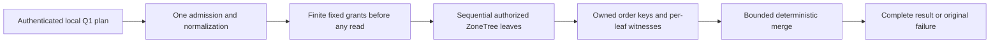

# KL-037 prerequisite: bounded local partition-leaf merge

Status: Accepted internal prerequisite; implementation and qualification pending.

This is a prerequisite-only internal stage. It exercises the existing Q1
operator against multiple real atomic partitions in one `TestDatabase` and
merges its bounded native leaf outputs. Every leaf remains on the same
`DatabaseEngine`/ZoneTree owner and must report that owner's actual node,
incarnation and read generation. Atomic partitions and RF3 replicas are not
physical shards. This stage adds no route, public contract, grain fan-out,
placement choice, cursor, or claim of distributed/RF3 execution. Full KL-037
remains pending actual independently placed physical owners and the later
Orleans/SDK/official-MCP stages.

## Requirements and acceptance

| Requirement | Acceptance | Automated evidence for this prerequisite |
|---|---|---|
| REQ-DQUERY-PREREQ-001: represent a validated bounded Q1 read plan and native leaf evidence without widening public admission | AC-DQUERY-PREREQ-001: generated internal plan accepts 1–8 unique partition leaves only; every leaf has a finite pre-granted candidate, examined-record, raw-byte and retained-byte allowance before the first leaf executes. Request version/shape, duplicate partitions, mismatched leaf/request partition, cursor, model source and inconsistent Q1 shape fail before storage reads. No caller identity or trusted role is carried in the plan. | Real ZoneTree validation tests; exact/one-over leaf-count and grant cases; generated Orleans serializer round-trip |
| REQ-DQUERY-PREREQ-002: execute each leaf through canonical local persisted authorization and expose its actual scoped evidence | AC-DQUERY-PREREQ-002: each leaf invokes the existing `QueryEngine`/`DatabaseEngine.WithQueryView` path with the authenticated principal supplied by the existing caller, reloading persisted principal, resource, row and field policy. A denial in any leaf fails the whole operation without returning earlier leaf rows. Each result retains full `EntityRef`, local cut position, policy epoch, schema version, owner node/incarnation/read generation and access path. No scalar global cut is synthesized. | Native ZoneTree positive tests across 2+ real atomic partitions; persisted denial/revocation and healthy-follow-up cases; per-leaf witness assertions |
| REQ-DQUERY-PREREQ-003: merge exact Q1 order before projection can erase sort data | AC-DQUERY-PREREQ-003: each leaf retains canonical encoded ORDER BY keys before projection. Merge compares each key using Q1 direction semantics, then breaks complete ties by ordinal `EntityRef` components `(TenantId, DatabaseId, TransactionDomainId, PartitionKey, Collection, Id)`. It emits at most `min(request.Limit, MaxResults)` rows; duplicate full references across leaves are `Corruption`. An independent central oracle compares full identity, revision, projected JSON/redaction and exact order, including a sort field omitted from projection. | Real native multi-partition store, shuffled insertion, identical textual IDs across partitions, tie and duplicate-result cases, independent in-memory seeded oracle |
| REQ-DQUERY-PREREQ-004: debit finite global work and memory grants before leaf execution/retention | AC-DQUERY-PREREQ-004: canonical request parsing/admission occurs once. The operator preallocates deterministic fixed per-leaf grants whose sums do not exceed the remaining existing `MaxScanRecords` (10,000), `MaxQueryReadBytes` (67,108,864) and `MaxBatchBytes` (8,388,608); candidates are charged/reserved before their owned order keys or projected rows are retained. Result count remains within `MaxResults` (1,000). Exact inclusive and one-over aggregate record, byte and retained-memory cases fail with `BudgetExceeded` and return no partial result. There is no work stealing or per-leaf reset of global totals. | Exact/one-over real ZoneTree reads and merge reservations; no partial rows on budget failure; later healthy query |
| REQ-DQUERY-PREREQ-005: preserve one operation token/deadline and honest leaf completion | AC-DQUERY-PREREQ-005: the existing caller token and one 30-second `QueryDeadlineSeconds` lifetime cover validation, all sequential leaf reads and merge. Caller cancellation remains cancellation; elapsed/work limits use the existing typed budget errors. Each synchronous local leaf has settled before the next starts or the method returns. During-work cancellation is asserted only through an actual native read-progress observation that cancels a real `ReadExecutionBudget`, then proves no result and a healthy follow-up. A persisted authorization/budget failure in a later leaf produces no partial page. | Real progress-observed native cancellation following existing graph/partition cancellation patterns; persisted-failure and healthy-follow-up tests |

The stage86q scalar original report establishes a test race: its async polling
monitor accepted positive bytes after the synchronous query had already returned.
TASK-DQUERY-CANCEL-OBSERVATION repairs only that test synchronization under
AC-DQUERY-PREREQ-005. Keep the same 5,000 native ZoneTree rows, request, original
CTS, 30-second operation budget and exact-token/no-result/healthy-follow-up
assertions. A QueryExecution-local native observer thread is started and signals
that it is armed BEFORE the synchronous query begins on the test thread. It
observes the actual budget byte counter, retains the observed value and requests
the same CTS on positive native work; no Task.Run/async-yield monitor races query
completion. Bound arming, observation and the initial join to 15 seconds, retain
and ultimately join the original thread before any CTS/event/store disposal,
and preserve actual primary plus observer/settlement failures with the native
ManagedCode fatal classification. A returned query, missed native progress or
failed observer is still a test failure, never a successful cancellation or
retry-to-green. No larger corpus, changed limit, fake clock/provider, product
test hook or weaker assertion is permitted. The observed native OCE and exact
caller token establish the passing flow; an armed thread alone is not that proof.
Ownership is `tests/KeyLoad.UnitTests/Features/QueryExecution/Cases/PartitionQueryCancellationTests.cs`
and populated QueryExecution `Helpers/` for its observer/failure settlement.
ADR-100 already defines the same native synchronous/cancellation boundary;
this test-only correction adds no public, persisted or runtime contract.

### Frozen internal contract

These are internal Orleans-generated value contracts in
`KeyLoad.Query.Features.QueryExecution`; they are not published or sent to a
grain by this prerequisite. Every type has `[GenerateSerializer]`, a unique
`keyload.query.<name>.v1` alias and sequential zero-based IDs. The exact names, field order and aliases are frozen for this internal stage.

| Type / alias | Ordered fields |
|---|---|
| `PartitionQueryPlanV1` / `keyload.query.partition-query-plan.v1` | `Version:int`, `NodeId:Guid`, `Incarnation:Guid`, `ReadGeneration:long`, `ImmutableArray<PartitionQueryLeafPlanV1> Leaves`, `Limit:int`, `MaxExaminedRecords:int`, `MaxReadBytes:long`, `MaxRetainedBytes:long` |
| `PartitionQueryLeafPlanV1` / `keyload.query.partition-query-leaf-plan.v1` | `Version:int`, `Partition:PartitionRef`, `AstQueryRequest Request`, `MaxExaminedRecords:int`, `MaxReadBytes:long`, `MaxRetainedBytes:long`, `MaxCandidates:int` |
| `PartitionQueryCandidateV1` / `keyload.query.partition-query-candidate.v1` | `Version:int`, `EntityRef Reference`, `QueryRow Row`, `ImmutableArray<ImmutableArray<byte>> OrderKeys` |
| `PartitionQueryLeafResultV1` / `keyload.query.partition-query-leaf-result.v1` | `Version:int`, `Partition:PartitionRef`, `NodeId:Guid`, `Incarnation:Guid`, `ReadGeneration:long`, `CutPosition:long`, `PolicyEpoch:long`, `SchemaVersion:long`, `ExaminedRecords:int`, `ReadBytes:long`, `RetainedBytes:long`, `AccessPath:string`, `ImmutableArray<PartitionQueryCandidateV1> Candidates` |
| `PartitionQueryResultV1` / `keyload.query.partition-query-result.v1` | `Version:int`, `bool Complete`, `ImmutableArray<PartitionQueryLeafResultV1> Leaves`, `ImmutableArray<PartitionQueryCandidateV1> Rows`, `ExaminedRecords:int`, `ReadBytes:long`, `RetainedBytes:long` |

Field order is stable and version is `1`. Principal identity is supplied only
from the existing authenticated operation context; the native plan contains no
principal, role, signing key, SQL text, or policy authority. The plan rejects
any leaf whose AST differs other than its partition, whose `Partition` differs
from `Request.Partition`, or whose request has a cursor, EXPLAIN, or non-null
`ModelSource`. All leaf plans share the same Q1 query, parameters, scan opt-in
and limit. Each leaf's `Limit` is the root result limit, so the global top-L is
contained in the union of each leaf's top-L. Leaf candidate storage retains
the canonical Q1 sort bytes while the result exposes only the authorized
projected `QueryRow`.

The owner identity in this prerequisite is copied from the actual single
`DatabaseEngine.Store.Identity`, not selected by a caller. All results must
match it. `CutPosition`, `PolicyEpoch` and `SchemaVersion` are per-leaf
witnesses. Policy epochs must agree across all completed leaves; otherwise the
operator fails closed with `OwnershipLost`. Cuts may differ and are never
collapsed into a global position. An unauthorized leaf preserves the existing
`PermissionDenied` result. Invalid inputs map to `Validation`, malformed
duplicate/result identity to `Corruption`, ownership/witness mismatch to
`OwnershipLost`, budget exhaustion to `BudgetExceeded`, and cancellation to
the original `OperationCanceledException`. There is no incomplete/partial
success mode.

### Bounds and operation order

1. Validate the 1–8 leaf shape, duplicate full partitions, leaf consistency,
   common Q1 AST, cursor/model/EXPLAIN exclusions and request limits before a
   database read. Admit once using current `QueryEngine` admission.
2. Create one root operation budget/deadline and normalize or compile Q1 once.
   Allocate fixed quotient/remainder grants over the canonical ordinally sorted
   partition list. Sum of all leaf record, raw-byte and retained-byte grants
   must stay within the configured remaining aggregate budgets after request
   parsing. No leaf starts before every grant exists.
3. Execute leaves sequentially through the existing local query operator.
   Each leaf consumes its grant during native scans/lookups and before owned
   candidates are retained. Preserve the current Q1 predicate, access-path,
   field authorization, projection/redaction and local read view. Do not expose
   a `PreparedRow`/borrowed `IKeyValueView` outside its `Store.Read` callback.
4. Require identical owner identity and policy epoch. Keep one cut/policy/schema
   witness per leaf. Merge the already bounded sorted runs with a k-way
   comparator; charge merge descriptors and result retention before allocation.
   Validate the complete bounded output before returning `Complete=true`.
5. Any failure or cancellation returns no rows. Each current leaf is synchronous
   and fully settled before continuation. There is no concurrent leaf queue or
   backpressure claim in this prerequisite.

The existing limits are configured limits, not new hard-coded public promises:
query bytes 65,536; tokens 2,048; AST depth 32; deadline 30 seconds; examined
records 10,000; raw read bytes 67,108,864; rows 1,000; result/retained batch
bytes 8,388,608. Every custom lower `DatabaseLimits` setting remains effective.
Per-leaf grants are deterministic and non-borrowable. They may conservatively
reject skewed data; no grant can be multiplied by the number of leaves.

### Explicit KL-037 boundaries still open

This prerequisite cannot prove independent physical owners, catalog routing,
Orleans fan-out, remote producer backpressure/settlement, bounded owner
availability, SDK/official MCP transport parity, partial-result policy, query
statistics epochs or any RF3 distributed behavior. Current `QueryEngine.Execute`
and `WithQueryView` are synchronous; a deterministic slow in-flight *remote*
leaf oracle does not exist without the later native Orleans leaf route. Do not
add a fake provider, artificial delay hook, or production observer to simulate
one. The synchronous local leaf still proves persisted later-leaf failure,
real during-work cancellation, per-leaf budget exhaustion and whole-result
failure. Slow-owner timeout, capacity-one native stream backpressure, original
remote-task join, and real multi-owner exact-source RF3 remain pending and must
be added only with their owning KL-037 stage.

## Source basis and ownership

The original architecture acceptance is
[`architecture-v0.3.uk.md:765-770`](../../design/architecture-v0.3.uk.md).
Current Q1 contracts are `QueryRequest`/`AstQueryRequest`, `QueryPage`, and
`QueryRow` under `src/KeyLoad.Abstractions/Features/QueryExecution/Contracts/`.
The local operator is `src/KeyLoad.Query/Features/QueryExecution/Queries/QueryEngine.cs`;
`PreparedQuery` owns canonical encoded order keys and currently ties on only
encoded `EntityId`; `QueryCandidateReader` applies the existing native read
budget and candidate scan. `DatabaseEngine.WithQueryView` at
`src/KeyLoad.Core/Features/DocumentStorage/Execution/Documents.cs:107` provides
per-leaf persisted authorization and scoped native read view.
`ReadExecutionBudget` at `src/KeyLoad.Core/ReadExecutionBudget.cs` provides
current token, time, raw-byte and output bounds. `TestDatabase` opens a
real temporary `ZoneTreeStore`, bootstraps persisted root identity and exposes
its actual `DatabaseEngine`; no mock storage seam is needed.

Source ownership is limited to Query feature-local internal contracts,
models, validation/admission and executor helpers plus a narrow private
`QueryEngine` join, with real ZoneTree tests in UnitTests `Features/QueryExecution`
role folders. Query owns no physical placement or transport. The Core grant seam below enforces native leaf read ceilings; never perform
post-hoc accounting.

The exact broader KL-037 target remains in `docs/design/architecture-v0.3.uk.md`;
this file is a prerequisite-only stage. The implementation must not mark
KL-037 complete or change its status evidence. UI, SDK, MCP, SQL grammar, server,
Orleans routing and physical catalog are N/A for this stage.

## Canonical slice and implementation map

| Owner | Exact owned paths |
|---|---|
| QueryExecution native values | `src/KeyLoad.Query/Features/QueryExecution/Contracts/PartitionQueryPlanV1.cs`, `PartitionQueryLeafPlanV1.cs`, `PartitionQueryCandidateV1.cs`, `PartitionQueryLeafResultV1.cs`, `PartitionQueryResultV1.cs` |
| Query validation and execution | QueryExecution feature-local `Validation/` and `Execution/`, with `Execution/PartitionQueryExecution.cs` and one internal owner accessor in `Queries/QueryEngine.cs` |
| Native regression cases | `tests/KeyLoad.UnitTests/Features/QueryExecution/Cases/PartitionQuery*Tests.cs`, with actual fixtures and assertions in their owning role folders |
| Core grant dependency | Existing `src/KeyLoad.Core/ReadExecutionBudget.cs` and a ResourceExecution role-owned grant helper, only after its exact contract is separately frozen below |
| Durable ADR | [ADR-100](../../ADR/ADR-100-local-partition-query-merge.md) |

This internal stage does not export a product result stream. Native Orleans
fan-out and ManagedCode.Communication streaming remain required in the later
KL-037 distributed stage before any public SDK or MCP route is delivered.

## Frozen native read-grant dependency

`ReadExecutionBudget.CreateReadGrant(long maximumBytes, int maximumRecords)` is internal and
returns the internal `ReadExecutionBudgetReadGrant`. Core exposes these only
to its explicitly declared `KeyLoad.Query` friend assembly. The helper lives
at `src/KeyLoad.Core/Features/ResourceExecution/Execution/ReadExecutionBudgetReadGrant.cs`;
its genuine native tests are `ReadExecutionBudgetGrantPointTests`,
`ReadExecutionBudgetGrantRangeTests`, `ReadExecutionBudgetGrantReservationTests`
and `ReadExecutionBudgetGrantCancellationTests` under UnitTests
ResourceExecution/Cases. No public budget API or transport is added.

Every grant is reserved before any leaf starts. Nonnegative ceilings are
accepted (zero permits only zero-charge reads); negative internal API input
is `ArgumentOutOfRangeException`. Creation checks the original root token
and deadline and uses subtractive overflow-safe admission. Accepted native
`ReadBytes` plus every outstanding reserved remainder stays within configured
`MaxQueryReadBytes`. Ordinary root `ChargeBytes` excludes those reservations
from available capacity. A native grant charge first checks original root
cancellation/deadline and its own remaining ceiling, then converts that
accepted count from reserved remainder to cumulative root `ReadBytes`, before
any visitor, copy or deserialization. Rejected charges do not mutate counters.
Unused remainder remains reserved for the operation; no later leaf borrows it.

Grant `ReadValue`/`VisitRange` invoke the actual original `IKeyValueView`
with its native pre-read charge callback and root token. Do not wrap an
already budgeted view, create another deadline/CTS or debit a read twice.
Reservation or leaf exhaustion preserves the existing safe read-byte
`BudgetExceeded` error. Ordinary root behavior is identical when no grants
exist. This stage remains synchronous and sequential and makes no concurrent
budget thread-safety claim. Exact/one-byte-under native reads prove the
visitor never executes on rejected charge, original cancellation/deadline
remains effective, and later ungranted work cannot consume reserved capacity.

The new internal leaf and merge use ordinal full-reference ties consistently
before top-L selection, including Unicode boundary cases. Existing public
Q1 `PreparedQuery` UTF-8 ID tie ordering remains its current contract.

The grant also reserves a fixed examined-attempt allowance within configured
`MaxScanRecords`. One native `StorageReadObserver` callback is one examined
attempt, including a missing point lookup and charged range lookahead. Every
callback checks both leaf ceilings before converting one reserved attempt and
its raw-byte charge into accepted totals. Either rejection mutates neither
counter. Grant `ReadBytes` and `ExaminedRecords` expose accepted work; parser
`ChargeBytes` is not an examined native attempt. Examined exhaustion has the
safe `BudgetExceeded` diagnostic "The read execution examined-record budget
is exceeded." Ordinary root behavior is unchanged when no grants exist.

## Frozen conservative retained-byte model

This model bounds logical retained query state and does not promise process
RSS. Constants are: pointer slot8, array descriptor32, string descriptor32,
candidate/reference/projected-row descriptors256, heap entry64 and seen-full-
reference entry64 bytes. Use checked or subtractive overflow-safe arithmetic.

A candidate costs256 plus `(32 + 2 * Length)` for each of its six full
EntityRef strings, `(32 + 2 * Row.Json.Length)`,
`(32 + 8 * Row.RedactedFields.Length)` plus `(32 + 2 * Length)` for each
redacted field string, and `(32 + 8 * OrderKeys.Length)` plus
`(32 + key.Length)` for each canonical order byte array. Row.Id reuses
Reference.Id and is not charged again. Repeated field strings may make this
logical model conservative even when native objects share storage.

Before fixed per-leaf retention grants are divided, reserve128 root descriptor
bytes,256 per leaf,64 per total planned MaxCandidates for the full-reference
seen set,64 per leaf for merge heap entries, and32+8*rootLimit for final row
slots. Each leaf reserves32+8*(L+1) heap/scratch reference slots and charges
owned candidate payload before retaining it in top-L, releasing rejected or
evicted payload. Before allocating the final leaf candidate array, reserve
its own32+8*n bytes while the scratch heap is still held; relinquish scratch
charges only after that helper relinquishes its containers. Final retained
totals cover surviving payload and owned leaf/result containers. Leaf result
candidates and merged Rows reference the same objects: row-slot arrays cost
bytes, candidate payload is never charged as a second allocation.

The existing canonical KeyCodec remains unchanged. Only one temporary
candidate's encoding/projection is present at once, bounded by admitted native
raw bytes and configured document limits; that transient bound is distinct
from final retained accounting. This stage makes no peak-RSS claim. Exact and
one-under tests compute the frozen retained formula independently from their
scalar seeds, including Unicode, escaped JSON and redacted fields.

The internal leaf top-L uses one custom binary heap backed by exactly L+1
reference slots. It compares canonical order bytes and ordinal full EntityRef
before admission; the public Q1 PriorityQueue and its existing UTF-8 EntityId
tie contract remain unchanged. Compute and reserve the exact owned candidate
payload before inserting it. Reservation failure leaves the previous heap and
output unchanged. Before transferring candidates, reserve the final array
while heap scratch is still held, clear and relinquish every heap reference,
then release its scratch reservation. One callback-local temporary candidate
is bounded by admitted raw bytes and document limits; it is not retained output.

## TASK-PQUERY-PUBLIC: accepted same-owner SDK/MCP contract

Status: contract accepted before implementation; source integration and all runtime qualification remain open. This stage does not complete KL-037 remote execution.

This stage publishes a typed multi-partition request over the already implemented bounded local partition-leaf merge. It runs all leaves through one existing authenticated request grain, one local DatabaseReadGrain, and one node-local QueryEngine/ZoneTree owner. The RF3 peers remain replicas of one physical shard. The stage does not add placement, remote leaf fan-out, a global transaction snapshot, cursors, SQL grammar, or independent-shard qualification.

## REQ/AC

TASK-PMAP-CORRUPTION-ORDER-001 refines existing REQ/AC-PQUERY-003 without changing grants or public shapes: malformed decoded placement identity fails `Corruption` before an unnecessary registered-owner lookup. An unknown owner referenced by a committed row is corrupt state, while an unknown target proposed by a new bind remains `UnsupportedCapability`. All actual reads retain their original byte/attempt charges, same-view authorization and exact owner-tuple validation. The two original Linux corruption regressions and broader placement/query flows must pass; source presence is not qualification. See the correction in [AtomicPartitionPlacement](../ClusterRouting/AtomicPartitionPlacement.md) and ADR-101.

- REQ-PQUERY-001: expose a bounded generated request that carries only up to eight full atomic `PartitionRef`s, one existing `SelectQuery`, existing query parameters, full-scan opt-in, and AST version. AC-PQUERY-001: reject default/empty/over-eight or duplicate partitions, invalid AST version/shape, oversized request, cursor-bearing or otherwise unsupported query semantics, `Explain`, and non-null `ModelSource` before any storage read; do not accept caller identity, roles, cut, owner/catalog witness, read grant, physical placement, or deadline.
- REQ-PQUERY-002: retain the native persisted-authority and catalog fence. AC-PQUERY-002: each SDK/MCP call follows signed request verification, native request identity validation, `NativeRequestWorkOwner` admission, the existing quorum `ReadBarrierAsync`, request freshness validation, persisted `GrainRequestAuthority.Reload`, and normal `GrainQueryReadCapabilities` execution. No admin-only `ReadPhysicalShardCatalog` or `ReadAtomicPartitionPlacement` public API is invoked for a non-admin. The node startup/per-request catalog admission fence remains the authority that the local server is a current member of the configured physical owner.
- REQ-PQUERY-003: bind each authorized leaf to the canonical placement visible in that same leaf's native `Store.Read`. AC-PQUERY-003: call the internal placement view reader only *inside* the existing `WithQueryView` callback, after it has loaded persisted principal and passed `Authorization.Require(Query | DocumentsRead)` for that leaf's partition/collection. That internal helper reads and validates SCAT plus descriptive PMAP from the provided `IKeyValueView`, performs no principal/admin check and no separate `Store.Read`, and returns only an internal typed owner witness. Compare its full physical-shard ID, incarnation, exact ordered voters and placement epoch with the server-owned expected local physical-owner tuple supplied by the authenticated DatabaseReadGrain composition; validate each row/fallback revision against its own same-view directory and row; valid leaves may differ in row revision and fallback state. Same-tuple placement is supported. A valid assignment to another physical owner fails `UnsupportedCapability` in this stage; corrupt/inconsistent catalog/placement fails `Corruption`; a catalog tuple that no longer matches this node's expected owner fails `OwnershipLost`. No fallback or refresh of malformed/mismatched PMAP records.
- REQ-PQUERY-004: reuse exact DQUERY r2 semantics and budgets. AC-PQUERY-004: one admission/normalization/compilation and one original `ReadExecutionBudget`/caller token/deadline cover all sequential leaves and merge. Reserve the complete 1–8 leaf grants before any read; each leaf rechecks persisted principal/resource/row/field policy, same-view SCAT+PMAP owner evidence, exact owner identity/read-generation, and policy epoch. Any later denial or witness mismatch returns no rows. Preserve separate per-leaf cut positions; never synthesize a scalar global cut. Keep the internal DQUERY exact comparator, full EntityRef tie-break, candidate/work/read/retained bounds and no partial result.
- REQ-PQUERY-005: expose only complete typed replies through the existing native CQRS stream. AC-PQUERY-005: the one RequestGrain returns one typed `PartitionQueryPageV1` after all local leaves and merge settle; faults/cancellation dispose/join the actual stream under existing native lifecycle rules. SDK and official MCP logical results match; no second dispatcher, unbounded materialization, or partial-page mode.
- REQ-PQUERY-006: qualify the public same-owner capability on the real AppHost Docker RF3 topology. AC-PQUERY-006: direct .NET SDK and official MCP cover independent ordered oracle, same textual IDs in distinct partitions, hidden sort fields, ties, empty/no-hit partitions, persisted denial/revocation on a later leaf, caller cancellation/limits with healthy follow-up, acknowledged write/read through a survivor, scoped supported leader loss/rejoin, and malformed/version/oversized input. The real official MCP schema oracle checks exact request/result properties and required fields; nested `PartitionRef` includes computed `atomicPartitionId` as an optional schema property in addition to its four required identity strings. For nullable `Parameters: Dictionary<string, JsonElement>?`, the type oracle admits only scalar `object`, singleton type-array `[object]`, or the exact unordered two-member set `{object, null}`; the latter is permitted only at this nullable dictionary site. Non-nullable schema fields accept only their exact scalar or singleton type array. Extra, duplicate, empty, non-string, or contradictory type arrays fail. Local references remain bounded to depth 8. Ordered tie fixtures use the native non-unique rank index without changing duplicate-rank inputs; separate native unique-index rejection cases remain mandatory. Every row with `Redacted == false` has a present, initialized `RedactedFields` collection with zero entries; a null collection is not equivalent. Rows that redact data retain the exact omitted field paths. Evidence does not claim independent physical owners, remote fan-out, or full KL-037 completion.

## Public generated contracts

The frozen public error map distinguishes the request envelope from the AST: an unsupported `PartitionQueryRequestV1.Version` returns `Validation`; an unsupported `AstVersion` returns `UnsupportedCapability`. Neither returns a successful partial page. Empty, duplicate or over-eight leaves are `Validation`; configured request/result/retained limits are `BudgetExceeded`.

All contracts live in `KeyLoad` alongside current query contracts; aliases are feature-local named constants in Abstractions `Features/QueryExecution/Serialization`, not a new global alias layer.

- `PartitionQueryRequestV1`, alias `keyload.contract.partition-query-request.v1`: `[Id(0)] int Version` (must be 1); `[Id(1)] ImmutableArray<PartitionRef> Partitions`; `[Id(2)] SelectQuery Query`; `[Id(3)] Dictionary<string, JsonElement>? Parameters`; `[Id(4)] bool AllowFullScan`; `[Id(5)] int AstVersion` (must be 1). `SelectQuery.Limit` remains the sole row-limit field. Cursor, explanation, and model-source are absent/rejected. The server caps partitions at 8 and enforces the current configured query/result/body/read/scan/retention limits; no caller-settable work grant exists.
- `PartitionQueryRowV1`, alias `keyload.contract.partition-query-row.v1`: `[Id(0)] EntityRef Reference`; `[Id(1)] QueryRow Row`. The full reference distinguishes equal textual IDs in different partitions. No canonical sort bytes or unprojected record is public.
- `PartitionQueryLeafWitnessV1`, alias `keyload.contract.partition-query-leaf-witness.v1`: `[Id(0)] PartitionRef Partition`; `[Id(1)] long CutPosition`; `[Id(2)] long PolicyEpoch`; `[Id(3)] long SchemaVersion`; `[Id(4)] string AccessPath`. Owner NodeId/incarnation/read-generation and physical catalog/PMAP tuple are validated internally and are not exposed. These are per-leaf witnesses and can differ in cut/schema/access path; policy epoch and actual owner identity must agree.
- `PartitionQueryPageV1`, alias `keyload.contract.partition-query-page.v1`: `[Id(0)] int Version`; `[Id(1)] ImmutableArray<PartitionQueryRowV1> Rows`; `[Id(2)] ImmutableArray<PartitionQueryLeafWitnessV1> Leaves`; `[Id(3)] bool Complete`. Every successful reply has `Complete=true`; all failure paths return no rows and there is no incomplete mode.

## Concrete owner/read-view seam proposal

PMAP r2 adds an admin-gated public reader and an internal overload that also performs the administrator check; those are not suitable for an ordinary query leaf. Add the Core-internal `ReadAtomicPartitionPlacementForAuthorizedQuery(IKeyValueView view, PartitionRef partition, ReadExecutionBudgetReadGrant grant)` seam specified below. Only the Query caller invokes it after persisted ordinary leaf authorization, and all three metadata reads consume that actual leaf grant.

The DatabaseReadGrain composition passes a server-owned immutable expected-local-owner tuple into the Query capability from the already-fenced startup configuration (configured `PhysicalShardId`, actual ordered voter IDs, local incarnation, and configured/current placement epoch). It is never derived from request data. If exposing this tuple from the current host composition requires an exact additional internal interface or DI type, root must approve that single join before implementation. Do not call the public admin catalog methods to obtain it and do not add an alternate public capability.

## Ordered ownership and joins

1. Contract/ADR review freezes aliases/IDs/error map/response witnesses and explicitly says no global cut or multi-owner claim.
2. Core owns only the internal same-view descriptive placement reader in its current `ClusterRouting/Queries` role folder and its real ZoneTree tests. It must not weaken PMAP/SCAT public admin checks.
3. Query owns the public generated DTOs/aliases, bounded request validation, mapping to existing internal `PartitionQueryExecution`, per-leaf placement witness check inside the already-authorized `WithQueryView`, and projection from internal candidates to the complete public page. It retains the existing QueryEngine/one-budget path; no second admission/deadline.
4. Root owns append-only `GrainReadKind.PartitionQuery` and `GrainQueryReadCapabilities` binding inside `DatabaseReadGrain`, existing request-envelope/payload validation and capability inventory; no second grain/dispatcher.
5. Root owns HTTP `POST /v1/query/partitions`, SDK `PartitionQueryAsync(PartitionQueryRequestV1, CancellationToken)`, MCP `keyload_query_partitions` at `/v1/query/partitions` with read-only hints/catalog description, and typed response mapping, all through the normal signed read path.
6. Add generated-native codec/strict public-input cases; real ZoneTree unit tests; then genuine AppHost RF3 .NET SDK + official MCP tests. Build/format/analyzers and complete unit/recovery/RF3 gates precede any acceptance claim.

## Source-grounded current joins

- `SelectQuery` is generated native Q1 and already owns `Limit` (IDs 0–7; `QueryAst.cs`); `AstQueryRequest` has one `Partition`, optional `Cursor`, and `AstVersion` (IDs 0–5). The proposed public request deliberately does not embed it.
- `PartitionQueryExecution.ExecutePartitionQuery` is internal and already creates one `ReadExecutionBudget`, admits once, normalizes once, reserves all grants, executes sequential real local leaves and merges complete output.
- `PartitionQueryLeafExecutor.Execute` calls existing `DatabaseEngine.WithQueryView`, whose callback runs only after persisted principal/resource authorization. It captures owner identity and per-leaf cut/policy/schema/access-path witnesses.
- `DatabaseReadGrain` currently owns signed validation, native read admission, one quorum barrier, freshness and persisted authority reload before `GrainQueryReadCapabilities.ExecuteAsync`; the new kind must be appended without changing existing numeric enum values.
- `PhysicalShardCatalogReader.ReadPhysicalShardCatalog` and `DatabaseEngine.ReadAtomicPartitionPlacement` are explicitly administrator-gated. They cannot be called as an ordinary query user's placement check. PMAP r2's internal resolution currently opens its own store read; the new authorized-query method must instead accept the existing view.
- Existing transport joins are `QueryApi.Map`, `KeyLoadClient`, `McpReadCatalog`, `McpToolNames`, `McpToolRoutes`, `McpToolHints`, and `ApiGrainDispatch`. Root owns all of them.

## Required same-view owner-check and public mapping amendments

The PMAP prerequisite's ordinary APIs are intentionally administrator-gated. Query MUST NOT call those public methods, and no administrator identity or capability is added to ordinary reads.

The same-view Core seam has this exact proposed signature:

`internal static AtomicPartitionPlacementResolution ReadAtomicPartitionPlacementForAuthorizedQuery(IKeyValueView view, PartitionRef partition, ReadExecutionBudgetReadGrant grant)`

The only Query caller invokes it within the existing `DatabaseEngine.WithQueryView` callback, which has already loaded the current persisted principal and passed the leaf's ordinary Query/DocumentsRead resource authorization. Core validates the full partition; reads and validates the SCAT catalog, PMAP directory, and assignment row from that exact view using the supplied actual native grant's bounded `ReadValue` calls (no `GetRecord` bypass, new Store.Read, admin gate, write, repair, fallback around corruption, or borrowed view escape); and returns the validated internal resolution. Existing mismatched row/DefaultShard owner tuples remain `Corruption`. Query compares the returned physical ID, incarnation, exact ordered voter IDs and placement epoch to the immutable internal `PhysicalShardRecord` supplied by the already-fenced native DatabaseReadGrain host composition. A mismatch between current catalog and this server's expected tuple is `OwnershipLost`. A valid different owner is `UnsupportedCapability` until native KL-037 remote fan-out is implemented. Directory/row/fallback revision is checked against each leaf's own same-view header/row. Valid row revisions and fallback states may differ between partitions; directory revisions may differ across the distinct scoped cuts. Only the full owner tuple and existing node/incarnation/read-generation/policy consistency are required across leaves, without a global snapshot. The three metadata point reads consume the same leaf grant's raw bytes and examined-attempt allowance before decode, leaving no uncharged metadata lookup. All authorization stays in the existing `WithQueryView` path and no caller-controlled tuple exists.

The public mapper has this exact operation shape: `PartitionQueryPageV1 MapPublic(PartitionQueryResultV1 result, DatabaseLimits limits, ReadExecutionBudget budget)`. It computes and admits the checked public mapping retention *before allocating* page arrays, row wrappers, or witness records, while the internal candidate buffers and their sort keys are still held. The conservative logical additional charge is named and frozen as: page descriptor64; each returned-row array uses descriptor32 plus8 per reference and each new row wrapper costs32; each leaf-witness array uses descriptor32 plus8 per reference and each new witness wrapper costs64. `EntityRef`, `QueryRow`, their strings, and the existing partition/access-path values are references reused from the already owned internal result; no payload/sort-key/JSON bytes are copied by the mapper. Checked sum of `result.RetainedBytes` plus this additional mapping charge must remain ≤ configured `MaxBatchBytes` before allocation; otherwise throw typed `BudgetExceeded` with no page. After mapping, call the existing `budget.CheckResult(publicPage)` to enforce serialized response-byte bounds and cancellation. This is an intentional conservative overlap reservation while internal source buffers remain live; it makes no process-RSS claim, opens no second budget/deadline, and leaves the internal result unreachable after return.

Root-owned native composition supplies the current `PhysicalShardRecord` only from the successfully fenced host startup state; it is an immutable server value, never derived from request or public catalog read. The expected-record source, lifetime, and stale-fence error path must be frozen at the Orleans join before code. The internal call receives the existing `ReadExecutionBudgetReadGrant` already assigned to the leaf, so the owner's SCAT/PMAP values are included in exact existing byte/attempt grants before native decode.

The final public page field order is fixed as accepted: Version `[0]`, Rows `[1]`, Leaves `[2]`, Complete `[3]`. Exact aliases and IDs in the preceding tables remain unchanged.

### Frozen native composition and acceptance evidence

Root registers one immutable `PhysicalShardRecord` in `OrleansSiloConfiguration.RegisterBorrowedServices`, constructed only from `NodeOptions.PhysicalShardId`, `PartitionHost.Configuration.Incarnation`, an immutable copy of its exact ordered voter IDs, and `PhysicalShardCatalogStartupProtocol.InitialPlacementEpoch`. `DatabaseReadGrain` receives this server-owned singleton and passes it to `GrainQueryReadCapabilities`. Public execution remains behind the existing successful startup/per-request catalog admission fence; every authorized leaf validates fresh same-view committed SCAT/PMAP against this expected tuple and returns `OwnershipLost` on a stale host tuple. No separate provider, public request field, admin credential or public admin read supplies it.

`PartitionQueryExecution.ExecutePartitionQuery` retains its existing internal calls unchanged and gains the typed expected-owner overload used by the public wrapper. Metadata checks run only in that overload; existing internal local primitive tests retain their stated local contract. Query's public entry accepts the server tuple as an explicit composition argument; neither the HTTP/SDK/MCP request nor native grain payload accepts that argument. Public normalization validates every requested partition first and uses the first canonical sorted partition as the server-generated `AstQueryRequest.Partition` anchor. All leaves remain in the plan and are authorized separately.

REQ/AC-PQUERY-001/004/005 map to `PartitionQueryPublicContractTests`, `PartitionQueryPublicBudgetTests` and `PartitionQueryPublicMergeTests` under `tests/KeyLoad.UnitTests/Features/QueryExecution/Cases/`; REQ/AC-PQUERY-002/003 map to real ZoneTree `AtomicPartitionPlacementQueryViewTests` under `tests/KeyLoad.UnitTests/Features/ClusterRouting/Cases/` and `PartitionQueryPublicAuthorizationTests`; AC-PQUERY-006 maps to `PartitionQueryPublicRf3Tests` under `tests/KeyLoad.IntegrationTests/Features/QueryExecution/Cases/`. Root joins the append-only native read kind, persisted authority path, signed SDK/HTTP/MCP route and complete independent MCP inventory/schema/native-codec corpus. All of these tests use the Aspire-owned caller. A focused pass is development evidence; original full Linux unit/scalar/recovery/RF3/fault/endurance evidence remains required.

The same-view Core helper is static because it uses only the already authorized borrowed view, complete partition and actual leaf grant. This implementation modifier adds no API, authority, storage view or state.

### Complete-flow contract regressions, 2026-10-05

TASK-PQUERY-FUNCTIONAL-CONTRACT-001 strengthens the existing seven
`PartitionQueryMcpContractTests` under REQ/AC-PQUERY-001/005 and
REQ-CQ-009/AC-CQ-021. Each positive test configures an actual persisted collection,
commits a literal document to genuine ZoneTree, decodes the real native/public
request, executes `QueryEngine.QueryPartitions`, and checks the full returned
reference, projected content, persisted revision, leaf witness and unchanged
committed state. Alias/field-ID, schema/effect-hint and writer equality checks
remain additional assertions inside those operations. Page serialization consumes
the actual returned page, never a constructed successful reply.

The canonical MCP request without full-scan permission executes and rejects with
`UnsupportedCapability`, preserving the stored document and position. Decode a
request with explicit permission through the same catalog and execute a healthy
follow-up on that same store. Invalid envelope/AST versions retain their actual
pre-storage rejection, exact errors, zero storage reads and unchanged position.
Keep the existing test names and normal/scalar contributor identity. These local
native-codec flows do not replace the official MCP/SDK RF3 AC-PQUERY-006 cases.

Canonical MCP AST/partition-query fixtures use a valid RFC6901 field pointer
while preserving their identifier alias. A bare identifier path is malformed
input and must not mask the intended full-scan denial. The same decoded canonical
request must pass normal validation, produce the specified consent rejection,
then return the complete persisted row after explicit consent; correcting fixture
input does not weaken production validation or change its error contract.

Ownership: existing ClientApi/Cases/PartitionQueryMcpContractTests.cs and
ClientApi/Helpers/PartitionQueryMcpTestData.cs in the QueryExecution test slice;
production contracts, aliases, field IDs and execution paths are unchanged.
ADR: the existing ADR-100 public-query contract is sufficient; no new boundary,
data format or transport is introduced. First complete source review and the
strict Release build, then run the normal/scalar functional profile through
Aspire with fresh source/DLL/PDB/contributor guards and retain its original native
reports. Actual collection and complete mandatory suites remain acceptance gates.

## TASK-OWNER-DOCUMENT-1B-002: configured A-to-B document read stage

REQ-OWNER-DOC-001..006 map respectively to AC-OWNER-DOC-001..006. This implementation stage is explicitly opt-in ephemeral two-RF3 data admission, dependent on the configured native owner directory. Default RF3 is unchanged. Only explicit immutable PMAP assignments to the exact registered destination may route an existing document Get request. Local effects and non-routed reads reject foreign ownership before effects or token creation; general fanout and remote writes remain open.

The source captures current persisted principal identity/tenant/policy epoch and exact PMAP/directory fence after native quorum admission. A domain-separated configured peer signature carries identity and scope, never grants, roles or credentials. B independently authorizes its matching current persisted principal during its actual native document read cut through a unique RequestGrain/CQRS child. Physical placement hints scope and restore the native RequestContext value and do not authorize execution. Original deadlines, cancellation and admission limits dominate all owned transport/child work. Source rechecks its fence after the reply; no transparent retry or cross-owner position comparison is permitted.

The reply's private native witness binds the actual destination node/incarnation/read generation, partition owner and policy/applied cut. Public callers receive only the authorized DocumentResult. SDK GetAsync, official keyload_documents_get and the existing SQL CALL share the same execution. Existing minimum CommitToken is evaluated on B, not A. No persisted text/index checkpoint or global snapshot is claimed.

Implementation order: registered-owner PMAP validation/local execution fence; typed private document witness and same-cut reader; bounded signed peer transport and fresh destination admission; explicit startup ownership and joined shutdown; real ZoneTree denial/repair/healthy flows; real owned six-silo SDK/MCP/CALL denial, literal result, original B receipt replay and restart. Each stage remains unqualified until its actual native operation gates run. Source-only assertions are not acceptance. Existing ADR106/ADR100 ownership, ADR002 retained failure, authorization and document-session contracts remain in force.

## Fresh policy and native transport ownership join

Source and destination each require their own current persisted DocumentsRead grant before physical placement/token diagnostics; source epoch/tenant/map/directory are rechecked after the remote reply. The destination child again loads fresh persisted identity at its actual quorum-backed read cut. The source transport owns both native HttpClient and SocketsHttpHandler directly; HttpClient borrows its handler, and shutdown joins all original work before observing both disposals and address-pin disposal. Current root physical-owner lifecycle/configuration fixes and ADR106 native integration appendix must survive this stage. SDK and official MCP both exercise existing Q1 CALL, with no new catalog/dialect entry.

# KL037 configured physical-owner partition query

Private docs-first implementation, layered after immutable KL036 RemoteDocument R2 and current root lifecycle/ANN R4. No native qualification or original-task closure.

REQ-PQUERY-REMOTE-001 / AC-PQUERY-REMOTE-001: the existing PartitionQuery request/page, SDK, official MCP and existing CALL identities remain unchanged. Explicit existing opt-in two-owner topology admits configured A local leaves and registered explicit-PMAP B leaves only; default RF3 continues existing local execution. Maximum eight partitions, original configured request/read/examined/result/retained budgets remain unchanged. No generic owner discovery, global policy or migration support.

REQ-PQUERY-REMOTE-002 / AC-PQUERY-REMOTE-002: capture current persisted source principal and ordinary Query|DocumentsRead grants per logical scope before directory diagnostics, under charged source metadata read cuts. Route to exact signed configured destination/incarnation/voters/endpoint via the existing native physical-owner transport/pins/replay/operation owner. Every local or B leaf executes a new signed unique RequestGrain/CQRS read actor; receiving B reloads its own persisted same subject and tenant, ordinary query/field grants, actual local physical owner and fresh quorum/applied read cut. The envelope carries subject/scope only, no caller roles/grants. Native query leaf plan/result remains server-only, using the existing query executor and native sortable candidate keys, never a second planner or public private-field projection.

REQ-PQUERY-REMOTE-003 / AC-PQUERY-REMOTE-003: reserve all existing plan grants before dispatch. Each receiving native leaf enforces the exact downwards grant plus its own limits, original parent expiry and current child cancellation. Original source budget and elapsed clock are never recreated between leaves. Import only signed, verified actual completed leaf work summaries into their pre-reserved aggregate grants before retaining results. Aggregate mutable state and final merge remain serialized; first implementation dispatches sequential leaves. Parallel independence/resource/performance acceptance remains open, max8 is not concurrency evidence. Every failure/cancel/deadline returns no public page; no incomplete-success mode, invisible retry or second admission budget.

REQ-PQUERY-REMOTE-004 / AC-PQUERY-REMOTE-004: validate each leaf against its exact admitted physical destination rather than one common node/incarnation. Cuts and persisted policy epochs may differ across independently owned A/B stores; within one owner changed policy/identity rejects. Sort, full-reference ties, row projection, retention calculations and complete public mapping use the original native merge. Revalidate every original source principal/PMAP/directory fence after all child settlement before public retention. No cross-owner snapshot or equal position claim. Cancellation/disposal restores previous RequestContext and joins all original native transport/read workers before file/owner teardown.

REQ-PQUERY-REMOTE-005 / AC-PQUERY-REMOTE-005: genuine two-store unit flows and six-silo RF3 exercise source grant denial, B grant denial, cancellation with no page/full canonical state unchanged, then independently literal merged ordered rows/full leaf witnesses and healthy continuation. SDK and official MCP public operations retain original immutable B write receipts/replay and same owner restart/routing. Existing single-owner native gates remain mandatory. Source/code is not passing evidence.

Ordered join: Query native leaf plan/result API + original merge expected-owner validation; Core charged scope fence; additive private Orleans leaf read kind/codec and unique actors; existing signed physical-owner transport query branch and source router; existing parent public PartitionQuery interception; actual unit/six-silo flows; independent guarded review; root build/format/genuine census/full normal/scalar/recovery/RF3. No current default catalog count or SQL grammar change. Shared R2 and root lifecycle/config files require exact layered guards; original packets remain immutable.

### Native implementation and authored operation trace

TASK-PQUERY-REMOTE-001..005 follows the ordered join above. REQ/AC-PQUERY-REMOTE-001..004 map to `PartitionQueryRemoteExecution`, `PartitionQueryLeafExecution`, `RemotePartitionQueryLeafRead` and the existing physical-owner transport's typed query branch. The source charged scope reads the actual native principal/resource bytes before decoding; resource byte digest, principal epoch, PMAP and directory fences are rechecked after each actual leaf and after the final source quorum barrier. A changed source resource policy rejects even when the projected field remains readable. This digest is source-local and never part of peer/public/log metadata. Child grants reserve source metadata rechecks without new quotas; validated actual leaf counters are imported before result retention.

REQ/AC-PQUERY-REMOTE-005 maps to `tests/KeyLoad.UnitTests/Features/QueryExecution/Cases/RemotePartitionQueryNativeTests.cs` (five authored real two-store methods) and `tests/KeyLoad.IntegrationTests/Features/QueryExecution/Cases/RemotePartitionQueryRf3Tests.cs` (one authored actual six-silo SDK/MCP/CALL scenario). Native discovery must establish the actual identities: intended filters `/*/*/RemotePartitionQueryNativeTests/*` and `/*/*/RemotePartitionQueryRf3Tests/*`; no native UID/count/PASS is fabricated. Unit cancellation occurs after the first actual native leaf has settled; public SDK cancellation is pre-submit admission only. These do not establish in-flight remote cancellation. Destination work ownership remains retained until actual native settlement and joined shutdown, rather than treating source HTTP abortion as remote settlement proof.

The public flow compares complete independently literal projected rows/redaction/ranks, checks each owner's own observed cut without equating A/B cuts, verifies independently literal A/B write receipt identity/token/mutation contracts and byte-identical original command replay without advancing that owner's applied position, then repeats healthy operations after the owned B restart. Parallel independent leaf dispatch, generic owner fanout, global policy, movement, in-flight remote cancellation and performance qualification remain open. Default RF3 and catalog admission remain unchanged. The unpublished R2 private read-kind additions must be carried forward after current live AnnMaintenance without renumbering a published ordinal. Fresh build/native schema, tool graph, census and module/source/image receipts are required after join; source review is not qualification.

### Stage XVII native diagnostic correction

TASK-KL037-NATIVE-DIAGNOSTICS-001 preserves the existing remote-owner requirements, acceptance criteria and ADR-100 execution contract. Validated native options flow downward as IOptions; source and destination retain the same signed identity, source fences, per-owner cut, limits and expiry. Explicit try/finally ownership joins each admitted operation and failed-construction owner, retaining the original primary error and cleanup failures. Native host shutdown is extracted into a feature-local lifecycle helper without changing shutdown order or deadline. This correction adds no new public behavior or qualification claim; the full native build, existing unit/scalar/recovery and owning RF3 flows remain required.

# KL037 bounded independent native owner leaves — pre-implementation contract

Prerequisite: immutable remote document/partition query composed101 e18d4d75c82c543033b50c0e1c9f96496a0b4b89ab109c7d7826d8a7d6634a2d. This stage preserves explicit configured A/B ownership, canonical PMAP/directory/incarnation pins and destination-local persisted authorization. Default RF3 and logical plan/order/merge semantics remain unchanged.

REQ/AC-DQUERY-PREREQ-005 and REQ/AC-PQUERY-004/005/006, ADR100: centrally validated downward MaximumConcurrentPartitionLeaves defaults2, ceiling8 and never exceeds actual plan leaves/MaximumPartitions/existing admissions. Complete original per-leaf grants and fixed result slots are allocated before dispatch. Source capture/principal/resource/owner fence and grant reservation are serialized using the original parent budget. A prepared typed leaf owns only an immutable bounded signed request and actual unique request-grain child operation; it does not receive/mutate the parent budget, grant or source read view while running. Each actual receiving owner continues its own downward budget and same authorized native cut. No shared read view or mutable unsafe aggregate ledger is passed concurrently.

A bounded batch admits at most the configured concurrency. Native child operations start independently through existing transport/CQRS, never an alternate dispatcher. All original child terminal replies and native producer/HTTP/body cleanup settle before serialized validation/import/retention. Closed per-leaf result slots and original caps bound simultaneous buffering. Caller cancellation or first admitted child failure stops further batches, cancels all admitted work with the original linked operation token, and joins every admitted child; every primary/cleanup failure is retained. No partial public page; all leaves/canonical source fences must succeed before existing deterministic merge and public mapping. Deadline semantics and original caller token remain unchanged; cancellation classification never masks additional cleanup faults.

Actual wholeflows: independent ZoneTree A/B stores, actual concurrent leaf work under owning injected clock/native observable read phase, original caller cancellation with joined workers/full bytes+separate cuts unchanged/null page, then complete literal healthy merge. Real six-silo SDK/official MCP/Q1 flow uses existing signed native PartitionQueryLeaf admission hold, cancels only after actual child observation, joins ProducerDisposed plus original clients, and performs fresh literal healthy merge/immutable receipt reconciliation. No sleeps/retries/quota increase/fake clients/provider/testhook; performance/resource scalability remains unqualified pending comparable Linux GitHub evidence.

Owning roles: QueryExecution Configuration/Contracts/Execution prepared-leaf bounded operation and serial aggregate; Server QueryExecution source preparation/completion and current physical transport; Unit fixture/Cases actual independent stores; Integration existing six-silo helpers/Cases native hold/caller cleanup; DistributedQueryExecution and ADR100 trace. Source-only private stage, no native PASS/whole KL037 closure.

## Exact native RF3 cancellation control composition

REQ/AC-PQUERY-005/006 permits existing explicit signed RequestCqrsProbe control only together with the already configured two-owner RemotePartitionQueries + RemoteDocumentReads + RegisterPhysicalOwners profile. It validates the original three configured A voter image identities and original private node1..3 owner directories/session; controls mount only A. B remains independently owned and receives no control mount/key. Local-image, benchmark, protocol-cohort and missing prerequisite combinations remain rejected. No six-node probe whitelist or covered-case admission change is introduced. The actual held A read kind is PartitionQueryLeaf at existing AuthorizationReload; the independently dispatched B child retains its own receiving authority and cancellation. Original parent cancellation joins both admitted results/HTTP/CQRS owners and the exact A ProducerDisposed marker before retiring the original arm. This establishes in-flight parent/native-child admission cancellation, separately from the two-store observed native read-work proof.

### Simultaneous transport retention

The original plan already reserves the sum of native leaf retained results. Parallel preparation additionally derives each child downward within that original leaf allocation: actual native request byte measurement + two bounded 32KiB metadata/task frames + three times child retained bytes must fit its original allocation. The unchanged native candidate/heap minimum remains mandatory. One result reply wire ceiling is two times actual child retained capacity + one metadata frame, bounded by the existing8MiB protocol ceiling; both receiving native encoding measurement and source ContentLength validate it before allocation. Reply cap is derived from the authenticated canonical child plan, not an untrusted role/header or new public quota/DTO field. Local child results use the same conservative reserve. No ordinary remote document cap changes. Source actual final call measurement must remain within its preallocated frame before dispatch.

The actual public caller task must remain pending after the signed held child observation and before original cancellation. MCP cancellation proof accepts an original cancellation/IO interruption or HTTP transport interruption without a server status; an HTTP503/OwnershipLost cannot substitute it.

Cleanup releases the exact original signed arms before joining original caller tasks themselves; a timed observer cannot detach them. Caller disposal follows actual task settlement, with original release/task/marker failures retained.

### R654 authorized source route versus receiving local execution

REQ/AC-PQUERY-REMOTE-002/004/005 and REQ/AC-PQUERY-004/005/006 preserve separate physical owners. Capturing a source route under the original authorized view resolves current explicit PMAP through the charged persisted registered-owner directory; it cannot require that selected destination equal the source local catalog. The source still validates current persisted principal/tenant/query/document grants, source configured catalog, exact directory revision and destination incarnation/placement/voters, then rechecks the original source fence before final retention.

The actual receiving PartitionQueryLeafExecutor retains the original local-only placement reader and its strict foreign-owner rejection, plus exact expected physical owner validation. The new feature-owned authorized-routing reader shares exactly the original bounded native resolution/validation/charges with the local-only reader and omits only its inappropriate source-local equality requirement. It is used solely for source route capture; it does not execute a foreign local storage read or authorize an unregistered owner. ADR-100 and ADR-106 remain mandatory; default local RF3 behavior, grants, caps, cancellation, signed child identity and no-partial contract are unchanged.

Existing five RemotePartitionQueryNativeTests complete denial/fresh grant, source grant revocation, post-leaf source grant change, resource policy CAS and caller cancellation flows, plus RemotePartitionParallelCancellationTests actual two-owner observed-work cancellation, remain byte-identical with complete literal healthy merge and independent full-store/cut invariance. These actual six operations are the regression filter; no extra native identities or runtime pass are inferred from source. Original R654 failures are retained, and fresh root-owned native build/tests remain required.

## TASK-KL037-NATIVE-OWNER-DEADLINE-001 — observed receiving work fails before whole merge

REQ/AC-DQUERY-PREREQ-005 and REQ/AC-PQUERY-REMOTE-003/004/005 retain the original configured independent source/destination stores, persisted policies, exact native leaf grants, parent admission/token/deadline, parallel task cancellation/settlement, serialized fence validation and no-partial public page. Before source implementation, freeze one supporting two-owner operation flow: arm the existing QueryObservedWorkClock on actual destination RangeExaminedBytes increasing, then advance only that owning test clock past its actual unchanged DatabaseLimits.QueryDeadlineSeconds. This represents real native receiving work crossing the existing deadline; it does not claim natural remote transport latency or Linux RF3 slow-owner qualification. No artificial producer, provider, delay, new limit, production hook or fallback is introduced.

The actual PartitionQueryRemoteExecution and PartitionQueryParallelBatch must propagate the receiving BudgetExceeded with exact existing safe deadline detail, cancel/join all originally admitted leaf Tasks, return no page and preserve both complete native images and their independent original store positions. Disarm the observation in finally. Under the same actual policies/stores/limits, a fresh operation returns the independently literal complete ordered two-owner result, references, revisions, redaction, per-owner cuts/schema/policy epochs; both stores remain unchanged. This is a new executable missing failure→healthy oracle, not whole KL037 completion.

Ownership: new Unit QueryExecution/Cases/RemotePartitionDeadlineTests.cs only, this feature appendix and ADR100 trace. Existing native fixtures, clocks, Query/Server/Orleans code and public DTOs remain unchanged. Intended native selector /*/*/RemotePartitionDeadlineTests/*; actual discovery/source/image and normal/scalar original outcomes are required before qualification. No native UID or count is claimed. Existing whole query/RF3/recovery/resource/endurance/coverage/performance gates remain mandatory; distributed per-modality branch merge and statistics-epoch authority are still a separate required implementation stage.

## TASK-KL037-GLOBAL-MODALITY-001 — actual distributed statistics and modality execution

Pre-implementation owning contract. REQ-DQUERY-GLOBAL-001 / AC-DQUERY-GLOBAL-001 requires exact lexical and vector candidate windows from independently configured physical owners before weightedRrfV1 fusion. It reuses native TextRanker BM25 arithmetic, VectorRanker metric/scalar/SIMD contract, GlobalBranchWindowMerger full-reference order and SearchRankFusion. Local fused top-k cannot substitute per-modality global windows. Exact profile rejects a candidate window that is truncated, incomplete, approximate, incomparable or exceeds its original grant; there is no silent exact claim. Approximate ANN/provider profiles remain explicitly unsupported by this new exact route and their separate existing APIs remain unchanged. No distributed graph, aggregate SQL or ANN approximation completion is inferred.

REQ-DQUERY-GLOBAL-002 / AC-DQUERY-GLOBAL-002 requires one server-derived statistics epoch over the exact ordered vector of actual owner/partition cuts, principal policy epochs, resource schemas, request term/profile identity and configured owner/directory fences. Each owner captures actual authorized visible document count (including documents without the text field), total canonical token length and per-query-term document frequency. The parent sums these finite native summaries with checked arithmetic, using canonical query-term order and distinct full atomic partitions. Every candidate phase revalidates its original same owner cut and current persisted authority before applying the shared global BM25 values. Changed cuts/policy/placement/generation refuse OwnershipLost with no partial page; no automatic recapture/retry. Epoch is ephemeral operation evidence, not persisted global coordinator authority or a caller-selected freshness token. Independent owner cuts are never equated or replaced by a scalar global cut. ACL-visible corpus statistics cannot be returned publicly.

REQ-DQUERY-GLOBAL-003 / AC-DQUERY-GLOBAL-003 requires all effects/read phases through existing server-owned ConnectionGrain with freshly signed bounded call-local read work and native ManagedCode.Communication streaming. Source authorizes every partition/collection before catalog diagnostics. Destination reloads the same authenticated subject from its own persisted database and enforces Query/DocumentsRead, vector and field policy before reads. The existing configured physical-owner transport MAC/nonce/expiry/registered ordered voters and source fence protect private typed leaves. No roles, grants, raw credentials, caller statistics or borrowed storage views are accepted. Default existing PartitionQuery Q1 request validation and ModelSource rejection remain unchanged.

REQ-DQUERY-GLOBAL-004 / AC-DQUERY-GLOBAL-004 reserves the complete statistics, modality-candidate, selected projection and final revalidation grants before any dispatch using the original centrally validated MaximumPartitions/MaximumConcurrentPartitionLeaves and DatabaseLimits scan/raw/retained/result ceilings. All phase work shares one original token/deadline; no per-phase reset, work stealing, new quota or limit. Native measured typed summaries, candidates, transport copies and selected documents are charged before retaining/encoding/allocating. A bounded batch retains original tasks until all settle; first failure cancels all admitted children, stops later phases and joins all readers/providers/transports before response/store shutdown. No partial success; server-only statistics or raw secret fields never enter public output, hints or logs.

REQ-DQUERY-GLOBAL-005 / AC-DQUERY-GLOBAL-005 requires actual independent two-store and genuine two-RF3 owner full flows: independently centralized lexical/vector/fusion literal oracle; ties/identical text IDs under distinct full references; empty/nonmatching/missing fields/skew; exact and one-over budgets; changed statistics/cut/policy and receiver denial; actual in-flight cancellation/deadline followed by unchanged full canonical images/independent cuts and healthy continuation; same-root cold owner/replay; all SDK/official MCP/Q1 caller/schema/privacy parity. Natural slow-owner RF3 evidence is separate from the approved native receiving-work clock regression. No benchmark, power-loss, resource or performance claim is supplied by source.

### Stable native component contracts before source

`DistributedTextStatisticsV1` alias `keyload.query.distributed-text-statistics.v1`, IDs0 Terms:ImmutableArray<string>,1 DocumentCount:int,2 TotalLength:long,3 DocumentFrequencies:ImmutableArray<int>. Version belongs to the encompassing typed request; this statistics record has no identity/roles/epoch supplied by callers. Its actual Terms are produced by existing canonical SearchTerms under native execution limits, and every value is validated/charged. Existing native/public aliases and IDs are unchanged. TextRanker local Rank continues its original field-based arithmetic without a new default allocation; global Rank consumes exactly this validated summary through the SAME scoring body.

Subsequent source shipment must freeze complete private statistics/candidate/projection request/result aliases and IDs plus additive public DistributedSearch route/schema tuple and signed read-purpose fields before their code. No partial ingress is joined alone. Stages: actual native statistics/scoring component → same-view exact-cut private leaf → authorized signed multi-owner coordinator → public SDK/MCP/Q1 composition → independent Unit/process/RF3 oracles → fresh root-owned census/build/Linux acceptance. Rollback withdraws only the additive operation and removes disposable stats; no persistent current format or migration fallback is introduced.

Owning paths: QueryExecution Contracts/Serialization/Validation/Execution and QueryExecution Unit/Integration roles; actual Search TextRanker/branch extraction are declared dependencies, not copied implementations; Server QueryExecution/physical transport and Orleans read dispatch borrow original owner options/lifecycles; Abstractions/Client/ClientApi additive canonical public operation. Root serializes all shared joins and current catalog integration. Existing connection-grain transport is external ownership and untouched. Source, native discovery and runtime acceptance remain separate; whole KL037 stays open until original full criteria and mandatory gates qualify.

### Native leaf statistics witness before code

`DistributedTextWitnessV1`, alias `keyload.query.distributed-text-witness.v1`, IDs0 Partition:PartitionRef,1 Owner:PhysicalShardRecord,2 NodeId:Guid,3 ReadGeneration:long,4 CutPosition:long,5 PolicyEpoch:long,6 SchemaVersion:long,7 ResourcePolicyDigest:string,8 Statistics:DistributedTextStatisticsV1. Every value is captured by the receiving actual WithPartitionQueryFenceView read and native placement validator, after fresh persisted Query/DocumentsRead/field authorization. The supplied owner is an already-authenticated receiving owner tuple, never a public selector. The complete current native Store.Identity and resource digest/cut must match before candidate read; absence/change refuses, never reopens an old cut. `DistributedSearchEpochInputV1`, alias `keyload.query.distributed-search-epoch-input.v1`, IDs0 Version:int,1 RequestDigest:string,2 Witnesses:ImmutableArray<DistributedTextWitnessV1>; actual canonical SHA256 of the bounded native generated input is the common opaque epoch. No scalar equal-owner cut, common policy epoch or fabricated global durable row is introduced.

Statistics capture and candidate copies reserve actual existing PartitionQueryRetention array/string descriptors and pointer/primitive sizes before clone; native measurement and original budget remain mandatory. No new hard-coded operational cap. Returned terms are canonicalized by actual TextRanker; local Rank() still avoids the new DTO allocation and delegates the same exact arithmetic. No identity, secret canary, statistics count or resource digest is published in the public epoch value.

### Actual per-phase native accounting and candidate contract

The statistics witness appends Id9 ReadBytes:long and Id10 ExaminedRecords:int from the actual entered native read grant. The parent imports these original counters before retention and progression, while charged retention/result frames remain independently admitted under original bounds. Statistics-only TextRanker construction retains no candidate corpus; it preserves the exact native tokenizer/frequency/length path. Each receiver statistics leaf owns the original database.AdmitQuery permit once for the complete synchronous operation.

Vector-only scope records the actual authorized visible canonical document count with no selected text terms/frequencies or text length, rather than fabricating a text query/field. Fresh VectorSearch and vector-field-use policy precedes capture; hybrid scope requires both actual field capabilities. Empty normalized text terms in statistics-only construction still measure the selected text field corpus; old local empty-text ranking remains unchanged.

DistributedSearchCandidateLeafV1 alias keyload.query.distributed-search-candidate-leaf.v1: Id0 original statistics witness, Id1 nullable actual text GlobalBranchWindow, Id2 nullable actual vector GlobalBranchWindow, Id3 actual phase native ReadBytes, Id4 actual phase native ExaminedRecords. Existing GlobalBranchWindow/Candidate/Scope aliases and fields are reused unchanged. Full source windows are captured only after successful complete canonical scans; each score is rebound at that exact cut to its actual full document reference/revision before bounded retention, then sorted with existing full-reference GlobalBranchOrder. No leaf top-k discards candidates before global per-modality merge.

The existing PartitionQueryParallelBatch remains the task owner. Its exact original WhenAll/sibling-cancellation/primary+cleanup join body is factored once into a typed generic overload; Q1 delegates through a static noncapturing runner with one original task array. New typed phases reuse that same bounded owner, not a new dispatcher or scheduling authority. Supporting native tests execute actual two-owner statistics/ranking/projection, an actual committed policy-epoch failure, fresh complete literal results and owning cold reopen. These are supporting operation tests, not public RF3 qualification.

### Additive public operation boundary before source

`DistributedSearchRequestV1` alias `keyload.distributed-search-request.v1`, IDs0 Version:int,1 Partitions:ImmutableArray<PartitionRef>,2 Search:SearchRequest. The EXISTING SearchRequest is the one common caller-visible typed search shape/defaults/weights/vector/allowlist/explain contract; its logical template partition must equal the first declared partition, all partitions are unique and bounded by existing QueryExecutionOptions.MaximumPartitions, and each internal leaf replaces only that logical partition. No copied defaults, owner proofs, identity, roles, statistics, expiry or grants are accepted. Version1 only. TextIndex selection is explicitly UnsupportedCapability in this canonical distributed profile; existing selected Search/ANN APIs remain unchanged.

`DistributedSearchPageV1` alias `keyload.distributed-search-page.v1`, IDs0 Version:int,1 Hits:ImmutableArray<RankedDocument>,2 Leaves:ImmutableArray<PartitionQueryLeafWitnessV1>,3 StatisticsEpoch:string,4 Complete:bool. Hits are actual fully projected same-cut documents with independent full references/revisions/redaction and weightedRrfV1 scores/explanation. Leaves reuse the existing public scoped per-partition cut/policy/schema/access-path witness, without exposing private physical-owner/proof/resource-policy bytes. StatisticsEpoch is opaque descriptive evidence only and cannot authorize another read. Complete means exact requested top-k over complete global per-modality windows; no partial/approximate candidate result is admitted by this profile.

New public read name `DistributedSearch` maps the same typed request/result across native SDK, official MCP and Q1 CALL, under current ADR125 bounded connection-owned call-local/ManagedCode.Communication read execution. Shared GrainReadKind append composes AFTER KL039 OnlineTextMaintenance, and current connection-owned capability/codec/catalog additions compose against KL039 exact immutable ancestors. Root owns independent complete literal catalog integration and current native metadata count; no count is guessed here. No partial public ingress is integrated alone.

### Closed authenticated receiving phases and final projection

Current Server/Orleans policy and ADR125 supersede per-operation activation wording: ingress and all native children retain independent signed call identities/current persisted authorization/context/cancellation and joined work in the existing bounded ConnectionGrain/call-local pipeline. The human-owned connection source is not replaced. No completed call history or new request activation is introduced.

The private native receiving family is frozen before integration: DistributedSearchPhase alias keyload.query.distributed-search-phase.v1 has Statistics0/Candidates1/Projection2/Revalidate3. DistributedSearchOwnedLeafV1 alias keyload.query.distributed-search-owned-leaf.v1 uses Id0 Version,1 Phase,2 SearchRequest,3 configured Owner,4 Tenant,5 MaxReadBytes,6 MaxExaminedRecords,7 MaxResultBytes,8 original Witness?,9 common Statistics?,10 GlobalBranchScope?,11 SourceWindowId?,12 immutable selected GlobalBranchCandidate array. Mutually exclusive slots must match the phase exactly. Original centrally validated bounds and authenticated absolute envelope expiry constrain every phase; no lifetime reset or public phase input exists. DistributedSearchLeafResultV1 alias keyload.query.distributed-search-leaf-result.v1 uses Id0 Phase,1 original Witness,2 CandidateLeaf?,3 ProjectionLeaf?,4 actual read bytes,5 actual examined records. The witness appends Id11 actual native Incarnation; expected configured owner and current store incarnation must match independently.

DistributedSearchProjectionLeafV1 alias keyload.query.distributed-search-projection-leaf.v1 uses Id0 original witness,1 immutable RankedDocument hits,2 actual native read bytes,3 actual examined records. Before any result it freshly requires the same owner/cut/current principal/resource and all original text/vector field capabilities, then checks each selected full reference and actual canonical document revision. No deleted/revised/foreign selected document is projected. Explain is attached from the parent actual globally fused rank contributions, not generated by an unrelated local ranking pass. Final revalidation repeats actual current modality capabilities and original witness before response.

Canonical-only leaves call the original TextRanker scoring kernel directly, so SearchBranchExecution/KL039 selected-reader lifecycle is not replaced. The provisional shared rank overload is excluded. The existing GlobalBranchWindowMerger retains its original MaxResults bound; if a complete globally ranked branch would be truncated there, the exact operation refuses BudgetExceeded before fusion instead of silently using a local/global top-k approximation or adding a larger cap. Existing original Search/ANN profiles and defaults remain unchanged.

### Existing signed physical-owner wire union

RemoteDocumentCallV1 appends native Id10 DistributedSearchOwnedLeafV1? SearchLeaf=null, RemoteDocumentReplyV1 appends Id9 DistributedSearchLeafResultV1? SearchLeaf=null. All original aliases/Ids/nullable defaults remain exact. This is a current additive typed schema, with no migration or compatibility promise. Existing Request/QueryLeaf/SearchLeaf are a closed exclusive union before fresh persisted principal lookup. SearchLeaf's actual partition, tenant and configured ordered physical owner must exactly match the already-authenticated existing read fence. Receiving codec uses the same actual nonce/MAC/absolute expiry/registered endpoint/native context and original call-local work owner. Each reply is accepted only for its exact original request kind; error replies contain no result and retain the original closed native error. No public caller supplies fence, witness, owner, expiry, common statistics, or candidate selection. Existing document/Q1/controlled/blob branches are unchanged when SearchLeaf is null.

### Original transport frame reservation reuse

PartitionQueryParallelRetention retains its existing Q1 math and rejection order. Typed scalar ChildBytes/ReplyBytes overloads expose the SAME three retained frames/two reply frames/two metadata frames and original32768 framing bound for new phase payloads. No dummy Q1 plan, bigger frame limit, operational default or expansion guarantee is introduced. Actual native request measurement and required positive original child result budget occur before serialization/dispatch, complete native reply measurement and original transport body admission remain mandatory. Receiving execution freshly authenticates the original principal and invokes the existing signed node ExecuteAsync path with the same absolute expiry. Successful returned witness must match the actual native node/incarnation/read generation, exact requested owner/phase and original witness. The result's actual counters remain receiver-produced and source-imported.

### Complete caller schema and canonical SQL delegation

The public current bounded profile adds tool literal keyload_query_distributed_search and POST /v1/query/distributed-search, input exactly DistributedSearchRequestV1 {version,partitions,search}, output exactly DistributedSearchPageV1 {version,hits,leaves,statisticsEpoch,complete}. Nested search retains all existing SearchRequest fields/defaults and explicit selected native generation is UnsupportedCapability for this new canonical corpus profile. SDK DistributedSearchAsync, official MCP descriptor and Q1 CALL keyload_query_distributed_search(@payload) all delegate to this same read kind through the existing canonical gateway and bounded discovery; no new SQL parser/dispatcher, extra public privileged field, cursor or global-cut claim. Hints are ReadOnly=true, Idempotent=true, Destructive=false. Initial gateway discovery remains unchanged. All old catalog entries retain exact schemas/routes/hints; independent Unit+officialSDK schema/literal expectations must add this tuple separately before whole join. Two private appended read kinds follow actual current OnlineTextMaintenance and preserve all previous ordinals.

### TASK-KL037-STATISTICS-OBSERVED-001 — real settled parent boundary

REQ-DQUERY-GLOBAL-002/003/005 and AC-DQUERY-GLOBAL-002/003/005 require the actual RF3 stale-statistics refusal rather than timing or a source-only DTO test. Existing GrainRequestPhase and RequestCqrsProbePhase append exactly DistributedSearchStatisticsCaptured AFTER the KL039 NativeTextOriginalPostingRead predecessor where supplied; every old ordinal/alias/field ID remains unchanged. Admission allows only original public DistributedSearch read (empty command ID), original same principal/request/session and Hold. Marker carries only existing closed request/phase/voter facts, no payload/corpus/epoch/owner authority. The callback runs once after all original statistics children settled and their complete witnesses/counters were validated and grants completed, then common statistics/opaque digest succeeded, but BEFORE candidate work is prepared or admitted. It observes the original verified parent DecodedGrainRequest, actual ConnectionGrain IGrainContext and original stage token. The production null path allocates no observation owner/delegate. Existing codec observer owns its actual awaited hold/cancellation and producer disposition; no retry/timer/new deadline or synthetic child settlement. On release the SAME envelope is freshly scope/expiry validated; all following source/receiver preparation reloads persisted authorization and exact original cut/policy witness. A real receiving policy commit during the hold must produce original OwnershipLost/no partial result; restoring a genuine current policy followed by a fresh request and true same-root cold must give complete SDK/officialMCP/Q1 literal results. Original declined operation is never retried into success.

### TASK-KL037-CATALOG-DECODE-001 — complete native schema/decoder continuation

REQ-DQUERY-GLOBAL-001/003/005 and AC-DQUERY-GLOBAL-001/003/005 plus AC-MCP001 map to the existing `McpCatalogTests.AcMcp001EveryFrozenOperationHasItsExactRouteAndOneCapability`. Preserve its complete independent inventory; append feature-local distributed-search assertions for the literal tool/route/read capability/hints, strict public version/partitions/search schema (all fourteen existing nested fields and optional Limit), complete five-field result and nested document/explanation/scoped witness schema. Execute actual public JSON to descriptor decode to generated native request and public roundtrip, reject caller-authority/unknown outer and nested fields, and perform healthy decode after each refusal. Complete independent result literals must roundtrip through actual public JSON and generated native serializers. These prove schema/decoder behavior only; the separately mapped true two-owner SDK/official MCP/Q1/cold cases and exact-source Linux native outcomes remain required and unqualified until executed. No catalog count, discovery or PASS is inferred from this source.

### TASK-KL037-NATURAL-RF3-DEADLINE-001 — original bounded receiving work

REQ/AC-DQUERY-GLOBAL-004/005 and AC-PQUERY-REMOTE-003/004/005, architecture KL037, ADR100.
TASK-KL037-NATURAL-RF3-DEADLINE-001 extends the existing complete DistributedSearchRf3Tests scenario, preserving both original bool caller identities, the original outer ParentDeadline, native options, topology and all prior assertions.
The existing real A receiving DistributedSearchLeaf AuthorizationReload hold observes an independently signed child GUID under the SAME exact parent ExpiresAt. A second configured B RF3 owner participates in the same operation. A-only controls must never be described as a B hold.
No caller cancellation, hold release, clock advance, expiry rewrite or retry induces the expected refusal. The actual existing coordinator QueryDeadlineSeconds timer cancels and joins admitted children; its BudgetExceeded and exact deadline detail distinguish it from the unchanged probe HoldTimeout and stream ExecutionLifetime ceilings. The initial parent arm is released only to identify the actual separately signed parent/child IDs.
Each original direct or Q1 operation via SDK or official MCP must retain a null page and original closed BudgetExceeded; the held child must emit actual Cancelled and ProducerDisposed, the original parent must emit ProducerDisposed. All IDs/membership discovery are verified; retire only genuinely settled arms.
Fixture-only full canonical image/cut proof: every actual six-node status barrier settles; dispose original callers; graceful native AppHost stop/dispose plus existing all18 file-lock admission before opening same exact fixture-owned ZoneTree database directories with existing validated integration storage/cache/DatabaseLimits. Scan the complete bounded rows, reject HasMore or encoded image over MaxBatchBytes before retaining hexadecimal image, retain all key/value bytes and actual position. Restart SAME original roots/profile/images/ports/secret parameter bytes through RestartJoinedAsync, run original refusal and full independent literal healthy operation, then repeat the actual joined stop/read and compare every node's complete image/cut. Reconstitute the same owners for subsequent epoch/replay/cold operations. No raw mutation, fabricated database owner, manual Docker or external root inference.
Success-path cancellation cleanup must not call ReleaseOpenArmsAsync: that native helper atomically stops all later probe admission. Invoke emergency release only on retained initiating failures; keep original task joins, actual parent disposal and every cleanup failure. This repairs the existing deterministic cancellation→epoch admission dead-end.
Error cleanup retains original initiating errors and all original caller/probe/disposal failures. Admission/capacity/deadlines/defaults unchanged. Source-only; exact native metadata/normal/scalar and original Linux RF3 outcomes/cleanup remain root-owned required gates.

### TASK-KL037-ORIGINAL-DEADLINE-CAUSE-001 — owning typed cancellation

# Narrow original-deadline normalization — pre-source contract

REQ/AC-DQUERY-PREREQ-005 and REQ/AC-DQUERY-GLOBAL-004/005 distinguish actual caller cancellation from elapsed query budget. The existing Coordinator owns one unchanged QueryDeadlineSeconds timer and already maps its OperationCanceledException to BudgetExceeded with the exact safe deadline detail. A receiving native stream can instead return a typed Cancelled; all original children settle before the owning batch exposes that exception. A batch can preserve multiple failures as an aggregate.

Proposed owning mapping is admitted only when the same timer has actually fired, the original caller token is not canceled, and every leaf in the original nonempty exception tree is a typed KeyLoadException with Code=Cancelled. The original direct OperationCanceledException catches remain unchanged; arbitrary aggregate cancellation/cleanup exceptions are not newly admitted. It never maps mixed permission/ownership/corruption/fatal/cleanup failures. The entire original caught tree must remain as the mapped exception cause, with no changed public error fields, aliases or IDs. True caller cancellation takes precedence. No fresh timer, retry, observer authority or remote-clock deduction.

The existing exact ErrorCode factory lacks a cause-bearing overload. A shared additive factory/constructor accessibility seam is approved by root before source. The unsealed RF3 proposal retains the original BudgetExceeded assertion and does not substitute Cancelled. Existing actual caller cancellation, destination denial and stale-policy operations remain full negative controls; the new natural original hold covers actual SDK/MCP/direct/Q1 no-caller-cancel refusal, real child/parent producer joins, full six-owner cold images/cuts and fresh literal healthy continuation. Source/metadata/execution gates remain separate and open.

Root-approved shared seam: the existing four-argument KeyLoadException constructor becomes internal; Errors.Fail(ErrorCode code, string detail, Exception cause) checks the cause and calls that same constructor with Errors.Status(code). Every old overload, native alias/Ids, code/status and public safe problem detail remains unchanged. Existing original direct OCE catches are not rewritten. The typed nonempty cancellation tree is mapped only by the owning Coordinator after all tasks have joined.

Supporting controls collect exact actual two-owner query cancellation and persisted destination PermissionDenied failures, preserve the original aggregate including each exception identity, and apply the same classifier under the defined token states. They prove full original images/cuts unchanged then fresh healthy literal merge and true cold continuation. This supports the error decision; it is not claimed as natural RF3 deadline proof. Actual RF3 caller cancellation and destination denial full public operations remain required beside the natural deadline operation.

### TASK-KL037-SHARED-ERROR-OWNER-001 — bounded shared primitive responsibility

Root approves exact extraction of entire existing KeyLoadException and Errors types from Abstractions/Contracts.cs into Abstractions/KeyLoadException.cs and Abstractions/Errors.cs respectively. These are solution-wide shared primitive owners under the existing root building-block exception, not feature layers or partial files. Preserve namespace KeyLoad, all original members/bodies, native Alias/field IDs and ABI except the already approved internal four-argument constructor and additive cause factory. Contracts remains below400; each extracted type below200. No friend assembly, rule exemption or binary format/JSON change. Integration is one guarded atomic source cohort; rollback is the exact original source cohort before compilation/publication, not a persisted-state migration. Native checkOnly preview/new-path NotSupported and whole canonical build plus same original deadline/caller/mixed-operation controls are required; source movement is not runtime proof.

The all-typed-cancellation classifier inspects every aggregate child and every non-null typed cancellation InnerException, not just the outer code. An empty aggregate or any nested permission/ownership/corruption/fatal/cleanup leaf refuses normalization. A failure-path-only explicit stack avoids recursive CLR stack growth; the original tree is never rewritten or flattened for storage. The production default success path allocates no classifier state. The native decision control additionally wraps its actual persisted denial in the approved cause-bearing cancellation factory and verifies that nested denial cannot be hidden by an outer Cancelled code.
