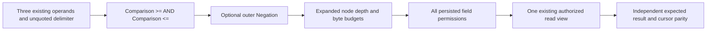

# QueryExecution bounded SQL BETWEEN

Status: Accepted contract under [ADR-065](../../ADR/ADR-065-full-sql-client-compatibility.md);
source implementation and development checks complete; exact-SHA runtime proof
pending. Existing Q1 semantics
remain the target. Full PostgreSQL syntax/semantics and native client sessions
are separate mandatory unfinished stages.

|Requirement|Acceptance and evidence mapping|
|---|---|
|REQ-SQLC-006 typed expressions|AC-SQLC-006A / TASK-SQLC-BETWEEN: lower scalar/field/parameter `BETWEEN` inclusively to existing >=/<= AND; `NOT BETWEEN` negates the whole result. NEW SqlBetween grammar and real-ZoneTree tests plus RF3 SDK/official MCP fixtures.|
|REQ-SQLC-003 authority and equivalence|006A independently expected rows, exact AST/SQL rows/order/access path/explain and cursor compatibility. Every field including both bounds uses persisted authorization. No new plan effects/trusted roles.|
|REQ-SQLC-004 bounds and recovery|006A tests expanded7node/depth3 and8node/depth4 boundaries separately from SQL UTF8/token/normalized bytes, cancellation, denied field, malformed/missing/non-scalar/type errors and next successful request.|
|REQ-SQLC-001 honest conformance|006A capability lists only source-supported Q1 operators; full SQL and native protocol remain false until their complete inventories qualify.|
|REQ-SQLC-009 measured operation efficiency|Fixed bounded lowering, existing evaluator/read cut/admission. No index-range, speed, allocations, scale or portability improvement claim without authentic comparative GitHub evidence.|

Existing eager three-valued conjunction applies. Only TRUE survives WHERE.
Null/missing value makes both comparisons UNKNOWN before type checks. Null bound
with a false other comparator yields FALSE; its negation yields TRUE. Null bound
with a true other comparator stays UNKNOWN. Both null bounds remain UNKNOWN.
Reversed non-null same-type bounds yield FALSE and their negation TRUE.
Non-null mismatched scalar types still fail even when the other comparison is
false; non-scalar and missing-parameter failures preserve current exact codes.
Strings/booleans retain current KeyCodec order; there is no PG collation/coercion.

Canonical map: parser/token constants under src/KeyLoad.Query/Features/
QueryExecution; existing QueryEngine capability entry; NEW tests/KeyLoad.UnitTests/
Features/QueryExecution/SqlBetween-prefixed files and IntegrationTests matching
slice SqlRf3BetweenTests/helper. Root owns shared contracts/docs/Git and RF3;
bounded cheaper worker owns only the approved two parser files/new unit files.
Strongest source review precedes code and final join. Backend storage/DDL/DML/
security mutation, frontend, migrations and dependency changes are N/A because
this stage reuses the same readonly AST, budgets, resource and native contracts.

Test methodology: first-author TUnit grammar/real-store tests from006A; independent
literal IDs and hand-built ASTs, exact malformed/budget/error assertions, current
normal/scalar plus real RF3 SDK/official MCP results. Genuine faults remain
failures; no mocks or runtime exceptions are waived. Full Release build, canonical
formatter/static governance and independent diff review precede scoped delivery.
CI authentic original source/run/attempt/job/report evidence proves execution;
coverage remains an open mandatory gate until its collector is configured.
Rollback the parser, additive capability values and fixtures together.

## AC-SQLC-006A acceptance contract

The actor is an authenticated existing SDK or official MCP caller. Persisted
database authorization remains the only authority. The entry points are existing
SQL QueryAsync/MCP query and QueryEngine.Execute/ExecuteAst. Pass requires every
criterion below; a skipped, absent or failing required test is a failure.

|Criterion|Positive, negative and edge assertions|Automated proof|
|---|---|---|
|006A-G grammar|Inclusive comparisons and whole-conjunction NOT have identical discriminated AST bytes to independently constructed Predicate roots. Prefix NOT, immediate outer AND, AND-before-OR, aliases, quoted fields, comments and parameter operands preserve grouping. Missing/quoted delimiters/operators fail with the existing exact code; SYMMETRIC and arithmetic remain unsupported.|SqlBetweenGrammarTests; SqlBetweenRejectionTests.|
|006A-T typed truth|Independent literal row IDs cover inclusive/exclusive endpoints, reversed bounds, numbers, strings and booleans. Null/missing values, either/both null bounds and both polarities preserve eager Q1 three-valued evaluation. Non-null incompatible scalar types, nonscalar fields/parameters and missing parameters retain their exact errors, followed by a healthy request.|SqlBetweenTruthTests; SqlBetweenRangeQueryTests; SqlBetweenRejectionTests.|
|006A-B bounds and authority|Normalize the actual parsed positive7node/depth3 and negated8node/depth4 trees at exact/one-under limits. Separately check raw UTF8/token and serialized normalized-request byte limits. Deny every referenced field including either bound from persisted permissions. Pre-cancellation preserves the original token and settles before the next healthy request.|SqlBetweenBudgetAndAuthorityTests; existing SQL lexical budget tests; SecurityAndQueryTests and EqualityAccessPathSecurityTests retain the primary-field authorization regressions.|
|006A-C read contract|Real ZoneTree SQL and independent AST return exact ordered IDs, stable cut/access-path/explain and continuation presence. Cross-use SQL cursors in AST and AST cursors in SQL with independent next-page IDs. Range-only requests reject without full-scan consent and succeed with explicit consent; no range-index path is invented.|SqlBetweenRangeQueryTests.|
|006A-R RF3 public flow|Genuine Aspire/Docker RF3 SDK and official MCP return independent inclusive, NOT and partial-null IDs over the same committed corpus. Equality group index supplies the asserted path. Both clients expose exactly the prior Q1 predicate list plus BETWEEN/NOT BETWEEN, read-only and full-scan consent. Malformed, typed and parameter failures retain exact codes and a following valid request succeeds.|SqlRf3BetweenTests and SqlRf3BetweenScenario.|
|006A-Q delivery|Full solution Release, canonical formatter, static governance, independent combined source review, then original delivered-source CI normal/scalar/recovery/RF3/analyzer reports with exact source/run/attempt/job/artifact/case bindings pass. Development builds/source review cannot satisfy runtime, coverage or performance gates.|CI original reports; manual independent diff review is the explicit source-review exception.|

No new DDL/DML, AST DTO/version, serializer, evaluator, client session, public
route, package, tokenizer, storage or native wire behavior is in scope. No data
migration is needed. CPU/memory admission, cancellation, read cut and cursor
lifetime reuse their existing bounded contracts. Full SQL, native protocol,
coverage collector, FTS selection, scale measurements and production endurance
remain independent open requirements. There is no performance improvement claim.

## Ordered execution and join contract

1. Root maps the current parser/evaluator/normalizer/permissions/read-budget and
   SDK/MCP RF3 sources. Strongest read-only R23 review joins before coding;
   sealed review4b9fc897a4e77299a752b5ae83f44f29cea0367233b944fbd99b52af73e0c3ee
   approved this bounded contract. Root alone owns shared contracts/docs/Git.
2. Retain the full relevant authentic baseline. At source3ae408fe, CI37129421675
   attempt1 passed2637 normal,2637 scalar,194 recovery,67 RF3 and118 analyzer
   cases. Root independently rehashed source original packetc51f755b... and
   report bytes, provider ZIP digests, source/job/upload bindings; receipt
   845643a8fc1361fc1feb992c29268fd8be577e5ee7e0c0aeed17fd81286b82ce.
   The prior ca7 failures were QueueBodyAccounting malformed-body fixture,
   BenchmarkTopologyMembershipCorruption invalid guard(null), and
   ReplicaMembershipNativeStore cancellation. Their independently authored3ae
   fixes now pass their original reported cases; no causal attribution to this
   SQL stage is made. New BETWEEN fixtures are absent from this baseline.
3. TASK-SQLC-BETWEEN-U: gpt-6-luna/high worker first authors new SqlBetween-prefixed
   unit fixtures, then owns only SqlExpressionParser.cs/SqlSyntax.cs lowering.
   It cannot edit contracts, unrelated tests, packages, workflows or Git; it
   escalates any need to change current semantics. Root first authors disjoint
   TASK-SQLC-BETWEEN-RF3 fixtures, then QueryEngine capability metadata.
4. Root and strongest reviewer join every first-authored test correction before
   parser work. R24 identified invalid AST caller/cancellation/byte/cursor/budget
   oracles and missing authority/grammar/full-scan/null/parameter coverage.
   R25 closed those source findings but found the polymorphic grammar oracle:
   both sides must serialize explicitly as Predicate, preserving discriminators.
   These are source findings, not executed test failures. R26 root/strongest join
   closed the final oracle blocker before parser work; sealed review
   e9c05965a731f144986be52e55068ac4816fa084c1e50e2826883a22a570d126
   preserves explicit Predicate discriminator equivalence. Compilation and
   runtime remain unqualified.
5. Inspect all delegated diffs, then independent combined review of006A-G/T/B/C/R.
   Frozen committed base plus only owned source files receives full Release
   build before canonical formatter and static governance. Correct failures
   within owned scope; no suppression, weakened assertion or foreign edit.
6. Commit/push only the stable owned slice, preserving concurrent work. Qualify
   the actual delivered source in GitHub and bind original reports to every
   acceptance item. Tasks end complete/blocked/failed/cancelled with artifacts;
   blocked work cannot unblock dependent code or verification.
7. Update this contract, ADR and canonical status/evidence after original results.
   ADR stays Accepted until implementation and required proof are complete.

R27 final combined source review3291bf5bd8c2582b00bfecf6173a684f0d0392c2387e44d831bb69942386175d
joined all eleven owned source files without a source blocker. Initial frozen
7d9852b source build failed with five IDE0005 unnecessary using directives in
new unit fixtures,0warnings,elapsed00:01:39.70. The owning worker removes only
those imports; no assertion, diagnostic severity or execution contract changes.
Repeat full Release, formatter and static checks before delivery. Runtime still
requires the new delivered-source GitHub originals.

The [source-stage receipt](../../implementation/sql-client-source-stage-003.json)
binds all eleven owned files to frozen7d985 base, full26project Release with
0warnings/0errors, canonical formatter and static26project/4module governance.
The final import/whitespace corrections preserve all assertions and non-whitespace
bytes. The21unit and2RF3 cases still require authentic delivered-source CI proof.
No runtime, coverage or measured gain is inferred from development checks.
