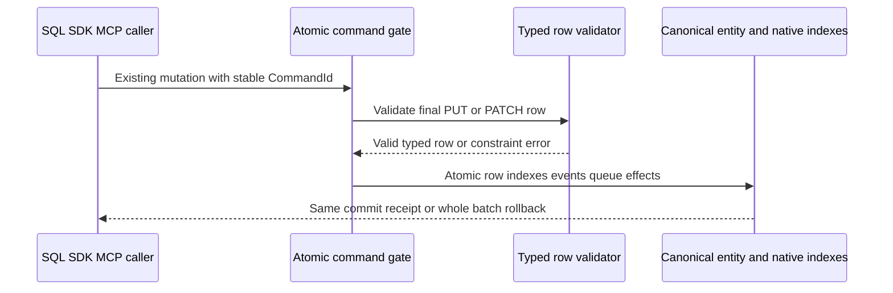

# RelationalStorage

Status: Accepted typed-row contract; source and GitHub qualification pending.
Owner direction2026-10-02 requires relational data within one linked AI database.
[ADR-055](../ADR/ADR-055-typed-relational-rows.md) owns the typed-row stage;
[ADR-054](../ADR/ADR-054-central-sql.md) owns central SQL.

| Requirement | Acceptance | Test/task/evidence |
|---|---|---|
| REQ-REL-001: bounded persisted column schema and primary entity identity | AC-AISQL-002/003 | TASK-AISQL-005/008, real ZoneTree schema/row tests + RF3 |
| REQ-REL-002: native unique/revision/security checks and mixed-model atomicity | AC-AISQL-004 | TASK-AISQL-005/008 transactional negative/rollback/reopen tests |
| REQ-REL-003: typed rows share canonical query/graph/vector/workflow identity | AC-AISQL-004/006 | SDK/MCP/SQL RF3 linked rows and real-store linkage tests |
| REQ-REL-004: bounded joins and relational FK/check/default/cascade semantics | AC-REL-004: explicit future contract + real atomicity/authorization/budget/fault tests before capability advertisement | PLANNED subsequent ADR/stage; not satisfied by typed rows |
| REQ-REL-005: native indexed correctness and comparable RF3 performance | AC-AISQL-008/009/010 | Exact-SHA GitHub qualification and future dedicated table/CALL measurements; no inferred speed result |

Canonical map: Abstractions/Features/RelationalStorage/ schema contracts;
Core/Features/RelationalStorage/ validation; UnitTests/Features/RelationalStorage/;
IntegrationTests/Features/RelationalStorage/. Existing document mutation/query
transport owns row CRUD/read; SQL and protocol adapters stay QueryExecution.
UI: N/A in this stage, existing generic resource console remains read-only.
Storage: N/A new engine; reuse canonical document/index/journal/replica storage.
Per-project policy is read before implementation; root owns shared joins.

Exact pass/fail, positive/negative/edge/error/type/null/migration/rollback and
test methodology are canonical in [SQL acceptance](QueryExecution.md)
and [execution contract](QueryExecution.md). Rows require current persisted authority;
schema constraints are not row-level grants. Compile and runtime checks run in
GitHub only; coverage/endurance/power-loss and later JOIN/FK gates stay explicit.
