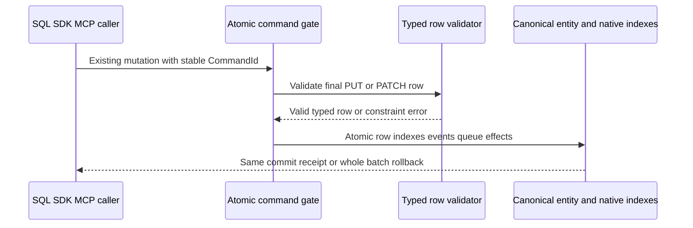

# RelationalStorage

Status: Typed-row and first Q2 join source present; local operation evidence
recorded below, complete original Linux/RF3 qualification pending.
Owner direction2026-10-02 requires relational data within one linked AI database.
[ADR-055](../ADR/ADR-055-typed-relational-rows.md) owns the typed-row stage;
[ADR-054](../ADR/ADR-054-central-sql.md) owns central SQL.

| Requirement | Acceptance | Test/task/evidence |
|---|---|---|
| REQ-REL-001: bounded persisted column schema and primary entity identity | AC-AISQL-002/003 | TASK-AISQL-005/008, real ZoneTree schema/row tests + RF3 |
| REQ-REL-002: native unique/revision/security checks and mixed-model atomicity | AC-AISQL-004 | TASK-AISQL-005/008 transactional negative/rollback/reopen tests |
| REQ-REL-003: typed rows share canonical query/graph/vector/workflow identity | AC-AISQL-004/006 | SDK/MCP/SQL RF3 linked rows and real-store linkage tests |
| REQ-REL-004: bounded joins and relational FK/check/default/cascade semantics | AC-REL-004: explicit future contract + real atomicity/authorization/budget/fault tests before capability advertisement | PLANNED subsequent ADR/stage; not satisfied by typed rows |
| REQ-REL-005: native indexed correctness and comparable RF3 performance | AC-AISQL-008/009/010 | Exact-SHA GitHub qualification and future dedicated table/CALL measurements; no inferred speed result |

Canonical map: Abstractions/Features/RelationalStorage/ schema contracts;
Core/Features/RelationalStorage/ validation; UnitTests/Features/RelationalStorage/;
IntegrationTests/Features/RelationalStorage/. Existing document mutation/query
transport owns row CRUD/read; SQL and protocol adapters stay QueryExecution.
UI: N/A in this stage, existing generic resource console remains read-only.
Storage: N/A new engine; reuse canonical document/index/journal/replica storage.
Per-project policy is read before implementation; root owns shared joins.

Exact pass/fail, positive/negative/edge/error/type/null/current-format rejection/rollback and
test methodology are canonical in [SQL acceptance](QueryExecution.md)
and [execution contract](QueryExecution.md). Rows require current persisted authority;
schema constraints are not row-level grants. Local compile/runtime checks are
development evidence under the owner's latest root policy; original Linux
qualification, coverage/endurance/power-loss and remaining JOIN/FK gates stay explicit.

TASK-REL-004-INNER-JOIN-001..006 is accepted for the first bounded same-partition
Text primary-key INNER equijoin under REQ-REL-004. [ADR-118](../ADR/ADR-118-bounded-relational-inner-join.md)
freezes Q2/AST2 grammar, exact source identity/projection, authorization, single
read-cut, cumulative scan/probe/byte/result/cancellation limits, exact paths and
whole-operation native/RF3 tests before implementation. AC-REL-004-JOIN-001..006
map there to parser/version execution, native ZoneTree results/reopen, persisted
resource/row/field authority, boundary/error/healthy-follow-up flows and real
SDK/official-MCP RF3. Existing typed-row and mixed-model requirements remain
mandatory; arbitrary joins, FK/check/default/cascade, full SQL and client protocol
remain open. Source for this operator is joined; public RF3/Linux qualification
is pending. UI N/A:
existing SQL/SDK/MCP callers expose the operation; storage engine/format N/A:
reuse canonical ZoneTree rows under the existing node-local RF3 owner.

TASK-REL-004-INNER-JOIN-007 maps AC-REL-004-JOIN-004/006 to three real RF3
SDK/official-MCP budget-error, unchanged-source-state and healthy-follow-up
flows. The additive test-only typed fixture configuration and exact ownership
are frozen in ADR-118 before implementation. Exact arithmetic stays in the real
native unit flows; no test hook or production limit is added. Source for these
cases is joined; actual SDK/official-MCP RF3 and original Linux evidence remain
pending.

Stage VII R290 full Release and R294 native formatter pass. The R291/R292
owning normal/scalar cohorts each pass 606/606, including actual typed rows,
bounded joins, persisted authority/redaction, work/byte/cancellation/reopen and
the admitted primary-key/source_revision literal SQL/AST regression. R293 real
indexed/idempotency process recovery passes 2/2. Every cohort retains original
source/DLL/PDB and report hashes with zero drift/skips in the
[status tracker](../implementation/status.json). These local subsets do not
close REQ-REL-004: complete negative-form execution, admitted RF3 cancellation,
fresh public RF3/Linux, arbitrary joins, FK/check/default/cascade and full SQL
remain required.
