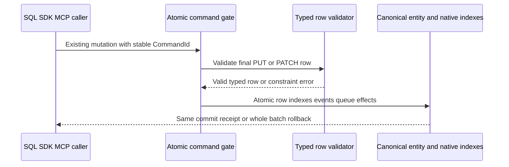

# RelationalStorage

Status: Typed-row and first Q2 join source present; local operation evidence
recorded below, complete original Linux/RF3 qualification pending.
Owner direction2026-10-02 requires relational data within one linked AI database.
[ADR-055](../ADR/ADR-055-typed-relational-rows.md) owns the typed-row stage;
[ADR-054](../ADR/ADR-054-central-sql.md) owns central SQL.

| Requirement | Acceptance | Test/task/evidence |
|---|---|---|
| REQ-REL-001: bounded persisted column schema and primary entity identity | AC-AISQL-002/003 | TASK-AISQL-005/008, real ZoneTree schema/row tests + RF3 |
| REQ-REL-002: native unique/revision/security checks and mixed-model atomicity | AC-AISQL-004 | TASK-AISQL-005/008 transactional negative/rollback/reopen tests |
| REQ-REL-003: typed rows share canonical query/graph/vector/workflow identity | AC-AISQL-004/006 | SDK/MCP/SQL RF3 linked rows and real-store linkage tests |
| REQ-REL-004: bounded joins and relational FK/check/default/cascade semantics | AC-REL-004: explicit future contract + real atomicity/authorization/budget/fault tests before capability advertisement | PLANNED subsequent ADR/stage; not satisfied by typed rows |
| REQ-REL-005: native indexed correctness and comparable RF3 performance | AC-AISQL-008/009/010 | Exact-SHA GitHub qualification and future dedicated table/CALL measurements; no inferred speed result |

Canonical map: Abstractions/Features/RelationalStorage/ schema contracts;
Core/Features/RelationalStorage/ validation; UnitTests/Features/RelationalStorage/;
IntegrationTests/Features/RelationalStorage/. Existing document mutation/query
transport owns row CRUD/read; SQL and protocol adapters stay QueryExecution.
UI: N/A in this stage, existing generic resource console remains read-only.
Storage: N/A new engine; reuse canonical document/index/journal/replica storage.
Per-project policy is read before implementation; root owns shared joins.

Exact pass/fail, positive/negative/edge/error/type/null/current-format rejection/rollback and
test methodology are canonical in [SQL acceptance](QueryExecution.md)
and [execution contract](QueryExecution.md). Rows require current persisted authority;
schema constraints are not row-level grants. Local compile/runtime checks are
development evidence under the owner's latest root policy; original Linux
qualification, coverage/endurance/power-loss and remaining JOIN/FK gates stay explicit.

TASK-REL-004-INNER-JOIN-001..006 is accepted for the first bounded same-partition
Text primary-key INNER equijoin under REQ-REL-004. [ADR-118](../ADR/ADR-118-bounded-relational-inner-join.md)
freezes Q2/AST2 grammar, exact source identity/projection, authorization, single
read-cut, cumulative scan/probe/byte/result/cancellation limits, exact paths and
whole-operation native/RF3 tests before implementation. AC-REL-004-JOIN-001..006
map there to parser/version execution, native ZoneTree results/reopen, persisted
resource/row/field authority, boundary/error/healthy-follow-up flows and real
SDK/official-MCP RF3. Existing typed-row and mixed-model requirements remain
mandatory; arbitrary joins, FK/check/default/cascade, full SQL and client protocol
remain open. Source for this operator is joined; public RF3/Linux qualification
is pending. UI N/A:
existing SQL/SDK/MCP callers expose the operation; storage engine/format N/A:
reuse canonical ZoneTree rows under the existing node-local RF3 owner.

TASK-REL-004-INNER-JOIN-007 maps AC-REL-004-JOIN-004/006 to three real RF3
SDK/official-MCP budget-error, unchanged-source-state and healthy-follow-up
flows. The additive test-only typed fixture configuration and exact ownership
are frozen in ADR-118 before implementation. Exact arithmetic stays in the real
native unit flows; no test hook or production limit is added. Source for these
cases is joined; actual SDK/official-MCP RF3 and original Linux evidence remain
pending.

Stage VII R290 full Release and R294 native formatter pass. The R291/R292
owning normal/scalar cohorts each pass 606/606, including actual typed rows,
bounded joins, persisted authority/redaction, work/byte/cancellation/reopen and
the admitted primary-key/source_revision literal SQL/AST regression. R293 real
indexed/idempotency process recovery passes 2/2. Every cohort retains original
source/DLL/PDB and report hashes with zero drift/skips in the
[status tracker](../implementation/status.json). These local subsets do not
close REQ-REL-004: complete negative-form execution, admitted RF3 cancellation,
fresh public RF3/Linux, arbitrary joins, FK/check/default/cascade and full SQL
remain required.

TASK-REL-004-INNER-JOIN-011 corrects actual RF3 setup under existing AC-REL-004-JOIN-001..006 and AC-QUERY-007-JOIN-001. Authentic Linux run37612238705 attempt1 / SHA24c0ac47 retains seven Q2 failed operations: six report Validation at the added typed-resource Configure CALL, while JoinedPageByteBudgetReturnsSafeErrorsAndPreservesStateBeforeHealthyFollowUp separately fails node2 startup. Do not relabel the startup failure as a schema failure or claim this source change fixes it.

Freeze before implementation: every ResourcesConfigure SQL CALL is a canonical header command whose parameter envelope must contain exactly request and a nonempty caller-owned commandId. The five new configure helper/case call sites omitted commandId, unlike the existing RelationalSqlRf3Scenario configuration. SqlOperationCompiler forwards that envelope to McpArgumentDecoder.HeaderCommand; ValidateKeys rejects its one-field shape with Validation and “The tool arguments do not match the canonical operation contract.” before request/schema decoding or any dispatch. The original reports expose Validation only; this precise detail/path is a source finding, not invented runtime observation. Current RelationalSchemaRules explicitly permits id when it is the primary key, so no schema admission rule changes.

Each affected configure CALL must supply one fresh Guid.NewGuid() as its original stable outer commandId argument, using the existing SqlRf3Protocol.Call composition. Preserve all typed columns, schemas, seed/source/literal pages, cumulative budget numbers, read-cut writers and every original awaited SDK/official MCP authorization/cancellation/no-effect/healthy-followup oracle. No production fallback/generated server identity, retry, tolerance or topology change is allowed. Integration RelationalStorage owns the five exact files RelationalSqlRf3JoinBudgetData.cs, RelationalSqlRf3JoinTests.cs, RelationalSqlRf3JoinAuthorizationTests.cs, RelationalSqlRf3JoinCancellationTests.cs and RelationalSqlRf3JoinReadCutTests.cs. Root joins guarded source, compiles and executes the seven owning native cases plus unchanged qualification gates; source correction alone is unexecuted and cannot close public RF3 or Linux acceptance. Rollback restores only these caller arguments; no wire/storage migration or new dependency.

## Explicit public Q2 rejection RF3 selection

TASK-REL-004-INNER-JOIN-PUBLIC-012-SELECTOR maps AC-REL-004-JOIN-001/003/005
and AC-QUERY-007-JOIN-001 to REQ/AC-TEST-015 and REQ/AC-TUNIT-ENTRY-006 under
ADR-118/119. Native local-image selection additionally admits exactly:

    /*/*/RelationalSqlRf3JoinRejectionTests/*

This selects the existing12 Arguments of
RejectedJoinOnFourPublicPathsPreservesRowsAndCompleteHealthyPage. Preserve the
byte-exact standard8 and six-silo1 selectors. Wildcard class names, method-only
subsets, combined classes, unsupported/mixed/inherited image configuration and
GitHub provenance reject; no default selector or tool catalog expands. Both the
native selector and fixture's closed argument reader must admit this exact
additional selector before preparation. The existing actual Node selection
workflow tests positive original TUnit/filter/environment propagation and every
existing rejection for all three selectors, plus four public12 near-miss filters
with the exact safe local-selection error. This is infrastructure evidence only.

Sol owns selector/argument admission and native selection regressions; SolNative
owns the independent public12 helper commandId correction. Every SQL CALL
configuration command carries its required outer canonical commandId for
that operation under the existing stable command identity contract.
Root joins the canonical independent R3 public12 packet and this selector and
runs all12 complete rejection operations through real SDK query/SQL and official
MCP query/SQL on the same existing owned RF3 fixture, preserving literal full
row identity/JSON/revision, no disclosure and complete healthy follow-up. Keep
original image/source verification, readiness, cancellation, process/reader
joining, locks and exact-tag cleanup. No provider, public API, storage format,
SQL language claim, default policy or qualification gate changes. Native
normal/scalar selection proof, actual12 RF3 reports and original Linux delivery
remain pending until executed; neither this selector nor source review closes
full SQL or SQL-client protocol conformance. Rollback removes this additional
selector and its assertions as one unit.

## RF3 join authorization fixture policy update

TASK-REL-004-INNER-JOIN-AUTH-POLICY-EPOCH-001 refines existing AC-REL-004-JOIN-003/005 and AC-QUERY-007-JOIN-001 under ADR-118 and Authorization REQ-AUTH-001/006/007. Original local R333 executed8 cases with7Passed/1Failed,381seconds and zero4217-source/896-image drift. The failed RightResourceAndJoinFieldUseDenialsHaveNoEffectsAndHealthyCallersStillRead stops at CreateIdentityAsync's ConfigurePrincipalAsync with RevisionConflict; its later denial/state/healthy oracles are not runtime-qualified. Keep its original receipt/log/TRX unchanged.

Freeze before implementation: McpPersistedIdentity.CreateAsync already persists the fresh principal at canonical PolicyEpoch1 and its credential. Adding the right-side scope grant is a real update to that same persisted principal, so ExecuteConfigurePrincipal requires its new epoch to be strictly greater. Configuring changed grants at epoch1 correctly fails RevisionConflict. The owning fixture must assert actual initial epoch1, submit the existing one original configure command with exact epoch2 and unchanged identity/credential, then assert the complete returned principal matches the requested record and its exact epoch2. Do not alter epoch admission, generate a replacement principal/credential, retry, or treat RevisionConflict as success.

Integration RelationalStorage owns only RelationalSqlRf3JoinAuthorizationTests.CreateIdentityAsync and its epoch constants. Keep both independent limited/missing-use identities, all four real SDK/officialMCP query paths, exact PermissionDenied/no-disclosure, literal healthy joined page/source/revisions, unchanged left/right document bytes and before/after pages. Existing RightResourceAndJoinFieldUseDenialsHaveNoEffectsAndHealthyCallersStillRead is the whole-operation regression. Root owns guarded join, formatting/build and fresh actual RF3 execution; no source review closes RF3/Linux acceptance. Existing ADR-118 is sufficient because this corrects caller setup under the unchanged persisted policy contract, with no public/storage/topology/dependency change. Rollback removes only the fixture correction and this task note; original failures remain retained.
