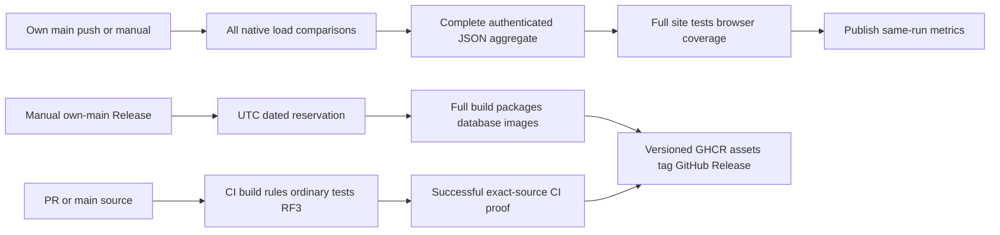

# ReleaseDelivery

The owner requires three pipelines and a real dated database release. The immutable
version/tag is `v<major>.<minor>.<yyMMdd>.<daily-build>`; major/minor come from central
source configuration, UTC defines the date, and the positive daily sequence is
frozen to the authenticated release run. Example: `v0.1.261003.1` for the current
0.1 base. NuGet supports four numeric components; CLR assembly/file components
have smaller bounds, so use stable `M.m.0.0` / `M.m.0.N` and full informational
version ([NuGet](https://learn.microsoft.com/en-us/nuget/concepts/package-versioning),
[CLR metadata](https://learn.microsoft.com/en-us/dotnet/api/system.reflection.assemblyversionattribute)).

Requirements/acceptance are REQ/AC-PIPE-001..004 and REQ/AC-REL-001..003 in the
[acceptance matrix](../implementation/pipeline-release-v2-acceptance.md).
[ADR-064](../ADR/ADR-064-three-pipeline-release-delivery.md) is required for release
permissions, version identity, deployment artifacts and current-producer handoff.

Canonical ownership:
- shared infrastructure: `.github/workflows/ci.yml`, `benchmarks.yml`, `release.yml`,
  root Dockerfile, the existing comparison Dockerfile and `Directory.Build.props`;
- tooling: `scripts/Features/ReleaseDelivery/` version/asset helpers and distribution;
- focused contracts/tests: `tests/KeyLoad.UnitTests/Features/ReleaseDelivery/`;
- source/provenance handoff: existing BenchmarkComparisons production adapters and
  their TUnit suites, preserving their existing canonical slice;
- frontend/public API/storage/schema: N/A; this task changes delivery and consumes
  existing measurements without changing database or webpage behavior.

Build artifacts contain all actual packable projects, a self-contained Linux x64
server distribution, RF3 persistent-container configuration, and version-labelled
images built from the existing owned Dockerfiles. Database credentials are runtime
configuration and are never bundled into source/assets. Existing RF3 membership,
Orleans routing and node-local ownership are retained; distribution packaging does
not establish production readiness, endurance or power-loss durability.

Reservation is source/run/date bound and retained before expensive work. Its daily
sequence is at least the actual daily release-run ordinal and exceeds already
published dated tag counters. A retry validates and reuses its reservation; it
cannot silently change version/source or steal another run's tag/assets. Publication
checks successful latest exact-source CI and all owned hashes, then creates/reuses only
its own immutable tag/release/image identities. Failed source tests, conflicts,
missing credentials or incomplete artifacts fail without force or overwrite.

No NuGet feed publication or version-bump commit is included. The requested NuGet
files are real GitHub Release assets. Site publication authenticates the current
benchmark run/attempt/SHA, independently preserves the required genuine historical
archive, and retains every existing test/browser/coverage/freshness gate.
