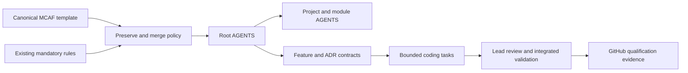

# RepositoryGovernance

Status: configured locally and independently reviewed; GitHub delivery pending. Owner: KeyLoad lead/integrator. Source: [MCAF tutorial](https://mcaf.managed-code.com/tutorial), upstream edcfac048c3cb5e158e841378bd61fe457dc34e7. Skills are not installed by explicit owner instruction.

## Requirements

All requirements are mandatory. IDs remain stable when implementation changes.

| ID | Type / priority | Requirement and rationale | Measurable acceptance |
|---|---|---|---|
| REQ-MCAF-001 | Governance / P0 | Merge root and local policy without deleting or weakening any existing rule. | AC-MCAF-001: original root prefix hash and complete diff are preserved. |
| REQ-MCAF-002 | Workflow / P0 | Configure the four mandatory MCAF policies and real .NET commands. | AC-MCAF-002: all policy IDs and customized commands exist; no TODO placeholders. |
| REQ-MCAF-003 | Ownership / P0 | Every project and delivery module has local policy with real entry points and boundaries. | AC-MCAF-003: all 22 current csproj roots plus site, workflows, docs and scripts pass inventory validation. |
| REQ-MCAF-004 | Architecture / P0 | Map the complete repository using canonical slices and explicit interfaces; record existing layout migration debt. | AC-MCAF-004: diagrams, slice map and dated ADR cover all surfaces. |
| REQ-MCAF-005 | Orchestration / P0 | Plan before delegated writes, use capability/cost tiers, disjoint ownership and joined integrated proof. | AC-MCAF-005: task graph precedes writes and all required task results are reviewed. |
| REQ-MCAF-006 | Constraint / P0 | Install no skills, including .NET skills, for this owner-requested bootstrap. | AC-MCAF-006: skill inventory is unchanged. |
| REQ-MCAF-007 | Evidence / P0 | Keep conflicts, migration gaps and CI qualification explicit; publish only GitHub Actions performance JSON. | AC-MCAF-007: no unsupported readiness or benchmark claim is introduced. |

## Slice surfaces

- Governance: root and all local AGENTS.md, docs/Architecture.md, docs/ADR/ADR-032-mcaf-governance.md and installation audit record.
- Tooling: scripts/Features/RepositoryGovernance/verify.mjs; Node built-ins only.
- Product backend, data schema, public API, authentication and physical storage: N/A because installation only adds governance and documentation.
- Frontend behavior: N/A; site local governance is added, but rendering changes belong to BenchmarkComparisons.
- Test flow: static real-repository validation and independent diff review. Runtime qualification source is GitHub Actions.

## ADR and execution contract

[ADR-032](../ADR/ADR-032-mcaf-governance.md) owns installation and time-bounded layout migration. Detailed acceptance is in ../../mcaf-governance.acceptance.md; ordered work and terminal evidence are in ../../mcaf-governance.plan.md.

| Task | Requirement / acceptance | Owner / tier | Write scope | Dependency and join |
|---|---|---|---|---|
| TASK-MCAF-REVIEW-001 | REQ-MCAF-001/002/004/005/007; AC-MCAF-001/002/004/005/007 | Highest-capability read-only architect | None | Starts on existing policy/template; joins with concrete conflicts and review findings. |
| TASK-MCAF-REVIEW-005 | All requirements and acceptance | Highest-capability independent read-only reviewer | None | Starts on the merged contracts; joins only after all local files, validator and integrated evidence are reviewed. |
| TASK-MCAF-LOCAL-002 | REQ-MCAF-003/006; AC-MCAF-003/006 | Least expensive capable documentation worker | Only new project/module AGENTS.md | Starts after root/spec/ADR contracts exist; joins after every local file is inspected and inventory passes. |
| TASK-MCAF-CHECK-003 | REQ-MCAF-001/002/003/006; AC-MCAF-001/002/003/006 | Least expensive capable Node worker | Only scripts/Features/RepositoryGovernance/verify.mjs and new scripts/AGENTS.md | Starts after audit contract exists; joins with real-repository validation and meaningful negative validation evidence. |
| TASK-MCAF-INTEGRATE-004 | All requirements and acceptance | Lead planner/integrator | Root policy, central docs, installation audit and plans | Joins all required complete workers, inspects all diffs, validates combined state and reports conflicts. |

Workers must stop on ambiguity, overlapping ownership, changed contracts or a policy conflict. No worker may edit central config, product source, README, existing dirty files, or skills. States are pending, running, complete, blocked, failed or cancelled; only reviewed complete outputs unblock integration.

## Traceability and evidence

Every REQ maps to its same-numbered AC above, ADR-032, tasks in the execution table and validator/review evidence. All seven local configuration criteria passed independent review and integrated static validation; outcomes and native worker joins are recorded in implementation/mcaf-installation.json. This is not new GitHub runtime qualification. The initial inventory had 20 projects; concurrent CodeQuality work added two projects and their local policies, preserved by this installation. The current installation record covers all 22. Any delivered GitHub snapshot must include the recorded projects or the validator correctly fails; do not publish a governance-only commit with an inventory of omitted uncommitted projects.

## Повне покриття функцій та рішень

Власник вимагає описувати весь продукт через Features та ADR. Це розширення governance, а не зміна runtime. Контракт: [ADR-037](../ADR/ADR-037-documentation-coverage.md), [acceptance](../../documentation-coverage.acceptance.md), [ordered plan](../../documentation-coverage.plan.md). Старі REQ-MCAF/AC-MCAF зберігаються.

| Вимога | Критерій | Перевірка |
|---|---|---|
| REQ-DOCS-001: кожна канонічна функція має свій Feature | AC-DOCS-001: рівно 20 owning Feature-specs індексовані, включно з required BlobStorage | File/index inventory |
| REQ-DOCS-002: повний контракт функції | AC-DOCS-002: actors, entry points, stable REQ/AC, flows, slice/N/A, source/target/planned, tests і Mermaid | Full-file review та REQ/AC mapping |
| REQ-DOCS-003: змістовні ADR для всіх рішень | AC-DOCS-003: ADR-001–039 мають context/rationale/alternatives/consequences, implementation contracts та verification | ADR inventory і contract review |
| REQ-DOCS-004: унікальна ідентичність ADR | AC-DOCS-004: comparisons034, foundation036; filename/header і всі залежні links узгоджені | Number/reference inventory |
| REQ-DOCS-005: повний backlog/test trace | AC-DOCS-005: усі 104 KL мапляться на existing Feature/ADR; кожен new REQ → measurable AC → existing/planned test або explicit review exception | JSON/source/test inventory |
| REQ-DOCS-006: правдиві qualification boundaries | AC-DOCS-006: source не названий GitHub-qualified; public blobs/MCP та нерозв'язані choices не вигадані | Independent source/evidence review |
| REQ-DOCS-007: збережені правила і scope | AC-DOCS-007: immutable original hashes усіх 27 policies, незмінність ними цього task, full original/current hashes і повний старий текст при поясненому зовнішньому additive drift; попередні Feature IDs збережені; workers тільки у disjoint new docs | SHA256/full diff/ownership review; unexplained drift або rule loss/weakening — fail |
| REQ-DOCS-008: повна навігація та integrated proof | AC-DOCS-008: links/indexes/diagrams/governance/whitespace pass, COMPLETE packets joined, strongest-model review complete | Combined static checks і cached Mermaid render |

Точний набір: RepositoryGovernance, BenchmarkComparisons, DocumentStorage, EventStreams, Messaging, GraphTraversal, TimeSeries, Search, QueryExecution, Authorization, ChangeFeeds, StorageRecovery, ClusterReplication, ClusterRouting, ClientApi, BackupRestore, CodeQuality, ResourceExecution, TestInfrastructure, BlobStorage.

Owning executable-artifact convention для цієї документаційної роботи: `docs/Features/`, `docs/ADR/`, `docs/README.md` та `docs/implementation/documentation-coverage.json`; глобальні maps/indexes не є runtime slices. Backend/HTTP/UI/persisted schema N/A, бо змінюється опис, а не поведінка.

Позитивний flow: читач проходить README → docs index → Feature → ADR → source/test/evidence. Негативний/error flow: missing/duplicate doc, broken path, unknown KL, неіснуючий test або неподтверджений Implemented зупиняє completion. Edge flow: required capability без реалізації має Proposed ADR, планований test і явний pending status; historical GitHub proof залишається historical.

TASK-DOC-AUTHOR-004/005 мають тільки нові, різні файли; лід володіє існуючими документами/індексами й join, TASK-DOC-REVIEW-007 — strongest read-only review. Повний task graph, моделі, start/join/terminal/escalation contracts — у плані. Product tests лишаються real TUnit/Recovery/Docker-Aspire RF3 через SDK/MCP у GitHub Actions; документаційні criteria мають статичну перевірку та explicit full-source-review exception.

Актори та entry points: власник задає scope, contributor/agent читає root/local AGENTS та Architecture перед task, strongest planner фіксує contracts, bounded worker повертає evidence, integrator/reviewer joins всі результати; CI запускає static validator. Required/planned policy або source migration не оголошується виконаною від створення spec чи локального validator pass. Installed-by-bootstrap status і delivered-source qualification залишаються в owning audit records.

## Owner-directed workflow separation, 2026-10-03

[ADR-062](../ADR/ADR-062-workflow-separation.md),
[acceptance](../implementation/workflow-layout-acceptance.md) and
[plan](../implementation/workflow-layout-execution.md) specify REQ-WF-001..006 and AC-WF-001..006:
CI always owns PR repository-rule/build checks; Tests owns ordinary project
qualification; Benchmarks owns every performance comparison, including TimeSeries;
Release builds NuGet package artifacts; Website retains separate publication. Historical legacy CI report
identity remains authentic while new isolated cohorts bind to benchmarks.yml.
Each same-numbered REQ/AC maps to the plan's task graph and TUnit/GitHub proof;
no database, workload, native topology or unrelated website design changes apply.
