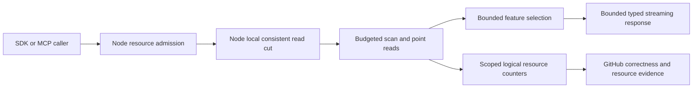

# ResourceExecution

The additive TimeSeries readers under
[ADR-052](../ADR/ADR-052-timeseries-bounded-aggregates.md) map REQ-MP-002/005 and
AC-MP-002/005/011/012 to AC-SERIES-011 and AC-RANGE-REV-003. One original read
gate and one budgeted view charge metadata/data/lookahead exactly once, enforce
deadline/cancellation and exact full JSON results, and preserve healthy
following operations after failure. Root owns BudgetedReadView reverse forwarding;
TimeSeries and StorageRecovery workers own their disjoint operation/provider
acceptance tests. Source and exact-SHA evidence are pending; architecture choices
do not establish maximum throughput, physical I/O, process RSS or numeric coverage.

TASK-RUNTIME-CANCEL-W2 is an accepted AC-MP-009/010/012 fixture refinement under
[ADR035](../ADR/ADR-035-memory-performance.md): arm a dedicated real-file growth
observer before native async report writing; retain the corpus,10second deadline,
quarter-output cutoff, OCE and no-later-file assertions. The same scoped worker
coordinates one bounded second real Kestrel partial-body write after the cancelled
client result while preserving actual RequestAborted, incomplete response,
five-second waits and same-client reuse. Only the four named fixture files and a
necessary same-slice observer helper belong to this worker; product serializers,
client/SDK transports, public contracts and all budgets remain unchanged. Existing
run37015193756/ad594642 is the failing baseline; enabled source quality and the
full new exact-SHA GitHub suite qualify the final result.

Status: Accepted contract; implementation and qualification in progress.
[ADR-035](../ADR/ADR-035-memory-performance.md) owns scoped read/resource/lifetime
decisions. Full requirements and test strategy: [acceptance](../../memory-performance.acceptance.md).

| Requirement | Acceptance | Task / test ownership |
|---|---|---|
| REQ-MP-001: all current operation/resource paths reviewed and evidenced defects closed | AC-MP-001 | TASK-MP-001/002/003/004; located inventory and independent final review |
| REQ-MP-002: bounded consistent read/mutation work without redundant materialization | AC-MP-002..006 | TASK-MP-005/006/007; real StoreRecovery, QueryExecution, Search, core feature tests |
| REQ-MP-003: bounded cluster lifetime/transfer and crash-safe retention | AC-MP-007/008 | TASK-MP-009; real ClusterReplication persistence, recovery and RF3 |
| REQ-MP-004: bounded streaming caller/report transport | AC-MP-009/010 | TASK-MP-008; ClientApi and BenchmarkComparisons real contracts |
| REQ-MP-005: honest integrated qualification and resource measurement | AC-MP-011/012 | TASK-MP-010/011; exact-SHA GitHub full suites and resource JSON |
| REQ-MP-006: remove avoidable JSON text byte copies and cached-receive request parses | AC-MP-006/009/011/012 | TASK-MP-007J under ADR-035; public strict text/byte, Unicode/error, owned lifetime, allocation and real-store replay cases |

Common storage/resource primitives are shared building blocks. Feature behavior
stays in its canonical slice: StorageRecovery, QueryExecution, Search,
DocumentStorage, EventStreams, TimeSeries, GraphTraversal, Messaging, ChangeFeeds,
ClusterReplication, ClusterRouting, ClientApi and BenchmarkComparisons. New helper
and test files use matching Features paths; flat existing paths remain ADR-032
migration debt and may be repaired without expanding that debt. Shared contracts
and API/composition/CI/docs have exactly one integration owner.

Strict public-collection prerequisites are governed by
[ADR-041](../ADR/ADR-041-read-only-public-collections.md). REQ-ROC-001..006 /
AC-ROC-001..006 map to AC-MP-002/003/004/006/012. The explicit CLR API migration
preserves JSON arrays/base64, exact fingerprints and owned buffers; all consumer
signatures and dense-vector spans must join before build/CI. New tests use this
slice; original business Feature owners retain DTO/operation ownership.
The lead-owned strict converter stage delegates the array protocol to the official
serializer and attaches only its fresh private arrays without another full copy.
Required null/default values reject explicitly; nullable arrays and byte tombstones
keep their meaning. See ADR-041 for exact ownership and tests-first join conditions.

Admission/inbox ownership and the related CLR type migration are governed by
[ADR-042](../ADR/ADR-042-admission-resource-ownership.md): REQ-ADM-001..003 and
AC-ADM-001..003 extend REQ-RESOURCE-001 / AC-RESOURCE-001 and AC-MP-006/012.
TASK-MP-010J owns disjoint admission source/tests; the lead joins actual callers
and exact GitHub evidence. Semaphore disposal must follow registered-reader drain.

No cache may outlive its authority/read cut without explicit invalidation. Mutable
storage arrays cannot escape through a borrowing optimization. Cancellation and
budgets must stop work before a complete excess page is allocated. Logical work,
managed allocation and process working set are different measurements; physical
I/O needs real provider/OS evidence. UI/persisted domain-data changes are N/A for
the common resource contract; any required retention/transport mutation receives
an explicit ADR implementation stage before coding.

## Accepted TASK-MP-007E canonical-JSON work

REQ-MP-002 maps AC-MP-006/012 to exact canonical validation and fingerprints used
by mutations, signed cursors and replay. Validation retains ordinal property order,
duplicate-name rejection, decimal `G29` normalization, escaping, object/depth/input
byte rules and the existing owned UTF-8-decoded string. Fingerprinting retains raw
number spelling and exact lowercase SHA-256 under the same JsonDefaults options.
Null fingerprints remain valid; invalid arguments fail before work.

Serialize fingerprints directly to a JsonDocument sharing its pooled serializer
buffer, then stream canonical bytes to IncrementalHash. Flush Utf8JsonWriter after
each complete value when pending bytes reach a named 64 KiB threshold; a single
large token and object-sort metadata remain separately allocated. Validation
decodes the used MemoryStream buffer without ToArray. No hard RSS limit, input
limit change, storage migration, signature or public API change is implied.

Lead owns JsonData.cs and shared docs; worker owns only new Core/UnitTests
Features/ResourceExecution canonical writer/hash adapter and tests. Tests precede
code: handcrafted canonical/hash fixtures cover property order, nested arrays,
Unicode, null, duplicate names and numeric spelling; real database retries preserve
outcomes; warmed allocation growth over many modest tokens detects full-output
buffer duplication. Execution is GitHub-only; runtime/resource evidence is pending.
Lead moves the existing JSON-pointer parse/escape algorithm into a matching shared
helper solely to keep JsonData within the mandatory type limit while repairing
its documentation, braces and null guards. Public wrappers, 1,024-character bound,
RFC 6901 decoding, missing/scalar distinction and field-patch behavior stay exact;
direct pointer/patch acceptance cases join existing real-document regressions.

## Accepted progressive report output repair

TASK-MP-008C implements REQ-MP-004, REQ-BC-010 and AC-MP-010/012 under ADR-035/044.
The current owned synchronous Cases/Samples converters retain full serialized
payloads before SerializeAsync can flush. Private write-only views adapt both
collections to native async enumeration over existing immutable arrays. Public
ComparisonReport/ComparisonCase, strict read converters, targets, exact JSON
schema/property order, every attempt and CSV/Markdown content stay unchanged.
Default arrays still reject with the existing JsonException and safe detail.

Tests-first source retains the real-file byte/schema/roundtrip oracle, populates
optional provenance/image metadata, and cancels directly in the early-growth
observer. The fixed 20,000-by-4,096 sample input stays bounded; partial output must
remain below one quarter of its complete raw error-byte lower bound, with no
Markdown/CSV. Source audit verifies no sample-array/list/string duplication. The
worker owns new BenchmarkComparisons write views/helpers and ReportFileTests.cs;
lead alone joins ReportWriter and shared docs. Enabled build/format/governance and
complete exact-SHA GitHub tests qualify correctness; matched memory/speed evidence
remains open. No public/data/report-version or package migration.

## Accepted exact-CI fixture corrections

TASK-RUNTIME-ADMISSION-W preserves REQ-MP-002/005 and AC-MP-004/011/012 under
ADR-035. Run37005805424 proves that a held shared read callback does not block
another reader. Only the two analytical-admission cases use a new real exclusive
ZoneTree Commit callback holder with no staged changes; existing read-lifetime
tests retain their original helper. Keep all saturation, independent-engine,
in-flight cancellation, cleanup, ten-second bounds and healthy-followup assertions.
The worker owns those two test references and the new helper; the lead reviews
complete task/holder release before store disposal and qualifies on GitHub.

TASK-RUNTIME-JSON-ORACLES-W keeps REQ-MP-006 / AC-MP-006/012 and ADR-035/041
serializer contracts. Existing direct System.Text.Json byte/text/OperationResult
lone-escaped-surrogate cases expect the actual JsonException on all three paths;
raw UTF-8 replacement and all strict collection/base64 cases remain unchanged.
The embedded benchmark keeps unsorted producer input and expects ordinal canonical
stored JSON under ADR-047 / AC-EM-002. Topic quota comparisons use the correct
Int64 operands without changing exact-byte, one-byte-short or rollback checks.
These are test-oracle repairs, with no new product or persistence decision.

## Admission, operations та observability

### Accepted TASK-MP-006C analytical-read admission

REQ-MP-002/005 and AC-MP-003/004/011/012 require one fail-fast analytical-read
allowance per DatabaseEngine for SQL, AST, both live-query calls and text/vector/
hybrid search. The configured MaxConcurrentQueries must be positive. A new shared
Core/Features/ResourceExecution gate uses one bounded atomic count, no wait queue
or per-caller dictionary. DatabaseEngine exposes an owned IDisposable reservation
and an observational current reservation count through a new partial source file;
existing DatabaseEngine.cs remains with its concurrent integration owner.

Acquire checks cancellation before reserving, rejects saturation with the existing
ResourceExhausted query-concurrency detail, and compensates if cancellation or
allocation fails immediately after the atomic reservation. Dispose releases exactly
once. Each operation keeps the reservation across adaptation, authorization, store
gate wait, scanning/ranking and final result validation. Existing public result,
fingerprint, storage and cancellation contracts stay unchanged; no host clock change.

TASK-MP-006C owns QueryEngine.cs, LiveQueries.cs and SearchEngine.cs admission joins,
new Core/Features/ResourceExecution gate/partial files and new UnitTests
Features/ResourceExecution admission cases. Lead owns shared docs and final review.
Tests first use real ZoneTree read-gate coordination to hold an actual admitted
search while SQL/AST/live/search requests and a second engine instance are rejected
before storage work. Independent databases remain independent. Direct reservation
disposal, invalid limits, pre-/in-flight cancellation, validation/budget errors and
a successful following call prove release. Coordination timeouts detect hangs and
are not throughput measurements. Tests run in GitHub only; source rollback changes
no persisted format or wire and removes the new method/joins together.

### Accepted TASK-MP-011A provider diagnostics

TASK-MP-007H additionally owns an internal BudgetedReadView in this slice. It
wraps an existing IKeyValueView only inside a committed read action, forwards
borrowed callbacks with one cumulative ReadExecutionBudget charge before copy/
decode, and implements the same owned Get/Scan contracts through borrowed work.
VisitRange composes a caller observer without double charging and honors both the
operation and any method-specific cancellation token. Existing provider budgets,
ordering, lookahead, stop flags and callback non-mutation remain unchanged. This
adapter reuses persisted authorization helpers; it does not reimplement principal
or policy decisions. The shared budget's CreateView(IKeyValueView) exposes that
read-only capability under an explicit same-store-action lifetime contract; the
concrete adapter remains internal. Direct real-store adapter cases cover every method, observer
order/failure, cancellation and healthy follow-up in addition to source-read flows.

REQ-MP-005 / AC-MP-011/012 adds an immutable per-ZoneTreeStore read snapshot with
a fresh nonpersisted session ID and cumulative Int64 owned/borrowed point counts,
point examined bytes, range attempts, baseline/staged/tombstone entries, logical
limit lookaheads and range examined bytes. Counters use constant memory and atomic,
saturating increments; a saturated field stops growing and cannot prove later
deltas. Snapshots are observational and non-atomic across fields under concurrency;
only quiescent isolated real-store test windows provide exact operation deltas.

Point hits count key plus logical value bytes, misses/tombstones key bytes, before
copy/observer/decode. A transaction fallback is counted once by the owner; a staged
hit is counted once by the transaction. Scan delegates the one range attempt.
Range attempts include invalid/pre-cancel calls with zero examined work. Each
matching fetched baseline or selected staged entry is counted before cancellation,
provider cap or observer rejection, including prefetch, overwrite, tombstone and
true live result-limit lookahead. Never-fetched staged peeks and iterator keys
outside the range are not examined payloads. Existing StorageScanResult.ReadBytes
remains accepted budget work and is distinct from these total attempted counters.

This observes logical provider operations only; native iterator/cache/seek and OS
physical I/O remain unmeasured. No keys, paths, identities, payloads or credentials
are recorded. Reopen starts a new session; diagnostics do not alter durable data,
authorization, gates or wire. Public node/report telemetry is a later lead-owned
contract, with canonical and replica store scopes separate.

Lead owns existing provider instrumentation joins and public composition; worker
owns new StorageRecovery counter/snapshot helpers and matching real-store tests.
Tests precede integration: found/missing/staged/tombstone/failing-observer points,
range overwrite/tombstone/prefetch/lookahead/bounds, pre- and mid-cancellation,
provider budget failure and healthy subsequent reads. GitHub executes them; no
measurement claim follows from authored counters or local static validation.

Актори: data caller, trusted control caller, operator та CI observer. Actual entry points: [CommandAdmissionGovernor](../../src/KeyLoad.Core/CommandAdmissionGovernor.cs), [HTTP admission](../../src/KeyLoad.Server/ApiEndpoints.cs), [ServiceDefaults telemetry](../../src/KeyLoad.ServiceDefaults/Extensions.cs), Aspire composition; shared resource contracts у [Admission](../../src/KeyLoad.Abstractions/Admission.cs) і [HttpAdmission](../../src/KeyLoad.Abstractions/HttpAdmission.cs). Public UI N/A; benchmark views належать BenchmarkComparisons.

| Вимога | Acceptance / flows | Test mapping |
|---|---|---|
| REQ-RESOURCE-001: node/tenant/principal admission має bounded data lanes та незалежний control reserve | AC-RESOURCE-001: concurrent admissions не перевищують ceilings; quota/cancel/auth rejection звільняє reservation exactly once; кілька API keys не обходять principal cap; full data traffic не вичерпує bounded control capacity | Existing `BytesAndScopesAreReservedAtomicallyAndReleasedExactlyOnce`, `TenantAndPrincipalCapsCannotBeEvadedWithMoreApiKeys`, `FullDataAdmissionPreservesBoundedControlCapacity`, `ConcurrentLoadCannotExceedTheNodeCeilingAndReleasedScopesDoNotAccumulate` у [CommandAdmissionTests](../../tests/KeyLoad.UnitTests/CommandAdmissionTests.cs); [HttpAdmissionTests](../../tests/KeyLoad.UnitTests/HttpAdmissionTests.cs); real RF3 mixed-load expansion PLANNED |
| REQ-RESOURCE-002: operations/telemetry показують фактичні guarantees і bounded work без secrets | AC-RESOURCE-002: кожна advertised operation family має exact workload, topology, read/acknowledgement semantics, explicit numeric resource/latency/throughput budget і measured result; bounded low-cardinality counters/timings покривають admission, Orleans hops, quorum/apply wait та logical reads/bytes/scans where applicable; PII/keys/tokens/request IDs відсутні; logical bytes, managed allocations/GC, client working set і per-node CPU/RAM мають окремі names/provenance; unknown measurements are reported unavailable, not zero | Source counters alone do not pass. TUnit proves metric names/labels/privacy and configured thresholds; real Docker/Aspire RF3 profiles exercise successful, saturated, rejected, cancelled and slow-consumer/backpressure cases through the .NET SDK and official MCP client. Repeated exact-SHA baseline/candidate JSON must use identical workload, topology and acknowledgement/read guarantees; thresholds are derived from that evidence under AC-MP-011. |

Рішення: [ADR-010](../ADR/ADR-010-query-budgets-security.md), [ADR-028 scheduling time](../ADR/ADR-028-persisted-scheduling-time.md), [ADR-031 modular resource isolation](../ADR/ADR-031-modular-all-in-one-resource-isolation.md), ADR-035. TimeProvider.System залишається host/Orleans clock; operation clock не заморожує cluster runtime. Mixed query/search/graph/event/queue workloads потребують real correctness+liveness tests, а не окремих synthetic doubles.

Shared primitive/config/telemetry composition мають одного integration owner; бізнес-work і matching tests залишаються в owning `Features/<SliceName>/`. Configuration validation, invalid bounds, zero/empty work, overflow, cancellation/deadline і healthy follow-up входять до AC. Freeze shared limits → real regression source → feature fixes → integrated GitHub gates → actual measurements. Local doc review не доводить numeric coverage, memory ceilings чи performance gain; metrics публікуються тільки з successful GitHub JSON.
