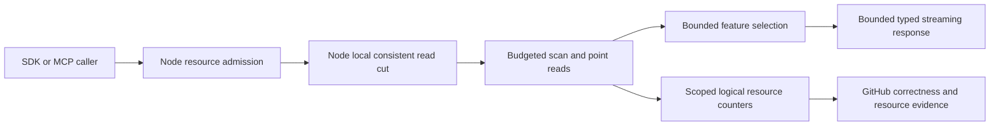

# ResourceExecution

Actual database phase diagnostics are specified in
[DatabasePhaseProfiling](ResourceExecution/DatabasePhaseProfiling.md) under
[ADR-063](../ADR/ADR-063-bounded-database-phase-profiling.md),
REQ-RESOURCE-003..006 and AC-DBPROF-001..008. The fixed BCL-only Diagnostics
schema is joined first; bank, preserving producer instrumentation, private
node capture and genuine source-bound measurements remain open. This optional
workstream changes no authorized cut, database state, WAL or acknowledgement.

The additive TimeSeries readers under
[ADR-052](../ADR/ADR-052-timeseries-bounded-aggregates.md) map REQ-MP-002/005 and
AC-MP-002/005/011/012 to AC-SERIES-011 and AC-RANGE-REV-003. One original read
gate and one budgeted view charge metadata/data/lookahead exactly once, enforce
deadline/cancellation and exact full JSON results, and preserve healthy
following operations after failure. Root owns BudgetedReadView reverse forwarding;
TimeSeries and StorageRecovery workers own their disjoint operation/provider
acceptance tests. Source and exact-SHA evidence are pending; architecture choices
do not establish maximum throughput, physical I/O, process RSS or numeric coverage.

TASK-RUNTIME-CANCEL-W2 is an accepted AC-MP-009/010/012 fixture refinement under
[ADR035](../ADR/ADR-035-memory-performance.md): arm a dedicated real-file growth
observer before native async report writing; retain the corpus,10second deadline,
quarter-output cutoff, OCE and no-later-file assertions. The same scoped worker
coordinates one bounded second real Kestrel partial-body write after the cancelled
client result while preserving actual RequestAborted, incomplete response,
five-second waits and same-client reuse. Only the four named fixture files and a
necessary same-slice observer helper belong to this worker; product serializers,
client/SDK transports, public contracts and all budgets remain unchanged. Existing
run37015193756/ad594642 is the failing baseline; enabled source quality and the
full new exact-SHA GitHub suite qualify the final result.

Status: Accepted contract; implementation and qualification in progress.
[ADR-035](../ADR/ADR-035-memory-performance.md) owns scoped read/resource/lifetime
decisions. Full requirements and test strategy: [acceptance](../../memory-performance.acceptance.md).

The staged disposable-cache contract and ordered task graph are accepted in
[ADR-058](../ADR/ADR-058-orleans-coordinated-cache-memory.md). The common pool and
explicit embedded positive-point stage are approved source scopes; authenticated
Orleans control still needs its exact lead-reviewed contract before coding.
Local brainstorm/acceptance/plan scaffolds remain ignored by owner policy; these
durable requirements and the ADR are the reviewable source of truth. No cache or
performance capability is qualified yet. UI/HTTP/SDK/MCP cache administration is
N/A in this stage; existing public database operations remain the visible boundary.

| Cache requirement | Acceptance | Task and automated proof |
|---|---|---|
| REQ-CACHE-001: shared validated retained-byte/entry reservations and lifetime | AC-CACHE-001/002 | TASK-CACHE-MEMORY-R26; real CacheMemoryBudget capacity/overflow/index/concurrent/disposal TUnit |
| REQ-CACHE-002: exact-key coherence and store-generation/recovery fencing | AC-CACHE-003/004/015 | TASK-CACHE-PROVIDER/PROVIDER-TESTS/INTEGRATION-R28; actual ZoneTree transactions/snapshots/reopen; R83 genuine fixture identity regressions |
| REQ-CACHE-003: owned/scoped buffers and bounded local work | AC-CACHE-005/006/015 | TASK-CACHE-PROVIDER/PROVIDER-TESTS/INTEGRATION-R28; real pins/callbacks/eviction/logical-charge tests; R83 typed owned-copy oracle |
| REQ-CACHE-004: bounded authenticated Orleans physical-node policy coordination | AC-CACHE-007/011/012/013/014 | TASK-CACHE-CONTROL-R26; native RF3 grain/service restart/migration/forged-message tests; R69/R81 genuine local prerequisites and R82 bounded wire/crypto remain separately qualified |
| REQ-CACHE-005: current grants, barriers and field/tenant decisions | AC-CACHE-008 | TASK-CACHE-CONTROL-R26; current public SDK/MCP authorization flows |
| REQ-CACHE-006: honest closed resource metrics and comparable benefit | AC-CACHE-009 | TASK-CACHE-NATIVE-R26; repeated GitHub cache-on/off resource JSON |
| REQ-CACHE-007: complete delivered-source/native qualification | AC-CACHE-010/014/015 | TASK-CACHE-NATIVE-R26; build/format/analyzers/complexity/governance + unit/scalar/recovery/RF3 and real coverage |

#### Cache acceptance and testing methodology

AC-CACHE-011 adds the exact local provider binding under ADR-058 R69. An actual
opened store creates one configured-cold control with no index charge. Embedded
or existing owners reject another configuration; held/same-thread storage gates
return Busy, and permanent close cannot reopen. Exact ready receipt application
is idempotent; genuine continuous predecessor renewal retains entries/counters,
while skipped predecessor, withdrawal or expiry makes a fresh cold helper.
Dispose the old helper under the real writer before reserving a new index. Real
one-index-budget and pressure-release cases must progress without lost native data.
Delayed old retirement cannot disable a newer binding. Withdraw in an actual
native observer must perform one lookup/charge/callback and publish no candidate;
already admitted pinned readers retain charges until completion or exception.
Actual Dispose publishes admission-close before draining its held reader; all
owned charges release after the real drain. R75 rejects Dispose inside the same
thread's actual Read/Commit callback with LockRecursionException before closing
publication. Rejection leaves current eligibility, data and charges intact;
external close and same-directory reopen must then succeed. The exact preserving
repair, ownership and regression sequence are in ADR-058 R75.
Tests use genuine ZoneTree/files,
CacheMemoryBudget and System-clock CacheReadPermit in new
`ZoneTreeCoordinatedPointCache*Tests.cs` and real fixture/support files under
UnitTests/ResourceExecution, executed only by GitHub unit normal/scalar.

AC-CACHE-012 requires `IsCurrentAcceptance` to validate the complete immutable
accepted receipt and existing prepare-origin15second lease from one state read.
Default, stale, altered PreviousRevision/Continuous, withdrawn, expired or closed
receipts reject. The10second ceiling is acceptance-only. Real
`CacheReadPermitAcceptanceTests.cs` and the provider expiry cases cover this
local prerequisite; freely constructed equal values do not certify wire origin.

AC-CACHE-013 adds the accepted R81 actual physical-owner observation in ADR-058.
Control.TryReadOwnerIdentity returns Healthy/Busy/Closed and only actual
NodeId/incarnation/control RuntimeId. It attempts the actual reader with timeout
zero; same-thread operations/foreign writer are Busy, foreign reader may coexist,
closing is Closed, and acquired-gate runtime.Check preserves RecoveryRequired.
No index/lookup/lease, complete identity, secret, cache/pool lock or I/O is involved.
Real ZoneTreePointCacheOwner*Tests cover cold/warm counters, callback/held gates,
pre-drain/permanent closure, faulted apply and same-directory recovery. Root owns
the local seam/shared fixture; Luna owns only new tests. GitHub normal/scalar and
required recovery/RF3 qualify the source; tiny closure interleavings require
independent review. Observation is not full silo readiness or a remote grant.

AC-CACHE-014 implements only the accepted [exact internal v1 wire/primitive
contract](ResourceExecution/CacheControlV1.md) and ADR-058 R82 stages.
Thirteen immutable generated metadata types, closed byte enums, dedicated
bounded canonical bytes/HMAC, nested-proof validation and exact original-request
correlation have no production caller or eligibility side effect in this stage.
Actual pinned Orleans serialization and independent literal golden C/S/MAC/digest
vectors, per-field/null/enum/address/range mutations, signed policy mismatch,
flat rejection, valid-outer/invalid-nested MAC, accepted binding/sequence and real
concurrent signer disposal map to new CacheControlWire* TUnit files. Complete
size preflight and constant-time/private-key/disposal/alias/Id contracts receive
independent review; the unreachable64KiB edge has the explicit size-arithmetic
exception recorded in the exact contract. Root owns generated contracts and
primitives; Luna owns only new acceptance-led tests after freeze. Full enabled
source gates and a new exact-SHA GitHub run qualify them. Receiver, replay,
coordinator, timers, DI, native probes and RF3 enablement remain later stages.

AC-CACHE-015 repairs only the native test-fixture and assertion failures from
exact source2ecbeee4d/run37093992229:1539 normal cases,1522 pass,17 errors;
scalar skipped. A null byte[] signing key must remain absent nullable
ReadOnlyMemory, explicit valid32byte keys retain their genuine configured
incarnation, and explicit empty remains present and rejects TokenInvalidated.
ZoneTreePointCacheFixtureIdentityTests proves default real-store open/reopen,
configured valid-key peers and empty-key rejection without emitting secrets.
ZoneTreeCoordinatedPointCacheReadTests uses one named byte77 for assignment and
comparison, retaining independent warm copied bytes and all cache counters.
The existing fixture collects body and every store/directory/pool cleanup
independently and starts Dispose once before cleanup. Root owns traceability,
enabled source gates, independent review and exact-SHA normal/scalar/recovery/
RF3 qualification; Luna owns only these three test files. All17 failing IDs
must pass on the next delivered source. No product identity validation, key
generation, provider error, cache data or dependency behavior changes.
ADR-058/035/041 already govern these unchanged boundaries; no new migration.

R86 exact source397a89c46df8caaf0cc89a51e2e1c7b9208adcc6/
run37097831105 passes63 RF3,164 recovery/1000 seeded process-cut rows and118
analyzer cases. Normal1583 has1566 pass/17 identity errors; scalar/comparisons
are skipped. The historical byte77 case passes,16 prior identity errors persist
and the new genuine default-key/reopen case fails. R88 explicitly casts the
absent conditional branch to ReadOnlyMemory<byte>?; a bare null branch still
permits natural present-empty memory conversion. The already shared one-line
source correction preserves all genuine original/empty-key assertions and product
validation. Every current identity failure and the historical byte case must pass
on the next exact source. Seven R81 owner-observation cases pass in normal mode,
with no full-ready, signer/controller, scalar or coverage qualification. The
[original native receipt](../implementation/runtime-qualification-37097831105.json)
is the canonical result and artifact join.

R93 delivered sourced45d7f253d309610d7cce66684f155170277252a/run37098964980
closes AC-CACHE-015: all1583 native unit cases pass in normal and scalar modes,
with identical complete ID/status sets and no skips. All17 R86 identity failures
and the historical byte77 oracle pass in both modes. Recovery164/164 plus1000
seeded rows, analyzer118/118 and actual SDK/MCP RF363/63 pass. Root joined the
original API/run/SHA/ZIP digests, every native ID,20 seed files and four genuine
container restart receipts in the [R93 source-gates receipt](../implementation/cache-native-source-r93.json).
The comparison workflow concluded failure:24/27 preflight jobs succeeded,3 failed
(MongoDB n2 image import, MongoDB n3 NotPrimary reads, KurrentDB n2 cleanup).
Two successful Neo4j Community jobs report unsupported topology; the270-cell
matrix and aggregate did not execute. The [R100 wire source receipt](../implementation/cache-wire-source-r100.json)
binds the independent34-product/26-test review and root's complete hash comparison.
This source is absent from d45 and requires fresh integrated gates and its own
delivered native codec/crypto/lifetime qualification. Full-ready control, coverage, matched
cache profiles, endurance and power-loss gates remain open; RF3 caches stay off.

The later ALL186-file5bb checkpoint/run37104211481 passes actual RF363/63 and
analyzer118/118, with exact native reports, six original ZIP digests and four
new-container restart receipts in the [R104 terminal receipt](../implementation/cache-checkpoint-native-r104.json).
Full solution verify fails20 Node test-helper diagnostics; normal/scalar units,
recovery and comparison lanes are skipped. AC-CACHE-014 wire tests were not
executed. Current preserving helper corrections, complete development gates and
a new delivered-SHA native run remain required; this checkpoint is not full
AC-CACHE-010 qualification.

TASK-CACHE-BINDING-INTEGRATION-R69 is root-only: shared contracts, permit join,
public control/facade/runtime/lifecycle/read admission and durable docs.
TASK-CACHE-BINDING-STATE-R69 owns only new private ResourceExecution binding/state
helpers; TASK-CACHE-BINDING-TESTS-R69 owns only the new acceptance-led real tests.
The full ordered implementation, exact APIs/result subsets, disjoint file owners,
dependencies, rollback and join gates are in ADR-058 R69. Shared lifecycle and
transition order and tiny post-pin/create-close interleavings receive explicit
independent source review because deterministic forcing would require forbidden
production hooks. Real callback, pressure, revoke, close and concurrent lifecycle
tests remain mandatory; that exception does not substitute for signed RF3 proof.

Coordinated snapshots report effective eligibility and configured-cold state.
Closed means permanent admission closure; retained pinned/index bytes remain
visible until actual release. Current-helper counters reset on cold replacement
and have no-helper gaps; Hits counts successful pins, including rejected pins.
Store diagnostics remain cumulative logical read work across both cache hits and
native reads. A fresh local RuntimeId is not actual RF3 readiness, membership or
physical permit certification. Production composition remains cold.

- AC-CACHE-001 passes only when one shared node pool atomically reserves validated
  positive modeled bytes/nonnegative entries before optional owned allocations;
  exact byte/entry caps succeed, one-over and overflow fail without mutation, and
  real concurrent consumers cannot exceed either ceiling. Positive index charges
  may reserve zero entries. Invalid limits/requests must reject explicitly.
- AC-CACHE-002 requires idempotent/concurrent reservation release and coherent
  snapshots after closure. Closing admission or retiring an entry cannot release
  any charge while a reader/candidate still owns its bytes. Real public pool tests
  and genuine pinned-store callbacks prove cleanup on success and exceptions.
- AC-CACHE-003 requires privately owned positive bytes keyed by complete encoded
  content, physical runtime and ReadGeneration. Every Apply invalidates before
  native mutation; unrelated commits retain coherent entries. Real staged
  put/delete/reset/rejection, multi-key commits, tombstones/reinsert and replay
  tests fail if staged or old data appears as a committed hit.
- AC-CACHE-004 requires independent Clear before authority/tree replacement,
  including warm keys absent from a snapshot and interrupted install. Corrupt or
  stale snapshots preserve existing typed failure/authority behavior; known poison
  cannot be bypassed. Same-cut compaction/export may retain entries. Real files,
  recovery observers and cold reopen/disposal prove unchanged durable results.
- AC-CACHE-005 requires caller-owned output copies, the existing scoped readonly
  borrowing boundary and no allocated hit lease. Index/live/retired-pinned/fill
  ownership stays charged; immutable key binding precedes callbacks. Observer and
  consumer execute outside cache/budget locks, with finally release on throw,
  cancellation and eviction. Real synchronized readers prove pin/duplicate-fill
  lifetime rather than inferring it from final occupancy.
- AC-CACHE-006 requires the sole StoreGate -> CacheGate -> budget order and no
  cross-store callbacks/eviction. Admission checks current revision/generation,
  makes at most16 local victim attempts and preserves native results when full,
  oversized, disabled, pin-limited or unavailable. Logical charges/observer order
  and typed errors remain exact; unexpected invalidation failures fail closed.
  Real native diagnostics and shared-store pressure cases prove these conditions.
- AC-CACHE-007 requires authenticated bounded Orleans exchange binding actual
  fixed-voter readiness, silo generation, physical store/incarnation, exact local
  policy and receiver-owned finite lease. Server starts cold. Forged/replayed,
  stale/expired/wrong-node, unavailable control, restart and migration cannot
  enable a node without its own valid acceptance. No grant precedes complete RF3
  readiness and cohort preparation. Partial final acceptance stops renewals and
  attempts bounded revocation; nodes without acceptance stay cold, while an
  already accepted node may remain locally accelerated only until its receiver
  lease expires within15seconds. Instant atomic RF3 cache activation/revocation
  is not promised. Every request still uses the original fresh quorum and current
  authorization path. No control message moves data/files or grants access.
  Actual RF3 grain/service SDK/MCP tests are mandatory; embedded opt-in is separate.
- AC-CACHE-008 requires fresh current authentication, credential time/revocation,
  quorum, row/field policy and command replay fingerprint/incarnation checks on
  every public operation. Coherent raw principal/StoredOutcome bytes may be
  retained; grants, final authorized objects and negative lookups may not. Real
  authority changes and cross-tenant/hidden-field/error flows must keep exact results.
- AC-CACHE-009 requires closed data-free counters and repeated matched exact-SHA
  on/off cold/warm/mixed/pressure GitHub profiles with the same topology/ACK/read
  contracts. Retained modeled bytes, allocations/GC, per-node RSS, native lookups,
  latency, throughput, contention and backlog remain distinct. Missing or mixed
  measurements fail any speed/RSS claim; a build is never measurement evidence.
- AC-CACHE-010 requires the delivered-SHA full build/format/governance/analyzer,
  normal/scalar TUnit, real process recovery and Docker/Aspire RF3 SDK/MCP gates,
  plus actual compatible coverage before claiming numeric thresholds. Skipped
  suites, fake providers, local load or unpublished packages cannot count as pass.

Automated sources live in matching ResourceExecution tests; storage/domain tests
retain their original owners. Unit execution is through `ci.yml` normal/scalar;
recovery and RF3 execute their real process/container projects in that workflow.
The accepted R28 task graph supplies exact disjoint files and joins in ADR-058.
Lock order, secret-free metadata and physical ownership have a source-review
exception requiring independent inspection; it does not replace native cases.
Rollback disables ephemeral admission, drains readers and removes optional joins
together. No persisted format, authorization, ACK or production RF3 migration.

Baseline63ac27c run37082449440 failed the solution build with IDE0032/IDE0290
in the website receipt source; normal/scalar/recovery/comparisons were skipped.
Separate native analyzer118/118 and RF3 63/63 passed, including new dependency
consumption on that source. Current cache source awaits a later exact-SHA run.

| Requirement | Acceptance | Task / test ownership |
|---|---|---|
| REQ-MP-001: all current operation/resource paths reviewed and evidenced defects closed | AC-MP-001 | TASK-MP-001/002/003/004; located inventory and independent final review |
| REQ-MP-002: bounded consistent read/mutation work without redundant materialization | AC-MP-002..006 | TASK-MP-005/006/007; real StoreRecovery, QueryExecution, Search, core feature tests |
| REQ-MP-003: bounded cluster lifetime/transfer and crash-safe retention | AC-MP-007/008 | TASK-MP-009; real ClusterReplication persistence, recovery and RF3 |
| REQ-MP-004: bounded streaming caller/report transport | AC-MP-009/010 | TASK-MP-008; ClientApi and BenchmarkComparisons real contracts |
| REQ-MP-005: honest integrated qualification and resource measurement | AC-MP-011/012 | TASK-MP-010/011; exact-SHA GitHub full suites and resource JSON |
| REQ-MP-006: remove avoidable JSON text byte copies and cached-receive request parses | AC-MP-006/009/011/012 | TASK-MP-007J under ADR-035; public strict text/byte, Unicode/error, owned lifetime, allocation and real-store replay cases |

Common storage/resource primitives are shared building blocks. Feature behavior
stays in its canonical slice: StorageRecovery, QueryExecution, Search,
DocumentStorage, EventStreams, TimeSeries, GraphTraversal, Messaging, ChangeFeeds,
ClusterReplication, ClusterRouting, ClientApi and BenchmarkComparisons. New helper
and test files use matching Features paths; flat existing paths remain ADR-032
migration debt and may be repaired without expanding that debt. Shared contracts
and API/composition/CI/docs have exactly one integration owner.

Strict public-collection prerequisites are governed by
[ADR-041](../ADR/ADR-041-read-only-public-collections.md). REQ-ROC-001..006 /
AC-ROC-001..006 map to AC-MP-002/003/004/006/012. The explicit CLR API migration
preserves JSON arrays/base64, exact fingerprints and owned buffers; all consumer
signatures and dense-vector spans must join before build/CI. New tests use this
slice; original business Feature owners retain DTO/operation ownership.
The lead-owned strict converter stage delegates the array protocol to the official
serializer and attaches only its fresh private arrays without another full copy.
Required null/default values reject explicitly; nullable arrays and byte tombstones
keep their meaning. See ADR-041 for exact ownership and tests-first join conditions.

Admission/inbox ownership and the related CLR type migration are governed by
[ADR-042](../ADR/ADR-042-admission-resource-ownership.md): REQ-ADM-001..003 and
AC-ADM-001..003 extend REQ-RESOURCE-001 / AC-RESOURCE-001 and AC-MP-006/012.
TASK-MP-010J owns disjoint admission source/tests; the lead joins actual callers
and exact GitHub evidence. Semaphore disposal must follow registered-reader drain.

No cache may outlive its authority/read cut without explicit invalidation. Mutable
storage arrays cannot escape through a borrowing optimization. Cancellation and
budgets must stop work before a complete excess page is allocated. Logical work,
managed allocation and process working set are different measurements; physical
I/O needs real provider/OS evidence. UI/persisted domain-data changes are N/A for
the common resource contract; any required retention/transport mutation receives
an explicit ADR implementation stage before coding.

## Accepted TASK-MP-007E canonical-JSON work

REQ-MP-002 maps AC-MP-006/012 to exact canonical validation and fingerprints used
by mutations, signed cursors and replay. Validation retains ordinal property order,
duplicate-name rejection, decimal `G29` normalization, escaping, object/depth/input
byte rules and the existing owned UTF-8-decoded string. Fingerprinting retains raw
number spelling and exact lowercase SHA-256 under the same JsonDefaults options.
Null fingerprints remain valid; invalid arguments fail before work.

Serialize fingerprints directly to a JsonDocument sharing its pooled serializer
buffer, then stream canonical bytes to IncrementalHash. Flush Utf8JsonWriter after
each complete value when pending bytes reach a named 64 KiB threshold; a single
large token and object-sort metadata remain separately allocated. Validation
decodes the used MemoryStream buffer without ToArray. No hard RSS limit, input
limit change, storage migration, signature or public API change is implied.

Lead owns JsonData.cs and shared docs; worker owns only new Core/UnitTests
Features/ResourceExecution canonical writer/hash adapter and tests. Tests precede
code: handcrafted canonical/hash fixtures cover property order, nested arrays,
Unicode, null, duplicate names and numeric spelling; real database retries preserve
outcomes; warmed allocation growth over many modest tokens detects full-output
buffer duplication. Execution is GitHub-only; runtime/resource evidence is pending.
Lead moves the existing JSON-pointer parse/escape algorithm into a matching shared
helper solely to keep JsonData within the mandatory type limit while repairing
its documentation, braces and null guards. Public wrappers, 1,024-character bound,
RFC 6901 decoding, missing/scalar distinction and field-patch behavior stay exact;
direct pointer/patch acceptance cases join existing real-document regressions.

## Accepted progressive report output repair

TASK-MP-008C implements REQ-MP-004, REQ-BC-010 and AC-MP-010/012 under ADR-035/044.
The current owned synchronous Cases/Samples converters retain full serialized
payloads before SerializeAsync can flush. Private write-only views adapt both
collections to native async enumeration over existing immutable arrays. Public
ComparisonReport/ComparisonCase, strict read converters, targets, exact JSON
schema/property order, every attempt and CSV/Markdown content stay unchanged.
Default arrays still reject with the existing JsonException and safe detail.

Tests-first source retains the real-file byte/schema/roundtrip oracle, populates
optional provenance/image metadata, and cancels directly in the early-growth
observer. The fixed 20,000-by-4,096 sample input stays bounded; partial output must
remain below one quarter of its complete raw error-byte lower bound, with no
Markdown/CSV. Source audit verifies no sample-array/list/string duplication. The
worker owns new BenchmarkComparisons write views/helpers and ReportFileTests.cs;
lead alone joins ReportWriter and shared docs. Enabled build/format/governance and
complete exact-SHA GitHub tests qualify correctness; matched memory/speed evidence
remains open. No public/data/report-version or package migration.

## Accepted exact-CI fixture corrections

TASK-RUNTIME-ADMISSION-W preserves REQ-MP-002/005 and AC-MP-004/011/012 under
ADR-035. Run37005805424 proves that a held shared read callback does not block
another reader. Only the two analytical-admission cases use a new real exclusive
ZoneTree Commit callback holder with no staged changes; existing read-lifetime
tests retain their original helper. Keep all saturation, independent-engine,
in-flight cancellation, cleanup, ten-second bounds and healthy-followup assertions.
The worker owns those two test references and the new helper; the lead reviews
complete task/holder release before store disposal and qualifies on GitHub.

TASK-RUNTIME-JSON-ORACLES-W keeps REQ-MP-006 / AC-MP-006/012 and ADR-035/041
serializer contracts. Existing direct System.Text.Json byte/text/OperationResult
lone-escaped-surrogate cases expect the actual JsonException on all three paths;
raw UTF-8 replacement and all strict collection/base64 cases remain unchanged.
The embedded benchmark keeps unsorted producer input and expects ordinal canonical
stored JSON under ADR-047 / AC-EM-002. Topic quota comparisons use the correct
Int64 operands without changing exact-byte, one-byte-short or rollback checks.
These are test-oracle repairs, with no new product or persistence decision.

## Admission, operations та observability

### Accepted TASK-MP-006C analytical-read admission

REQ-MP-002/005 and AC-MP-003/004/011/012 require one fail-fast analytical-read
allowance per DatabaseEngine for SQL, AST, both live-query calls and text/vector/
hybrid search. The configured MaxConcurrentQueries must be positive. A new shared
Core/Features/ResourceExecution gate uses one bounded atomic count, no wait queue
or per-caller dictionary. DatabaseEngine exposes an owned IDisposable reservation
and an observational current reservation count through a new partial source file;
existing DatabaseEngine.cs remains with its concurrent integration owner.

Acquire checks cancellation before reserving, rejects saturation with the existing
ResourceExhausted query-concurrency detail, and compensates if cancellation or
allocation fails immediately after the atomic reservation. Dispose releases exactly
once. Each operation keeps the reservation across adaptation, authorization, store
gate wait, scanning/ranking and final result validation. Existing public result,
fingerprint, storage and cancellation contracts stay unchanged; no host clock change.

TASK-MP-006C owns QueryEngine.cs, LiveQueries.cs and SearchEngine.cs admission joins,
new Core/Features/ResourceExecution gate/partial files and new UnitTests
Features/ResourceExecution admission cases. Lead owns shared docs and final review.
Tests first use real ZoneTree read-gate coordination to hold an actual admitted
search while SQL/AST/live/search requests and a second engine instance are rejected
before storage work. Independent databases remain independent. Direct reservation
disposal, invalid limits, pre-/in-flight cancellation, validation/budget errors and
a successful following call prove release. Coordination timeouts detect hangs and
are not throughput measurements. Tests run in GitHub only; source rollback changes
no persisted format or wire and removes the new method/joins together.

### Accepted TASK-MP-011A provider diagnostics

TASK-MP-007H additionally owns an internal BudgetedReadView in this slice. It
wraps an existing IKeyValueView only inside a committed read action, forwards
borrowed callbacks with one cumulative ReadExecutionBudget charge before copy/
decode, and implements the same owned Get/Scan contracts through borrowed work.
VisitRange composes a caller observer without double charging and honors both the
operation and any method-specific cancellation token. Existing provider budgets,
ordering, lookahead, stop flags and callback non-mutation remain unchanged. This
adapter reuses persisted authorization helpers; it does not reimplement principal
or policy decisions. The shared budget's CreateView(IKeyValueView) exposes that
read-only capability under an explicit same-store-action lifetime contract; the
concrete adapter remains internal. Direct real-store adapter cases cover every method, observer
order/failure, cancellation and healthy follow-up in addition to source-read flows.

REQ-MP-005 / AC-MP-011/012 adds an immutable per-ZoneTreeStore read snapshot with
a fresh nonpersisted session ID and cumulative Int64 owned/borrowed point counts,
point examined bytes, range attempts, baseline/staged/tombstone entries, logical
limit lookaheads and range examined bytes. Counters use constant memory and atomic,
saturating increments; a saturated field stops growing and cannot prove later
deltas. Snapshots are observational and non-atomic across fields under concurrency;
only quiescent isolated real-store test windows provide exact operation deltas.

Point hits count key plus logical value bytes, misses/tombstones key bytes, before
copy/observer/decode. A transaction fallback is counted once by the owner; a staged
hit is counted once by the transaction. Scan delegates the one range attempt.
Range attempts include invalid/pre-cancel calls with zero examined work. Each
matching fetched baseline or selected staged entry is counted before cancellation,
provider cap or observer rejection, including prefetch, overwrite, tombstone and
true live result-limit lookahead. Never-fetched staged peeks and iterator keys
outside the range are not examined payloads. Existing StorageScanResult.ReadBytes
remains accepted budget work and is distinct from these total attempted counters.

This observes logical provider operations only; native iterator/cache/seek and OS
physical I/O remain unmeasured. No keys, paths, identities, payloads or credentials
are recorded. Reopen starts a new session; diagnostics do not alter durable data,
authorization, gates or wire. Public node/report telemetry is a later lead-owned
contract, with canonical and replica store scopes separate.

Lead owns existing provider instrumentation joins and public composition; worker
owns new StorageRecovery counter/snapshot helpers and matching real-store tests.
Tests precede integration: found/missing/staged/tombstone/failing-observer points,
range overwrite/tombstone/prefetch/lookahead/bounds, pre- and mid-cancellation,
provider budget failure and healthy subsequent reads. GitHub executes them; no
measurement claim follows from authored counters or local static validation.

Актори: data caller, trusted control caller, operator та CI observer. Actual entry points: [CommandAdmissionGovernor](../../src/KeyLoad.Core/CommandAdmissionGovernor.cs), [HTTP admission](../../src/KeyLoad.Server/ApiEndpoints.cs), [ServiceDefaults telemetry](../../src/KeyLoad.ServiceDefaults/Extensions.cs), Aspire composition; shared resource contracts у [Admission](../../src/KeyLoad.Abstractions/Admission.cs) і [HttpAdmission](../../src/KeyLoad.Abstractions/HttpAdmission.cs). Public UI N/A; benchmark views належать BenchmarkComparisons.

| Вимога | Acceptance / flows | Test mapping |
|---|---|---|
| REQ-RESOURCE-001: node/tenant/principal admission має bounded data lanes та незалежний control reserve | AC-RESOURCE-001: concurrent admissions не перевищують ceilings; quota/cancel/auth rejection звільняє reservation exactly once; кілька API keys не обходять principal cap; full data traffic не вичерпує bounded control capacity | Existing `BytesAndScopesAreReservedAtomicallyAndReleasedExactlyOnce`, `TenantAndPrincipalCapsCannotBeEvadedWithMoreApiKeys`, `FullDataAdmissionPreservesBoundedControlCapacity`, `ConcurrentLoadCannotExceedTheNodeCeilingAndReleasedScopesDoNotAccumulate` у [CommandAdmissionTests](../../tests/KeyLoad.UnitTests/CommandAdmissionTests.cs); [HttpAdmissionTests](../../tests/KeyLoad.UnitTests/HttpAdmissionTests.cs); real RF3 mixed-load expansion PLANNED |
| REQ-RESOURCE-002: operations/telemetry показують фактичні guarantees і bounded work без secrets | AC-RESOURCE-002: кожна advertised operation family має exact workload, topology, read/acknowledgement semantics, explicit numeric resource/latency/throughput budget і measured result; bounded low-cardinality counters/timings покривають admission, Orleans hops, quorum/apply wait та logical reads/bytes/scans where applicable; PII/keys/tokens/request IDs відсутні; logical bytes, managed allocations/GC, client working set і per-node CPU/RAM мають окремі names/provenance; unknown measurements are reported unavailable, not zero | Source counters alone do not pass. TUnit proves metric names/labels/privacy and configured thresholds; real Docker/Aspire RF3 profiles exercise successful, saturated, rejected, cancelled and slow-consumer/backpressure cases through the .NET SDK and official MCP client. Repeated exact-SHA baseline/candidate JSON must use identical workload, topology and acknowledgement/read guarantees; thresholds are derived from that evidence under AC-MP-011. |

Рішення: [ADR-010](../ADR/ADR-010-query-budgets-security.md), [ADR-028 scheduling time](../ADR/ADR-028-persisted-scheduling-time.md), [ADR-031 modular resource isolation](../ADR/ADR-031-modular-all-in-one-resource-isolation.md), ADR-035. TimeProvider.System залишається host/Orleans clock; operation clock не заморожує cluster runtime. Mixed query/search/graph/event/queue workloads потребують real correctness+liveness tests, а не окремих synthetic doubles.

Shared primitive/config/telemetry composition мають одного integration owner; бізнес-work і matching tests залишаються в owning `Features/<SliceName>/`. Configuration validation, invalid bounds, zero/empty work, overflow, cancellation/deadline і healthy follow-up входять до AC. Freeze shared limits → real regression source → feature fixes → integrated GitHub gates → actual measurements. Local doc review не доводить numeric coverage, memory ceilings чи performance gain; metrics публікуються тільки з successful GitHub JSON.
