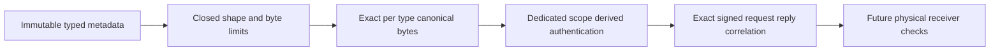

# ResourceExecution cache control v1

State: accepted R82 wire/primitive implementation contract after independent
review; no controller or production enablement approval. Governing decision:
[ADR-058](../../ADR/ADR-058-orleans-coordinated-cache-memory.md).
Related REQ-CACHE-004/007 and AC-CACHE-007/010/014 in [ResourceExecution](../ResourceExecution.md).
The R69/R75 local capability and R81 actual owner observation are prerequisites.
Root joined the complete independent review e02ad6e40d20e09b2d38919a5b26ead48a677c40ec56d4337c195f7f2b6ba0b0
of exact candidate8adca2e05910c6f21d5fe7e2a6f65fedc37d27b490c2c7a4096ed55db7817bf4.
Implementation, native codecs/crypto tests and qualification remain pending.
No complete local StoreIdentity, signing material, data, path, authorization result
or CacheReadPermitAcceptance enters these generated internal control types.

## Immutable wire schema

All types are in KeyLoad.Orleans/Features/ResourceExecution. Use GenerateSerializer,
stable Alias and Id attributes, and actual immutable records; no mutable arrays or
variable proof collection. Alias prefix is `keyload.cache.control.`; suffix is
`.v1`. The following table gives the middle alias and permanent increasing field
IDs, starting at zero. MAC fields are omitted only while signing their OWN type;
nested proof MACs and request MACs in correlation digests remain included.
Digest is an internal readonly record struct; all other table types are internal
sealed positional records. All receive GenerateSerializer/Alias/Immutable with
property Id annotations. Closed enum CLR names are CacheVoterSlot,
CachePhysicalRole, CacheControlOperation, CacheRevokeEffect, CacheControlStatus;
all have byte underlying type. Required CLR field types use the full Cache*
names in the table; shorthand below never introduces another wire type.

| Type / alias | Fields in Id order |
|---|---|
| CacheControlDigest / digest | UInt64 Word0, Word1, Word2, Word3 |
| CachePhysicalBinding / physical-binding | VoterSlot Slot, Guid NodeId, Guid Incarnation, string SiloAddress, Guid RuntimeId, PhysicalRole Role |
| CacheControlHeader / header | byte Version, Operation Operation, Digest ScopeHash, Digest PolicyHash, long PolicyRevision, VoterSlot OriginSlot, VoterSlot? TargetSlot, Guid CoordinatorSessionId, Guid RoundNonce, Guid RequestNonce, long SentUnixMilliseconds |
| CacheReadyProof / ready-proof | byte Version, Digest ScopeHash, Digest PolicyHash, long PolicyRevision, VoterSlot OriginSlot, Guid CoordinatorSessionId, Guid RoundNonce, Guid ChallengeId, long ChallengeSequence, PhysicalBinding Binding, Status Status, Digest Mac |
| CachePrepareRequest / prepare-request | Header Header, string ExpectedTargetSiloAddress, Digest Mac |
| CacheGrantRequest / grant-request | Header Header, Guid GrantId, PhysicalBinding TargetBinding, ReadyProof Slot0Proof, ReadyProof Slot1Proof, ReadyProof Slot2Proof, Digest Mac |
| CacheRevokeRequest / revoke-request | Header Header, Guid GrantId, PhysicalBinding TargetBinding, Digest Mac |
| CacheRefreshHint / refresh-request | Header Header, PhysicalBinding SenderBinding, Digest Mac |
| CacheReplyCorrelation / reply-correlation | Header Header, Digest SignedRequestDigest |
| CachePrepareReply / prepare-reply | ReplyCorrelation? Correlation, Status Status, ReadyProof? Proof, Digest Mac |
| CacheGrantReply / grant-reply | ReplyCorrelation? Correlation, Status Status, Guid GrantId, PhysicalBinding? AcceptedBinding, long AcceptedSequence, Digest Mac |
| CacheRevokeReply / revoke-reply | ReplyCorrelation? Correlation, Status Status, Guid GrantId, RevokeEffect Effect, Digest Mac |
| CacheRefreshReceipt / refresh-reply | ReplyCorrelation? Correlation, Status Status, Guid ActualCoordinatorSessionId, Guid CurrentRoundNonce, string? ActualCoordinatorSiloAddress, Digest Mac |

Closed byte enum values: VoterSlot=Slot0:0/Slot1:1/Slot2:2;
PhysicalRole=Canonical:1; Operation=Prepare:1/Grant:2/Revoke:3/Refresh:4;
RevokeEffect=None:0/PendingRemoved:1/LeaseWithdrawn:2/Both:3.
Status=Ready:1/AcceptedActive:2/AcceptedCold:3/Busy:4/NotReady:5/
PolicyMismatch:6/StaleChallenge:7/Replay:8/Rejected:9/Closed:10/Capacity:11/
Revoked:12/HintAcknowledged:13. Unknown values reject.

Version is exactly1; revision/sequence positive and nonwrapping. RequestNonce,
physical NodeId/incarnation/RuntimeId and challenge/grant IDs are nonempty.
ScopeHash and PolicyHash are nondefault. SentUnixMilliseconds must be within
DateTimeOffset's supported Unix-millisecond range; freshness is a later check.
Physical Header.TargetSlot is required; session/round are nonempty. Refresh
TargetSlot is null; its header carries last-observed session/round: both empty,
session nonempty/round empty, or both nonempty. Empty session/nonempty round
rejects. Every required reference/string must be nonnull before encoding.
Silo address is canonical round-tripped native SiloAddress, including generation,
at most256 UTF16 units and1024 strict UTF8 bytes; no normalization after signing.

ReadyProof.Status is Ready. Grant has exactly the three correct fixed proof slots,
same scope/policy/revision/origin/session/round, distinct full silo addresses and
NodeIds, common incarnation and Canonical role. Generation integers need not
be globally unique. Own TargetBinding equals the proof for Header.TargetSlot.
Cryptographic validation also authenticates each proof independently. Actual
configured membership/discovery/current local challenge checks belong to the
future receiver; a signed tuple alone is not readiness.
Header.Operation is Prepare for PrepareRequest/PrepareReply, Grant for
GrantRequest/GrantReply, Revoke for RevokeRequest/RevokeReply and Refresh for
RefreshHint/RefreshReceipt. Wrong root/header combinations reject before bytes.
Revoke.TargetBinding.Slot equals Header.TargetSlot; Refresh.SenderBinding.Slot
equals Header.OriginSlot. Proof has no header and uses dedicated signing opcode5.

## Reply shape and correlation

Every signed reply echoes the exact original header and digest of the complete
signed request, including its MAC/proof MACs. Reply authentication uses the trusted
ScopeHash; requested PolicyHash is an echo, allowing a signed PolicyMismatch.
Only the exact originating operation/type is acknowledged. Verify the signed
body, correlation and request-specific binding/grant before interpreting status.

| Method | Permitted signed statuses | Exact shape |
|---|---|---|
| Prepare | Ready, Busy, NotReady, PolicyMismatch, Replay, Rejected, Closed, Capacity | Proof nonnull iff Ready; proof matches echoed header/origin/target and exact requested address |
| Grant | AcceptedActive, AcceptedCold, Busy, NotReady, PolicyMismatch, StaleChallenge, Replay, Rejected, Closed, Capacity | GrantId echoes request; only accepted statuses carry actual accepted binding and positive accepted challenge sequence; all other binding/sequence fields null/zero |
| Revoke | Revoked, StaleChallenge, PolicyMismatch, Replay, Rejected, Closed, Capacity | GrantId echoes request; Revoked iff effect is PendingRemoved, LeaseWithdrawn or Both; otherwise None |
| Refresh | HintAcknowledged, Busy, NotReady, PolicyMismatch, Replay, Rejected, Closed, Capacity | Only acknowledgement carries actual nonempty coordinator session/canonical address; current round may be empty; other session/round/address fields empty/empty/null |

Accepted binding/sequence describe actual local acceptance, including a subsequently
cold lease; they cannot reconstitute a capability. PreviousRevision/Continuous
stay local. AcceptedActive requires current exact eligibility/helper recheck at
reply time. HintAcknowledged means accepted/coalesced hint only, no lease/cohort.
For either accepted Grant status, correlation matching additionally requires
AcceptedBinding equal the original request.TargetBinding and AcceptedSequence
equal that target slot proof's ChallengeSequence. Positivity alone never matches.

Unauthenticated/malformed/unknown-scope/version input has no replay/challenge/
permit/cache side effect. Its bounded flat response is Status.Rejected with null
correlation/body, default MAC, empty grant/session/round and zero sequence/None
effect. This response is intentionally unauthenticated and never a success.
Known authenticated negative responses use complete signed correlation. No null
reply, free text, exception detail or invented healthy binding is accepted.
Exact flat shapes: Prepare(Proof=null); Grant(GrantId=Empty,
AcceptedBinding=null,AcceptedSequence=0); Revoke(GrantId=Empty,Effect=None);
Refresh(ActualCoordinatorSessionId=Empty,CurrentRoundNonce=Empty,
ActualCoordinatorSiloAddress=null). All have Correlation=null,Rejected/default
Mac; no other null-correlation combination is valid.

## Canonical bytes and authentication

Dedicated purposes: `keyload-cache-key-v1`, `keyload-cache-control-request-v1`,
`keyload-cache-control-reply-v1`, `keyload-cache-ready-proof-v1`,
`keyload-cache-request-correlation-v1`, `keyload-cache-scope-v1`,
`keyload-cache-policy-v1`. Never reuse replica purposes/replay state.

The derived physical-owner key is HMAC-SHA256(peer32byteKey,
length-delimited key-purpose + fixed ScopeHash). Message HMAC uses that derived
key and the appropriate request/reply/proof purpose, exact DTO alias and operation
(proof uses dedicated opcode5). Policy is not part of key derivation. A shared
peer key proves membership in a trusted cohort; it is not Byzantine independent
voter identity. Secret bytes are privately owned and zeroed at final disposal.
R82 treats ScopeHash and PolicyHash as trusted opaque nondefault32byte digests.
It does not compute them from configuration, caller text or native addresses.
The reserved scope/policy purposes have no implemented preimage API in this
stage; their future canonical configuration schemas must be separately frozen
before receiver/composition work. Do not invent a registry/hash schema here.

Each canonical object starts with its alias as UInt32 little-endian UTF8 byte
length followed by strict bytes. Each field is UInt16 little-endian Id followed
by its fixed schema value. Byte/enums are one byte; Int64/UInt64 are little-endian;
Guid is16 RFC4122/network-order bytes. Digest words interpret consecutive SHA/MAC
eight-byte chunks little-endian and write those words little-endian, reproducing
the original32 bytes. MAC/hash comparisons use FixedTimeEquals over those32 bytes.
Digest is an intrinsic scalar in this canonical transcript: every digest field
is exactly raw32 bytes, without nested-object length, digest alias or word Ids.
Its Orleans alias/word Ids belong only to the generated serializer contract.
String is UInt32 byte length plus strict UTF8 bytes. Nested object is UInt32
canonical-byte length plus that complete object. Nullable value/reference is one
presence byte0/1 and, only when present, its normal schema value. Required null,
unknown type/value/presence and overflow reject; no delimiter or JSON signing.
Purpose and operation prefix are likewise length-delimited purpose plus one byte.

Literal equations: L(s)=UInt32LE(strictUtf8ByteLength(s))||strictUtf8(s);
D(d)=UInt64LE(Word0)||UInt64LE(Word1)||UInt64LE(Word2)||UInt64LE(Word3).
C(m) is the complete object rule above including every field Id and own MAC;
Cminus(m) omits only m's own MAC field Id/value. K=HMAC-SHA256(peerKey,
L(keyload-cache-key-v1)||D(trustedScope)). S(m)=L(domain(m))||opcode(m)||Cminus(m),
where requests use control-request purpose, replies control-reply purpose and
proof ready-proof purpose. Mac(m)=HMAC-SHA256(K,S(m)). RequestDigest(q)=
SHA256(L(keyload-cache-request-correlation-v1)||opcode(q)||C(q)). There is no
key-derivation opcode, JSON, delimiter, terminator, CLR name or platform Guid
byte order. A nested object uses UInt32LE(length(C(child)))||C(child), including
its MAC even inside Cminus(parent). All final complete signed sizes must fit the
64KiB cap even when a smaller signing transcript is requested.

Own MAC field is absent from its signing transcript; no other field is omitted.
Correlation digest is SHA256 over correlation-purpose + original operation +
the full canonical signed request INCLUDING its MAC. All shapes and encoded
lengths are validated before allocating application transcript buffers; cap64KiB
independently covers C(m),S(m) and the complete RequestDigest input including
its purpose/opcode prefix. The fixed v1 shape is far below this cap after its
address limits; that numerical unreachable boundary receives exact size-arithmetic
review, while malformed/overlong actual fields have native automated coverage.
This bounds application processing after Orleans deserialization only. Native
decoder allocation, transport queues, GC/RSS and all other interfaces' limits
remain unverified/unchanged. No global replication cap reduction is implied.

## Frozen primitive surface for the R82 test handoff

These APIs are internal and unused by production composition. Root owns them;
only the table types have generated wire aliases/Ids. Marker interfaces
ICacheControlMessage(Mac getter), ICacheControlRequest(Header getter) and
ICacheControlReply(Correlation getter) add no serialized fields; ReadyProof
implements only Message. Canonical dispatch accepts only the nine sealed root
request/reply/proof types and rejects every other shape.

CacheControlDigest.FromBytes(ReadOnlySpan<byte>) and WriteBytes(Span<byte>)
require exactly32 bytes and otherwise throw ArgumentException;
FixedTimeEquals(CacheControlDigest) compares all32 bytes. They own no buffers.
CacheControlWire.TryEncodeSigned(ICacheControlMessage?, out byte[] bytes) emits
C(m); TryEncodeForSigning with the same signature emits S(m). Invalid shape,
strict UTF8/address, enum/version/required-null/length/overflow returns false
with bytes=Array.Empty<byte>(); no partial buffer escapes. Complete preflight
shape/size succeeds before either output transcript buffer is allocated.
TryEncodeSigned permits only the exact flat rejection shapes. TryEncodeForSigning
rejects them with false/empty output. These pure encoders validate complete shape
and bounds, not nested MAC authenticity; they have no key.

CacheControlCorrelation.TryCreate(ICacheControlRequest?, out
CacheReplyCorrelation? correlation) returns exact header plus RequestDigest;
false clears output to null. TryMatch(ICacheControlRequest?,
ICacheControlReply?) validates both complete shapes and the exact type/operation,
header/digest, prepare binding/proof or grant binding/own sequence constraints.
TryCreate requires a nondefault request Mac, including all nested proof Mac
values in its digest; it does not authenticate them. TryMatch requires nondefault
request/reply Mac and nonnull reply correlation. Flat rejection never matches.
It is a pure correlation matcher: callers must separately authenticate reply
and proof before interpreting a status. It cannot authorize cache eligibility.

CacheControlAuthenticator(ReadOnlySpan<byte> peerKey,
CacheControlDigest trustedScope) copies/derives one privately owned key; a key
not32 bytes or default trusted scope throws ArgumentException. TrySign has
nine typed overloads, one per sealed root type, with nullable typed input and
nullable typed out result. Invalid input returns false/null; success returns a
new record with only its own Mac replaced. TryAuthenticate(ICacheControlMessage?)
returns false for invalid/flat/mismatched trusted scope/key/MAC. Both use the
exact closed transcript and FixedTimeEquals. A flat uncorrelated rejection may
serialize/encode as its exact bounded shape, but can never sign/authenticate.
TrySign and TryAuthenticate also authenticate all nested proofs with the same
trusted scope key: three in GrantRequest and the one nonnull Ready proof in
PrepareReply. Complete outer shape/size preflight precedes nested transcript
allocation. No recursive unbounded graph/proof collection exists. A valid outer
MAC cannot hide an invalid nested proof; pure encoder/correlation success is
explicitly distinct from this authentication result.

Private signer synchronization owns encoding/crypto and excludes Dispose;
there are no callbacks or other locks inside it. Dispose is idempotent, clears
private key material and permanently closes the signer. A method started after
disposal throws ObjectDisposedException; invalid input never revives it. A
later disposal after a completed signature does not revoke that metadata or
create a lease. Normal successful/invalid/closed lifetime and actual concurrent
compute/dispose are tested without a synthetic crypto provider. No exception
text or keys enters any reply.

## Later physical receiver contract, not R82 write permission

Full-ready follows awaited complete native host Start, Active/current owner and
no stop; stop entry withdraws before awaiting startup. Explicit cache opt-in on
non-RF3 rejects before files; opt-in=false preserves those database topologies.
One PartitionHost canonical-only pool/permit/control is borrowed by silo DI.
Coordinator primary key must equal trusted scope before round work; activation
starts cold and never moves physical stores or registry counts.

One latest challenge and one accepted grant per receiver; preparation sequence
strictly increases. Own prepare age<10seconds; lease age from that preparation
<15seconds. Complete fixed-cohort preparation precedes any Grant. Serialize
challenge consume/permit acceptance/accepted-grant publication against exact
Revoke under a small receiver gate; no store/network work there. Revoke removes
the exact pending session/round/binding and separately withdraws the actual
matching grant/sequence. Provider Apply/Retire follows outside that gate with
exact receipt rechecks. ACKed pending removal prevents late grant acceptance;
lost revoke/unknown original execution may still accept within its original
finite prepare/lease. Never claim instantaneous all-node activation/cold state.

Correlated System clock samples (MonoBefore/Utc/MonoAfter) use one immutable
physical midpoint baseline, sample width<=100ms and drift residual<=250ms.
Replay reservations use that exact MonoAfter; freshness is inclusive +/-30s,
retain128 nonces per configured origin for61 monotonic seconds without evicting
unexpired entries. Checked outward conversion rounding allowance<=50ms leaves
61s greater than the60.550s replayable age. Never reset baseline on renewal,
migration or wide samples. Recheck safe correlated freshness before side effects.
Valid-MAC/trusted-local sampling only may withdraw: wide sampling is retryable
cold; unsafe drift permanently closes optional control until physical restart.
No host clock override/fake provider is proof; real UTC anomaly forcing requires
a separately explicit source-review exception or supported isolated mechanism.

One node-owned registry retains at most3 original physical RPC Tasks,9 over RF3,
through wrapper timeout until settlement, plus one original driver hint per node,
3 total. Discovery lifetimes must be explicitly bounded in the later contract.
Round<=8s, RPC<=min(configured,2s), revoke<=1s, hint<=10s, drain<=5s;
renew>=5s after round completion plus0..500ms jitter, one pending refresh bit.
Timeout settlement is not proof the remote handler did not execute. Late owned
tasks only observe faults/release safe slots after shutdown, never touch disposed
signers/stores or publish readiness. Native queue/RSS bounds remain unproven.

## Ordered R82 implementation and evidence

1. Root and independent review close exact schema/shape/byte contract before
   assigning source. Root owns all shared generated DTOs/aliases/IDs/config/docs.
2. A bounded Luna worker may own only NEW CacheControlWire*Tests in the canonical
   UnitTests slice, authored first from AC014 with actual pinned Orleans codecs,
   independent golden bytes/HMAC and mutation/null/range/correlation cases.
3. Root owns bounded validation/transcript/authenticator/correlation primitives;
   no receiver, timers, network, DI/server enablement or local tests in this stage.
4. Independent final diff review, full enabled build/format/static governance,
   ordinary complete eligible main delivery and exact-SHA native normal/scalar/
   recovery/RF3 artifacts. Coverage and RF3 control remain open without proof.
5. Later controller/native-probe contract must freeze exact image-only IPC,
   start/stop phase barrier, task/discovery lifetimes and actual migration oracles
   before those writes. No regular production debug capability/fourth silo.

Rollback removes unused wire/primitives/tests together. No storage/schema/token/
persisted or existing replica format migration; unchanged SDK/MCP data/auth paths
are the user boundary. Every REQ004 AC014 maps to actual primitive tests plus
independent exact-field/secret-free/constant-time/resource source review. No
performance, power-loss, production, coverage or competitor claim follows.

