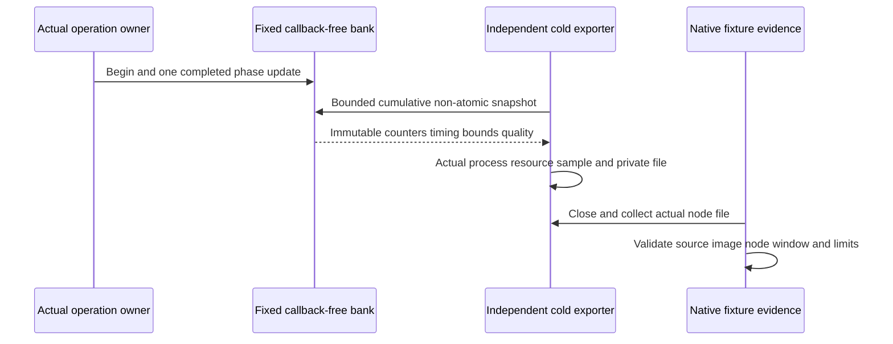

# DatabasePhaseProfiling within ResourceExecution

Status: Accepted contract; implementation and native measurements pending.
Decision [ADR-063](../../ADR/ADR-063-bounded-database-phase-profiling.md).
Working acceptance/plan: database-profiling.acceptance.md/.plan.md.
REQ-RESOURCE-003 actual preserved phase ownership → AC-DBPROF-001/003.
REQ-RESOURCE-004 bounded callback-free bank → AC-DBPROF-002/004.
REQ-RESOURCE-005 private honest node capture → AC-DBPROF-005/007.
REQ-RESOURCE-006 correctness/measured overhead → AC-DBPROF-006/008.
Existing REQ-RESOURCE-002 and REQ-MP-005 require actual native evidence.

## Canonical slice map and actors

Diagnostics owns BCL bank/schema/arithmetic at `Features/ResourceExecution/`;
Server owns private exporter/startup composition in the same slice. Existing
feature owners retain their actual source boundaries; no business behavior moves
into Diagnostics. Unit/Integration tests use ResourceExecution; frontend N/A
because this stage has no public UI or endpoint. SDK/MCP contracts are unchanged,
tested through actual RF3. Root alone owns shared project/config/docs/Git/gates.
Another app root owns benchmark/AppHost/site/CI/aggregate schemas; no write there.

## Closed phase inventory

|ID/name|Actual timing boundary; preservation|
|---|---|
|00 PublicAuthenticationDispatch|CredentialResolver actual node ExecuteRead await; exclude next middleware.|
|01 PublicOperationDispatch|CanonicalOperationGateway actual node Execute await.|
|02 AuthorizedAuthenticationBarrier|Verified Authenticate grain branch actual Coordinator barrier await.|
|03 AuthorizedOperationBarrier|Verified other read branch actual barrier await; do not merge cuts.|
|04 AuthorizedReadCapability|Verified grain capability call/result; excludes encoding.|
|05 ReadTransportReady|Read executor actual transport-ready await.|
|06 LeaderBarrierTotal|Actual leader method through apply and final leadership check.|
|07 ReadRoundsWait|Actual rounds wait to acquire/failure.|
|08 ReadRoundsHold|Successful acquire through existing release before apply.|
|09 SubmitRoundsWait|Actual submit rounds wait to acquire/failure.|
|10 SubmitRoundsHold|Acquire through existing release after apply/outcome.|
|11 HeartbeatRoundsHold|Only actual zero-wait acquire to release; rejection is Busy attempt.|
|12 QuorumFollowerAwait|Start original follower tasks through majority-loop terminal, not tail join.|
|13 RoundCommitFinalize|Actual final protocol-locked call; not always durable commit.|
|14 FollowerSynchronization|Each original sender's own completion/release, including independent tails.|
|15 ReplicaProtocolGateWait|Actual protocol wait to acquire/failure.|
|16 ReplicaProtocolGateHold|Acquire through actual release, including nested store work.|
|17 ReplicaRequestEncode|Original typed serialization and payload-cap check, before the original RPC deadline is armed.|
|18 ReplicaTransportAwait|Original invocation expression, including its UTF8 string-argument conversion under the already armed deadline, then actual active.InvokeAsync await; not isolated network time.|
|19 ReplicaReplyDecode|Existing strict UTF8 bytes and typed decode.|
|20 ReplicaDiscoveryResolve|Actual resolve including cached/gate/HTTP/verification work.|
|21 OrleansReplicaExchangeAwait|Existing Exchange plus WaitAsync WRAPPER terminal; not original-tail completion.|
|22 ReplicaReceiverTotal|Actual receiver reply/error; typed non-ack is Rejected except original token-proven OCE/fault precedence in ADR-063.|
|23 CanonicalApplyWait|Original materializer watermark wait; not CPU or gate wait.|
|24 CanonicalApplyGateWait|Existing actual worker/checkpoint/snapshot/install gate wait.|
|25 CanonicalApplyGateHold|Successful corresponding acquire through actual release; maintenance included.|
|26 CanonicalApplyBatch|Actual scheduling batch, including per-entry commits; not group commit.|
|27 ProviderReadGateWait|Actual Store.Read EnterReadLock to acquire/failure.|
|28 ProviderWriteGateWait|Actual Store.Commit EnterWriteLock to acquire/failure.|
|29 ProviderWriteGateHold|Commit acquire through original ExitWriteLock; no-change calls included.|
|30 AtomicJournalWriteFlush|Existing header/payload writes through Flush(true), inside original poison try.|
|31 NativeTreeMutation|Actual Runtime.Apply cache/value/native Sync-WAL/tree work; not isolated native fsync.|

## Acceptance, methodology and evidence

Branch-local outcome precedence is frozen in ADR-063. CallerCancelled records
an observed OCE with the actual phase-local input token cancelled; that token
may already be linked and does not prove an external SDK cancellation. No error
code, timing guess or transported origin substitutes for observed provenance.

All pass/fail conditions and criterion-to-test matrix are frozen in working
acceptance; ordered roles/paths/stages are in ADR-063. Literal primitive tests
cover fixed dimensions/boundaries, invalid/overflow inputs, successful/disabled
records, real concurrency/monotonicity, sticky quality and actual allocations.
The production-owned pure AddSaturating helper covers exact/overflow snapshot
math; source review verifies every real Capture merge applies its overflow
marker as sticky quality. Tests do not mutate live counters to force overflow.
Production joins receive independent exact-source review plus genuine SDK/MCP
RF3 authorization/minority/cancellation, original-task and process-recovery gates.
Private capture tests reject missing/partial/wrong-node/source/image/window,
oversize/default schema and degraded profiles instead of fabricating numbers.

The primitive bank, arithmetic and immutable process-mode facade are now
implemented in source with19 acceptance-derived TUnit cases. The reviewed
Replication-A/provider joins add12 actual boundaries:05,15..19 and26..31.
Their full development build and formatter pass with all analyzers enabled;
the [source receipt](../../implementation/database-phase-producer-source-r134.json)
binds the exact inputs and preservation review. This does not
establish actual phase counts, allocations or performance. Default mode remains
off. The remaining20 producers, private capture, trusted process-mode startup
and actual RF3 profile qualification remain open.

Runtime/allocations/performance qualification is GitHub TUnit/MTP only. Current
owner workflow policy uses CI/ci.yml for build and every project test, Benchmarks
for load/comparison plus downstream website qualification/publication, and Release.
Historical actual Tests-run evidence retains its original workflow identity. Full
new-source build/formatter/analyzers/governance, normal/scalar/recovery/RF3 must
pass without skips. Development checks, authored fixtures and fixed budgets are
source evidence only. Numeric coverage collection remains unconfigured.
Periodic node snapshots and resources bracket client windows; phases overlap
and can end after the initiating quorum. No summing/subtracting phases into
exclusive request latency or attributing whole-process CPU to one operation.
Repeated exact-source disabled/enabled workloads measure overhead; their numeric
budget requires actual baseline. Complete cohort/site, multi-host scale, fault/
endurance and power-loss remain independent open requirements.
