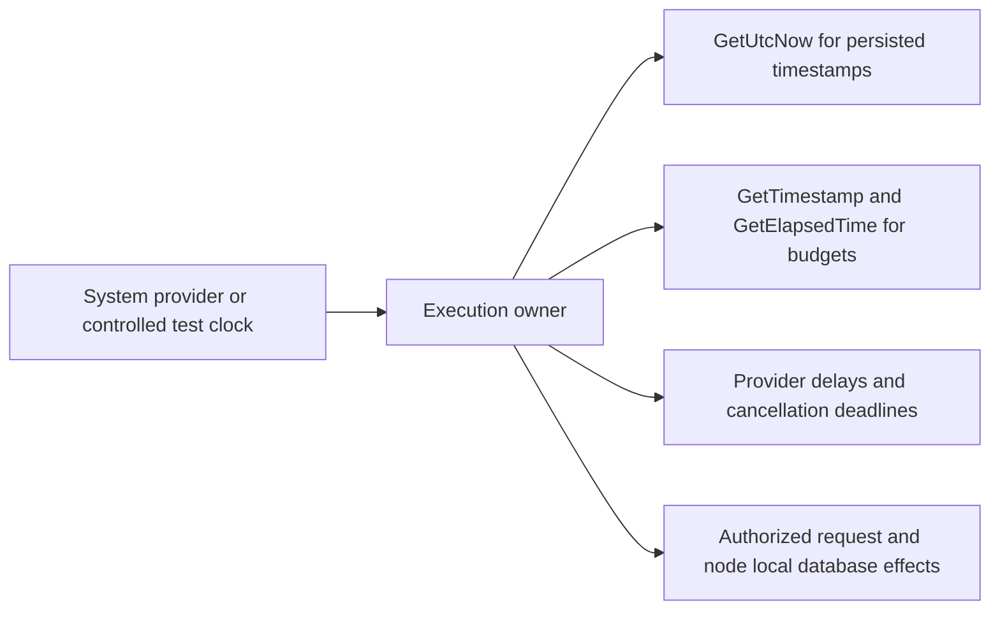

# ResourceExecution: controlled time

Status: source joined; local complete build, formatter and focused runtime tests passed. Full runtime qualification remains incomplete. Local development verification is distinct from Linux RF3 qualification.
Decision: [ADR-115](../../ADR/ADR-115-time-provider.md).

## Goal and scope

All KeyLoad-owned C# current-time reads and elapsed/deadline/timer work use native .NET `TimeProvider`. KLD0022 rejects DateTime/DateTimeOffset static clocks, native Stopwatch properties, fields, calls and creation, and Environment tick access. Use injected clocks in execution owners and select System only in constructor defaults or composition roots. Preserve UTC persisted timestamps, signed-request validity, RF3 ordering, native Orleans scheduling, monotonic budgets and actual benchmark provenance. No new packages or replacement database/transport dependencies. Provider control is explicitly authorized for tests. Runtime-host and business clocks may remain separately composed where their ownership differs.

## Requirements and acceptance

| Requirement | Acceptance | Evidence |
|---|---|---|
| REQ-TIME-001: current UTC is supplied by the execution owner's provider | AC-TIME-001: embedded JSON/native commands and due discovery observe an injected clock, including expiry/error and preserved state | real engine TUnit workflows; source inventory |
| REQ-TIME-002: elapsed work uses GetTimestamp/GetElapsedTime/TimestampFrequency | AC-TIME-002: budget expiry is deterministic and UTC changes do not replace monotonic elapsed authority | controlled-provider engine/read-cut workflows; timing source inventory |
| REQ-TIME-003: delays, deadline sources and managed timers use the owning provider | AC-TIME-003: cancellation, linked tokens, disposal and cleanup survive migration; native Orleans-owned timers retain native scheduling | source/call-site audit; Aspire unit/recovery/RF3 suites |
| REQ-TIME-004: direct clocks cannot re-enter runtime code | AC-TIME-004: KLD0022 rejects DateTime clocks, Environment ticks and Stopwatch timing while allowing native providers and unrelated symbols | real Roslyn analyzer workflows and exact spans |
| REQ-TIME-005: timing remains measurable and composition is explicit | AC-TIME-005: benchmark clocks preserve monotonic units and original measurements; diagnostics use matching provider frequency; defaults remain System | consumer build, source audit, existing benchmark protocol tests; performance claims require separate GitHub evidence |

## Ordered execution and ownership

1. TASK-TIME-001 (lead): record policy, contract and baseline solution build; preserve unrelated changes.
2. TASK-TIME-002 (engine worker): Core, Query, ZoneTree storage and Artifacts provider plumbing. Relevant existing tests and complete clock-controlled flows; report caller signature joins to lead.
3. TASK-TIME-003 (runtime worker): Server, Orleans and Replication provider injection and native timeout disposal. Preserve identity, native scheduler and RF3 acknowledgement contracts.
4. TASK-TIME-004 (timing worker): AppHost, Diagnostics and benchmarks use provider timestamps, frequency, delays and cleanup. No unrelated benchmark repairs or configuration changes.
5. TASK-TIME-005 (lead): analyzer enforcement, shared TestDatabase controlled clock, deterministic engine regressions, remaining test timing migration and all caller integration. Workers have disjoint production scopes; tests owned by lead except new worker-specific files explicitly reported before editing. All workers read their local AGENTS first; shared docs/config belong to lead.
6. TASK-TIME-006 (lead): inspect all diffs; scoped canonical formatting; solution Release build; Aspire analyzers/unit/recovery/RF3 suites; governance/diff checks. Collect available functional coverage through AppHost; unavailable coverage/CRAP remains unmeasured. Preserve every failure and qualification gate.

Validation skills in order: quality-ci (check native gates), analyzer-config (existing severity), format (canonical dotnet format), csharpier (N/A: dotnet format owner), code-analysis (Release analyzers), roslynator/meziantou/stylecop (review current package ownership; no new packages), complexity (existing source-owned limits plus changed-code review), crap-score (actual source-bound coverage only). Baseline and final outcomes will be recorded here after checks. A failed build is not completion. No worker commits; lead checkpoints only coherent scope without unrelated work.

## Development evidence, 2026-10-06

The [development receipt](../../implementation/time-provider-development-2026-10-06.json) records actual commands, native report hashes and unresolved gates. The complete Aspire-owned analyzer suite passed 388/388 tests, including readonly Stopwatch fields and the controlled migration deadline. The final complete Release solution build passed with zero warnings/errors, and the canonical formatter passed after the storage-policy clock fixture edit. Eight new controlled-time operation cases, three existing read-budget cases and six storage-policy cases passed through Aspire. A duplicate whole-unit attempt was gracefully stopped while another shared whole-unit run remained active; its shutdown exit zero is not a test pass. The full unit gate still has startup, CLI/process and source-inventory failures without a completed passing report. Process recovery stops during prior-source preparation. The local RF3 suite failed (16 passed, 142 failed) on cluster-profile reparse paths and unavailable prior-server proof. These are local macOS development observations, with no Linux qualification, coverage, CRAP or performance claim.

Passing real-operation workflows: `TimeProviderOperationTests` (5 cases: JSON/native command timestamp and retry, query/due-work expiry, UTC versus monotonic budget), `NativeReadCutClockTests` (1 case: real snapshot expiry, released slot and preserved bytes), `DueWaitControlledClockTests` (2 cases: real apply waiter fallback/cancellation and joined timers), `ReadExecutionTests` (3 existing cases), and `ZoneTreeStorageExecutionOptionsTests` (6 cases, including deterministic record-budget assertions under an unchanged one-second elapsed policy). Full unit/scalar and recovery/RF3 gates remain required. A native `/private/tmp` directory avoids the macOS system-temp alias without weakening filesystem guards. The controlled timer supports these single-threaded one-shot workflows; it is not qualified as a general concurrent or periodic timer implementation. Framework-native synchronous process/thread waits without a provider overload remain bounded OS observations; managed delays and timed task waits use provider overloads.

