# Search

Owner decision2026-10-03 selects ZoneTree.FullTextSearch as the full-text provider
under [ADR-071](../ADR/ADR-071-canonical-zonetree-providers.md) and the remaining
projection/freshness boundaries of [ADR-009](../ADR/ADR-009-search-provider-boundaries.md).
REQ-SQLC-010 / AC-SQLC-010 maps TASK-SQLC-R4 source review to
[the pinned candidate findings and real test gates](../implementation/zonetree-fulltextsearch-review.md).
Research is complete; provider selection is fixed, while integration and native
performance qualification are pending.
Freeze canonical-commit/index-generation freshness, tokenizer/hash/rank parity,
nonpartial cancellation, authorization/read cuts, rebuild/rollback and resource
bounds before implementation. The first native candidate-generation contract is
now frozen in [ADR-078](../ADR/ADR-078-native-full-text-projection.md) and
[NativeFullTextProjection](Search/NativeFullTextProjection.md); source and runtime
qualification are pending. The provider's query language does not replace SQL.

| Requirement | Acceptance | Mapping |
|---|---|---|
| REQ-ZT-003: actual selected full-text provider is a bounded derived projection | AC-ZT-003: centrally pinned published/source-bound ZoneTree.FullTextSearch, authorized exact token/identity/rank oracle, nonpartial cancellation and real replay/rebuild/swap/RF3 tests pass; stale/corrupt generations cannot return success | TASK-ZT-FTS-CONTRACT then Search provider tests, process recovery and SDK/official MCP RF3; pending |

Status: Accepted resource repair contract; implementation and CI qualification pending.
Decision: [ADR-035](../ADR/ADR-035-memory-performance.md), TASK-MP-006B.
Scope: exact persisted-policy text/vector/hybrid reads under one committed apply cut.
Public request/response JSON, BM25 tokenization and reciprocal-rank fusion remain identical.

| Requirement | Acceptance / pass and fail condition | Test and evidence |
|---|---|---|
| REQ-SR-001 | AC-MP-004: every visible corpus document still affects BM25 count/average/term frequency, including missing fields; ranks, ordinal ID ties, normalization and query-term accumulation are exact | Real-store Unicode/repeated/missing/nonmatching corpus and golden score/rank cases; GitHub TUnit |
| REQ-SR-002 | AC-MP-004: vector candidates obey space/revision/row/field authorization; query finite/dimension/metric validation occurs once; selected SIMD/scalar metric preserves accumulation | Real-store stale/hidden/mismatched-space cases plus finite/zero/large-vector metric golden cases |
| REQ-SR-003 | AC-MP-003/004: scans consume scoped borrowed records; retained rank state contains identity/statistics/scores rather than full corpus JSON/vector arrays | Real large-payload rank cases, bounded read failures and allocation/resource artifacts |
| REQ-SR-004 | AC-MP-004/005: branch ranks and text-then-vector RRF accumulation are unchanged; select at most Limit results before decoding/projecting final payloads and account actual final point reads | Exact text/vector/hybrid ranks, ties/weights, shared-budget and output boundary cases |
| REQ-SR-005 | AC-MP-004/012: cancellation/work/result exhaustion leaves the committed position unchanged and a following call succeeds; no unbounded gate/iterator lifetime | Real persisted-policy cancellation/overflow/healthy-following-call tests; RF3 SDK/MCP integration |
| REQ-SR-006 | AC-MP-003/004/011/012: all analytical engines on one DatabaseEngine obey one positive MaxConcurrentQueries ceiling; saturated/cancelled calls cannot perform ranking or storage work | TASK-MP-006C real-store mixed-entry admission/release cases in UnitTests/Features/ResourceExecution; exact GitHub qualification |

```mermaid
flowchart LR
    Caller --> Validate[Validate and prepare query]
    Validate --> Cut[Authorize within one read cut]
    Cut --> Corpus[Visit visible corpus records]
    Corpus --> Metadata[Keep bounded identity and rank statistics]
    Metadata --> Fusion[Exact branch ranks and fusion]
    Fusion --> Top[Select requested top results]
    Top --> Project[Budgeted selected point reads and projection]
    Project --> Output[Measure complete response]
```

Lead owns `Core/Features/DocumentStorage/DocumentStorageKeys.cs`,
`Core/Features/DocumentStorage/VisibleDocumentReads.cs`,
`Core/Features/Search/VisibleVectorReads.cs` and existing Core read-helper joins.
Both visitor methods use the existing read view and one ReadExecutionBudget; they
decode a single record, check persisted row visibility and invoke an owned-record
callback without accumulating a full page. Vector visits charge each referenced
document and reject stale/deleted/hidden candidates as before. Existing public
array-returning read helpers consume the same visitor algorithm for their distinct
owned-result contracts. No callback may mutate the read transaction or escape the cut.

TASK-MP-006B owns `Query/SearchEngine.cs`, new `Query/Features/Search/` helpers and
new `UnitTests/Features/Search/` tests. It may update only the shared-budget numeric
calculation in `ReadExecutionTests.TextAndVectorBranchesShareOneReadByteBudget`
to include the real selected-document reads; all assertions and existing cases stay.
Other test/contract/server/CI/docs files belong to the lead or their existing owner.

Text ranking retains lengths and query-term counts plus identities only for
matching records; all visible documents still contribute corpus statistics.
Compile the text JSON pointer once. Vector ranking retains identities and scores;
prepare the query's finite validation and cosine norm once, compute only the chosen
metric, and preserve the existing Vector.Widen/Vector.Dot/scalar reduction grouping.
Exact hybrid fusion requires bounded metadata for every ranked candidate; dropping
branches to Limit before fusion is forbidden. A bounded top-result heap then
selects final payloads. Final selected point reads trade at most Limit extra reads
for removing full-corpus payload retention, remain inside the same read cut, and
consume the shared raw-byte budget. They are never free or described as eliminated.
`DocumentStorageKeys.RecordKey` and `Prefix` supply canonical document keys to
both visitors and selected reloads; their stored bytes remain identical.

Positive, negative, edge and error coverage includes missing/empty text, Unicode,
repeated terms, differing corpus lengths, same-score IDs, zero vectors, nonfinite
values, dimension/space mismatch, stale revision, hidden/redacted fields, exact and
excess byte/output/work budgets, cancellation and recovery of subsequent reads.
Tests use real ZoneTree and persisted policy, never fakes. GitHub Actions owns all
test/load execution. Build/formatter checks are development/static evidence only.
UI/data migration are N/A because stored format and wire shape do not change;
RF3/MCP public integration and measured server memory remain required join gates.

## Portable SIMD validation qualification

On 2026-10-02 the owner explicitly mapped the earlier SMID wording to SIMD and
directed .NET intrinsics first, Rust only after profiling. The existing Accepted
ADR-035 TASK-MP-006D validation stage is now executed under
[AC-SIMD-001–004](Search.md) and its
[protected-source/CI task graph](Search.md). Unchanged c486
run37060131271 has all five first-authored public/real-ZoneTree metric regressions
passing on every OS (normal units871/871 each), and RF3 SDK/MCP46/46. Root independently
verified all native report byte/source/count identities in
[the exact receipt](../implementation/runtime-qualification-37060131271.json).
The run still fails Windows recovery and native comparison completion; it is not
full product qualification. Full-block finite validation uses portable .NET JIT
intrinsics; metric Vector.Widen/Vector.Dot/scalar grouping stays unchanged. Same-SHA
normal and hardware-disabled full unit invocations retain separate native reports.
Speed, allocations/RSS, numeric coverage and broad endurance/fault completion remain
open until actual matching GitHub evidence exists.

TASK-RUNTIME-SEARCH-BYTES-W3 preserves REQ-SR-001 / AC-MP-003/011/012 after
Ubuntu run37021991878 atfa80c701 reports1048511 rather than1048576 added stored
bytes. The fixture compares complete DocumentRecord encodings, including65
UpdatedAt values, while its two batches currently sample independent command
times. Native System.Text.Json trims fractional-second zeros; the65-byte delta
fits a one-byte timestamp-width difference, but CI contains no timestamps proving
that exact cause. Capture one actual UTC time after configuration and use it for
both separate batches with distinct matching inner/outer command IDs. Equality
is permitted by the existing persisted command-clock contract. Assert actual
stored times match that captured value before measurement, retain the exact
1MiB stored-byte difference and every allocation/result/score assertion. No
synthetic clock, tolerance, changed grouping or byte counter is accepted. The
worker owns only SearchResourceTests.cs; the lead reviews metadata and timing
boundaries, builds and obtains renewed exact multi-OS GitHub proof. ADR035 owns
source-only rollback; production/API/data migration is N/A for this fixture repair.

TASK-MP-006D, REQ-SR-002 and AC-SEARCH-001 expand the metric edge proof before
optimizing finite-value validation. Public `SearchEngine.Similarity` cases and
real-store search cases live in NEW
`tests/KeyLoad.UnitTests/Features/Search/VectorMetricValidationTests.cs` and
`VectorMetricGoldenTests.cs`. The test worker owns only these files; the lead
alone owns any `PreparedSimilarity.Validate` implementation, CI, docs and join.

Pass requires exact error codes/details for query and candidate NaN/+Infinity/
-Infinity at every full-block lane and scalar-tail position; empty, 4097 and
mismatched dimensions; query-validation-before-invalid-metric precedence. Finite
lengths 1, runtime vector width, width+1, two widths+1 and 4096 preserve selected
metric goldens, finite extremes and zero-vector handling. Normal and
`DOTNET_EnableHWIntrinsic=0` GitHub invocations must both qualify the same source;
the public scoring oracle and real-store outcomes must agree. No private test
provider or mock is introduced.

Only full finite-validation blocks may use portable `Vector.Abs` and strict
`Vector.LessThanAll(..., +Infinity)`; the length check, scalar `float.IsFinite`
tail, query/candidate error order and all metric reductions remain identical.
Existing tests and full RF3/SDK/MCP gates remain required. ADR-035 records ordered
baseline/implementation/fallback stages. This internal compatible optimization has
no data/wire migration; rollback restores the validation loop. Numeric performance
budgets and improved throughput/allocation claims still require TASK-MP-011B's
matched actual server receipts.

## Повний пошуковий контракт

Актори: authorized text/vector/hybrid caller та майбутній index-generation worker. Entry points: [SearchRequest](../../src/KeyLoad.Abstractions/Queries.cs), [SearchEngine](../../src/KeyLoad.Query/SearchEngine.cs), [canonical vectors](../../src/KeyLoad.Core/GraphAndSeries.cs), [.NET SDK](../../src/KeyLoad.Client/KeyLoadClient.cs) і [HTTP search](../../src/KeyLoad.Server/ApiEndpoints.cs). Source-present request-time lexical scoring, exact vector scoring і weighted rank fusion відрізняються від майбутніх provider-backed indexes.

| Вимога | Acceptance / flows | Test mapping |
|---|---|---|
| REQ-SEARCH-001: canonical vector space/revision/dimensions/metric мають exact semantics | AC-SEARCH-001: valid vector search збігається з exact metric oracle; nonfinite/malformed/dimension/space mismatch відхиляється; stale/deleted vector не входить у result; finite large/zero values мають declared handling | Existing `HybridFusionRanksEligibleDocumentsAndInvalidatesStaleVectors`, `LargeFiniteVectorsAndSampleValuesRemainValidAndSimilarityDoesNotOverflow` у [GraphAndSearchTests](../../tests/KeyLoad.UnitTests/GraphAndSearchTests.cs); metric edge expansion PLANNED |
| REQ-SEARCH-002: lexical/hybrid branches мають deterministic scoring, weights та ties | AC-SEARCH-002: empty/missing/repeated/Unicode terms і same-score IDs зберігають current lexical/fusion algorithm; corpus statistics і branch-rank windows не silently обрізані перед exact fusion | Existing hybrid test та REQ-SR-001/004 golden cases; full golden/multi-branch quality corpus PLANNED under [ADR-018](../ADR/ADR-018-global-rank-fusion.md) |
| REQ-SEARCH-003: усі branches використовують один authorized current cut | AC-SEARCH-003: hidden rows/vertices/protected field-use заборонені; payload/metadata не містить omitted PII; invalid/revoked grants відхиляються до unsafe scoring; selected point reads залишаються в тому самому cut | Existing [SecurityAndQueryTests](../../tests/KeyLoad.UnitTests/SecurityAndQueryTests.cs), GraphAndSearchTests; real SDK/MCP search adversarial expansion PLANNED |
| REQ-SEARCH-004: work/cancellation/results і freshness semantics явні | AC-SEARCH-004: exact bounds зберігають result, excess budget/cancellation дає typed failure з healthy following call; source revision перевірена; derived watermark/generation не advertised до реалізації | Existing [ReadExecutionTests](../../tests/KeyLoad.UnitTests/Features/ResourceExecution/ReadExecutionTests.cs) `TextAndVectorBranchesShareOneReadByteBudget`, `SearchAndGraphResultBudgetsIncludeProtocolMetadata`; REQ-SR-003/005 і AC-MP preserved |
| REQ-SEARCH-005: provider/index lifecycle не змінює canonical authority | AC-SEARCH-005: PLANNED provider audit/rebuild/generation-swap/recovery tests доводять declared tokenizer/BM25 statistics/privacy/freshness; missing/incompatible projection дає declared fallback/error, не silently weaker result | PLANNED KL-028/029/031/039/067/097 suites; [ADR-009](../ADR/ADR-009-search-provider-boundaries.md), [ChangeFeeds](ChangeFeeds.md) |
| REQ-SEARCH-006: ANN/global ranking/graph retrieval проходять окремі correctness-quality-resource gates | AC-SEARCH-006: PLANNED exact oracle і quality corpus перевіряють recall, ties, filter/row scope, global candidate completeness, versioned rank and recovery; unavailable capability explicit unsupported | PLANNED KL-030/032/055–060/074, [ADR-018](../ADR/ADR-018-global-rank-fusion.md), [ADR-019](../ADR/ADR-019-managed-ann.md); перший bounded managed HNSW candidate прийнято в [ManagedAnn](Search/ManagedAnn.md), реалізація/quality/lifecycle/public qualification очікують |

Target map: Abstractions/Core/Query/Client/Server/tests `Features/Search/`; shared adapters — ClientApi, provider/codec/host integration — один lead. Frontend N/A, окремий UI не запитано. PII lineage — [ADR-015](../ADR/ADR-015-sensitive-data-lineage.md), budgets/security — [ADR-010](../ADR/ADR-010-query-budgets-security.md). Existing flat SearchEngine та mixed GraphAndSeries лишаються ADR-032 migration debt; new ownership не робить legacy layout compliant.

Усі current test methods — source coverage, не passing run. Provider-backed BM25, qualified managed ANN, online generation swap, full freshness barriers, graph-scoped/global distributed retrieval залишаються planned/in-progress; proposed choices не реалізуються до contract acceptance. Product qualification тільки exact GitHub real TUnit/recovery/Docker RF3 SDK/MCP та actual JSON benchmarks, без invented speed/quality numbers.

Accepted 2026-10-04 [ManagedAnn R1](Search/ManagedAnn.md) implements an independently authored first-party packed managed HNSW candidate with explicit pre-allocation memory/work/scratch admission and independent real-store recall/metric/filter tests. No external ANN package or public approximate search is enabled by that contract. Online native ZoneTree projection/replay and versioned SQL/SDK/MCP completeness/freshness are separate R2/R3 contracts and remain pending.
