# Search

The accepted concurrent delivery contracts are
[FilteredRetrieval](Search/FilteredRetrieval.md),
[GraphRetrieval](Search/GraphRetrieval.md) and
[EventProjectionLineage](Search/EventProjectionLineage.md). Their source stages
retain this feature's original runtime, authorization, SQL and RF3 acceptance.

Owner decision2026-10-03 selects ZoneTree.FullTextSearch as the full-text provider
under [ADR-071](../ADR/ADR-071-canonical-zonetree-providers.md) and the remaining
projection/freshness boundaries of [ADR-009](../ADR/ADR-009-search-provider-boundaries.md).
REQ-SQLC-010 / AC-SQLC-010 maps TASK-SQLC-R4 source review to
[the pinned candidate findings and real test gates](../implementation/zonetree-fulltextsearch-review.md).
Research is complete; provider selection is fixed, while integration and native
performance qualification are pending.
Freeze canonical-commit/index-generation freshness, tokenizer/hash/rank parity,
nonpartial cancellation, authorization/read cuts, rebuild/rollback and resource
bounds before implementation. The first native candidate-generation contract is
now frozen in [ADR-078](../ADR/ADR-078-native-full-text-projection.md) and
[NativeFullTextProjection](Search/NativeFullTextProjection.md); source and runtime
qualification are pending. The provider's query language does not replace SQL.

| Requirement | Acceptance | Mapping |
|---|---|---|
| REQ-ZT-003: actual selected full-text provider is a bounded derived projection | AC-ZT-003: centrally pinned published/source-bound ZoneTree.FullTextSearch, authorized exact token/identity/rank oracle, nonpartial cancellation and real replay/rebuild/swap/RF3 tests pass; stale/corrupt generations cannot return success | TASK-ZT-FTS-CONTRACT then Search provider tests, process recovery and SDK/official MCP RF3; pending |

Status: Accepted resource repair contract; implementation and CI qualification pending.
Decision: [ADR-035](../ADR/ADR-035-memory-performance.md), TASK-MP-006B.
Scope: exact persisted-policy text/vector/hybrid reads under one committed apply cut.
Public request/response JSON, BM25 tokenization and reciprocal-rank fusion remain identical.

| Requirement | Acceptance / pass and fail condition | Test and evidence |
|---|---|---|
| REQ-SR-001 | AC-MP-004: every visible corpus document still affects BM25 count/average/term frequency, including missing fields; ranks, ordinal ID ties, normalization and query-term accumulation are exact | Real-store Unicode/repeated/missing/nonmatching corpus and golden score/rank cases; GitHub TUnit |
| REQ-SR-002 | AC-MP-004: vector candidates obey space/revision/row/field authorization; query finite/dimension/metric validation occurs once; selected SIMD/scalar metric preserves accumulation | Real-store stale/hidden/mismatched-space cases plus finite/zero/large-vector metric golden cases |
| REQ-SR-003 | AC-MP-003/004: scans consume scoped borrowed records; retained rank state contains identity/statistics/scores rather than full corpus JSON/vector arrays | Real large-payload rank cases, bounded read failures and allocation/resource artifacts |
| REQ-SR-004 | AC-MP-004/005: branch ranks and text-then-vector RRF accumulation are unchanged; select at most Limit results before decoding/projecting final payloads and account actual final point reads | Exact text/vector/hybrid ranks, ties/weights, shared-budget and output boundary cases |
| REQ-SR-005 | AC-MP-004/012: cancellation/work/result exhaustion leaves the committed position unchanged and a following call succeeds; no unbounded gate/iterator lifetime | Real persisted-policy cancellation/overflow/healthy-following-call tests; RF3 SDK/MCP integration |
| REQ-SR-006 | AC-MP-003/004/011/012: all analytical engines on one DatabaseEngine obey one positive MaxConcurrentQueries ceiling; saturated/cancelled calls cannot perform ranking or storage work | TASK-MP-006C real-store mixed-entry admission/release cases in UnitTests/Features/ResourceExecution; exact GitHub qualification |

```mermaid
flowchart LR
    Caller --> Validate[Validate and prepare query]
    Validate --> Cut[Authorize within one read cut]
    Cut --> Corpus[Visit visible corpus records]
    Corpus --> Metadata[Keep bounded identity and rank statistics]
    Metadata --> Fusion[Exact branch ranks and fusion]
    Fusion --> Top[Select requested top results]
    Top --> Project[Budgeted selected point reads and projection]
    Project --> Output[Measure complete response]
```

Lead owns `Core/Features/DocumentStorage/DocumentStorageKeys.cs`,
`Core/Features/DocumentStorage/VisibleDocumentReads.cs`,
`Core/Features/Search/VisibleVectorReads.cs` and existing Core read-helper joins.
Both visitor methods use the existing read view and one ReadExecutionBudget; they
decode a single record, check persisted row visibility and invoke an owned-record
callback without accumulating a full page. Vector visits charge each referenced
document and reject stale/deleted/hidden candidates as before. Existing public
array-returning read helpers consume the same visitor algorithm for their distinct
owned-result contracts. No callback may mutate the read transaction or escape the cut.

TASK-MP-006B owns `Query/SearchEngine.cs`, new `Query/Features/Search/` helpers and
new `UnitTests/Features/Search/` tests. It may update only the shared-budget numeric
calculation in `ReadExecutionTests.TextAndVectorBranchesShareOneReadByteBudget`
to include the real selected-document reads; all assertions and existing cases stay.
Other test/contract/server/CI/docs files belong to the lead or their existing owner.

Text ranking retains lengths and query-term counts plus identities only for
matching records; all visible documents still contribute corpus statistics.
Compile the text JSON pointer once. Vector ranking retains identities and scores;
prepare the query's finite validation and cosine norm once, compute only the chosen
metric, and preserve the existing Vector.Widen/Vector.Dot/scalar reduction grouping.
Exact hybrid fusion requires bounded metadata for every ranked candidate; dropping
branches to Limit before fusion is forbidden. A bounded top-result heap then
selects final payloads. Final selected point reads trade at most Limit extra reads
for removing full-corpus payload retention, remain inside the same read cut, and
consume the shared raw-byte budget. They are never free or described as eliminated.
`DocumentStorageKeys.RecordKey` and `Prefix` supply canonical document keys to
both visitors and selected reloads; their stored bytes remain identical.

Positive, negative, edge and error coverage includes missing/empty text, Unicode,
repeated terms, differing corpus lengths, same-score IDs, zero vectors, nonfinite
values, dimension/space mismatch, stale revision, hidden/redacted fields, exact and
excess byte/output/work budgets, cancellation and recovery of subsequent reads.
Tests use real ZoneTree and persisted policy, never fakes. GitHub Actions owns all
test/load execution. Build/formatter checks are development/static evidence only.
UI/data migration are N/A because stored format and wire shape do not change;
RF3/MCP public integration and measured server memory remain required join gates.

## Portable SIMD validation qualification

On 2026-10-02 the owner explicitly mapped the earlier SMID wording to SIMD and
directed .NET intrinsics first, Rust only after profiling. The existing Accepted
ADR-035 TASK-MP-006D validation stage is now executed under
[AC-SIMD-001–004](Search.md) and its
[protected-source/CI task graph](Search.md). Unchanged c486
run37060131271 has all five first-authored public/real-ZoneTree metric regressions
passing on every OS (normal units871/871 each), and RF3 SDK/MCP46/46. Root independently
verified all native report byte/source/count identities in
[the exact receipt](https://github.com/managedcode/KeyLoad/actions/runs/37060131271).
The run still fails Windows recovery and native comparison completion; it is not
full product qualification. Full-block finite validation uses portable .NET JIT
intrinsics; metric Vector.Widen/Vector.Dot/scalar grouping stays unchanged. Same-SHA
normal and hardware-disabled full unit invocations retain separate native reports.
Speed, allocations/RSS, numeric coverage and broad endurance/fault completion remain
open until actual matching GitHub evidence exists.

TASK-RUNTIME-SEARCH-BYTES-W3 preserves REQ-SR-001 / AC-MP-003/011/012 after
Ubuntu run37021991878 atfa80c701 reports1048511 rather than1048576 added stored
bytes. The fixture compares complete DocumentRecord encodings, including65
UpdatedAt values, while its two batches currently sample independent command
times. Native System.Text.Json trims fractional-second zeros; the65-byte delta
fits a one-byte timestamp-width difference, but CI contains no timestamps proving
that exact cause. Capture one actual UTC time after configuration and use it for
both separate batches with distinct matching inner/outer command IDs. Equality
is permitted by the existing persisted command-clock contract. Assert actual
stored times match that captured value before measurement, retain the exact
1MiB stored-byte difference and every allocation/result/score assertion. No
synthetic clock, tolerance, changed grouping or byte counter is accepted. The
worker owns only SearchResourceTests.cs; the lead reviews metadata and timing
boundaries, builds and obtains renewed exact multi-OS GitHub proof. ADR035 owns
source-only rollback; production/API/data migration is N/A for this fixture repair.

TASK-MP-006D, REQ-SR-002 and AC-SEARCH-001 expand the metric edge proof before
optimizing finite-value validation. Public `SearchEngine.Similarity` cases and
real-store search cases live in NEW
`tests/KeyLoad.UnitTests/Features/Search/Cases/VectorMetricValidationTests.cs` and
`VectorMetricGoldenTests.cs`. The test worker owns only these files; the lead
alone owns any `PreparedSimilarity.Validate` implementation, CI, docs and join.

Pass requires exact error codes/details for query and candidate NaN/+Infinity/
-Infinity at every full-block lane and scalar-tail position; empty, 4097 and
mismatched dimensions; query-validation-before-invalid-metric precedence. Finite
lengths 1, runtime vector width, width+1, two widths+1 and 4096 preserve selected
metric goldens, finite extremes and zero-vector handling. Normal and
`DOTNET_EnableHWIntrinsic=0` GitHub invocations must both qualify the same source;
the public scoring oracle and real-store outcomes must agree. No private test
provider or mock is introduced.

Only full finite-validation blocks may use portable `Vector.Abs` and strict
`Vector.LessThanAll(..., +Infinity)`; the length check, scalar `float.IsFinite`
tail, query/candidate error order and all metric reductions remain identical.
Existing tests and full RF3/SDK/MCP gates remain required. ADR-035 records ordered
baseline/implementation/fallback stages. This internal compatible optimization has
no data/wire migration; rollback restores the validation loop. Numeric performance
budgets and improved throughput/allocation claims still require TASK-MP-011B's
matched actual server receipts.

## Повний пошуковий контракт

Актори: authorized text/vector/hybrid caller та майбутній index-generation worker. Entry points: [SearchRequest](../../src/KeyLoad.Abstractions/Queries.cs), [SearchEngine](../../src/KeyLoad.Query/Features/Search/Queries/SearchEngine.cs), [canonical vectors](../../src/KeyLoad.Core/GraphAndSeries.cs), [.NET SDK](../../src/KeyLoad.Client/KeyLoadClient.cs) і [HTTP search](../../src/KeyLoad.Server/ApiEndpoints.cs). Source-present request-time lexical scoring, exact vector scoring і weighted rank fusion відрізняються від майбутніх provider-backed indexes.

| Вимога | Acceptance / flows | Test mapping |
|---|---|---|
| REQ-SEARCH-001: canonical vector space/revision/dimensions/metric мають exact semantics | AC-SEARCH-001: valid vector search збігається з exact metric oracle; nonfinite/malformed/dimension/space mismatch відхиляється; stale/deleted vector не входить у result; finite large/zero values мають declared handling | Existing `HybridFusionRanksEligibleDocumentsAndInvalidatesStaleVectors`, `LargeFiniteVectorsAndSampleValuesRemainValidAndSimilarityDoesNotOverflow` у [GraphAndSearchTests](../../tests/KeyLoad.UnitTests/GraphAndSearchTests.cs); metric edge expansion PLANNED |
| REQ-SEARCH-002: lexical/hybrid branches мають deterministic scoring, weights та ties | AC-SEARCH-002: empty/missing/repeated/Unicode terms і same-score IDs зберігають current lexical/fusion algorithm; corpus statistics і branch-rank windows не silently обрізані перед exact fusion | Existing hybrid test та REQ-SR-001/004 golden cases; full golden/multi-branch quality corpus PLANNED under [ADR-018](../ADR/ADR-018-global-rank-fusion.md) |
| REQ-SEARCH-003: усі branches використовують один authorized current cut | AC-SEARCH-003: hidden rows/vertices/protected field-use заборонені; payload/metadata не містить omitted PII; invalid/revoked grants відхиляються до unsafe scoring; selected point reads залишаються в тому самому cut | Existing [SecurityAndQueryTests](../../tests/KeyLoad.UnitTests/SecurityAndQueryTests.cs), GraphAndSearchTests; real SDK/MCP search adversarial expansion PLANNED |
| REQ-SEARCH-004: work/cancellation/results і freshness semantics явні | AC-SEARCH-004: exact bounds зберігають result, excess budget/cancellation дає typed failure з healthy following call; source revision перевірена; derived watermark/generation не advertised до реалізації | Existing [ReadExecutionTests](../../tests/KeyLoad.UnitTests/Features/ResourceExecution/Cases/ReadExecutionTests.cs) `TextAndVectorBranchesShareOneReadByteBudget`, `SearchAndGraphResultBudgetsIncludeProtocolMetadata`; REQ-SR-003/005 і AC-MP preserved |
| REQ-SEARCH-005: provider/index lifecycle не змінює canonical authority | AC-SEARCH-005: PLANNED provider audit/rebuild/generation-swap/recovery tests доводять declared tokenizer/BM25 statistics/privacy/freshness; missing/incompatible projection дає declared fallback/error, не silently weaker result | PLANNED KL-028/029/031/039/067/097 suites; [ADR-009](../ADR/ADR-009-search-provider-boundaries.md), [ChangeFeeds](ChangeFeeds.md) |
| REQ-SEARCH-006: ANN/global ranking/graph retrieval проходять окремі correctness-quality-resource gates | AC-SEARCH-006: PLANNED exact oracle і quality corpus перевіряють recall, ties, filter/row scope, global candidate completeness, versioned rank and recovery; unavailable capability explicit unsupported | PLANNED KL-030/032/055–060/074, [ADR-018](../ADR/ADR-018-global-rank-fusion.md), [ADR-019](../ADR/ADR-019-managed-ann.md); перший bounded managed HNSW candidate прийнято в [ManagedAnn](Search/ManagedAnn.md), реалізація/quality/lifecycle/public qualification очікують |

Target map: Abstractions/Core/Query/Client/Server/tests `Features/Search/`; shared adapters — ClientApi, provider/codec/host integration — один lead. Frontend N/A, окремий UI не запитано. PII lineage — [ADR-015](../ADR/ADR-015-sensitive-data-lineage.md), budgets/security — [ADR-010](../ADR/ADR-010-query-budgets-security.md). Existing flat SearchEngine та mixed GraphAndSeries лишаються ADR-032 migration debt; new ownership не робить legacy layout compliant.

Усі current test methods — source coverage, не passing run. Provider-backed BM25, qualified managed ANN, online generation swap, full freshness barriers, graph-scoped/global distributed retrieval залишаються planned/in-progress; proposed choices не реалізуються до contract acceptance. Product qualification тільки exact GitHub real TUnit/recovery/Docker RF3 SDK/MCP та actual JSON benchmarks, без invented speed/quality numbers.

Accepted 2026-10-04 [ManagedAnn R1](Search/ManagedAnn.md) implements an independently authored first-party packed managed HNSW candidate with explicit pre-allocation memory/work/scratch admission and independent real-store recall/metric/filter tests. No external ANN package or public approximate search is enabled by that contract. Online native ZoneTree projection/replay and versioned SQL/SDK/MCP completeness/freshness are separate R2/R3 contracts and remain pending.

Accepted R2A [ManagedAnnSeed](Search/ManagedAnnSeed.md), REQ/AC-ASD-001–006, implements a bounded Core/Search input seam: persisted minimum-grant authority, owned visible vectors and scalar source/applied/outbox metadata in one read cut, then charged ordinal sorting and exact-bit hashing outside the gate. Local actual Aspire normal/scalar development regressions passed 34/34 each after full Release/formatter/governance checks; their original reports and unchanged source/runtime inventories are recorded in the linked spec. It is a historical computational seed and does not complete the persistent projection, current-public-authorization, replay, recovery or delivered-source Linux/RF3 gates.

## TASK-SEARCH-QUALITY-CORPUS: controlled relevance and window sensitivity

Root freezes this first KL-074 implementation stage on2026-10-05 before delegated
writes. REQ-SEARCH-007 / AC-SEARCH-007 add a controlled first-party quality oracle
under [ADR-018](../ADR/ADR-018-global-rank-fusion.md). Its corpus is32 literal
documents, fixed four-dimensional vectors and six literal query definitions,
including English, Ukrainian, repeated and missing text, graph-only discovery,
selective allowed IDs and an empty allowed set. Query definitions and relevance
grades0..3 are authored before execution and must not derive from observed ranks.
Persisted grants and independently declared eligible IDs define each query's
eligible set; complete branch output is an observation, not its own eligibility
oracle. Relevance judgments identify the controlled fixture, with no claim of an
external evaluation dataset or production relevance target.

Pass requires real node-local ZoneTree documents, vectors, graph edges and
persisted authorization. Use the actual SearchEngine.GraphSearchAsync, current
BM25 TextRanker, exact-vector branch, graph retriever and native
ZoneTree.FullTextSearch projection. Native/scalar lexical parity preserves IDs,
scores and stable order. Capture complete branches with limit32 only after
seeding; all observations must retain the same committed position and authority.
Verify complete candidate IDs against the independent eligible-set declarations,
unchanged current generation, deterministic repeated order, and omission of
ineligible IDs. Empty selection returns no candidates; missing branches contribute
nothing. Existing cancellation, budget and authorization tests remain required.

The independent metric helper computes Recall@5/10, MRR@10 and graded nDCG@5/10,
using gain2^grade-1 and discount1/log2(rank+1). A query with no relevant eligible
documents returns0 for each metric; duplicate ranked IDs are rejected. Literal
hand-computed ordered-list goldens, perfect/reversed rankings, missing relevant
IDs, ties and empty input verify the helper independently of production ranking.
Every observed metric is finite and within0..1. Retain deterministic fixture-only
query/window/metric observations for review; do not add timing thresholds or infer
a production relevance threshold from these controlled samples.

Frozen test-only window widths are1,4,8,32 per active branch. Truncate the real
complete branch observations and invoke the actual SearchRankFusion kernel; also
exercise GlobalBranchWindowMerger against equivalent explicit finite windows.
Width32 must reproduce the complete branch union and production full fusion;
smaller widths truthfully expose truncation and their observed candidate recall.
Increasing widths must not lose union candidates. These sensitivity controls do
not expose a request-time window knob, change scorer semantics, or prove a
distributed global-ranking contract. A product window/scorer option needs its own
ADR/API contract before implementation.

Canonical ownership: only NEW UnitTests Features/Search/Cases,
Helpers, Assertions and pure Models/Contracts as needed, all prefixed HybridQuality.
Luna cluster_wave prepares an immutable private packet; root alone reviews,
integrates, runs actual Aspire normal/scalar callers and commits. Production
Search, public contracts, BenchmarkComparisons runners, website and shared fixtures
receive no delegated writes. The parallel comparison owner retains actual scorer
variants, pre-run primary-target selection, masking/freshness/timeouts, matched
GitHub performance cohorts and gain/no-gain publication. Frontend and public SDK/MCP
changes are N/A for this controlled unit oracle because request contracts are
unchanged; their existing Search RF3 acceptance remains mandatory.

The initial actual Aspire cohort passed the two independent metric-golden cases
and exposed an invalid equality assertion on the single-vector caller's RRF
scores. The tie oracle must read the two actual authorized canonical vector
records, verify their literal four0.5 components/full space/revision, then assert
the observed d20/d21 first-two ID order and the distinct literal RRF contributions
1/61 and1/62. Equal source similarity does not make rank-based fusion scores equal.
Preserve that failed original report and repeat the unchanged quality/eligibility
requirements; no production scoring change or assertion relaxation is authorized.

Rollback removes only the new test harness and restores this stage's prior status;
there is no data or wire migration. Root review verifies qrels are independent,
tests use actual providers and observations are labeled. Required evidence is the
original native reports and unchanged pre/post source/runtime input inventories.
This stage does not close KL-074, AC-SEARCH-006, global ranking, RF3, Linux or
performance/publication qualification.

TASK-KL027-CANONICAL-ATOMIC-REVISION-R2 freezes the direct PutVector batch gap under original KL027, REQ-SR-002/REQ-SEARCH-001 and AC-SEARCH-001 before test correction. TestDatabase.Submit serializes a valid CommandRequest and calls actual DatabaseEngine.Apply; normalization serializes typed mutations without applying vector-dimension or document-revision validation. Both tested errors therefore occur during owned batch execution after the document revision2 mutation: invalid values length versus Space.Dimension yields exactly Validation / “The vector dimension or values are invalid.”; the otherwise valid vector with stale ExpectedDocumentRevision yields exactly RevisionConflict / “The expected revision does not match.”. Existing CommandId with changed content is the distinct Conflict contract, not a stale-revision error. Pre-admission/invalid-envelope failures are not claimed to persist an outcome.

Each first execution rejection resets staged document/vector effects, persists the complete failed outcome and advances the native store position exactly once. Repeating the same CommandId and payload returns the identical complete OperationResult and identical native outcome bytes with stable post-rejection position. Full document result and full vector-search source documents/scores/order remain byte-identical; a real healthy document/vector batch commits revision2 and reverses exact dot-product ranking. Valid unmatched-model requests exclude incompatible spaces and a matching-space follow-up remains healthy. Feature-local Search/Cases/CanonicalVectorAtomicRevisionTests.cs and Assertions/CanonicalVectorRejectedOutcomeAssertions.cs own these two native argument cases; existing atomic/typed-space ADR contracts suffice with no new production boundary. The immutable R1 private draft retains its incorrect Conflict/unchanged-position expectations as unqualified history and must not be joined. Root owns fresh build and native normal/scalar reports; KL027 remains open and no SIMD, performance, RF3 or whole-feature qualification follows from this authored packet.

## TASK-KL027-AUTHORITATIVE-VECTOR-PROFILE-001

REQ-VECTOR-PROFILE-001: a collection may declare a bounded server-persisted immutable set of field vector profiles through the existing authenticated ConfigureResource command. Each typed VectorFieldProfile binds canonical JSON pointer Field to full VectorSpace(Id,Dimension,Metric,Model,Version). ResourceDefinition gains new native Id13 VectorProfiles, default empty; VectorFieldProfile has stable GenerateSerializer/Alias and Id0Field/Id1Space. Existing aliases/IDs never move. No new transport/operation enum. Empty profiles retain explicitly unrestricted existing collection semantics; a configured field has an authoritative expected profile. First release only, no format fallback/migration or silent new interpretation of valid existing vectors.

AC-VECTOR-PROFILE-001: actual native ConfigureResource persists profile, same-ID exact replay is immutable; missing/duplicate/noncanonical field, null profile item, malformed identifiers, invalid metric/dimension and more than32 field profiles reject exact Validation/ResourceExhausted with native canonical outcome semantics and no configured resource effect. Profiles are collection-only. Existing policy-only ResourcePolicyUpdates fingerprint forbids profile mutation, including valid admin replacement; no profile-changing migration introduced.

REQ-VECTOR-PROFILE-002: every canonical vector publication (direct PutVector and ApplyVectorProjection) compares declared full profile with the persisted configured field after fresh persisted operation/field/row authorization and current target revision but before vector/lineage publication. Invalid coordinates/dimensions retain existing exact Validation diagnostic. Well-shaped wrong configured profile yields Validation / 'The declared vector profile does not match the configured field.' No embedding-model inference from numeric values. Authorization retains precedence and no profile metadata disclosure.

AC-VECTOR-PROFILE-002: native real same-partition mixed document+PutVector batch with correct dimension but wrong declared model must return exact Validation once, reset complete document/vector/lineage/source effects, persist complete failed receipt once and advance canonical position exactly once. Identical immutable command/principal repeated call retains identical outcome bytes and stable position; changed-content sameID remains distinct Conflict. Then fresh correct-model document/vector revision2 commits atomically with literal document/sidecar/full exactsearch ranking, preserves rival state, native reopen/replay; unauthorized wrong-profile caller remains denied without revealing profile. Both direct vector and actual authorized lineage projection paths enforced.

REQ-VECTOR-PROFILE-003 / AC-VECTOR-PROFILE-003: public ConfigureResource JSON, generated native Orleans serializers and SDK/official MCP/shared SQL operations carry the same typed bounded profile declaration. Exact operation schemas/digests/closed tool catalogue/source inventory must be updated from actual DTO/schema generation; no manual fake schema, new dispatcher or LocalImage whitelist expansion. Valid search query for a different model keeps existing empty incompatible-candidate result; this does not substitute for configured write mismatch rejection. Real transport negative/healthy whole-flow cases remain mandatory, plus native normal/scalar/process/RF3/Linux qualification. No SIMD acceleration, ANN/performance or originalKL027 closure until original missing criterion actually passes.

Ordered owners and join: (1) freeze this Search/ADR contract; (2) Abstractions Search Contracts VectorFieldProfile + feature Serialization alias, additive ResourceDefinitionId13; (3) Core Search Validation authoritative-profile validator plus direct/lineage publication callers; ResourceConfiguration calls bounded typed schema validator; (4) ClientApi shared generated schemas/current JSON decoder bindings and owning source goldens; SDK/SQL reuse ConfigureResource DTO; (5) actual UnitTests Search profile configuration/mixedatomic failure/replay/fullstate/healthy/reopen + projection parity; public Integration Search existing real fixture SDK/officialMCP/SQL regression; (6) root guarded join/build/format/native census/fullnormal/scalar/recovery/RF3/Linux. No product tasks relocated/detached. Rollback before release removes only new field/validator/tests/contracts; no stored-format downgrade promise. Dependency versions unchanged. Root reviews implementation and owns live writes/builds/tests/Git.

Private implementation maps both actual publication paths to VectorFieldProfiles.Require, with projection validation before prior effect lookup/reuse. Native generated public JSON/MCP/SQL decoder/schema types recurse through additive ResourceDefinition.VectorProfiles and VectorFieldProfile; no separate schema or transport dispatcher. New ConfiguredVectorProfileTests (direct and lineage), ConfiguredVectorProfileSchemaTests, and ConfiguredVectorProfileRf3Tests (SDK/officialMCP/SDKSQL/officialMCPSQL) are authored whole-flow gates, not native PASS. Empty-profile original callers remain unrestricted. Root owns actual fresh generated schema/census/full Linux execution.

Current admission boundary: explicit public VectorProfiles:null is rejected by the existing strict JSON collection converter. Embedded normalization preserves its native Validation / 'The operation contains invalid protocol JSON.' decode-failure marker and persists the unknown-scope failed outcome once, without a resource effect; identical malformed replay preserves the entire post-failure store and cut. The actual MCP HeaderCommand decoder rejects Validation / 'The tool arguments do not match the canonical operation contract.' before database admission and preserves the entire store and cut. A fresh command identity then configures the valid typed definition and replays its exact healthy outcome. Null items instead reach bounded Core Validation. These distinct established boundaries are tested rather than replaced with a new serializer or receipt contract. Generic native serializer and transport semantics remain unchanged. Official MCP model rejection retains full error envelope assertions and exact literal Mismatch detail.

The complete configured-profile effect oracle excludes only this original command's exact canonical outcome key, its partition locator when applicable, and the committed clock. ConfigureResource uses a global outcome; Batch uses a partition outcome and locator. The entire post-failure image and position must remain identical on immutable replay. Hybrid Explain literal hit oracles preserve the fixture's persisted field policy: use grants permit ranking, while absent raw-read grants return literal '{}' with both '/body' and '/embedding' marked redacted; branch ranks, weights, contributions and final score remain independently specified.

## TASK-KL033-AUTHORIZED-HYBRID-EXPLAIN-001

REQ-SEARCH-EXPLAIN-001 / AC-SEARCH-EXPLAIN-001: opt-in SearchRequest.Explain (native Id12, default false) adds optional RankedDocument.Explanation (Id2, omitted JSON when absent), shared by ordinary and graph retrieval via GraphSearchRequest.Search. Typed v1 SearchHitExplanation contains FusionConstant and at most three ordered SearchBranchContribution records: fixed Text/Vector/Graph enum, actual one-based native rank after existing authorization/allowlist/graph scope and deterministic branch order, configured weight, exact weight/(FusionConstant+rank) double contribution. Final score remains the existing deterministic RankedDocument.Score; branch contributions use the same existing arithmetic evaluation/order. No raw similarity, term statistics, hidden candidate IDs, paths, query payload, private inventory or new ranking algorithm. Contributions describe only actual positive-weight fused branches; default ranking/JSON remains unchanged, including current zero-weight behavior.

REQ-SEARCH-EXPLAIN-002 / AC-SEARCH-EXPLAIN-002: capture actual already-computed contribution values only when requested; maximum three ordered contributions per authorized canonical EntityRef, candidate count constrained by existing native branch work/window bounds. Before retaining each contribution, exact serialized contribution bytes cumulatively must fit existing MaximumResultBytes; an oversized individual contribution uses existing result-byte error, cumulative capture overflow gives BudgetExceeded with safe detail The search explanation byte budget is exceeded. Selected-hit contribution lookup checks the original shared read budget/cancellation; no new readcut, principal reload, dispatcher or unbounded enumeration. Include complete metadata in existing exact cumulative result byte measurement before retaining each hit and final array. Budget rejection/cancellation exposes no partial success and does not mutate canonical store.

REQ-SEARCH-EXPLAIN-003 / AC-SEARCH-EXPLAIN-003: real ZoneTree wholeflows compare independent weighted Text/Vector/Graph scores/contributions, ordinal ties, allowed-candidate changes, denied field/hidden entity privacy, original cancellation/fullstore+cut/no partial then full literal healthy. Real RF3 SDK/official MCP and Q1 CALL graph-search operation carries actual opt-in typed request and complete result metadata through existing routes/schema; no new operation tool or named SQL dialect syntax. Qrels/window acceptance remains separately bound to approved cohort and existing internal GlobalBranchWindows contract; allowlist changes are not advertised as measured relevance-window qualification. No rerank/BM25/public candidate-window knob introduced.

Ownership: Abstractions Search/Contracts; Query Search/Queries existing fusion+projection+ordinary/graph execution; owning Unit/Integration Search flow roles. Native aliases and existing IDs retained; new aliases keyload.search.hit-explanation.v1 and keyload.search.branch-contribution.v1. No persisted format migration/fallback; new typed fields must be rebuilt together. Root joins/builds/runs all native and Linux gates; no source-authored PASS or KL033 closure. Rollback removes opt-in field/metadata and authored flows only before release, without modifying raw authority/provider.

R2 test ownership: DeniedExplainAndOriginalCancellationReturnNoPartialResultBeforeHealthyLiteralRead now cancels the original caller token synchronously from the existing owning TimeProvider only after same-store native RangeExaminedBytes increases. No asynchronous polling, sleeps, record padding, production hook or fake storage. Joined SearchEngine worker settles before fullstore/cut checks and healthy literal flow. Existing approved qrels/window gate remains separate.

# KL034 selected native FTS prefix wait — proposed bounded implementation contract

Original KL034 is Search freshness contract (architecture-v0.3.uk.md), not ANN availability. TASK-KL034-NATIVE-FTS-WAIT-001 maps REQ-SEARCH-004/005 and new REQ-SEARCH-WAIT-001/002/003 to AC-SEARCH-WAIT-001/002/003, ADR-009 and ClientApi shared-operation ownership. This packet is source implementation only; native execution, RF3 and original task closure remain pending.

1. A generated, aliased WaitForIndexRequest contains Partition, Collection, TextField and MinimumToken (existing CommitToken). A generated result contains the actual current applied CommitToken and the authorized resource SchemaVersion and principal PolicyEpoch. It does not expose principal identity, physical node ID, local file paths, document counts, hidden rows, posting counts or an invented persisted index watermark.
2. The standalone read enters the existing unique request actor/CQRS read dispatcher and fresh quorum/applied barrier. In its single canonical read cut, fresh persisted Query|DocumentsRead and field-use authorization precede token/provider diagnostics. Validate exact incarnation, atomic partition and physical placement epoch plus positive minimum position against actual persisted AppliedBytes. Missing/invalid AppliedBytes is Corruption; future or wrong-scope token is TokenInvalidated. Local ZoneTree Store.Position is used only by the existing native TextProjectionScope, never as replicated prefix authority. The returned applied token is constructed from the same placement witness and AppliedBytes.
3. Selected native FTS is mandatory for this operation. Without the selected provider, return UnsupportedCapability; ANN remains gated. Acquire the actual current-generation native projection lease. Visit all visible canonical documents using existing budgeted visitor and canonical field tokenizer, BeginRecord/ObserveToken each actual record/token, then complete existing native VerifyCandidates with empty terms/candidates to verify complete corpus visitation and publish a newly built generation. Empty verification requests do not rank a fabricated query. Existing generation mismatch/corruption errors and native generation quotas remain unchanged.
4. The operation returns only after successful publication/verification and joined native lease settlement. A pinned lease protects its generation under existing owner lifecycle. The original shared ReadExecutionBudget bounds admission, raw scan, token work, physical native projection, timeout, cancellation and result bytes; no polling, retry, custom timeout or admin privilege. Failure/cancellation returns no partial result. Canonical data, receipts and replication position are unchanged. Projection state is disposable and may be retired/rebuilt under existing failure rules.
5. SDK, HTTP, official MCP discovery/schema/effect hints and Q1 existing CALL invoke this one typed operation. A new discovery-only tool does not widen initial operation exposure or local-image qualification whitelist. No SELECT grammar or window syntax is introduced. Default search behavior and ranking remain unchanged.
6. Actual native tests must prove acknowledged prefix success, wrong scope/future token, fresh field denial, elapsed deadline and cancellation after observed real work, full canonical image/cut invariance and subsequent healthy literal text ranks. Actual SDK/official MCP/Q1 CALL must use an acknowledged token, compare full typed wait results on an owning node/cut where comparable and then independent literal search results. Node cuts must not be assumed equal across nodes. Required after-join Linux normal/scalar/RF3 qualification is explicit and unexecuted.

REQ-SEARCH-WAIT-001 / AC-SEARCH-WAIT-001 → NativeTextWaitForIndexTests.RejectedMinimumPrefixRetainsCompleteStoreThenNativePublicationReturnsLiteralHealthy (future/wrong-incarnation two native cases); same-cut applied token authority and complete healthy literal Ukrainian/English output. REQ-SEARCH-WAIT-002 / AC-SEARCH-WAIT-002 → NativeTextWaitObservedWorkTests.ActualNativePublicationWorkCancellationOrDeadlineSettlesWithoutPartialThenLiteralHealthy (original cancellation/deadline two cases); real native range-work, exact safe errors/no partial, full canonical bytes/cut and complete healthy output. REQ-SEARCH-WAIT-003 / AC-SEARCH-WAIT-003 → NativeTextWaitRf3Tests.AcknowledgedNativeTextPrefixSdkOfficialMcpAndQ1CallRejectDeniedThenPublishHealthyAndExcludeDeleted; actual persisted ordinary identity, protected field denial, SDK/official MCP and both existing Q1 CALL routes, complete result parity and literal deleted-document exclusion. Existing native catalog/decode cases verify shared generated schemas and71 operations/30 body read DTOs as supporting controls, not product operation evidence. All execution evidence is pending root native runs.

Native owning-config clarification for TASK-KL034-NATIVE-FTS-WAIT-001: actual canonical document/token visitation remains in SearchEngine and reads its existing centrally bound, validated, frozen IOptions<QueryExecutionOptions> snapshot. It introduces no separate raw-settings constructor, fresh policy binding, modified limit or configuration-owner exception. The full original native publication/cancellation/deadline/healthy-operation cases remain required.

## TASK-KL027-EXACT-NATIVE-ACCEPTANCE-001

Under REQ-SEARCH-001, REQ-SR-002 and REQ-VECTOR-PROFILE-001..003, the original KL027 criteria map to the existing complete native operations: CanonicalVectorPublicMetricTests and VectorMetricGoldenTests prove independent distance/top-k boundaries; VectorMetricValidationTests and ConfiguredVectorProfileSchemaTests/NullArrayTests prove exact malformed/model/dimension rejection with healthy follow-up; CanonicalVectorAtomicRevisionTests and ConfiguredVectorProfileTests prove whole failed receipts/replay, atomic document/vector/lineage rollback, valid revision2 publication and genuine native cold reopen. SearchTests and ImmutableVectorInputTests retain stale revision, finite extremes, owned query and cancellation behavior. The exact native unit union contains27 cases, without benchmark contributors.

AC-KL027-NATIVE-001: current normal and hardware-disabled unit invocations must discover and execute precisely those27 original UIDs/types/parameters/source paths and report27/27 with no skips, original failures, joined exit/readers/disposal and unchanged original source/DLL/PDB manifests. AC-KL027-NATIVE-002: ConfiguredVectorProfileRf3Tests must execute its four actual sdk/mcp/sdk-sql/mcp-sql complete negative/replay/healthy flows on the genuine Aspire-owned RF3 topology, with discovered endpoints, persisted configured model, independent full document/revision/rank oracles and exact same-command receipt parity; all owned resources and image registry must settle. Its scalar profile disables caller-process intrinsics only and does not relabel the three server processes. Both native lanes run independently in the existing Linux task matrix under ADR117 with TUnit limit20. Runtime/package/protocol/performance claims remain scoped to actual original evidence. Mandatory full current-source normal/scalar/recovery/RF3 and other task/product gates remain separate; adding a selector, a local pass or changing status cannot waive them. Root owns this contract, exact original metadata union, bounded task adapter/verifier, workflow, artifact verification and final acceptance evidence; no production code or capability change belongs to the lane addition.
