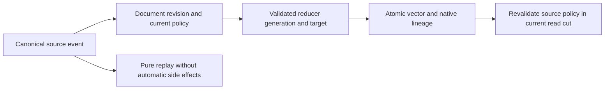

# EventProjectionLineage within Search

Root accepts stage P1 for KL-097 on 2026-10-04.
Decision: [ADR-089](../../ADR/ADR-089-event-projection-lineage.md).
The first callable operation is a typed `ApplyVectorProjection` batch mutation.
Its input binds the actual same-partition StreamRef/generation/event revision and
event ID, canonical source EntityRef/current document revision/input field,
reducer ID/version/generation and a PutVector target. All identities are immutable;
arbitrary inference bytes never override a changed source document. Cross-partition
projection effects require KL-094, not this mutation's transaction.

Canonical lineage is a new native-generated ZoneTree record beside the canonical
vector, committed with its effect. It contains identity, input revision, source
policy/classification and reducer generation, not copied raw event/document PII.
Validate source event existence/generation/revision/ID, source document visibility,
source field-use and target write grant in the same apply cut. Reject missing,
deleted, changed, revoked or classification-incompatible source/target; target
classification may not weaken the source field. Current visible-vector reads
must revalidate lineage source visibility/field use/policy and revision in their
same canonical read cut, so later reclassification/revocation cannot leak a vector.

Source and target may be different canonical collection/table entities in the
same atomic partition; target ExpectedDocumentRevision is checked independently.
Classification is free-form and has no stronger/weaker ordering. Every effective
source classification matched to the input field must occur with exact ordinal
equality among effective target-vector-field policies. Additional target classes
are allowed; an unclassified source adds no classification requirement. Reuse
existing path/policy evaluation. Apply rejects unauthorized/stale inputs; vector
eligibility skips hidden/deleted/revised/field-denied/incompatible inputs while
retaining actual corruption and budget/cancellation failures. Reauthorize the
current reader; never substitute equality with the producer's policy epoch.
Root adds `IAuthorizationPolicy.GetEffectiveFieldPolicies(ResourceDefinition,
string)` and its Security implementation over the existing canonical Overlaps
matcher. It borrows immutable persisted policies without materializing a second
matching implementation. Classification tests cover exact, ancestor, descendant,
wildcard and nonmatching paths through that actual evaluator.

Dedup key binds source event, source revision, reducer generation and target full
vector identity. Identical replay reuses the canonical effect receipt; changed
payload conflicts. Stale job result fails RevisionConflict without modifying any
vector/lineage.
The private effect key encodes `DistanceMetric` as its stable integer value in
key codec v1. Both apply and lineage-based lookup use that same representation;
the key codec and every existing scalar tag remain unchanged.
Ordinary PutVector replacements delete prior derived lineage,
rather than leave a false provenance claim. A reducer is pure computation by
default; event replay emits no automatic jobs/external side effects. Projection
workers consume the committed outbox with stable consumer/filter/generation and
exclude their own projection mutation; no feedback loop or checkpoint advance
before a complete effect. This later worker must use native Orleans CQRS.

| Requirement | Acceptance and mapped tests |
|---|---|
| REQ-LINEAGE-001: bind effect to actual immutable input identity | AC-LINEAGE-001: exact source event/revision/reducer passes, stale/missing/wrong-stream/generation/ID fails atomically; independent real-store vector oracle. `EventProjectionInputTests` |
| REQ-LINEAGE-002: policy and sensitive lineage remain authoritative | AC-LINEAGE-002: source hidden/revoked/field-reclassified and weaker target classifications cannot produce/search protected derived vectors; no raw PII in lineage or diagnostics. `EventProjectionPolicyTests` |
| REQ-LINEAGE-003: dedup, restart and replay do not duplicate effects | AC-LINEAGE-003: identical retry/reopen preserves one effect/lineage, changed output conflicts; ordinary vector replacement removes lineage; pure replay causes no side effects. `EventProjectionReplayTests` |
| REQ-LINEAGE-004: workers and freshness are bounded and explicit | AC-LINEAGE-004: later outbox worker does not consume its own writes, advances only contiguous committed prefix, and WaitForIndex succeeds only for that prefix or returns explicit failure/timeout. Planned `EventProjectionWorkerTests`/RF3 SDK/MCP tests |
| REQ-LINEAGE-005: online generation lifetime preserves readers | AC-LINEAGE-005: KL-039 build/catch-up/swap/restart and reader leases preserve updates/deletes and completed old readers. Planned online-generation/process/RF3 tests; P1 does not qualify this |

## Ordered execution and ownership

1. Luna query_wave owns new Abstractions/Core Features/Search projection input,
   mutation/native lineage/dedup helpers and named UnitTests/Features/Search files.
   It also owns Core/Features/Search/VisibleVectorReads.cs and the private PutVector
   Upsert region in GraphAndSeries.cs for exact live lineage validation/cleanup.
2. Root owns central Mutation JSON discriminator/structure/capability/apply and
   native allowlist joins, canonical shared docs/status, SQL/SDK/MCP/RF3 joins.
3. Source/data contracts use existing generated Orleans serialization and stable
   aliases/Ids. No JSON persistence fallback or sidecar authority. Complete and
   self-review P1 before root's actual Aspire gates and checkpoint commit.
4. Freeze outbox worker, generation checkpoint/replay, explicit WaitForIndex and
   native FTS swap/reader contracts before P2; keep current principal-scoped native
   FTS untouched during P1. KL-039 remains separate until its full lifetime proof.
5. Real process and SDK/official MCP RF3 test the uploaded/event/job/vector path,
   current policy, restart and leader loss. Complete KL-097 still requires them.

Baseline: build22/formatter22 passed; unit18 passed3060; scalar22 has the recorded
comparison-host failure. Rollback pauses projections and retains canonical lineage
and effects; older peers must reject unknown capabilities before execution. No
existing canonical bytes are rewritten. UI N/A; pure reducer API is server/worker
operation, not a general workflow-engine compatibility claim.

## P1 public RF3 test stage

Luna query_wave owns new
`tests/KeyLoad.IntegrationTests/Features/Search/Cases/EventProjectionRf3Tests.cs`
and uniquely named projection `Helpers/` or `Assertions/` files. Map
AC-LINEAGE-001/002/003 to real event/document/vector mutations and reads through
the .NET SDK and official MCP client on the existing Aspire-owned Docker RF3
fixture. Assert exact input binding, idempotent receipt reuse, stale/conflicting
rejection without state changes and live source revision/policy eligibility.
Add a scoped fixture-supported leader-loss replay case with committed-state
verification. This proves explicit P1 operations, not the unimplemented P2
outbox worker or generation lifecycle. No shared fixture, production contract,
topology or gate changes are delegated. Root owns integration and actual tests.

## P1 canonical process recovery stage

Luna query_wave next owns new CrashHost Search Helpers and RecoveryTests Search
Cases/Assertions/Helpers for one real ApplyVectorProjection operation through
the existing CanonicalCrashBoundary. Root owns the CrashHostApplication mode
join. Seed actual canonical source/target documents and the exact source event,
then persist the original operation before arming the next atomic commit. Cover
HeaderWritten, PayloadWritten, JournalFlushed, MutationApplied at index0 and
ApplyCompleted using genuine owned child process kills, StorageTrialLease and
existing killed-process file readiness, never another test caller or observer.

AC-LINEAGE-001/002/003 require reopen to preserve one complete cut: canonical
vector, its native lineage/effect, original outcome and outbox entry are either
all absent or all committed. JournalFlushed and later require committed state.
Use actual authorized exact search for the caller-visible vector oracle and
native retained records for the independent atomicity oracle. Retrying the same
original operation reuses its exact token and effect with no new outbox entry;
changed payload rejects without modifying the committed vector. A following
source revision change makes the derived vector ineligible under current reads.
Preserve complete original data and receipt assertions; process kill is not
power-loss evidence and does not qualify P2/RF3.

Prepare the scoped source patch outside the checkout while root verifies its
frozen prior compilation, with exact base/post hashes and dispatch instructions.
Use existing published dependencies, true ZoneTree/Core/Query execution and
bounded owned cleanup retaining primary and cleanup failures. No doubles,
implicit native-format rewrites, builds/tests/formatter or Git are delegated.
Root applies harness and dispatch together, self-reviews, and runs the actual
Aspire recovery cases and required full gates before recording runtime evidence.

