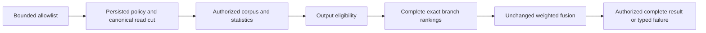

# FilteredRetrieval within Search

Root accepts this implementation contract on 2026-10-04 for KL-032/060.
Decision: [ADR-087](../../ADR/ADR-087-filtered-retrieval.md). The original
architecture acceptance criteria remain mandatory; this is an ordered delivery
contract, not a declaration that the tasks are qualified.

## Public stage F1 and acceptance

`SearchRequest.AllowedIds`, native field11, is an optional immutable array of
canonical document IDs in the request's existing partition/collection. Null
preserves existing exact search. An empty array selects nothing. Duplicates are
normalized with ordinal identity; unknown, hidden, deleted and stale entities
never return a hit or an existence/count diagnostic. Validate every identifier,
the incoming array length against MaxScanRecords, aggregate serialized request
bytes against MaxQueryBytes and all existing search limits before reading.
Persisted authorization remains required even for an empty allowlist.

| Requirement | Acceptance, pass/fail and mapped tests |
|---|---|
| REQ-FILTER-001: allowlist is an output eligibility constraint | AC-FILTER-001: real-store text, vector and hybrid queries equal an independent exact oracle over the eligible authorized corpus; null/empty/duplicates/unknown IDs and stable ties pass. `FilteredSearchOracleTests` |
| REQ-FILTER-002: one canonical policy/read cut remains authoritative | AC-FILTER-002: hidden/deleted/stale/reinserted/revoked hits never survive; field/capability denial remains explicit even for zero results. `FilteredSearchPolicyTests` |
| REQ-FILTER-003: bounded exact fallback produces complete results | AC-FILTER-003: input/work/result limits and cancellation fail with the existing typed failure and no partial success; the next healthy read succeeds; no full JSON/vector retention beyond existing bounds. `FilteredSearchBudgetTests` |
| REQ-FILTER-004: adaptive ANN uses the entire admissible graph | AC-FILTER-004: internal planner uses full-corpus ordinal eligibility, exact small-set, bounded expansion and fully charged fallback; 100/10/1/0.1 percent and correlated cohorts reach recall >=0.95 or fail explicitly. `AdaptiveFilteredPlannerTests`; F2 below |
| REQ-FILTER-005: public approximation and RF3 are separately qualified | AC-FILTER-005: F3 proves declared versioned completeness/mode/cost metadata and actual .NET/official MCP RF3 results after faults. Planned `FilteredSearchRf3Tests`; existing array replies remain complete exact results in F1 |

## Ordered execution and ownership

1. Root owns the appended shared SearchRequest field, JSON/native ingress and
   negotiated contract epoch joins; no older peer may silently ignore a filter.
2. Luna lifecycle_wave owns SearchEngine.cs, Features/Search/VectorRanker.cs,
   new FilteredSearch/FilteredVectorPlanner helpers and named TUnit test files.
   Apply eligibility before branch ranks and fusion; lexical corpus statistics
   continue to use the authorized corpus, not a caller-controlled IDF corpus.
   Reuse canonical visible-vector/document checks and rank/fusion contracts.
3. F2 adds the computational adaptive planner over the existing packed ANN
   candidate with actual charged eligibility/cardinality/expansion/fallback
   counters. Do not rebuild a graph from the output-filtered set or silently
   replace complete public exact rankings with an ANN/windowed reply.
4. F3 depends on ADR-019's accepted durable generation/replay and explicit public
   approximation contract. Root freezes that contract before its implementation;
   F1/F2 do not close AC-ANN-007/008 or the complete KL-032/060 criteria.
5. Root reviews/integrates, builds/formats, runs mapped cases and unit/scalar,
   recovery and genuine RF3 through the actual Aspire AppHost, records original
   source-bound outcomes, commits the stage and continues independent tasks.

Baseline: build22/formatter22 passed; full unit18 passed3060/3060; scalar22
passed3059/3060 with ComparisonHostCleanupTests startup/pipe-join failure. That
unrelated failure remains recorded and does not block F1 implementation.
Client/MCP transport reuse the existing typed search body; interactive UI N/A.
No canonical stored record migration occurs in F1. F2 remains computational;
rollback rejects filtered capability on older nodes rather than dropping IDs.

## F1 public RF3 test stage

Luna query_wave owns new
`tests/KeyLoad.IntegrationTests/Features/Search/Cases/FilteredSearchRf3Tests.cs`
and uniquely named filtered-search `Helpers/` or `Assertions/` files. Map
AC-FILTER-001/002/003 and the F1 portion of AC-FILTER-005 to actual shared
Aspire Docker RF3 discovered endpoints, real .NET SDK and official MCP search
calls, independent exact eligible result expectations, empty/duplicate/unknown
IDs, current write/delete and persisted policy denial. No approximation or
adaptive-planner qualification follows from these cases. Use unique resources,
bounded cancellation and cleanup; do not edit the shared fixture, topology,
contracts or production sources. Root integrates, builds and runs AppHost gates.

## F2 computational planner contract

F2 implements AC-FILTER-004 within the already real packed ANN executor. It adds
no public approximate reply or persisted format. The full admitted graph remains
the search graph; output eligibility never removes intermediate vertices. The
caller supplies the existing canonical full-corpus ordinal bitmap, whose exact
word count and unused trailing bits are validated before execution. Copy it once
into query-owned bounded scratch and charge every word/popcount operation to the
same AnnWorkBudget and ReadExecutionBudget; null is the whole corpus and an
empty eligible set returns zero candidates after admission.

`FilteredVectorPlanner` creates the actual execution plan consumed by
PackedAnnSearch: eligible count, result count, small-set exact choice and initial
level-zero breadth. For the approximate path, breadth starts at the larger of
EfSearch and `ceil(resultCount * corpusCount / eligibleCount)`, capped by the
existing `min(corpusCount, 4096)` capacity. Use checked long arithmetic and named
constants. Retry by bounded doubling only when too few eligible candidates were
found. Reuse the full graph; when the breadth cap is reached with insufficient
eligible candidates, execute the fully charged exact fallback. Small eligible
sets use exact search directly and enumerate actual bitmap set bits, charging
word/ordinal work without scoring ineligible vectors. No budgets reset across
planning, graph expansion or fallback, and no insufficient/partial exact result
becomes success.

Keep the existing AnnSearchResult constructor and mode meanings. Add in-memory
init metrics EligibleCount, ExpansionPasses and FallbackDistanceEvaluations;
ExpansionPasses counts actual level-zero SearchLayer calls, while fallback
distances count only the exact fallback phase. Existing total work/distance/edge
metrics and scratch reservations remain authoritative. These are computational
values, not persistence or inter-grain contracts. Public Search remains the F1
complete exact array; F3 still requires its separate accepted approximation,
generation and RF3 contract before exposure.

Luna lifecycle_wave owns a bounded F2 patch against Query/Search/Admission,
Queries and Models, including PackedAnnSearch, PackedAnnApproximateSearch,
PackedAnnExactSearch and AnnWorkBudget's result contract; it owns only new
`AdaptiveFilteredPlannerTests` and uniquely named Search test helpers/cases.
Root owns shared source integration, documentation, transport and all gates.
While root verifies the frozen previous compilation, this worker authors the
patch outside the checkout and changes no compiled source, outputs or Git state.
Self-review and handoff precede root application.

Map AC-FILTER-004 to deterministic 100/10/1/0.1-percent eligibility cohorts,
including eligibility correlated with nearest clusters and isolated endpoint
selection reached through ineligible intermediates. Compare IDs/scores against
an independent exhaustive scalar oracle, assert recall at least0.95 on the stated
cohorts, exact modes at1.0, deterministic ties and no ineligible hit. Exercise
small/zero sets, malformed bitmap, overflow-safe bounds, expansion/fallback
metrics, original scratch caps, work exhaustion/cancellation and a subsequent
healthy query. Use actual packed indexes and existing real ZoneTree seed helpers,
not a fake graph or authorization policy. Local quality fixtures are development
evidence; KL-060's required scale/performance and F3/RF3 gates remain open.

