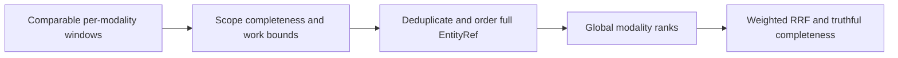

# GlobalBranchWindows within Search

Accepted R1 kernel for original KL-057 under
[ADR-096](../../ADR/ADR-096-global-branch-windows.md), prerequisite to KL-037
fan-out. RF3 replicas are not independent shards. This stage introduces bounded
per-modality global windows and complete EntityRef ordering; it does not advertise
a distributed query protocol, global snapshot or strict multi-shard BM25.

| Requirement | Acceptance and tests |
|---|---|
| REQ-RANK-001: global window before fusion | AC-RANK-001: independent centralized oracle and two/three window layouts return identical exact candidates/ranks for identical comparable scores, missing branch contributes zero, duplicated replica candidates contribute once; RRF is applied after global modality ordering. `GlobalBranchWindowTests` |
| REQ-RANK-002: full stable identity and comparable witnesses | AC-RANK-002: same Id in different tenant/database/domain/partition/collection remains distinct and ties use ordinal full EntityRef; duplicate reference with conflicting score/revision fails explicitly; nonfinite values or differing score-profile/corpus/statistics epochs fail, never win by arrival order |
| REQ-RANK-003: bounded truthful completeness | AC-RANK-003: record/byte/window/deadline/cancellation limits are checked before retention, failed/missing/approximate/truncated windows cannot be marked exhaustive; exact mode fails closed, explicit incomplete mode retains its missing-window/approximation flags; boundary failures release all owned temporary work |
| REQ-RANK-004: real existing runtime join | AC-RANK-004: the same core candidate-order/merge kernel is consumed by current SearchRankFusion through a single-partition adapter, preserving all current exact text/vector/graph results and source-cut authorization. Single-window fast path avoids redundant materialization; actual Aspire unit and RF3 suites and exact-source Linux gates pass |

Root freezes an internal generated v1 BranchWindow contract containing branch
name/kind, source logical window identity, comparable score-profile and corpus/
statistics-scope witness, completion/approximation/truncation flags and finite
candidates with full EntityRef, document revision and modality score. The merge
request declares the exact expected logical-window identities, desired candidate
window size and explicit incomplete permission. Strict default rejects any missing
window or noncomplete input. All windows of one branch must agree on score scope,
profile and statistics epoch. Each input is ordered by descending score then full
EntityRef; identical replica duplicates must agree on revision and score before
deduplication. A declared finite top-L window is window-complete, not exhaustive
RRF over candidates outside that union. Results retain that distinction.

Exact internal DTO freeze, with zero-based sequential generated IDs in listed
order and aliases `keyload.query.<kebab-type-name>.v1`: GlobalBranchKind is
Text=0/Vector=1/Graph=2; GlobalBranchScope(ScoreProfile,CorpusScope,StatisticsEpoch);
GlobalBranchCandidate(Reference,Revision,Score);
GlobalBranchWindow(BranchName,Kind,SourceWindowId,Scope,Candidates,Complete,
Approximate,Truncated,Exhaustive=false);
GlobalBranchMergeRequest(BranchName,Kind,Scope,ExpectedWindowIds,Limit,
AllowIncomplete=false); GlobalBranchMergeResult(Candidates,MissingWindowIds,
WindowComplete,Approximate,Truncated,Exhaustive,ExaminedCandidateCount).
String identifiers are nonblank and bounded by JsonData.Identifier; candidate
revision is positive; arrays are initialized; duplicate/unknown source IDs reject.
The merger receives DatabaseLimits and the shared ReadExecutionBudget, charges
every examined record and exact native bytes before retaining it, and retains no
more than MaxScanRecords/MaxBatchBytes. No unbounded window list is accepted.
Strict mode rejects Approximate or Truncated input; explicit incomplete mode
retains those flags. Exhaustive also requires every source Exhaustive and no
candidate omitted by the requested output window. Local fusion may use a narrow
single-window fast adapter over its already authorized canonical SearchScore
array; it does not fabricate witness DTOs or advertise distributed completeness.

Tie comparison is ordinal TenantId, DatabaseId, TransactionDomainId, PartitionKey,
Collection and Id, each compared as an independent component; never concatenate
ambiguous separators. Merge one modality before assigning1-based ranks, then
existing weightedRrfV1. A bounded k-way heap plus bounded unique-candidate state
is allowed; no task per record or unbounded transport. Every examined candidate
is charged even if duplicated, rejected or beyond the selected window. The
single-partition adapter reuses the same kernel/order and existing authorized
local branch arrays without inventing a global statistics epoch or physical shard
identity. Full fan-out/read-cut/policy/statistics contracts remain a later stage.

Validation rejects malformed requests, identifiers, uninitialized arrays,
nonpositive/oversized limits and duplicate/unknown logical source windows.
Corruption rejects malformed/conflicting candidates or incomparable scope.
BudgetExceeded rejects record/byte/window/deadline exhaustion; cancellation keeps
its native cancellation exception. Strict missing/incomplete windows give
OwnershipLost; strict approximate/truncated windows give UnsupportedCapability.
Expected and received window lists each obey MaxScanRecords and their exact
native metadata is included in the one shared MaxBatchBytes accounting. Every
examined candidate across all windows counts against the same MaxScanRecords.

Luna lifecycle_wave owns NEW Query Features/Search Contracts/Models/Queries/
Validation for the merger/order and existing SearchRankFusion narrow join, plus
NEW UnitTests Search Cases/Helpers/Assertions/Models. Root owns shared declarations,
future routing/SDK/MCP/contracts, docs and all gates. Prepare a private scoped
patch against3985008 while root tests the stable compilation. Do not change
rankers, physical topology, persisted statistics, public SearchRequest, policy
projections or existing expected results to force a pass. Escalate a contract
ambiguity; root freezes exact DTO aliases/IDs before any inter-grain publication.

Frontend/new SDK/MCP syntax N/A in R1: existing search consumes its local adapter.
Canonical data migration N/A; this internal computational stage persists nothing.
Rollback restores the capable runtime with unchanged canonical data. KL-057 stays
in progress until actual multiple-shard layout, missing-shard, bounded fan-out,
current authorization/read-cut and original quality/performance qualification pass.

