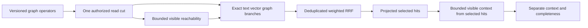

# GraphRetrieval within Search

Root accepts this ordered implementation contract on 2026-10-04 for KL-055 and
the same-partition exact branch of KL-056. [ADR-090](../../ADR/ADR-090-graph-search.md)
implements architecture sections26.2–26.4. This contract retains the original
SQL, distributed ranking, performance and RF3 qualification requirements.

## Versioned public contract

G1 adds an explicit `GraphSearchRequest` and `GraphSearchResult`; it does not
change the exact array reply of existing Search. HTTP `/v1/search/graph`, SDK
`GraphSearchAsync` and official MCP `keyload_search_graph` invoke the same isolated
Orleans request/read grain and one canonical authorized storage read cut.

The generated v1 records, with sequential native IDs starting at0, are:

- `GraphWalkSpec(Graph, Seeds, MaxDepth=3, MaxVertices=1000, MaxEdges=5000,
  Labels=null)`: immutable qualified EntityRef seeds and optional immutable
  ordinal labels. Null labels means unrestricted; empty labels means no edges.
- `GraphScope(Walk)`: mandatory reachability eligibility, including seeds.
- `GraphRetriever(Walk, Weight=1)`: one independent shortest-hop ranked branch.
- `GraphExpansion(Graph, MaxDepth=1, MaxVertices=1000, MaxEdges=5000,
  Labels=null)`: walks from the selected final hits and returns separate context.
- `GraphSearchRequest(Version, Search, Scope=null, Retriever=null,
  Expansion=null)`: version must equal1 and at least one graph operator is
  supplied. Search may omit text/vector only when Retriever is present.
- `GraphContextDocument(Document, ShortestHops)` and
  `GraphExpansionResult(Documents, Completeness=SelectedHits)` use projected
  DocumentResult and an explicit `GraphExpansionCompleteness.SelectedHits` enum.
- `GraphSearchResult(Hits, Expansion)` retains the exact RankedDocument hits;
  Expansion is null when not requested and never silently changes hit ranks.

Every new record uses `GenerateSerializer`, stable IDs and a literal purpose
alias `keyload.contract.<kebab-type-name>.v1` held in feature-owned constants.
No existing IDs/aliases are reused. Root owns application capability admission.

All walks are outgoing, in the Search partition and a configured graph in the
same tenant/database. Depth0..16, vertices1..10000, examined edges1..50000,
nondefault nonempty seeds no greater than MaxVertices/MaxScanRecords, finite
nonnegative weight, valid identifiers and serialized whole-request MaxQueryBytes
are validated before reads. Unknown versions fail Validation. Every operator
shares the request's read-work, cancellation and retained/output-byte budgets;
its local caps never reset the shared budget. Limit exhaustion fails explicitly,
with no truncated success or exact/completeness claim.

## Requirements and acceptance

| Requirement | Acceptance and mapped automated tests |
|---|---|
| REQ-GSEARCH-001: independent AST roles within one read cut | AC-GSEARCH-001: GraphScope, Retriever and Expansion are independently callable and composable; count native read-gate entry and prove exactly one per request. `GraphSearchOperatorTests` |
| REQ-GSEARCH-002: current persisted path authorization | AC-GSEARCH-002: hidden/deleted/revoked intermediate vertices stop traversal; each seed retains existing explicit start authorization. Endpoint collection/AllowedIds filters do not prune valid other-collection intermediate vertices. Requested labels require graph label field-use authorization. `GraphSearchAuthorizationTests` |
| REQ-GSEARCH-003: deterministic deduplicated shortest-hop ranking | AC-GSEARCH-003: graph score1/(1+shortestHops), multi-seed BFS, cycles/convergent paths contribute once per full EntityRef; weightedRrfV1 text/vector/graph matches independent exhaustive small-corpus oracle, including missing/zero-weight branches and ordinal ties. `GraphSearchOracleTests` |
| REQ-GSEARCH-004: explicit bounded expansion output | AC-GSEARCH-004: only selected final hits seed expansion; context uses its own current collection/row/field policy, deduplicated shortest hops, explicit SelectedHits completeness and shared combined reply bounds. `GraphSearchExpansionTests` |
| REQ-GSEARCH-005: bounded versioned admission | AC-GSEARCH-005: null/default/cross-partition seeds, invalid labels/versions/weights, exact work/byte boundaries, cancellation and next healthy request are covered. No edge attributes or whole intermediate JSON are retained by reachability. `GraphSearchBudgetTests` |
| REQ-GSEARCH-006: public cluster and SQL parity qualification | AC-GSEARCH-006: .NET and official MCP clients agree on genuine Aspire RF3 after policy/write/fault changes, and versioned SQL SEARCH compiles equivalent operators. Planned `GraphSearchRf3Tests` and SQL conformance fixtures; G2, not closed by G1 |

Scope intersects AllowedIds at branch output before ranking/fusion. Text corpus
statistics remain the complete authorized corpus. Traversal never applies that
endpoint predicate to intermediate vertices. Retriever produces only visible
Search.Collection endpoints, sorted by shortest hops then full EntityRef;
missing branches contribute zero and duplicate paths never amplify score.
Zero-weight branches still validate their request and execute their current
authorization and bounded read work, but contribute no candidates or score to
fusion. A zero-weight-only retriever therefore produces no hits; it does not
bypass GraphRead, seed visibility, label-use checks or shared resource bounds.
Current edge authority is persisted GraphRead; edge label policy applies when
Labels is non-null, using exactly the `/label` JSON-pointer field-use path, including empty
label arrays. Expansion excludes all selected-hit EntityRefs from its context
output; its seeds still count against traversal/work caps and shortest-hop
distances. Scope and Retriever include authorized seeds at hop0.
No hidden-traversal privilege is introduced. Missing
canonical adjacency/edge corruption propagates rather than becoming a hidden hit.

## Ordered stages, ownership and evidence

1. Root freezes this contract and ADR before coding, owns shared Core Query
   friend visibility, public transport/read-kind joins and central versioning.
2. Luna lifecycle_wave owns new Abstractions Search graph contract files, new
   Core GraphTraversal same-cut reachability helpers and their internal
   DatabaseEngine bridge, Query Search graph executor, and mapped new UnitTests.
   It may refactor SearchEngine's existing private ranking/projection/validation
   into shared Search helpers and extend the existing request sizer generically;
   preserve all F1 behavior and tests. No Core vector/lineage edits.
3. Core returns only bounded EntityRef-to-shortest-hop metadata through a narrow
   internal borrowed-view bridge. Query uses WithQueryView exactly once and
   passes that view, freshly resolved principal and one budget to every branch.
   Do not call public Traverse/Search/Get inside the cut or acquire a second cut.
4. Root self-reviews the integrated diff, builds/formats, then executes mapped
   development tests through actual Aspire while other Luna features continue.
   Record original results and commit the completed coherent stage honestly.
5. G2 adds equivalent SQL operators, native public RF3 fault cases and remaining
   whole-task qualification. Cross-partition traversal remains unavailable in
   G1; KL-038/057 and adaptive ANN are separate dependencies.

There are no new dependencies or stored-format migrations in G1. Rollout admits
only nodes supporting the new capability before serving the endpoint; rollback
rejects unsupported graph requests, never silently drops an operator. Interactive
UI N/A: this is a SDK/SQL/MCP database capability. Current evidence is source
implementation in progress; no runtime or performance qualification is claimed.

## G2: versioned SQL SEARCH profile

This is a bounded Q1.Search.v1 profile of the shared SQL language, not full SQL
conformance or a SQL client connection protocol. The dedicated typed
`SqlGraphSearchRequest(Version, QueryRequest Query)` uses native IDs0/1 and alias
`keyload.contract.sql-graph-search-request.v1`. Version must be1, Cursor must be
null and AllowFullScan must be explicitly true. Root joins the native read kind,
HTTP `/v1/query/search`, SDK `SearchSqlAsync` and official MCP
`keyload_query_search`; all return the existing GraphSearchResult. Current
application capability3 admits it. Existing scalar QueryPage is unchanged.

The complete accepted statement order is:

```text
SEARCH FROM collection
 [TEXT field MATCH string-or-@parameter [WEIGHT number]]
 [VECTOR field MATCH @parameter SPACE (id, dimension, metric, model, version)
  [WEIGHT number]]
 [SCOPE GRAPH graph SEEDS ((collection, id), ...)
  DEPTH integer VERTICES integer EDGES integer [LABELS (value, ...)]]
 [RETRIEVE GRAPH graph SEEDS ((collection, id), ...)
  DEPTH integer VERTICES integer EDGES integer [LABELS (value, ...)]
  [WEIGHT number]]
 [EXPAND GRAPH graph DEPTH integer VERTICES integer EDGES integer
  [LABELS (value, ...)]]
 [ALLOW IDS (value, ...)] [LIMIT integer] [FUSION integer]
```

Collection/field/graph/space identifiers follow current bounded SQL identifier
rules; seed IDs, label/allowed-ID values and MATCH text accept quoted strings or
named JSON string parameters. Seed collection is an identifier in the same
request partition. Vector MATCH is a named JSON array of finite float-compatible
numbers, with exact supplied space dimension and defined VectorMetric. Empty
LABELS/ALLOW IDS retain the direct API's empty-set semantics; empty/default seed
sets reject. Weights default1, limit10, fusion60; walk caps are explicit. At least
one graph operator is required; graph-only retrieval is valid. Duplicate,
reordered, unknown clauses, missing/wrong-kind parameters, nonfinite/overflow
numbers, unsupported cursor/version and trailing tokens reject Validation.
No clause can be silently ignored or manufacture a different identity scope.

Use the existing bounded tokenizer/token cursor and named constants, preserve
their whole-SQL token/depth/byte limits, and cap JSON parameters/the complete
request before building arrays. Parser output is exactly GraphSearchRequest;
the final G1 validation remains authoritative. Execute solely through
SearchEngine.GraphSearchAsync with the original principal and cancellation.
There is no second traversal implementation, extra store read or SQL-specific
authorization path. Manifest ReadProfiles adds `graph-search-v1`, while its Q1
baseline and honest scalar conformance inventory remain unchanged.

AC-GSEARCH-006 maps G2 syntax and real-store direct/SQL equivalence to new
`SqlGraphSearchParserTests`, `SqlGraphSearchParityTests` and
`SqlGraphSearchRejectionTests` in QueryExecution/Cases with Helpers fixtures.
Cover all operator combinations, multi-seed/different-collection intermediates,
empty labels/allowlist, zero weights, exact lowering and invalid parameter/budget
cases. Root extends genuine Aspire RF3 SDK/official MCP parity with policy,
write and fault changes before closing the criterion. Public UI N/A.

Root freezes this contract/ADR and owns public adapters/capability/central docs.
Luna lifecycle_wave owns new Abstractions QueryExecution SQL-search DTO, Query
QueryExecution parser/validation/executor/manifest profile joins and mapped new
Unit QueryExecution tests, preserving G1 source and unrelated SQL behavior.
It escalates unsupported grammar or public contract changes rather than inventing
fallback syntax. Root reviews/builds/runs actual Aspire gates and commits the
verified stage while other feature workers continue.

### G2 public RF3 test stage

Luna lifecycle_wave now owns only new
`tests/KeyLoad.IntegrationTests/Features/Search/Cases/GraphSearchRf3Tests.cs`
and graph-specific `Helpers/` or `Assertions/` files, plus new
`Features/QueryExecution/Cases/SqlGraphSearchRf3Tests.cs` and matching
SQL-graph-specific helpers. AC-GSEARCH-006 requires the actual shared Aspire
Docker RF3 fixture, discovered endpoints, persisted grants, real .NET SDK and
official MCP clients. Assert independent expected IDs, ranks and context on
direct/SQL replies, multi-seed and other-collection intermediates, explicit
denials and policy/write changes. Add a scoped fixture-supported leader-loss
case with committed-state verification and bounded cleanup. Shared topology,
fixtures, central contracts and production sources remain root-owned. Workers
author and self-review tests without building or running them; root reviews,
builds and executes them through AppHost before recording any runtime result.

## G3: three-way exact fusion qualification

Root freezes the same-partition KL-056 test stage on 2026-10-04 under
REQ-GSEARCH-003/006 and AC-GSEARCH-003/006. The existing G1 executor and G2 SQL
lowering remain the implementation contract; no new public or stored contract
is introduced. Three-way means text, exact vectors and graph retrieval in one
authorized bounded read cut. Global multi-partition ranks remain KL-057.

Use a genuine persisted corpus with deliberately different text, cosine-vector
and shortest-hop rankings, a missing branch contribution, converging graph paths,
and an ordinal tie. Define the expected branch orders from that fixed corpus
independently of the production ranking/fusion helpers. A test-owned arithmetic
oracle computes each unique ID's `textWeight/(K+textRank) +
vectorWeight/(K+vectorRank) + graphWeight/(K+graphRank)`, using one-based ranks,
zero for absent or zero-weight branches, and ordinal ID ties. Assert exact
selected IDs and scores within a stated floating-point tolerance, including
unequal positive weights and the all-zero result. Scope and AllowedIds intersect
before branch ranks; graph traversal may still use eligible-policy intermediate
vertices outside the result collection. Current persisted row/field/graph-label
denial and revocation cannot be bypassed by a zero weight or empty allowed set.
Expansion context stays separate and contributes no fusion score.

Luna lifecycle_wave owns only new `ThreeWayHybrid*` UnitTests/Search and
IntegrationTests/Search files in their Cases, Helpers, Assertions or Models roles.
Author against real ZoneTree/Core/Query and the shared Aspire RF3 fixture, using
actual .NET and official MCP clients for direct and SQL parity. Keep the next
stage in `/private/tmp/keyload-three-way-fusion-20261004` while root runs the
current compiled gates; provide an absent/base/post-hash patch manifest. Root
owns review, source joins, Release/formatter/governance and Aspire execution.
Failures escalate with the owning production path and smallest counterexample;
workers cannot change semantics, suppress tests or edit shared fixtures. Source
or local development success does not close Linux RF3, distributed ranking,
scale, endurance or performance requirements.


