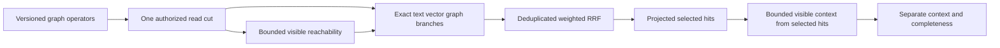

# GraphRetrieval within Search

Root accepts this ordered implementation contract on 2026-10-04 for KL-055 and
the same-partition exact branch of KL-056. [ADR-090](../../ADR/ADR-090-graph-search.md)
implements architecture sections26.2–26.4. This contract retains the original
SQL, distributed ranking, performance and RF3 qualification requirements.

## Versioned public contract

G1 adds an explicit `GraphSearchRequest` and `GraphSearchResult`; it does not
change the exact array reply of existing Search. HTTP `/v1/search/graph`, SDK
`GraphSearchAsync` and official MCP `keyload_search_graph` invoke the same isolated
Orleans request/read grain and one canonical authorized storage read cut.

The generated v1 records, with sequential native IDs starting at0, are:

- `GraphWalkSpec(Graph, Seeds, MaxDepth=3, MaxVertices=1000, MaxEdges=5000,
  Labels=null)`: immutable qualified EntityRef seeds and optional immutable
  ordinal labels. Null labels means unrestricted; empty labels means no edges.
- `GraphScope(Walk)`: mandatory reachability eligibility, including seeds.
- `GraphRetriever(Walk, Weight=1)`: one independent shortest-hop ranked branch.
- `GraphExpansion(Graph, MaxDepth=1, MaxVertices=1000, MaxEdges=5000,
  Labels=null)`: walks from the selected final hits and returns separate context.
- `GraphSearchRequest(Version, Search, Scope=null, Retriever=null,
  Expansion=null)`: version must equal1 and at least one graph operator is
  supplied. Search may omit text/vector only when Retriever is present.
- `GraphContextDocument(Document, ShortestHops)` and
  `GraphExpansionResult(Documents, Completeness=SelectedHits)` use projected
  DocumentResult and an explicit `GraphExpansionCompleteness.SelectedHits` enum.
- `GraphSearchResult(Hits, Expansion)` retains the exact RankedDocument hits;
  Expansion is null when not requested and never silently changes hit ranks.

Every new record uses `GenerateSerializer`, stable IDs and a literal purpose
alias `keyload.contract.<kebab-type-name>.v1` held in feature-owned constants.
No existing IDs/aliases are reused. Root owns application capability admission.

All walks are outgoing, in the Search partition and a configured graph in the
same tenant/database. Depth0..16, vertices1..10000, examined edges1..50000,
nondefault nonempty seeds no greater than MaxVertices/MaxScanRecords, finite
nonnegative weight, valid identifiers and serialized whole-request MaxQueryBytes
are validated before reads. Unknown versions fail Validation. Every operator
shares the request's read-work, cancellation and retained/output-byte budgets;
its local caps never reset the shared budget. Limit exhaustion fails explicitly,
with no truncated success or exact/completeness claim.

## Requirements and acceptance

| Requirement | Acceptance and mapped automated tests |
|---|---|
| REQ-GSEARCH-001: independent AST roles within one read cut | AC-GSEARCH-001: GraphScope, Retriever and Expansion are independently callable and composable; count native read-gate entry and prove exactly one per request. `GraphSearchOperatorTests` |
| REQ-GSEARCH-002: current persisted path authorization | AC-GSEARCH-002: hidden/deleted/revoked intermediate vertices stop traversal; each seed retains existing explicit start authorization. Endpoint collection/AllowedIds filters do not prune valid other-collection intermediate vertices. Requested labels require graph label field-use authorization. `GraphSearchAuthorizationTests` |
| REQ-GSEARCH-003: deterministic deduplicated shortest-hop ranking | AC-GSEARCH-003: graph score1/(1+shortestHops), multi-seed BFS, cycles/convergent paths contribute once per full EntityRef; weightedRrfV1 text/vector/graph matches independent exhaustive small-corpus oracle, including missing/zero-weight branches and ordinal ties. `GraphSearchOracleTests` |
| REQ-GSEARCH-004: explicit bounded expansion output | AC-GSEARCH-004: only selected final hits seed expansion; context uses its own current collection/row/field policy, deduplicated shortest hops, explicit SelectedHits completeness and shared combined reply bounds. `GraphSearchExpansionTests` |
| REQ-GSEARCH-005: bounded versioned admission | AC-GSEARCH-005: null/default/cross-partition seeds, invalid labels/versions/weights, exact work/byte boundaries, cancellation and next healthy request are covered. No edge attributes or whole intermediate JSON are retained by reachability. `GraphSearchBudgetTests` |
| REQ-GSEARCH-006: public cluster and SQL parity qualification | AC-GSEARCH-006: .NET and official MCP clients agree on genuine Aspire RF3 after policy/write/fault changes, and versioned SQL SEARCH compiles equivalent operators. Planned `GraphSearchRf3Tests` and SQL conformance fixtures; G2, not closed by G1 |

Scope intersects AllowedIds at branch output before ranking/fusion. Text corpus
statistics remain the complete authorized corpus. Traversal never applies that
endpoint predicate to intermediate vertices. Retriever produces only visible
Search.Collection endpoints, sorted by shortest hops then full EntityRef;
missing branches contribute zero and duplicate paths never amplify score.
Current edge authority is persisted GraphRead; edge label policy applies when
Labels is non-null, using exactly the `label` field-use path, including empty
label arrays. Expansion excludes all selected-hit EntityRefs from its context
output; its seeds still count against traversal/work caps and shortest-hop
distances. Scope and Retriever include authorized seeds at hop0.
No hidden-traversal privilege is introduced. Missing
canonical adjacency/edge corruption propagates rather than becoming a hidden hit.

## Ordered stages, ownership and evidence

1. Root freezes this contract and ADR before coding, owns shared Core Query
   friend visibility, public transport/read-kind joins and central versioning.
2. Luna lifecycle_wave owns new Abstractions Search graph contract files, new
   Core GraphTraversal same-cut reachability helpers and their internal
   DatabaseEngine bridge, Query Search graph executor, and mapped new UnitTests.
   It may refactor SearchEngine's existing private ranking/projection/validation
   into shared Search helpers and extend the existing request sizer generically;
   preserve all F1 behavior and tests. No Core vector/lineage edits.
3. Core returns only bounded EntityRef-to-shortest-hop metadata through a narrow
   internal borrowed-view bridge. Query uses WithQueryView exactly once and
   passes that view, freshly resolved principal and one budget to every branch.
   Do not call public Traverse/Search/Get inside the cut or acquire a second cut.
4. Root self-reviews the integrated diff, builds/formats, then executes mapped
   development tests through actual Aspire while other Luna features continue.
   Record original results and commit the completed coherent stage honestly.
5. G2 adds equivalent SQL operators, native public RF3 fault cases and remaining
   whole-task qualification. Cross-partition traversal remains unavailable in
   G1; KL-038/057 and adaptive ANN are separate dependencies.

There are no new dependencies or stored-format migrations in G1. Rollout admits
only nodes supporting the new capability before serving the endpoint; rollback
rejects unsupported graph requests, never silently drops an operator. Interactive
UI N/A: this is a SDK/SQL/MCP database capability. Current evidence is source
implementation in progress; no runtime or performance qualification is claimed.

