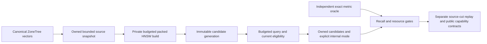

# Managed ANN candidate

Status: R1 contract accepted by root under the owner's 104-task implementation scope, 2026-10-04. R1 source and independent tests are implemented and reviewed; strict full Release build16 passes. Focused real-store normal06 and scalar07 each pass19/19 with unchanged whole source/runtime inventories and all15 recall cells>=0.988. Full-suite/delivered-source qualification and R2/R3 implementation remain pending. Canonical slice: Search. Decision: [ADR-019](../../ADR/ADR-019-managed-ann.md); parent [Search](../Search.md). Maps REQ/AC-SEARCH-001/003/004/005/006 to KL-030/031/032/059/060.

R1 is an independently authored immutable packed managed HNSW computational candidate. It consumes an owned bounded snapshot of actual canonical VectorRecord values and returns owned internal candidates. It is not enabled in SearchEngine, SQL, HTTP, SDK or MCP. Canonical ZoneTree data, native WAL, persisted authorization, one-grain-per-request, RF3 and exact branch/fusion semantics remain authoritative.



## Requirements and acceptance

| Requirement | Acceptance: measurable pass/fail | Automated mapping |
|---|---|---|
| REQ-ANN-001: packed finite owned state with pre-allocation admission | AC-ANN-001: small actual-store corpus builds within a 32 KiB index cap; copied vectors use dimension-aligned blocks at most 64 KiB, no mandatory 256 MiB chunk; count/byte/scratch/array arithmetic is checked before allocation. Invalid options, dimensions, metric, identity, order, duplicates, revision, field/space or nonfinite input yield typed Validation. Excess positive resource limits yield BudgetExceeded. | PackedAnnValidationTests, PackedAnnReservationTests; actual ZoneTree vectors |
| REQ-ANN-002: scores preserve the existing exact metric semantics | AC-ANN-002: every returned score equals SearchEngine.Similarity in the same invocation mode for Cosine, Euclidean and DotProduct, including zero, ordinary, subnormal, large finite values and dimensions 1/4096. Invalid query is rejected even for an empty index or eligibility set. Normal and hardware-disabled reports are retained separately. | PackedAnnMetricTests; independent public oracle |
| REQ-ANN-003: finite work, memory, deadline and cancellation without partial success | AC-ANN-003: exact/excess work and scratch boundaries, already-cancelled and genuinely in-progress cancellation/deadline, immutable concurrent queries and a healthy following call are observed. Failure returns no candidate result and cannot mutate a prior successful generation. Counters report actual work and per-call deltas. | PackedAnnBudgetTests, PackedAnnOwnershipTests; real ReadExecutionBudget and cancellation |
| REQ-ANN-004: eligibility constrains output without hiding navigation nodes | AC-ANN-004: disallowed nodes remain traversable but never appear in output. Bitmap length/outside bits are validated. Small eligible sets use exact search; insufficient admitted approximate candidates trigger charged complete eligible exact fallback or typed failure. Result mode is truthful. Filter selectivity/correlation and deterministic score/ordinal-ID ties are covered. | PackedAnnFilterTests; actual persisted-policy canonical corpus |
| REQ-ANN-005: real-corpus quality must precede admission | AC-ANN-005: at least 10,000 actually loaded canonical records and 100 independent queries per metric/selectivity/correlation cell are compared with complete eligible exact Top10. Recall@10 is at least 0.95 in every cell; a failing cell blocks admission rather than being averaged away. Include all/10%/1%/0.1% eligibility and geometry-correlated eligibility, seed, loaded counts, options and actual mode. | PackedAnnRecallTests and original TUnit artifacts; development controls, not global performance qualification |
| REQ-ANN-006: rebuilding reflects canonical mutation and owns retained bytes | AC-ANN-006: actual ZoneTree vector-only update at unchanged DocumentRevision, document update/stale vector, deletion and reinsertion change the rebuilt corpus appropriately. Mutation of input buffers/list after Build cannot change a successful index; failed rebuild leaves the prior index queryable and identical. | PackedAnnRebuildTests, PackedAnnOwnershipTests |
| REQ-ANN-007: persisted projection has a source-cut and bounded replay/publication contract | AC-ANN-007: R2 must prove pinned snapshot plus ordered outbox tail, same-revision vector update, duplicate replay, deletion/reinsert, obsolete generations, atomic publish, corruption, locks/leases/retention and actual crash/restart boundaries against real ZoneTree. Pending separate root format/lifecycle contract; no implementation exception. | Future Search projection unit/process-recovery suites; KL-031/039/097 |
| REQ-ANN-008: public approximation and freshness are explicit and authorized | AC-ANN-008: R3 must prove versioned exact/approximate/fallback/completeness metadata through SQL, .NET and official MCP; current row/field grant and policy epoch in one read cut; genuine RF3 migration, follower loss/catch-up, revocation and no stale/hidden candidate payload. Pending separate root public contract; no implementation exception. | Future Query/Search/ClientApi and Docker/Aspire RF3 suites; KL-032/059/060 |

AC-ANN-001–006 must pass before R1 is described as qualified. R1 cannot close AC-SEARCH-005/006 or AC-ANN-007/008. No fabricated fixtures, fakes, assertion relaxation, skips or tolerance-based score substitution are permitted; actual TestDatabase fixtures use genuine canonical ZoneTree state and persisted policy. Recall is the declared quality threshold; score equality uses the exact current public oracle in the same scalar/intrinsic mode.

## Frozen R1 internal API

Namespace: KeyLoad.Query.Features.Search. These computational objects are not persisted or passed between grains; no serialization DTO or alias is introduced in R1.

```csharp
internal sealed record PackedAnnOptions; // init properties and defaults below
internal sealed class AnnWorkBudget {
    internal AnnWorkBudget(ReadExecutionBudget readBudget, long maxWorkUnits);
    internal long WorkUnits { get; }
    internal long DistanceEvaluations { get; }
    internal long EdgeVisits { get; }
    internal void Check();
    internal void Charge(long units);
    internal void ChargeDistance(int dimension);
    internal void ChargeEdge();
}
internal enum AnnSearchMode { ExactSmallSet, Approximate, ExactAfterInsufficientCandidates }
internal readonly record struct AnnCandidate(int SourceOrdinal, string DocumentId,
    long DocumentRevision, double Score);
internal sealed record AnnSearchResult(AnnCandidate[] Candidates, AnnSearchMode Mode,
    long WorkUnits, long DistanceEvaluations, long EdgeVisits);
internal sealed class PackedAnnIndex {
    internal static PackedAnnIndex Build(VectorSpace space, IReadOnlyList<VectorRecord> records,
        PackedAnnOptions options, AnnWorkBudget budget);
    internal VectorSpace Space { get; }
    internal int Count { get; }
    internal long RetainedBytesUpperBound { get; }
    internal long BuildScratchBytesUpperBound { get; }
    internal AnnSearchResult Search(ReadOnlyMemory<float> query, int limit,
        ReadOnlyMemory<ulong>? eligibility, AnnWorkBudget budget);
}
```

PackedAnnOptions properties: Connections=16 (4/8/16/32/64 only), EfConstruction=128 (Connections..4096), EfSearch=128 (1..4096), MaxLevel=16 (1..16), ExactThreshold=256 (0..4096), MaxRecords=5,000,000 (1..5,000,000), MaxIndexBytes=268,435,456 (1024..8,589,934,592), MaxScratchBytes=8,388,608 (1024..268,435,456), Seed=0x4B45594C4F414431UL. These are finite internal candidate caps, not changes to public DatabaseLimits. Numeric products, array lengths and sum/growth arithmetic must be checked before allocation; oversized input must not first allocate and then fail.

Input identities are nonempty canonical JsonData.Identifier values, unique and strictly StringComparer.Ordinal ordered. All records have one field, the full supplied VectorSpace, positive DocumentRevision and finite vectors of its dimension 1..4096. Validate full space identifiers/metric/dimension and input even when empty. Reject unordered/duplicate input rather than sort it inside an unbudgeted dictionary. The later canonical collector owns its bounded charged sort. Build copies vectors into dimension-aligned blocks no larger than 64 KiB (the last block uses its actual size), keeps only identity/revision metadata and packed primitive graph arrays, and retains no caller list, full DocumentRecord, borrowed view, database handle or source vector array. RetainedBytesUpperBound conservatively includes managed headers/arrays and retained UTF-16 strings; this formula is not measured RSS.

Levels use deterministic SplitMix64(Seed plus sorted source ordinal), a geometric 1/Connections promotion rate and MaxLevel cap. HNSW insertion uses a greedy upper walk, bounded layer search, base maximum degree 2*Connections and upper maximum degree Connections. Cosine/Euclidean use diversified neighbors with a fill-from-pruned phase; DotProduct uses exact nearest-neighbor selection for both new edges and reciprocal overflow under the accepted refinement below. No clock/global Random or imported source is used. Build has one private writer and publishes only on complete success. An index is immutable and supports concurrent searches; each search owns its scratch. Updates/deletes produce a newly built successful generation in R1 rather than mutate the old one.

AnnWorkBudget wraps the actual ReadExecutionBudget.Check, so real cancellation and elapsed deadline propagate. Work units are one examined input component/metadata character, one traversed graph edge, and one component of a distance evaluation; finite validation and the existing metric reduction are included in that bounded distance quantum. ChargeDistance increments actual DistanceEvaluations and charges dimension units before scoring. ChargeEdge increments EdgeVisits and charges one unit before examination. Heap/neighbor/level/visited/validation/copy loops charge bounded work and check cancellation; no distance quantum exceeds 4096 dimensions. Counter/growth arithmetic is checked; nonpositive maximum or negative charge is typed Validation, excess is BudgetExceeded. Budget has one execution writer; Volatile-readable counters permit bounded real cancellation synchronization. Search returns deltas from that call, not lifetime/build counters.

Search validates and privately copies the query before using unchanged PreparedSimilarity for every score. Limit is 1..1000, output sorts descending score then ordinal DocumentId. Eligibility null means all nodes; otherwise it is exactly ceil(Count/64) ulong words with zero bits outside Count, copied and charged before traversal. It is an internal eligibility set, not caller-supplied trusted authorization. Navigation may traverse every node; output eligibility is always enforced.

AnnSearchResult additionally has the internal init-only property `long ScratchBytesUpperBound`, populated by every successful mode. This reports the admitted logical upper reservation, not measured allocation/RSS or another wire API. BuildScratchBytesUpperBound reports the corresponding successful build reservation. The host needs these resource facts for later aggregate admission; tests can exercise exact/excess configured byte caps from reported reservations without guessing private formulas.

Empty/small eligible sets use exact scoring. Larger sets use ef at least max(Limit, EfSearch), with bounded doubling through at most min(Count,4096). If fewer than min(Limit,eligibleCount) admitted candidates are found, the same call executes fully charged exact eligible fallback or fails, never partial success. Modes distinguish small exact, approximate and insufficient-candidate exact fallback. Actual heap/bitset/query/eligibility/result capacities, temporary construction state and simultaneous old/new buffers during growth all fit MaxScratchBytes before allocation; no unbounded BCL queue or retained query pool is allowed. All result IDs/revisions are canonical owned metadata; document revision alone is not a freshness marker.

## Ordered implementation and join

| Stage / owner | Exact file ownership and permissions | Dependencies, artifacts, verification and join |
|---|---|---|
| R1 algorithm / query_wave, gpt-6-luna high | NEW src/KeyLoad.Query/Features/Search/PackedAnn*.cs and AnnWorkBudget.cs only; no shared/public/Core/Server/package/project/docs/CI/test edits | Accepted API above; actual complete algorithm/bounds; static inspection only in worker. Root checks diff, numeric complexity, strict build, formatter and independent tests. |
| R1 independent tests / cluster_wave, gpt-6-luna high | NEW tests/KeyLoad.UnitTests/Features/Search/PackedAnn*.cs only; no existing tests/helpers/contracts edited | Accepted API; real TestDatabase/canonical ZoneTree and existing public exact metric oracle. Author positive/negative/edge/error cases for AC-ANN-001–006; no runtime/build/commit in worker. |
| R2 assessment / lifecycle_wave, gpt-6-luna high | Read-only existing Core/Server/Search/outbox/ZoneTree lifecycle sources; no writes or execution | Report exact source-cut, replay, publication, serialization, lock and memory join points/gaps. No invented format/contract implementation. |
| Root integration and evidence | ADR/spec/task graph/shared joins; exclusive build/test/commit ownership | Inspect every diff, resolve API/bounds issues, run strict solution build/format/governance then TUnit through Aspire normal/scalar; retain original evidence. Commit completed stage, push main, qualify delivered SHA on Linux. |

Workers stop and escalate on missing contracts, required shared changes or an unmet bound; they cannot expand scope, invent public/persistence contracts or weaken existing tests/rules. File/type/method/nesting limits remain enforced. No worker starts a competing build, formatter, test, commit or source cleanup.

R2/R3 must freeze their complete REQ/AC/ADR implementation contract before write-capable delegation. Their source inventory, admission and generation lifetime must preserve canonical source-cut identity, PutVector updates with the same DocumentRevision, outbox order/checkpoints, node identity/incarnation/data epoch and authorized policy/schema/read generation. Borrowed views cannot escape a read cut; open storage ownership cannot migrate with Orleans activations. Later persisted KeyLoad-owned typed payloads require native generated Orleans binary serialization with stable Alias/Id and an explicit format-upgrade contract.

## Slice surfaces, delivery and rollback

Query/Search owns R1 algorithm; UnitTests/Search owns independent actual-store tests. Core/Search and Server/Search are pending R2 canonical collector/outbox and node-local projection lifetime. Abstractions/Search, Query/QueryExecution, Client/Search, Server/ClientApi and SDK/MCP tests are pending R3 versioned public capability and diagnostics. Process recovery and IntegrationTests/Search qualify R2/R3. Frontend N/A: no UI is requested. Benchmarks/Search and genuine GitHub comparison artifacts are required R4 resource/performance evidence; the complete required record/operation counts and fair isolated topology contracts remain mandatory.

R1 changes no canonical key, identity digest, WAL, replication/atomic journal, persisted format, authorization grant or public response. Rollback removes the unused internal candidate. Later rollout exposes only an explicit qualified capability, with atomic derived generation publication and declared exact fallback/error. Disabling or rebuilding the disposable projection never loses acknowledged canonical state. Local 10,000-record quality controls, counters and builds cannot prove global performance, power-loss durability, endurance, coverage or production readiness.

## Accepted packing and reservation refinement, 2026-10-04

Root review found that allocating Count*MaxLevel*Connections upper slots retains mostly unused levels; at5,000,000 nodes/M16/MaxLevel16 that upper array alone requests5,120,000,000 bytes. This is an arithmetic observation, not measured performance. R1 must use one packed upper-offset array `int[Count+1]` and exactly `Connections*sum(actualLevel[i])` upper edge slots. Compute the deterministic level total in a charged preflight before graph allocation, then use the same levels for offsets and validate node/layer addresses. Base slots stay exactly Count*2*Connections. No rectangle of unowned upper levels or old alternative implementation remains.

Let A(width,length)=64+Align8(width*length), with checked arithmetic and prechecked CLR array length; Align8 rounds payload bytes upward to8. For retained metadata use an8-byte reference upper bound and S(text)=64+Align8(2*(text.Length+1)), including the string terminator. The fixed retained-object allowance is512 bytes, separate from every array header. RetainedBytesUpperBound is exactly512 plus A for IDs(8,N), revisions(8,N), levels(1,N), base edges(4,2MN), upper offsets(4,N+1), upper edges(4,M*sumLevel), vector-block references(8,blockCount), every actually sized float block(4,blockFloatCount), and S for every retained DocumentId plus the three VectorSpace strings. Count all extra retained fields/arrays if implementation introduces them; do not hide them in the fixed allowance. This conservative portable reservation is not exact managed heap size.

Build marks may use one reusable epoch `int[N]` to avoid clearing the corpus per insertion. Query marks use one `ulong[ceil(N/64)]` bitmap, with charged bounded clearing between probes, rather than a full int[N] per concurrent query. Layer candidates retain only fixed int[E], double[E], bool[E] capacities; no corpus-sized candidate queue is added. Build E=min(N,EfConstruction); approximate query E=min(N,4096). No per-ef array growth occurs. Intermediate query probes count eligible candidates in the layer buffers; allocate the final candidate array only after the successful probe or in complete exact fallback. Do not accumulate intermediate owned result arrays.

Use a1024-byte fixed scratch-object allowance, separate from each A array reservation. BuildScratchBytesUpperBound=1024+A(4,N)+A(4,E)+A(8,E)+A(1,E)+A(4,d+1)+A(8,d+1)+A(4,d)+A(4,d), where d=0 for empty source and otherwise2*Connections. Source/index-owned arrays are counted in the independent retained reservation, never charged a second time as transient scratch. Query initial reservation is1024+A(4,Dimension) plus A(8,bitmapWords) only when eligibility is supplied. Copy/validate/count the bitmap under that reservation, then admit actual K=min(Limit,eligibleCount). Exact scratch adds A(32,K) for the owned AnnCandidate array. Approximate scratch additionally adds A(8,ceil(N/64))+A(4,E)+A(8,E)+A(1,E), retaining that reservation through any exact fallback until settlement. AnnCandidate has a conservative32-byte element allowance under the current four-field contract. A changed struct/layout or additional allocated array requires updating the reservation before allocation.

Every positive byte cap is inclusive: reported reservation equal to the configured cap passes; one byte below fails BudgetExceeded before the corresponding allocation. Empty/sparse eligibility cannot be rejected merely for min(Limit,Count) result slots that will not be allocated. Queries still validate privately copied values even for no eligible records. AC-ANN-001/003 tests derive exact/excess caps from the first successful reported reservation, and cover positive sparse bitmap admission; they do not assert a guessed private layout or physical-memory equality. Root owns the shared contract, query_wave owns the same15 new algorithm files and any new PackedAnn* helper needed for visits, cluster_wave owns only the same new PackedAnn* tests. All strict build/Aspire/Linux gates remain pending.

## Root traversal and real-budget review, 2026-10-04

The layer candidate capacity `ef` bounds retained candidates, not the number of expansions. Continue expanding the best unprocessed retained candidate until none remains; a replacement is unprocessed and every node is marked before scoring, so an admitted pass expands at most Count unique nodes. The actual work budget, deadline and cancellation bound traversal. Stopping after exactly ef expansions can miss later improving candidates and is not the accepted HNSW termination contract. Preserve the fixed arrays, deterministic ordering and all existing quality thresholds when correcting this loop.

AC-ANN-003 must exercise the actual ReadExecutionBudget with TimeProvider.System and genuine CancellationTokenSource; a TimeProvider subclass that changes time or cancels on its own timestamp call is a fake and is prohibited. Use the actual persisted 10,000-record corpus with a wide ef=4096 search, observe positive real EdgeVisits before cancellation from a separately scheduled bounded observer, and settle both tasks on every path. A real one-second request deadline must interrupt charged work after traversal starts, return BudgetExceeded without a result, and leave the previously completed index usable. Building the healthy index uses its ordinary independent build budget, not the deliberately expiring request budget. No retry, delayed production hook, fake clock, partial result, or relaxed edge/deadline assertion may hide a failure; if the actual workload cannot exercise the declared boundary, report it to root for a concrete workload correction before further execution.

AC-ANN-005 counters describe the selected mode. ExactSmallSet traverses no graph edges and must report zero EdgeVisits. Approximate or exact-after-insufficient-candidates modes must report actual positive graph traversal. Every cell still requires positive work/distance counters, its own Recall@10 >=0.95 over 100 independent queries, canonical result/score identity and the declared source/options. This corrects an invalid test expectation that every exact cell traverses edges; it does not waive a quality or resource criterion. Root owns this contract and join record; query_wave corrects only its new algorithm files, cluster_wave corrects only its new tests. No runtime gate starts before both scopes freeze again.

## Accepted insertion-work correction, 2026-10-04

The first actual Aspire run passed17/19 cases; both10,000-record cases exceeded their unchanged1,000,000,000-unit build budget before quality or cancellation assertions. Source review found avoidable reciprocal reselection and confused insertion degree with maximum retained degree. [HNSW Algorithm1](https://arxiv.org/pdf/1603.09320) selects M new neighbors, and prunes a target only after its adjacency exceeds its per-layer maximum. Use Connections new neighbors at every inserted layer; retain base2M/upperM capacity. If a reciprocal edge fits, preserve existing edges and insert the new ordinal in bounded sorted order without scoring/reselecting them. On overflow, retain the existing diversified selection over the complete old-neighbors-plus-new-source set. All copies, comparisons and graph writes remain charged and cancellable.

Build validates unique strict ordinal-ID ordering. Therefore source ordinal comparison gives exactly the same ID tie and adjacency order without rescanning retained strings. Charge the actual integer comparison; validate the copied owned ID ordering before graph construction. Remove unused ID parameters from private traversal/selection helpers, retain copied IDs for output, and preserve exact public scores, deterministic levels, packed capacities and reservation formulas. This changes actual work, not its limits or acceptance thresholds. Root owns the contract; query_wave edits only its new algorithm files. Existing independent tests remain unchanged, and both failed original reports remain retained. No performance or recall pass is inferred from this correction.

## Accepted worst-slot cache refinement, 2026-10-04

The second real Aspire run again passed17/19 and exceeded the same build work cap; both original stacks now identify FindWorst. Add one operation-local integer WorstSlot to the existing layer buffers. Reset it to zero at the start of every pass. During initial append, update it with one charged comparison against the prior worst. At capacity, compare the incoming candidate against the cached worst before scanning: a rejected candidate changes nothing and needs no full scan. After an accepted replacement, recompute the exact worst across the retained slots with the existing charged comparator. Cache validity must hold for every active slot count and reset before any subsequent pass; it never becomes authoritative graph state.

The fixed1024-byte scratch-object reservation includes this additional integer; every admitted array and retained-index reservation stays unchanged. No extra candidate array, queue, dictionary, score tolerance, ef reduction, work-cap increase or acceptance waiver is introduced. All comparisons and scan iterations remain charged and cancellable. Root owns this contract; query_wave changes only its new PackedAnnLayerBuffers/LayerSearch files. TASK-ANN-R1-ROOT-JOIN must retain both failed cohorts, review cache invariants, rebuild, format and repeat the unchanged genuine-store normal/scalar tests before qualification.

## Accepted bounded dual-heap refinement, 2026-10-04

The third genuine Aspire cohort still passes17/19; both10,000-record builds exceed the unchanged1,000,000,000 work cap in reciprocal-link work before recall or deadline assertions. The cache is correct but does not remove every repeated scan. Source review also establishes a full retained-slot scan for every next-candidate extraction, and for every accepted worst replacement. Root selects the primary paper's two-priority-queue search representation before changing neighbor-selection semantics. This is an exact search-order implementation refinement, not evidence that reciprocal diversification now meets its budget.

Replace the operation-local Processed bool array and WorstSlot cache with a fixed best-candidate heap and a fixed retained-worst heap. Retained slots still use int[E] Nodes and double[E] Scores. The best heap owns int[E] slot indices and int[E] inverse positions; position−1 means that the retained slot has no unprocessed frontier entry. The worst heap owns int[E] slot indices and needs no inverse map because only its root is replaced. Both heaps have finite counts no greater than the retained count, which is at most the admitted ef and E. No lazy stale-entry accumulation, corpus-sized frontier, BCL priority queue, result duplication or per-probe allocation is allowed.

At each pass reset both heap counts and charge/initialize every best inverse position to−1 before seeding slot0. Append a newly retained slot to both heaps. Pop the exact best unprocessed slot from the best heap while leaving it in the retained-worst heap. At capacity compare the incoming score/ordinal with the worst root; rejection mutates nothing. On acceptance, remove any unprocessed entry for that retained slot through its inverse position, replace its node/score, sift the changed worst root downward, and insert the new unprocessed entry. Lower ordinal remains the exact tie-breaker for equal scores. Every sift, removal, comparison, initialization and copy remains charged/cancellable. Final output sorting occurs only after traversal; heaps are not consulted after slots are sorted, and the next pass resets them. Remove the superseded Processed/cache/full-scan helpers immediately.

This supersedes the earlier layer-array reservation only: the current layer arrays are four int[E] arrays (Nodes, best slots, best positions, worst slots) and one double[E] array. With the existing A formula, current BuildScratchBytesUpperBound is1024+A(4,N)+4*A(4,E)+A(8,E)+A(4,d+1)+A(8,d+1)+2*A(4,d). Current approximate query scratch is the admitted exact scratch plus A(8,ceil(N/64))+4*A(4,E)+A(8,E). E, d, query copy/eligibility, K, result reservation, retained-index formula, finite byte/work caps and inclusive boundary semantics stay as defined above. The fixed1024-byte object allowance includes the bounded heap-control objects/counts; no heap array is hidden in it. Admission must use this formula before any added array is allocated.

Root owns this decision and reviews exact heap/map/reset invariants. query_wave may edit only its new PackedAnn algorithm files and add cohesive PackedAnn heap helpers. Independent tests, fixtures, default options, counters, score oracle, neighbor diversification and all AC thresholds remain unchanged. Strict full build/formatter/governance and genuine Aspire normal/scalar reports are required again. If reciprocal work still fails, retain that result and decide the next correction from evidence; never silently increase caps or claim recall.

## Accepted DotProduct neighbor-selection refinement, 2026-10-04

The fourth original Aspire report records all five Cosine and all five Euclidean cells on10,000 actual rows/100 independent queries each: per-cell recall0.998–1.0 with the required truthful modes. DotProduct still exceeds the same1,000,000,000 build work cap in reciprocal-link work; no DotProduct quality or in-progress deadline acceptance is reached. The whole report remains17/19. The complete source guard fails because the concurrent benchmark chat changes its own files; separately retained inventories show unchanged ANN source and every runtime binary. These are actual local observations, not complete R1 or exact-source Linux qualification.

Raw DotProduct is a similarity, not a metric distance. Root chooses the paper-defined SELECT-NEIGHBORS-SIMPLE variant for the DotProduct graph: take the highest exact source score candidates, with the existing lower-ordinal tie order, for both Connections new edges and degree-limited reciprocal overflow. Do not run candidate-to-selected diversity distance evaluations for this metric. Cosine/Euclidean retain their current diversification. This is a declared candidate-quality tradeoff; simple selection may lose useful bridges, so the same five independent DotProduct cells must still achieve recall≥0.95 before admission. No assumption that it will pass is permitted.

Use the existing already-ranked bounded candidate arrays and charged unique/self exclusion, copy and ordinal adjacency sort. Candidate degree, heaps, native exact scoring, levels, retained/scratch arrays and reservations, defaults, work/deadline caps, filters, modes and result order remain unchanged. No normalization, vector lifting, new retained norm array, metric substitution or altered oracle. query_wave changes only its new neighbor-selection source; root owns the ADR/task join and independently reviews both selection paths. Retain all four original cohorts and repeat full strict/static gates and unchanged real-store Aspire normal/scalar acceptance tests.

## Accepted real shared-request deadline regression, 2026-10-04

The fifth original Aspire cohort passes18/19 tests, including all15 independent10,000-row/100-query recall cells at0.988–1.0. Its remaining deadline test assumes one wide search must take more than one second; the optimized real search completes earlier. That observation does not waive AC-ANN-003 or justify slowing the product. Retain the failed original report and the unchanged ANN/runtime inventory; the separate benchmark documentation change still means the whole shared-checkout source guard failed.

The regression must execute repeated real wide searches against one actual shared ReadExecutionBudget and AnnWorkBudget with a one-second TimeProvider.System deadline. Each successful call retains the existing charged execution and per-call deltas. Immediately before each invocation capture the cumulative EdgeVisits; the invocation interrupted by the deadline must add positive edge visits and return no AnnSearchResult. Prior completed calls cannot substitute for evidence that the failing invocation traversed the graph. No delay, fake clock, inflated work cap, relaxed assertion or product slowdown is allowed. Retain the separate real in-progress cancellation case and the healthy following search.

Root owns the contract and runtime evidence. cluster_wave may change only its new PackedAnnWideSearchBoundary test helper and add a cohesive new PackedAnn deadline helper if required by the existing method/type limits; it may not change product sources, budgets, defaults, fixtures, existing shared helpers, packages, docs or Git. Bound and join the actual worker and cleanup without hiding unexpected failures. Root reviews the implementation, rebuilds and repeats the real Aspire normal/scalar gates before qualification.

## Accepted packed-owned validation refinement, 2026-10-04

Unit44b completes3197/3204 cases. Four unchanged10,000-row ANN builds exceed
the ordinary30-second read deadline before recall/filter/deadline assertions.
The source repeats finite-component validation on vectors already copied and
checked into private packed blocks. Root accepts TASK-ANN-R1-OWNED-SCORES:
retain every untrusted Create/Score validation and the identical metric formulas,
but permit internal CreatePacked/ScorePacked only with an actual PackedAnnVectors
carrier and ordinal. Make its block constructor private so Copy remains the sole
finite-checked ownership factory. Keep dimension/ordinal/metric checks, original
budget/deadline/cancellation charges and all existing options/corpus/oracles.
No retained norm array, normalization, approximation or public bypass is added.

REQ-ANN-009 / AC-ANN-009: real-store copied packed vectors score exactly like
the existing untrusted/public metric oracle for all three metrics, ordinary,
zero, subnormal, large finite values and dimensions1/4096; NaN/infinite or invalid
untrusted input and invalid copy/metric/dimension remain typed rejection.
Mutation of original vectors after Copy cannot change packed scores. New
PackedAnnOwnedSimilarityTests map this criterion; existing metric/ownership and
all four failed10,000-row tests remain unchanged and mandatory.

The DotProduct candidate lists are unique: SearchLayer marks each candidate
visited before admission, and reciprocal overflow verifies the added source is
absent from existing unique adjacency. A dedicated simple-selection path may
copy the already-ranked nonself candidates up to degree, then perform the
unchanged ordinal adjacency sort, without repeated membership scans. Charge
each actual examination/copy/sort and keep source-score/lower-ordinal ties exact.
Cosine/Euclidean diversification stays unchanged. Real graph/recall tests must
prove unique bounded adjacency and unchanged quality; a source argument alone
does not establish performance or deadline success.

Root owns this contract, ADR and all joins/gates. Luna cluster_wave owns only
PreparedSimilarity, PackedAnnVectors, PackedAnnConstruction,
PackedAnnNeighborSelection, PackedAnnLayerSearch and PackedAnnExactSearch plus
new cohesive Search helpers/tests needed for this refinement, in a private exact
current-source patch. Preserve numeric limits and existing tests. Review owned
carrier/uniqueness invariants, run full Release/format/governance and unchanged
Aspire normal/scalar/related recovery/RF3; retain original failures and exact-source
Linux results. No acceleration or qualification claim precedes those results.

## Accepted prepared-value refinement, 2026-10-05

TASK-ANN-R1-PREPARED-VALUE refines the existing owned-score path without changing
its score formulas, work accounting or admission. The current diversification and
reciprocal-overflow loops allocate one PreparedSimilarity object for each examined
candidate. Use a private-constructor readonly PreparedPackedSimilarity value,
created only from an actual finite-checked PackedAnnVectors carrier and ordinal.
Its internal API is Create(PackedAnnVectors, int ordinal, DistanceMetric) and
Score(PackedAnnVectors, int ordinal), returning the exact double similarity.
It retains only that owned query slice, metric and one query norm; no norm array,
new retained vector copy, normalization, approximate formula or public bypass.

REQ-ANN-010 / AC-ANN-010: its scores equal SearchEngine.Similarity exactly in the
same native/scalar invocation mode for all three metrics, zero, subnormal, large
finite values and dimensions1/4096. Invalid ordinal, metric, dimension and
untrusted nonfinite input still fail through the original typed validation.
Mutating input buffers after Copy cannot affect the value. A warmed synchronous
loop of actual packed-value construction and scoring must allocate zero bytes
as measured on that same thread; setup, persisted corpus and assertions remain
outside that interval. Run this exact-zero measurement independently of other
TUnit cases, preserving its warmup, corpus, all metrics and zero-byte threshold;
the existing concurrent ANN correctness cases remain concurrent. The original
concurrent scalar failure and isolated diagnostic result are retained before
this scheduling correction. This is an allocation oracle, not a latency claim.

Keep one canonical implementation of the existing ordered metric reductions in
a feature-local execution helper consumed by both PreparedSimilarity and the
new packed value. Preserve the exact widen, reduction, tail, zero and square-root
order. PackedAnnNeighborSelection uses the value in diversification and overflow;
the existing budgeted PackedAnnLayerSearch score join charges the identical work
before scoring. Ordinary untrusted search and other prepared-query ownership stay
unchanged. No public DTO, native alias/field ID, canonical record or persisted
index format changes are permitted.

Root freezes this contract and ADR-019, and owns integration and gates. Luna
query_wave owns a private exact-base patch for PreparedSimilarity,
PackedAnnNeighborSelection, PackedAnnLayerSearch and new cohesive Search/Execution
numeric/value helpers only. Luna cluster_wave independently owns new
PackedAnnPreparedValueOracleTests and cohesive feature-local test helpers for the
exact-score, invalid-input, ownership and allocation criteria. Implement
the shared numeric helper, finite-owned value, consumed loop joins, then independent
public-oracle/allocation tests. Preserve every existing test, corpus, deadline,
option, graph order, budget charge and error. Root reviews the complete diff,
builds/formats/governs the full solution and runs Aspire native/scalar metric and
the unchanged ANN corpus/recall/filter/deadline gates before qualification.
Rollback reverts the computational joins; there is no data migration. Public
SDK/MCP/frontend additions are N/A because this internal optimization preserves
their existing exact operation contracts. Comparable GitHub measurements and
remaining ANN projection/public/RF3 acceptance are still mandatory.

## Accepted prepared-value construction join, 2026-10-05

TASK-ANN-R1-CONSTRUCTION-VALUE extends the accepted finite-owned prepared value
through packed construction traversal. The exact cb5 Linux scalar report retains
two unchanged 10,000-row filtered-planner failures during the ordinary 30-second
build deadline; it does not establish that allocations caused those timeouts.
Construction currently creates a PreparedSimilarity reference per inserted row.
Remove that reference allocation by using the already accepted readonly
PreparedPackedSimilarity carrier. Keep one shared Greedy/SearchLayer/neighbor
traversal implementation via an internal IPackedAnnSimilarity contract and
constrained generic calls. Implement the contract explicitly on the existing
sealed untrusted-query class and readonly owned value; no boxing, delegate,
second traversal, vector copy, cached norm array or changed formula is allowed.

REQ-ANN-011 / AC-ANN-011: for all three metrics, actual class and owned-value
traversals over the same genuine finite packed graph return identical greedy
nodes, ordered candidate ordinals and exact double scores with identical charged
work/distance/edge counters. Preserve all untrusted/owned validation and existing
zero-allocation value, independent similarity, graph adjacency, 10,000-row recall,
filter, scalar, cancellation and deadline cases with their original limits.
The construction join must use the value directly and constrained traversal must
not box it; source review and a warmed zero-byte actual value traversal measurement
cover that specific claim, with setup/assertions outside the measured interval.
This does not claim improved elapsed time, full ANN qualification or deadline repair.

## Accepted native test-resource admission, 2026-10-05

The original fb586 Linux scalar report contains3260/3263 passes and three fresh
30-second construction-deadline errors before the filter/cancellation assertions.
Its testcase spans reach16 concurrent cases. Contention is a hypothesis; these
observations do not prove a production algorithm defect or performance gain.

REQ-ANN-013 / AC-ANN-013, refined 2026-10-07: the six existing heavyweight
10,000-row packed ANN fixture flows use native unkeyed `[NotInParallel]` so each
runs alone within its TUnit process. Native keyed admission excludes only tests
sharing its key and permits overlap with unrelated tests, as defined by the
[TUnit parallelism contract](https://tunit.dev/docs/execution/parallelism/).
The same complete normal/scalar suites
retain all cases,10,000-row corpora,100-query quality cells, construction options,
30-second operation deadlines, work/memory bounds and independent assertions.
This scheduling applies only to these six test flows, with no assembly-wide
serialization or change to explicit concurrency tests, product admission,
parallel execution contracts, defaults or measured performance claims.

TASK-ANN-TEST-ADMISSION: root owns this freeze and ADR-019 join; the Luna worker
owns only native unkeyed NotInParallel attributes on the two10,000-row
AdaptiveFilteredPlanner methods, the wide PackedAnnBudget method, the
10,000-row PackedAnnRecall and PackedAnnFilter methods, and the representative
PackedAnnReciprocalInsertion flow. Remove the unused
Search/Helpers/PackedAnnBuildResources.cs after its six keyed references are
replaced. Existing test bodies remain byte-identical. Production, shared
fixtures, AppHost, global runner settings, budgets, packages and CI receive no
worker edits. Root verifies the private base/post-hash packet, then full strict
build/format/governance and actual native TUnit normal/scalar suites. Exact-source Linux
originals determine whether construction and the previously unreached assertions
pass. Failure retains the original diagnostics and calls for actual profiling;
raising deadlines or shrinking corpora is not a fallback. The unchanged R111
full unit census failed the selectivity build at its original deadline, while
the unchanged focused flow passed; this suggests scheduling sensitivity and
does not establish the failure's cause. Rollback restores only the previous
test scheduling; API/data migration and frontend are N/A for this test-only
resource contract.

## Accepted construction observation contract, 2026-10-05

REQ-ANN-014 / AC-ANN-014: all seven existing synchronous 10,000-row, 16-component
packed builds emit a bounded test-scoped observation after that same call settles,
including failed builds. Retain the caller's actual `AnnWorkBudget`, unchanged
corpus, options, work cap, deadline, native scheduling from REQ/AC-ANN-013 and assertions. Invoke Build
exactly once on the same thread; return its original index or preserve its
original failure. Capture Stopwatch ticks and current-thread allocated bytes
immediately around Build, excluding formatting, output, loading and assertions.
Report only fixed scenario/phase, declared record count/dimension/metric/options,
safe outcome/code, and actual work/distance/edge counters. Never print vector or
document values, IDs, principals, paths or exception text. These observations
are development diagnostics, not BenchmarkDotNet or performance qualification.

TASK-ANN-BUILD-OBSERVATION owns four existing Search/Cases files:
AdaptiveFilteredPlannerTests, PackedAnnBudgetTests, PackedAnnRecallTests and
PackedAnnFilterTests; add only Models/PackedAnnBuildObservation.cs and
Helpers/PackedAnnBuildObservationRunner.cs. The model holds data only. The
synchronous helper owns measurement and TUnit output, not caller inputs/budgets.
The original Build failure remains primary if diagnostic output also fails;
preserve native fatal priority and retain nonfatal secondary errors through the
existing CQRS failure contract. Do not retry, launch tasks, add timeouts, change
global concurrency, or continue later assertions after a failed Build.

Root freezes this contract and ADR-019 before the Luna worker prepares a private
base/post-hash packet. Root reviews, joins, builds strictly and runs actual Aspire
normal/scalar cases before recording exact-source Linux evidence. AC-ANN-014
requires all seven real call sites and unchanged original outcomes, plus source
review of the single-call/measurement/privacy/failure boundaries. API, storage,
frontend, SDK/MCP and migration are N/A for this test-only diagnostic stage.
Rollback removes the observations and restores direct unchanged Build calls.

## Accepted adjacency-count packing, 2026-10-05

REQ-ANN-015 / AC-ANN-015: eliminate the repeated degree scan used only to count
an already owned contiguous neighborhood. Preserve every ordered neighbor,
selection rule, vector score, edge examination, index/scratch reservation and
original work/deadline/cancellation cap. The private RAM representation may pack
the count into the first existing int slot: ordinal+1 occupies bits0..22 and
count occupies bits23..30. The admitted maximum5,000,000 records and base
degree128 fit those fields. Empty neighborhoods remain zero. Read the count with
one actual charged lookup; every subsequent edge visit remains charged.
Removed count scans cease contributing work units because that work is gone.

TASK-ANN-R1-NEIGHBOR-COUNT owns only Query Search Execution/PackedAnnGraph.cs.
Root accepts this contract before joining its private base/post packet. An
independent Luna worker owns new Search/Cases/PackedAnnNeighborCountTests.cs
against an actual canonical TestDatabase corpus and genuine built graph arrays:
all metrics, partial/full base and upper adjacency, replace/clear/restore,
ordered deterministic replay, exact/one-under work, cancellation and public exact
candidate/score parity. Preserve the existing 10,000-row recall/filter/deadline
tests in normal and scalar modes. Root records the unchanged implementation
baseline, then joins and runs the same source-bound workload after strict build.
Local observations establish development evidence only; no speedup, diagnosis of
the previous timeout, global benchmark winner or Linux qualification is assumed.

This representation is disposable operation-owned RAM; no persisted index,
canonical ZoneTree data, public payload, alias or field ID changes. Rollback
restores the degree scan without rewriting data. Full existing Search acceptance
and delivered-source Linux gates remain required.

Ordered graph: root freezes the contract and ADR, cluster_wave Luna/high prepares
only PackedAnnConstruction, PackedAnnLayerSearch, PreparedSimilarity,
SimilarityMetricMath and the new Search/Contracts/IPackedAnnSimilarity.cs in a
private exact-base packet. Query's ordinary prepared-query public validation and
all other product sources are unchanged. Independent tests are a separately
assigned new PackedAnnConstructionValueTests and cohesive Search helpers against
actual existing packed fixtures; root owns their later assignment, integration,
full Release/format/governance and Aspire normal/scalar unchanged ANN gates.
No worker may alter corpus, budgets, options, formulas, graph ordering, packages,
shared configuration, docs or Git. Escalate a missing seam or changed accounting.
Rollback reverts computational joins only. Data/wire/public SDK/MCP/frontend
changes are N/A; no persisted format or canonical authority changes.


## Accepted narrow amendment: directly adjacent duplicate budget checks

## REQ-ANN-016 / AC-ANN-016

REQ-ANN-016: In Search-owned ANN paths, where `AnnWorkBudget.Check()` is immediately followed by `AnnWorkBudget.Charge(...)` with no intervening expression, branch, work, allocation, or early exit, remove only the redundant explicit `Check()`. `Charge` itself performs the same deadline/cancellation check before validating and adding the unchanged work amount. Do not remove checks anywhere else, including checks on loop/branch exits that may perform no charge. Preserve every charge amount, counter, evaluation, graph edge, allocation, score, ordering, output, cap, cancellation token, and deadline.

AC-ANN-016: A source review identifies and removes only the 12 directly adjacent pairs present in the frozen base across the eight files listed in the task manifest. Each retained `Charge` still checks the same `ReadExecutionBudget` before its original work-counter update. No check is removed when execution may exit without charging. Result bytes/order/scores, work/distance/edge counts, admitted resources, cancellation/deadline/error outcomes, and normal/scalar behavior remain unchanged for identical inputs; root compares the same source and unchanged native corpus in both modes. This source-only change does not assert or claim lower elapsed time, fewer counted work units, an explanation for the SHA55 deadline observations, or qualification.

Traceability: REQ-ANN-016 -> AC-ANN-016 -> ADR-019 amendment -> TASK-ANN-DUPLICATE-BUDGET-CHECKS -> exact-source diff review and root-owned same-source native normal/scalar observations. Unit, process-recovery, public API, storage, migration, and RF3 are N/A for this bounded internal-check change; existing full gates remain applicable to delivery.

## Ordered implementation and ownership

1. Freeze this amendment and ADR-019 addition against the exact base hashes in `../BASE-MANIFEST.sha256`.
2. The private source packet removes the explicit `Check()` from only these base-adjacent pairs: `PackedAnnLayerBuffers` (three reset loops), `PackedAnnNeighborOrdering.SelectSimple`, `PackedAnnNeighborSelection.SelectDiverse`, `PackedAnnBuilder` (level assignment and ID-order validation loops), `PackedAnnApproximateSearch`, `FilteredVectorPlanner.Plan`, `PackedAnnVectors` block allocation, and `PackedAnnExactSearch` (corpus and bitmap loops).
3. Root reviews every hunk and joins to its stable checkout. Root owns strict build, formatter, governance, unchanged-input Aspire normal/scalar execution, and delivery evidence. The private worker runs no gates.
4. Rollback restores the eight original source files byte-for-byte. No data/public format migration exists.

The workers do not own product documentation or shared files beyond this proposed private freeze; root performs the accepted specification/ADR join. Existing corpus, admission key, operation budgets, deadlines, options, tests, and acceptance thresholds are unchanged.


## Accepted REQ/AC-ANN-017: remove duplicate budget checks in charged inner loops

## Evidence and scope

Exact SHA55 Build-only observations for the unchanged 10,000-row, 16-dimensional
DotProduct corpus (seed `5423839510519694385`, Connections=16,
EfConstruction=128, 30-second deadline) reported about 165 million work units,
4.37 million distance evaluations and 12.41 million edge visits. These are
observed aggregate counts; they do not attribute a count to one method or
establish the cause of the deadline outcomes.

Current source explains the counting path. `AnnWorkBudget.ChargeDistance(16)`
adds 16 work units and one distance evaluation; `ChargeEdge` adds one work unit
and one edge visit. During each HNSW insertion, `PackedAnnLayerSearch.Greedy`
walks each upper-layer neighbor, while `SearchLayer` repeatedly pops retained
candidates and `VisitNeighbors` charges every edge examined, including edges
to already-visited nodes. Unseen nodes are scored. Neighbor diversification and
full reciprocal-neighbor replacement also score vectors. These are actual
algorithmic operations; the report does not reveal their per-method split.

A distinct source-level hot path is duplicate deadline/cancellation observation
inside charged inner loops. Each iteration of all four `PackedAnnCandidateHeaps`
sift loops calls `budget.Check()` and then unconditionally calls `IsBetter` or
`IsWorse`; those comparators immediately call `budget.Charge(1)`, which itself
calls the same `ReadExecutionBudget.Check()` before updating work. Each
`PackedAnnLayerSearch.Greedy` iteration likewise calls `budget.Check()` and
then unconditionally calls `graph.NeighborCount`, which charges before reading
the count. These sites repeat clock/cancellation checks without adding counted
work or an uncharged exit path.

## REQ-ANN-017 / AC-ANN-017

REQ-ANN-017: Remove only the standalone explicit `budget.Check()` at the start
of each iteration of `SiftBestUp`, `SiftBestDown`, `SiftWorstUp`,
`SiftWorstDown`, and `PackedAnnLayerSearch.Greedy`. Retain the immediately
following comparator/neighbor-count charged operation, which performs the same
cancellation/deadline check before its existing work-counter update. Preserve
all calls on paths that can exit without a charge, all charge amounts and
counters, comparison/selection order, score computations, candidate contents,
work/scratch/index caps, original deadline, caller token and portable normal /
scalar semantics. Do not broaden this to the `SearchLayer` outer loop: `PopBest`
can return an empty-heap sentinel without charging, so its explicit check is
required and must remain.

AC-ANN-017: A source diff removes exactly five loop-entry `budget.Check()`
calls at the sites above and changes no other code. Root uses the existing
`PackedAnnBuildObservationRunner` with the unchanged 10k corpus and options to
compare each mode to its own pre-change observation (normal-to-normal and
scalar-to-scalar): exact work, distance and edge counters must remain stable,
and existing correctness output/oracles must pass. The native `AdaptiveFilteredPlannerTests.AcFilter004...`
continues to check the independent scalar-cohort candidate oracle;
`PackedAnnBudgetTests.AcAnn003...` continues to exercise real cancellation and
deadline interruption; recall/filter/full existing tests retain their original
coverage. No assertion, corpus, or test source changes are allowed. Measurements
record actual elapsed/build observations but make no speedup claim unless
same-source before/after data supports one. The prior SHA55 deadline failures
remain evidence only; this change does not assert they are repaired or caused
by duplicate checks.

Traceability: REQ-ANN-017 -> AC-ANN-017 -> ADR-019 amendment ->
TASK-ANN-INNERLOOP-CHECKS -> exact-source patch review and root-owned unchanged
input normal/scalar observations. No new corpus, test seam, budget, deadline,
workload, package, persistence, public API, migration, or RF3 change occurs.

## Ordered ownership

1. Root reviews and accepts this exact REQ/AC/ADR contract against the frozen
   source hashes in `../SOURCE-BASE.tsv` before implementation.
2. Private source owner edits only `PackedAnnCandidateHeaps.cs` (the four
   sift-loop checks) and `PackedAnnLayerSearch.cs` (the one Greedy-loop check).
3. Root owns cumulative joins with any earlier pending ANN-016 source packet,
   strict build/format/governance, and identical-source normal/scalar Aspire
   measurements and full required gates. The private worker runs no build,
   test, benchmark, Git, or checkout edit.
4. Rollback restores these five original checks. No persisted or public format
   changes exist.

## Accepted reciprocal insertion invariant, 2026-10-05

REQ-ANN-018: Build inserts strictly ascending source ordinals with one private
writer. Before insertion at a given layer, no prior node at that layer can have
an edge to the new source. The selected reciprocal targets are distinct prior
nodes; installing the source's own outgoing adjacency does not mutate their
adjacency. Remove only the impossible target-adjacency membership scan for the
new source from `PackedAnnNeighborSelection.AddReciprocalLinks`, and delete its
now-unused `ContainsNeighbors` helper. Preserve candidate deduplication,
selection and ordering, every actual distance and edge examination, graph
updates, per-target cancellation/deadline checks, byte/work admission and the
original 30-second `ReadExecutionBudget` bound. This invariant applies to each
layer separately; it does not authorize a mutable-index update path.

AC-ANN-018: Independent native tests inspect complete successful graph
adjacency for valid prior/new source identities, unique neighbors, degree bounds
and deterministic ordinal ordering on small deterministic and 10,000-record
DotProduct corpora. Existing exact score, recall, eligibility, fallback,
cancellation, deadline and healthy-follow-up assertions remain unchanged.
Successful before/after controls must preserve graph contents, scores, distance
and edge counts; work counters truthfully omit only comparisons no longer
performed. An interrupted build has no complete graph/counter baseline and
cannot establish that equivalence by comparing its partial counters. Root
retains the original Linux normal/scalar deadline failures at source `788b8fd`
and runs actual normal/scalar Aspire observations before any speed or deadline
repair claim. Source proof alone is not a performance or acceptance result.

The test-only successful-control observation uses a fixed v1 SHA-256 framing
of the native state's count, entry point, maximum level, each ordinal's exact
ID/revision/level and every layer's complete ordered adjacency. It hashes only
the actual independent native snapshot, without a second graph builder or
stored golden replacement. Capture build-only elapsed ticks and current-thread
allocations before snapshot/assertion/output work; retain actual build work,
distance and edge counters and the complete fixed options. Use the same two
controls and test source for original and candidate builds in each native mode.
Only successful complete hashes can establish graph parity; failed controls
remain failed native reports and cannot supply a graph baseline. Hashing and
fixed test output stay outside the product and its execution budget.

Traceability: REQ-ANN-018 -> AC-ANN-018 -> ADR-019 amendment ->
TASK-ANN-RECIPROCAL-INSERTION -> independent native graph tests and original
Aspire reports. The Luna source owner produces a hash-guarded private packet
for `src/KeyLoad.Query/Features/Search/Execution/PackedAnnNeighborSelection.cs`
and independent tests in the Search test slice. Root owns contract review,
baseline/after observations, join, strict build/format and all required gates.
No public, persistence, package, long-operation or RF3 contract changes occur.
Rollback restores the scan and helper; R2/R3 remain separately unimplemented.

## KL031 exact-through native projection boundary (accepted root direction 2026-10-08)

REQ-PROJECTION-PREFIX-001 / AC-PROJECTION-PREFIX-001: optional ReadProjectionBatchRequest ThroughSequence native Id3 limits the existing administrative signed projection batch to the exact retained source prefix U. JSON omits null and existing null behavior remains latesthead. Fresh persisted ClusterAdministrator and actual current consumer/released-generation checks precede U validation. Current checkpoint<=U<=retainedhead is required, including an empty U=checkpoint batch. Out-of-range U is TokenInvalidated with exact safe detail `The projection upper sequence is outside the current consumer checkpoint and retained head.`; no read mutation/checkpoint effect. Returned and signed ThroughSequence never exceed U; HasMore refers to remaining range through U, not later head. Limit/MaxBytes/ordering/checksum/signature/expiry/replay/receipt semantics remain unchanged. Existing SDK/MCP/SQL request paths forward the actual typed option through their unique request grain; no new dispatcher/admin role. ADR019 owns the ANN consumer use; existing changefeed projection authority contracts remain mandatory.

TASK-ANN-R2-PREFIX tests use actual persisted consumer pin and native canonical vectors, capture seedU then append a later vector, native/JSON request roundtrip, exact bounded original Mutation bytes, signed empty-effect checkpoint+sameID full native receipt replay/no new effects, next latesthead healthyread, inclusive emptyU and invalidlow/high no-effect followedhealthy. Revoked/nonadministrator/obsoleteconsumer must fail under original persisted checks rather than trusting suppliedU. Source authored, not qualification.

### Native PackedAnn snapshot transport refinement

The native payload is one bounded private `index.bin` containing little-endian length-framed generated Orleans header and node chunks (each at most65536 encoded bytes); framing carries lengths only and is not an alternate serializer. Header/native policy/node aliases are packed-ann-header.v1, packed-ann-policy.v1 and packed-ann-node.v1, stable Id0..7/Id0..12/Id0..5 respectively. Exact vector float bits, ordered neighbors for every level, IDs/revisions/levels/entrypoint/maxlevel are restored into actual PackedAnnGraph/PackedAnnVectors arrays without invoking PackedAnnBuilder. Native syntax inspection precedes typed decode. Existing checked admission formulas are reused to recompute restored graph/vector/identity reservations; file-controlled RetainedBytes/BuildScratchBytes must equal them and never authorize allocations. Fixed typed PackedAnnStorageOptions admit filebytes/combined retained snapshot+restored model peak before work. Per-chunk transient bytes are included. Original construction path keeps its prior identity/level charge ordering and does not gain delegate allocations.

`PackedAnnNativeStorageTests` uses actual native vector commits in ZoneTree, real owned FileStream Save→Load→resave exact payload/digest equality, independent literal dotproduct IDs/scores/revisions and unchanged original query work/mode/counters; original complete canonical raw bytes/position remain unchanged. Copied controlled checksum/truncation/profile negatives cannot replace original evidence/index; exact file-bound and one-byte-below plus original-token cancellation then native healthy restore are source-authored regressions. Native codec Save only flushes its borrowed stream; physical publication owner must additionally Flush(true) and perform manifest/pointer ordering. No snapshot-only test establishes generation/replay/process or public approximation qualification.


## TASK-KL031-NATIVE-ADMIN-MAINTENANCE-001

# KL031 native administrative maintenance contract (private, before product parent code)

REQ/AC-ANN-GEN-003/004/006; AC-ANN-007. The parent operation is not a CoreAtomic operation and owns no durable receipt itself. One independently keyed RequestGrain consumes the existing native CQRS stream. A fresh persisted ClusterAdministrator is mandatory before provision, capture, advance, publication and terminal metadata. VectorSearch is unchanged and approximate public search remains disabled pending AC-ANN-008.

The typed public request carries stable CommandId, exact Partition/Collection/Field/VectorSpace, an explicitly provisioned IndexGeneration, and the exact physical NodeId/Incarnation/PlacementEpoch. Native generated fields and aliases are first-release contracts. JSON SDK, HTTP and official MCP invoke the same operation descriptor through bounded authorized discovery; no alternative dispatcher or invisible administrative endpoint. The reply contains only bounded generation/cut/digest/status metadata and actual canonical child receipts; never seeds or credentials. Native progress is a closed phase enum with bounded numeric counters, through the existing CQRS writer and limits.

The ordered parent stages are: configure the exact existing projection consumer generation (stable child CommandId), observe its persisted active pin; issue one fresh signed capture capability; release the canonical raw view after retaining the bounded immutable native seed; load or construct arrays and stage a versioned native file; read signed batches through a fixed canonical U using optional ThroughSequence; apply T..U to a bounded immutable corpus; verify exact corpus/scope against a fresh retained canonical seedU; save and Flush(true) staged files; atomically publish the manifest; commit the admitted last signed projection checkpoint through the original canonical request grain. Every child has a distinct native request-grain GUID and server-signed subject-only identity. Physical owner, persisted consumer generation, incarnation and placement fences are checked before each owner access/publication. A migrated or wrong-node actor fails OwnershipLost rather than translating physical identity.

Configure pins BEFORE capture and uses a stable definition/start boundary. No direct consumer/live-replica commit. Captured state stays node-local; no unbounded intergrain snapshot. The fresh DatabaseReadGrain first establishes its existing quorum barrier, verifies the envelope again, reloads persisted principal/admin policy, then borrows the owner. The same owner validates canonical identity and exact consumer generation at the capture cut. Construction never retains a canonical raw view or applies under the database gate. Serialized node data is disposable acceleration only.

Restart semantics follow actual source: CommandOutcomes.ValidateCachedResult calls ProjectionClaims; a Released consumer invalidates a previously successful projection result. An empty Through==After commit creates no ProjectionReceipt, so expiration cannot be bypassed using allowExpiredReceipt. Therefore the active generation retains its pin. A completed nonempty checkpoint can recover its original canonical receipt while the generation stays active, including original expired claims with the genuine persisted ProjectionReceipt. A zero-prefix restart obtains a fresh authorized signed empty page; it does not invent an old durable receipt. Supersession/release fences the old generation and explicitly invalidates maintenance reentry. Parent cancellation/transport interruption remains UnknownWriteOutcome after a canonical child may have committed; actual receipt reconciliation and manifest validation determine continuation. No token reset, retry-to-green, migration or fallback rebuild under Load.

Owner lifetime: exclusive private root lock; one bounded stage writer; immutable published generations; leases pin exact generation arrays/files; obsolete publication denied; obsolete files deleted only after final reader release. Cancellation releases every borrowed view/lease, abandons only unpublished owned files and joins original workers. Primary and cleanup failures remain aggregated. Native file Save/Load preserves exact graph edges/vector arrays/options/identity, validates checksums before decode and after load, and checks bounded combined decoded/restored reservations. No cache skipping or silent rebuilding.

Source evidence: Core/CommandOutcomes.cs ValidateCachedResult; Core/ChangeFeeds/Execution/ProjectionOutbox.cs ProjectionClaims/CommitProjectionBatch/ReleaseProjectionConsumer; Orleans/ClusterRouting/Grains/RequestGrain.cs special-parent ReceiveAcrossLanes routing; DatabaseReadGrain existing fresh barrier/reload. Root owns build/native SDK/MCP/process qualification. This contract is an unsealed implementation input, not current product capability or PASS.


## Native dependency invalidation and explicit rebuild (owner-approved 2026-10-08)

REQ/AC-ANN-GEN-004/006 and AC-ANN-007: exact-through replay consumes same-partition native putDocument, patchDocument, deleteDocument, putVector and applyVectorProjection entries, including canonical nested Target. Consumer Resources is empty (all same-partition resources) to retain source-document transitions as well as target writes. Native mutation limits, byte/work admission and signed checkpoint contracts remain unchanged.

Pinned capture records a bounded native identity of current resource policy/configuration within the admitted atomic transaction domain; it excludes user documents and credentials, is computed inside the same cut, and is checked under fresh persisted authorization before generation use. Configuration transitions without native outbox history explicitly invalidate the generation. Replay never imports fresh U vector values as deltas. It may remove rows excluded by the actual fresh authorized U cut, then verifies complete actual replay corpus bytes/digest against U. Any remaining eligible row absent/different in replay, or unavailable policy/dependency history, fails HistoryUnavailable with exact safe detail "The native ANN dependency history is unavailable; explicitly rebuild the generation." No partial generation/results are served.

An explicit Build maintenance request can provision a fresh active generation/canonical cut and publish only after native seed/replay verification. Restore validates and loads original arrays and applies actual deltas; it never invokes Build as a fallback. Policy hide/restore must demonstrate invalidation/no partial/full canonical no-effect, then explicitly invoked fresh build and independent literal results. All new public progress/error/owner use boundaries share this rule; public approximate Search remains disabled pending AC-ANN-008. Native source declaration is not execution/qualification.

The published generated manifest also retains the exact original canonical CommitProjectionBatchRequest checkpoint intent (empty Effects only), before its canonical acknowledgement. A cold restore reconciles that exact nonempty request through the existing native request grain and validates the genuine persisted receipt/current active checkpoint; metadata does not authorize it. For Through==After, no expired empty intent is treated as durable: obtain a new signed empty read and use a fresh child identity. Signed intent bytes are private owned file metadata and are never emitted as diagnostic/progress payload. The public result exposes only the real resulting receipt/cut.

### Native multi-page staged replay ownership
Before each real nonempty page checkpoint submission the node owner persists a bounded generated-native pending replay record containing the actual immutable records after that page, original admitted canonical upper cut U, exact page Through P, native corpus digest of those pending arrays, and the original signed empty-effects checkpoint intent. P is replay progress, never relabeled as an observed canonical source cut. Pending records cannot serve readers or replace a completed generation. Resume first validates current persisted consumer/generation and reconciles the exact original nonempty checkpoint receipt through a fresh signed child request grain; only after canonical checkpoint equals P may loaded arrays resume P..U. No checkpoint ACK can precede its durable pending record. A malformed/partial pending record fails closed; load never builds missing state. Original U must remain verifiable through a fresh actual canonical view before completion; changed dependency identity, missing history, or an unavailable original upper corpus yields explicit HistoryUnavailable/rebuild-required without partial output. Publication occurs only after the complete replay arrays match that real admitted upper corpus/digest. Actual multi-page process interruption before/after checkpoint ACK and reopen/resume are mandatory proof, not inferred from serialization or local compilation.

An observed current canonical dependency mismatch permanently unpublishes that disposable generation in the native owner receipt before returning HistoryUnavailable. Existing pinned readers retain only their admitted immutable generation until joined release. Restoring a previous resource policy cannot reactivate the unpublished pointer. Cold restore selects only an enrolled currently published pointer; arbitrary orphaned generation files are not an authority. Only the explicitly admitted Build operation may publish a fresh generation, after full current canonical verification.

### Authored first lifecycle stage and honest remaining qualification

AC-ANN-007 maps to NativeAnnPendingLifecycleTests (real pending save/ACK/native owner reopen/full literal loaded arrays), NativeAnnLineageLifecycleTests (native applyVectorProjection admission plus policy hide/restore invalidation and explicit rebuild), NativeAnnSourceLineageReplayTests (actual source PatchDocument removal and new native projection Target replay), NativeAnnProcessRecoveryTests (four genuine child processes, durable pending publication, original JournalFlushed checkpoint kill, cold resume, stable original receipt and healthy native replay), and NativeAnnMaintenanceRf3Tests (SDK/official MCP status GUID discovery, wrong physical owner rejection, fenced admin build/native restore/release, released-consumer denial then fresh-consumer healthy build, complete literal exact public search before/after). Existing provider native truncation/checksum/profile/bound/cancellation cases remain required. These are authored source, not executed evidence. NativeAnnObservedWorkBudgetTests also authors original cancellation/elapsed rejection after actual same-store read work, then native healthy publication. The published-image flow acquires a bounded native reader, rejects excess/new admission during shutdown, performs a complete literal cosine search through the held lease, then releases and joins actual owner disposal. These remain unexecuted. Arbitrary partial-file-write cuts and complete AC-ANN-008 approximate public search/fault/recall/performance qualification remain explicit gates; approximate public search stays disabled.

NativeAnnPersistedAdminTests uses a genuinely stored ordinary PrincipalRecord, rejects real native Begin without canonical mutation/cut movement, then performs authorized actual generation publication. This is a local native trust/healthy operation source witness, not public RF3 authorization qualification.

NativeAnnPendingIntegrityTests uses a genuine published pending file, retains original bytes, truncates only that disposable fixture image, observes exact Corruption before native Load/publication with canonical raw bytes and position unchanged, then restores the exact original file bytes and performs actual resume/publication. It does not repair canonical authority, fabricate a receipt, or qualify arbitrary crash write cuts.

## Ordered current-child cancellation over retained ANN replay work

REQ-ANN-GEN-007 / AC-ANN-GEN-007: a retained native replay keeps the same original ReadExecutionBudget start timestamp, counters, grants, original token and limits. Every later independently signed child capability owns one additional current-token scope around the actual synchronous ApplyPage, Pending and Finish loops. Native Check observes both original and current tokens; scope release follows joined original work and restores the prior neutral stage, never a reset budget/deadline. Nested/concurrent stage admission fails closed. Reuse the exact Core ReadExecutionBudget.EnterStageCancellation dependency shared with native FTS; ordinary query budgets allocate no stage owner.

The regression must first settle one real replay stage with its original linked token disposed, then admit a genuine later signed native outbox page. Cancel that later child only after original replay WorkUnits advance; exact original child OCE must prevent pending publication/ACK, leave complete canonical bytes/position unchanged, and retain the previous native checkpoint intent. Drop the failed in-memory session and perform actual native pending load/canonical receipt reconciliation/remaining replay/full literal healthy publication. This is an actual work diagnostic, not a getter-only contributor, fake native provider or increased deadline. Existing exact-score contracts use SearchEngine.Similarity in the same invocation mode over independent literal vectors; no tolerance substitution. Canonical acceptance labels remain AC-ANN-007/008.

## Native capture admission and shutdown ownership

REQ-ANN-GEN-008 / AC-ANN-GEN-008: the node-local maintenance service owns an actual bounded admission lease for every Execute capability, including synchronous Begin seed capture and Release authority capture before generation-worker enrollment. Maximum active operations retains existing GrainRouting.MaximumRequestProducers. Dispose closes this admission, joins all genuinely admitted operations, then joins the native generation worker/pinned readers/root; only afterwards may PartitionHost dispose canonical owners. The beginning flag remains solely a one-session admission fence, never completion evidence. Admission/lease objects carry no payload, diagnostic callback or authority; original cancellation/deadline/failure propagation is unchanged. A real native capture held through owning TimeProvider/native-work observation must demonstrate shutdown remains pending, rejected new admission, release then joined shutdown and full-state/healthy reopen.

### Bounded actual maintenance work observation
REQ-ANN-GEN-009 / AC-ANN-GEN-009: an internal node-owned readonly maintenance observation returns only exact active SessionId and the retained AnnSeedWork.Units counter. It adds no callback/test flag/public schema/tool and contains no payload, corpus identity or credentials. Service gate binds the active session identity/lifetime; original one-worker ownership remains the sole counter writer, Volatile reads/writes make cross-thread progress observation atomic/visible without making the diagnostic authority. A missing/stale session has no observation. Counters retain original values across stages and cancellation scopes. Owning TimeProvider may observe actual progress to cancel the genuine original child; no controller replaces work or changes deadlines. Actual complete no stage/ACK/canonical effects plus native healthy resume is the acceptance flow.


### Native compiler ownership corrections for scoped ANN bounds

REQ/AC-ANN-GEN-003/009 and AC-ANN-007 retain the same centrally bound NativeAnn/AnnSeed/PackedAnnStorage limits. Feature-local Configuration/NativeAnnSeedOptionsFactory and NativeAnnStorageOptionsFactory own only validated downward derivation from those original IOptions and actual remaining resident/disk reservations. They never read environment/configuration, introduce defaults, raise quotas or reset the original read budget. Replay and stage-store constructors consume those typed options; storage and seed admission keep their existing formulas and fail closed. Native generation shutdown directly joins the actual worker before original reader settlement and root disposal, retaining every primary/cleanup failure. Existing whole operation, cancellation, cold replay and shutdown flows remain the verification contract; compiler success is not runtime acceptance.


## AC-ANN-008 current first-release read and physical partial-write stage

REQ-ANN-008 / AC-ANN-008: additive vector-only ApproximateSearchRequest v1 owns explicit RequestedMode=Approximate, Consumer and IndexGeneration; AnnSearchPage v1 reports separately requested/actual Mode, CompleteTopK, and the actual same authorized Position, even for empty pages. Default-off centrally bound QueryExecutionOptions.EnableApproximateSearch is a qualification rollout gate, not authority. Native query grain and fresh quorum/persisted row+field read admission precede generation lookup. Existing exact Search remains unchanged. No public corpus count/digest, consumer/admin capability, load/rebuild or self-provisioning occurs on read. Missing/stale/corrupt state fails closed; only actual charged native insufficient-candidate exact work reports ExactFallback.

SDK ApproximateSearchAsync, HTTP /v1/search/ann and discovered official MCP/shared SQL CALL keyload_search_ann_read share one canonical typed descriptor and executor. New generated aliases/field IDs are the explicit version-one request/page/mode contracts; no existing persisted generation format changes or legacy reader. Initial discovery and covered-eleven selection are unchanged.

Each public native owner frame reserves both capture peaks, ordinal bitmap, configured packed scratch and complete projected result/ranking retention before allocation, counts all simultaneous index/frame reservations, and transfers to an original pinned lease. Original cancellation/time/read/result/work limits remain. Shutdown and every failure join/release actual admitted capture, native worker, index reader and memory frame.

REQ-ANN-007 / AC-ANN-007 physical write observation is internal bounded native operational diagnostics: exact session GUID, actual admitted closed capability kind, actual current work and completed frame-write bytes. PackedAnnStorageFrames increments bytes only after successful actual synchronous header/payload writes; this is not flush/durability evidence. A Volatile-published immutable stage holder and Interlocked counters prevent torn observation; the session owns its holder until abort/shutdown, and no corpus, credentials, callback or injected test switch is exposed. The owning TimeProvider can observe this native counter and cancel the original current child to exercise actual partial-file cleanup; it cannot modify the operation or fabricate an outcome. Existing signed fault v2 JournalFlushed does not observe this separate native ANN writer, so no alternate fault framework is introduced.

Required actual native wholeflows: provisioned exact/approximate/fallback and zero eligible modes; persisted ordinary row/field caller admission; disabled/missing/stale/budget denial without partial/provisioning; original cancellation and elapsed budget after native read work; concurrent pinned lease resident admission and shutdown joins; physical partial frame write cancellation before publication/ACK, full canonical/native file invariance and healthy resume; actual Aspire RF3 SDK/official MCP/both CALL equivalence. Authored source does not establish these gates or task closure.

## Signed public read admission cancellation (AC-ANN-008)

The actual current-image Aspire RF3 wave may accept the same centrally validated
QueryExecutionOptions already owned by ClusterFixture. A typed optional profile
is applied before BuildAsync; null preserves every existing caller. It changes
no image whitelist, authority, deadline, signed control format or covered-eleven
inventory. The explicit ANN profile is disabled outside its owned scenario.

AnnPublicCancellationScenario arms the existing signed v2 AuthorizationReload
read phase for one newly persisted c1-probe identity, empty command identifier,
ApproximateSearch read kind and actual discovered voter. It cancels the original
SDK/official MCP token only after that exact signed observation; cancellation and
ProducerDisposed settle before retiring the arm, rereading the full canonical
literal corpus and performing healthy SDK/MCP/Q1 ANN reads. SDK read cancellation
is Cancelled with no page, never UnknownWriteOutcome. Official cancellation is
its actual interruption. This proves public admission cancellation only; native
observed-work and partial-file-write cases separately prove execution cancellation.
Existing parent/wave/cleanup deadlines, original task joins, locks and primary
plus cleanup retention remain unchanged. No runtime success is claimed.

Source-bound phase precision: the existing signed AuthorizationReload observation
is immediately BEFORE GrainRequestAuthority.ReloadForRequest, followed by the
original scope recheck and fresh persisted reload. This cancellation case proves
pre-reload public read admission settlement, not completed authorization or
during-index work. The ordinary healthy follow-up performs actual current
persisted authorization and one-cut search; separate native worker cases retain
the genuine after-work cancellation oracle. No control semantics are renamed.

## Native ANN fixture applied authority (TASK-ANN-NATIVE-FIXTURE-001)

REQ-ANN-001/007 and AC-ANN-007 require actual persisted applied authority. ANN
Unit and CrashHost fixtures must submit original commands through independently
owned native DurableReplicaLog and ReplicaMaterializer; embedded Apply does not
establish a replicated cut. Every configure/seed/consumer/checkpoint command
retains its exact identifier, payload, explicit time and outcome. The native
materializer writes applied authority through original canonical Apply(index).
After actual bounded WaitForApplyAsync the original operation is replayed only
to retrieve its persisted outcome, with exact no-effect assertions unchanged.
No manual AppliedBytes, no synthetic no-op authority, no collector weakening.

The opt-in TestDatabase native admission preserves every default embedded and
explicit-time caller. It owns its separate replica store/log/snapshots/materializer
and joins the materializer before disposing log/replica/canonical owners. Local
fixture commit is not a claim of RF3 quorum; public RF3 gates remain mandatory.
Original validated ReplicaExecutionOptions.CommandTimeout bounds apply settlement;
original caller cancellation remains linked. Native worker failure is propagated,
not retried or hidden. Constructor and terminal cleanup retain primary plus owner
failures. CrashHost keeps distinct acknowledged and JournalFlushed original cuts
and reopens the same actual durable replica log before replay. Process-kill is
not power-loss evidence. Original R4 defect receipt remains immutable history.

Known native command IDs bind their ORIGINAL retained ReplicaEntry index. If a
restart/canceled wait left that entry unsettled, admission publishes only its
original commit index if not already committed, joins its original apply cut
under the same existing timeout/caller token and resolves its fresh original
outcome. RecoveryRequired cannot cause a second append for a retained ID. Native
entry absence within LastIndex fails closed; no fabricated command authority.

AC-ANN-008 source-authored stale-page regression: `AnnPublicStaleGenerationTests.CanonicalVectorChangeRejectsStalePageThenExplicitNativeRestoreReturnsCompleteLiteralPage` performs a real committed vector change after published generation admission, requires `HistoryUnavailable` with no page and unchanged complete canonical bytes/cut/native files, then explicitly settles the old maintenance session and runs native Restore/page replay/checkpoint/Verify/Publish before a complete independently literal healthy page. The public read never restores or provisions. This source is unexecuted; runtime acceptance remains required.

## R3 native simultaneous maintenance reservation contract (before code)

REQ/AC-ANN-GEN-003/009 and AC-ANN-007/008 retain unchanged MaximumResidentBytes and the original seed/build/load/public-frame formulas. A node owner accounts one active maintenance session's retained memory alongside published/retired indexes and all public read frames. Before every actual maintenance capture/load/construction, the original worker expands that session's reservation under the same native owner gate to the actual remaining resident capacity. Allocation runs outside that gate and uses only the reservation's downward remaining capacity; public reads subtract the live reservation before retaining a frame. This avoids lock inversion with canonical Store.Read. After stage settlement, the reservation shrinks to the complete modeled retained session bytes. A completed index transfers its actual modeled retention into the published slot under the same gate before the stage reservation can admit other work; failed construction retains the original frame through cleanup. Abort and joined shutdown release once after original worker settlement. No generation format, quota, default, public privilege, retry or deadline changes. Initial source capture before first owner publication remains bounded by the unchanged cap while no resident index/read owner exists; owner+reservation handoff is protected by the service gate before exposing that owner. The real native regression observes actual maintenance read work, attempts a complete public operation while its original stage reservation is live, requires resident admission rejection/no partial/full store+files invariant, then proves full literal healthy publication/read and original teardown.

### AC-ANN-007 native filtered-page qualification orchestration correction

`NativeAnnLineageLifecycleTests.RealProjectionTargetIsPinnedAndPolicyHideRestorePermanentlyInvalidatesUntilExplicitRebuild` and `NativeAnnSourceLineageReplayTests.ActualSourcePatchAndNativeProjectionTargetReappearOnlyThroughAdmittedCanonicalOutboxReplay` retain their complete actual lineage/policy/corpus/healthy oracles. An empty `ProjectionBatch.Entries` is not a terminal condition: a bounded source-record scan may examine excluded event mutations, advance signed `ThroughSequence`, and still report `HasMore`. The native lifecycle helper must execute the same actual ApplyPage → StagePage → canonical checkpoint ACK/replay for every advancing signed prefix, including filtered empty pages. Only `ThroughSequence == Consumer.Checkpoint`, with no entries, no more range and equality to the admitted upper, is the empty terminal admission. This matches the existing actual CQRS parent protocol; Limit=1, MaximumPages=12, all bytes/deadlines and strict canonical upper verification stay unchanged. Original R608/R609 failures remain retained; this source correction is unexecuted and does not qualify AC-ANN-007 or AC-ANN-008.

The real-process `NativeAnnCrashReplay.FinishAsync` uses the same exact signed no-advance terminal rule and executes ApplyPage/StagePage/checkpoint ACK for advancing empty pages. Existing `AnnMaintenanceParentFlow.ReplayAsync` already implements this owning production rule correctly and is unchanged. Process cut/receipt/reopen/healthy oracles, original page/deadline/budget bounds and native ownership are unchanged; fresh execution remains mandatory.

The original R608/R609 elapsed-budget failure also retains the correct product rejection: the same maintenance parent's original deadline cannot become healthy after it expires. `NativeAnnObservedWorkBudgetTests` repeats Verify on that spent parent and requires the same exact BudgetExceeded detail, no returned page, unchanged complete canonical bytes and unchanged position. It joins that native runtime, preserves the already advanced observed-work clock, and admits a new Restore parent with a new CommandId and its own original budget. Native pending reconciliation, Load, Verify and Publish must retain the prior exact index/corpus digests and literal count. The cancellation branch retains its unexpired original parent and healthy publication after the failed child's cancellation scope is released. No clock rollback, original-budget reset, quota extension or weaker state oracle is permitted; fresh native execution is required.

The original R617/R618 lineage flow reaches the explicit healthy rebuild and correctly retains the vector corpus digest after policy hide/restore: no vector value or document revision changed. Its oracle must require changed native DependencySha256 and advancing SchemaVersion, while both original/rebuilt corpus digests equal the independent frozen preimage of all three literal IDs, revisions, fields, vector spaces and complete vector values. Both obsolete Restore attempts still require exact HistoryUnavailable and complete unchanged canonical bytes/position. Policy dependencies remain distinct from the vector corpus; changing the corpus preimage to include policy state or weakening the denial is prohibited. This fixture correction does not establish public RF3 or full AC closure.

R3 exact source trace: `AnnPublicMaintenanceReservationTests.ActualMaintenanceReadReservationRejectsConcurrentPublicFrameThenSettledStageReturnsLiteralHealthyPage` maps REQ-ANN-008 / AC-ANN-008 and REQ/AC-ANN-GEN-003/009 / AC-ANN-007 to actual native Verify capture bytes, one joined original-token public operation, exact ResourceExhausted owned detail/null page, complete canonical image/cut/native-file invariance and complete literal healthy page after reservation contraction. Build Begin derives two simultaneous seed/replay frames downward from the same original resident cap; restore Load derives two source/replay frames downward. Existing replay maximum-stage peak is reserved before native stage capture, and current capture peak remains accounted during final index construction. No expected native UID, runtime PASS or coverage count is manufactured. Original unit catalog expectation is 73, matching the actual additive ANN descriptor; closed initial/covered selections stay unchanged.


### Stage XVII native compiler contract corrections

The initial unpublished AnnSearchPage Id1 uses ImmutableArray<RankedDocument>, matching native generated collection contracts. The executor transfers its exclusively owned completed projection array into that immutable container without copying or retaining a mutable alias; JSON remains the same complete array. Field IDs/alias/modes and complete literal caller oracles are unchanged. Native public acquisition transfers index/frame ownership only after construction succeeds, retains direct cleanup on every exceptional construction path, and its returned lease directly disposes both original resources under an idempotent lifetime gate. The owner shares one native gate with a separate read-lifetime owner for exact admission, pending reader joins and retained retirement errors. Maintenance memory receives the same centrally validated IOptions snapshot. These are required ownership/configuration/shape corrections from original native diagnostics, not cap, deadline, authority or format-migration changes.

### Stage XVII directly owned ANN read construction

REQ-ANN-008 / AC-ANN-008 and REQ/AC-ANN-GEN-003/009 require the actual public read lifetime to own its reserved frame and pinned native index from their creation. Its constructor reserves the unchanged original frame before source capture, captures under the same authorized canonical view outside the node owner gate, and acquires the exact published index only after that source validation. Every failed construction directly disposes the same partially initialized lifetime; every successful read retains it until ordered search/teardown settlement. Disposal attempts both native resources exactly once under the original lifetime gate and retains primary, nonfatal and fatal cleanup failures. The acquisition helper owns no escaping disposable locals. This corrects the original R637 ownership diagnostics without a new budget, authority, deadline, format or public wire contract; the genuine public failure, cancellation, pinned-reader, shutdown and healthy continuation tests remain mandatory.


### R648 public fixture admission and explicit restore sequence

REQ-ANN-008 / AC-ANN-008 retains strict persisted principal policy advancement: the ordinary seed caller starts at epoch1, its explicit public-grant update commits epoch2, and the subsequent rival row-owner update commits epoch3. No product authorization validation changes. AnnPublicPersistedCallerTests preserves exact no-grant rejection before generation lookup, full redacted literal results, hidden-row empty results, privileged literal continuation and complete unchanged canonical image/cut after each read.

AnnPublicStaleGenerationTests must explicitly execute Begin then Load under its freshly admitted Restore parent before existing ApplyPage/StagePage/canonical ACK/replay/Verify/Publish. Begin only admits the original native manifest; Load is the mandatory native generation read, not an implicit rebuild. Both stages retain full canonical image/cut invariance. The original real vector write/stale rejection/null page/native file invariant and independently complete changed healthy ranking remain mandatory. Original R648 failed before Load and does not demonstrate a product replay defect; no replay fences or source validation are relaxed. Root requires fresh native execution. The shared synchronous cancellation identity repair is specified in ClientApi and preserves the three existing native ANN actual cancellation whole flows.


## TASK-KL030-DELETE-REINSERT-STRESS-001

The cold-owner oracle compares the complete generated native identity through a boolean equality assertion so a failed regression cannot print its raw signer bytes. This preserves the exact identity invariant; it adds no runtime authority or serialization change.

REQ/AC-ANN-002/003/006 and original KL030 exact-comparison/stress/bounded-memory criteria retain the managed-first provider and every existing quality, scalar, resource, cancellation, concurrent-read, ownership, native storage and recovery gate. `PackedAnnDeleteReinsertStressTests.Kl030RepeatedNativeDeleteReinsertRejectsFailedRebuildThenColdRestoresExactCandidates` executes real64 canonical vectors, dimension8,16 successive delete/reinsert cycles of the same document under each original metric. Actual revisions and acknowledged mutation positions advance; deleted current corpus excludes the document. Every actual generation must return all complete candidates exactly equal the independent public Similarity oracle, with source ordinals/revisions/score bits/ID tie order; prior immutable computational snapshots remain exact after mutations. Original ExactThreshold0 exercises graph traversal; reported reservations remain within unchanged options and are modeled bounds, not measured RSS.

A duplicate-input rebuild must yield typed Validation without canonical mutation or loss/change of the previous complete successful index. Each failed rebuild is followed by a full genuine query. After all cycles, actual generated-native Save and physical flush complete and release the file; original canonical owner closes; same ZoneTree files reopen with exact native identity, position and all raw rows. A new actual canonical DatabaseEngine enumerates persisted authorized vectors and compares all native bytes to the final corpus. Native Load restores the actual saved graph without Build fallback and serves complete independently exact candidates with canonical state unchanged.

Ordered ownership: docs/ADR contract before new UnitTests Search/Cases, Helpers and Assertions listed in the private guarded manifest; no product/canonical/public/serialization/limit/token/deadline changes. Original TestDatabase and file using lifetimes own shutdown; closed canonical handle precedes actual reopen. This is supporting real-store provider qualification, not RF3 acknowledgement, public snapshot freshness, power-loss, maximum-scale stress or acceleration proof. Existing10k/100query per-cell recall, genuine in-progress cancellation/deadline and simultaneous immutable searches remain mandatory. Root owns single join/compiler/formatter/native census/normal-scalar/Linux execution. Fresh expanded count/UID/outcomes are unknown until original native records exist. KL031 lifecycle and KL059 broader gates remain OPEN; rollback removes only this additional source regression/docs, no storage migration.


### KL030 selected managed source/license/transitive-target audit

Original KL030 is the managed candidate audit; KL031 projection lifecycle and KL059 broader qualification remain separate. The provider is KeyLoad-owned `PackedAnnIndex`/builder/packed graph/vectors/search/storage codec, governed by ManagedCode's root Elastic License2.0. Its algorithm reference is the existing primary HNSW paper cited above; no external ANN source/package is imported by this contract. Query declares the centrally pinned Orleans SDK and Core project; the read-only restored net10.0 Query asset snapshot contains57 transitive packages, their actual cached nuspec license/repository identities, package hashes and selected compile/runtime assets. Every cached nuspec supplies a license declaration and those package archives contain no native payload path. None is Hnsw.Net/USearch/another external ANN provider. This is a current inspected restore snapshot, not a fresh restore, package signature, feed, full Server graph or runtime-platform qualification. Shared .NET runtime native components remain real platform dependencies. Root requires exact-source Linux normal/scalar build and genuine operation artifacts; no multi-OS matrix or scalar acceleration claim.

Audit ownership is the bounded private `managed-source-dependency-audit.json` and `whole-ac-map.json` with source/package/license/SDK/asset hashes, not generated product data or a new catalog. Existing root-pinned net10.0/C#14 and global SDK are unchanged. Required operations are actual Build/filter/Search, owned immutable concurrent queries, canonical mutation/rebuild and generated-native Save/Load; their source tests are mapped under AC-ANN001..006 and native storage refinement. An arbitrary graph getter, managed reservation estimate or package license field cannot qualify measured memory, recall, fault/recovery or public authority. Existing detailed checksums/native IDs/layout, exact/excess reservations, current persisted policy/cut and original process/SDK/officialMCP joins remain required. No new dependency/provider/current-format/public API/optional comparison is introduced.
