# Bounded canonical ANN seed

Status: R2A contract accepted by root under the owner's existing 104-task implementation scope, 2026-10-04. Implementation and runtime evidence are pending. Canonical slice: Search. Related: [ManagedAnn](ManagedAnn.md), [Search](../Search.md), [ADR-019](../../ADR/ADR-019-managed-ann.md), ADR-022/035/058/077; KL-030/031/032/059/060. R2A supplies a private computational input, not the persisted projection, a public search result or completed AC-ANN-007/008.

## Problem and decision

R1 currently accepts an already-owned sorted corpus. The existing vector visitor can read canonical visible vectors, but does not return a coherent bounded vector/cut bundle. Capture the current persisted authority, vector values, source positions and outbox head in one genuine node-local ZoneTree read action. Release that action before bounded sorting and corpus hashing. A seed is an immutable description of that historical cut; it is never authority for a later operation.

```mermaid
flowchart LR
    Request[Bounded private seed request] --> Cut[One node-local ZoneTree read cut]
    Cut --> Auth[Persisted principal and field-use checks]
    Auth --> Visit[Charged canonical vector and document visitor]
    Visit --> Copy[Admitted owned vector copies and scalar cut]
    Copy --> Release[Release storage gate]
    Release --> Sort[Charged ordinal heapsort and unique-ID check]
    Sort --> Hash[Bounded hash of exact vector bits]
    Hash --> Seed[Private historical seed]
    Seed --> Later[Separately contracted Orleans projection lifecycle]
```



This seam remains in Core/Search, where canonical data and persisted policy belong. It neither opens a storage handle nor starts a task/dispatcher. Later Orleans request/projection grains call the node-local owner; native ManagedCode.Communication streaming and RequestContext integration retain their separate accepted contracts. No Query-to-Core project reference, new package, public API, native persistence DTO or format is needed. R2A objects are strictly local computational objects. Query integration, durable pins/files/manifests, replay, index publication, caches and SDK/MCP/SQL capability changes require their later contracts.

## Requirements and measurable acceptance

| Requirement | Acceptance | Automated mapping |
|---|---|---|
| REQ-ASD-001: one coherent canonical cut and current persisted authority | AC-ASD-001: genuine ZoneTree fixtures capture node/incarnation/store-format/key-codec/read-generation/local position, applied position, outbox tail/first-available, principal policy epoch and collection schema version from the same callback as the vectors. Only VectorSearch plus applicable field-use is required. Missing/revoked/expired principal, missing capability, denied field and wrong resource/domain reject with existing typed errors. No supplied role or full principal becomes seed authority. | AnnSeedAuthorityTests, AnnSeedCutTests |
| REQ-ASD-002: owned finite corpus and pre-allocation admission | AC-ASD-002: only visible, nondeleted, document-revision-matching vectors in the exact requested full VectorSpace are retained. Valid different spaces are examined/charged/excluded, matching the existing exact VectorRanker. Copies own their arrays/strings and retain no DocumentRecord, view, store, signing key or caller array. Exact reported byte/record caps pass; one-under/one-over caps fail before the corresponding allocation/publication. | AnnSeedVisibilityTests, AnnSeedOwnershipTests, AnnSeedReservationTests |
| REQ-ASD-003: complete charged source work | AC-ASD-003: all metadata reads, examined vectors, linked documents, missing lookups and scan lookahead are charged once against the supplied ReadExecutionBudget. Hidden/stale/different-space rows still count as source work. MaxScanRecords lookahead is a typed BudgetExceeded, never a partial successful seed. Actual observed ReadBytes with an equal cap pass and one byte less fail; failed calls leave canonical state unchanged. | AnnSeedReadBudgetTests |
| REQ-ASD-004: bounded post-gate sorting/hash and actual cancellation/deadline | AC-ASD-004: ordinal sort, copy, validation and exact-bit hashing have a finite inclusive work cap and share the real ReadExecutionBudget cancellation/deadline. Source review proves sorting/hash occurs after Store.Read returns. Exact reported work cap passes and one-under fails. Real already-cancelled and in-progress cancellation/deadline cases return no seed, settle all owned workers and permit a healthy following call. No fake clock, production pause hook, assertion relaxation or abandoned child. | AnnSeedReservationTests, AnnSeedReadBudgetTests, AnnSeedCancellationTests; root source review |
| REQ-ASD-005: identify exact corpus changes independently of document revision | AC-ASD-005: genuine PutVector with new finite float bits at unchanged DocumentRevision changes the corpus digest and captured outbox cut; document update/stale vector, delete/reinsert and full-space changes alter the fresh seed correctly. Repeated unchanged seeds have equal digest; storage-key ordering differing from ordinal IDs still yields strict ordinal order. Negative/positive zero have distinct source digests. | AnnSeedCutTests, AnnSeedFingerprintTests |
| REQ-ASD-006: preserve historical-cut and later-lifecycle boundaries | AC-ASD-006: a returned seed remains byte-stable after later canonical writes/policy changes; a new capture reloads current persisted authorization and cut. R2A tests/docs never advertise current authorization, pinned replay, a published generation, public approximation, RF3 or crash qualification from that old seed. | AnnSeedOwnershipTests, AnnSeedAuthorityTests; root ADR/status review |

Invalid arguments/options/identifiers/requested space produce typed Validation; missing composition dependencies use ArgumentNullException. Positive resource/work excess and checked arithmetic overflow produce BudgetExceeded. A malformed matching canonical record, invalid scalar cut or duplicate retained document identity produces Corruption. Caller cancellation remains OperationCanceledException. Unexpected native/provider failures remain visible; do not normalize them into successful empty seeds.

## Frozen local API and cut

Namespace: `KeyLoad.Core.Features.Search`. Only new `AnnSeed*.cs` files belong to the implementation worker.

```csharp
internal sealed record AnnSeedOptions; // defaults and inclusive bounds below
internal readonly record struct AnnSeedCut(Guid NodeId, Guid Incarnation,
    int StoreFormatVersion, int KeyCodecVersion, long ReadGeneration,
    long Position, long AppliedPosition, long OutboxTail, long OutboxFirstAvailable);
internal sealed record AnnSeedScope(string PrincipalId, long PolicyEpoch,
    PartitionRef Partition, string Collection, string Field, long SchemaVersion,
    VectorSpace Space, DateTimeOffset EvaluatedAt);
internal sealed record AnnSeed(AnnSeedScope Scope, AnnSeedCut Cut,
    ImmutableArray<VectorRecord> Records, string CorpusSha256,
    long OwnedBytesUpperBound, long PeakBytesUpperBound, long ReadBytes, long WorkUnits);
internal static class AnnSeedCollector {
    internal static AnnSeed Capture(DatabaseEngine database, string principalId,
        PartitionRef partition, string collection, string field, VectorSpace space,
        AnnSeedOptions options, ReadExecutionBudget readBudget);
}
```

Options: MaxRecords=5,000,000 (1..5,000,000), MaxOwnedBytes=268,435,456 (1,024..8,589,934,592), MaxPeakBytes=536,870,912 (1,024..17,179,869,184), MaxWorkUnits=1,000,000,000 (1..1,000,000,000,000). Require MaxPeakBytes>=MaxOwnedBytes. These are private candidate caps, not DatabaseLimits changes. The actual source scan remains independently bounded by DatabaseLimits.MaxScanRecords and MaxQueryReadBytes. The count cap concerns retained matching visible vectors; all scanned field rows remain charged and the complete field scan must finish.

Validate principal, partition components, collection, field and space Id/Model/Version with existing canonical identifier validation; requested dimension is1..4096 and metric must be defined. Owned scope copies its strings, PartitionRef and complete VectorSpace. Field is limited to the same bounded identifier contract as R1. The scalar cut copies exactly the listed fields from Store.Identity/Position while the read gate is held; never retain StoreIdentity itself. StoreFormatVersion is the actual store field, not a new duplicated epoch constant. Require nonempty node/incarnation, positive format/key-codec versions, nonnegative read-generation/positions/tail, and first-available>=1 with first-available−1<=tail. Do not assume local and replicated positions are interchangeable. Require positive policy/schema versions. EvaluatedAt is the same actual business time used to resolve the persisted principal in that cut.

Metadata helpers use one `readBudget.CreateView(originalView)`: DatabaseEngine.Principal, Resource(Collection), ReadOutboxHead and a direct same-view AppliedBytes read/default0. Authorization requires VectorSearch and RequireFieldUse before the vector scan. AppliedBytes must not use DatabaseEngine.LastApplied, which performs a separate read. Pass the original view to VisitVisibleVectors with the same readBudget: it already charges vector range and document dereferences. A budgeted wrapper at that join would charge twice. No source view escapes the callback. Canonical visibility follows the existing visitor's row ACL, deletion and revision rules. Selected vectors must have consistent document identity, requested field/full space, positive revision, exact dimension and finite components; malformed matching state fails before publication. Check full-space equality under bounded charged identifier comparisons. Different valid full spaces are excluded without changing their values or interpreting them as the requested model.

## Owned memory and work contract

Use checked conservative modeled allowances: A(width,n)=64+Align8(width*n), S(text)=64+Align8(2*(text.Length+1)), and64 per owned VectorRecord/VectorSpace/PartitionRef/AnnSeedScope object,128 for the result object. Fixed collector/control allowance is2,048 bytes. Hashing owns one fixed4,096-byte scratch allowance plus a64-character result string. Include every retained scope string once, each document ID once, each new private float array A(4,Dimension), each record object and every reference array A(8,Capacity). Include source-cut/control/hash objects within the fixed allowance. These are modeled owned allocations, not measured RSS or a claim that existing native decode/store/runtime memory equals this number; raw native decode inputs remain bounded by the charged read budget and existing canonical codec limits.

The private reference buffer starts empty, grows first to min(32,MaxRecords), then doubles up to MaxRecords only when needed. Before growth, admit retained owned objects plus BOTH old and new reference arrays against MaxPeakBytes. Admit new record/string/vector copies against MaxOwnedBytes before allocating them. Charge each active reference copied during growth. Before trimming to the final exact-sized array, admit old plus final arrays against MaxPeakBytes and charge every transferred reference. Track the maximum admitted simultaneous owned reservation. Use no unbounded List/dictionary/pool, corpus-sized second sort array or mandatory maximum-capacity allocation. A private float array may be adopted through the native ImmutableCollectionsMarshal.AsImmutableArray only after it has been completely copied and validated; never adopt a shared/native input array. The final exact-sized private record array may be adopted the same way. Include the fixed hash scratch during all reservation calculations so exact positive caps do not depend on a hidden later allocation.

OwnedBytesUpperBound reports the maximum admitted owned reservation throughout capture, including the larger active reference buffer before trimming. PeakBytesUpperBound additionally covers simultaneous old/new arrays. Trimming must not hide an earlier required reservation: repeating the same capture with its reported owned, peak and work caps succeeds, and one byte/unit below each required cap rejects before publishing a seed.

After Store.Read returns, run an in-place ordinal max-heapsort over active references. Charge each actual character comparison (and the final length comparison), heap probe, reference move/swap, copied component and validation/hash component; check the real read budget in every bounded loop. Do not use Array.Sort with a throwing comparer, which can wrap typed budget/cancellation failures. Check strict unique IDs after sorting; a duplicate is Corruption, never an arbitrary winner. Work counters are per-call; ReadBytes is the shared read-budget delta for this capture. Native storage work is reported separately from copy/sort/hash work. All unit arithmetic is checked and an exact work cap is inclusive. No result is returned until trimming, sorting, digest and final deadline/cancellation checks succeed.

Corpus SHA-256 is derived evidence, not an authorization token or canonical identity-format migration. Hash the domain `keyload.ann.seed.corpus.v1`, field, full VectorSpace(Id,Dimension,Metric,Model,Version), retained count, then each ordinal-sorted DocumentId, DocumentRevision and exact float components. Text uses length-prefixed strict UTF-8; lengths/count/metric/dimension use little-endian Int32, revision uses little-endian Int64, and each component uses little-endian BitConverter.SingleToInt32Bits. Require well-formed Unicode in requested and matching retained identifiers; invalid input is Validation and malformed matching canonical state is Corruption. Hash with incremental bounded blocks, not JSON, a corpus-sized serialization buffer or floating-point normalization. Charge each actual hash-input byte before feeding it, including domain, prefixes and metadata; check the shared budget for each block. The node/cut/policy/partition/collection witnesses remain separate scope/cut fields, so unrelated writes or a separately named identical corpus can change scope/cut while leaving an identical corpus digest. No physical identity, timestamp or hash-derived value changes R1's existing HNSW level seed/options in R2A. Later builder integration must additionally admit collector-owned memory plus R1 retained index and build scratch simultaneously; the R2A collector reservation alone is not that combined peak. No raw vector/document/credential data enters logs.

The existing synchronous IAtomicStore.Read gate cannot be preempted while waiting. Check the supplied budget before entry and immediately after acquisition/return; copy/scan/sort/hash work observes it. R2A does not claim a cancellable queued storage acquisition or a complete public execution-time guarantee. The later operation/owner admission contract must qualify queued acquisition before enabling public ANN. A historical seed does not retain the principal's roles, grants, expiry record or resource policies, and policy/schema scalars cannot substitute for current reauthorization or capture every same-schema policy change. Later generation admission must verify its complete current policy/source contract in a fresh cut.

## Ordered implementation, ownership and verification

1. TASK-ANN-R2A-ROOT-CONTRACT, root: accept this contract and ADR-019 join, add task traceability, review exact APIs/accounting/ownership and freeze scopes. No public/persisted format changes.
2. TASK-ANN-R2A-CANONICAL-SEED, query_wave Luna/high: only new Core/Features/Search/AnnSeed*.cs, in a reviewable private staging patch. Implement the frozen local API, cut, ownership, memory/work, post-gate sort and digest. Do not edit existing product files, tests, shared configuration, docs, public contracts, packages or Git. Escalate a missing native seam rather than inventing architecture.
3. TASK-ANN-R2A-INDEPENDENT-TESTS, cluster_wave Luna/high: only new UnitTests/Features/Search/AnnSeed*.cs in a separate private staging patch. Real TestDatabase/ZoneTree and persisted minimum-grant principals; derive all six ACs independently, preserve exact byte/work/identity assertions and actual float bits. Reuse existing fixture APIs without changing them. No fakes, skip, production pause hook, owner-repo work, builds or Git.
4. TASK-ANN-R2A-INDEPENDENT-REVIEW, lifecycle_wave Luna/high: read-only implementation/AC review after both patches exist; check source accounting once, no borrowed/secret retention, actual cuts/authority, numeric reservations, heapsort and digest. No gates or writes.
5. TASK-ANN-R2A-ROOT-JOIN, root: inspect every diff; apply only frozen disjoint paths; strict full Release solution build, full formatter/governance, actual focused Aspire unit and unit-scalar originals plus unchanged source/runtime inventories. Run required complete suites and exact-source Linux/recovery/RF3 gates at the integrated milestone. Retain every failure, fix its source without weakening ACs, update status and commit the completed stage on main. A focused pass does not close KL-031 or AC-ANN-007/008.

KeyLoad caller after restore/build: `dotnet run --project src/KeyLoad.AppHost --no-build --no-restore --configuration Release -- --KeyLoadTests:Suite=unit --KeyLoadTests:Filter=/*/*/AnnSeed*/*`, then the same entry with suite=unit-scalar. Root retains native JSON/TRX and actual AppHost execution/shutdown evidence. Required full suites use the same AppHost with no filter. Local evidence stays development-only.

Frontend/HTTP/SDK/MCP/SQL: N/A in R2A, because this local computational seed is not exposed. Orleans RPC/persistence contracts: N/A in R2A for the same reason; later stages must use generated native typed formats and the accepted native CQRS/identity path. Rollout adds an unused internal seam. Rollback removes that seam/tests after preserving genuine qualification history; no canonical records, WAL, replication/recovery journals or client contracts change.

## Local development evidence, 2026-10-04

The implemented seam has nine Core files and twelve independent TUnit files with 34 cases. Full solution Release build23 passed with zero warnings/errors; full formatter23 and governance23 passed. Actual Aspire normal focused02 passed 34/34 in 7603.609ms; unit-scalar03 passed the unchanged 34/34 in 7272.075ms, with no skipped, cancelled, timed-out or flaky cases. The whole 3016-file source inventory and 3342-file runtime inventory remained byte-identical across each runtime gate. The scalar runner is the actual AppHost-owned `unit-scalar` entry with `DOTNET_EnableHWIntrinsic=0`.

Original native JSON/TRX/HTML, AppHost execution/shutdown logs and before/after inventories are sealed in `artifacts/qualification/managed-ann-r2a-development-20261004/focused02-originals/manifest.json` and `scalar03-originals/manifest.json`. The earlier 31/33 failed run remains in `focused01-originals`; its fixes report the maximum admitted owned reservation through reference-array trim and inject genuine malformed native bytes before capture. A separate structurally valid partition-mismatch corruption case keeps semantic validation covered. Compiler failures18–21, prior static22 and passing static23 originals are retained in `static23-originals/manifest.json`.

These are local development regressions for historical seed capture. Complete unit/scalar/recovery suites, delivered-source Linux CI, persisted projection/replay/current authorization and RF3 SDK/MCP acceptance remain required. KL-031 and ADR-019 remain in progress; this receipt closes no complete product acceptance gate.

## Accepted R2B outbox pin contract proof, 2026-10-05

TASK-ANN-R2-PIN-CONTRACT-PROOF freezes REQ/AC-ASD-007 through009 before
private implementation. This stage qualifies the existing canonical consumer
primitive as a prerequisite of AC-ANN-007; it does not implement or publish a
physical ANN generation. Only an actually persisted current cluster administrator
may configure/read/advance/release a pin or purge history. A supplied role or the
seed's saved authority is never accepted. Use the existing authorized canonical
operations and actual TestDatabase/ZoneTree; do not add an unreplicated metadata
write, wrapper consumer, production dispatcher or public contract.

The selected pin checkpoint is an observed current outbox Tail, committed BEFORE
AnnSeedCollector captures any snapshot. If concurrent purge makes that requested
checkpoint unavailable before configuration, preserve HistoryUnavailable and
create no seed/pin; later production retry/admission remains separately bounded.
Concurrent commits between successful pin and seed capture are included in the
seed at Tail T. After capture, bridge only through T with actual signed batches
and empty effects, then keep entries after T for replay. The proof uses bounded
one-raw-entry batches to prevent a later concurrent write from advancing the
checkpoint beyond T; this is a correctness control, not the selected production
batching/performance strategy. No pin may be created after capture or advanced
past source records not yet represented by the snapshot/replay state.

| Requirement | Measurable acceptance | Automated mapping |
|---|---|---|
| REQ-ASD-007: pin-before-capture with an exact snapshot/replay boundary | AC-ASD-007: actual writes after pin and before capture appear exactly once in the seed; a later PutVector at the same DocumentRevision changes exact float bits and outbox position. Bounded original signed empty-effect commits advance exactly to T, append no source entry/effect and replay idempotently. The next batch retains the later update; checkpoint metadata may change local Position without being confused with the source Tail or document revision. | AnnProjectionPinCutTests |
| REQ-ASD-008: retained history and current persisted administrator authority | AC-ASD-008: purge past an active checkpoint is Conflict and leaves canonical state unchanged; advancing through T permits purge only through that checkpoint while later entries remain. Releasing the original generation permits subsequent reclamation, invalidates its batch token and prevents reusing its consumer identity for a new generation. Real non-administrator and revoked-administrator configure/read/commit/release/purge calls fail with the existing typed error; a separate persisted current administrator owns cleanup. | AnnProjectionPinRetentionTests, AnnProjectionPinAuthorityTests |
| REQ-ASD-009: finite inclusive native budgets and fail-closed gaps | AC-ASD-009: real consumer-count and batch count/byte bounds pass at the allowed boundary and reject excess. Measure first-entry bytes from its actual canonical stored native value; one byte under fails with BudgetExceeded and leaves the pin unchanged. Purged/unavailable requested start and malformed/gapped canonical history return the existing HistoryUnavailable/Corruption errors without advancing, publishing a seed or changing other canonical values. | AnnProjectionPinBudgetTests |

Luna cluster_wave owns only NEW UnitTests/Search AnnProjectionPin-prefixed Cases,
Helpers, Assertions and pure Models as needed in an immutable private packet.
Root reviews every diff, joins source, executes the actual Aspire normal/scalar
caller with frozen pre/post inventories, retains originals, then commits all
visible work. No test hooks, fake stores/principals/clocks, source changes to
consumer/seed implementations, shared fixtures, packages, CI, other model slices
or Git writes are delegated. Keep400/200/50 numeric limits and preserve exact
primary/cleanup/fatal failures in all genuine concurrent work and cleanup.

ADR-019 accepts this ordered prerequisite without a new wire/storage migration.
Rollout adds only regression sources for existing canonical APIs; rollback removes
those unused test helpers after retaining evidence. Backend production, frontend,
SQL/SDK/MCP contracts and new native aliases/formats are N/A for this proof.
Root must still freeze native ZoneTree generation records/publication, owner locks,
replay, combined reservations and real process recovery before R2 production
implementation. Existing R2A and AC-ANN-007/008 qualification remain open.
