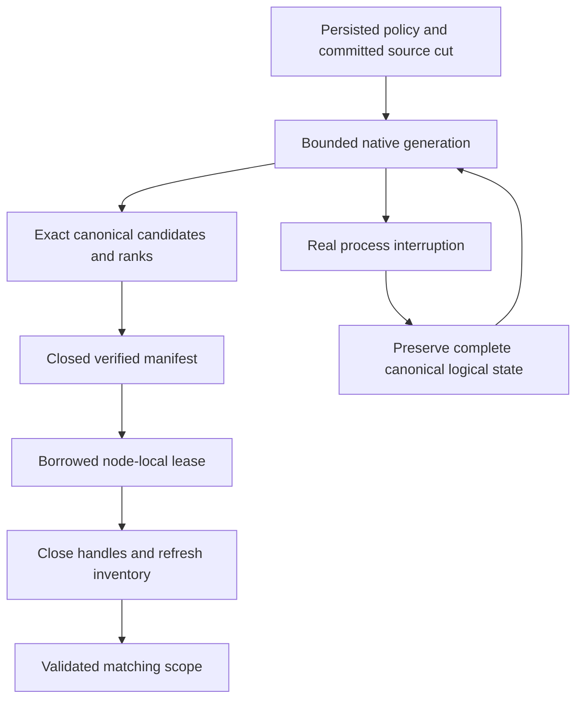

# NativeFullTextProjection within Search

Accepted source contract: [ADR-078](../../ADR/ADR-078-native-full-text-projection.md).
Canonical slice is Search; the owner selected ZoneTree.FullTextSearch in ADR-071.
KL-029's native candidate generation is distinct from KL-039's broader online
index-management API and KL-097's event-driven projection lineage.

|Requirement|Acceptance and automated evidence|
|---|---|
|REQ-FTS-001: selected actual native provider stays a derived index|AC-FTS-001: published/source-bound1.0.9 and native ZoneTree posting files are used; exact canonical identities/scores/ties and all RRF branch ranks agree on real-store Unicode/digit/short/repeated/missing-field/collision corpus|
|REQ-FTS-002: scope, privacy and freshness remain canonical|AC-FTS-002: source cut/read-generation/incarnation/partition/principal/policy/schema/field mismatch cannot reuse a generation; mutation/delete/revocation/hidden-row tests preserve persisted checks and never leak unauthorized counts or payload|
|REQ-FTS-003: lease, storage and work are bounded|AC-FTS-003: saturation, exact/excess posting/record/token/metadata/disk/file/deadline bounds and cancellation return exact failures without partial success; handles release and following request succeeds|
|REQ-FTS-004: staged generations and restart cannot supply partial truth|AC-FTS-004: actual native write/publication interruption, malformed/unknown/link generation and reopen/rebuild tests preserve canonical bytes, recognize only owned cleanup and serve only a fully verified source cut|
|REQ-FTS-005: physical owner and public RF3 joins are real|AC-FTS-005: node-local handles survive activation routing changes; Docker/Aspire RF3 SDK/official MCP text/hybrid results remain exact after restart/leader loss and current source rebuild|
|REQ-FTS-006: measured qualification is honest|AC-FTS-006: exact-SHA Linux build/TUnit/process/RF3, native package signature and original provider artifacts pass; actual matched scale/resource measurements precede any acceleration claim|
|REQ-FTS-007: native settlement yields the request grain safely|AC-FTS-007: one analytical reservation acquired before scheduling spans the complete awaited default-scheduler search/cleanup; actual native first publish/reuse/replacement, bounds/cancellation and healthy following calls pass; real Docker/Aspire RF3 SDK/official MCP results and node health remain correct through the Orleans request boundary|

Maps: Query/Features/Search cross-assembly contracts + SearchEngine/TextRanker;
Server/Features/Search native owner, Server/StorageRecovery PartitionHost and DI;
UnitTests/Features/Search NativeText*; CrashHost/RecoveryTests/IntegrationTests
Features/Search process/public gates; central dependency pins; this spec/ADR.
Client/MCP wire changes N/A: existing SearchRequest/Search output stay unchanged.
Frontend N/A: no new interactive search UI requested. Canonical storage migration
N/A: the disposable index is reconstructed from unchanged committed epoch6 data.

TASK-FTS-QUERY / NATIVE / TEST depend on root frozen contracts and the completed
epoch source build. Root owns integration, validation, receipts and commits.
TASK-FTS-ASYNC-CONTRACT/INTEGRATE/ORACLE/JOIN map REQ-FTS-007 to AC-FTS-007
under [ADR-081](../../ADR/ADR-081-awaited-native-search-execution.md).
Its concrete oracles are `NativeTextAsyncProjectionTests` (full canonical
publish/reuse/new-cut result parity), `NativeTextAsyncAdmissionTests` (pre-cancel,
real native posting pause, saturation and joined cancellation cleanup), and
`NativeTextAsyncRf3Tests` (actual SDK/official MCP freshness, persisted policy
epochs, credential revocation and healthy three-node status). Their source is
reviewed. The awaited-execution development receipt (report removed from repository)
records normal/scalar2866 tests each with identical identities, recovery228 and
unchanged source/runtime inventories. All three new native unit oracles and10
native-text process cuts pass. Genuine public RF3 liveness and exact delivered-source
Linux outcomes remain separately required; AC-FTS-007 is not fully qualified.
TASK-RF3-ORACLE-REPAIR corrects independently diagnosed catalog, persisted write
grant, metadata-pointer and policy-epoch fixtures; it cannot weaken authorization
or qualify the scheduler repair without genuine RF3 execution.
TASK-FTS-LIFETIME-REPAIR / SETTLEMENT-TEST / CANONICAL-ORACLE map to AC-FTS-003/004:
retain failed-release handles, retain both cancellation and cleanup failures, and
compare all canonical logical key/value state across the real process cuts.

Positive/negative/edge/error cases are the table and ADR; tests use genuine
ZoneTree/native FTS, persisted policy and real client operations. Source-present
work is not acceptance evidence; every qualification gate remains open until its
actual passing artifacts exist.

## Native-text recovery mode dispatch repair

TASK-FTS-RECOVERY-DISPATCH maps REQ/AC-FTS-003/004/005 to the existing ten
`NativeTextProjectionProcessRecoveryTests.AcFts003004005NativeProcessCutsPreserveCanonicalCutAndRebuildSearch`
cases. Their real CrashHost arguments remain exactly source directory, canonical
receipt path, native fault stage, replacement flag and mode. The mode is the
last argument; dispatch must inspect it from the end before ordinary commit-stage
parsing. Preserve the five first-build and five replacement-build process kills,
full canonical digest/raw-record checks, recognized cleanup, native reconstruction
and healthy exact search assertions. No new synthetic argument-only test replaces
these actual operation flows.

Root owns the one-index repair in
`tests/KeyLoad.CrashHost/Features/Search/Helpers/NativeTextCrashScenario.cs`,
source review, current Release build and the Aspire recovery gate. ADR-078 freezes
this helper protocol; product data/wire formats and dependencies do not change.
Local native results remain development evidence. Complete exact-source Linux
recovery and RF3 qualification remain mandatory.

## TASK-KL028-SELECTED-PROVIDER-CAPABILITY-AUDIT-001

REQ-FTS-AUDIT-001 / AC-FTS-AUDIT-001 freezes original KL028 selected-provider audit: retain centrally pinned ZoneTree.FullTextSearch1.0.9/ZoneTree1.9.8 and native IndexOfTokenRecordPreviousToken<ulong,ulong> derived generation. No alternative provider selection. API/test-backed capability matrix:

|Capability|Actual ownership/API|Exact proof/boundary|
|---|---|---|
|Token postings and bounded candidates|NativeTextIndex.Open native primary index, configured synchronous native WAL; native range/token/record keys|NativeTextProjectionParityTests and hash-collision arguments; candidate completeness/revalidation remain KeyLoad-owned|
|English/Ukrainian Unicode query|KeyLoad frozen canonical tokenizer→native token postings→authorized canonical documents|New NativeTextBilingualLifecycleTests exact hello/ПРИВІТ references/fullJSON/revision/redaction and one-branch rank1/61|
|Ranking|KeyLoad exact lexical corpus scoring and RRF over canonical scoped cut|Existing native-vs-canonical Unicode scores/ties/hybrid; no native BM25 promise from postings API|
|Delete and immutable command replay|Canonical authorized DeleteDocument atomic command, source-cut generation replacement|New delete removes only Ukrainian result; complete same-ID receipt bytes/store-position/allbytes stable; English unchanged|
|Native reopen/rebuild|Dispose selected native projection and canonical ZoneTree, reopen canonical owner and same native projection root|New deleted output/English full literal retained, unknown principal denied with full-store no-effect, healthy continuation|
|Authorization/freshness|Persisted canonical policy/readcut governs candidates|Existing NativeTextProjectionAuthorityTests revocation/hidden rows/field denial/stale revision; new unknown-principal denial|
|Analyzer/stemming/stopwords/phrase/public grammar|Not exposed by current KeyLoad public text profile|Explicit unsupported/unavailable capabilities, no inferred provider parity or silently selectable analyzer|
|Formats/migration|Current typed owned projection manifest/index generation; disposable rebuild only|Existing malformed/unknown/link native projection tests; no Lucene index compatibility, migration or legacy fallback|

AC pass requires actual new native normal/scalar test plus original existing parity/authority/restart outcomes bound to same-source compile identities. No small corpus performance/recall/license delivery claim; RF3/package signature/resource/endurance gates remain independent. New case uses real ZoneTree and selected native provider, no fake/tokenizer injection/product seam. Docs/ADR freeze precedes assembled implementation; root owns join/build/native execution. Rollback removes only audit regression/docs, stored formats/dependencies unchanged.

R2: independent original delete commandId/partition/position and single full literal mutation bytes (deleteDocument, collection, Ukrainian ID, revision2), exact outer immutable operation ID on first submit and replay, full replay receipt/allstore/position preserved; final healthy postdenial cut equality required. Source-only; native execution remains pending.

## KL029 explicit disposable-projection removal operation

TASK-FTS-PROJECTION-REMOVAL maps original KL-029 projection deletion/rebuild and stale-revision criteria to existing REQ/AC-FTS-002/004 (ADR-078; no format/public authority change). `NativeTextProjectionRemovalTests.RemovedNativeProjectionRebuildsOnlyCurrentLiteralRowsAndHealthyWritesRemainVisible` builds a real native generation, disposes it before removing only its fixture-owned disposable root, commits canonical replacement and deletion, then constructs the existing native owner at the same absent root. Independent literal results require revision2 replacement and no old/deleted postings; complete native store bytes/position remain unchanged through both queries. A further real revision1 document insert must become visible through native replacement with exact ordered documents/scores. No fabricated index/reference, manual native handle deletion, process-kill/power-loss or incremental outbox-replay claim. Existing ten genuine process cuts remain independently required. Source-authored only: normal/scalar native execution and exact-source Linux evidence are pending.

## TASK-KL028-RF3-IMMUTABLE-TEXT-REPLAY-001

REQ-FTS-AUDIT-001 / AC-FTS-AUDIT-001 and REQ/AC-FTS-005: extend the existing AcFts005UpdatedTextAndNativeProjectionRecoverAcrossLeaderLossAndRestart flow, retaining its original SDK atomic text/vector update and delete command and complete quorum receipt. After elected leader kill and existing actual survivor readiness, freshly connect the official MCP administrator and submit the exact original immutable command ID/payload once. Require all complete native receipt bytes equal the original; independently check command ID, atomic partition, positive native token authority, durability and all three literal mutation receipts. No replay loop or accepted OwnershipLost branch.

Before and after replay and after all original nodes rejoin, SDK and official MCP search must equal independent complete ordered literal document/rank oracles: replaced English text, removed Ukrainian/original English postings, surviving vector ranking and deleted document absence. Canonical document revision remains2 and deleted document remains absent. Current redaction policy and original caller identity are retained. There is no cross-node cut equality claim; replay retains the historical token exactly. Original resource restart/diagnostics/primary and cleanup ownership, deadlines and closed coverage inventory are unchanged. No LocalImage selector expansion.

Ownership: existing Search/Cases/NativeTextRf3LeaderLossTests.cs plus feature-local Search/Assertions/NativeTextRf3ReplayAssertions.cs. Root joins and executes native RF3 filter /*/*/NativeTextRf3LeaderLossTests/AcFts005UpdatedTextAndNativeProjectionRecoverAcrossLeaderLossAndRestart. Actual original Linux AcFts005 PASS is historical; these added assertions require a new exact-source native execution. No KL028 closure, full-provider/BM25/resource/performance qualification claimed.

## c028 AC-FTS-005 fixed-corpus result mismatch evidence

TASK-C028-FTS-RESULT-DIAGNOSTIC-001 retains the original complete canonical JSON result equality for each actual SDK and official MCP search in AcFts005UpdatedTextAndNativeProjectionRecoverAcrossLeaderLossAndRestart. Its bounded assertion reason reports only client path, result counts and at most three row ordinals with fixed field-difference categories (reference/revision/projected JSON/redaction/score bits/explanation). No document JSON, identity, grant, credential, query text or private field values are emitted. Existing immutable receipt replay, all-node restoration, exact ranks and joined cleanup remain unchanged. The original c028 failure retained no actual result body; source inspection does not establish its cause or runtime success. ADR: N/A; this adds bounded fixture-owned evidence to the unchanged native publication/failover operation contract.
