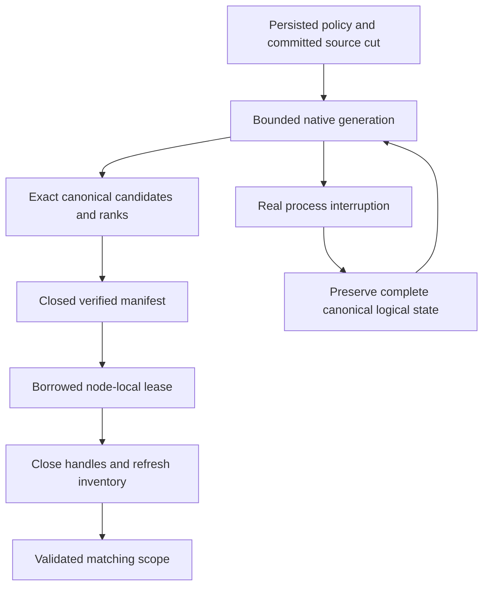

# NativeFullTextProjection within Search

Accepted source contract: [ADR-078](../../ADR/ADR-078-native-full-text-projection.md).
Canonical slice is Search; the owner selected ZoneTree.FullTextSearch in ADR-071.
KL-029's native candidate generation is distinct from KL-039's broader online
index-management API and KL-097's event-driven projection lineage.

|Requirement|Acceptance and automated evidence|
|---|---|
|REQ-FTS-001: selected actual native provider stays a derived index|AC-FTS-001: published/source-bound1.0.9 and native ZoneTree posting files are used; exact canonical identities/scores/ties and all RRF branch ranks agree on real-store Unicode/digit/short/repeated/missing-field/collision corpus|
|REQ-FTS-002: scope, privacy and freshness remain canonical|AC-FTS-002: source cut/read-generation/incarnation/partition/principal/policy/schema/field mismatch cannot reuse a generation; mutation/delete/revocation/hidden-row tests preserve persisted checks and never leak unauthorized counts or payload|
|REQ-FTS-003: lease, storage and work are bounded|AC-FTS-003: saturation, exact/excess posting/record/token/metadata/disk/file/deadline bounds and cancellation return exact failures without partial success; handles release and following request succeeds|
|REQ-FTS-004: staged generations and restart cannot supply partial truth|AC-FTS-004: actual native write/publication interruption, malformed/unknown/link generation and reopen/rebuild tests preserve canonical bytes, recognize only owned cleanup and serve only a fully verified source cut|
|REQ-FTS-005: physical owner and public RF3 joins are real|AC-FTS-005: node-local handles survive activation routing changes; Docker/Aspire RF3 SDK/official MCP text/hybrid results remain exact after restart/leader loss and current source rebuild|
|REQ-FTS-006: measured qualification is honest|AC-FTS-006: exact-SHA Linux build/TUnit/process/RF3, native package signature and original provider artifacts pass; actual matched scale/resource measurements precede any acceleration claim|
|REQ-FTS-007: native settlement yields the request grain safely|AC-FTS-007: one analytical reservation acquired before scheduling spans the complete awaited default-scheduler search/cleanup; actual native first publish/reuse/replacement, bounds/cancellation and healthy following calls pass; real Docker/Aspire RF3 SDK/official MCP results and node health remain correct through the Orleans request boundary|

Maps: Query/Features/Search cross-assembly contracts + SearchEngine/TextRanker;
Server/Features/Search native owner, Server/StorageRecovery PartitionHost and DI;
UnitTests/Features/Search NativeText*; CrashHost/RecoveryTests/IntegrationTests
Features/Search process/public gates; central dependency pins; this spec/ADR.
Client/MCP wire changes N/A: existing SearchRequest/Search output stay unchanged.
Frontend N/A: no new interactive search UI requested. Canonical storage migration
N/A: the disposable index is reconstructed from unchanged committed epoch6 data.

TASK-FTS-QUERY / NATIVE / TEST depend on root frozen contracts and the completed
epoch source build. Root owns integration, validation, receipts and commits.
TASK-FTS-ASYNC-CONTRACT/INTEGRATE/ORACLE/JOIN map REQ-FTS-007 to AC-FTS-007
under [ADR-081](../../ADR/ADR-081-awaited-native-search-execution.md).
Its concrete oracles are `NativeTextAsyncProjectionTests` (full canonical
publish/reuse/new-cut result parity), `NativeTextAsyncAdmissionTests` (pre-cancel,
real native posting pause, saturation and joined cancellation cleanup), and
`NativeTextAsyncRf3Tests` (actual SDK/official MCP freshness, persisted policy
epochs, credential revocation and healthy three-node status). Their source is
reviewed. The awaited-execution development receipt (report removed from repository)
records normal/scalar2866 tests each with identical identities, recovery228 and
unchanged source/runtime inventories. All three new native unit oracles and10
native-text process cuts pass. Genuine public RF3 liveness and exact delivered-source
Linux outcomes remain separately required; AC-FTS-007 is not fully qualified.
TASK-RF3-ORACLE-REPAIR corrects independently diagnosed catalog, persisted write
grant, metadata-pointer and policy-epoch fixtures; it cannot weaken authorization
or qualify the scheduler repair without genuine RF3 execution.
TASK-FTS-LIFETIME-REPAIR / SETTLEMENT-TEST / CANONICAL-ORACLE map to AC-FTS-003/004:
retain failed-release handles, retain both cancellation and cleanup failures, and
compare all canonical logical key/value state across the real process cuts.

Positive/negative/edge/error cases are the table and ADR; tests use genuine
ZoneTree/native FTS, persisted policy and real client operations. Source-present
work is not acceptance evidence; every qualification gate remains open until its
actual passing artifacts exist.
