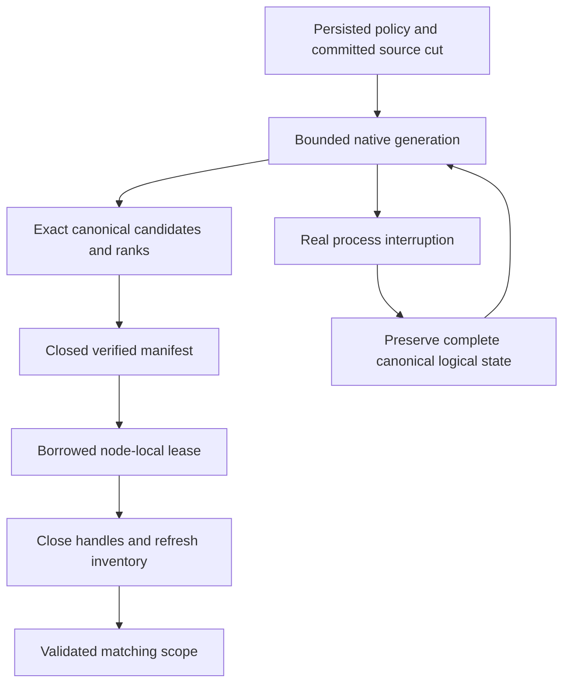

# NativeFullTextProjection within Search

Accepted source contract: [ADR-078](../../ADR/ADR-078-native-full-text-projection.md).
Canonical slice is Search; the owner selected ZoneTree.FullTextSearch in ADR-071.
KL-029's native candidate generation is distinct from KL-039's broader online
index-management API and KL-097's event-driven projection lineage.

|Requirement|Acceptance and automated evidence|
|---|---|
|REQ-FTS-001: selected actual native provider stays a derived index|AC-FTS-001: published/source-bound1.0.9 and native ZoneTree posting files are used; exact canonical identities/scores/ties and all RRF branch ranks agree on real-store Unicode/digit/short/repeated/missing-field/collision corpus|
|REQ-FTS-002: scope, privacy and freshness remain canonical|AC-FTS-002: source cut/read-generation/incarnation/partition/principal/policy/schema/field mismatch cannot reuse a generation; mutation/delete/revocation/hidden-row tests preserve persisted checks and never leak unauthorized counts or payload|
|REQ-FTS-003: lease, storage and work are bounded|AC-FTS-003: saturation, exact/excess posting/record/token/metadata/disk/file/deadline bounds and cancellation return exact failures without partial success; handles release and following request succeeds|
|REQ-FTS-004: staged generations and restart cannot supply partial truth|AC-FTS-004: actual native write/publication interruption, malformed/unknown/link generation and reopen/rebuild tests preserve canonical bytes, recognize only owned cleanup and serve only a fully verified source cut|
|REQ-FTS-005: physical owner and public RF3 joins are real|AC-FTS-005: node-local handles survive activation routing changes; Docker/Aspire RF3 SDK/official MCP text/hybrid results remain exact after restart/leader loss and current source rebuild|
|REQ-FTS-006: measured qualification is honest|AC-FTS-006: exact-SHA Linux build/TUnit/process/RF3, native package signature and original provider artifacts pass; actual matched scale/resource measurements precede any acceleration claim|
|REQ-FTS-007: native settlement yields the request grain safely|AC-FTS-007: one analytical reservation acquired before scheduling spans the complete awaited default-scheduler search/cleanup; actual native first publish/reuse/replacement, bounds/cancellation and healthy following calls pass; real Docker/Aspire RF3 SDK/official MCP results and node health remain correct through the Orleans request boundary|

Maps: Query/Features/Search cross-assembly contracts + SearchEngine/TextRanker;
Server/Features/Search native owner, Server/StorageRecovery PartitionHost and DI;
UnitTests/Features/Search NativeText*; CrashHost/RecoveryTests/IntegrationTests
Features/Search process/public gates; central dependency pins; this spec/ADR.
Client/MCP wire changes N/A: existing SearchRequest/Search output stay unchanged.
Frontend N/A: no new interactive search UI requested. Canonical storage migration
N/A: the disposable index is reconstructed from unchanged committed epoch6 data.

TASK-FTS-QUERY / NATIVE / TEST depend on root frozen contracts and the completed
epoch source build. Root owns integration, validation, receipts and commits.
TASK-FTS-ASYNC-CONTRACT/INTEGRATE/ORACLE/JOIN map REQ-FTS-007 to AC-FTS-007
under [ADR-081](../../ADR/ADR-081-awaited-native-search-execution.md).
Its concrete oracles are `NativeTextAsyncProjectionTests` (full canonical
publish/reuse/new-cut result parity), `NativeTextAsyncAdmissionTests` (pre-cancel,
real native posting pause, saturation and joined cancellation cleanup), and
`NativeTextAsyncRf3Tests` (actual SDK/official MCP freshness, persisted policy
epochs, credential revocation and healthy three-node status). Their source is
reviewed. The awaited-execution development receipt (report removed from repository)
records normal/scalar2866 tests each with identical identities, recovery228 and
unchanged source/runtime inventories. All three new native unit oracles and10
native-text process cuts pass. Genuine public RF3 liveness and exact delivered-source
Linux outcomes remain separately required; AC-FTS-007 is not fully qualified.
TASK-RF3-ORACLE-REPAIR corrects independently diagnosed catalog, persisted write
grant, metadata-pointer and policy-epoch fixtures; it cannot weaken authorization
or qualify the scheduler repair without genuine RF3 execution.
TASK-FTS-LIFETIME-REPAIR / SETTLEMENT-TEST / CANONICAL-ORACLE map to AC-FTS-003/004:
retain failed-release handles, retain both cancellation and cleanup failures, and
compare all canonical logical key/value state across the real process cuts.

Positive/negative/edge/error cases are the table and ADR; tests use genuine
ZoneTree/native FTS, persisted policy and real client operations. Source-present
work is not acceptance evidence; every qualification gate remains open until its
actual passing artifacts exist.

## Native-text recovery mode dispatch repair

TASK-FTS-RECOVERY-DISPATCH maps REQ/AC-FTS-003/004/005 to the existing ten
`NativeTextProjectionProcessRecoveryTests.AcFts003004005NativeProcessCutsPreserveCanonicalCutAndRebuildSearch`
cases. Their real CrashHost arguments remain exactly source directory, canonical
receipt path, native fault stage, replacement flag and mode. The mode is the
last argument; dispatch must inspect it from the end before ordinary commit-stage
parsing. Preserve the five first-build and five replacement-build process kills,
full canonical digest/raw-record checks, recognized cleanup, native reconstruction
and healthy exact search assertions. No new synthetic argument-only test replaces
these actual operation flows.

Root owns the one-index repair in
`tests/KeyLoad.CrashHost/Features/Search/Helpers/NativeTextCrashScenario.cs`,
source review, current Release build and the Aspire recovery gate. ADR-078 freezes
this helper protocol; product data/wire formats and dependencies do not change.
Local native results remain development evidence. Complete exact-source Linux
recovery and RF3 qualification remain mandatory.

## TASK-KL028-SELECTED-PROVIDER-CAPABILITY-AUDIT-001

REQ-FTS-AUDIT-001 / AC-FTS-AUDIT-001 freezes original KL028 selected-provider audit: retain centrally pinned ZoneTree.FullTextSearch1.0.9/ZoneTree1.9.8 and native IndexOfTokenRecordPreviousToken<ulong,ulong> derived generation. No alternative provider selection. API/test-backed capability matrix:

|Capability|Actual ownership/API|Exact proof/boundary|
|---|---|---|
|Token postings and bounded candidates|NativeTextIndex.Open native primary index, configured synchronous native WAL; native range/token/record keys|NativeTextProjectionParityTests and hash-collision arguments; candidate completeness/revalidation remain KeyLoad-owned|
|English/Ukrainian Unicode query|KeyLoad frozen canonical tokenizer→native token postings→authorized canonical documents|New NativeTextBilingualLifecycleTests exact hello/ПРИВІТ references/fullJSON/revision/redaction and one-branch rank1/61|
|Ranking|KeyLoad exact lexical corpus scoring and RRF over canonical scoped cut|Existing native-vs-canonical Unicode scores/ties/hybrid; no native BM25 promise from postings API|
|Delete and immutable command replay|Canonical authorized DeleteDocument atomic command, source-cut generation replacement|New delete removes only Ukrainian result; complete same-ID receipt bytes/store-position/allbytes stable; English unchanged|
|Native reopen/rebuild|Dispose selected native projection and canonical ZoneTree, reopen canonical owner and same native projection root|New deleted output/English full literal retained, unknown principal denied with full-store no-effect, healthy continuation|
|Authorization/freshness|Persisted canonical policy/readcut governs candidates|Existing NativeTextProjectionAuthorityTests revocation/hidden rows/field denial/stale revision; new unknown-principal denial|
|Analyzer/stemming/stopwords/phrase/public grammar|Not exposed by current KeyLoad public text profile|Explicit unsupported/unavailable capabilities, no inferred provider parity or silently selectable analyzer|
|Formats/migration|Current typed owned projection manifest/index generation; disposable rebuild only|Existing malformed/unknown/link native projection tests; no Lucene index compatibility, migration or legacy fallback|

AC pass requires actual new native normal/scalar test plus original existing parity/authority/restart outcomes bound to same-source compile identities. No small corpus performance/recall/license delivery claim; RF3/package signature/resource/endurance gates remain independent. New case uses real ZoneTree and selected native provider, no fake/tokenizer injection/product seam. Docs/ADR freeze precedes assembled implementation; root owns join/build/native execution. Rollback removes only audit regression/docs, stored formats/dependencies unchanged.

R2: independent original delete commandId/partition/position and single full literal mutation bytes (deleteDocument, collection, Ukrainian ID, revision2), exact outer immutable operation ID on first submit and replay, full replay receipt/allstore/position preserved; final healthy postdenial cut equality required. Source-only; native execution remains pending.

## KL029 explicit disposable-projection removal operation

TASK-FTS-PROJECTION-REMOVAL maps original KL-029 projection deletion/rebuild and stale-revision criteria to existing REQ/AC-FTS-002/004 (ADR-078; no format/public authority change). `NativeTextProjectionRemovalTests.RemovedNativeProjectionRebuildsOnlyCurrentLiteralRowsAndHealthyWritesRemainVisible` builds a real native generation, disposes it before removing only its fixture-owned disposable root, commits canonical replacement and deletion, then constructs the existing native owner at the same absent root. Independent literal results require revision2 replacement and no old/deleted postings; complete native store bytes/position remain unchanged through both queries. A further real revision1 document insert must become visible through native replacement with exact ordered documents/scores. No fabricated index/reference, manual native handle deletion, process-kill/power-loss or incremental outbox-replay claim. Existing ten genuine process cuts remain independently required. Source-authored only: normal/scalar native execution and exact-source Linux evidence are pending.

## TASK-KL028-RF3-IMMUTABLE-TEXT-REPLAY-001

REQ-FTS-AUDIT-001 / AC-FTS-AUDIT-001 and REQ/AC-FTS-005: extend the existing AcFts005UpdatedTextAndNativeProjectionRecoverAcrossLeaderLossAndRestart flow, retaining its original SDK atomic text/vector update and delete command and complete quorum receipt. After elected leader kill and existing actual survivor readiness, freshly connect the official MCP administrator and submit the exact original immutable command ID/payload once. Require all complete native receipt bytes equal the original; independently check command ID, atomic partition, positive native token authority, durability and all three literal mutation receipts. No replay loop or accepted OwnershipLost branch.

Before and after replay and after all original nodes rejoin, SDK and official MCP search must equal independent complete ordered literal document/rank oracles: replaced English text, removed Ukrainian/original English postings, surviving vector ranking and deleted document absence. Canonical document revision remains2 and deleted document remains absent. Current redaction policy and original caller identity are retained. There is no cross-node cut equality claim; replay retains the historical token exactly. Original resource restart/diagnostics/primary and cleanup ownership, deadlines and closed coverage inventory are unchanged. No LocalImage selector expansion.

Ownership: existing Search/Cases/NativeTextRf3LeaderLossTests.cs plus feature-local Search/Assertions/NativeTextRf3ReplayAssertions.cs. Root joins and executes native RF3 filter /*/*/NativeTextRf3LeaderLossTests/AcFts005UpdatedTextAndNativeProjectionRecoverAcrossLeaderLossAndRestart. Actual original Linux AcFts005 PASS is historical; these added assertions require a new exact-source native execution. No KL028 closure, full-provider/BM25/resource/performance qualification claimed.

## c028 AC-FTS-005 fixed-corpus result mismatch evidence

TASK-C028-FTS-RESULT-DIAGNOSTIC-001 retains the original complete canonical JSON result equality for each actual SDK and official MCP search in AcFts005UpdatedTextAndNativeProjectionRecoverAcrossLeaderLossAndRestart. Its bounded assertion reason reports only client path, result counts and at most three row ordinals with fixed field-difference categories (reference/revision/projected JSON/redaction/score bits/explanation). No document JSON, identity, grant, credential, query text or private field values are emitted. Existing immutable receipt replay, all-node restoration, exact ranks and joined cleanup remain unchanged. The original c028 failure retained no actual result body; source inspection does not establish its cause or runtime success. ADR: N/A; this adds bounded fixture-owned evidence to the unchanged native publication/failover operation contract.

## TASK-KL029-INCREMENTAL-TEXT-CHECKPOINT-001 — draft implementation contract

# KL029 incremental native text prerequisite

Source-only draft, 2026-10-08. No runtime or acceptance claim. Root owns join, build, generated contracts, native Linux qualification and status.

Original KL029: index worker, checkpoint, deletes, analyzer generations, initial maintenance rebuild; removal plus replay restores expected results; a checkpoint crash cannot hide missing updates; a stale revision cannot resurrect. Existing ADR078 format1 native generations explicitly reconstruct the complete source cut. Their ten process cuts are retained and are not incremental replay evidence.

## Authority and ownership

REQ-FTS-INCREMENTAL-001 / AC-FTS-INCREMENTAL-001: canonical documents and persisted projection consumer remain authority. A PartitionHost-owned explicit native text maintenance operation is invoked through the existing separately authorized request grain. Fresh persisted cluster-administrator authority is required for every seed, page, publication, ACK, restore and release. Internal services never manufacture a principal or commit directly around the protected database capability. No background dispatcher or implicit query-time ACK.

Reuse ANN's additive ReadProjectionBatchRequest Id3 ThroughSequence and native validation as an explicit dependency; do not independently modify shared contracts. Consumer generation/resources/kinds are immutable, resources select the actual collection, kinds exactly putDocument/patchDocument/deleteDocument. Fixed upper bound is obtained from the actual same-cut canonical snapshot/head/active-consumer authority; missing retained history returns HistoryUnavailable. A released or replaced consumer cannot authorize old work.

The initial seed is a bounded complete current canonical corpus at a pinned upper sequence. Bootstrap ACKs may cover only native batches through that same captured upper after seed completeness is independently verified; they are not incremental application evidence. Subsequent pages must apply their actual chronological Before/After changes. Current source/corpus/policy/schema verification is mandatory before publication; no seed based on an unrelated read cut.

REQ-FTS-INCREMENTAL-002 / AC-FTS-INCREMENTAL-002: a distinct generated-Orleans current-format incremental generation lives in a separate owned text-projections root. No reinterpretation or fallback to ADR078 format1. Its receipt binds physical NodeId/incarnation/data epoch, atomic partition, collection, field, analyzer/hash versions, consumer/name/generation, canonical upper/dependency digest, stable native record IDs, revisions/deleted tombstones, checkpoint and actual tracked native paths/inventory. IDs are positive, unique, monotonic and never reused within generation; bounded metadata including tombstones obeys existing MaxScanRecords. No retained JSON body copy. Existing query generation/default container behavior remain unchanged until explicit query integration is joined.

## Actual native update and crash order

REQ-FTS-INCREMENTAL-003 / AC-FTS-INCREMENTAL-003: serialize one page and generation mutation under the node-local owner gate; no mutation while a borrowed query lease exists. Before the first posting change, durably persist a checksummed typed pending intent with exact consumer/generation/after/through, signed native batch token, stable references/revisions and bounded old/new hashed token triples. Derive triples with the existing canonical NFKC/Rune tokenizer and SHA256-le64-v1; charge the same budget before retained allocation. Actual native IndexOfTokenRecordPreviousToken<ulong,ulong>.DeleteRecord(token,id,previousToken) and UpsertRecord(token,id,previousToken) implement updates/deletes. Do not call DeleteRecord(id): pinned source scans the complete index without the caller budget. No repeated full rebuild for ordinary page application.

Apply exact deletions then additions, idempotently. Preserve deleted record revision tombstones; older revisions fail closed rather than overwrite. Native WAL is synchronous. Close/join native handles and capture actual inventory before durable complete generation checkpoint publication. Only then issue the canonical CommitProjectionBatchRequest with exact original command ID/token/empty effects. Retain its exact full receipt; after ACK joins, retire pending intent. Checkpoint never advances beyond durable native publication; source bytes and projection effects remain distinct.

On crash before publication, the original durable intent owns partially applied native postings; reopen and replay those exact deletions/additions, never serve the partial generation. Crash after publication/before ACK resumes only the exact original canonical ACK; fresh authorization still applies. Crash after ACK/before intent removal uses the immutable existing receipt and stable checkpoint. Mismatched intent/receipt/generation/checksum/native inventory fails closed and is preserved. No generic retry loop, fresh command ID, source-history guess, legacy format or missing-update success.

REQ-FTS-INCREMENTAL-004 / AC-FTS-INCREMENTAL-004: public search always uses fresh canonical row/field authorization and complete literal source/revision validation under one read cut. Native index contains derived hashes, never authorizes output or ranking. Preserve existing exact lexical/RRF arithmetic, token/deadline/read/grant owner and no partial result. Policy/schema/incarnation/cut mismatch cannot reuse old publication. A replaced/deleted document cannot reappear from stale native postings. Query hookup requires an explicit stable-ID lookup lease; current ordinal-only NativeTextProjectionLease cannot be silently reused.

## Verification and files

REQ-FTS-INCREMENTAL-005 / AC-FTS-INCREMENTAL-005: real native bilingual fixture seeds Ukrainian/English literal documents; actual same-ID update/delete receipts, chronological bounded pages and generation checkpoint. Real CrashHost pauses at intent flush, first native deletion, first native addition, native inventory settled, checkpoint publication, canonical ACK completed and pending retirement. Existing process ownership kills only that child, joins its stdout/stderr/exit and every native handle/store lock; reopen canonical ZoneTree and selected native FTS, resume original intent, compare complete canonical document/outbox/consumer/receipt state and literal current results. Exact same command replay never duplicates effects or advances receipt position; healthy subsequent append/update/search and final reopen remain literal. Negative stale revision, expired/released consumer, original token cancellation, budget and malformed intent preserve state; repair then healthy continuation. Process-kill only, no power-loss claim.

Source ownership: Server/Search/{Contracts,Serialization,Validation,Storage,Lifecycle,Execution} NativeTextIncremental*; Query/Search contracts/execution stable-ID lease adapter only when integrated; Orleans/ClusterRouting typed maintenance capability and existing request-grain composition; PartitionHost lifecycle/registration joins root-owned; UnitTests/Search real operation fixtures; CrashHost/RecoveryTests/Search new native incremental mode and cases; docs NativeFullTextProjection/ADR078 + required storage-fault ADR030 append. Shared ANN ChangeFeeds files are dependencies, not independently authored replacements. Type200/method64/file400, existing bounded caps/deadlines/cancellation and joined primary+cleanup policy remain mandatory.

Ordered stage: freeze source/dependency/API contract; implement owned typed generation/intent + exact native page writer; route explicit protected maintenance/checkpoint/ACK through original request capability; integrate source-verified stable-ID query lease; implement native unit and real-process whole flows; peer review; root guarded join/full build/native discovery/normal/scalar/recovery/RF3. Rollback releases exact consumer and removes only verified disposable owned generation after handles join; canonical outbox/receipts unchanged. No task closure until original criteria receive genuine bound Linux PASS.

## Pinned API evidence

NuGet package1.0.9 nuspec source c0993e2c65186708f3b087741082545bf49224fd. Official source:
https://raw.githubusercontent.com/koculu/ZoneTree.FullTextSearch/c0993e2c65186708f3b087741082545bf49224fd/src/ZoneTree.FullTextSearch/Index/IndexOfTokenRecordPreviousToken.cs
Public exact-triple deletion lines226–243; public upsert203–219; complete-index delete249–263/270–273; native background cancel/join167–180. Implementation must use actual tracked IFileStreamProvider, pinned synchronous WAL and existing joined provider lifecycle. Original current package/DLL hashes will be guarded in final manifest; no generated image identity invented.

## Explicit protected parent API amendment

`TextIndexMaintenanceRequest` is the single shared public DTO: Id0 original CommandId; Id1 exact persisted Consumer; Id2 Collection; Id3 canonical Field; Id4 positive IndexGeneration; Id5 actual Guid NodeId; Id6 immutable PhysicalShardRecord placement; Id7 explicit Build/Restore/Release mode. Build captures a bounded complete canonical seed. Restore loads the existing native generation and applies retained canonical outbox updates; it never silently rebuilds. Release fences the generation and releases only its exact canonical pin through a distinct fresh authorized child. The parent itself has no atomic CommitToken; results expose actual canonical child checkpoint receipts separately.

Shared authenticated route is `/v1/search/text/maintain`; on-demand official MCP tool is `keyload_search_text_maintain`. It is a write/effectful maintenance command, not a read DTO or WaitForIndex effect. SDK, official MCP and versioned SQL CALL decode the same DTO through the existing signed unique request parent. Each configure/read/commit/release effect is a fresh signed native child request with original bounded cancellation/frame admission; no parallel dispatcher. Catalog additions layer after ANN without changing initial discovery tools, existing read-DTO counts or selectors.

The exact-through prerequisite is immutable `/private/tmp/keyload-ann-exact-through-dependency-r2-20261008`; its genuine existing applyVectorProjection filter correction is ANN-owned. FTS consumes only putDocument, patchDocument, deleteDocument for one exact collection, with one fixed captured upper U per parent. Native canonical tombstones are included in the initial map so a later resurrection must match the previous revision/digest rather than allocate an unrelated identity.

The original per-readcut format1 native text generation remains untouched. Incremental files live under a distinct `text-projections` root and use new typed manifest/intent aliases. The existing strict native filesystem ledger, real LocalFileStreamProvider, index API and checksummed native envelope may be composed without calling restart-retiring `NativeTextFiles.InitializeRoot`. New startup validates retained complete inventory/pending intent and current ownership rather than deleting all generations. No fallback accepts the old ordinal manifest as incremental metadata.

## Original work budget and current child cancellation

REQ-FTS-INCREMENTAL-007 / AC-FTS-INCREMENTAL-007: one maintenance session retains one original ReadExecutionBudget timestamp, counters, token, grants and byte/result constraints across signed child phases. Each ordered child phase adds its actual current cancellation token through an internal disposable stage scope; Check always preserves original cancellation and deadline and also checks that additional token. Scope removal occurs only after all original stage work joins. Concurrent/nested stage admission is rejected; scope disposal restores the prior no-stage state, never a new budget or deadline. Ordinary query budgets do not allocate the optional stage owner. This is native long-operation composition, not a test hook. The same actual cancellation byte boundary must prove original during-work OCE, no partial publication/ACK, retained original intent and healthy exact immutable recovery.

### Owned publication interruption boundary

A complete checksummed `intent.bin` is required before any posting mutation. A pending manifest file is an uncommitted publication artifact, never a readable index or a format fallback. During replay of that exact persisted original intent, the owner may retire only the exact regular `incremental.pending` artifact after validating the complete intent, native root/generation ownership and unchanged authority. Its original byte bound still applies. It then reapplies the idempotent exact native posting triples, joins flush/disposal, captures the actual inventory and publishes a newly complete current-format manifest. It must not delete an invalid current manifest, normalize corrupt committed intent, or consume arbitrary names. An incomplete `intent.pending` without a complete committed intent is not admitted as replay authority. Canonical checkpoint ACK remains after complete native publication; intent retirement requires the same original canonical ACK and fresh persisted pin/authority/applied-cut verification.

### Generation enrollment and rebuild admission

This bounded first incremental stage admits exactly one durable generation leaf for each exact persisted consumer/generation identity. A complete checksummed generation enrollment binds its initial source scope, physical placement and original Build command before native index work. Build must reject an already enrolled identical consumer/generation rather than creating ambiguous same-identity leaves or silently rebuilding. A released consumer identity is not reusable under the existing canonical consumer contract: an explicit new Build uses a new canonical consumer identity and positive generation. Restore selects the one exact enrolled identity, never ordinal/latest-directory inference. Incomplete enrollment/publication cuts remain truthful rejection boundaries until their explicit fault matrix is qualified; completed-intent replay is the supported process recovery boundary.

### Exact original Build reconciliation

The same immutable original Build command and native payload digest may resume its one enrolled native generation and original persisted checkpoint intent. This is original operation reconciliation, not a second seed or a new mutation identity. A different Build identity or changed native payload on an enrolled consumer/generation is rejected. Restore uses a separately explicit native recovery request. Neither path refreshes a persisted original page token or manufactures ACK success: an expired unACKed original token is still rejected; an actually committed original receipt may be replayed only through the existing canonical exact-intent contract. Enrollment stores only the fixed SHA256 native input identity, not a duplicate user document body.

### Parent admission ceiling

`KeyLoad:TextIndexMaintenance` admits a default maximum of 32 actual replay pages and a hard maximum of 64, further reduced by the existing original CQRS total-frame allowance. It uses existing database page/result bytes, original parent execution/cancellation and native inventory/workspace ceilings. This is a new bounded feature admission policy, not an increase to any existing native timeout, corpus, result, disk or frame cap. Exhaustion rejects with the actual safe bounded failure and retained original intent/checkpoint; it never loops until green or raises the owner deadline.

Native process boundary reuse (owner-approved 2026-10-08): reuse existing feature-owned Action<NativeTextFaultStage> observation only at actual OwnerFlushed after complete native ownership/enrollment durability, first real NativePostingWritten per admitted owner after delete/upsert, NativeInventoryFlushed after native flush/disposal and bounded inventory capture, and ManifestPublished after actual atomic complete publication. No new fault framework, fake storage, per-read callback, test-specific branch, environment hook or deadline change. Existing genuine CrashHostPause/NativeTextCrashBoundary owns typed observation→parent process kill→original readers/exit/store locks. Durable original intent is required before the first actual posting; recovery replays that exact intent and original canonical ACK before retirement. These process-kill trials do not claim power-loss durability.

Parent execution contract: one fresh signed native child per Configure/read-page/local-capability/Checkpoint/release stage under the original CQRS writer token and validated parent expiry; every child reloads current persisted administrator authority. At most one admitted memory session owns an exact generation leaf. Global active-lease/retained-generation/native disk ceilings remain unchanged. Parent page ceiling is the minimum of TextIndexMaintenanceOptions.MaximumReplayPages and the original remaining CQRS frame capacity divided by the exact three per-page progress frames; reserve eight existing-parent terminal/start/recovery frames, never increase limits. An original pending intent is physically replayed/published BEFORE its exact original canonical checkpoint command is reconciled, then fresh acknowledged state settles intent. Historical bootstrap pages ACK without applying older document revisions; only after their original upper is acknowledged does incremental replay advance. Empty pages still create the actual empty native generation when no manifest exists. Terminal success requires no pending intent, completed bootstrap, exact admitted upper/checkpoint and verified actual native inventory; no fabricated parent atomic receipt or hidden write in WaitForIndex.

Release contract: the protected parent first invokes the existing immutable ReleaseProjectionConsumer child and retains its actual ProjectionConsumerInfo result, then a fresh independently signed local capability verifies the exact current released consumer/generation/definition and actual physical source authority. Only that exact tracked native generation may be retired; all registered native owners for its verified leaf must dispose before a bounded strictly validated native directory deletion. Unknown files/reparse/ownership/locks or incomplete deletion are failures with retained roots, not suppressed cleanup or permissive restart. New optional TextIndexMaintenanceResult Id8 ReleasedConsumer carries the genuine existing canonical release result; no parent atomic receipt/token is invented. Partial-file release crash recovery is explicitly unqualified; required incremental posting/publication/ACK crash trials remain distinct.

### Incremental process-cut verification stage

REQ-FTS-INC-009 / AC-FTS-INC-009: the native process case first commits the bilingual seed, original projection pin, native generation and its canonical ACK through the real replica journal/materializer. It then commits one exact revision-2 Ukrainian update and English deletion. The admitted incremental page persists its complete original intent before the actual first posting mutation; the owned child is stopped only at NativePostingWritten, NativeInventoryFlushed or ManifestPublished. Reopen uses the original complete intent, original immutable checkpoint command and actual native index; it must never seed from a replacement complete corpus to conceal incremental recovery. Every case proves complete literal revision-2 documents/tombstone, exact updated postings with no old Ukrainian/English postings, original write receipt replay, actual checkpoint ACK, healthy revision-3 append and final cold reopen. This is process-kill evidence only, not power-loss, RF3 or incremental public query-path qualification.

The exact child owns ReplicaCrashNode canonical/replica stores, a native ReplicaMaterializer and the node-local text maintenance service. Normal exit joins service, materializer, DI owner and all stores while retaining primary plus cleanup errors. The parent owns the actual child, both bounded readers, exact three native lifecycle modes and every known target-store lock through exit; failure retains the original root/evidence. Existing process admission/deadline/output caps are unchanged. No manually written AppliedBytes, alternate journal, new fault framework, timeout extension or owner-name substitution is admitted.

REQ-FTS-INC-010 / AC-FTS-INC-010: the internal signed text capability admits only a nonempty parent/session identity, the actual native node ID, positive generation, defined mode and defined phase. Release phase and Release mode must match exactly; Begin and later replay phases cannot execute a release payload. This shape admission follows the existing signed child/admin boundary and precedes generation filesystem mutation; logical persisted authorization remains freshly reloaded inside the same-cut source capture.

### KL029 process evidence bounds and exact recovery oracle

The private incremental crash stage retains one immutable original two-effect update/delete command and full native receipt, and bounds every typed evidence sidecar at 1,048,576 bytes before allocating or serializing. The fixed corpus admits at most 16 native command entries (resource/seed/consumer/initial ACK/update/recovered ACK/healthy write/healthy ACK); exceeding this closed fixture bound fails rather than truncating. A retained command resumes its original native index, never appends a second index. Existing process-run, cleanup, pipe and storage-trial limits remain unchanged.

`NativeTextIncrementalProcessRecoveryTests.AcFtsInc009DurableIncrementalReplaySurvivesRealPostingInventoryAndPublicationCuts` has three native arguments: NativePostingWritten, NativeInventoryFlushed, ManifestPublished. The owned child first acknowledges a committed initial generation and an actual canonical bilingual update/delete; the next child stops only at the selected actual incremental boundary. Recovery must settle the original durable intent and original canonical checkpoint ACK, retain stable English record 1 (revision 2 tombstone) and Ukrainian record 2 (revision 2), and expose exactly the independently literal two new-token native postings with no original English/Ukrainian postings. Full public document value and the original native receipt are checked independently. Healthy revision 3 then a separate cold child must preserve the complete canonical record digest/count, store position, applied index, all mapped records/postings, original healthy receipt and index identity. Every original child/pipe is joined, both known canonical/replica ownership files checked, and the root retained on failure. This is process-kill evidence only and does not qualify public incremental query selection, RF3, endurance, performance or power loss.

### REQ/AC-FTS-INC-011: observed source versus indexed prefix

A completed immutable original Build remains tied to its original upper U even if canonical head later advances to U′. The public result must explicitly expose nullable native Id9 `IndexedThroughSequence`: Build/Restore return the actual published manifest/checkpoint upper, Release returns null. `Source.ThroughSequence` separately reports the actual fresh authorized canonical observation; it must never be relabelled as the indexed prefix. Completion means the requested immutable bounded prefix settled, not that U′ was indexed. An exact original Build replay after an actual update/delete must preserve the old indexed upper and unchanged canonical cut; a fresh Restore must reach U′ and expose the literal updated/deleted native state. Query selection must reject an index whose indexed upper/authority does not match its required canonical cut; public incremental-query selection remains an explicit subsequent gate. No old receipt is changed or new updates silently claimed from an old index.

REQ/AC-FTS-INC-012: after a real initial native generation and canonical ACK, corrupt one byte of the actual current-format checksummed manifest. A real fresh Restore must throw exact fatal Corruption before checkpoint/native publication, preserve the complete canonical bytes/position and the damaged evidence file, and never fall back to an implicit rebuild. Restore the exact original bytes through an owned repair stage that retains primary plus repair failure; the same Restore identity then completes healthy against the original generation. The test is NativeTextIncrementalCorruptionTests.DamagedNativeManifestRejectsWithoutCanonicalEffectsThenExactRepairRestoresHealthy. Native process/RF3 gates remain separately required.

### REQ/AC-FTS-INC-013 protected parent Core boundary

MaintainTextIndex is an Orleans parent, not a Core atomic payload. The exact mapping oracle classifies it alongside existing parent-only kinds, retaining every genuine Core kind. The actual configured fixture rejects standalone CreateNativeOperation with UnsupportedCapability and exact safe detail before any canonical bytes/position change, then completes protected native maintenance. No invented atomic DTO; execution pending.

#### AC-FTS-INC-010 canonical owner root boundary correction
The maintenance service accepts the physical canonical directory and owns only its exact text-projections child. Strict generation-root validation never scans canonical node files as generation leaves. Unit, CrashHost and PartitionHost all pass the same original physical-root convention; no relaxation of root/layout verification. Actual native lifecycle execution remains required.

### REQ/AC-FTS-INC-014–016 selected maintained query generation

## Exact additive public/provider boundary
SearchRequest Id13 optional TextIndexSelectionV1(consumer,generation), JSON omitted null; no new operation/route/tool. Selection requires an actual nonempty text branch and exact same logical partition. Existing SDK/MCP/Q1 bind the same request/schema. Query calls feature-owned ISelectedTextProjection.AcquireSelected with original IKeyValueView, freshly admitted principal/resource and original budget; selected provider cannot fall back to bootstrap. Existing unselected Acquire signature/behavior unchanged. Selected lease implements same canonical token visitation/candidate verification contract, using stable manifest IDs rather than visitation ordinals. Physical index is owned by a generation reader slot with bounded readers; maintenance waits original readers before mutation/retirement, shutdown joins them. Required cut/corpus captured in the same view, never external cached authority.

Actual update/delete makes selected prefix stale: reject HistoryUnavailable/no partial/full canonical state unchanged; explicit Restore returns literal bilingual updated/deleted results. Cold reopen and same-ID replay, genuine native-work cancellation, release/publication/shutdown with a retained original reader are mandatory actual-operation tests. No native evidence yet.

### REQ/AC-FTS-INC-017 genuine selected native work observation
The feature-owned slot records readonly successful original native posting iterator advances, keyed internally by exact persisted consumer/generation. Increment once after actual NoRefresh Next succeeds, before inspecting/copying its key. No callback, payload, public endpoint or fake progress. Existing operation TimeProvider may observe this counter for genuine cancellation/diagnostic accounting. Every advance retains original budget charge and token/deadline checks; cancellation must return original token/no partial after actual native work, join lease/index owners, preserve complete canonical state/cut and permit literal healthy follow-up. Counter lifetime is the actual slot, not budget reset or authority.

Shared composite admission uses the SAME validated MaximumActiveLeases ceiling across unselected bootstrap readers and selected maintained readers. Bootstrap provider retains its existing scope/build/ranking behavior; composite acquires the partition-owned shared read admission before delegating and transfers it into the original bootstrap lease wrapper. Maintenance cannot overlap native reader physical owners, and shutdown joins both original reader kinds before files. No duplicated per-provider aggregate allowance.

Selected query process evidence uses the existing original incremental process cuts and cold recover/verify children. Native result evidence adds exact full selected Ukrainian page plus both removed-term queries; each child opens the maintained generation through the same shared admission/slot ownership and fresh original canonical query view, never rebuilds it. Recovered update is literal revision 2; healthy/cold verification is literal revision 3; deleted English and old Ukrainian terms stay empty. Original canonical/native receipt/checkpoint/inventory/cut assertions remain intact. Selected native index ownership stays in its slot; borrowers retain a non-disposable iterator-owner interface and directly join/dispose their original iterator.

Fresh-caller acceptance persists an ordinary Query/DocumentsRead principal before generation build, proves a literal selected page, then genuinely revokes that same principal with increasing policy epoch. Exact Unauthenticated/no partial, unchanged complete canonical image/cut precedes a legitimate root healthy call. Authorization rejection must precede generation lookup; a missing generation cannot turn that rejection into source-history information. No cached generation principal authorizes the caller.

Explicit release acceptance uses the original canonical ReleaseProjectionConsumer command and byte-identical same-ID receipt replay, then the original protected local maintenance Release capability. After all original selected readers settle, selected generation lookup fails exact HistoryUnavailable with no partial/canonical changes; the current unselected API remains a legitimate literal healthy control. The separate actual held-reader shutdown flow verifies native reader lease settlement before generation-owner cleanup.

## Selected-generation automated trace (source only)

- REQ/AC-FTS-INC-014–017: NativeTextSelectedGenerationTests.MaintainedBilingualGenerationRejectsRealUpdateDeleteUntilExplicitRestoreThenReturnsLiteralRows includes persisted ordinary caller, increasing-epoch revoke, auth-before-missing-generation, complete literal bilingual pages, actual update/delete, exact stale denial/no effects, explicit Restore, canonical release/original receipt replay/local release and literal healthy unselected continuation.
- NativeTextSelectedCancellationTests.CancellationAfterActualMaintainedPostingReadJoinsOriginalLeaseWithoutPartialThenReadsLiteralHealthy observes only successful original iterator.Next for the exact consumer/generation, preserves original cancellation token, null partial and complete canonical state/cut before same-request literal healthy control.
- NativeTextSelectedShutdownTests.ShutdownClosesNewAdmissionAndJoinsActualNativeReaderBeforeColdOwnerReturnsSameLiteralPage holds actual observed native work under existing TimeProvider composition, closes new admission, settles original reader then owner and cold-opens the same persisted generation with a literal page.
- Existing NativeTextIncrementalProcessRecoveryTests and its real CrashHost recover/verify operation retain all original cuts/native snapshots/receipts/checkpoint/tombstone/original process+reader+lock ownership, adding complete selected Ukrainian page and literal old Ukrainian/deleted English emptiness after recovery, healthy revision and final cold child. This is process-kill recovery, not power-loss durability.
- Existing NativeTextMaintenanceRf3Tests four original SDK/official MCP/SDK-Q1/MCP-Q1 arguments add full selected literal pages and exact stale envelope/detail. No selector, LocalImage allowlist, catalog count or deadline is expanded.

No native compiler/test/CI execution, generated UID/image binding, performance, broad feature or original task closure is asserted by this private packet.

### Selected-generation safe MCP failure parity

REQ-FTS-SELECT-014 / AC-FTS-SELECT-014: the bounded native MCP writer admits exactly ErrorCode.HistoryUnavailable paired with the fixed literal `The native text projection does not match the authorized source cut.`. Actual selected stale reads across official MCP and MCP Q1 retain the same error, null result, unchanged canonical state and explicit Restore healthy continuation. Arbitrary/private text, missing detail, or this literal paired with any other code remains the existing generic safe failure. No tool/catalog/admission/resource limits change. The unit writer operation exercises full five-field problem, null result and actual execution identity at the inclusive native byte boundary. R632 direct worker disposal and all original reader/slot/session joins are retained.

### R648 ordered complete-byte oracle correction

REQ-FTS-INC-ORACLE-001: Native receipt/result replay and complete public-value byte arrays in the actual incremental/selected Unit and real-process flows MUST use ordered byte-content equality. Array object identity or unordered equivalence cannot qualify equality.

AC-FTS-INC-ORACLE-001: Existing NativeTextMaintenanceCommit, selected caller/release and NativeTextIncrementalProcessAssertions flows compare every original complete serialized receipt/value using SequenceEqual and require true. Every original operation, persisted cut/full-image/no-effects/privacy/literal healthy continuation assertion remains mandatory. Original R648 six failures remain retained; this source correction does not establish a runtime pass. ADR: existing ADR-078 native full-text projection and ADR-030 current-format/original receipt ownership; no product or persistence contract change.

### R654 native inventory publication contract

REQ-FTS-INC-INVENTORY-002: The writable native owner settles eviction and joins native background work, then saves native ZoneTree metadata before disposal and exact complete inventory capture. Native single-segment garbage collection is disabled for this sealed disposable projection, so opening a generation cannot compact its sealed mutable WAL. All files, sizes and hashes remain mandatory; selected reads cannot refresh inventory or rebuild authority.

AC-FTS-INC-INVENTORY-002: Existing maintained bilingual update/delete/Restore, observed posting cancellation and reader-drain/cold-owner operations must return their full literal healthy pages with unchanged canonical cuts and exact inventory checks. The damaged-manifest operation must fail with the owned projection Corruption detail, preserve complete canonical state, then exact repair must restore its literal healthy operation. R654 original failures remain retained; this source correction is unexecuted.

Implementation: NativeTextIndex native factory option; NativeTextIncrementalNativeOwner original eviction then native SaveMetaData then joined disposal; NativeTextEnvelopeCodec maps only native Corruption at the owned envelope boundary to ProjectionCorrupt. No serialization fallback, file omission, format change, new deadline or provider replacement.

## TASK-KL029-INCREMENTAL-SEVEN-CUTS-001 — exact incremental process boundaries

Related REQ/AC-FTS-INCREMENTAL-003/005 and REQ/AC-FTS-INC-009/017 remain unchanged. The three previously authored incremental arguments are retained. Five appended diagnostic stages independently identify the durable intent, first native deletion, first native addition, validated original canonical ACK and actual intent retirement. Together with native inventory and manifest publication these cover all seven required boundaries; the original generic first-posting boundary remains an additional supporting control. Eight source-authored arguments are not an observed native census or execution result.

| Required boundary | Actual owner event | CrashHost stage |
| --- | --- | --- |
| Intent flush | `PersistIntent` completes before the owner observer | `IncrementalIntentFlushed` |
| First deletion | First actual exact-triple `DeleteRecord` returns | `NativeDeletionWritten` |
| First addition | First actual exact-triple `UpsertRecord` returns | `NativeAdditionWritten` |
| Native inventory | Actual native handles flush/join and inventory is captured | `NativeInventoryFlushed` |
| Checkpoint publication | Complete native manifest publication finishes | `ManifestPublished` |
| Canonical ACK | Actual journal/materializer receipt passes fresh checkpoint, original intent and native inventory validation | `CanonicalCheckpointAcknowledged` |
| Intent retirement | Actual original pending `File.Delete` returns | `PendingIntentRetired` |

Existing fault-stage ordinals 0 through 4 are preserved; appended stages occupy 5 through 9 in the listed appended order. They are source diagnostics, never authority or a public operation. The optional null observer retains the normal execution path and allocates no callback. Deletion and addition observations occur once per actual owner after their own native effects; no additional effect, provider, retry or deadline is introduced.

The owning real-process trial retains its acknowledged bilingual update/delete, literal selected and removed queries, stable native IDs/revisions/tombstones/token triples, canonical record digest, actual applied/store positions and joined original child/readers/locks. A bounded private sidecar records the actual immutable checkpoint command before its existing preparation and its actual canonical result before settlement. This sidecar is test evidence, never intent authority. Recovery still uses the native persisted intent; after retirement, identical native command replay resolves its genuine retained outcome and must leave the journal index, applied position and store position unchanged. Complete receipt equality, original command/consumer/token scope and monotone receipt position are checked before healthy revision 3 and after final cold reopen. Neither a new command ID nor a synthetic receipt can fill the post-retirement result.

Implementation order and ownership: docs/ADR freeze; Server Search protocol/page preparation/native writer/owner/checkpoint settlement/session observer; CrashHost Search actual boundary selection and immutable command/receipt evidence; Recovery Search exact eight arguments and full checkpoint continuation assertions; root guarded join, complete build, genuine native census, Linux normal/scalar recovery and required RF3 qualification. Rollback removes only these additive diagnostic hooks/test evidence; canonical formats, public DTO aliases/Ids, storage providers, budgets and the original three cases remain unchanged. Existing broader negative/released-consumer/corruption and RF3 gates remain mandatory. This source checkpoint claims no runtime PASS, power-loss durability or KL029 acceptance closure.

## TASK-KL029-PERSISTED-INTENT-CORRUPTION-001

REQ/AC-FTS-INCREMENTAL-005 and AC-FTS-INCREMENTAL-003 require a genuine
malformed durable intent refusal, not just a damaged completed manifest. The
Unit Search NativeTextIncrementalIntentCorruptionTests flow configures persisted
authority/consumer, commits the original bilingual canonical seed, begins the
actual native maintenance owner and prepares a real page with its original
canonical checkpoint command. After that owner joins, damage exactly one byte
of its actual checksummed intent.bin; a new native owner with the same original
Build identity must reject Corruption with no partial result, unchanged complete
canonical bytes/position and the damaged evidence preserved. Restore only the
exact original bytes in an owning finally retaining primary+repair failures.

Healthy continuation reopens that same enrolled generation and requires its
complete original checkpoint intent bytes, applies those actual native postings,
commits and settles the original command/receipt, verifies the original prefix,
and replays the same checkpoint command without canonical cut/image change.
Complete independently literal selected Ukrainian/English pages, scores and
references are checked before and after another native-owner reopen. No fresh
ACK ID, fabricated intent/receipt, rebuild fallback, clock advance, provider
replacement or new timeout. Existing eight incremental process arguments and
ten full-generation cuts remain mandatory. This is Unit real-owner operation
evidence, not process-kill or RF3 qualification.

Stages: docs/ADR freeze; feature-local Cases and Helpers implementation; root
guarded join/full build/fresh native census; normal/scalar Linux Unit and unchanged
required recovery/RF3 gates. Root owns runtime/source/image/Git integration.
Rollback removes only this regression/docs; product formats/contracts unchanged.
Expired original unACKed token qualification remains explicit pending evidence;
released-consumer rejection does not substitute for expiry.

## TASK-KL029-ORIGINAL-PAGE-NATURAL-EXPIRY-001

REQ/AC-FTS-INCREMENTAL-005 requires original unACKed token expiry separately
from released-consumer rejection. NativeTextIncrementalExpiryTests obtains a
real canonical page, durable original PreparePage and verified native signed
ProjectionBatchClaims through DatabaseEngine.Verify with the persisted key.
Join the original maintenance owner, then await that actual signed ExpiresAt
using the unchanged actual owner TimeProvider and original TUnit cancellation.
No clock advance, lifetime override or new deadline: the existing default is
five minutes. No live maintenance session/budget is retained across the wait.

A new original-identity owner may physically replay its durable native intent;
it must never renew the token or invent an ACK. The original native checkpoint
command returns exact TokenInvalidated, null payload and the fixed expiry detail;
canonical documents/outbox/consumer checkpoint remain unchanged. Its first real
failed native command may persist its own failure outcome and advance the native
apply/store cut; that is retained evidence, not an index ACK or model effect.
Full immutable failure-result replay must leave the complete canonical image/cut
unchanged. Original intent bytes stay present; Verify cannot return partial success.

The operator then genuinely releases the original canonical consumer and native
generation under fresh persisted authority. A distinct actual canonical consumer
with the same original validated definition receives a fresh Build and original
checkpoint ACK; complete literal selected bilingual pages, full receipt replay,
and another native-owner reopen prove healthy continuation. No token re-signing,
fake expiry/receipt/provider, ignored failure, timing retry or timeout increase.
This is native Unit operation evidence; existing SDK/MCP/Q1 RF3 and all18 process
cuts plus mandatory global Linux gates remain separate and required. Root owns
guarded integration, fresh metadata/execution and source-image evidence.

### TASK-KL029-NATIVE-TASK-ACCEPTANCE-001

REQ/AC-TUNIT-ENTRY-010 and REQ/AC-FTS-001–007,
REQ/AC-FTS-INCREMENTAL-001–005/007 and REQ/AC-FTS-INC-009–017
retain the original KL029 architecture predicates: projection deletion plus
canonical replay returns literal results, checkpoint crashes cannot conceal
updates, and stale revisions cannot resurrect. Add only KL-029 normal and
scalar-caller cells to the closed native task matrix/manual choice. Preserve
all nine prior tasks, full mandatory build/rules/unit normal/scalar/recovery/RF3
coverage gates, original source-image identity/admission, native20 slots,
Detailed live output, strict caller environment, retained failure/no-skip checks
and genuine joined Aspire cleanup. Scoped task receipts never replace full
suites or supply coverage/provider/performance/endurance/power-loss evidence.

Three exact closed selectors cover the source-authored58 Unit instances
(including damaged durable original intent and natural original-token expiry),
18 genuine process Recovery instances (ten full-generation and eight incremental,
including all seven required cuts plus retained generic posting control), and
nine genuine RF3 instances (SDK, official MCP and Q1 maintenance paths, persisted
row/field/revocation/read-cut, leader loss/restart, cancellation and healthy
continuation). Source counts/displays/constructor expectations are not native
discovery proof. Root must freshly bind every exact UID, method, instance, typed
parameter, primary-constructor reported class, source span/hash and assembly/PDB
against the final coherent image before the canonical contract is admitted.

The natural expiry flow retains unchanged default five-minute lifetime and
original cancellation, actual signed ExpiresAt, original durable intent/failed
ACK and canonical pin/outbox/documents, then genuine Release and distinct fresh
consumer/native generation Build with full literal bilingual/cold continuation.
Keep thirty-minute Unit/Recovery and sixty-minute RF3 native deadlines unchanged;
scalar means actual caller DOTNET_EnableHWIntrinsic=0, never unproved server mode.

Ordered stages: freeze this complete source scope; prepare guarded additive
contract/closed enums/workflow; root coherent build and actual selected metadata;
strict bind/reseal, root join/commit/push; authenticate both original Linux task
artifacts API/ZIP/source/run/attempt/native TRX/images/environment/readers/cleanup
and every final verifier conclusion. Missing/failed/skipped/changed originals
retain failure. Root owns live source, discovery/build/workflow/Git; Session owns
whole KL029 operation review and dedicated original evidence. Rollback removes
only the additive KL029 lane, preserving every prior task and immutable report.
No data, serializer, public transport, provider or topology migration occurs.

Actual R875 coherent-image metadata originals now contain exactly 58 Unit,
18 Recovery and nine RF3 cases for these three closed selectors. The owning
receipt and eleven-task census plan retain original native process/source/PE/PDB
before-after evidence. Strict native case admission remains required; metadata
is not an execution, coverage, Linux RF3 or task-acceptance result.
