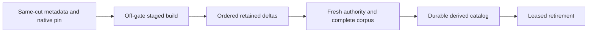

# OnlineGenerationLifetime within Search

Accepted L1 implementation for original KL-039 under
[ADR-095](../../ADR/ADR-095-online-generation-leases.md). Native FTS remains a
disposable node-local derived index, with exact source-cut/policy/schema manifests
and the existing selected provider. L1 delivers leased publication/retirement;
base-cut capture, delta catch-up and a background build outside the canonical
read gate are separate required L2 work, not completed by this stage.
The native capture/lifetime L2-A contract is
[NativeReadCuts](../StorageRecovery/NativeReadCuts.md) under ADR-097; it does not
alone provide delta retention, catalog switch or an online-index completion claim.

| Requirement | Acceptance and mapped tests |
|---|---|
| REQ-LEASE-001: publication retains borrowed old generations | AC-LEASE-001: an actual native generation lease remains usable and its owned files remain present while another source-cut generation publishes; current acquisition selects only the fully verified replacement; last old release retires only that generation. `NativeTextGenerationLifetimeTests` |
| REQ-LEASE-002: finite lifetime and admission | AC-LEASE-002: at most2 active leases, one native builder, one retired leased generation and one current generation; at most3 physical generations including the staged builder; native total disk/file/metadata/posting limits account every owned generation. Exact saturation/cancellation releases admission and a following request succeeds |
| REQ-LEASE-003: cleanup and shutdown preserve truth | AC-LEASE-003: failed native refresh/close/delete retains the unsettled owner/handle for joined retry, both primary and cleanup failures survive, repeated release/dispose cannot double-release or delete another generation; shutdown joins leases/build and closes every owned handle. Existing settlement tests and new overlap/shutdown cases |
| REQ-LEASE-004: existing runtime behavior stays exact | AC-LEASE-004: actual SearchEngine/GraphSearch text/vector/native corpus results, visibility/cut mismatch, restart and native process interruption remain exact through the unchanged ITextProjection interface; Aspire full unit/recovery/RF3 and delivered-source Linux gates pass |

No raw borrowed storage view may escape its gate. Native leases operate on their
owned generation; each query still performs current canonical candidate checks
inside its authorized read cut. A source-cut mismatch builds a new generation;
it never borrows an old manifest as current truth. Publication closes/verifies
the staged index and flushes its existing manifest before changing the manager's
current pointer. A retired lease can finish its originally scoped work, not read
new canonical state or make a current-authorization claim.

Replace the lifetime-long single semaphore with a short synchronized manager
transition plus independent bounded lease/build admission. No monitor or store
gate is held across waits or user callbacks; no polling wait on a grain thread.
Keep the existing ITextProjection/lease public shape, faults and generated
identity unchanged. Active generation readers may share only actual provider
operations proven safe; otherwise use one reader per generation and explicit
saturation. Never mutate or close an index borrowed by another lease. The maximum
counts above are ceilings, not permission to invent provider thread safety.

Root owns this contract, cross-cutting docs/joins/gates/receipts. Luna query_wave
owns only Server Features/Search Storage/Lifecycle new helpers and existing
NativeTextProjection/NativeTextProjectionLease/NativeTextSettlement lifetime
joins, NativeTextGenerationFiles.EnsureGenerationCapacity and
NativeTextRootFiles.RetireRestartGenerations capacity/preflight joins, plus new
UnitTests Search Cases/Helpers/Assertions/Models. Prepare a private
patch against3985008 while root tests that immutable compilation. Do not alter
provider APIs, Query read-cut ownership, canonical outbox/data epoch/public wire,
shared configuration or existing fixtures to hide failures. Root integrates the
actual consumed manager change, reviews and executes Aspire gates before commit.

The overlap fixture owns a linked cancellation source for its admitted native
replacement task. Any observation deadline cancels that source, resumes its
actual posting barrier and joins the original task before disposing the lease
or projection; a second timeout-abandoned wait is not cleanup evidence.

TASK-LEASE-LIVE-PREFLIGHT, accepted 2026-10-05, refines AC-LEASE-001/002/003
after the actual unfiltered Aspire unit61b failure. Capacity preflight currently
hash-opens the existing published WAL while its native index still owns that
file; replacement therefore fails before reaching its posting barrier. Inside
the existing physical gate, capture only the manager's at-most-three actual
generation references. An exact manager-owned, published generation with a
still-open native index receives a bounded live ownership/layout/size preflight
without reopening native payload files. Verify its root, leaf, source-node and
scope against the retained verified generation and owner/manifest metadata;
reject unknown, linked, nonregular or foreign paths and retain all file, depth,
generation and aggregate-byte ceilings. Runtime generation references cannot
be supplied by a caller, inferred from a sharing exception, or substituted with
an arbitrary trusted-leaf list. Every other generation keeps the complete
existing checksum validation. Closed publication, reopen, retirement, deletion
and restart retain full inventory checks; no format or provider sharing mode
changes. Native mutation/census ownership remains in the physical gate, while
manager admission is never held across callbacks or awaited work.

Query worker owns only a private patch for the consumed NativeTextProjectionLifecycle,
NativeTextFiles/NativeTextGenerationFiles capacity join and feature-local live
preflight helpers, plus the real Search overlap regressions. Root reviews the
exact live-object provenance and every cold validation call before applying it.
Keep the existing corpora, deadlines, byte/file limits, native provider and
old-reader/result assertions. Cleanup resumes the actual barrier even if old
lease disposal fails, cancels and joins the original replacement task, then
reports every distinct failure. Exercise real published-reader replacement,
invalidation, unknown-path denial and closed/restart corruption controls through
the actual Aspire caller. This source repair does not qualify L1, L2 or RF3;
full suites and exact-source Linux evidence remain required.

TASK-LEASE-LIVE-SIZE, accepted 2026-10-05, corrects the actual native-text71
failure while preserving REQ/AC-LEASE-001/002/003. The retained manifest describes
the fully closed publication inventory; a manager-owned reopened native WAL may
have a different current length. Live preflight must inspect every tracked native
file without reopening it, reject nonregular/linked files and any current file
over MaximumDiskBytes, and retain the existing per-generation and aggregate
actual-byte census. It must not compare a live file length with its closed
manifest length. Retained manifest scope, records and file metadata must still
match the manager's verified publication. All cold generations, publication,
reopen, retirement, deletion and restart keep exact lengths and checksums.
Luna query_wave owns only a private NativeTextLiveGenerationMetadata correction;
root reviews and joins it before the same original native tests run through
Aspire. No provider, sharing mode, ceiling, deadline or persisted format changes.

TASK-LEASE-COLD-FIXTURE, accepted 2026-10-05, preserves the original native
capacity and retirement oracles. Luna lifecycle_wave owns only a private patch
for NativeTextGenerationCapacityTests and NativeTextGenerationLifetimeTests,
with a feature-local cleanup helper if the numeric policy requires extraction.
Sort the independently created expected generation leaves ordinally before the
existing exact ordered comparison. Every borrowed lease must settle before its
owning projection's shutdown even when an earlier operation fails; retain every
primary and cleanup failure through ServerFailureObserver. The restart fixture
must first preserve its real borrowed retired generation by the existing owned
foreign-file failure, settle that lease, then run and observe failed projection
shutdown so both native indexes are actually closed. Only after closure may it
remove the fixture-owned foreign file, create the third leaf through the
unchanged cold WriteOwner call, and restore that same owned foreign entry.
Restart must still reject the entry before deleting any of the three generations,
preserve every original generation, and succeed after removing only that entry.
Keep the original old-reader, revisions, three-leaf bound, denial, healthy retry
and real provider assertions. Do not pass fabricated live slots into cold calls
or weaken full cold inventory validation. Root runs the unchanged acceptance
suite and captures actual source/runtime and terminal results.

TASK-LEASE-CANCEL-SETTLEMENT, accepted 2026-10-05, addresses the actual Aspire
native-text72b failure in SaturationAndCancellationReleaseNativeLeaseForHealthySearch.
The final aggregate physical census in NativeTextProjection.Release must use the
same completed-operation rule as NativeTextSettlement.Refresh: an incomplete
or cancelled operation settles without consulting its exhausted caller budget,
while retaining all real file, byte and generation ceilings and distinct cleanup
errors. A successfully completed operation retains its existing budget checks.
Luna query_wave owns a private patch to NativeTextProjection.Release only,
unless the unchanged original regression identifies a further owning defect.
Do not suppress cancellation globally, hide physical failures, change deadlines,
or weaken tests. Root reviews the joined change and reruns the original 36-case
native-text selection through the Aspire AppHost; full qualification stays open.

Frontend/new SDK/MCP syntax N/A: unchanged public search surfaces consume this
manager. Migration N/A: no canonical record or persisted index format changes.
Rollback stops the capable node and rebuilds disposable indexes; no canonical
data is deleted. L1 cannot close KL-039's concurrent canonical-write/delta/restart
criteria until L2 and original qualification exist.

## Original KL-039 L2-B contract proposed for owner review

Status: proposed, unimplemented, unqualified. This does not close original
KL-039 or authorize a new persisted format. L1 leased lifetime and L2-A native
snapshot remain separate supporting contracts.

| Requirement | Complete operation acceptance |
|---|---|
| REQ-ONLINE-001 | AC-ONLINE-001: same-gate capture pins the actual native snapshot and captures persisted principal/policy/resource, applied position, outbox upper and node/placement identity with an active canonical projection consumer retaining necessary deltas; copied-byte seed traversal runs outside the canonical gate while genuine public update and delete commands complete. |
| REQ-ONLINE-002 | AC-ONLINE-002: a distinct staged native generation consumes actual ordered retained deltas to a finite fresh upper; full independent literals prove updated terms replace original terms, deleted entities are excluded, unchanged entities and complete metadata remain exact. |
| REQ-ONLINE-003 | AC-ONLINE-003: final authority/cut/retention and complete corpus validation precede fully flushed verified catalog publication; rejection, cancellation or exhausted bounds preserve usable original active generation and joined cleanup. |
| REQ-ONLINE-004 | AC-ONLINE-004: genuine same-root process interruption at publication boundaries and same-owner restart select the last complete active generation, preserve exact canonical records/receipts and reject incomplete or corrupt staging; process-kill proof is not power-loss durability. |
| REQ-ONLINE-005 | AC-ONLINE-005: a real old native lease keeps its exact original result and files through replacement; its final release retires only that generation, and actual cleanup failure retains ownership/failures followed by repaired healthy continuation. |

Ordered stages: freeze internal capture composition and current-only derived
catalog contract; capture metadata/native pin; bounded off-gate seed build;
ordered delta catch-up; final authority and complete corpus validation; durable
selector publication; interrupted-publication recovery; leased retirement;
actual Linux native discovery and complete operation qualification. Removing the
existing RequireUpper equality is not delta catch-up. Existing enrollment,
manifest and explicit selection contracts remain exact until the new path is
reviewed. No monitor or borrowed IKeyValueView escapes a gate.

Core/Search owns canonical capture/auth and consumer retention; provider
StorageRecovery owns native snapshot/physical-gate lifetime; Server/Search owns
staged native build, derived catalog and retirement; Orleans/Search retains the
separate authorized request grain and current maintenance coordination;
Query/Search consumes a validated selection without owning storage.
Unit/Search owns complete real-provider concurrent update/delete and reader-pin
flows; Recovery/Search owns interrupted publication and same-root recovery;
Integration/Search owns real RF3 SDK, official MCP, Q1 SDK and Q1 MCP full
literal/receipt/auth/cancellation/cleanup flows. Test symbols and compiled UIDs
will be bound from actual discovery after implementation, not invented here.
Root owns guarded live joins, compiler, commit and Linux original evidence.

Required owner decisions before production seams: exact internal provider capture
composition; generated catalog alias/field IDs/path and flush/publication order;
resolution of the existing explicit consumer/generation selection during swap.
No new public wire, trusted caller role, provider, topology, deadline or capacity
knob is selected by this proposal. Use centrally validated existing bounds.
Rollback drains real leases and stops the capable owner before rebuilding only
verified disposable derived files. Canonical documents, replication/atomic
journals and consumer records remain authoritative; no legacy reader or fallback.

## KL-039 distinct online maintenance contract, owner selection 2026-10-09

This is a docs-first source contract, not implementation or qualification.
Original Search stays read-only. Explicit TextIndexSelectionV1, its original
single enrollment, and immutable Build/Restore indexed upper U remain exact.
The new operation uses an already administrator-configured canonical projection
consumer. It cannot manufacture retention pins, caller roles or grants.

Reserve appended OperationKind.MaintainOnlineTextIndex=34; preserve Batch0 through
MovePartition33. New generated OnlineTextIndexMaintenanceRequest uses alias
keyload.search.online-text-index-maintenance-request.v1 and IDs0 CommandId(Guid),
1 Consumer(ProjectionConsumerRef),2 Collection(string),3 Field(string),
4 ConsumerGeneration(long),5 NodeId(Guid),6 Placement(PhysicalShardRecord).
There is no caller-provided cut, trusted principal, capacity or deadline.
Persisted current administrator, consumer definition/generation/checkpoint,
resource/field policy and placement are reloaded before every effect.

Reserve new generated OnlineTextIndexMaintenanceResult alias
keyload.search.online-text-index-maintenance-result.v1 with IDs0 CommandId(Guid),
1 Consumer(ProjectionConsumerRef),2 ConsumerGeneration(long),
3 BaseCut(TextIndexSourceCut),4 PublishedCut(TextIndexSourceCut),
5 IndexSha256(string),6 TrackedRecords(int),7 Checkpoint(ProjectionBatchResult).
BaseCut identifies the real initial snapshot; PublishedCut identifies final
validated applied/outbox/owner authority. No later canonical head is claimed
from an original completed result. Whole original stable-ID replay must retain
all fields exactly; changed-content same-ID request is rejected.

OnlineTextPhase uses explicit values0 Captured,1 Seeded,2 CaughtUp,3 Validated,
4 Published,5 RetirementMarked. GrainRequestProgress adds nullable OnlineTextPhase at
native Id4 only; existing RequestId0/Ann1/Text2/Move3 remain exact. This is a
closed operation phase, not a payload log or fabricated completion counter.

A distinct existing separate request grain owns the authenticated parent and
native ManagedCode CQRS ICqrsStreamWriter<GrainRequestProgress,GrainOperationReply>.
Await each actual bounded producer write; use existing stream admission/frame
limits/backpressure/request cancellation and terminal failure mapping. Exactly
one terminal result follows actual publication/settlement, never a phase emitted
before its owner completed. Producer, native readers, child operations, pin and
CTS are joined on success, cancellation and failure; preserve primary plus all
cleanup errors and original fatal semantics. No one-way delivery, new grain
concurrency attribute, polling, deadline reset or detached background task.

The parent bounded ordered loop uses existing configured maximum pages and
original request expiry/buffers. ReadProjectionBatch.ThroughSequence selects
actual retained upper; stable native record IDs/digests and original canonical
ACKs remain authoritative. New head observations allow bounded catch-up, never
remove existing immutable RequireUpper. Exhausted page/time/byte allowance or
lost retained history is a terminal refusal preserving the original active
index, followed by fresh healthy continuation in the regression.

Internal Core/Search copied-byte disposable pin + Server adapter is selected;
no public IAtomicStore addition or Core-to-provider reference. Add only Server
friendship for actual internal ZoneTree capture inside the existing gated Read
callback. Capture metadata and pin atomically; visit owned native bytes off gate;
provider retains physical iterator/slot/cancellation and joined disposal. Exact
snapshot identity and policy stay fixed within that capture. Final authority
checks compare an actually captured fresh validation cut; no count-derived cut.

The distinct current-only derived catalog is proposed as NativeTextOnlineCatalog,
generated alias keyload.server.native-text.online-catalog.v1, IDs0 FormatVersion,
1 NodeId,2 Scope(TextProjectionScope),3 Placement,4 Consumer,5 ConsumerGeneration,
6 Leaf(string),7 AppliedPosition,8 ThroughSequence,9 ManifestSha256(string),
10 BuildCommandId(Guid). Proposed same-owner root native-text-online uses
catalog.bin/catalog.pending. Root/path and catalog values need final owner review;
all native physical/file/byte/generation/lease limits account existing plus staged
and retired ownership together, not one independent allowance per directory.

Publication order: close/flush staged native index; validate complete manifest,
record digest map and entire file inventory; encode existing native SHA256 envelope;
CreateNew pending with WriteThrough/Flush(true); final fresh authority/retention
and unchanged validated cut check under original canonical gate; same-directory
atomic rename; then runtime pointer; retain borrowed old generation through last
lease and original full ownership verification before retirement. Failure before
rename preserves old selector; ambiguous after-rename failure is not converted to
no-effect or success. Startup validates the actual current catalog/manifest/cut/
owner/inventory, never promotes pending or scans for the newest leaf. Corruption
is explicit refusal, not fallback. Process interruption remains separate from
power-loss qualification; no directory-fsync guarantee is claimed.

The remaining exact storage join is the original operation outcome: selected
catalog alone cannot forget older command results after later swaps. Before seam
code, trace owning native CommandOutcomes retention/authentication APIs and freeze
where the complete original result and request digest survive canonical replay,
publication interruption, supersession and same-owner restart. No last-only
catalog receipt, unbounded file history or duplicate consumer implementation.

Shared paths are root-coordinated: Abstractions/Contracts.cs discriminator;
Orleans/ClusterRouting/Models/GrainRequestProgress.cs Id4; signed request codec,
operation descriptor/dispatch, SDK/SQL/MCP schema and gateway catalog registration.
Feature-owned DTOs/aliases/validation/owner/streaming/tests stay Search-local.
Movement/session owners were informed of reservations; guards reconcile their
actual root-joined changes before any source packet is sealed.

REQ/AC-ONLINE-001..005 remain the whole traceability set in the preceding proposal:
real concurrent update/delete during native build, exact complete search literals
and all original receipts across SDK/MCP/Q1 SDK/Q1 MCP, actual process cuts/cold
recovery, old-reader files, refusal/healthy/cancellation/shutdown full flows.
No test declaration count is compiled discovery or runtime PASS. Exact Linux
normal/scalar native source-image census and every required operation gate remain
open. Rollback drains actual owners and stops the capable node before discarding
only verified disposable derived files, never canonical data/WAL/journals/outcomes.

RetirementMarked confirms only the actual manager transition marking the old
generation for leased retirement. Successful publication can retain a borrowed
old reader and all its files; physical deletion remains owned by the final real
release. Never await a fabricated drain or report deleted files while pins exist.
The online parent does not invoke ConfigureProjectionConsumer; its capture
requires the existing configured generation and unchanged retained history.

## KL-039 canonical online publication and restart contract (v5 owner review)

This complete contract supersedes v4's unresolved original-outcome/storage join and publication ordering. It is proposed source, not implemented, compiled, discovered or runtime qualified. Original REQ/AC-ONLINE-001–005 and every original KL039 acceptance predicate remain mandatory. Preserve explicit TextIndexSelectionV1, its single enrollment and immutable Build/Restore U; implicit Search performs no canonical maintenance effect or enrollment. Public MaintainOnlineTextIndex34 and private OnlineTextPublicationPhase35 are distinct from Batch0–MovePartition33. Ordinary50/heavy RF3 exclusive1, all original cancellation/deadlines/options/auth/RF3 and required full suites remain unchanged.

### Frozen native contracts and source ownership

Public SDK extension is MaintainOnlineTextIndexAsync returning Task<Result<OnlineTextIndexMaintenanceResult>>, using the original KeyLoadClient.Send write/commandId/cancellation path. Distinct route /v1/search/text/online/maintain and on-demand tool keyload_search_text_online_maintain bind public34's typed request/result. Q1 SDK and official MCP use CALL keyload_search_text_online_maintain(@arguments) through the existing SqlOperationRequest/catalog executor. No additional SQL grammar or full-SQL conformance claim. Register exact schemas/effect hints through the existing official server and persisted-authority gateway; do not enlarge initial discovery catalog. Preserve the v4 public request alias/IDs0–6, result alias/IDs0–7, phases0–5 and GrainRequestProgress nullable OnlineTextPhase Id4.

Append private GrainReadKind.OnlineTextMaintenance only after the exact joined ControlledBlob then SampleChunkWindow ancestry; preserve all existing ordinals and take the exact native predecessor, never infer a compiled UID. Private capability purpose is keyload-online-text-capability-v1; private35 command purpose is keyload-online-text-publication-verified-v1. Both are signed through the existing GrainRequestCodec/identity restoration path. Generic public command/read purposes reject these private identities. Public generic CreateNativeOperation must continue excluding35. The distinct internal Core factory alone invokes existing IssueNativeOperation after native prepared-candidate validation; VerifyOperationAuthority and coordinator.SubmitVerifiedAsync preserve exact native HMAC/incarnation/command/kind/principal/fingerprint/payload authority. Never reinterpret movement's purpose, grants, phases or owner context.

Core/Search internal generated OnlineTextPublicationPhaseCommand uses alias keyload.core.search.online-text-publication-phase.v1 and IDs0 Request(OnlineTextIndexMaintenanceRequest),1 Result(OnlineTextIndexMaintenanceResult),2 DataEpoch(int),3 Leaf(string),4 ManifestSha256(string),5 GenerationId(Guid),6 ExpectedCurrentCommandId(Guid?),7 SessionId(Guid). Its commandId is the original public request.CommandId. Fresh signed admission binds actual parent input/principal, original request expiry, native session, prepared generation and exact payload; caller supplied results, leaf names or metadata cannot create a native candidate. Session and prepared bytes are node-local, bounded and owned; the replicated payload is copied immutable native data. Core has no provider, Server or Query type dependency.

Append nullable StoredOutcome.OnlineTextAuthority at native Id8, preserving existing0–7. Internal generated OnlineTextOutcomeAuthority alias keyload.core.search.online-text-outcome-authority.v1 has IDs0 ParentFingerprint(string),1 Collection(string),2 Field(string),3 DataEpoch(int),4 Placement(PhysicalShardRecord),5 Leaf(string),6 ManifestSha256(string),7 GenerationId(Guid). The full immutable public original result remains StoredOutcome.Result, not the derived catalog. Parent fingerprint uses the exact existing normalized Id/Kind/PrincipalId/PayloadJson identity with public kind34. Phase35 retains its independent full native fingerprint. Capture authority for a validated private phase before execution; retain it with genuine persisted terminal outcomes, while changing the current pointer only on success. No projection-batch field, RuntimeJournal identity or existing outcome format is reinterpreted.

Core/Search generated OnlineTextCurrentPublication alias keyload.core.search.online-text-current-publication.v1 uses IDs0 FormatVersion(int,1),1 PrincipalId(string),2 CommandId(Guid),3 ParentFingerprint(string),4 Consumer(ProjectionConsumerRef),5 ConsumerGeneration(long),6 Authority(OnlineTextOutcomeAuthority),7 PublishedCut(TextIndexSourceCut). The new canonical online-text-current key family is explicitly registered as partition-owned metadata for the exact consumer partition/collection/field/generation, including native roster/snapshot/key validation. No caller document or user collection stores private control data. Existing canonical outcome retention owns historical original results; there is no unbounded per-command file history.

Orleans/Search generated OnlineTextCapabilityRequest alias keyload.orleans.search.online-text-capability-request.v1 has IDs0 SessionId(Guid),1 Request(OnlineTextIndexMaintenanceRequest),2 Kind(OnlineTextCapabilityKind),3 Page(ProjectionBatch?),4 CheckpointIntent(CommitProjectionBatchRequest?),5 Acknowledged(ProjectionBatchResult?). OnlineTextCapabilityKind is closed:0 ResolveOriginal,1 Capture,2 Seed,3 PreparePage,4 ApplyIntent,5 SettleCheckpoint,6 Validate,7 IssuePublication,8 ReconcileCommitted,9 Abort. Generated OnlineTextCapabilityResult alias keyload.orleans.search.online-text-capability-result.v1 has IDs0 SessionId(Guid),1 BaseCut(TextIndexSourceCut?),2 CurrentCut(TextIndexSourceCut?),3 ThroughSequence(long),4 TrackedRecords(int),5 IndexSha256(string?),6 OriginalResult(OnlineTextIndexMaintenanceResult?),7 IssuedPublication(ReplicatedOperation?),8 CheckpointIntent(CommitProjectionBatchRequest?),9 CurrentCommandId(Guid?). These are actual phase results, never caller authority or progress counters. No raw handle/iterator crosses a grain.

The derived Server catalog keeps its accepted alias keyload.server.native-text.online-catalog.v1 and IDs0–10/root native-text-online/catalog.bin/catalog.pending. BuildCommandId10 is the actual canonical35 command identity, not an inferred newest leaf. Existing Core and Query friendship already permits Server; only the approved Storage.ZoneTree internal capture friendship is added. Internal Query ICurrentTextProjection acquires with the actual current IKeyValueView/principal/resource/request/budget inside the existing callback. Explicit selection stays first and unchanged; the current-only adapter may reuse the canonical online generation only after complete cut/manifest/corpus validation, otherwise the existing authorized bootstrap path handles implicit reads. It performs no canonical write. No borrowed view escapes, public IAtomicStore addition or Core-to-provider dependency.

### Ordered execution, original result and CAS

1. The distinct parent runs in the separate request grain and existing ManagedCode CQRS stream. Reload fresh persisted administrator, field/resource policy, active already-configured consumer/generation/checkpoint and placement; validate original expiry/cancellation/buffers. Resolve original outcome through a separately signed private capability and actual quorum barrier before new native work. Current principal policy/incarnation and exact parent fingerprint guard both original success and failure. Changed same-ID content conflicts; current revocation/policy/ownership fences remain native refusals. Later generation retirement does not erase an original completed result.
2. Capture metadata plus the actual internal native snapshot pin in the canonical gate. Core supplies a callback-based disposable copied-byte pin contract; Server composes the node-local ZoneTree adapter. Traverse the charged native bytes off gate while actual canonical update/delete operations can complete. Keep exact identity/read generation/policy within each capture. Admit only existing bounded sessions, generations/files/bytes/leases; reject exhausted admission, never create an unbounded queue or independent directory allowance.
3. Seed a distinct actual native generation; read ordered retained projection pages to observed finite upper; prepare/apply actual native intents and commit original stable-ID projection ACKs through independent child request grains. Preserve existing CommitProjectionBatchRequest/ProjectionBatchResult semantics exactly. If a genuine final empty batch has no prior ACK, execute the native empty-effects ACK to obtain an actual receipt; never manufacture a checkpoint or receipt. All extra real child calls and progress frames consume existing total frame/page/byte/time allowances.
4. Capture a fresh final validation cut, validate complete records/revisions/token digest/native inventory and current policy/consumer/placement/retention. Close/flush the prepared native generation and its original bounded native intent. The Core factory rechecks the actual prepared witness and fresh principal/cut before sealing35. Expected applied/outbox/data epoch/read generation/policy/schema/resource/consumer/placement/current-pointer identity are verified again in the actual ordered AtomicCommandCommit transaction; an intervening canonical commit is a refusal, not an invented stable count or timeout retry.
5. Existing AtomicCommandCommit.ExecuteAndBuildOutcome/BuildStoredOutcome/PersistCommandOutcome commit the full original OperationResult, typed authority, canonical current pointer and apply watermark together through the unchanged native RF3 ordered gate. PublishedCut identifies the genuinely validated document cut before this metadata publication; do not relabel a later head. No native file becomes canonical storage. Failed CAS/cancellation preserves the prior active selector and original failures. Uncertain submission remains UnknownWriteOutcome until actual original canonical resolution, never inferred no-effect.
6. Only the exact committed pointer/outcome authorizes local catalog publication. Encode the existing native SHA256 envelope, CreateNew pending/WriteThrough/Flush(true), validate exact committed identity/manifest/owner/files, rename in the same directory, then replace the runtime pointer. Preserve leased old files, mark retirement only after publication, and delete only after the final old lease joins. Await actual progress writes and one terminal result only after reconciliation/settlement. Join producer/reader/children/pin/native worker/CTS and primary+cleanup+fatal failures on every path. No one-way, detached work, request renewal, new scheduler/config knob or retry.

### Committed-authority restart and rollback

Startup/retry first obtains actual owner readiness/current committed authority; timeout, unreachable quorum or a lagging local absence cannot prove no publication. A complete local current catalog must match the exact canonical current pointer/outcome plus native manifest/owner/file inventory. No scan for newest leaf, legacy reader or blind pending promotion is allowed. A committed35 with catalog missing/pending authorizes reconstruction only from that exact recorded generation/manifest after full validation; missing/corrupt committed native bytes remain a genuine refusal, preserving the original outcome and prior verified ownership. Restore only the exact fixture-owned image in a repair regression. If no committed35 is authoritatively present, retain the original current generation and reject/reclaim only proven uncommitted owned staging. Uncertain state remains retained/unsettled.

Same-owner cold identity requires exact NodeId/incarnation/data epoch/placement/policy/schema/resource/consumer generation. ReadGeneration and applied position may legitimately advance under native committed snapshot replacement. Each new continuation acquires a real fresh current cut; it never reuses an old snapshot/cursor or rewrites an immutable Build U. Catalog/native scope and original result remain historical immutable observations. Reuse on a fresh query requires complete current canonical corpus equality, full policy/cut/manifest validation and the actual nondecreasing generation/applied fence; changed corpus is not eligible. A superseded completed command returns its exact retained original result without reactivating retired files or replacing the current pointer. Explicit selection's existing exact-generation check remains unchanged.

Rollout enables34/35 only on the coherent capable RF3 source/codec cohort; old serializers cannot consume new typed outcomes. Preserve stable aliases/IDs and existing binary/raw-byte/public JSON/digest/journal contracts. After any canonical35 is written, rollback retains capable decoding/outcome/authority support, disables new online admission and drains joined ownership before removing only verified disposable derived files. Do not downgrade to an old reader, drop committed results, remove canonical pointers or fabricate migration compatibility. No deployment action is executed by this source proposal.

### Whole operation evidence and exact implementation joins

Core/Search owns Contracts/OnlineTextPublicationPhaseCommand.cs, OnlineTextOutcomeAuthority.cs, OnlineTextCurrentPublication.cs; Commands/OnlineTextPublicationCommands.cs; Queries/OnlineTextOriginalOutcome.cs; Identity/OnlineTextOperationAuthority.cs; Validation/OnlineTextPublicationValidation.cs and Serialization/OnlineTextPublicationProtocol.cs. Shared Core joins are AtomicCommandCommit, CommandOutcomes, OperationDispatcher, native payload/authority type map, scoped command outcome resolver, native serializer alias/field IDs and partition-roster key registration. Server/Search owns native snapshot adapter, capability owner/admission, actual staged seed/delta/validation, catalog reconciliation, reader leases and retirement; StorageRecovery/PartitionHost owns registration/readiness/joined shutdown. Query/Search owns the internal current-view acquisition interface and existing SelectedTextProjectionAdmission branch only. Orleans/Search owns typed capabilities, special-purpose scopes/envelopes, sealed35 submission/partition routing, bounded CQRS parent/child calls and terminal cleanup. Abstractions/ClientApi/Client/SQL own public34 DTO/descriptor/SDK/Q1/MCP/schema/hints; private35 and capability never enter public discovery. Root joins all shared paths after peer ancestry guards, compiles/formats and commits/pushes; no worker live write.

Unit operation tests must execute real native capture/build/query while public update/delete complete off gate, then verify full independent original/new/deleted/unchanged payload/ref/revision/score/order/page oracles; actual old reader/files remain pinned through replacement; real cancellation/bounds/stale CAS/spoofed public35/authority refusal each leads to a distinct fresh healthy operation. Verify full original result after later swap/retirement and same-owner cold continuation. No getter/property/logger-only cases. Process Recovery executes actual same-root cuts before canonical commit, after canonical commit, pending flush, catalog rename, runtime activation and retirement, retaining the exact old/new outcome and native file identity; missing/corrupt exact committed artifacts refuse before genuine exact-image repair/healthy continuation. Process kill does not prove power loss.

RF3 executes the same complete concurrent mutation/ordered delta/catalog/original-result/old-reader/cold/policy/cancellation/repaired-failure flow through all four actual SDK, official MCP, Q1 SDK and Q1 MCP routes. Coordinate with genuine native phase/CQRS observations, not fake public probes, sleeps or manufactured counters. Native discovery authenticates real constructor instances/UIDs/source/PDB/image after implementation; source declarations are not compiled cases/PASS. Linux normal/scalar-caller operation outcomes, all mandatory full suites, resource/performance/coverage/endurance/power-loss gates remain OPEN.

### Native replica and captured-read settlement appendix, 2026-10-09

This source-backed corrective contract supersedes only v5's replicated35 comparison of capture-local NodeId, Store.Position and ReadGeneration. NativeTextSeedCollector captures these from its actual node-local owner under Store.Read; ZoneTreeStore.CaptureNativeReadCut requires that same raw view and held native read gate. The prepared factory and local catalog acquisition must preserve their exact node/incarnation/read-generation/local-position fence within each captured request. No old cursor or snapshot crosses a fresh cold request. Native lease traversal owns actual immutable iterator work off the store gate; seed decoding receives only charged copied bytes, and existing shared native text memory/generation/file/session admission must charge retained data and leases before allocation. This does not authorize an independent directory allowance.

AtomicCommandCommit applies the same signed35 payload through each node-local Store.Commit. A healthy follower can legitimately have another local NodeId/local journal position/read generation, especially after snapshot installation. Therefore replicated publication validates deterministic canonical Applied/outbox/policy/schema/resource/consumer-generation/placement/incarnation/current-pointer expectations and the sealed native prepared witness; it must not compare those follower-local values against the leader's captured values. The native factory validates the complete prepared candidate against a fresh exact local cut before signing through IssueNativeOperation; generic public CreateNativeOperation still excludes35. No manufactured quorum fence or caller result/witness is admitted.

DataEpoch has been verified in actual native source rather than assumed: NativeTextSeedCapture.DataEpoch is StoreIdentity.FormatVersion. ZoneTreeIdentityFile.Open/Validate/Read require CurrentDataEpoch for every supported owner; ZoneTreeCheckpointGeneration.Prepare writes that format constant and increments only local ReadGeneration for tree replacement. This format gate is common for the coherent supported RF3 reader cohort and may remain in deterministic35 validation. It is not a physical generation counter. Local catalog/source authority also binds the exact captured format. A different/unsupported format fails closed; no upgrade reader or fallback is introduced.

Actual native partial-work settlement precedes source implementation. ZoneTreeReadCutLease already charges accepted records/raw bytes before copying and retains its real partial work on traversal failure; its existing successful result exposes that work only on normal return. Add an internal ObserveSettledWork method guarded by capture completion and no active traversal, available solely to the joined Server adapter. It exports only the existing exact cumulative records/bytes/advances within that owned operation, never user data, sampled diagnostics or authority. Preserve original VisitPrefix behavior and failure identities. Server records/imports only the actual delta after synchronous traversal returned or threw.

Existing ReadExecutionBudget.ImportReadGrant and CompleteReadGrant check active cancellation/deadline before accounting, which cannot settle already performed native work after original cancellation. Add internal settled-work import/completion using the exact existing owner/completed/reservation/aggregate byte and record checks, without admitting new work or checking/renewing a future lifetime. Existing active methods retain their checks and semantics. Import actual accepted native work after traversal joined; complete/release only unused reservation after actual pin disposal successfully joined. If pin cleanup remains failed/unsettled, retain its reservation and every actual failure. Preserve primary stack identity, full ordered aggregate and fatal semantics through existing ServerFailureObserver; no retry, timing relaxation or negative-control getter tests. The pin uses only the original budget's remaining bytes/records/lifetime and cancellation.

Ordered source ownership: this feature and ADR095 contract first; internal Core metadata-only borrowed-view callback and budget-settlement append next; ZoneTree internal settled-work/state guard and Server friend adapter; exact signed35 canonical outcome/current-pointer publication; local checksummed catalog and reader-pin reconciliation; original separate-grain CQRS/public SDK/MCP/Q1 composition; meaningful real operation failure/cancellation → fresh healthy continuation, process cuts and RF3 whole flows. Shared predecessors must be refreshed against the current root-joined source before sealing. Root alone joins/builds/formats/commits/pushes; native compiled identities and complete normal/scalar Linux operations remain required. Neither this contract nor private source preparation is compilation, UID discovery or a PASS.
