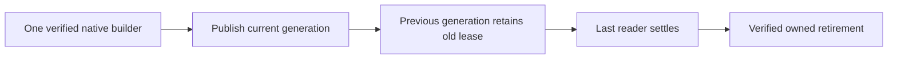

# OnlineGenerationLifetime within Search

Accepted L1 implementation for original KL-039 under
[ADR-095](../../ADR/ADR-095-online-generation-leases.md). Native FTS remains a
disposable node-local derived index, with exact source-cut/policy/schema manifests
and the existing selected provider. L1 delivers leased publication/retirement;
base-cut capture, delta catch-up and a background build outside the canonical
read gate are separate required L2 work, not completed by this stage.
The native capture/lifetime L2-A contract is
[NativeReadCuts](../StorageRecovery/NativeReadCuts.md) under ADR-097; it does not
alone provide delta retention, catalog switch or an online-index completion claim.

| Requirement | Acceptance and mapped tests |
|---|---|
| REQ-LEASE-001: publication retains borrowed old generations | AC-LEASE-001: an actual native generation lease remains usable and its owned files remain present while another source-cut generation publishes; current acquisition selects only the fully verified replacement; last old release retires only that generation. `NativeTextGenerationLifetimeTests` |
| REQ-LEASE-002: finite lifetime and admission | AC-LEASE-002: at most2 active leases, one native builder, one retired leased generation and one current generation; at most3 physical generations including the staged builder; native total disk/file/metadata/posting limits account every owned generation. Exact saturation/cancellation releases admission and a following request succeeds |
| REQ-LEASE-003: cleanup and shutdown preserve truth | AC-LEASE-003: failed native refresh/close/delete retains the unsettled owner/handle for joined retry, both primary and cleanup failures survive, repeated release/dispose cannot double-release or delete another generation; shutdown joins leases/build and closes every owned handle. Existing settlement tests and new overlap/shutdown cases |
| REQ-LEASE-004: existing runtime behavior stays exact | AC-LEASE-004: actual SearchEngine/GraphSearch text/vector/native corpus results, visibility/cut mismatch, restart and native process interruption remain exact through the unchanged ITextProjection interface; Aspire full unit/recovery/RF3 and delivered-source Linux gates pass |

No raw borrowed storage view may escape its gate. Native leases operate on their
owned generation; each query still performs current canonical candidate checks
inside its authorized read cut. A source-cut mismatch builds a new generation;
it never borrows an old manifest as current truth. Publication closes/verifies
the staged index and flushes its existing manifest before changing the manager's
current pointer. A retired lease can finish its originally scoped work, not read
new canonical state or make a current-authorization claim.

Replace the lifetime-long single semaphore with a short synchronized manager
transition plus independent bounded lease/build admission. No monitor or store
gate is held across waits or user callbacks; no polling wait on a grain thread.
Keep the existing ITextProjection/lease public shape, faults and generated
identity unchanged. Active generation readers may share only actual provider
operations proven safe; otherwise use one reader per generation and explicit
saturation. Never mutate or close an index borrowed by another lease. The maximum
counts above are ceilings, not permission to invent provider thread safety.

Root owns this contract, cross-cutting docs/joins/gates/receipts. Luna query_wave
owns only Server Features/Search Storage/Lifecycle new helpers and existing
NativeTextProjection/NativeTextProjectionLease/NativeTextSettlement lifetime
joins, NativeTextGenerationFiles.EnsureGenerationCapacity and
NativeTextRootFiles.RetireRestartGenerations capacity/preflight joins, plus new
UnitTests Search Cases/Helpers/Assertions/Models. Prepare a private
patch against3985008 while root tests that immutable compilation. Do not alter
provider APIs, Query read-cut ownership, canonical outbox/data epoch/public wire,
shared configuration or existing fixtures to hide failures. Root integrates the
actual consumed manager change, reviews and executes Aspire gates before commit.

The overlap fixture owns a linked cancellation source for its admitted native
replacement task. Any observation deadline cancels that source, resumes its
actual posting barrier and joins the original task before disposing the lease
or projection; a second timeout-abandoned wait is not cleanup evidence.

TASK-LEASE-LIVE-PREFLIGHT, accepted 2026-10-05, refines AC-LEASE-001/002/003
after the actual unfiltered Aspire unit61b failure. Capacity preflight currently
hash-opens the existing published WAL while its native index still owns that
file; replacement therefore fails before reaching its posting barrier. Inside
the existing physical gate, capture only the manager's at-most-three actual
generation references. An exact manager-owned, published generation with a
still-open native index receives a bounded live ownership/layout/size preflight
without reopening native payload files. Verify its root, leaf, source-node and
scope against the retained verified generation and owner/manifest metadata;
reject unknown, linked, nonregular or foreign paths and retain all file, depth,
generation and aggregate-byte ceilings. Runtime generation references cannot
be supplied by a caller, inferred from a sharing exception, or substituted with
an arbitrary trusted-leaf list. Every other generation keeps the complete
existing checksum validation. Closed publication, reopen, retirement, deletion
and restart retain full inventory checks; no format or provider sharing mode
changes. Native mutation/census ownership remains in the physical gate, while
manager admission is never held across callbacks or awaited work.

Query worker owns only a private patch for the consumed NativeTextProjectionLifecycle,
NativeTextFiles/NativeTextGenerationFiles capacity join and feature-local live
preflight helpers, plus the real Search overlap regressions. Root reviews the
exact live-object provenance and every cold validation call before applying it.
Keep the existing corpora, deadlines, byte/file limits, native provider and
old-reader/result assertions. Cleanup resumes the actual barrier even if old
lease disposal fails, cancels and joins the original replacement task, then
reports every distinct failure. Exercise real published-reader replacement,
invalidation, unknown-path denial and closed/restart corruption controls through
the actual Aspire caller. This source repair does not qualify L1, L2 or RF3;
full suites and exact-source Linux evidence remain required.

TASK-LEASE-LIVE-SIZE, accepted 2026-10-05, corrects the actual native-text71
failure while preserving REQ/AC-LEASE-001/002/003. The retained manifest describes
the fully closed publication inventory; a manager-owned reopened native WAL may
have a different current length. Live preflight must inspect every tracked native
file without reopening it, reject nonregular/linked files and any current file
over MaximumDiskBytes, and retain the existing per-generation and aggregate
actual-byte census. It must not compare a live file length with its closed
manifest length. Retained manifest scope, records and file metadata must still
match the manager's verified publication. All cold generations, publication,
reopen, retirement, deletion and restart keep exact lengths and checksums.
Luna query_wave owns only a private NativeTextLiveGenerationMetadata correction;
root reviews and joins it before the same original native tests run through
Aspire. No provider, sharing mode, ceiling, deadline or persisted format changes.

TASK-LEASE-COLD-FIXTURE, accepted 2026-10-05, preserves the original native
capacity and retirement oracles. Luna lifecycle_wave owns only a private patch
for NativeTextGenerationCapacityTests and NativeTextGenerationLifetimeTests,
with a feature-local cleanup helper if the numeric policy requires extraction.
Sort the independently created expected generation leaves ordinally before the
existing exact ordered comparison. Every borrowed lease must settle before its
owning projection's shutdown even when an earlier operation fails; retain every
primary and cleanup failure through ServerFailureObserver. The restart fixture
must first preserve its real borrowed retired generation by the existing owned
foreign-file failure, settle that lease, then run and observe failed projection
shutdown so both native indexes are actually closed. Only after closure may it
remove the fixture-owned foreign file, create the third leaf through the
unchanged cold WriteOwner call, and restore that same owned foreign entry.
Restart must still reject the entry before deleting any of the three generations,
preserve every original generation, and succeed after removing only that entry.
Keep the original old-reader, revisions, three-leaf bound, denial, healthy retry
and real provider assertions. Do not pass fabricated live slots into cold calls
or weaken full cold inventory validation. Root runs the unchanged acceptance
suite and captures actual source/runtime and terminal results.

TASK-LEASE-CANCEL-SETTLEMENT, accepted 2026-10-05, addresses the actual Aspire
native-text72b failure in SaturationAndCancellationReleaseNativeLeaseForHealthySearch.
The final aggregate physical census in NativeTextProjection.Release must use the
same completed-operation rule as NativeTextSettlement.Refresh: an incomplete
or cancelled operation settles without consulting its exhausted caller budget,
while retaining all real file, byte and generation ceilings and distinct cleanup
errors. A successfully completed operation retains its existing budget checks.
Luna query_wave owns a private patch to NativeTextProjection.Release only,
unless the unchanged original regression identifies a further owning defect.
Do not suppress cancellation globally, hide physical failures, change deadlines,
or weaken tests. Root reviews the joined change and reruns the original 36-case
native-text selection through the Aspire AppHost; full qualification stays open.

Frontend/new SDK/MCP syntax N/A: unchanged public search surfaces consume this
manager. Migration N/A: no canonical record or persisted index format changes.
Rollback stops the capable node and rebuilds disposable indexes; no canonical
data is deleted. L1 cannot close KL-039's concurrent canonical-write/delta/restart
criteria until L2 and original qualification exist.

