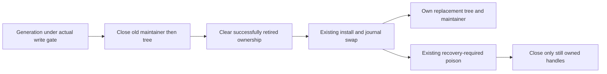
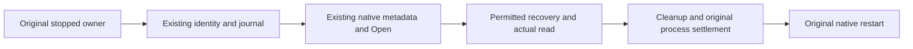
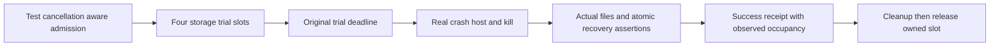
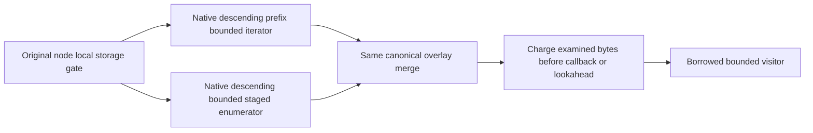
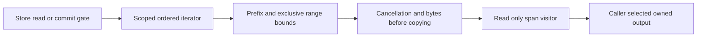
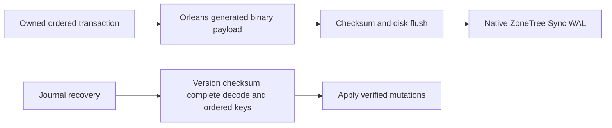
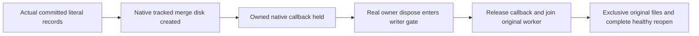
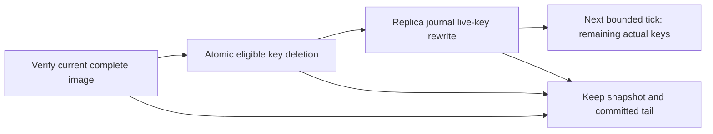

# StorageRecovery

## KL-007 v1 key and captured-envelope completion

The accepted [ADR-005 validation contract](../ADR/ADR-005-canonical-keyspace-codec.md#2026-10-04-v1-validation-and-ownership-completion)
preserves valid durable key bytes and defines explicit normalization, arity and
safe malformed-input errors. KL-007 maps to the four measurable criteria below,
with19 exact KeyCodec cases and the owning codec/native storage source closure.
Task closure requires all mapped cases on current-source Linux normal/scalar,
matching identities and the ADR-005 recovery/open-existing-store CI check. A
failure elsewhere remains a failed overall suite and cannot erase an independently
verified mapped outcome. The StorageRecovery feature's Docker/Aspire RF3,
endurance and power-loss gates remain separately mandatory and open; closing
KL-007 cannot close or waive them. Current local normal/scalar operation results
are supporting development evidence until the original Linux reports exist.

TASK-KEYCODEC-NATIVE-IDENTITY binds that existing matching-identity gate to the
original Build and Tests Linux job. Immediately after its Release build, prepare
the existing CodeQuality production-source manifest and unit/recovery image
sidecars in `TestResults/native-source-identity`; verify the same files after
the unchanged full normal, scalar and recovery runs and retain them beside the
original reports. Review the task's 33 owned source hashes against the matching
Abstractions, Core, Storage.IO, Storage.ZoneTree, UnitTests and RecoveryTests
source rows, original source/run/attempt/artifact provenance and executed
DLL/PDB hashes, MVID and portable-PDB/compiler identities. These are native
hash/identity receipts, not archived binaries. A manifest from the separately
rebuilt RF3 job cannot bind these executions. Root owns the contract and final
join; the workflow owner reuses the existing prepare/verify implementation in
`scripts/Features/CodeQuality/functional-coverage.production-source-manifest.ps1`
without a new collector, manifest schema, case subset or qualification gate.
Retain failed suite outcomes; the complete recovery stage must still pass.
Rollback removes only the additive receipt steps. Codec bytes, topology, suite
scope, individual deadlines and all separately required product gates stay fixed.

TASK-KEYCODEC-COVERAGE-GAPS extends the existing REQ/AC-KEYCODEC-002/003 rejection
flows without changing the supported bytes or adding a new acceptance gate.
The source-bound local native R117 report executes all18 existing cases and
records199/203 lines across the three executable codec files. Its four uncovered
lines are nonfinite persisted doubles, escaped payload exhaustion, decimal digit
overflow and the final decimal representability guard. The two token files contain
compile-time constants only and have no executable coverage denominator. The
native report contains no branch-outcome rows: branch coverage is unmeasured.

Root owns the evidence and joins; cli_static_collection Luna owns only
`tests/KeyLoad.UnitTests/Features/StorageRecovery/Cases/KeyCodecMalformedContractTests.cs`.
Add a complete reject/unchanged-input/healthy-roundtrip flow using independent
literal NaN/infinity, unterminated text/binary, invalid decimal digit and30-digit
persisted vectors. Assert the existing exact typed safe error, unchanged input
bytes and an exact valid composite roundtrip after rejection. Keep the final
decimal guard and review the canonical digit/exponent/scale invariant; do not add
private hooks or alter production code to force an unreachable defensive path.
Root reviews the bounded test, builds, runs native normal/scalar and collects
fresh native coverage with source/DLL/PDB identity. Obtain its actual case identity
from the original runner and update the mapped case count; do not fabricate one.
Current-source Linux normal/scalar and full recovery remain the closure gates.
SDK/MCP/frontend/dependency changes are N/A. Rollback removes only this added
regression flow; the original18 cases and all product gates remain mandatory.

The added rejection/unchanged-bytes/healthy-roundtrip case passes in local native
normal and scalar runs,19/19 in each with the same original identities and no
source or DLL/PDB drift. Native scoped coverage records202/203 executable lines
across the three codec files. The remaining line is the retained defensive decimal
parse guard; the preceding canonical coefficient/exponent/scale checks imply an
exact nonzero decimal with the required sign and scale. This is source reasoning,
not an executed failure path. The two constant-only files remain executable N/A
and branch coverage remains unmeasured.

KL-007 is complete against AC-KEYCODEC-001..004. The
[original Linux run37554329420](https://github.com/managedcode/KeyLoad/actions/runs/37554329420/job/112576973966)
at source259a3fa5 passed all19 exact mapped identities in both normal and scalar,
the full2,765-case unit census in each mode and235/235 process-recovery cases,
without failures or skips. Same-job source/test-image verification passed after
all three suites. All33 owned paths match the current checkout, the exact Git
source and original compiled source/PDB or project-input rows. Original artifact
IDs, ZIP/TRX/TUnit hashes and DLL/PDB/MVID identities are retained in
[status.json](../implementation/status.json). Independent root verification
rehashes the original ZIPs, binds every source row and checks all19 original
identities. This closes this task's codec/envelope criteria; the separate
StorageRecovery RF3, endurance, power-loss and performance gates remain open.

| Requirement | Measurable acceptance and owned TUnit mapping |
|---|---|
| REQ-KEYCODEC-001: preserve ordered v1 bytes and explicit type normalization | AC-KEYCODEC-001: original goldens and10,000 seeded decimals stay exact; an independent10,000 mixed-type/composite corpus roundtrips to the defined normalized values and sorts by a semantic oracle; negatives, valid Unicode/escaping, all type tags and extrema pass. Fractional decimal literal vectors retain their bytes and decode exactly under InvariantCulture and a custom CurrentCulture with a non-ASCII negative sign. New KeyCodecMixedCorpus/KeyCodecMixedCorpusTests, KeyCodecGoldenContractTests and KeyCodecCultureContractTests under UnitTests/Features/StorageRecovery. |
| REQ-KEYCODEC-002: corrupted input fails through safe typed errors | AC-KEYCODEC-002: literal invalid/truncated UTF-8, escapes, scalars, bool/tags, timestamp extrema violations, decimal overflow/rounding/underflow and noncanonical numeric forms return exact Corruption; empty/unknown versions remain FormatUnsupported. New KeyCodecMalformedContractTests; no payload values in messages. |
| REQ-KEYCODEC-003: writer and reader share finite component bounds | AC-KEYCODEC-003:0,1 and256 components encode/decode exactly;257 writer input fails ResourceExhausted before encoding an unsupported component and257 persisted components fail Corruption before decoding the final malformed component. Invalid UTF-16/nonfinite input gives Validation and unsupported CLR types UnsupportedCapability. New KeyCodecInputContractTests. |
| REQ-KEYCODEC-004: native captured envelopes cannot alias canonical storage to caller-owned buffers | AC-KEYCODEC-004: actual ZoneTree staging copies input key/value before mutation/pool reuse; mutating a returned independently owned KeyValueRecord does not change committed bytes; generated existing envelope roundtrip and real reopen preserve the exact original content. New KeyCodecEnvelopeOwnershipTests, existing permanent native aliases/Ids, real provider only. |

Canonical map: shared codec/storage carriers in Abstractions/Storage and new
cohesive validation helpers in Abstractions/Features/StorageRecovery; provider
ownership in Storage.ZoneTree/Features/StorageRecovery; matching real-provider
UnitTests/Features/StorageRecovery. Root owns this spec, ADR/task graph and final
evidence. Physical placement, apply/replication/native WAL authority and public
JSON stay unchanged. UI/SDK/MCP schema work N/A: no new wire operation.

## KL-008 distinct-process storage ownership

REQ-STORAGE-008 includes the KL-008 exclusive physical-owner requirement in the
architecture backlog. AC-STORAGE-OWNER-001 makes that existing requirement
measurable: while a parent owns a real current-format ZoneTreeStore, an actual
Release CrashHost existing-store inspection in a separate process fails with the
existing safe IOException receipt. The child and both original output readers
must settle before inspection returns. Identity bytes, committed value and
position remain exact, and the parent can commit and read a subsequent value.
A second child is still denied while that parent is open. After actual parent
disposal, child inspection and ordinary parent reopen succeed with the exact
identity, updated value and position. Retain readable canonical journal bytes
across denied opens; do not force reads through the active exclusive lock handle
or require asynchronously maintained physical tree files to stay unchanged.

TASK-STORAGE-OWNER-PROCESS is test-first under
[ADR-046](../ADR/ADR-046-storage-private-owners.md). Root owns this criterion,
source/evidence joins and delivery. The unpack_atomicity Luna worker owns one new
`tests/KeyLoad.UnitTests/Features/StorageRecovery/Cases/StorageOwnerProcessTests.cs`
and reuses the existing ZoneTreeExistingStoreFixture, inspector process and safe
receipt assertions. Keep its real30-second child deadline,8-KiB output bounds,
strict protocol, outer node-owner lock and original exit/readers cleanup. No
fake parent rejection, new child variant, production hook, swallowed failure or
deadline increase. If existing APIs cannot express the flow, report the exact
additional file scope before implementation.

Root reviews and joins the bounded packet, builds, runs the original native
normal/scalar ownership flows and collects actual storage-module coverage.
Current-source Linux normal/scalar and complete recovery qualify this criterion;
the other KL-008 lease/maintainer/pool requirements and full StorageRecovery RF3,
endurance and power-loss gates remain mandatory. SDK/MCP/frontend/dependency,
format and rollout changes are N/A: this adds regression evidence only. Rollback
removes only the new test. This criterion does not mark the broad AC-SQ-001..008
group or the whole task passed.

## Current-format storage and restore contract

The single supported native format, current restore authority, strict rejection
rules and their owning REQ/AC mappings are defined by
[CurrentFormat](StorageRecovery/CurrentFormat.md), [ADR-011](../ADR/ADR-011-current-native-format.md)
and [ADR-116](../ADR/ADR-116-first-release-current-format.md). Ordinary open,
recovery, snapshot installation, backup and restore accept only that current
contract. Unknown or corrupt mandatory data fails closed before publication;
there is no alternate reader, conversion path or format fallback. Current-format
backup restoration creates a new authority incarnation and completes its bounded
blob-authority normalization before writable service. The source backup remains
unchanged and an incomplete restore stays fenced.

The current-format positive and rejection operations map to the existing real
ZoneTree, CrashHost, RecoveryTests and Docker/Aspire SDK/MCP cases named in those
owning feature contracts. Preserve exact persisted bytes, authorization, RF3
ownership and complete process/resource settlement. Source review and development
receipts do not close the required Linux or RF3 qualification gates.

## Retired checkpoint handle ownership

REQ-STORAGE-020 / AC-DBHP-009 preserves one physical owner for each successfully
retired native maintainer/tree. [ADR-046](../ADR/ADR-046-storage-private-owners.md)
freezes the ordered three-file test-first repair after the real40f87 native
InstallPrepared cleanup failure. The actual failed-install scenario must retain
exact RecoveryRequired/warm rejection at InstallPrepared and JournalSwapped,
then close the log/store and repeat actual Dispose without redisposing retired
handles. New healthy handles and directory locks retain their original lifetime.
No new interface/package/format, caught cleanup error or relaxed fault oracle.
Root owns integration and full normal/scalar/recovery/RF3 GitHub qualification;
development/source review alone does not close this requirement.

## Guarded original-store inspection

REQ-STORAGE-015 maps AC-SG009-001..004 in ../ADR/ADR-059-isolated-intensive-timeseries.md to
TASK-ISO-TS009C-G-W/I under [ADR-059](../ADR/ADR-059-isolated-intensive-timeseries.md).
The private original-store guard rejects missing original files or changed
identity before provider recovery, uses provider Open rather than OpenOrCreate,
and preserves ordinary public open/codecs. Real native-file TUnit verifies
identity/data/position, missing/mismatch/locked/invalid flows and normal reopen.
Independent registered cleanup retains primary/cleanup failures. Every native
proof requires a separately owned original inspector process and exit/readers
join before restart because provider partial open cannot prove handle settlement.
Source implementation/runtime qualification and parent control/ACK/copy remain
pending; no power-loss or immutability claim. Rollback removes the additive private
mode only. Exact ordered ownership/tests/exception evidence live in ADR-059.

## Bounded real crash-trial qualification

REQ-STORAGE-014 maps AC-RC-001..004 in StorageRecovery.md
to TASK-REC-ADMIT-002 under [ADR-035](../ADR/ADR-035-memory-performance.md).
Exact c486/run37060131271 Windows reports19 seeded batch errors (0..18)
and subscription MutationApplied3 cancellation; Linux/macOS recovery passes.
Marker/receipt/input-read cancellations do not identify a storage defect. A shared
test-only four-slot admission bounds each storage CrashHost launch through real
reopen, assertions and cleanup. It starts before each unchanged15s/20s trial CTS,
preserves20x50 seeded crashes and all checkpoint/projection/subscription cases,
and leaves native replica-process fixtures unchanged. Success receipt rows follow
atomic/durable assertions and add measured occupancy/peak fields. No fault point,
assertion, readiness or job bound is reduced. The Linux-only GitHub recovery
suite and 1000successful seeded rows in the Linux run must qualify the candidate;
source/lifetime review explicitly covers rare exceptional permit/cleanup paths
without doubles.

## Descending bounded borrowed ranges

REQ-STORAGE-013 / AC-RANGE-REV-001..003 under
[ADR-052](../ADR/ADR-052-timeseries-bounded-aggregates.md) accepts the additive
VisitReverseRange contract with the same exclusive bounds/borrowed lifetime as
VisitRange. TASK-SERIES-REVERSE-W8 owns only private cursor/bounds/merge behavior
and new real-store ReverseRangeTests, ReverseTransactionRangeTests and
ReverseRangeResourceTests. Root alone owns interface and facade/budget forwarding.
Native prefix-bounded NoRefresh reverse seek and native SortedSet reverse
enumeration preserve staged tombstones/replacements without complete buffering.
Exact observer/lookahead/cancel/early-stop and healthy-following-operation tests
remain mandatory, with all existing forward tests preserved. Native seek failure
disposal is source/lifetime review, explicitly not an executed fake fault case.
Source implementation and exact-SHA runtime evidence remain pending.

REQ-STORAGE-012 / AC-STORAGE-012 (TASK-RUNTIME-WINDOWS-RECOVERY-W3) preserves
the existing killed-child filesystem readiness bound. After actual process exit,
exclusive readiness covers owner.lock, commands.wal and the actual ZoneTree
tree/0.meta.wal when present, which failed to reopen in Windows CI37021991878. The prior receipt
does not identify the sharing holder; this is a test-fixture observation gap,
not proof of a storage/dependency defect. Keep the five-second bound and25ms poll,
all50 seeded trials, original trial deadlines, WAL/snapshot/atomic assertions and
permanent sharing failure. Cancellation stops before another probe; no retry of
the recovery operation, default timeout increase or filesystem bypass is allowed.

TASK-RUNTIME-RECOVERY-W4 refines this same criterion using exact main
b533c80 / CI37032546228. During checkpoint installation the disposed live tree
is moved aside before InstallPrepared and JournalSwapped callbacks; the child
can therefore exit with no tree directory. Only FileNotFoundException and
DirectoryNotFoundException while opening the optional metadata WAL mean that
this file has no holder. owner.lock and commands.wal remain required exclusive
probes; sharing violations and all other I/O errors retain the original bound.
No readiness probe creates files or directories. Real missing-directory and
missing-metadata-file regressions assert successful readiness without recreating
either path, then restore the actual store files and prove subsequent reopen
and commit. Missing required ownership/journal files must still fail, and the
existing held-file/cancel/pre-cancel/permanent-lock tests remain intact.

TASK-RUNTIME-WIN-ELAPSED-W6 refines AC-STORAGE-012 using exact323d60499 /
CI37044499074. Both missing-required-file arguments catch the expected exact
FileNotFoundException, then exceed the unchanged six-second observation cap.
They overlap the concurrent native suite; the report does not identify the
precise scheduler delay. Apply method-level keyless TUnit NotInParallel only to
AcStorage012_MissingRequiredOwnershipFileStillFails, preserving both arguments,
five-second lower/six-second upper assertions,25ms polling and no-file-creation
checks. Existing permanent-holder timing isolation and every other case remain.
No helper, timeout, retry or product change is authorized. Root owns accepted
criteria/evidence; the disjoint worker owns only KilledProcessFileReadinessTests.
Both formerly red native cases and full Linux recovery must pass at the
delivered SHA; source isolation is not proof against external VM preemption.
AC-REC-FUP-003 maps to these two argument cases and requires their unchanged
exact exception/no-create/5s lower/6s upper assertions. A timing failure, broader
serialization or weakened assertion fails this criterion.
ADR035/036/033 lifetime/test contracts suffice; rollback removes only this
attribute, retaining all failure evidence.

The common synchronous probe is internal test infrastructure shared with
ClusterReplication's existing store barrier. That caller retains one
five-second deadline across target stores and, only at typed snapshot/transfer
boundaries, both source stores, with its25ms poll; it does not perform consecutive
independently bounded waits. Root owns that caller join;
the StorageRecovery worker owns only the existing helper, real-file tests and
fixture. All checkpoint process-kill, seeded trials and replica snapshot/tail
assertions remain unchanged. Tests-first source hashes, numeric/lifetime review,
enabled development build/format and full exact-SHA Linux GitHub recovery
are the join; rollback reverts only the preserving helper/caller/test refinement.

New real-file tests first hold the metadata WAL exclusively after an actual
ZoneTree store closes: the shared barrier must remain pending, complete only
after releasing that holder, reject cancellation and fail under the same bounded
permanent lock. Root owns the existing RecoveryTests shared entry wrapper;
one worker owns new cohesive StorageRecovery readiness helper/tests. Existing
ADR035/041 owner/lifetime contracts suffice; product APIs/formats/permissions,
frontend and dependency release are N/A. Root reviews every original caller and
cleanup, builds/formats and qualifies full Linux-only GitHub recovery.
Windows still fails if the real holder does not clear or original15-second trial
bound is exceeded. Rollback reverts only the fixture helper/wrapper together.

The preserving byte readback assertions in FrameBudgetTests and
PreparedTransactionTests map additionally to AC-CQ-018. Pinned TUnit array equality
is reference equality; ordered content equivalence must retain every exact byte,
null failure, rejected-commit and reopen obligation. This test-source correction
does not change storage behavior or establish runtime qualification.

REQ-STORAGE-010 maps AC-CQ-015 and AC-SQ-002/003/004/006/007 plus AC-REP-004 to
the accepted preserving seven-file storage test-source stage. These references
preserve the named implementation/source constraints; they do not establish
provider behavior or any behavioral AC-SQ criterion. REQ-STORAGE-008 owns the
functional ZoneTree provider contract, including AC-SQ-008; a source-preservation
stage under REQ-STORAGE-010 is not evidence that AC-SQ-008 has passed. Existing
real frame/checkpoint/scoped read/partition-host/lock/reopen assertions remain
complete; deterministic bytes, awaited equivalent file APIs and cancellation
completion, standard marker-exception constructors and cohesive internal types
satisfy the enabled policy. The journal repair retains its real synchronous
Flush(true) barrier through an awaited complete truncate/flush/dispose operation.
Explicit IAtomicStore dispatch and view identity remain tested. Exact scope,
acceptance, method/assertion audit, rollback and required GitHub proof are in
CQ015's [CodeQuality](CodeQuality.md) acceptance and execution contract. ADR033/032
suffice for this test-source-only refinement; production/data/API/ownership
contracts stay exact.

Node-local journals, owned values, committed read cuts, checkpoint/recovery and
bounded provider work. [ADR-035](../ADR/ADR-035-memory-performance.md) defines the
new scoped-read contract; ADR-032 records existing layout migration debt.

| Requirement | Acceptance | Tests / owner |
|---|---|---|
| REQ-STORAGE-001: budget before returned page copies; spans never escape the gate | AC-MP-002 | Real ZoneTree scoped point/range byte and lifetime cases; TASK-MP-005/005A |
| REQ-STORAGE-002: exact prefix/exclusive-bound/order/overlay semantics without global overfetch | AC-MP-002 | Real transaction replacement/deletion/insert/out-of-range cases; TASK-MP-005A |
| REQ-STORAGE-003: cancellation/early stop release iterator and preserve canonical data | AC-MP-002/012 | Real store cancel/visitor failure, subsequent read/commit and recovery CI |
| REQ-STORAGE-004: the physical node owns canonical and replica stores, locks, ordered apply and shutdown | AC-REP-002/004; AC-ROUTE-002 | CrashHost/Recovery and Docker RF3 reopen, failover and migration scenarios under ADR-036 |
| REQ-STORAGE-008: cohesive private provider owners meet numeric gates without changing storage/caller contracts | AC-SQ-001..008 in StorageRecovery.md | ADR-046 TASK-MP-010AF-R/T/C/L/B; source join and real lifetime test source exist; enabled provider development build clean, complete exact-SHA runtime qualification pending |
| REQ-STORAGE-009: validation and apply share one private mutation projection per staged generation | AC-PSW-001..004, AC-MP-006/012 | ADR-035 TASK-MP-016P-W/L; first-authored PreparedTransactionTests plus existing FrameBudget/recovery/RF3 proof; source and qualification pending |
| REQ-STORAGE-011: startup identity metadata is finite and failed read releases physical ownership | AC-BSM-001/003/005 | [ADR-048](../ADR/ADR-048-bounded-storage-metadata.md), Metadata* real-file constructor/restore/reopen checks under BackupRestore; complete source and GitHub execution pending |
| REQ-STORAGE-012: killed-child readiness includes the real metadata WAL when present, permits only precise sanctioned metadata absence, and preserves cancellation and the original failure bound | AC-STORAGE-012 | `tests/KeyLoad.RecoveryTests/Features/StorageRecovery/Cases/KilledProcessFileReadinessTests.cs`: actual closed-store pending/release, cancellation, pre-cancellation, permanent-lock, missing optional directory/file without creation and missing required file cases; `RecoveryTests.cs` retains every process-kill scenario; TASK-RUNTIME-WINDOWS-RECOVERY-W3 and TASK-RUNTIME-RECOVERY-W4, Linux-only GitHub recovery qualification pending |

Ownership: common public storage contracts stay in Abstractions/Storage;
provider helpers in Storage.ZoneTree/Features/StorageRecovery, tests mirror that
name in UnitTests/RecoveryTests. `src/KeyLoad.Server/Features/StorageRecovery/Hosting/PartitionHost.cs`
owns process composition of both independent stores and their protocol/materializer
lifetimes under [ADR-036](../ADR/ADR-036-orleans-foundation.md). Grains receive
non-owning engine/coordinator references and never dispose or reopen those files.
ZoneTreeStore remains the public composition facade; replaced private partial
behavior lives under StorageRecovery and BackupRestore according to ADR-046.
No schema, UI or business-authorization change applies.

[ADR-046](../ADR/ADR-046-storage-private-owners.md) accepts replacement of private
facade partial behavior with one runtime plus real StorageRecovery initialization,
journal, view/transaction/range and checkpoint owners. BackupRestore owns the
separate local backup component. Exact signatures, file/task ownership, disposal
orders, test matrix and join are in the [acceptance](StorageRecovery.md)
and [plan](StorageRecovery.md). No public/format/placement change or
numeric exception is authorized; source-only decomposition is not qualification.

The [prepared-write contract](StorageRecovery.md) and
[ordered plan](StorageRecovery.md) govern removal of the duplicate
mutation projection. Only transaction-private prepared arrays are cached; accepted
Stage/Reset invalidate them, rejected admission preserves the prior valid set,
and Stage retains caller-array ownership copies. WAL/apply/fault order and bytes
remain exact. No frontend/UI surface applies to this private storage optimization.

Real ZoneTree tests precede provider repairs; TUnit/MTP, process recovery and RF3
qualification execute only in GitHub Actions. Counters describe logical examined
work; physical I/O/native allocation requires separate measurement. Gates and
fault semantics cannot be relaxed for throughput.

## Null tombstone versus empty value repair

REQ-STORAGE-006/009, AC-STORAGE-006, AC-PSW-002..004 and AC-ROC-002/004/005 retain
the canonical nullable mutation distinction. The CLR byte
array projection previously conflated Delete with a live empty value; exact candidate
6949fa0 / GitHub run37005805424 contains failing WAL, absence, typed-read and
transaction-range regressions. TASK-RUNTIME-STORAGE-W owns only the explicit-null
projection in ZoneTreeTransaction.PrepareChanges and NEW
UnitTests/Features/StorageRecovery/TombstoneValueTests.cs. Lead owns docs and joins.

The new actual-store tests first prove staged/committed owned and borrowed reads,
empty Put versus Delete, exact WAL/base64/null bytes, frame limit, ordered range,
WAL reopen and snapshot record count/reopen. Preserve cache/copy/flush/apply order
and NullValueOverheadBytes=2 (four-byte null replaces two value quotes). ADR-035
and ADR-041 record the preserving repair. The current format preserves the distinction: an empty value remains a value, while Delete remains a tombstone. No stored bytes are reclassified. Rollback
reverts the projection but retains the regression source. Qualification requires
complete exact-SHA GitHub unit/process recovery/RF3 SDK/MCP evidence; source repair
alone proves no historical recovery, power-loss guarantee or performance gain.

## Повний storage, journal та recovery contract

Актори: node-local PartitionHost, canonical apply/read callers і recovery/backup operator. Actual source: [ZoneTreeStore](../../src/KeyLoad.Storage.ZoneTree/ZoneTreeStore.cs), [runtime](../../src/KeyLoad.Storage.ZoneTree/Features/StorageRecovery/Execution/ZoneTreeStoreRuntime.cs), [checkpoint manager](../../src/KeyLoad.Storage.ZoneTree/Features/StorageRecovery/Recovery/ZoneTreeCheckpointManager.cs), [KeyCodec](../../src/KeyLoad.Abstractions/Storage/KeyCodec.cs), [storage contracts](../../src/KeyLoad.Abstractions/Storage/StorageContracts.cs). Один фізичний owner утримує lock, journal/read-apply gate та immutable returned values; migrating grains не відкривають tree.

| Вимога | Acceptance / flows | Test mapping |
|---|---|---|
| REQ-STORAGE-005: journal/checkpoint recovery зберігає один complete acknowledged process cut | AC-STORAGE-005: реальний process kill на prepare/publish/install boundaries відновлює цілий cut без partial transaction; torn tail має declared handling, corrupt complete frame fail closed; validated snapshot не змішується зі старим state | Existing `FiftySeededRealProcessCrashesPreserveAtomicTransactions`, `ProcessKillDuringCheckpointPublicationRecoversOneCompleteGeneration`, `CorruptCompleteFrameFailsClosedInsteadOfBeingDiscardedAsATornTail` у [RecoveryTests](../../tests/KeyLoad.RecoveryTests/Features/StorageRecovery/Cases/RecoveryTests.cs) |
| REQ-STORAGE-006: canonical key/envelope/owned-value format має stable ordering і scope | AC-STORAGE-006: golden keys, escaped UTF-8 components, signed/decimal ordering та scope не колідують; invalid/corrupt format відхиляється, borrowed spans не escape gate | Existing `GoldenKeysRemainStable`, `TenThousandSeededDecimalKeysRoundTripAndSortNumerically`, `StringsUseUtf8OrdinalOrderingAndEscapedComponentsDoNotCollide` у [KeyCodecTests](../../tests/KeyLoad.UnitTests/Features/StorageRecovery/Cases/KeyCodecTests.cs); scoped-read cases AC-MP-002 |
| REQ-STORAGE-007: current-format readers reject unsupported or corrupt persisted data before effects | AC-STORAGE-007: real current-format open, recovery, snapshot install and backup/restore accept supported records; unknown/corrupt mandatory versions fail closed with original bytes and authority unchanged; no conversion or fallback reader is invoked | Existing current-format ZoneTree, RecoveryTests and BackupRestore real-operation cases under [CurrentFormat](StorageRecovery/CurrentFormat.md), [ADR-011](../ADR/ADR-011-current-native-format.md) and [ADR-116](../ADR/ADR-116-first-release-current-format.md) |

ProcessDurable та QuorumProcessDurable описують перевірений declared process failure model історичного коду; `LocalDurable`/`QuorumDurable`, power-loss і endurance не приймаються із process-kill source/test names. Full ACK barrier — [ADR-003](../ADR/ADR-003-durability-ack-barrier.md); committed read views — [ADR-004](../ADR/ADR-004-committed-read-views.md); versioned keyspace — [ADR-005](../ADR/ADR-005-canonical-keyspace-codec.md); backup/log retention — [ADR-008](../ADR/ADR-008-backup-log-retention.md), [BackupRestore](BackupRestore.md).

Current-code journal, compaction, checkpoint and scoped-visitor changes require exact delivered-source evidence. Source and recovery evidence is qualified through the required TUnit, actual child-process recovery and RF3 suites. Maintenance automation and power-loss gates remain explicitly pending. Provider/container composition — один owner; нові helper/test scopes не міняють format без ADR contract.

### Seeded receipt lifetime correction

REQ-STORAGE-014 / AC-RC-003 also maps AC-AISQL-014 and TASK-AISQL-023. Exact
run37070004864 Windows job111047630131 passed135/136, no skips; batch7/seed1708
cancelled during receipt write after atomic assertions and cleanup completed.
The log cannot identify the trial, deadline source or storage damage. Move the
unchanged receipt into the original trial try immediately after atomic/durable
assertions, matching the Receipt-before-Cleanup diagram above. Keep original15s
linked token, all20x50 faults/trials, actual four-slot ownership and unconditional
cleanup. The existing catch then retains seed/trial/stage for receipt failures;
any cleanup failure still fails qualification. Owner: gates worker, RecoveryTests.cs
RunSeededCrashTrialAsync call placement only; root joins exact Linux recovery
and1000success receipts in the Linux run. Existing ADR-035 lifetime/test
contracts suffice;
ADR:N/A for additional architecture because this is test-harness ordering only,
with no product/wire/persistence/topology change. Rollback reintroduces the
post-cleanup receipt cancellation risk without altering production data.

## Orleans binary atomic WAL

[ADR-057](../ADR/ADR-057-orleans-atomic-wal.md) accepts REQ-STORAGE-015..019 and AC-WAL-001..005. Current commands.wal mutation payloads use generated Orleans binary serialization with WAL signature4, identity epoch7 and checkpoint5 under [CurrentFormat](StorageRecovery/CurrentFormat.md). Native ZoneTree raw-byte Sync WAL and replication journals retain their current contracts. Unsupported or corrupt mandatory frames fail closed; no alternate decoder or fallback reader is used. The closed native ReadOnlyMemoryOfByteCodec registration keeps nullable value bytes raw rather than using the generic per-byte codec. The [original native receipt](https://github.com/managedcode/KeyLoad/actions/runs/37084177131) records verification of its exact source, cf630751e0f24e4d8183e55510add9c7207e377f. It is immutable historical evidence and does not qualify the changed current format or checkout. Fresh normal/scalar, process recovery, RF3, comparative performance, power-loss/endurance, numeric coverage and independent resource evidence remain required.

|Requirement|Acceptance/test trace|
|---|---|
|REQ-STORAGE-015 binary mutation codec|AC-WAL-001 real-store binary/empty/delete roundtrip and reopen|
|REQ-STORAGE-016 exact bounded payload|AC-WAL-002 FrameBudgetTests plus PreparedTransactionTests cache/replacement/reset/rejected-stage|
|REQ-STORAGE-017 safe replay|AC-WAL-003 checksum/full-consumption/shape/order and unsupported-format rejection; OrleansWalSuccessorTests verifies last legal sequence, terminal overflow rejection, unchanged journal/identity, no premature apply and released ownership; existing real commit crash cuts remain mandatory|
|REQ-STORAGE-018 current-version fence and restore|AC-WAL-004 current checkpoint/empty/refusal and InstallSnapshot/restore identity preservation|
|REQ-STORAGE-019 authentic qualification|AC-WAL-005 full Release/formatter/governance and exact-SHA GitHub unit/process-recovery/RF3 SDK+MCP; speed and power-loss unclaimed|

### TASK-WAL-LENGTH-MISMATCH complete-frame regression

TASK-WAL-LENGTH-MISMATCH refines existing REQ-STORAGE-017 / AC-WAL-003 only.
`NativeStoreOpenPreflightTests.R12Ac002CompleteCorruptionRejectsBeforeAnyProviderFileChanges`
adds direct-open and real CrashHost-inspector arguments for an otherwise complete
current WAL frame whose declared payload length is one byte shorter than its
actual serialized payload. Both paths must return the existing exact
`ErrorCode.Corruption`, preserve the complete provider file/tree hash inventory,
and release the owner lock. The test begins with an actual committed ZoneTree
record and a valid preceding frame; it does not add a frame-size limit or change
reader behavior.

The short-header case is already covered by
`R12Ac002IncompleteCurrentTailIsOnlyTruncatedByOrdinaryRecovery`: it is an
incomplete-tail recovery case, not a corruption oracle. Existing truncation and
committed-prefix assertions remain unchanged. This proposal adds regression
evidence only; fresh normal/scalar and required recovery/RF3 gates remain open
until their actual reports are joined.

This feature and its linked ADRs define the precise pass/fail conditions, disjoint ownership, rollout, rollback and verification. No new UI/API/model format; no local tests; all runtime evidence comes from GitHub.

### Current case-to-acceptance clarifications

The protected-principal cases in `tests/KeyLoad.UnitTests/Features/StorageRecovery/Cases/PartitionHostRecoveryTests.cs` map to REQ-AUTH-002 / AC-AUTH-002 in [Authorization](Authorization.md): the real pending-image path rejects missing/modified protected state on repeated host-open attempts and accepts a valid protected principal after installation. The same cases support REQ-STORAGE-004 / AC-REP-004 for the physical host's verified pending-image recovery and ownership path. They are local host/store evidence, not quorum or RF3 evidence, and are not generic format-corruption cases.

`OfflineRegularFileEntryTypeTests`, `OfflineRegularFileIdentityTests`, `OfflineRegularFileLockTests` and `OfflineRegularFileDuplicateLockTests` carry the obsolete source label `AC-EPOCH-012`. Their observed regular-entry, identity, BCL lock-interoperation and native-handle lifetime behavior is supporting primitive evidence for current REQ-STORAGE-015 / AC-SG009P-001..004. These methods do not invoke the guarded Release CrashHost protocol; they cannot establish the complete AC-SG009P process, strict-request, receipt, or original-reader settlement contract by themselves. The exact method-by-method observed claims and this limitation are recorded in the case-level traceability proposal.

REQ-STORAGE-015 also maps AC-SG009P-001..004 / TASK-ISO-SG009P-C/T/R/I under
ADR-059. Canonical directory is lexical normalized ordinal equality, without a
symlink/rename resistance claim. Every guard test invokes the genuine Release
CrashHost using bounded private JSON and actual failure/data facts; original
process exit and both pipe drains precede outer-lock release and ordinary reopen.
The cancellation case observes the original ready child, kills/reaps it and
checks data after normal reopen. Source and process qualification remain pending;
this test helper is not the native benchmark inspector/control/copy oracle.

TASK-EVENT-APPEND-SEEDED-CRASH-001 preserves REQ-STORAGE-006/007 and AC-STORAGE-006/007 through the exact seven native during-append process cuts and original child/readers/store-lock ownership frozen in [EventStreams](EventStreams.md#task-event-append-seeded-crash-001) and ADR002. The new complete recovered doc/event/head/dedup/queue/outbox/receipt and same-ID/healthy-follow-up assertions use real ZoneTree and current serialization. No runtime qualification, timeout change, multi-lane or power-loss claim follows from source. Existing required Linux/RF3/coverage gates remain unchanged.

## TASK-KL026-REAL-LEASE-DROP-003

REQ-SERIES-022 / AC-SERIES-022 and new REQ-STORAGE-GATE-001 / AC-STORAGE-GATE-001 freeze a native per-open-store gate diagnostic before implementation. ZoneTreeGateSnapshot carries only the existing ephemeral read SessionId and the native ReaderWriterLockSlim.WaitingWriteCount as WaitingWriters. The scalar counts all pending write-gate users, not only commits; it is not a receipt, readiness/authority token, consistent multi-field cut or durability proof. No key, principal, credential, path, payload, callback, event handler, exported metric label or unbounded history exists. Sampling acquires no store gate, scans no records, mutates no storage and allocates no retained collection; the owner must remain open through sampling and cleanup. No HTTP/SDK/MCP diagnostic route is added. Native storage owns this observation; Orleans still owns actual requests and node-local storage/commit authority.

Actual whole flow: seed and refresh a literal real bucket; hold its existing authorized budgeted SampleRollupReader inside the actual store Read callback, and retain only a detached literal result. Submit exactly one actual stable-ID Drop on a joined native worker. Under the unchanged original five-second scope bound, observe same-session WaitingWriters>0 while the first actual read gate remains held; only then release and join the actual reader and writer. Verify first complete literal bucket, exact native drop receipt kind/revision, raw/ID/sequence/floor authority unchanged, revision tombstone, stable-ID replay full bytes/position unchanged, and a genuine CAS recreate/read healthy continuation. The condition is actual native queued writer work, not Task.IsCompleted, a pre-call signal or a scheduling delay. Full bytes inside the held real gate remain equal to the pre-drop cut. Native observations and controller/worker errors must settle before owned store disposal; primary and cleanup failures are retained. No runtime proof or KL026 closure is claimed from authored source.

### TASK-KL098-TOPIC-PURGE-CRASH-001: native admitted purge cuts

REQ-EVENT-RETENTION-004 / AC-EVENT-RETENTION-004: the real CrashHost first acknowledges purge through source position1, then arms the existing native CanonicalCrashBoundary for exactly the next Store.Commit position of immutable purge-through2. Two seeds admit either success (paused checkpoint3) or exact ResourceExhausted rejection (paused checkpoint1). Kill only the owned original process after its native phase marker; join original exit and both bounded readers, prove exclusive native locks, reopen actual ZoneTree. HeaderWritten/PayloadWritten are pre-flush boundaries; JournalFlushed is AFTER native durable flush returns and BEFORE native apply, not inside an OS flush syscall. MutationApplied0 and ApplyCompleted are actual native apply cuts. Pre-flush may recover old or whole new cut; post-flush must recover complete success/rejected receipt, never partial model changes.

The independent oracle requires literal head/events/source positions/digests/doc/queue/paused checkpoint plus original acknowledged seed receipt, canonical command fingerprint/receipt, exact committed clock and stable same-ID replay with full-store byte equality. Fresh identical/conflicting EventID errors remain distinct. Follow with actual append/read/queue claim and final native reopen. No new product seam/provider/journal/format/whitelist, sleeps, wider deadlines or retry-to-green. Root native discovery/build/recovery execution and exact source/DLL/PDB receipts are pending; process kill is not power-loss proof. Historical identity-population/horizon/rebuild/transfer/remote retention and full KL098 gates remain open.

Ownership: CrashHost EventStreams Contracts/Helpers, existing CrashHostApplication mode join; RecoveryTests EventStreams Cases/Processes/Assertions. Contracts join after TASK-KL098-TOPIC-RETENTION-001, then child/oracle; existing original process/readers/cleanup helpers are reused unchanged. Rollback removes this scenario/tests only, preserving product retention contract and immutable historical results.

### TASK-KL011-COMPOSITE-RANGE-PROCESS-001

REQ-DSTORE-002 / AC-DSTORE-002 and new AC-DSTORE-COMPOSITE-PROCESS-001: preserve original KL011 equality/range/composite/partition-unique scope. A real four-process CrashHost matrix verifies inserted, replaced, patched, deleted and tombstoned documents, complete composite/ordered-score/unique native index images in two atomic partitions, literal membership and native exclusive-after-key ranges. Composite equality must report the genuine declared composite index; native range Scan proof is distinct from KL013 query-planner inequality seeks. A mixed document/event/enqueue unique conflict must roll back every effect; its original persisted failure and successful acknowledged receipt replay unchanged after crash with complete store-byte and position invariance. A fresh command follows recovery and a fourth reopen preserves it.

Reuse original JournalFlushed cut, acknowledged first kill, original child stdout/stderr and joined cleanup/deadlines. Parent literal tuples are independent of observed index values; native public KeySpace encodes the specified literal keys, never calls the index mutation implementation. No provider doubles, fallback, retry-until-pass, power-loss or closure claim. Existing scalar scenario is untouched. Ownership: CrashHost DocumentStorage Contracts/Scenarios owns new current-format private modes; Recovery DocumentStorage Cases/Helpers/Assertions owns actual process orchestration and independent oracle; only existing CrashHost application adds closed dispatch. Source-only packet requires full strict build, native discovery, focused process matrix and original full Linux recovery plus unchanged normal/scalar/RF3 gates. ADR002 owns command replay; ADR011 owns atomic journal/recovery.

## TASK-KL008-NATIVE-MAINTENANCE-JOIN-001 — actual native merge disposal

REQ-STORAGE-MAINTENANCE-JOIN-001: the existing node-local ZoneTree owner must join its actual tracked native merge thread before releasing tree/journal/owner file handles. This retains original KL008 disposal-waits-jobs acceptance; read-cut join alone does not prove maintenance completion. No product API, timer, dependency, format or public boundary changes.

AC-STORAGE-MAINTENANCE-JOIN-001: NativeMaintenanceLifetimeTests seeds complete independent literal byte records through real atomic Commit, updates/deletes through another Commit, and starts the existing native maintainer EvictToDisk. Observe native OnDiskSegmentCreated (actual disk record serialization completed on the merger thread), hold only that native callback under the existing ten-second lifetime bound, start real owner Dispose, observe actual same-owner queued writer under a real Read, then its acquired writer gate before releasing the merge callback. Dispose must remain incomplete only AFTER those native observations. Release and join original Dispose, observe SUCCESS terminal native merge and stopped original thread, open every original file exclusively, reopen same native owner/position/full literal scan, perform healthy real Commit and reopen its complete expected bytes. A pre-call Task state, native Start callback, sleep, padded corpus or getter-only check cannot substitute.

Ordered ownership: UnitTests StorageRecovery Cases/Helpers/Assertions; current ZoneTreeStoreRuntime and ZoneTreeStore internal friend composition share one real physical runtime/maintainer, no second provider or storage owner. Actual ZoneTree1.9.8 package repository commit13ee11e19007301fdea72b9210de62f6257f4929 source defines OnMergeOperationStarted before thread creation; therefore that event is not the work oracle. OnDiskSegmentCreated runs after native disk creation on merge worker; original maintainer Dispose waits tracked threads. Native caller/cleanup must join before closing barriers or deleting files, preserve primary plus cleanup errors, and retain root on failure. Cancellation of the test does not skip joining or fabricate a successful merge.

Root integrates guarded source then runs native focused/full normal/scalar and existing recovery/RF3 gates. No source-only PASS, power-loss/endurance, Linux delivery or original KL008 closure is claimed. Rollback removes only this authored test/doc addition.

Scope limitation of AC-STORAGE-MAINTENANCE-JOIN-001: pinned native Maintainer.Dispose joins merge threads, but its default periodic cache-cleanup Task is not retained/awaited. The merge case alone cannot qualify periodic-job completion. The following contract owns that remaining KL008 boundary; implementation and exact-source execution remain required.

### TASK-KL008-NATIVE-MAINTENANCE-JOIN-002: joined periodic native cleanup

REQ-STORAGE-MAINTENANCE-JOIN-002: one node-local maintenance lifetime must own every periodic cleanup task and stop/join it before retiring the original tree, journal or owner lock, including failed construction and snapshot tree replacement. Instantiate the pinned native `ZoneTreeMaintainer` with `startJobForCleaningInactiveBlockCaches: false` before any job can start; retain its native automatic merge policies and tracked merge join. The caller-owned periodic task invokes the actual public native `ReleaseReadBuffers`, `ReleaseCircularKeyCacheRecords` and `ReleaseCircularValueCacheRecords` APIs. It does not implement cache internals or introduce another storage engine. Default interval30 seconds and block lifetime1 minute retain the native policy. Exactly one task and timer per physical tree execute sequential sweeps without queues, request identity, payloads, authoritative state or network calls.

AC-STORAGE-MAINTENANCE-JOIN-002: a real ZoneTree operation flow commits independent literal records, updates/deletes them, completes native disk eviction and reads the exact disk-backed values. Observe a sweep only after all three actual native cleanup APIs return, then hold that completed sweep's owned callback. Start real store disposal, observe its queued writer under an actual read and its acquired write gate, and require it to remain pending until that original task is released and joined. After release, require original task success, exclusive access to every original file, unchanged incarnation/position and complete literal state after cold reopen, then a healthy commit and second cold reopen. Task-state inspection before the native operation, sleep, cancellation alone or a released lock does not qualify.

AC-STORAGE-MAINTENANCE-JOIN-003: inject a bounded failure at the same post-native-sweep callback, observe the original worker fault through actual store disposal, and require joined cleanup, exclusive original files, unchanged complete committed contents and a healthy cold-reopen operation. Retain the first worker failure and any independent native merge/handle cleanup failures. Cancellation ends only the timer wait; it cannot suppress a sweep failure or detach a running callback. Guarded original-store inspection starts no maintainer or periodic task.

Traceability: KL008 disposal-waits-jobs -> REQ-STORAGE-MAINTENANCE-JOIN-002 -> AC-STORAGE-MAINTENANCE-JOIN-002/003 -> ADR-046 -> `NativeMaintenancePeriodicLifetimeTests` complete operation flows. Existing owner-process, read-cut lifetime/budget/cancellation, merge-thread and pooled-envelope flows remain required. Full build/format, current native census/source-image binding, focused normal/scalar flows and mandatory Linux recovery/RF3 qualification are distinct gates; no local or authored result closes the task by itself.

AC-STORAGE-MAINTENANCE-JOIN-004: each zero, negative, sub-millisecond or above-native-range maintenance interval, and each negative or above-native-range block lifetime, must reject before creating the directory or owning files. The same previously absent path then accepts valid central policy, a real multi-record commit, complete literal cold-reopen state with unchanged incarnation/position, a healthy additional commit and a second complete cold reopen. `ZoneTreeMaintenancePolicyTests.InvalidMaintenanceDurationsRejectBeforeOwnershipThenHealthyCommitAndColdReopen` owns all six operation flows.

Operational policy comes from centrally bound/validated `ZoneTreeStorageExecutionOptions`: native-range `NativeMaintenanceInterval` of at least one millisecond, and nonnegative native-range `NativeBlockCacheLifetime`, with unchanged30-second/one-minute defaults. Freeze that typed snapshot before native ownership. Linux qualification uses `TimeProvider.System` monotonic elapsed milliseconds from its native zero epoch for the native read-buffer cutoff; .NET10 high/low-resolution POSIX clocks share that epoch (Linux MONOTONIC/COARSE; macOS UPTIME_RAW). This disposable cache cutoff is independent of request/read-cut/commit clocks and has only native clock-resolution precision. No UTC clock, injected request clock, invented expiry or analyzer suppression is permitted. Windows epoch portability remains a distinct unqualified provider/platform boundary, not Linux or power-loss evidence.

Stage XI native analyzer correction retains the existing REQ/AC contracts: the ephemeral native gate snapshot is exposed as `GateDiagnostics`, and the one-command purge ledger snapshots and validates the existing centrally bound `OperationLimitsOptions`. Limits, observer ordering, byte/scan accounting and authorization remain unchanged. Lowercase digest validation uses the same exact ASCII alphabet through native span classification. Original failed build diagnostics are retained; compilation and whole-operation regressions remain mandatory.

## TASK-KL009-NATIVE-APPLY-SCOPE-001 (follower-owner implementation contract, 2026-10-07)

REQ-REP-APPLY-SCOPE-001 / AC-REP-APPLY-SCOPE-001 binds original KL009 to a genuine node-local canonical apply owner and real independent replica-network progress. Preserve native ZoneTree, original ordered commit/apply gates, deterministic replay, bounded admission, RF3 acknowledgements and separate authenticated request grains. This is authored acceptance infrastructure; Linux/native execution and original task closure are not claimed.

Docs-first current private-format boundary: all RequestCqrsProbe owner/arm/release/marker producers/readers select version2 and reject version1 without fallback, migration or mixed records. Original request/read phases retain exact original semantics with nullable new arm fields all null and marker EntryIndex/EntryTerm null. CanonicalJournalFlushed is Hold-only and requires complete four-scalar Partition, nonempty SourceRequestId, distinct nonempty SourceArmId and exact TargetVoter. CanonicalOutboundObserved, CanonicalIndependentAppendCompleted and CanonicalOwnerDisposed are unarmable observation-only phases. Canonical markers contain positive real entry index/term and the genuine original request actor ID. Release still addresses the exact arm/request identity. Keep original 32-arm, 400-file, 8-marker, 8192-record-byte, 1048576-aggregate-byte and depth4 ceilings, original component/principal byte bounds, hold/poll/admission/shutdown deadlines and validated configurable lower bounds. No status/receipt is invented.

Identity bridge is bounded test control, never authority: the original real BeforeSubmit Hold publishes its actual signed-voter request actor marker. While held, the fixture writes a distinct canonical arm referencing that source BeforeSubmit arm, principal, stable Batch CommandId, observed actor ID, complete partition and an explicitly observed nonleader voter. Both arms retain their original immutable bytes until joined shutdown. The actual Channel worker opens its own synchronous scope from the genuine ReplicaEntry Id/index/term and exact physical voter plus active source arm. No request ExecutionContext/AsyncLocal propagation across Channel is assumed and no synthetic actor ID is created. Actual Database.Apply retains original persisted authorization, identity/fingerprint/replay and strict clock validation; only its construction-owned native JournalFlushed FaultObserver may hold that owner. Unmatched bootstrap/recovery/job/store work has no hold and the replica store gets no callback.

Independent network evidence is produced only by actual PartitionReplicaGrainService.ExchangeAsync after peer request authentication, original readiness/admission/native endpoint validation and successful signed reply construction. Begin captures the same currently held follower owner; completion decodes only already-admitted request/result bytes and requires an accepted empty native Append, exact term and matched/next position, with prior/committed cuts covering the held genuine entry. Completion must still see that exact held scope. Failed/cancelled/rejected exchanges do not qualify. It emits one bounded presence marker, never credentials, payloads or invented counts. Actual ReplicaGrainServiceClient.InvokeAsync separately observes any external invocation originating in the explicit canonical apply scope; any such marker fails acceptance. The real native RPC boundary is used, not HTTP discovery or a replacement transport.

The leader-owned draft cannot qualify this operation: ReplicaLeader owns rounds through WaitForApplyAsync, and that waiter synchronously reads canonical LastApplied. The accepted proof therefore holds a follower, leaves leader semaphores/cancellation untouched, and avoids node Status/State calls while held (they may read LastApplied under ProtocolGate). Discovery/leader identity is captured before the hold. Original health/readiness routes remain unchanged.

Lifetime: the physical host owns bridge, real materializer worker, storage callback and DI observer. Real GrainService construction resolves the observer before accepting replica RPC, including followers without a local public request. One exact scope owns hold, origin observation and callback admission, restores its prior execution context, writes canonical-owner disposal and joins original callback lifecycle. Synchronous apply errors and scope cleanup errors both propagate, preserving original failures; no second commit, retry, lock change, cancellation clamp or timeout increase. Existing host stop cancels hold and joins callbacks/materializer before store disposal. The fixture releases both arms, joins the actual SDK operation and original request producer plus canonical owner before deleting owned controls/resources.

Whole flow: actual Aspire current-image RF3, persisted non-admin principal and document+queue scope, original SDK atomic Batch, original signed BeforeSubmit marker, native follower JournalFlushed marker carrying real entry index/term, accepted authenticated Append settlement while held, and absent canonical-origin outbound evidence. Original leader SDK receipt must be successful under unchanged deadlines. Release the exact canonical arm and join its owner; verify independent literal complete document (reference/revision/JSON/redaction/empty fields) and queue inspection metadata/body/headers through SDK and official MCP. Assert exact receipt effects and native-byte same-ID SDK/MCP replay, changed-payload conflict with unchanged public state, then distinct healthy queue continuation. This proves the full scoped public projections, not a complete raw-store image or power-loss durability.

Owned paths: Replication ClusterReplication real ApplyBatch/worker scope; Orleans ClusterReplication real GrainService incoming/outgoing transport; Server ClusterRouting existing private control codecs/lifecycle and observer composition; Server StorageRecovery physical host/native storage callback; AppHost ClusterRouting strict current owner reader; IntegrationTests ClusterRouting actual Aspire wave/probe/SDK/MCP helpers; UnitTests ClusterRouting bounded private codec-negative control. That unit codec case is supporting infrastructure, not a product coverage contributor. Root-only format/full build, genuine new census/source-image binding, focused native codec in normal/scalar, existing probe request/read/fault flows, new current-image RF3 operation and mandatory full normal/scalar/recovery/RF3 gates remain required. No numeric coverage or successful native execution is claimed. Rollback removes the same-current private diagnostics coherently; persisted database, replication/native binary/public JSON formats and authorities are unchanged.

### TASK-KL026-ROLLUP-PROCESS-001: actual canonical rollup process cuts

REQ-SERIES-022 / AC-SERIES-022 and ADR-120 add two real process recovery cases for bounded rollup refresh/drop. Existing CrashHost canonical JournalFlushed hold, CommandIdempotencyProcessChild original output/drain/exit ownership, StorageTrialLease and native file-release proof own four distinct child lifetimes. Kill after acknowledged revision1, then kill actual inflight refresh/drop JournalFlushed; recover revision2 statistics or tombstone from native current journals; retain complete raw sample/identity/sequence/floor bytes, independent full literal samples/statistics/metadata, exact native same-ID receipts, changed payload Conflict without effects and stable failed replay, healthy refresh/drop/recreate revision5, and a separate successful reopen child. No new product diagnostics, migration, aliases, limits, timeouts, retry loop or power-loss claim. Every child and both native pipe tasks must settle before cleanup; primary plus cleanup failure remains observed. Exact-source Linux recovery and RF3 product qualification remain required; authored tests are not a closure receipt.

## KL035 bounded replica-prefix GC contract (2026-10-08)

TASK-REP-PREFIX-GC-001 / REQ-REP-GC-001 / AC-REP-GC-001 freezes actual prefix reclamation. A node-local Materializer holds its existing apply owner, then SnapshotStore gate, then native log ProtocolGate and log lock. CURRENT published snapshot is reverified against native complete image, incarnation, format, checksum and committed cut before any eligible key deletion. One batch deletes actual canonical replica-entry keys with absolute Index<=snapshot.Index using the native replica store atomic Commit; it changes neither hardstate snapshot/term/vote/LastIndex/CommittedIndex nor canonical apply/docs/receipts. Only existing MaxAppendEntries and MaxAppendBytes bound range/work/key retention, checked before allocation; cancellation before commit publishes no effects. The same verified immutable image remains and all suffix entries are retained. Unpublished/corrupt/missing image fails closed before deletion.

The GC batch then awaits the existing REPLICA store Compact publication under the same owner, rewriting replica commands.wal with surviving live keys; CANONICAL Compact is not called. Native ZoneTree derived segments may retain older deleted bytes, and eventual maintainer segment reclamation is explicitly separate/unmeasured. This is actual key deletion plus replica-journal live-key rewrite, not read visibility cutoff or immediate whole-tree byte reclamation. Native compaction failure/poison and original ownership cleanup propagate; snapshot+tail remains at every valid recovery cut. Existing journals/formats/aliases/term/index semantics are unchanged. No discarded atomic journal, migration or compatibility fallback.

REQ-REP-GC-002 / AC-REP-GC-002: maintenance schedules at most one existing joined checkpoint/reclamation task. Bounded later ticks use actual remaining prefix keys as progress; no persisted/stale cursor and no unbounded reclaim loop. Reader results are existing independent native arrays; per-call image files are closed under snapshot gate. GC deletes no snapshot image or transfer file and never invalidates borrowed native read cuts. Compact uses its actual storage write gate/current-generation contract.

REQ-REP-GC-003 / AC-REP-GC-003: real current-format store/CrashHost flows create committed snapshot+new retainedtail/full literal original receipts, reclaim actual eligible keys, inspect exact hardstate/terms/index/suffix/canonical state, native dispose/reopen, fresh-target complete install+tail and exact retry with healthy next command. Corrupt/missing snapshot and canceled GC preserve full native state; repair then healthy GC follows. Real owned child kills at existing publication and replica-store native checkpoint/journal fault boundaries prove at least one complete verified snapshot+tail path. All actual original children/readers/filelocks are joined. This proves process-kill recovery only; power-loss/endurance/current Linux RF3 remain separate pending gates.

Ownership: Replication ClusterReplication/Contracts existing interfaces; Storage native log prefix collector/reclaimer and snapshot owner; Execution Materializer/Maintenance. No new provider, public SDK/SQL/MCP operation or wire format is introduced: this is existing node-local housekeeping, never caller-authorized database mutation bypass. RecoveryTests/ClusterReplication and CrashHost/ClusterReplication own real native cuts and wholeflow assertions. Root joins/builds/native tests/records actual new census. ADR030 remains Accepted until exact required evidence exists.

### Exact private GC verification map

`ReplicaPrefixGcProcessRecoveryTests.AcRepGc003ActualPrefixDeletionAndReplicaRewriteRetainVerifiedSnapshotTailRecovery` owns ten native argument rows: HeaderWritten/0, PayloadWritten/0, JournalFlushed/0, MutationApplied/0, MutationApplied/3, ApplyCompleted/0, SnapshotWritten/0, SnapshotFlushed/0, InstallPrepared/0, JournalSwapped/0. Existing synchronous native `CommitStage` observer pauses only the admitted replica-store deletion/rewrite position; the real original CrashHost child is killed and its readers joined before reopen. No new product fault callback is introduced. Original cuts before durable journal completion permit only complete prefix retained or complete prefix reclaimed; all later cuts require complete reclamation. Partial key deletion is rejected.

Each actual row verifies snapshot cut4+term1, retained tail5, immutable complete hardstate bytes, canonical inventory equivalence, all literal original put mutation receipts2–5 and byte-identical replay without position changes. A fresh empty native target installs the retained complete snapshot and actual surviving tail entry, applies them, then commits independently specified healthy revision5/cut6 and reopens. The same owned trial additionally checks original-token cancellation, missing native image (FileNotFoundException) and hash-corrupt image (Corruption), full unchanged replica/canonical records and position, exact image repair, successful reclamation and healthy tail. Native images, stores, original child/readers and file locks remain trial-owned through cleanup; failures retain original root/evidence. New case discovery counts/compiled identities and all Linux qualification remain root-owned and unobserved for this packet.

R573 retained ten original process-trial failures at the independent document-result oracle. The expected literal and recovered result are separate object graphs; their Orleans reference encoding is not the public value contract. Compare the complete public document result through exact JsonDefaults bytes, including the entire reference, revision, exact user JSON, redaction flag and ordered redacted fields. The independent literal mutation receipt comparison, byte-identical original native receipt replay, complete canonical and replica inventory bytes, hardstate and native snapshot/WAL checks remain unchanged. This changes no production serializer, persisted format or acceptance requirement; repaired native execution is still required.

R578 retained ten original failures at fresh-target append: the fixture created an independent random canonical signing key and correctly rejected the source's original signed native tail. A fresh receiving member must use the source RF3 cluster's actual configured canonical signing key, as production PartitionStores and existing real stored-cluster fixtures do. Pass that owned key through ZoneTreeStoreOptions at target creation and again at its genuine reopen; do not re-sign or re-normalize the original tail, copy an identity file, relax signature verification or substitute another operation. Native source-tail bytes and all receipt/state assertions remain unchanged. This fixture correction is not a production authority change or proof that the repaired flow passed.

R580 retained ten cleanup failures after the original operation assertions completed: the scalar-store cleanup searched for owner.lock at the trial root instead of its actual nested stores. GC cleanup must use existing bounded ReplicaProcessFiles ownership checks for all three known node roots (original, fresh target and negative boundary), including both canonical and replica stores of each, after original process/readers/materializers joined. Only after every exact owned file check succeeds may the existing bounded deletion remove the trial root. Observe every check/deletion failure and retain that original root; do not create a dummy root lock, skip missing store locks, relax file-release checks or expand cleanup deadlines.

Code ownership adds feature-local `ReplicaPrefixReclaimer`, `ReplicaVerifiedPrefixReclamation`, `ReplicaCheckpointReclamation` and cohesive `ReplicaCheckpointPublication`; the latter moves existing state calculation only, preserving its original locks/guards. New crash/test types are under their actual ClusterReplication Contracts/Helpers/Processes/Assertions/Cases roles. No native aliases/field IDs, storage formats, public SDK/MCP/SQL routes, runtime deadlines or qualification statuses change.

An explicit reclamation call with an already-deleted prefix still verifies the current complete image and joins one native replica WAL rewrite, returning zero without a no-op atomic commit. This settles process interruption between deletion and rewrite. Original cancellation is checked again before that zero-deletion rewrite; once a positive deletion commits, the original rewrite is joined despite later cancellation. The normal maintenance trigger remains actual remaining prefix keys or its unchanged snapshot threshold. No persistent cursor/new recovery format is added.

R2 GC test ownership: each actual native node/materializer operation is observed to terminal completion before every original disposal; all primary and cleanup identities remain retained. Invalid-image restoration observes deletion and original-image rename separately, preserving either failure and attempting both. ReplicaCrashNode construction/disposal joins Log, replica store and canonical store independently. These source corrections do not change GC semantics, fault cuts, resource caps or qualification.

Native GC negative-image setup drains actual FileStream buffers with caller-canceled FlushAsync, then joins RandomAccess.FlushToDisk on the same owned handle before testing corruption. This preserves the actual synchronous OS durability barrier; async buffer drain alone does not substitute for it. The API contract is documented by [Microsoft .NET10 RandomAccess](https://learn.microsoft.com/en-us/dotnet/api/system.io.randomaccess.flushtodisk?view=net-10.0) and [FileStream.FlushAsync](https://learn.microsoft.com/en-us/dotnet/api/system.io.filestream.flushasync?view=net-10.0). These are process-recovery fixture actions, not a power-loss qualification claim.

### AC-ANN-007 native staged replay process ownership

`NativeAnnProcessRecoveryTests` owns actual child processes through the existing Aspire recovery entry and original finite child/pipe/file-lock settlement. The declared first stage covers an acknowledged durable pending-page publication before its canonical ACK, then an actual canonical ACK killed at the original JournalFlushed boundary, followed by cold pending-array load, same-ID original receipt recovery and bounded remaining-prefix replay. A later child cold-loads the completed native graph, verifies complete literal vector records and performs a genuine healthy explicit vector mutation and replay. Pending arrays never serve readers; recovered original nonempty checkpoint receipts establish progress. These process-kill cuts do not establish power-loss durability, arbitrary partial-write coverage or AC-ANN-008 public approximate search qualification. Full original recovery and RF3 gates remain required.

## Native ANN fixture applied authority (TASK-ANN-NATIVE-FIXTURE-001)

REQ-ANN-001/007 and AC-ANN-007 require actual persisted applied authority. ANN
Unit and CrashHost fixtures must submit original commands through independently
owned native DurableReplicaLog and ReplicaMaterializer; embedded Apply does not
establish a replicated cut. Every configure/seed/consumer/checkpoint command
retains its exact identifier, payload, explicit time and outcome. The native
materializer writes applied authority through original canonical Apply(index).
After actual bounded WaitForApplyAsync the original operation is replayed only
to retrieve its persisted outcome, with exact no-effect assertions unchanged.
No manual AppliedBytes, no synthetic no-op authority, no collector weakening.

The opt-in TestDatabase native admission preserves every default embedded and
explicit-time caller. It owns its separate replica store/log/snapshots/materializer
and joins the materializer before disposing log/replica/canonical owners. Local
fixture commit is not a claim of RF3 quorum; public RF3 gates remain mandatory.
Original validated ReplicaExecutionOptions.CommandTimeout bounds apply settlement;
original caller cancellation remains linked. Native worker failure is propagated,
not retried or hidden. Constructor and terminal cleanup retain primary plus owner
failures. CrashHost keeps distinct acknowledged and JournalFlushed original cuts
and reopens the same actual durable replica log before replay. Process-kill is
not power-loss evidence. Original R4 defect receipt remains immutable history.

Known native command IDs bind their ORIGINAL retained ReplicaEntry index. If a
restart/canceled wait left that entry unsettled, admission publishes only its
original commit index if not already committed, joins its original apply cut
under the same existing timeout/caller token and resolves its fresh original
outcome. RecoveryRequired cannot cause a second append for a retained ID. Native
entry absence within LastIndex fails closed; no fabricated command authority.

### TASK-PMOVE-FILE-READY-003: typed ownership readiness composition

REQ-STORAGE-012 / AC-STORAGE-012 and REQ-PMOVE-PROCESS-001 / AC-PMOVE-PROCESS-001 retain the original five-second exclusive file-release bound and25ms poll for both actual canonical/replica roots after the producer/owned child has joined. Before execution, Recovery ResourceExecution owns validated `NativeProcessReadinessOptions` through its existing `RecoveryExecutionOptions` composition; configuration cannot extend either original readiness bound. The actual TUnit case selects the owning clock and passes typed settings/clock through ProcessOperation/ProcessTrial into ProcessOwnership, including cleanup. The whole-operation90s and cleanup30s deadlines remain unchanged. Existing exact owner.lock, commands.wal and optional native metadata WAL probes, actual process/stdout/stderr joins, required-file failures and original primary+cleanup aggregation are preserved. This is source-only fixture policy repair, not a new product/runtime PASS claim; ADR-017 and the existing process/readiness acceptance contracts suffice.

## REQ-PMOVE-PROCESS-001 — admitted Fence four-child recovery

AC-PMOVE-PROCESS-001 requires the genuine configured MAC/admission producer and native replica log/materializer to commit mixed documents/vector/topic/queue/blob, Prepare11 and Authorize12 before handing the immutable locally signed source Fence to four owned children. Actual atomic HeaderWritten, PayloadWritten, JournalFlushed, MutationApplied and ApplyCompleted cuts are separate authored cases. Parent must not open stores between fault kill and recovery child. Original Fence13/position14, full literal phase/control/journal, full bilingual model/vector rank/event/head/cursor/queue metadata, full+partial blob, exact original A seed receipt, native payload and unchanged target image must survive native reopen; original replay cannot append or change the full raw read cut. Actual configured ACK14/AcceptFence15 and both cold owners provide healthy continuation.

One existing90s deadline spans producer, children and continuation; cleanup keeps30s and exact database/replica native file-release bounds. History64 remains unchanged (maximum15 entries), with original DB/cache/append caps. Every actual child/stdout/stderr/native node/listener is joined; failures retain all original roots and primary+cleanup outcomes. Native current-format files use CreateNew/Unix0600 and original bounded codec. No synthetic permit, target receipt, aliases for unavailable loopback addresses, skipped cases or expiry rewriting. Full Install/Retire/Abort process and public six-silo evidence, RF3, power-loss/endurance remain separate open gates.

Trace: TASK-KL036; ADR-017; `ControlledPartitionMovementProcessRecoveryTests.OriginalAdmittedFenceSurvivesFourOwnedChildrenWithMixedStateExactReplayAndHealthySettlement` (five actual-cut Arguments). CrashHost ClusterRouting owns producer/contracts/native child; Recovery ClusterRouting owns literal assertions/whole-operation deadline/four-child runner and cleanup. Abstractions grants the existing owned CrashHost test process internal access to the unchanged server-derived registration input so its setup runs genuine registration admission; the record remains internal, with no new public route, wire shape or trusted client roles. Source-only authoring does not establish native PASS or close KL036.

### TASK-PMOVE-FENCE-PROCESS-002: joined producer ownership

REQ-PMOVE-PROCESS-001 / AC-PMOVE-PROCESS-001 requires the original parent producer to close both actual canonical/replica nodes, MAC/native admission and all discovered native/HTTP listeners before the first of the four original CrashHost children starts. The shared ProcessOperation preparation scope returns only frozen value/configuration/original signed operation evidence after joined disposal; original known source and target native owner locks are checked before child execution. Discovered owner/voter/silo/caller addresses remain immutable original metadata, never claims of a live six-silo deployment. Actual fixed11111 native identity and six distinct IP pins are unchanged; unavailable original host bindings fail and actual Linux process qualification remains necessary.

The child consumes only the bounded current-format original typed CreateNew input, local native signature, persisted original owner/grant/placement/authorization and existing real journal/materializer. It does not issue a permit, configure live DNS/listener owners, create a dispatcher or reconnect to the parent producer. The post-child ACK14/Accept15 continuation invokes current configured MAC/native admission and its original DNS/IP address validation against frozen identities; DNS validation does not require an open original producer listener. No alias, different native port, deadline/expiry extension or bypass is admitted.

The existing five atomic cuts each retain all four joined original children, strict bounded Unix0600 native CreateNew files, one90s parent deadline, original readers/owner checks/primary-plus-cleanup failures, complete literal document/vector/topic/queue/blob/original receipt and unchanged-target images. ProcessRecoveryTests.OriginalAdmittedFenceSurvivesFourOwnedChildrenWithMixedStateExactReplayAndHealthySettlement remains the complete mapped automated flow. Root alone reviews/applies/formats/builds and executes original native TUnit/MTP development and Linux delivered-source gates. This source-only correction has no runtime pass and does not qualify full Install/Retire/Abort process movement, public RF3, power-loss or endurance.

The same Fence recovery flow also replays the genuine original CompleteBlob command, immutable request/evaluation time and complete original outcome in both recovered and final cold owners. Original published blob receipt/token/value are independently checked before handoff, then retained byte-identical after each replay. Existing complete raw-image/cut/index checks reject any new effect or journal entry. This activates the previously unused original blob replay assertion without changing the mixed corpus, canonical queue oracle or process stage.

### TASK-PMOVE-FENCE-PROCESS-003: independent blob oracle

REQ-PMOVE-PROCESS-001 / AC-PMOVE-PROCESS-001 also binds the blob expected reference, upload and original completion IDs, full bytes [1,2,3,4], partial bytes [2,3], part SHA256, published revision and part count to an independent literal recovery corpus. The parent compares the producer's original CompleteBlobUpload request against that corpus and recomputes its integrity from the actual persisted source incarnation plus literal input via the canonical native BlobIntegrity API. Parent, recovered and cold-owner assertions reuse this independent expected corpus, never the producer helper or its expected hash. Original outcome replay remains byte-exact and whole-store/journal-index oracles remain unchanged. This source repair addresses FENCE-PEER-001; it is not a compiler/native runtime pass or any Install/Retire/Abort/public/power-loss qualification.
