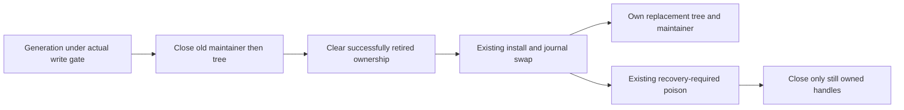
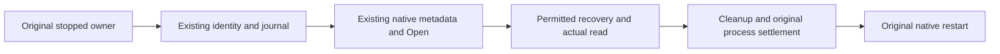
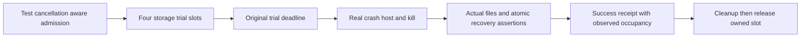
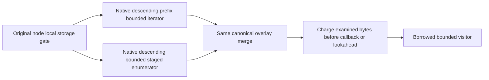
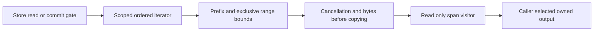
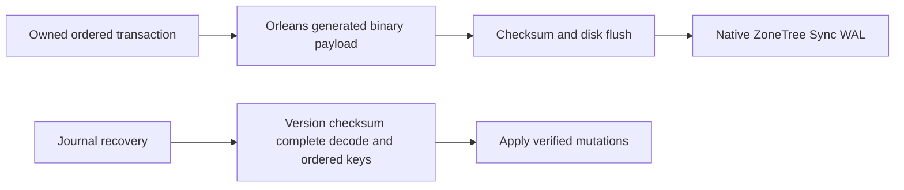

# StorageRecovery

## KL-007 v1 key and captured-envelope completion

The accepted [ADR-005 validation contract](../ADR/ADR-005-canonical-keyspace-codec.md#2026-10-04-v1-validation-and-ownership-completion)
preserves valid durable key bytes and defines explicit normalization, arity and
safe malformed-input errors. KL-007 maps to the four measurable criteria below,
with19 exact KeyCodec cases and the owning codec/native storage source closure.
Task closure requires all mapped cases on current-source Linux normal/scalar,
matching identities and the ADR-005 recovery/open-existing-store CI check. A
failure elsewhere remains a failed overall suite and cannot erase an independently
verified mapped outcome. The StorageRecovery feature's Docker/Aspire RF3,
endurance and power-loss gates remain separately mandatory and open; closing
KL-007 cannot close or waive them. Current local normal/scalar operation results
are supporting development evidence until the original Linux reports exist.

TASK-KEYCODEC-NATIVE-IDENTITY binds that existing matching-identity gate to the
original Build and Tests Linux job. Immediately after its Release build, prepare
the existing CodeQuality production-source manifest and unit/recovery image
sidecars in `TestResults/native-source-identity`; verify the same files after
the unchanged full normal, scalar and recovery runs and retain them beside the
original reports. Review the task's 33 owned source hashes against the matching
Abstractions, Core, Storage.IO, Storage.ZoneTree, UnitTests and RecoveryTests
source rows, original source/run/attempt/artifact provenance and executed
DLL/PDB hashes, MVID and portable-PDB/compiler identities. These are native
hash/identity receipts, not archived binaries. A manifest from the separately
rebuilt RF3 job cannot bind these executions. Root owns the contract and final
join; the workflow owner reuses the existing prepare/verify implementation in
`scripts/Features/CodeQuality/functional-coverage.production-source-manifest.ps1`
without a new collector, manifest schema, case subset or qualification gate.
Retain failed suite outcomes; the complete recovery stage must still pass.
Rollback removes only the additive receipt steps. Codec bytes, topology, suite
scope, individual deadlines and all separately required product gates stay fixed.

TASK-KEYCODEC-COVERAGE-GAPS extends the existing REQ/AC-KEYCODEC-002/003 rejection
flows without changing the supported bytes or adding a new acceptance gate.
The source-bound local native R117 report executes all18 existing cases and
records199/203 lines across the three executable codec files. Its four uncovered
lines are nonfinite persisted doubles, escaped payload exhaustion, decimal digit
overflow and the final decimal representability guard. The two token files contain
compile-time constants only and have no executable coverage denominator. The
native report contains no branch-outcome rows: branch coverage is unmeasured.

Root owns the evidence and joins; cli_static_collection Luna owns only
`tests/KeyLoad.UnitTests/Features/StorageRecovery/Cases/KeyCodecMalformedContractTests.cs`.
Add a complete reject/unchanged-input/healthy-roundtrip flow using independent
literal NaN/infinity, unterminated text/binary, invalid decimal digit and30-digit
persisted vectors. Assert the existing exact typed safe error, unchanged input
bytes and an exact valid composite roundtrip after rejection. Keep the final
decimal guard and review the canonical digit/exponent/scale invariant; do not add
private hooks or alter production code to force an unreachable defensive path.
Root reviews the bounded test, builds, runs native normal/scalar and collects
fresh native coverage with source/DLL/PDB identity. Obtain its actual case identity
from the original runner and update the mapped case count; do not fabricate one.
Current-source Linux normal/scalar and full recovery remain the closure gates.
SDK/MCP/frontend/dependency changes are N/A. Rollback removes only this added
regression flow; the original18 cases and all product gates remain mandatory.

The added rejection/unchanged-bytes/healthy-roundtrip case passes in local native
normal and scalar runs,19/19 in each with the same original identities and no
source or DLL/PDB drift. Native scoped coverage records202/203 executable lines
across the three codec files. The remaining line is the retained defensive decimal
parse guard; the preceding canonical coefficient/exponent/scale checks imply an
exact nonzero decimal with the required sign and scale. This is source reasoning,
not an executed failure path. The two constant-only files remain executable N/A
and branch coverage remains unmeasured.

KL-007 is complete against AC-KEYCODEC-001..004. The
[original Linux run37554329420](https://github.com/managedcode/KeyLoad/actions/runs/37554329420/job/112576973966)
at source259a3fa5 passed all19 exact mapped identities in both normal and scalar,
the full2,765-case unit census in each mode and235/235 process-recovery cases,
without failures or skips. Same-job source/test-image verification passed after
all three suites. All33 owned paths match the current checkout, the exact Git
source and original compiled source/PDB or project-input rows. Original artifact
IDs, ZIP/TRX/TUnit hashes and DLL/PDB/MVID identities are retained in
[status.json](../implementation/status.json). Independent root verification
rehashes the original ZIPs, binds every source row and checks all19 original
identities. This closes this task's codec/envelope criteria; the separate
StorageRecovery RF3, endurance, power-loss and performance gates remain open.

| Requirement | Measurable acceptance and owned TUnit mapping |
|---|---|
| REQ-KEYCODEC-001: preserve ordered v1 bytes and explicit type normalization | AC-KEYCODEC-001: original goldens and10,000 seeded decimals stay exact; an independent10,000 mixed-type/composite corpus roundtrips to the defined normalized values and sorts by a semantic oracle; negatives, valid Unicode/escaping, all type tags and extrema pass. Fractional decimal literal vectors retain their bytes and decode exactly under InvariantCulture and a custom CurrentCulture with a non-ASCII negative sign. New KeyCodecMixedCorpus/KeyCodecMixedCorpusTests, KeyCodecGoldenContractTests and KeyCodecCultureContractTests under UnitTests/Features/StorageRecovery. |
| REQ-KEYCODEC-002: corrupted input fails through safe typed errors | AC-KEYCODEC-002: literal invalid/truncated UTF-8, escapes, scalars, bool/tags, timestamp extrema violations, decimal overflow/rounding/underflow and noncanonical numeric forms return exact Corruption; empty/unknown versions remain FormatUnsupported. New KeyCodecMalformedContractTests; no payload values in messages. |
| REQ-KEYCODEC-003: writer and reader share finite component bounds | AC-KEYCODEC-003:0,1 and256 components encode/decode exactly;257 writer input fails ResourceExhausted before encoding an unsupported component and257 persisted components fail Corruption before decoding the final malformed component. Invalid UTF-16/nonfinite input gives Validation and unsupported CLR types UnsupportedCapability. New KeyCodecInputContractTests. |
| REQ-KEYCODEC-004: native captured envelopes cannot alias canonical storage to caller-owned buffers | AC-KEYCODEC-004: actual ZoneTree staging copies input key/value before mutation/pool reuse; mutating a returned independently owned KeyValueRecord does not change committed bytes; generated existing envelope roundtrip and real reopen preserve the exact original content. New KeyCodecEnvelopeOwnershipTests, existing permanent native aliases/Ids, real provider only. |

Canonical map: shared codec/storage carriers in Abstractions/Storage and new
cohesive validation helpers in Abstractions/Features/StorageRecovery; provider
ownership in Storage.ZoneTree/Features/StorageRecovery; matching real-provider
UnitTests/Features/StorageRecovery. Root owns this spec, ADR/task graph and final
evidence. Physical placement, apply/replication/native WAL authority and public
JSON stay unchanged. UI/SDK/MCP schema work N/A: no new wire operation.

## KL-008 distinct-process storage ownership

REQ-STORAGE-008 includes the KL-008 exclusive physical-owner requirement in the
architecture backlog. AC-STORAGE-OWNER-001 makes that existing requirement
measurable: while a parent owns a real current-format ZoneTreeStore, an actual
Release CrashHost existing-store inspection in a separate process fails with the
existing safe IOException receipt. The child and both original output readers
must settle before inspection returns. Identity bytes, committed value and
position remain exact, and the parent can commit and read a subsequent value.
A second child is still denied while that parent is open. After actual parent
disposal, child inspection and ordinary parent reopen succeed with the exact
identity, updated value and position. Retain readable canonical journal bytes
across denied opens; do not force reads through the active exclusive lock handle
or require asynchronously maintained physical tree files to stay unchanged.

TASK-STORAGE-OWNER-PROCESS is test-first under
[ADR-046](../ADR/ADR-046-storage-private-owners.md). Root owns this criterion,
source/evidence joins and delivery. The unpack_atomicity Luna worker owns one new
`tests/KeyLoad.UnitTests/Features/StorageRecovery/Cases/StorageOwnerProcessTests.cs`
and reuses the existing ZoneTreeExistingStoreFixture, inspector process and safe
receipt assertions. Keep its real30-second child deadline,8-KiB output bounds,
strict protocol, outer node-owner lock and original exit/readers cleanup. No
fake parent rejection, new child variant, production hook, swallowed failure or
deadline increase. If existing APIs cannot express the flow, report the exact
additional file scope before implementation.

Root reviews and joins the bounded packet, builds, runs the original native
normal/scalar ownership flows and collects actual storage-module coverage.
Current-source Linux normal/scalar and complete recovery qualify this criterion;
the other KL-008 lease/maintainer/pool requirements and full StorageRecovery RF3,
endurance and power-loss gates remain mandatory. SDK/MCP/frontend/dependency,
format and rollout changes are N/A: this adds regression evidence only. Rollback
removes only the new test. This criterion does not mark the broad AC-SQ-001..008
group or the whole task passed.

## Current-format storage and restore contract

The single supported native format, current restore authority, strict rejection
rules and their owning REQ/AC mappings are defined by
[CurrentFormat](StorageRecovery/CurrentFormat.md), [ADR-011](../ADR/ADR-011-current-native-format.md)
and [ADR-116](../ADR/ADR-116-first-release-current-format.md). Ordinary open,
recovery, snapshot installation, backup and restore accept only that current
contract. Unknown or corrupt mandatory data fails closed before publication;
there is no alternate reader, conversion path or format fallback. Current-format
backup restoration creates a new authority incarnation and completes its bounded
blob-authority normalization before writable service. The source backup remains
unchanged and an incomplete restore stays fenced.

The current-format positive and rejection operations map to the existing real
ZoneTree, CrashHost, RecoveryTests and Docker/Aspire SDK/MCP cases named in those
owning feature contracts. Preserve exact persisted bytes, authorization, RF3
ownership and complete process/resource settlement. Source review and development
receipts do not close the required Linux or RF3 qualification gates.

## Retired checkpoint handle ownership

REQ-STORAGE-020 / AC-DBHP-009 preserves one physical owner for each successfully
retired native maintainer/tree. [ADR-046](../ADR/ADR-046-storage-private-owners.md)
freezes the ordered three-file test-first repair after the real40f87 native
InstallPrepared cleanup failure. The actual failed-install scenario must retain
exact RecoveryRequired/warm rejection at InstallPrepared and JournalSwapped,
then close the log/store and repeat actual Dispose without redisposing retired
handles. New healthy handles and directory locks retain their original lifetime.
No new interface/package/format, caught cleanup error or relaxed fault oracle.
Root owns integration and full normal/scalar/recovery/RF3 GitHub qualification;
development/source review alone does not close this requirement.

## Guarded original-store inspection

REQ-STORAGE-015 maps AC-SG009-001..004 in ../ADR/ADR-059-isolated-intensive-timeseries.md to
TASK-ISO-TS009C-G-W/I under [ADR-059](../ADR/ADR-059-isolated-intensive-timeseries.md).
The private original-store guard rejects missing original files or changed
identity before provider recovery, uses provider Open rather than OpenOrCreate,
and preserves ordinary public open/codecs. Real native-file TUnit verifies
identity/data/position, missing/mismatch/locked/invalid flows and normal reopen.
Independent registered cleanup retains primary/cleanup failures. Every native
proof requires a separately owned original inspector process and exit/readers
join before restart because provider partial open cannot prove handle settlement.
Source implementation/runtime qualification and parent control/ACK/copy remain
pending; no power-loss or immutability claim. Rollback removes the additive private
mode only. Exact ordered ownership/tests/exception evidence live in ADR-059.

## Bounded real crash-trial qualification

REQ-STORAGE-014 maps AC-RC-001..004 in StorageRecovery.md
to TASK-REC-ADMIT-002 under [ADR-035](../ADR/ADR-035-memory-performance.md).
Exact c486/run37060131271 Windows reports19 seeded batch errors (0..18)
and subscription MutationApplied3 cancellation; Linux/macOS recovery passes.
Marker/receipt/input-read cancellations do not identify a storage defect. A shared
test-only four-slot admission bounds each storage CrashHost launch through real
reopen, assertions and cleanup. It starts before each unchanged15s/20s trial CTS,
preserves20x50 seeded crashes and all checkpoint/projection/subscription cases,
and leaves native replica-process fixtures unchanged. Success receipt rows follow
atomic/durable assertions and add measured occupancy/peak fields. No fault point,
assertion, readiness or job bound is reduced. The Linux-only GitHub recovery
suite and 1000successful seeded rows in the Linux run must qualify the candidate;
source/lifetime review explicitly covers rare exceptional permit/cleanup paths
without doubles.

## Descending bounded borrowed ranges

REQ-STORAGE-013 / AC-RANGE-REV-001..003 under
[ADR-052](../ADR/ADR-052-timeseries-bounded-aggregates.md) accepts the additive
VisitReverseRange contract with the same exclusive bounds/borrowed lifetime as
VisitRange. TASK-SERIES-REVERSE-W8 owns only private cursor/bounds/merge behavior
and new real-store ReverseRangeTests, ReverseTransactionRangeTests and
ReverseRangeResourceTests. Root alone owns interface and facade/budget forwarding.
Native prefix-bounded NoRefresh reverse seek and native SortedSet reverse
enumeration preserve staged tombstones/replacements without complete buffering.
Exact observer/lookahead/cancel/early-stop and healthy-following-operation tests
remain mandatory, with all existing forward tests preserved. Native seek failure
disposal is source/lifetime review, explicitly not an executed fake fault case.
Source implementation and exact-SHA runtime evidence remain pending.

REQ-STORAGE-012 / AC-STORAGE-012 (TASK-RUNTIME-WINDOWS-RECOVERY-W3) preserves
the existing killed-child filesystem readiness bound. After actual process exit,
exclusive readiness covers owner.lock, commands.wal and the actual ZoneTree
tree/0.meta.wal when present, which failed to reopen in Windows CI37021991878. The prior receipt
does not identify the sharing holder; this is a test-fixture observation gap,
not proof of a storage/dependency defect. Keep the five-second bound and25ms poll,
all50 seeded trials, original trial deadlines, WAL/snapshot/atomic assertions and
permanent sharing failure. Cancellation stops before another probe; no retry of
the recovery operation, default timeout increase or filesystem bypass is allowed.

TASK-RUNTIME-RECOVERY-W4 refines this same criterion using exact main
b533c80 / CI37032546228. During checkpoint installation the disposed live tree
is moved aside before InstallPrepared and JournalSwapped callbacks; the child
can therefore exit with no tree directory. Only FileNotFoundException and
DirectoryNotFoundException while opening the optional metadata WAL mean that
this file has no holder. owner.lock and commands.wal remain required exclusive
probes; sharing violations and all other I/O errors retain the original bound.
No readiness probe creates files or directories. Real missing-directory and
missing-metadata-file regressions assert successful readiness without recreating
either path, then restore the actual store files and prove subsequent reopen
and commit. Missing required ownership/journal files must still fail, and the
existing held-file/cancel/pre-cancel/permanent-lock tests remain intact.

TASK-RUNTIME-WIN-ELAPSED-W6 refines AC-STORAGE-012 using exact323d60499 /
CI37044499074. Both missing-required-file arguments catch the expected exact
FileNotFoundException, then exceed the unchanged six-second observation cap.
They overlap the concurrent native suite; the report does not identify the
precise scheduler delay. Apply method-level keyless TUnit NotInParallel only to
AcStorage012_MissingRequiredOwnershipFileStillFails, preserving both arguments,
five-second lower/six-second upper assertions,25ms polling and no-file-creation
checks. Existing permanent-holder timing isolation and every other case remain.
No helper, timeout, retry or product change is authorized. Root owns accepted
criteria/evidence; the disjoint worker owns only KilledProcessFileReadinessTests.
Both formerly red native cases and full Linux recovery must pass at the
delivered SHA; source isolation is not proof against external VM preemption.
AC-REC-FUP-003 maps to these two argument cases and requires their unchanged
exact exception/no-create/5s lower/6s upper assertions. A timing failure, broader
serialization or weakened assertion fails this criterion.
ADR035/036/033 lifetime/test contracts suffice; rollback removes only this
attribute, retaining all failure evidence.

The common synchronous probe is internal test infrastructure shared with
ClusterReplication's existing store barrier. That caller retains one
five-second deadline across target stores and, only at typed snapshot/transfer
boundaries, both source stores, with its25ms poll; it does not perform consecutive
independently bounded waits. Root owns that caller join;
the StorageRecovery worker owns only the existing helper, real-file tests and
fixture. All checkpoint process-kill, seeded trials and replica snapshot/tail
assertions remain unchanged. Tests-first source hashes, numeric/lifetime review,
enabled development build/format and full exact-SHA Linux GitHub recovery
are the join; rollback reverts only the preserving helper/caller/test refinement.

New real-file tests first hold the metadata WAL exclusively after an actual
ZoneTree store closes: the shared barrier must remain pending, complete only
after releasing that holder, reject cancellation and fail under the same bounded
permanent lock. Root owns the existing RecoveryTests shared entry wrapper;
one worker owns new cohesive StorageRecovery readiness helper/tests. Existing
ADR035/041 owner/lifetime contracts suffice; product APIs/formats/permissions,
frontend and dependency release are N/A. Root reviews every original caller and
cleanup, builds/formats and qualifies full Linux-only GitHub recovery.
Windows still fails if the real holder does not clear or original15-second trial
bound is exceeded. Rollback reverts only the fixture helper/wrapper together.

The preserving byte readback assertions in FrameBudgetTests and
PreparedTransactionTests map additionally to AC-CQ-018. Pinned TUnit array equality
is reference equality; ordered content equivalence must retain every exact byte,
null failure, rejected-commit and reopen obligation. This test-source correction
does not change storage behavior or establish runtime qualification.

REQ-STORAGE-010 maps AC-CQ-015 and AC-SQ-002/003/004/006/007 plus AC-REP-004 to
the accepted preserving seven-file storage test-source stage. These references
preserve the named implementation/source constraints; they do not establish
provider behavior or any behavioral AC-SQ criterion. REQ-STORAGE-008 owns the
functional ZoneTree provider contract, including AC-SQ-008; a source-preservation
stage under REQ-STORAGE-010 is not evidence that AC-SQ-008 has passed. Existing
real frame/checkpoint/scoped read/partition-host/lock/reopen assertions remain
complete; deterministic bytes, awaited equivalent file APIs and cancellation
completion, standard marker-exception constructors and cohesive internal types
satisfy the enabled policy. The journal repair retains its real synchronous
Flush(true) barrier through an awaited complete truncate/flush/dispose operation.
Explicit IAtomicStore dispatch and view identity remain tested. Exact scope,
acceptance, method/assertion audit, rollback and required GitHub proof are in
CQ015's [CodeQuality](CodeQuality.md) acceptance and execution contract. ADR033/032
suffice for this test-source-only refinement; production/data/API/ownership
contracts stay exact.

Node-local journals, owned values, committed read cuts, checkpoint/recovery and
bounded provider work. [ADR-035](../ADR/ADR-035-memory-performance.md) defines the
new scoped-read contract; ADR-032 records existing layout migration debt.

| Requirement | Acceptance | Tests / owner |
|---|---|---|
| REQ-STORAGE-001: budget before returned page copies; spans never escape the gate | AC-MP-002 | Real ZoneTree scoped point/range byte and lifetime cases; TASK-MP-005/005A |
| REQ-STORAGE-002: exact prefix/exclusive-bound/order/overlay semantics without global overfetch | AC-MP-002 | Real transaction replacement/deletion/insert/out-of-range cases; TASK-MP-005A |
| REQ-STORAGE-003: cancellation/early stop release iterator and preserve canonical data | AC-MP-002/012 | Real store cancel/visitor failure, subsequent read/commit and recovery CI |
| REQ-STORAGE-004: the physical node owns canonical and replica stores, locks, ordered apply and shutdown | AC-REP-002/004; AC-ROUTE-002 | CrashHost/Recovery and Docker RF3 reopen, failover and migration scenarios under ADR-036 |
| REQ-STORAGE-008: cohesive private provider owners meet numeric gates without changing storage/caller contracts | AC-SQ-001..008 in StorageRecovery.md | ADR-046 TASK-MP-010AF-R/T/C/L/B; source join and real lifetime test source exist; enabled provider development build clean, complete exact-SHA runtime qualification pending |
| REQ-STORAGE-009: validation and apply share one private mutation projection per staged generation | AC-PSW-001..004, AC-MP-006/012 | ADR-035 TASK-MP-016P-W/L; first-authored PreparedTransactionTests plus existing FrameBudget/recovery/RF3 proof; source and qualification pending |
| REQ-STORAGE-011: startup identity metadata is finite and failed read releases physical ownership | AC-BSM-001/003/005 | [ADR-048](../ADR/ADR-048-bounded-storage-metadata.md), Metadata* real-file constructor/restore/reopen checks under BackupRestore; complete source and GitHub execution pending |
| REQ-STORAGE-012: killed-child readiness includes the real metadata WAL when present, permits only precise sanctioned metadata absence, and preserves cancellation and the original failure bound | AC-STORAGE-012 | `tests/KeyLoad.RecoveryTests/Features/StorageRecovery/Cases/KilledProcessFileReadinessTests.cs`: actual closed-store pending/release, cancellation, pre-cancellation, permanent-lock, missing optional directory/file without creation and missing required file cases; `RecoveryTests.cs` retains every process-kill scenario; TASK-RUNTIME-WINDOWS-RECOVERY-W3 and TASK-RUNTIME-RECOVERY-W4, Linux-only GitHub recovery qualification pending |

Ownership: common public storage contracts stay in Abstractions/Storage;
provider helpers in Storage.ZoneTree/Features/StorageRecovery, tests mirror that
name in UnitTests/RecoveryTests. `src/KeyLoad.Server/Features/StorageRecovery/Hosting/PartitionHost.cs`
owns process composition of both independent stores and their protocol/materializer
lifetimes under [ADR-036](../ADR/ADR-036-orleans-foundation.md). Grains receive
non-owning engine/coordinator references and never dispose or reopen those files.
ZoneTreeStore remains the public composition facade; replaced private partial
behavior lives under StorageRecovery and BackupRestore according to ADR-046.
No schema, UI or business-authorization change applies.

[ADR-046](../ADR/ADR-046-storage-private-owners.md) accepts replacement of private
facade partial behavior with one runtime plus real StorageRecovery initialization,
journal, view/transaction/range and checkpoint owners. BackupRestore owns the
separate local backup component. Exact signatures, file/task ownership, disposal
orders, test matrix and join are in the [acceptance](StorageRecovery.md)
and [plan](StorageRecovery.md). No public/format/placement change or
numeric exception is authorized; source-only decomposition is not qualification.

The [prepared-write contract](StorageRecovery.md) and
[ordered plan](StorageRecovery.md) govern removal of the duplicate
mutation projection. Only transaction-private prepared arrays are cached; accepted
Stage/Reset invalidate them, rejected admission preserves the prior valid set,
and Stage retains caller-array ownership copies. WAL/apply/fault order and bytes
remain exact. No frontend/UI surface applies to this private storage optimization.

Real ZoneTree tests precede provider repairs; TUnit/MTP, process recovery and RF3
qualification execute only in GitHub Actions. Counters describe logical examined
work; physical I/O/native allocation requires separate measurement. Gates and
fault semantics cannot be relaxed for throughput.

## Null tombstone versus empty value repair

REQ-STORAGE-006/009, AC-STORAGE-006, AC-PSW-002..004 and AC-ROC-002/004/005 retain
the canonical nullable mutation distinction. The CLR byte
array projection previously conflated Delete with a live empty value; exact candidate
6949fa0 / GitHub run37005805424 contains failing WAL, absence, typed-read and
transaction-range regressions. TASK-RUNTIME-STORAGE-W owns only the explicit-null
projection in ZoneTreeTransaction.PrepareChanges and NEW
UnitTests/Features/StorageRecovery/TombstoneValueTests.cs. Lead owns docs and joins.

The new actual-store tests first prove staged/committed owned and borrowed reads,
empty Put versus Delete, exact WAL/base64/null bytes, frame limit, ordered range,
WAL reopen and snapshot record count/reopen. Preserve cache/copy/flush/apply order
and NullValueOverheadBytes=2 (four-byte null replaces two value quotes). ADR-035
and ADR-041 record the preserving repair. The current format preserves the distinction: an empty value remains a value, while Delete remains a tombstone. No stored bytes are reclassified. Rollback
reverts the projection but retains the regression source. Qualification requires
complete exact-SHA GitHub unit/process recovery/RF3 SDK/MCP evidence; source repair
alone proves no historical recovery, power-loss guarantee or performance gain.

## Повний storage, journal та recovery contract

Актори: node-local PartitionHost, canonical apply/read callers і recovery/backup operator. Actual source: [ZoneTreeStore](../../src/KeyLoad.Storage.ZoneTree/ZoneTreeStore.cs), [runtime](../../src/KeyLoad.Storage.ZoneTree/Features/StorageRecovery/Execution/ZoneTreeStoreRuntime.cs), [checkpoint manager](../../src/KeyLoad.Storage.ZoneTree/Features/StorageRecovery/Recovery/ZoneTreeCheckpointManager.cs), [KeyCodec](../../src/KeyLoad.Abstractions/Storage/KeyCodec.cs), [storage contracts](../../src/KeyLoad.Abstractions/Storage/StorageContracts.cs). Один фізичний owner утримує lock, journal/read-apply gate та immutable returned values; migrating grains не відкривають tree.

| Вимога | Acceptance / flows | Test mapping |
|---|---|---|
| REQ-STORAGE-005: journal/checkpoint recovery зберігає один complete acknowledged process cut | AC-STORAGE-005: реальний process kill на prepare/publish/install boundaries відновлює цілий cut без partial transaction; torn tail має declared handling, corrupt complete frame fail closed; validated snapshot не змішується зі старим state | Existing `FiftySeededRealProcessCrashesPreserveAtomicTransactions`, `ProcessKillDuringCheckpointPublicationRecoversOneCompleteGeneration`, `CorruptCompleteFrameFailsClosedInsteadOfBeingDiscardedAsATornTail` у [RecoveryTests](../../tests/KeyLoad.RecoveryTests/Features/StorageRecovery/Cases/RecoveryTests.cs) |
| REQ-STORAGE-006: canonical key/envelope/owned-value format має stable ordering і scope | AC-STORAGE-006: golden keys, escaped UTF-8 components, signed/decimal ordering та scope не колідують; invalid/corrupt format відхиляється, borrowed spans не escape gate | Existing `GoldenKeysRemainStable`, `TenThousandSeededDecimalKeysRoundTripAndSortNumerically`, `StringsUseUtf8OrdinalOrderingAndEscapedComponentsDoNotCollide` у [KeyCodecTests](../../tests/KeyLoad.UnitTests/Features/StorageRecovery/Cases/KeyCodecTests.cs); scoped-read cases AC-MP-002 |
| REQ-STORAGE-007: current-format readers reject unsupported or corrupt persisted data before effects | AC-STORAGE-007: real current-format open, recovery, snapshot install and backup/restore accept supported records; unknown/corrupt mandatory versions fail closed with original bytes and authority unchanged; no conversion or fallback reader is invoked | Existing current-format ZoneTree, RecoveryTests and BackupRestore real-operation cases under [CurrentFormat](StorageRecovery/CurrentFormat.md), [ADR-011](../ADR/ADR-011-current-native-format.md) and [ADR-116](../ADR/ADR-116-first-release-current-format.md) |

ProcessDurable та QuorumProcessDurable описують перевірений declared process failure model історичного коду; `LocalDurable`/`QuorumDurable`, power-loss і endurance не приймаються із process-kill source/test names. Full ACK barrier — [ADR-003](../ADR/ADR-003-durability-ack-barrier.md); committed read views — [ADR-004](../ADR/ADR-004-committed-read-views.md); versioned keyspace — [ADR-005](../ADR/ADR-005-canonical-keyspace-codec.md); backup/log retention — [ADR-008](../ADR/ADR-008-backup-log-retention.md), [BackupRestore](BackupRestore.md).

Current-code journal, compaction, checkpoint and scoped-visitor changes require exact delivered-source evidence. Source and recovery evidence is qualified through the required TUnit, actual child-process recovery and RF3 suites. Maintenance automation and power-loss gates remain explicitly pending. Provider/container composition — один owner; нові helper/test scopes не міняють format без ADR contract.

### Seeded receipt lifetime correction

REQ-STORAGE-014 / AC-RC-003 also maps AC-AISQL-014 and TASK-AISQL-023. Exact
run37070004864 Windows job111047630131 passed135/136, no skips; batch7/seed1708
cancelled during receipt write after atomic assertions and cleanup completed.
The log cannot identify the trial, deadline source or storage damage. Move the
unchanged receipt into the original trial try immediately after atomic/durable
assertions, matching the Receipt-before-Cleanup diagram above. Keep original15s
linked token, all20x50 faults/trials, actual four-slot ownership and unconditional
cleanup. The existing catch then retains seed/trial/stage for receipt failures;
any cleanup failure still fails qualification. Owner: gates worker, RecoveryTests.cs
RunSeededCrashTrialAsync call placement only; root joins exact Linux recovery
and1000success receipts in the Linux run. Existing ADR-035 lifetime/test
contracts suffice;
ADR:N/A for additional architecture because this is test-harness ordering only,
with no product/wire/persistence/topology change. Rollback reintroduces the
post-cleanup receipt cancellation risk without altering production data.

## Orleans binary atomic WAL

[ADR-057](../ADR/ADR-057-orleans-atomic-wal.md) accepts REQ-STORAGE-015..019 and AC-WAL-001..005. Current commands.wal mutation payloads use generated Orleans binary serialization with WAL signature4, identity epoch7 and checkpoint5 under [CurrentFormat](StorageRecovery/CurrentFormat.md). Native ZoneTree raw-byte Sync WAL and replication journals retain their current contracts. Unsupported or corrupt mandatory frames fail closed; no alternate decoder or fallback reader is used. The closed native ReadOnlyMemoryOfByteCodec registration keeps nullable value bytes raw rather than using the generic per-byte codec. The [original native receipt](https://github.com/managedcode/KeyLoad/actions/runs/37084177131) records verification of its exact source, cf630751e0f24e4d8183e55510add9c7207e377f. It is immutable historical evidence and does not qualify the changed current format or checkout. Fresh normal/scalar, process recovery, RF3, comparative performance, power-loss/endurance, numeric coverage and independent resource evidence remain required.

|Requirement|Acceptance/test trace|
|---|---|
|REQ-STORAGE-015 binary mutation codec|AC-WAL-001 real-store binary/empty/delete roundtrip and reopen|
|REQ-STORAGE-016 exact bounded payload|AC-WAL-002 FrameBudgetTests plus PreparedTransactionTests cache/replacement/reset/rejected-stage|
|REQ-STORAGE-017 safe replay|AC-WAL-003 checksum/full-consumption/shape/order and unsupported-format rejection; OrleansWalSuccessorTests verifies last legal sequence, terminal overflow rejection, unchanged journal/identity, no premature apply and released ownership; existing real commit crash cuts remain mandatory|
|REQ-STORAGE-018 current-version fence and restore|AC-WAL-004 current checkpoint/empty/refusal and InstallSnapshot/restore identity preservation|
|REQ-STORAGE-019 authentic qualification|AC-WAL-005 full Release/formatter/governance and exact-SHA GitHub unit/process-recovery/RF3 SDK+MCP; speed and power-loss unclaimed|

### TASK-WAL-LENGTH-MISMATCH complete-frame regression

TASK-WAL-LENGTH-MISMATCH refines existing REQ-STORAGE-017 / AC-WAL-003 only.
`NativeStoreOpenPreflightTests.R12Ac002CompleteCorruptionRejectsBeforeAnyProviderFileChanges`
adds direct-open and real CrashHost-inspector arguments for an otherwise complete
current WAL frame whose declared payload length is one byte shorter than its
actual serialized payload. Both paths must return the existing exact
`ErrorCode.Corruption`, preserve the complete provider file/tree hash inventory,
and release the owner lock. The test begins with an actual committed ZoneTree
record and a valid preceding frame; it does not add a frame-size limit or change
reader behavior.

The short-header case is already covered by
`R12Ac002IncompleteCurrentTailIsOnlyTruncatedByOrdinaryRecovery`: it is an
incomplete-tail recovery case, not a corruption oracle. Existing truncation and
committed-prefix assertions remain unchanged. This proposal adds regression
evidence only; fresh normal/scalar and required recovery/RF3 gates remain open
until their actual reports are joined.

This feature and its linked ADRs define the precise pass/fail conditions, disjoint ownership, rollout, rollback and verification. No new UI/API/model format; no local tests; all runtime evidence comes from GitHub.

### Current case-to-acceptance clarifications

The protected-principal cases in `tests/KeyLoad.UnitTests/Features/StorageRecovery/Cases/PartitionHostRecoveryTests.cs` map to REQ-AUTH-002 / AC-AUTH-002 in [Authorization](Authorization.md): the real pending-image path rejects missing/modified protected state on repeated host-open attempts and accepts a valid protected principal after installation. The same cases support REQ-STORAGE-004 / AC-REP-004 for the physical host's verified pending-image recovery and ownership path. They are local host/store evidence, not quorum or RF3 evidence, and are not generic format-corruption cases.

`OfflineRegularFileEntryTypeTests`, `OfflineRegularFileIdentityTests`, `OfflineRegularFileLockTests` and `OfflineRegularFileDuplicateLockTests` carry the obsolete source label `AC-EPOCH-012`. Their observed regular-entry, identity, BCL lock-interoperation and native-handle lifetime behavior is supporting primitive evidence for current REQ-STORAGE-015 / AC-SG009P-001..004. These methods do not invoke the guarded Release CrashHost protocol; they cannot establish the complete AC-SG009P process, strict-request, receipt, or original-reader settlement contract by themselves. The exact method-by-method observed claims and this limitation are recorded in the case-level traceability proposal.

REQ-STORAGE-015 also maps AC-SG009P-001..004 / TASK-ISO-SG009P-C/T/R/I under
ADR-059. Canonical directory is lexical normalized ordinal equality, without a
symlink/rename resistance claim. Every guard test invokes the genuine Release
CrashHost using bounded private JSON and actual failure/data facts; original
process exit and both pipe drains precede outer-lock release and ordinary reopen.
The cancellation case observes the original ready child, kills/reaps it and
checks data after normal reopen. Source and process qualification remain pending;
this test helper is not the native benchmark inspector/control/copy oracle.

TASK-EVENT-APPEND-SEEDED-CRASH-001 preserves REQ-STORAGE-006/007 and AC-STORAGE-006/007 through the exact seven native during-append process cuts and original child/readers/store-lock ownership frozen in [EventStreams](EventStreams.md#task-event-append-seeded-crash-001) and ADR002. The new complete recovered doc/event/head/dedup/queue/outbox/receipt and same-ID/healthy-follow-up assertions use real ZoneTree and current serialization. No runtime qualification, timeout change, multi-lane or power-loss claim follows from source. Existing required Linux/RF3/coverage gates remain unchanged.
