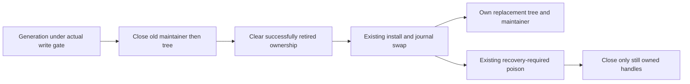
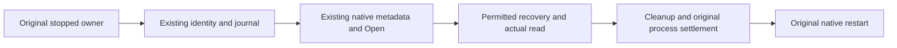
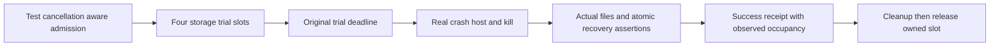
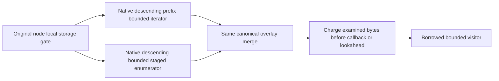
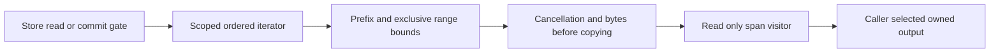
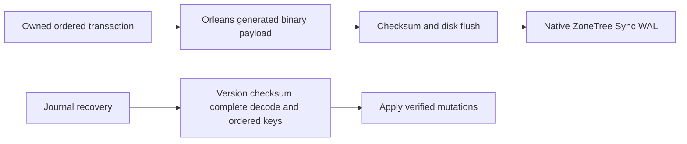

# StorageRecovery

## KL-007 v1 key and captured-envelope completion

The accepted [ADR-005 validation contract](../ADR/ADR-005-canonical-keyspace-codec.md#2026-10-04-v1-validation-and-ownership-completion)
preserves valid durable key bytes and defines explicit normalization, arity and
safe malformed-input errors. The [2026-10-04 development receipt](../implementation/keycodec-crud-development-2026-10-04.json)
records14 new KeyCodec cases plus4 original cases in full Aspire normal/scalar
suites at2889/2889 each, recovery228/228 and1000 unique atomic process cuts.
Complete source/runtime inventories remain unchanged across those three suites.
Exact delivered-source Linux and Docker/Aspire RF3 qualification remain pending;
process-kill evidence does not qualify power-loss durability.

| Requirement | Measurable acceptance and owned TUnit mapping |
|---|---|
| REQ-KEYCODEC-001: preserve ordered v1 bytes and explicit type normalization | AC-KEYCODEC-001: original goldens and10,000 seeded decimals stay exact; an independent10,000 mixed-type/composite corpus roundtrips to the defined normalized values and sorts by a semantic oracle; negatives, valid Unicode/escaping, all type tags and extrema pass. Fractional decimal literal vectors retain their bytes and decode exactly under InvariantCulture and a custom CurrentCulture with a non-ASCII negative sign. New KeyCodecMixedCorpus/KeyCodecMixedCorpusTests, KeyCodecGoldenContractTests and KeyCodecCultureContractTests under UnitTests/Features/StorageRecovery. |
| REQ-KEYCODEC-002: corrupted input fails through safe typed errors | AC-KEYCODEC-002: literal invalid/truncated UTF-8, escapes, scalars, bool/tags, timestamp extrema violations, decimal overflow/rounding/underflow and noncanonical numeric forms return exact Corruption; empty/unknown versions remain FormatUnsupported. New KeyCodecMalformedContractTests; no payload values in messages. |
| REQ-KEYCODEC-003: writer and reader share finite component bounds | AC-KEYCODEC-003:0,1 and256 components encode/decode exactly;257 writer input fails ResourceExhausted before encoding an unsupported component and257 persisted components fail Corruption before decoding the final malformed component. Invalid UTF-16/nonfinite input gives Validation and unsupported CLR types UnsupportedCapability. New KeyCodecInputContractTests. |
| REQ-KEYCODEC-004: native captured envelopes cannot alias canonical storage to caller-owned buffers | AC-KEYCODEC-004: actual ZoneTree staging copies input key/value before mutation/pool reuse; mutating a returned independently owned KeyValueRecord does not change committed bytes; generated existing envelope roundtrip and real reopen preserve the exact original content. New KeyCodecEnvelopeOwnershipTests, existing permanent native aliases/Ids, real provider only. |

Canonical map: shared codec/storage carriers in Abstractions/Storage and new
cohesive validation helpers in Abstractions/Features/StorageRecovery; provider
ownership in Storage.ZoneTree/Features/StorageRecovery; matching real-provider
UnitTests/Features/StorageRecovery. Root owns this spec, ADR/task graph and final
evidence. Physical placement, apply/replication/native WAL authority and public
JSON stay unchanged. UI/SDK/MCP schema work N/A: no new wire operation.

## Native data epoch and explicit offline copy upgrade

[ADR-077](../ADR/ADR-077-offline-native-data-epoch.md) freezes KL-043's supported
native5 -> separate native6 transition. Source is authored and root-reviewed;
provider and RecoveryTests development Release builds passed with zero warnings
and errors. The Aspire development process suite passed14/14 with no skipped
cases; its original artifacts and executed binaries are bound in
[development evidence](../implementation/epoch-upgrade-development-2026-10-03.json).
Homogeneous Docker RF3 and exact-source Linux qualification remain open. This fulfills the downgrade obligation of ADR-073/075 without
changing user model bytes, RF3 placement or native WAL acknowledgement ordering.

|Requirement|Acceptance and required evidence|
|---|---|
|REQ-STORAGE-021 current interpretation is fenced|AC-EPOCH-001: ordinary current open rejects native5/unknown/corrupt identity before journal/tree mutation; exact old executable rejects identity6 and checkpoint4; all compared files remain unchanged|
|REQ-STORAGE-022 offline conversion preserves authority and data|AC-EPOCH-002: real stopped native5 WAL4/checkpoint3 conversion copies exact raw keys/values, identity authority, positions and pause/generation into a verified separate6 directory; original bytes stay identical; invalid/torn/corrupt source fails without publication|
|REQ-STORAGE-022 recoverable publication|AC-EPOCH-003: real process kills at five appended upgrade stages leave original intact and target absent or fully current; retry rebuilds only matching owned stage or returns matching published target without erasing later writes|
|REQ-STORAGE-023 no format downgrade through images|AC-EPOCH-004: current Compact/CreateSnapshot/InstallSnapshot/native backup/restore retain6/checkpoint4; checkpoint3 fails ordinary install, unknown version fails closed and original backup stays unchanged|
|REQ-STORAGE-024 signed incompatible peers fail closed|AC-EPOCH-005: genuine stale-purpose signed vote/append/snapshot/request/discovery/reply envelopes fail before replay admission or dispatch; valid current signatures pass with permanent aliases/Ids and persisted replica2 unchanged|
|REQ-STORAGE-007 supported RF3 upgrade matrix|AC-EPOCH-006: exact previous/current process oracle and homogeneous upgraded Docker/Aspire RF3 .NET/official MCP prove reopen, replay/retention, snapshot and restart; supported cold-rollout and unsupported mixed/old-format matrix remains explicit|

Canonical source/test slices are StorageRecovery, with BackupRestore and the
existing ClusterRouting/ClusterReplication security joins. Public webpage N/A:
this is an offline server/provider operation. The offline Server command is owned
by root; the untrusted client CLI does not own physical storage. Task graph,
stage ordering, exact ownership, rollback, verification and escalation are in
ADR-077 and the implementation traceability record; no completed gate is inferred
from authored source.

## Retired checkpoint handle ownership

REQ-STORAGE-020 / AC-DBHP-009 preserves one physical owner for each successfully
retired native maintainer/tree. [ADR-046](../ADR/ADR-046-storage-private-owners.md)
freezes the ordered three-file test-first repair after the real40f87 native
InstallPrepared cleanup failure. The actual failed-install scenario must retain
exact RecoveryRequired/warm rejection at InstallPrepared and JournalSwapped,
then close the log/store and repeat actual Dispose without redisposing retired
handles. New healthy handles and directory locks retain their original lifetime.
No new interface/package/format, caught cleanup error or relaxed fault oracle.
Root owns integration and full normal/scalar/recovery/RF3 GitHub qualification;
development/source review alone does not close this requirement.

## Guarded original-store inspection

REQ-STORAGE-015 maps AC-SG009-001..004 in ../ADR/ADR-059-isolated-intensive-timeseries.md to
TASK-ISO-TS009C-G-W/I under [ADR-059](../ADR/ADR-059-isolated-intensive-timeseries.md).
The private original-store guard rejects missing original files or changed
identity before provider recovery, uses provider Open rather than OpenOrCreate,
and preserves ordinary public open/codecs. Real native-file TUnit verifies
identity/data/position, missing/mismatch/locked/invalid flows and normal reopen.
Independent registered cleanup retains primary/cleanup failures. Every native
proof requires a separately owned original inspector process and exit/readers
join before restart because provider partial open cannot prove handle settlement.
Source implementation/runtime qualification and parent control/ACK/copy remain
pending; no power-loss or immutability claim. Rollback removes the additive private
mode only. Exact ordered ownership/tests/exception evidence live in ADR-059.

## Bounded real crash-trial qualification

REQ-STORAGE-014 maps AC-RC-001..004 in StorageRecovery.md
to TASK-REC-ADMIT-002 under [ADR-035](../ADR/ADR-035-memory-performance.md).
Exact c486/run37060131271 Windows reports19 seeded batch errors (0..18)
and subscription MutationApplied3 cancellation; Linux/macOS recovery passes.
Marker/receipt/input-read cancellations do not identify a storage defect. A shared
test-only four-slot admission bounds each storage CrashHost launch through real
reopen, assertions and cleanup. It starts before each unchanged15s/20s trial CTS,
preserves20x50 seeded crashes and all checkpoint/projection/subscription cases,
and leaves native replica-process fixtures unchanged. Success receipt rows follow
atomic/durable assertions and add measured occupancy/peak fields. No fault point,
assertion, readiness or job bound is reduced. Real three-OS GitHub suites and
1000successful seeded rows per OS must qualify the candidate; source/lifetime
review explicitly covers rare exceptional permit/cleanup paths without doubles.

## Descending bounded borrowed ranges

REQ-STORAGE-013 / AC-RANGE-REV-001..003 under
[ADR-052](../ADR/ADR-052-timeseries-bounded-aggregates.md) accepts the additive
VisitReverseRange contract with the same exclusive bounds/borrowed lifetime as
VisitRange. TASK-SERIES-REVERSE-W8 owns only private cursor/bounds/merge behavior
and new real-store ReverseRangeTests, ReverseTransactionRangeTests and
ReverseRangeResourceTests. Root alone owns interface and facade/budget forwarding.
Native prefix-bounded NoRefresh reverse seek and native SortedSet reverse
enumeration preserve staged tombstones/replacements without complete buffering.
Exact observer/lookahead/cancel/early-stop and healthy-following-operation tests
remain mandatory, with all existing forward tests preserved. Native seek failure
disposal is source/lifetime review, explicitly not an executed fake fault case.
Source implementation and exact-SHA runtime evidence remain pending.

REQ-STORAGE-012 / AC-STORAGE-012 (TASK-RUNTIME-WINDOWS-RECOVERY-W3) preserves
the existing killed-child filesystem readiness bound. After actual process exit,
exclusive readiness covers owner.lock, commands.wal and the actual ZoneTree
tree/0.meta.wal when present, which failed to reopen in Windows CI37021991878. The prior receipt
does not identify the sharing holder; this is a test-fixture observation gap,
not proof of a storage/dependency defect. Keep the five-second bound and25ms poll,
all50 seeded trials, original trial deadlines, WAL/snapshot/atomic assertions and
permanent sharing failure. Cancellation stops before another probe; no retry of
the recovery operation, default timeout increase or filesystem bypass is allowed.

TASK-RUNTIME-RECOVERY-W4 refines this same criterion using exact main
b533c80 / CI37032546228. During checkpoint installation the disposed live tree
is moved aside before InstallPrepared and JournalSwapped callbacks; the child
can therefore exit with no tree directory. Only FileNotFoundException and
DirectoryNotFoundException while opening the optional metadata WAL mean that
this file has no holder. owner.lock and commands.wal remain required exclusive
probes; sharing violations and all other I/O errors retain the original bound.
No readiness probe creates files or directories. Real missing-directory and
missing-metadata-file regressions assert successful readiness without recreating
either path, then restore the actual store files and prove subsequent reopen
and commit. Missing required ownership/journal files must still fail, and the
existing held-file/cancel/pre-cancel/permanent-lock tests remain intact.

TASK-RUNTIME-WIN-ELAPSED-W6 refines AC-STORAGE-012 using exact323d60499 /
CI37044499074. Both missing-required-file arguments catch the expected exact
FileNotFoundException, then exceed the unchanged six-second observation cap.
They overlap the concurrent native suite; the report does not identify the
precise scheduler delay. Apply method-level keyless TUnit NotInParallel only to
AcStorage012_MissingRequiredOwnershipFileStillFails, preserving both arguments,
five-second lower/six-second upper assertions,25ms polling and no-file-creation
checks. Existing permanent-holder timing isolation and every other case remain.
No helper, timeout, retry or product change is authorized. Root owns accepted
criteria/evidence; the disjoint worker owns only KilledProcessFileReadinessTests.
Both formerly red native cases and full three-OS recovery must pass at the
delivered SHA; source isolation is not proof against external VM preemption.
AC-REC-FUP-003 maps to these two argument cases and requires their unchanged
exact exception/no-create/5s lower/6s upper assertions. A timing failure, broader
serialization or weakened assertion fails this criterion.
ADR035/036/033 lifetime/test contracts suffice; rollback removes only this
attribute, retaining all failure evidence.

The common synchronous probe is internal test infrastructure shared with
ClusterReplication's existing store barrier. That caller retains one
five-second deadline across target stores and, only at typed snapshot/transfer
boundaries, both source stores, with its25ms poll; it does not perform consecutive
independently bounded waits. Root owns that caller join;
the StorageRecovery worker owns only the existing helper, real-file tests and
fixture. All checkpoint process-kill, seeded trials and replica snapshot/tail
assertions remain unchanged. Tests-first source hashes, numeric/lifetime review,
enabled development build/format and full exact-SHA GitHub recovery all OSes
are the join; rollback reverts only the preserving helper/caller/test refinement.

New real-file tests first hold the metadata WAL exclusively after an actual
ZoneTree store closes: the shared barrier must remain pending, complete only
after releasing that holder, reject cancellation and fail under the same bounded
permanent lock. Root owns the existing RecoveryTests shared entry wrapper;
one worker owns new cohesive StorageRecovery readiness helper/tests. Existing
ADR035/041 owner/lifetime contracts suffice; product APIs/formats/permissions,
frontend and dependency release are N/A. Root reviews every original caller and
cleanup, builds/formats and qualifies full GitHub recovery on all three OSes.
Windows still fails if the real holder does not clear or original15-second trial
bound is exceeded. Rollback reverts only the fixture helper/wrapper together.

The preserving byte readback assertions in FrameBudgetTests and
PreparedTransactionTests map additionally to AC-CQ-018. Pinned TUnit array equality
is reference equality; ordered content equivalence must retain every exact byte,
null failure, rejected-commit and reopen obligation. This test-source correction
does not change storage behavior or establish runtime qualification.

REQ-STORAGE-010 maps AC-CQ-015 and AC-SQ-002/003/004/006/007 plus AC-REP-004 to
the accepted preserving seven-file storage test-source stage. Existing real
frame/checkpoint/scoped read/partition-host/lock/reopen assertions remain complete;
deterministic bytes, awaited equivalent file APIs and cancellation completion,
standard marker-exception constructors and cohesive internal types satisfy the
enabled policy. The journal repair retains its real synchronous Flush(true)
barrier through an awaited complete truncate/flush/dispose operation. Explicit
IAtomicStore dispatch and view identity remain tested. Exact scope, acceptance,
method/assertion audit, rollback and required GitHub proof are in CQ015's
[CodeQuality](CodeQuality.md) acceptance and execution contract. ADR033/032 suffice for this
test-source-only refinement; production/data/API/ownership contracts stay exact.

Node-local journals, owned values, committed read cuts, checkpoint/recovery and
bounded provider work. [ADR-035](../ADR/ADR-035-memory-performance.md) defines the
new scoped-read contract; ADR-032 records existing layout migration debt.

| Requirement | Acceptance | Tests / owner |
|---|---|---|
| REQ-STORAGE-001: budget before returned page copies; spans never escape the gate | AC-MP-002 | Real ZoneTree scoped point/range byte and lifetime cases; TASK-MP-005/005A |
| REQ-STORAGE-002: exact prefix/exclusive-bound/order/overlay semantics without global overfetch | AC-MP-002 | Real transaction replacement/deletion/insert/out-of-range cases; TASK-MP-005A |
| REQ-STORAGE-003: cancellation/early stop release iterator and preserve canonical data | AC-MP-002/012 | Real store cancel/visitor failure, subsequent read/commit and recovery CI |
| REQ-STORAGE-004: the physical node owns canonical and replica stores, locks, ordered apply and shutdown | AC-REP-002/004; AC-ROUTE-002 | CrashHost/Recovery and Docker RF3 reopen, failover and migration scenarios under ADR-036 |
| REQ-STORAGE-008: cohesive private provider owners meet numeric gates without changing storage/caller contracts | AC-SQ-001..008 in StorageRecovery.md | ADR-046 TASK-MP-010AF-R/T/C/L/B; source join and real lifetime test source exist; enabled provider development build clean, complete exact-SHA runtime qualification pending |
| REQ-STORAGE-009: validation and apply share one private mutation projection per staged generation | AC-PSW-001..004, AC-MP-006/012 | ADR-035 TASK-MP-016P-W/L; first-authored PreparedTransactionTests plus existing FrameBudget/recovery/RF3 proof; source and qualification pending |
| REQ-STORAGE-011: startup identity metadata is finite and failed read releases physical ownership | AC-BSM-001/003/005 | [ADR-048](../ADR/ADR-048-bounded-storage-metadata.md), Metadata* real-file constructor/restore/reopen checks under BackupRestore; complete source and GitHub execution pending |
| REQ-STORAGE-012: killed-child readiness includes the real metadata WAL when present, permits only precise sanctioned metadata absence, and preserves cancellation and the original failure bound | AC-STORAGE-012 | `tests/KeyLoad.RecoveryTests/Features/StorageRecovery/Cases/KilledProcessFileReadinessTests.cs`: actual closed-store pending/release, cancellation, pre-cancellation, permanent-lock, missing optional directory/file without creation and missing required file cases; `RecoveryTests.cs` retains every process-kill scenario; TASK-RUNTIME-WINDOWS-RECOVERY-W3 and TASK-RUNTIME-RECOVERY-W4, full three-OS GitHub recovery qualification pending |

Ownership: common public storage contracts stay in Abstractions/Storage;
provider helpers in Storage.ZoneTree/Features/StorageRecovery, tests mirror that
name in UnitTests/RecoveryTests. `src/KeyLoad.Server/Features/StorageRecovery/Hosting/PartitionHost.cs`
owns process composition of both independent stores and their protocol/materializer
lifetimes under [ADR-036](../ADR/ADR-036-orleans-foundation.md). Grains receive
non-owning engine/coordinator references and never dispose or reopen those files.
ZoneTreeStore remains the public composition facade; replaced private partial
behavior lives under StorageRecovery and BackupRestore according to ADR-046.
No schema, UI or business-authorization change applies.

[ADR-046](../ADR/ADR-046-storage-private-owners.md) accepts replacement of private
facade partial behavior with one runtime plus real StorageRecovery initialization,
journal, view/transaction/range and checkpoint owners. BackupRestore owns the
separate local backup component. Exact signatures, file/task ownership, disposal
orders, test matrix and join are in the [acceptance](StorageRecovery.md)
and [plan](StorageRecovery.md). No public/format/placement change or
numeric exception is authorized; source-only decomposition is not qualification.

The [prepared-write contract](StorageRecovery.md) and
[ordered plan](StorageRecovery.md) govern removal of the duplicate
mutation projection. Only transaction-private prepared arrays are cached; accepted
Stage/Reset invalidate them, rejected admission preserves the prior valid set,
and Stage retains caller-array ownership copies. WAL/apply/fault order and bytes
remain exact. No frontend/UI surface applies to this private storage optimization.

Real ZoneTree tests precede provider repairs; TUnit/MTP, process recovery and RF3
qualification execute only in GitHub Actions. Counters describe logical examined
work; physical I/O/native allocation requires separate measurement. Gates and
fault semantics cannot be relaxed for throughput.

## Null tombstone versus empty value repair

REQ-STORAGE-006/009, AC-STORAGE-006, AC-PSW-002..004 and AC-ROC-002/004/005 retain
the canonical nullable mutation distinction. The read-only CLR migration's byte
array projection currently turns Delete into a live empty value; exact candidate
6949fa0 / GitHub run37005805424 contains failing WAL, absence, typed-read and
transaction-range regressions. TASK-RUNTIME-STORAGE-W owns only the explicit-null
projection in ZoneTreeTransaction.PrepareChanges and NEW
UnitTests/Features/StorageRecovery/TombstoneValueTests.cs. Lead owns docs and joins.

The new actual-store tests first prove staged/committed owned and borrowed reads,
empty Put versus Delete, exact WAL/base64/null bytes, frame limit, ordered range,
WAL reopen and snapshot record count/reopen. Preserve cache/copy/flush/apply order
and NullValueOverheadBytes=2 (four-byte null replaces two value quotes). ADR-035
and ADR-041 record the preserving repair. No format migration is required; earlier
empty rows cannot be safely reclassified without independent provenance. Rollback
reverts the projection but retains the regression source. Qualification requires
complete exact-SHA GitHub unit/process recovery/RF3 SDK/MCP evidence; source repair
alone proves no historical recovery, power-loss guarantee or performance gain.

## Повний storage, journal та recovery contract

Актори: node-local PartitionHost, canonical apply/read callers і recovery/backup operator. Actual source: [ZoneTreeStore](../../src/KeyLoad.Storage.ZoneTree/ZoneTreeStore.cs), [runtime](../../src/KeyLoad.Storage.ZoneTree/Features/StorageRecovery/Execution/ZoneTreeStoreRuntime.cs), [checkpoint manager](../../src/KeyLoad.Storage.ZoneTree/Features/StorageRecovery/Recovery/ZoneTreeCheckpointManager.cs), [KeyCodec](../../src/KeyLoad.Abstractions/Storage/KeyCodec.cs), [storage contracts](../../src/KeyLoad.Abstractions/Storage/StorageContracts.cs). Один фізичний owner утримує lock, journal/read-apply gate та immutable returned values; migrating grains не відкривають tree.

| Вимога | Acceptance / flows | Test mapping |
|---|---|---|
| REQ-STORAGE-005: journal/checkpoint recovery зберігає один complete acknowledged process cut | AC-STORAGE-005: реальний process kill на prepare/publish/install boundaries відновлює цілий cut без partial transaction; torn tail має declared handling, corrupt complete frame fail closed; validated snapshot не змішується зі старим state | Existing `FiftySeededRealProcessCrashesPreserveAtomicTransactions`, `ProcessKillDuringCheckpointPublicationRecoversOneCompleteGeneration`, `CorruptCompleteFrameFailsClosedInsteadOfBeingDiscardedAsATornTail` у [RecoveryTests](../../tests/KeyLoad.RecoveryTests/Features/StorageRecovery/Cases/RecoveryTests.cs), [InterruptedSnapshotTests](../../tests/KeyLoad.RecoveryTests/InterruptedSnapshotTests.cs) |
| REQ-STORAGE-006: canonical key/envelope/owned-value format має stable ordering і scope | AC-STORAGE-006: golden keys, escaped UTF-8 components, signed/decimal ordering та scope не колідують; invalid/corrupt format відхиляється, borrowed spans не escape gate | Existing `GoldenKeysRemainStable`, `TenThousandSeededDecimalKeysRoundTripAndSortNumerically`, `StringsUseUtf8OrdinalOrderingAndEscapedComponentsDoNotCollide` у [KeyCodecTests](../../tests/KeyLoad.UnitTests/KeyCodecTests.cs); scoped-read cases AC-MP-002 |
| REQ-STORAGE-007: format/schema upgrades мають explicit compatibility та recovery path | AC-STORAGE-007: PLANNED version fixtures доводять upgrade/reopen/rollback на matching data generations; unsupported version не читається як current, interrupted migration лишає recoverable authority | PLANNED real-store/CrashHost upgrade suite, KL-043 pending; [ADR-011](../ADR/ADR-011-format-upgrades.md) Proposed unresolved upgrade mechanism |

ProcessDurable та QuorumProcessDurable описують перевірений declared process failure model історичного коду; `LocalDurable`/`QuorumDurable`, power-loss і endurance не приймаються із process-kill source/test names. Full ACK barrier — [ADR-003](../ADR/ADR-003-durability-ack-barrier.md); committed read views — [ADR-004](../ADR/ADR-004-committed-read-views.md); versioned keyspace — [ADR-005](../ADR/ADR-005-canonical-keyspace-codec.md); backup/log retention — [ADR-008](../ADR/ADR-008-backup-log-retention.md), [BackupRestore](BackupRestore.md).

Current-code journal/compaction/checkpoints і in-progress scoped visitor ремонти не є proof нового delivered SHA. Все source/recovery evidence кваліфікується тільки в GitHub TUnit, actual child-process recovery і RF3 suites. Future maintenance автоматизація, широкі upgrades та power-loss gates залишаються explicit pending. Provider/container composition — один owner; нові helper/test scopes не міняють format без ADR contract.

### Seeded receipt lifetime correction

REQ-STORAGE-014 / AC-RC-003 also maps AC-AISQL-014 and TASK-AISQL-023. Exact
run37070004864 Windows job111047630131 passed135/136, no skips; batch7/seed1708
cancelled during receipt write after atomic assertions and cleanup completed.
The log cannot identify the trial, deadline source or storage damage. Move the
unchanged receipt into the original trial try immediately after atomic/durable
assertions, matching the Receipt-before-Cleanup diagram above. Keep original15s
linked token, all20x50 faults/trials, actual four-slot ownership and unconditional
cleanup. The existing catch then retains seed/trial/stage for receipt failures;
any cleanup failure still fails qualification. Owner: gates worker, RecoveryTests.cs
RunSeededCrashTrialAsync call placement only; root joins exact three-OS recovery
and1000success receipts perOS. Existing ADR-035 lifetime/test contracts suffice;
ADR:N/A for additional architecture because this is test-harness ordering only,
with no product/wire/persistence/topology change. Rollback reintroduces the
post-cleanup receipt cancellation risk without altering production data.

## Orleans binary atomic WAL

[ADR-057](../ADR/ADR-057-orleans-atomic-wal.md) accepts owner-directed REQ-STORAGE-015..019 and AC-WAL-001..005. New commands.wal mutation payloads use generated Orleans binary serialization, versioned magic3 and identity4. Native ZoneTree raw-byte Sync WAL, checkpoint2 and replication journals retain their own contracts. Offline upgrade requires old-binary Compact and a verified backup on every stopped RF3 node; a remaining JSON frame1 or prior binary frame2 refuses with FormatUnsupported instead of a fallback reader. The closed native ReadOnlyMemoryOfByteCodec registration keeps nullable value bytes raw rather than using the generic per-byte codec. The [exact-source native receipt](../implementation/atomic-wal-qualification-37084177131.json) qualifies the mandatory Release/formatter/governance/analyzer,1407/1407 units in each normal/scalar mode,136/136 process recovery and63/63 RF3 gates at cf630751e0f24e4d8183e55510add9c7207e377f, with no skips; all66 WAL cases pass in each mode. The1000 actual process-kill cuts are atomic. Comparative speed, power-loss/endurance, numeric coverage and independent migration/resource evidence remain open; the complete comparative workflow was still running at evidence capture.

|Requirement|Acceptance/test trace|
|---|---|
|REQ-STORAGE-015 binary mutation codec|AC-WAL-001 real-store binary/empty/delete roundtrip and reopen|
|REQ-STORAGE-016 exact bounded payload|AC-WAL-002 FrameBudgetTests plus PreparedTransactionTests cache/replacement/reset/rejected-stage|
|REQ-STORAGE-017 safe replay|AC-WAL-003 checksum/full-consumption/shape/order/legacy rejection; OrleansWalSuccessorTests verifies last legal sequence, terminal overflow rejection, unchanged journal/identity, no premature apply and released ownership; existing real commit crash cuts remain mandatory|
|REQ-STORAGE-018 version fence and offline upgrade|AC-WAL-004 legacy checkpoint/empty/refusal, Compact/InstallSnapshot/restore identity preservation|
|REQ-STORAGE-019 authentic qualification|AC-WAL-005 full Release/formatter/governance and exact-SHA GitHub unit/process-recovery/RF3 SDK+MCP; speed and power-loss unclaimed|

This feature and its linked ADRs define the precise pass/fail conditions, disjoint ownership, rollout, rollback and verification. No new UI/API/model format; no local tests; all runtime evidence comes from GitHub.

REQ-STORAGE-015 also maps AC-SG009P-001..004 / TASK-ISO-SG009P-C/T/R/I under
ADR-059. Canonical directory is lexical normalized ordinal equality, without a
symlink/rename resistance claim. Every guard test invokes the genuine Release
CrashHost using bounded private JSON and actual failure/data facts; original
process exit and both pipe drains precede outer-lock release and ordinary reopen.
The cancellation case observes the original ready child, kills/reaps it and
checks data after normal reopen. Source and process qualification remain pending;
this test helper is not the native benchmark inspector/control/copy oracle.

## Complete stopped RF3 node conversion (2026-10-04 accepted contract)

The [whole-node development receipt](../implementation/node-epoch-development-2026-10-04.json) binds the reviewed source and executed binaries to full Aspire normal/scalar suites at 2908/2908 each and recovery at 257/257. All three source/runtime after-guards match. The 42 new component cases include nine replica-pointer controls, four real regular-file controls, 29 whole-node/image recovery cases and six actual node-stage process kills; the complete recovery run also retains 1000 unique atomic crash trials. Original failures and corrected reruns remain separately hashed. The actual native5 component executable has 75 verified runtime files and only its two declared test-driver overlays; it is not the zero-overlay prior server image required by AC-EPOCH-010. New Linux ABI execution and genuine prior/current Docker RF3 remain unqualified.

[ADR-077's complete-node contract](../ADR/ADR-077-offline-native-data-epoch.md#2026-10-04-complete-stopped-native5-rf3-node-upgrade) extends the existing per-store adapter to genuine prior nodes with published checkpoint3 replica images. Root owns configuration, operator commands, generated native receipts and all-three Aspire rollout joins. The storage worker owns the bounded image adapter; the replication worker owns the immutable preflight plan and same-cut descriptor join; the test worker owns new prefixed real-provider component/process oracles. These are authorized implementation scopes under the owner's full acceptance instruction. They remain runtime-unqualified until their actual original reports exist.

|Requirement|Measurable acceptance and owned mapping|
|---|---|
|REQ-STORAGE-025: convert every complete published prior replica image without a runtime compatibility fallback|AC-EPOCH-007: native3-to4 conversion preserves exact ordered rows, incarnation, position, applied cut and count using bounded native readers/shared writer; full EOF and semantic SHA agree in both source passes and current output; corrupt, trailing, oversized, linked or unrelated destinations fail without publication. New NodeEpochImage unit/process cases; Storage.ZoneTree/Features/StorageRecovery.|
|REQ-STORAGE-026: physical node conversion preserves originals, hard-state authority and stopped ownership|AC-EPOCH-008: source inventory and both store identities/WALs are bound in bounded generated native owner/prepared receipts; all original locks remain held; incoming transfer evidence is refused before Recover; historical archives stay unchanged; exact published pointer changes only encoded length/SHA, with at most one replica metadata commit and no fabricated applied/committed cut. New NodeEpochReplica and NodeEpochCoordinator cases; Replication and Server/Features/StorageRecovery.|
|REQ-STORAGE-026: publication and retries have an explicit offline recovery contract|AC-EPOCH-009: Prepare never publishes; six actual node-stage process cuts leave originals exact and target absent or complete; only a matching checksummed owner permits known-stage cleanup; Publish validates private copies/read-only images before rename; matching published retry preserves later writes and does not mutate original target files. New NodeEpochRecovery process cases and root-owned CrashHost dispatch.|
|REQ-STORAGE-027: qualify the actual prior-to-current RF3 topology through unified Aspire|AC-EPOCH-010: Linux job builds the unmodified reachable prior server/tree with distinct producer/image provenance; all three actual old voters seed via .NET/official MCP, publish native3 snapshots, then stop before all3 Prepare and all3 Publish; the current exact-source image reopens the same identities/profile, asserts replay/retention/authorization/new writes/native4 snapshots and follower catch-up. New NodeEpochRf3 fixture and strict prior-image proof.|
|REQ-STORAGE-027: rollout barriers and failure bounds remain explicit|AC-EPOCH-011: invalid third node produces no final targets because all3 preparations precede any publication; partial publication leaves every voter stopped and resumes before homogeneous start; pending/unknown/link/cut/scope/cap failures retain exact originals. The per-node CLI makes no distributed atomic-publication or readiness claim; component fixtures make no genuine RF3 quorum claim. NodeEpochRf3 negative controls and NodeEpochCoordinator cases.|
|REQ-STORAGE-025/026: bounded conversion rejects non-regular filesystem inputs before reading|AC-EPOCH-012: actual FIFO inputs in inventories, image paths and owner-lock paths promptly fail FormatUnsupported inside a bounded real subprocess, without reading the FIFO, publishing a target or changing original regular bytes. A checked path replaced by a FIFO or another regular inode fails through the retained no-follow/nonblocking handle; real regular files still read and interoperate with existing .NET exclusive/shared locks. Native ABI capability/architecture gaps fail closed. NodeEpochRegularFile process cases and OfflineRegularFile unit cases; Storage.IO/Features/StorageRecovery, existing migration joins only.|

Canonical slices: StorageRecovery across Storage.ZoneTree, Replication, Server, UnitTests, RecoveryTests and CrashHost; TestInfrastructure for AppHost/profile/proof/CI and IntegrationTests fixture joins. SDK/MCP contracts and frontend are N/A: existing public database operations exercise the restored data; the only new operator surface is the explicit offline CLI. No ordinary reader, live protocol, permanent alias/Id or current checkpoint bytes are broadened. Existing REQ-STORAGE-007/021..024 and AC-EPOCH-001..006 remain mandatory. Power-loss, endurance and performance qualification remain separate open gates.

AC-EPOCH-008/009 negative controls also require unknown database/replica protocol siblings to fail closed with exact source/stage preservation. The configured native tree namespace, source archives and disposable search-index namespace remain bounded opaque inventories under ADR-077; no engine filenames are guessed. Published retry validates the retained initial progress receipt's checksum, source-owner binding and final stage code while allowing later valid current writes. `NodeEpochCoordinatorRejectionTests` maps these controls to the actual prior executable.

The exact2026-10-04 cold-RF3 implementation contract in [ADR-077](../ADR/ADR-077-offline-native-data-epoch.md#exact-genuine-cold-rf3-implementation-contract-2026-10-04) binds the zero-overlay prior source inventory, strict prior producer/source/image evidence, read-only verify-native-node CLI, shared genuine Aspire/official MCP helpers, private profile and two-wave barriers. New native5-server tooling and NodeEpochRf3 TUnit cases map directly to REQ-STORAGE-027 / AC-EPOCH-010/011; source/build/parser controls do not substitute for genuine three-voter execution.

The cold fixture reads the actual stopped current published snapshot through the existing private-copy node verifier, after all resources and owner locks settle. Every original source/target inventory must remain exact; native4 validation must succeed and each actual pointer must advance at least16 beyond its genuine prior checkpoint3 pointer. Synthetic manifest/receipt parser controls are explicitly input fixtures; their filesystem positive uses the genuine fixed Git archive and canonical2557-file inventory without claiming a built image. The archive preflight validates the one literal leading native Git PAX commit comment and rejects unknown or repeated metadata. Four `NodeEpochOfflineCliTests` cases execute the real current Server DLL with invalid arguments inside the Aspire-owned TUnit runner and require exit1, empty stdout and exactly the canonical `Validation` code on stderr before any serving startup.

The [current development receipt](../implementation/node-epoch-cold-rf3-development-2026-10-04.json) records all11 new proof/archive/offline-CLI cases passing in normal/scalar, complete scalar2919/2919 and process recovery257/257. Normal2918/2919 retains the unchanged nullable-allocation control failure; no full unit or cold-RF3 success is inferred. The strict27-project build and formatter pass, source/ordinary runtime bytes remain exact, and the changed generated benchmark outputs are recorded separately. AC-EPOCH-010/011 requires actual source-bound prior/current images and both real Docker/Aspire RF3 waves with original Linux evidence.

## Delivered cold-RF3 observation and sample conflict oracle

The [exact0d78 Linux receipt](../implementation/node-epoch-linux-0d78-2026-10-04.json) retains all six original GitHub artifacts and the actual zero-overlay previous serving image proof. Build/format/governance, normal2919/2919, scalar2919/2919, recovery257/257 and analyzer118/118 pass. RF3 is87/88 with zero skipped/cancelled/timed-out cases; its cold case reaches current-wave changed-sample replay and fails a wrong DuplicateEventId expectation. Complete AC-EPOCH-010/011 and the whole CI gate remain unqualified.

[The exact oracle correction contract](../ADR/ADR-077-offline-native-data-epoch.md#delivered-source-cold-rf3-sample-conflict-oracle-correction-2026-10-04) maps TASK-NODE-EPOCH-COLD-SAMPLE-CONFLICT-ORACLE to the existing canonical changed sample-ID Conflict semantics. Both real SDK and official MCP assertions require that one exact code while preserving fresh command identity, changed-value input, unchanged complete series and all later original retention/revocation/follower/snapshot/source checks. The source correction requires renewed genuine Docker/Aspire RF3 evidence; it is not a production API change or acceptance completion.

The subsequent exact-source Linux RF3 run37206566970 on377886f35928866f083806062b446056d64539e3 recorded87/88, failing when the oracle tried to configure an API key after revoking its principal. Current canonical Principal validation denies that write as Unauthenticated. TASK-NODE-EPOCH-COLD-REVOCATION-ORACLE preserves independent authority controls: while the principal is active, create a separate genuine credential, prove real SDK/official MCP reads, revoke that credential and prove both callers denied; leave the original credential active, revoke its principal, assert a later key update is rejected with Unauthenticated, and retain the original post-follower-restart denial and administrator health proofs. The assertion helper retains only a defined ErrorCode name or fixed Unclassified marker, never raw Problem/detail/credential. Original failure reports remain immutable; renewed Aspire RF3 evidence is required.
