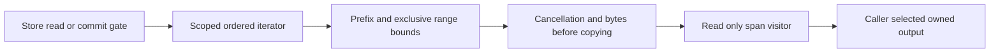

# StorageRecovery

REQ-STORAGE-011 / AC-STORAGE-011 (TASK-RUNTIME-WINDOWS-RECOVERY-W3) preserves
the existing killed-child filesystem readiness bound. After actual process exit,
exclusive readiness covers owner.lock, commands.wal and the actual ZoneTree
tree/0.meta.wal which failed to reopen in Windows CI37021991878. The prior receipt
does not identify the sharing holder; this is a test-fixture observation gap,
not proof of a storage/dependency defect. Keep the five-second bound and25ms poll,
all50 seeded trials, original trial deadlines, WAL/snapshot/atomic assertions and
permanent sharing failure. Cancellation stops before another probe; no retry of
the recovery operation, default timeout increase or filesystem bypass is allowed.

New real-file tests first hold the metadata WAL exclusively after an actual
ZoneTree store closes: the shared barrier must remain pending, complete only
after releasing that holder, reject cancellation and fail under the same bounded
permanent lock. Root owns the existing RecoveryTests shared entry wrapper;
one worker owns new cohesive StorageRecovery readiness helper/tests. Existing
ADR035/041 owner/lifetime contracts suffice; product APIs/formats/permissions,
frontend and dependency release are N/A. Root reviews every original caller and
cleanup, builds/formats and qualifies full GitHub recovery on all three OSes.
Windows still fails if the real holder does not clear or original15-second trial
bound is exceeded. Rollback reverts only the fixture helper/wrapper together.

The preserving byte readback assertions in FrameBudgetTests and
PreparedTransactionTests map additionally to AC-CQ-018. Pinned TUnit array equality
is reference equality; ordered content equivalence must retain every exact byte,
null failure, rejected-commit and reopen obligation. This test-source correction
does not change storage behavior or establish runtime qualification.

REQ-STORAGE-010 maps AC-CQ-015 and AC-SQ-002/003/004/006/007 plus AC-REP-004 to
the accepted preserving seven-file storage test-source stage. Existing real
frame/checkpoint/scoped read/partition-host/lock/reopen assertions remain complete;
deterministic bytes, awaited equivalent file APIs and cancellation completion,
standard marker-exception constructors and cohesive internal types satisfy the
enabled policy. The journal repair retains its real synchronous Flush(true)
barrier through an awaited complete truncate/flush/dispose operation. Explicit
IAtomicStore dispatch and view identity remain tested. Exact scope, acceptance,
method/assertion audit, rollback and required GitHub proof are in CQ015's root
quality-gates.acceptance.md and quality-gates.plan.md. ADR033/032 suffice for this
test-source-only refinement; production/data/API/ownership contracts stay exact.

Node-local journals, owned values, committed read cuts, checkpoint/recovery and
bounded provider work. [ADR-035](../ADR/ADR-035-memory-performance.md) defines the
new scoped-read contract; ADR-032 records existing layout migration debt.

| Requirement | Acceptance | Tests / owner |
|---|---|---|
| REQ-STORAGE-001: budget before returned page copies; spans never escape the gate | AC-MP-002 | Real ZoneTree scoped point/range byte and lifetime cases; TASK-MP-005/005A |
| REQ-STORAGE-002: exact prefix/exclusive-bound/order/overlay semantics without global overfetch | AC-MP-002 | Real transaction replacement/deletion/insert/out-of-range cases; TASK-MP-005A |
| REQ-STORAGE-003: cancellation/early stop release iterator and preserve canonical data | AC-MP-002/012 | Real store cancel/visitor failure, subsequent read/commit and recovery CI |
| REQ-STORAGE-004: the physical node owns canonical and replica stores, locks, ordered apply and shutdown | AC-REP-002/004; AC-ROUTE-002 | CrashHost/Recovery and Docker RF3 reopen, failover and migration scenarios under ADR-036 |
| REQ-STORAGE-008: cohesive private provider owners meet numeric gates without changing storage/caller contracts | AC-SQ-001..008 in storage-quality.acceptance.md | ADR-046 TASK-MP-010AF-R/T/C/L/B; source join and real lifetime test source exist; enabled provider development build clean, complete exact-SHA runtime qualification pending |
| REQ-STORAGE-009: validation and apply share one private mutation projection per staged generation | AC-PSW-001..004, AC-MP-006/012 | ADR-035 TASK-MP-016P-W/L; first-authored PreparedTransactionTests plus existing FrameBudget/recovery/RF3 proof; source and qualification pending |
| REQ-STORAGE-011: startup identity metadata is finite and failed read releases physical ownership | AC-BSM-001/003/005 | [ADR-048](../ADR/ADR-048-bounded-storage-metadata.md), Metadata* real-file constructor/restore/reopen checks under BackupRestore; complete source and GitHub execution pending |

Ownership: common public storage contracts stay in Abstractions/Storage;
provider helpers in Storage.ZoneTree/Features/StorageRecovery, tests mirror that
name in UnitTests/RecoveryTests. `src/KeyLoad.Server/Features/StorageRecovery/PartitionHost.cs`
owns process composition of both independent stores and their protocol/materializer
lifetimes under [ADR-036](../ADR/ADR-036-orleans-foundation.md). Grains receive
non-owning engine/coordinator references and never dispose or reopen those files.
ZoneTreeStore remains the public composition facade; replaced private partial
behavior lives under StorageRecovery and BackupRestore according to ADR-046.
No schema, UI or business-authorization change applies.

[ADR-046](../ADR/ADR-046-storage-private-owners.md) accepts replacement of private
facade partial behavior with one runtime plus real StorageRecovery initialization,
journal, view/transaction/range and checkpoint owners. BackupRestore owns the
separate local backup component. Exact signatures, file/task ownership, disposal
orders, test matrix and join are in the [acceptance](../../storage-quality.acceptance.md)
and [plan](../../storage-quality.plan.md). No public/format/placement change or
numeric exception is authorized; source-only decomposition is not qualification.

The [prepared-write contract](../../prepared-storage-write.acceptance.md) and
[ordered plan](../../prepared-storage-write.plan.md) govern removal of the duplicate
mutation projection. Only transaction-private prepared arrays are cached; accepted
Stage/Reset invalidate them, rejected admission preserves the prior valid set,
and Stage retains caller-array ownership copies. WAL/apply/fault order and bytes
remain exact. No frontend/UI surface applies to this private storage optimization.

Real ZoneTree tests precede provider repairs; TUnit/MTP, process recovery and RF3
qualification execute only in GitHub Actions. Counters describe logical examined
work; physical I/O/native allocation requires separate measurement. Gates and
fault semantics cannot be relaxed for throughput.

## Null tombstone versus empty value repair

REQ-STORAGE-006/009, AC-STORAGE-006, AC-PSW-002..004 and AC-ROC-002/004/005 retain
the canonical nullable mutation distinction. The read-only CLR migration's byte
array projection currently turns Delete into a live empty value; exact candidate
6949fa0 / GitHub run37005805424 contains failing WAL, absence, typed-read and
transaction-range regressions. TASK-RUNTIME-STORAGE-W owns only the explicit-null
projection in ZoneTreeTransaction.PrepareChanges and NEW
UnitTests/Features/StorageRecovery/TombstoneValueTests.cs. Lead owns docs and joins.

The new actual-store tests first prove staged/committed owned and borrowed reads,
empty Put versus Delete, exact WAL/base64/null bytes, frame limit, ordered range,
WAL reopen and snapshot record count/reopen. Preserve cache/copy/flush/apply order
and NullValueOverheadBytes=2 (four-byte null replaces two value quotes). ADR-035
and ADR-041 record the preserving repair. No format migration is required; earlier
empty rows cannot be safely reclassified without independent provenance. Rollback
reverts the projection but retains the regression source. Qualification requires
complete exact-SHA GitHub unit/process recovery/RF3 SDK/MCP evidence; source repair
alone proves no historical recovery, power-loss guarantee or performance gain.

## Повний storage, journal та recovery contract

Актори: node-local PartitionHost, canonical apply/read callers і recovery/backup operator. Actual source: [ZoneTreeStore](../../src/KeyLoad.Storage.ZoneTree/ZoneTreeStore.cs), [runtime](../../src/KeyLoad.Storage.ZoneTree/Features/StorageRecovery/ZoneTreeStoreRuntime.cs), [checkpoint manager](../../src/KeyLoad.Storage.ZoneTree/Features/StorageRecovery/ZoneTreeCheckpointManager.cs), [KeyCodec](../../src/KeyLoad.Abstractions/Storage/KeyCodec.cs), [storage contracts](../../src/KeyLoad.Abstractions/Storage/StorageContracts.cs). Один фізичний owner утримує lock, journal/read-apply gate та immutable returned values; migrating grains не відкривають tree.

| Вимога | Acceptance / flows | Test mapping |
|---|---|---|
| REQ-STORAGE-005: journal/checkpoint recovery зберігає один complete acknowledged process cut | AC-STORAGE-005: реальний process kill на prepare/publish/install boundaries відновлює цілий cut без partial transaction; torn tail має declared handling, corrupt complete frame fail closed; validated snapshot не змішується зі старим state | Existing `FiftySeededRealProcessCrashesPreserveAtomicTransactions`, `ProcessKillDuringCheckpointPublicationRecoversOneCompleteGeneration`, `CorruptCompleteFrameFailsClosedInsteadOfBeingDiscardedAsATornTail` у [RecoveryTests](../../tests/KeyLoad.RecoveryTests/RecoveryTests.cs), [InterruptedSnapshotTests](../../tests/KeyLoad.RecoveryTests/InterruptedSnapshotTests.cs) |
| REQ-STORAGE-006: canonical key/envelope/owned-value format має stable ordering і scope | AC-STORAGE-006: golden keys, escaped UTF-8 components, signed/decimal ordering та scope не колідують; invalid/corrupt format відхиляється, borrowed spans не escape gate | Existing `GoldenKeysRemainStable`, `TenThousandSeededDecimalKeysRoundTripAndSortNumerically`, `StringsUseUtf8OrdinalOrderingAndEscapedComponentsDoNotCollide` у [KeyCodecTests](../../tests/KeyLoad.UnitTests/KeyCodecTests.cs); scoped-read cases AC-MP-002 |
| REQ-STORAGE-007: format/schema upgrades мають explicit compatibility та recovery path | AC-STORAGE-007: PLANNED version fixtures доводять upgrade/reopen/rollback на matching data generations; unsupported version не читається як current, interrupted migration лишає recoverable authority | PLANNED real-store/CrashHost upgrade suite, KL-043 pending; [ADR-011](../ADR/ADR-011-format-upgrades.md) Proposed unresolved upgrade mechanism |

ProcessDurable та QuorumProcessDurable описують перевірений declared process failure model історичного коду; `LocalDurable`/`QuorumDurable`, power-loss і endurance не приймаються із process-kill source/test names. Full ACK barrier — [ADR-003](../ADR/ADR-003-durability-ack-barrier.md); committed read views — [ADR-004](../ADR/ADR-004-committed-read-views.md); versioned keyspace — [ADR-005](../ADR/ADR-005-canonical-keyspace-codec.md); backup/log retention — [ADR-008](../ADR/ADR-008-backup-log-retention.md), [BackupRestore](BackupRestore.md).

Current-code journal/compaction/checkpoints і in-progress scoped visitor ремонти не є proof нового delivered SHA. Все source/recovery evidence кваліфікується тільки в GitHub TUnit, actual child-process recovery і RF3 suites. Future maintenance автоматизація, широкі upgrades та power-loss gates залишаються explicit pending. Provider/container composition — один owner; нові helper/test scopes не міняють format без ADR contract.
