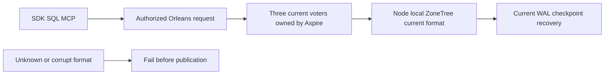

# StorageRecovery: first-release current format

Status: accepted current-product contract, 2026-10-06; implementation and
qualification pending. This is KL-043's active scope under
[ADR-116](../../ADR/ADR-116-first-release-current-format.md). The root owner
super rule governs separately requested migration or legacy work. Current
qualification requires real operations against the current source and format.

## Contract and ownership

Keep one current generated Orleans persistence contract over node-local ZoneTree.
Current identity epoch7, WAL4 and checkpoint5 identifiers remain exact; this
cleanup does not renumber bytes, aliases, field IDs, digests or signing purposes.
Ordinary open, replay, snapshot install and backup/restore reject unsupported or
corrupt formats before publishing usable state. Keep replication and atomic
journals, physical owner locks, ordered apply, scoped read cuts and RF3 barriers.
No old-format reader, automatic conversion or runtime fallback is supported.
New stores are born with the current required runtime-journal reader contract;
there is no unmarked-store promotion, automatic backup/marking or dual identity
magic reader. Preserve current contract value1 and serialized field IDs; missing,
zero or unknown required capabilities fail strict admission. Current outcome-v2
records and locators retain their identity and integrity checks; outcome-v1 keys,
locators and missing-field compatibility fallbacks are removed. Unknown scope
for a current rejected operation remains an actual current outcome, not legacy.

The current reader is capability1 with identity magic `0x364449444C4B`.
Create fresh stores with capability1 explicitly; a deserialized absent field must
remain an unsupported capability0, never inherit a permissive constructor default.
Keep native StoreIdentity Id8 and peer discovery Id7 unchanged. All production
open/write/backup/snapshot paths require the current identity. Remove the reader
publication method, automatic adoption backups and per-record legacy checks;
startup validates both already-current physical stores without modifying either.
Fresh/current reopen, snapshot/backup/restore and real runtime-journal operations
must prove capability and exact state; corrupted/missing/zero/unknown capability
or magic must reject before file mutation. The configured discovery evidence is
computed from both actual current stores, not supplied by a caller. Use only the
current profile and centralized configuration sections, without obsolete aliases
or conversion commands.

RF3 preparation builds and verifies only the current server image. Its receipt
binds the actual source, image digest and three Aspire-owned resources; it has no
historical-image prerequisite. The request probe captures bounded current phase
records only. Remove prior-server image producers and mixed-image discovery
capture, preserving real discovery admission, incompatible-capability fencing,
current physical-shard mismatch recovery, signed stale-purpose rejection,
authorization, cancellation and joined shutdown. The current-image control must
perform real SDK/MCP operations and verify state; rejected operations must leave
state unchanged. CI retains the current build and every current required suite.

Current-format restore remains a real product operation with validated artifacts,
new incarnation and paused dispatch. Current-format crash recovery remains
mandatory. SQL/client interoperability, Orleans activation migration and native
protocol rejection are distinct active requirements; this correction does not
remove them.

## Requirements, acceptance and tests

| Requirement | Measurable acceptance and verification |
|---|---|
| REQ-STORAGE-007: qualify the first-release format | AC-NATIVE-001: real current writes, close/reopen, WAL replay, compaction and checkpoint install preserve exact records, identity authority and applied cut. Retain `RecoveryTests`, `FrameBudgetTests`, `PreparedTransactionTests`, current snapshot and replica recovery cases. |
| REQ-STORAGE-021: strict format admission | AC-NATIVE-002: real native identity/WAL/checkpoint operations reject unknown versions, invalid checksums and complete corrupt frames with typed safe errors; original files and state remain unchanged. Retain or port the current-format rejection flows from existing storage cases without generating an old database. |
| REQ-STORAGE-024: incompatible peers are fenced | AC-NATIVE-003: valid current signed SDK/MCP operations succeed through actual Aspire RF3; incompatible signed purposes/capabilities cannot dispatch or alter committed state. Retain peer/request-purpose and real current RF3 caller controls. |
| REQ-NATIVE-004: no migration or legacy execution | AC-NATIVE-004: the actual AppHost recovery model starts its current runner without historical probe resources, old-source archives, old-server image preparation or prior-format environment/settings; profile loading accepts only its current contract and has no conversion command; native current outcomes use only outcome-v2 and current locators with no v1 fallback. Normal/scalar runners execute retained whole current flows. Static CI governance inventories verify removed paths, separately from functional proof. |
| REQ-NATIVE-005: current recovery resources settle | AC-NATIVE-005: real process kills and restart preserve one complete acknowledged cut; all owned processes/readers/resources settle and failures remain visible. Existing process-recovery, source-manifest settlement and RF3 shutdown cases remain mandatory. |
| REQ-NATIVE-006: cleanup does not remove active safety | AC-NATIVE-006: complete enabled build, formatter, analyzers and relevant normal/scalar/recovery/RF3 suites pass; native functional coverage retains current production contributors and excludes removed code and obsolete migration tests. No manufactured coverage or acceptance closure. |

## Ordered implementation and integration

1. Root records the owner correction, requirements and ADR, and reviews exact
   consumers before releasing disjoint source scopes.
2. Production worker removes only old-format converters/readers/coordinators
   under StorageRecovery in Storage.ZoneTree, Replication and Server. Keep a
   safety primitive with an actual current caller; remove it if exclusively legacy.
3. AppHost/test worker removes historical preparation and migration process/image
   cases plus their exclusive helpers in AppHost, scripts, RecoveryTests,
   IntegrationTests and CrashHost. Shared current RF3/profile helpers remain
   until every real current consumer is preserved.
4. Unit/CLI worker removes obsolete unit migration/probe cases and exclusive
   fixtures, preserving current corruption and authorization-order operations.
   Root owns shared entry points, current-only reader/outcome/profile and prior
   KeyLoad protocol seams, public contracts, workflows,
   source/coverage inventories, policy/docs and registry joins.
5. Root reviews all guarded diffs, runs the canonical full build/format/governance,
   then actual Aspire normal/scalar/recovery/RF3 operations and Linux delivery
   gates. Source-only cleanup closes no product task.

No live user directory, persisted data or unrelated chat work is deleted.
Rollback is a source checkpoint, never a format downgrade or an old binary over
current data. A future released-format upgrade needs separate owner direction.
Frontend and new public SDK/MCP schemas are N/A: no new product operation or
dependency is introduced. Existing callers continue using current-format data.

## Current ancillary execution and owner validation

TASK-SR-CURRENT-ANCILLARY-031 removes the five exclusive prior-image scripts and
CI preparation/environment references. Recovery's actual AppHost model contains
only its native recovery runner; it has no historical-image prerequisites. Port
that infrastructure model check without replacing real process-recovery evidence.
Current shared recovery cleanup and file-inventory helpers are renamed by their
actual responsibility. Remove only the uncalled old node-settlement branch;
retain actual child exit/readers/disposal, failure aggregation, owned-root cleanup,
file digests and handle-release proofs in their current callers.

TASK-SR-CURRENT-OWNER-032 makes the existing replica membership guard mandatory
with existing hard state for every ordinary and benchmark open. Fresh stores write
both records in one atomic commit. Missing/orphan/malformed/mismatched metadata
fails before publication without adding a guard to an existing store. The guard's
current key, native alias and fields stay unchanged; decode is bounded by the
larger of the configured native collection budget and configured voter count,
so legitimate current odd production groups remain supported. Ordered voter and
incarnation validation, snapshot ownership and RF3 remain mandatory. Whole real
store create/reopen, term/vote, missing-guard rejection/no mutation and healthy
follow-up replace the exclusive marker-free production case.

The same owner task removes NodeOptions' unused discovery-timeout alias. Its peer
factory accepts only the canonical validated PeerDiscoveryOptions.ConnectTimeout.
The central pre-physical-ownership Peer.Value resolution preserves endpoint/HMAC/
replay validation and effective connect duration strictly below the replica RPC
deadline. Preserve the actual RPC/election ordering and all signing authority.
Actual configuration/owner admission flows test valid configured policy and
invalid pre-file rejection; getters are not acceptance proof. Root freezes exact
ownership, reviews guarded private packets, joins consumers and runs enabled
build/format plus Aspire whole-operation, recovery and RF3 gates.

## Current WAL admission without obsolete format inventories

TASK-SR-CURRENT-WAL-036 implements REQ-STORAGE-021 / AC-NATIVE-002 in
Storage.ZoneTree's current journal preflight, recovery and backup validation.
Only the current WAL and checkpoint signatures are accepted. An unsupported
complete signature or identity version fails FormatUnsupported before provider
opening, truncation, restore publication or canonical effects. Invalid current
frame length/order/checksum remains Corruption; incomplete current tails retain
the existing verified-prefix recovery contract. Remove obsolete signature
constants and specialized old-format recognition branches, with no alternate
reader or converter. Current backups retain their exact cut, byte limits,
checksum/manifest proof and all unchanged-source/destination rejection oracles.

The private packet owns ZoneTreePersistenceFormat.cs, ZoneTreeJournalPreflight.cs,
ZoneTreeJournalRecovery.cs, ZoneTreeBackupJournalValidation.cs and the current
NativeBackupCutTests.cs unsupported-header flow. Root joins only after full
semantic review and all base/post guards, then runs enabled canonical build,
formatting and actual Aspire current storage/backup/recovery tests. Any additional
consumer is reported before ownership expands. Source inspection closes no AC.
