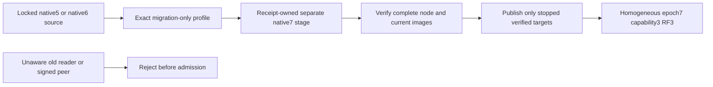

# StorageRecovery: epoch7 interpretation fence

Status: accepted implementation contract; KL-043/019 prerequisite for the new
Messaging and Search persisted contracts. [ADR-091](../../ADR/ADR-091-epoch7-interpretation-fence.md)
owns the format decision. Existing ADR-077 native5 evidence remains historical;
this contract extends its positive and negative controls to the new target.

TASK-EPOCH7-NATIVE-LOCK-RELEASE refines AC-EPOCH7-003/004. Recovery44 retains one
native5 DescriptorFlushed process-case failure: Publish rejects native flock
acquisition for the original node.owner.lock with errno35 after parent Prepare
and VerifyPrepared returned. The current FileShare.None readiness probes do not
prove that the native flock is free. Do not infer a production handle leak or
add a retry from this evidence.

Root freezes a discriminating real-owner oracle before the next stage: after
Prepare, after prior-source copy inspection, after VerifyPrepared and after
Publish in the existing NodeEpochProcessRecoveryTests retry flow, acquire and
dispose the actual existing ServerNodeUpgradeLocks for the original source.
This opens its exact node/canonical/replica locks using the production native IO
path, with no new lock implementation, forced release, retry or sharing change.
Retain all original crash boundaries, prior-reader checks and publication/data
oracles. A failure must identify its fixed boundary while preserving the original
native exception. A focused negative control holds an actual native owner lease,
requires the same probe to reject, releases it and requires a healthy probe;
ordinary BCL FileStream exclusivity cannot substitute for this control.

Luna cluster_wave owns a private patch for the existing retry-flow test and NEW
RecoveryTests StorageRecovery Helpers/Cases for this native probe/control only.
Root owns docs, production changes if exact holder evidence establishes a defect,
serialized Aspire recovery, integration and stage commit. Frontend/SDK/MCP and
format migration are N/A: this refines verification of unchanged offline native
ownership. Source inspection or successful BCL readiness alone closes no AC.

New transfer, recurring/saga and vector-lineage records change what a reader
must understand. An epoch6 reader must never reopen epoch7 and serve projected
vectors without their lineage or route unsupported mutations. The chosen design
uses strict serving admission plus an explicit stopped-copy conversion. Merely
adding optional native fields or changing the RPC capability is insufficient.
An automatic live migration or an in-place identity rewrite is out of scope.

## Closed formats and authority

- Serving identity is exactly epoch7, native checkpoint version5 with a distinct
  magic. Preserve the native identity envelope, WAL4 frame layout and generated
  raw-key/value payload contracts. WAL frame identity is exactly7. Ordinary open,
  recovery, snapshot install, backup/restore and replication never accept5/6 or
  checkpoint3/4. No runtime fallback or partial reader compatibility is added.
- Explicit offline conversion accepts only verified stopped epoch5/WAL4/native3
  or epoch6/WAL4/native4 sources and produces a separate epoch7/native5 target.
  Keep these as named, exact migration-only profiles; choose the profile from
  the checksummed source identity and require every frame/image to match it.
  Preserve native5 controls rather than relabeling native5 as native6. A writer
  for obsolete formats is not retained in the product. Tests use actual immutable
  prior executables for both source profiles.
- Copy exact ordered raw keys/values, NodeId, incarnation, signing bytes, applied
  and log positions, clock, pause/generation, committed configuration, hard state,
  membership and all referenced current images. New metadata uses target7 only.
  Unreferenced history remains byte-identical history with its explicit format;
  it cannot become a current image. Every current referenced image is converted.
- Original inputs are locked and strictly inventoried under the existing
  no-link/regular-file rules. Destination is absent or empty and distinct. Use
  the existing receipt-owned private stage and atomic publication discipline.
  A new receipt revision records actual source5/6 and target7, preventing reuse
  of prior5-to6 stages. Verify the source inventory again before publication;
  unknown/corrupt/torn/mixed source formats fail without publishing.
- Existing explicit server/provider commands remain the entry points. The
  whole-node coordinator records the actual selected source epoch and target7
  in its descriptor, nested receipts and progress. Preparation, verification and
  publication require matching full-node authority; never convert just the
  primary store and abandon replica/current snapshot state.
- AC-EPOCH7-003/004 keeps the original node, canonical and replica owner locks
  continuously exclusive. Authority verification uses bounded private copies of
  only the canonical identity/WAL pairs through the existing stopped-source API;
  it must never reacquire an original owner lock or weaken its sharing mode.
  The same private-directory lifecycle joins primary and cleanup failures and
  deletes its owned copies on success/failure. Existing node acceptance,
  rejection, published-retry and process-cut tests exercise this real path.
- All five serving request/reply/discovery signature purpose families move from
  data-epoch6 to data-epoch7. The bounded CQRS stream wire shape/aliases/IDs remain
  v2; application RequestInterfaceVersion becomes3 and its purpose is
  data-epoch7-rpc3. Valid old-purpose signatures fail before dispatch or consensus
  admission, including an otherwise sufficient reachable old majority.

## Acceptance and mapped tests

| Requirement | Acceptance and evidence |
|---|---|
| REQ-EPOCH7-001: strict interpretation | AC-EPOCH7-001: new serving open rejects real5/6 and unknown identities before mutation; genuine old5 and old6 binaries reject7/checkpoint5; all original files unchanged. `Epoch7PriorReaderTests` plus existing `EpochPriorAcceptanceTests` |
| REQ-EPOCH7-002: exact offline copy | AC-EPOCH7-002: independent native5 and native6 sources convert through the explicit provider command; identities, every raw record, positions and snapshot cuts equal their source oracle; current reopened7 serves preserved data. `Epoch7ConversionTests`, existing upgrade/recovery tests |
| REQ-EPOCH7-003: whole-node preservation | AC-EPOCH7-003: whole-node prepare/verify/publish preserves exact node/replica/configuration/current-image authority for both source profiles; unknown/mixed image and source epochs reject. `Epoch7NodeUpgradeTests` and existing node acceptance/rejection cases |
| REQ-EPOCH7-004: bounded crash-safe publication | AC-EPOCH7-004: real child process kills at each existing upgrade/node stage leave original intact and target absent or wholly7; retry touches only matching private stages and does not erase later current writes. `Epoch7ProcessRecoveryTests`, existing process cases |
| REQ-EPOCH7-005: mixed serving peers fenced | AC-EPOCH7-005: old signed request/discovery/vote/append/snapshot/reply purposes and capability2 reject; compatible3 passes with original native shapes and fixed RF3. Existing cohort/signature controls extended by root; actual Aspire RF3 required |
| REQ-EPOCH7-006: genuine prerequisite ownership | AC-EPOCH7-006: recovery AppHost owns preparation of verified immutable prior5 and prior6 probe resources; test runner waits for successful native completion, original receipts are retained, failure prevents test admission and cleans owned resources. `PriorProbePrerequisiteTests` and actual recovery suite |

Every changed area retains full build, native TUnit unit/scalar/recovery, format,
analyzer/coverage and actual Docker/Aspire RF3 qualification. Local tests are
development evidence. Current baseline recovery25 is219/260 with41 missing
immutable-native5 prerequisite failures; they must be fixed, not skipped.

Probe preparation pins native5 source7784b6b46b98ce994dd98070dc1f58fe4e506b91
and native6 source2801b03091efc5cf45b1268c6570457539f12f27, with their exact Git
trees and original archive hashes. AppHost owns both build resources and passes
`KeyLoadTests__PriorProbesDirectory` for that run's unique results-owned directory
to the recovery runner. It contains native5-probe and native6-probe directories,
each with its explicit native-epoch receipt. Reusing an artifact under another
source or overwriting another run's directory is forbidden. The two isolated
probe builds can run in parallel; both must complete successfully before tests.
`PriorProbePrerequisiteTests` in ComparisonTests/StorageRecovery verifies the
actual recovery AppHost model, both successful-completion dependencies, exact
native command arguments and different results-owned directories per host.
The recovery suite verifies the original source/tree/archive and assembly/driver
hashes before executing either old binary. CI invokes only that recovery
AppHost entry; its original TestResults upload retains both prepared probes and
their receipts. The obsolete separately invoked native5 wrapper is removed.

## Ordered execution and ownership

1. Root freezes this specification and ADR before delegated edits. Luna
   query_wave reads latest role-folder policies, owns Storage.ZoneTree
   StorageRecovery format/admission/explicit converter files, Replication
   StorageRecovery snapshot conversion and Server StorageRecovery coordinator
   joins, plus mapped UnitTests/RecoveryTests StorageRecovery cases and helpers.
   All new executable code uses its actual role folder. Preserve aliases/IDs,
   existing source5 negative controls, finite budgets and source locks.
2. Root owns shared serving protocol/capability purposes, immutable prior probe
   tooling, actual AppHost prerequisite resources, central documents/status,
   public feature joins and Git. No worker edits these shared files or runs gates.
   Workers escalate format/receipt ambiguity rather than invent a third profile.
3. Root reviews combined source, builds with analyzers, runs changed cases via
   actual AppHost while other product agents keep coding, then full gates.
   Record original source/run/attempt/job artifacts and checkpoint the coherent
   stage. No task closes from source or older epoch6 results alone.
4. Rollout keeps all three voters stopped: preserve verified original copies,
   prepare and verify all three complete targets before publishing any, then
   start only homogeneous7/capability3 voters with unchanged placement. If
   publication is interrupted, keep the cluster stopped and resume matching
   targets. Rollback uses a capable7 reader or the complete verified pre-upgrade
   cohort with fenced fresh routing/replication authority; never open7 using6,
   revive stale replicas or discard acknowledged post-upgrade writes.

No new dependency, public client migration endpoint or UI is needed. Storage
conversion is a local stopped-server administrative operation; public SDK/MCP
still exercises preserved data and the newly admitted feature contracts.

TASK-EPOCH7-RECOVERY44-PRIOR-READER refines AC-EPOCH7-002/004: each process retry
must pass its independently selected source epoch through the owned prior-copy
inspection helper to the matching immutable native5 or native6 executable.
Keep exact null error, source revision, data epoch, node identity, applied
position and original inventory assertions. No default native5 reader may be
used to inspect a native6 source. Luna query_wave owns only the process case and
prior inspection helper in a private patch, with root owning integration and
the actual Aspire recovery gate. The separate observed exclusive-lock EAGAIN
failure remains unresolved; this change must not add retries or weaken locks.

## TASK-EPOCH7-PRIOR-COMPOSITION-002: original-binary recovery prerequisite

REQ/AC-EPOCH7-006 retains actual native5/native6 processes and every source,
conversion, refusal, state and cleanup oracle. CI preparation currently rebuilds
historical Core and fails four CA1822 errors before dependent recovery cases.
The current helper overlays also call later APIs absent in both pinned epochs.
Repair only the fresh CrashHost composition; preserve every historical production
provider, serializer, identity validator, snapshot reader and original binary.

Use the authenticated original Actions artifact11320554042 from own-main
run37249197752, repository477801965, head
f8b3ba68da2f28660da1a36db396882ba2f72b7d. Verify original metadata, artifact
name/size and ZIP SHA256
cb5f3986adfe05b1430b963e9aefea7a6189b03f81ebad279090f2a657187d3f,
then every exact native5/native6 closure row and original embedded receipt.
The receipts retain githubQualified:false; authenticated binary inputs do not
qualify the historical driver source or this new composition. Missing/expired/
changed inputs fail before dependent test admission; no local-package fallback.

The immutable profiles remain native5 revision7784b6b46b98ce994dd98070dc1f58fe4e506b91,
treeb03bf1301a03b3fe00f419c3c7bf5285a34b63f9, archive SHA256
e0072dfab6e265ccc4ca4b5717aa5a978903330a36287c58c8e91a604b0bf2c5;
native6 revision2801b03091efc5cf45b1268c6570457539f12f27,
tree678ac682c90294306a0ae4092c4c80b382c4a18b, archive SHA256
86e62558c443d39d068568a0e3d2792ec10130db587d4f3835c56eabe4747d96.
Verify safe archive paths/modes and the complete old CrashHost source inventory.

Build separate external SDK compositions with no historical ProjectReference.
Reference only each exact original non-CrashHost DLL closure and the pinned
.NET10 reference pack. Preserve SDK10.0.401/latestPatch, net10.0/C#14, normal
SDK/style analysis and warnings-as-errors. Bind the current reviewed64-line
KeyLoad.Analyzers binary/source identity and pinned Orleans10.3.1 generator;
remove only the automatically injected historical analyzer ProjectReference.
No NoWarn, disabled analyzer, lower severity, old production edit or old
CrashHost fallback is permitted. Fresh assembly identity remains KeyLoad.CrashHost,
assembly/file0.1.0.0, informational0.1.0-dev and the exact friend/ApplicationPart
metadata. Actually generate native6's five NativeText serializer aliases;
native5 retains its empty native manifest. Do not copy old generated code.

Fresh epoch-specific probe/fixture inputs must use the original constructors:
ZoneTreeStore(ZoneTreeStoreOptions), DatabaseEngine(store, policy, limits, clock),
validated direct ReplicaConfiguration, original snapshot/materializer signatures,
ZoneTreeIdentityFile.Read(path), and ZoneTreeCheckpointReader.Read(FileStream,
original options). Verify stream length against original MaxSnapshotBytes and
retain the reader's own bounds; no widened snapshot allocation. The existing
native6 thirty-second child bound is captured at the external default boundary
and passed with TimeProvider to fresh helper operations. Keep the current helper
files used by the current CrashHost unchanged; prior-only source overlays are
explicit feature-local executable build inputs with distinct source hashes.

Produce fresh driver DLL/PDB/XML/deps/runtimeconfig/apphost; verify the original
runtime graph against copied immutable dependencies and actual new assembly
metadata. The new receipt binds source/archive/tree, original receipt/artifact,
all source/overlay/project/import/compiler/analyzer/generator inputs and every
output hash. Never relabel receipt driverSources mismatches as original source.
AppHost owns both existing preparation resources, deadlines, readers, cancellation,
exit, create-only destination and cleanup. Only both successful verified receipts
admit the recovery runner. A preparation failure runs zero dependent cases.

Root owns contract/source-map/admission joins and serial native gates. Luna may
prepare a guarded private build-prior-probe.sh and feature-local acquisition/
composition source/receipt packet under scripts/Features/StorageRecovery, with
only mapped real prerequisite/recovery test changes. No serving-image, workflow,
package pin, public API, historical production or Git edits. Verify real old
create/open/inspect/snapshot operations, original input preservation, conversion
and new-state outcomes through Aspire recovery, normal/scalar and exact-source
Linux gates; metadata/build success alone does not close AC-EPOCH7-006.
Rollback restores one coherent prerequisite seam, retaining original artifacts
and keeping failed prerequisites closed. ADR-077/091 remain Accepted until their
complete required runtime and RF3 gates qualify.

### R2 review corrections and receipt admission contract

The exact accepted field/path/type contract is
[PriorProbeReceipt](PriorProbeReceipt.md), frozen by root before producer and
consumer implementation. Its fixed profile and actual original assembly metadata
must be validated, not replaced by desired project text.

The rejected R1 packet did not qualify the prerequisite. Its project included
fresh source paths that were never populated, represented unchanged current
helper hashes as compiled driver sources, assumed the 10.0.0 reference pack,
captured unbounded tool output and suppressed cleanup failures. Preserve the
original authenticated inputs while repairing these concrete defects.

Use an explicit fresh receipt schema2. Historical schema1 receipts remain exact
immutable acquisition evidence and are never rewritten or admitted as the fresh
composition. The schema2 producer identifies an authenticated prior closure plus
a source-bound test driver. Separate the actual compiled driver/source inventory
from current repository driver inputs; every compiler input must have its actual
path, role, size and digest. The admission reader must validate the complete
schema, reject duplicate or unknown fields, verify confined regular files and
reject a missing, stale, ambiguous or tampered original receipt, runtime closure,
driver source, compiler input or required output before any dependent case runs.
The fresh receipt keeps githubQualified:false and binds the pinned artifact/run/
repository/head identity, original archive and exact original profile receipt.

Resolve compiler and framework references from the actual evaluated SDK build,
not an assumed pack directory. The installed development SDK10.0.401 currently
uses Microsoft.NETCore.App.Ref10.0.12; each Linux run must record its own exact
evaluated pack. Keep the pinned SDK/roll-forward contract, strict analyzer and
generator policies unchanged. Populate every explicitly compiled path, preserve
every historical source and exact original non-CrashHost runtime reference, and
verify actual output assembly/friend/ApplicationPart metadata and native serializer
manifest alongside DLL/PDB/XML/deps/runtimeconfig/apphost completeness.

Tool execution must drain bounded stdout/stderr and settle its owned process tree,
original exit and reader tasks under one captured deadline. Owned temporary roots
belong to the preparation resource's unique result directory. Cleanup failures
remain observable together with the primary failure and prevent success; publish
the create-only verified result and success protocol only after owned staging
cleanup settles. Do not suppress failures, leave children running or reset the
budget to make cleanup pass.

Ownership is scripts/Features/StorageRecovery/priorprobe for acquisition, source
composition, execution and schema2 production; scripts/Features/StorageRecovery/
templates/native5 and native6 own the fresh driver inputs. The recovery feature
owns Helpers/EpochPriorExecutableArtifact.cs, typed records in Contracts and
actual admission checks in Validation. Do not modify the current CrashHost helper
and fixture, unrelated test semantics, serving images, packages or workflows.
Root freezes the exact field/path schema before consumer implementation, reviews
the joined producer/reader contract and runs real prerequisite, rejection and
unchanged recovery operations through Aspire. Positive and tamper controls must
exercise the actual whole admission/preparation operation and verify zero
dependent cases on rejection; fabricated getters or source-word checks are not
acceptance evidence. Keep file400/type200/executable-unit64/nesting3 limits in
every language, without analyzer exceptions or suppression.
