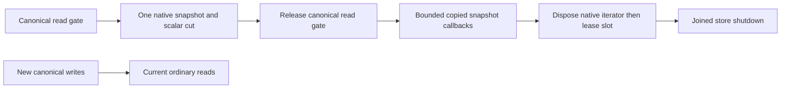

# NativeReadCuts within StorageRecovery

KL-039 L2-A delivers a provider-owned, runtime-only native snapshot lease under
[ADR-097](../../ADR/ADR-097-native-read-cut-leases.md). The existing synchronous
`IAtomicStore.Read` view and borrowed bytes still cannot escape their callback.
This stage supplies the capture/lifetime primitive; online index delta retention,
catalog publication and restart recovery remain subsequent required KL-039 work.

The current native index builder scans while the canonical read gate is held.
Copying an entire database would add unbounded retained memory. ZoneTree 1.9.8
supports a native snapshot iterator which excludes later writes and pins its
segments, but the current runtime shutdown does not track escaped iterators.
Choose one finite provider-owned lease with copied callback bytes and explicit
shutdown joining. Do not introduce another database or move storage ownership.

| Requirement | Acceptance and mapped real-provider TUnit tests |
|---|---|
| REQ-CUT-001: capture one exact canonical cut | AC-CUT-001: capture only from this runtime's live `Read` callback while its read gate is held; lease captures Position and scalar format/key-codec/node/incarnation/durability/pause/read-generation fields from that cut, excluding signing material. Later committed insert/update/delete leaves the old snapshot exact while a fresh ordinary read sees all changes. `NativeReadCutConsistencyTests`. |
| REQ-CUT-002: finite admission and work | AC-CUT-002: one native snapshot lease per runtime; a second capture fails ResourceExhausted without opening a native iterator. Positive finite record/byte/duration limits are validated before capture. Each native advance, examined key/value and delivered callback is charged before copying/delivery; cancellation and elapsed checks precede and follow native calls. Exact record/byte saturation, cancellation and a following healthy lease are covered by `NativeReadCutBudgetTests`. |
| REQ-CUT-003: owned bytes and runtime lifetime | AC-CUT-003: native CurrentKey/CurrentValue are immediately copied before user callbacks; logical values retain existing native header stripping. No view/native iterator/native memory/signing key is returned. Only one active traversal uses a lease; concurrent/reentrant traversal fails explicitly. Sequential prefix visits preserve the same snapshot and cumulative limits. Dispose closes admission and joins actual traversal/leases before tree shutdown, releases iterator before its slot, and preserves primary plus cleanup failures. Repeated disposal never releases a live iterator's slot or closes a settled handle again. Whole-tree snapshot installation rejects ResourceExhausted before mutation while a lease is active; ordinary compaction preserves the leased tree. Actual callback overlap, store shutdown, cancellation, replacement rejection and reopen are covered by `NativeReadCutLifetimeTests` and `NativeReadCutReplacementTests`. |
| REQ-CUT-004: exact provider limitations and unchanged authority | AC-CUT-004: capture uses pinned ZoneTree `IteratorType.Snapshot`, not a durable checkpoint or replica image. It is not restartable or a token authority. No WAL, canonical record, native format, public wire, cache authorization or replication acknowledgement changes. Complete Aspire unit/scalar/recovery/RF3 and exact-source Linux gates remain required. |

Capture is synchronous and native snapshot freeze/rotation and `Next` have no
cancellation API. Elapsed checks detect and reject overruns after those calls;
they do not interrupt a blocked native call or promise a hard wall-time bound.
Never detach a task or abandon it with a second timeout. Cancellation is
cooperative between actual native calls, and cleanup joins the original work.
This limitation is explicit and does not satisfy a future hard-deadline criterion.

If native iterator disposal fails, keep the actual iterator and the runtime's
active lease slot owned. Do not clear the sole handle, admit another lease or
permit tree replacement. A later disposal attempt joins any original traversal
and retries that same unsettled handle; concurrent disposers observe the current
attempt's actual completion. Preserve the original operation and cleanup failures.
Only successful native disposal clears handle ownership and releases the slot.
An elapsed-budget error reported after successful cleanup must not retain a
closed handle. Scalar cut construction precedes native iterator creation, so a
failed allocation cannot lose an iterator created just before attachment.

TASK-CUT-R2-FAILURE-JOIN refines AC-CUT-003 before joining the private L2-A
packet. Luna query_wave owns only read-cut Lifecycle cleanup/disposal and new
StorageRecovery test helpers/cases in its private overlay. A synchronous cleanup
wrapper rethrows a single outer aggregate around the original exception; capture
retains its direct inner exception object without Flatten, including an empty or
nested original aggregate. Native disposal counts that retained failure before
clearing the actual iterator or slot. A new real-exception retention regression
tests this helper only and must not claim an injected native provider failure.
Every concurrent traversal fixture releases its real barrier and explicitly
joins its original task even when an assertion fails; retain both observation
and cleanup failures. Reuse the existing test failure observer and update fixture
cleanup without broad swallowed catches. Root reviews the revised exact hashes
and runs all integrated gates; no fake iterator, diagnostic suppression or
original assertion/timing reduction is permitted.

Runtime shutdown joins these leases before cache closing or native tree disposal.
Failed lease cleanup closes only new lease admission and leaves the actual tree,
cache and owner handles available for joined shutdown retry. It must not continue
tree disposal after that error. Dispose invoked by a thread holding this runtime's
read/write gate rejects before changing admission or waiting, preserving health.

Required limits have exact ceilings: MaxElapsed is positive and at most one
minute, MaxRecords is positive and at most5,000,000, and MaxExaminedBytes is
positive and at most1 GiB. The elapsed clock starts immediately before capture
and never resets for another prefix visit; idle expiry rejects the next traversal
before native advancement. No timer may dispose an actively borrowed iterator.
Sequential prefix visits may seek within the same snapshot, with one active
traversal at a time. Record, examined-byte and native-advance counts remain
cumulative across every visit, including repeated rows; returned visit counters
describe those cumulative totals. The elapsed clock never resets. A caller's
per-visit oracle compares a count delta against its latest delivered rows.
One-slot admission bounds iterator count; it does not establish an RSS bound or
bound the size of all native disk segments pinned by a snapshot. Those separate
provider resource and future retention criteria remain open.

`InstallSnapshot` replaces the native tree. Under its existing write gate, after
normal health and stale-cut validation and before copying a staging file or
invoking fault/publication callbacks, it checks the lease lifecycle and rejects
ResourceExhausted while a lease is active. It must not wait under that gate or
enter the replacement poison-on-failure block for this admission rejection.
The write gate prevents a new capture during replacement. The rejection leaves
identity, read generation, journal, caches and current health unchanged; disposing
the lease permits the same verified snapshot to install. `Compact` uses
`replaceTree:false` and remains permitted. Real-provider tests prove the old cut
survives compaction and later writes, as well as rejected and successful snapshot
installation. No state monitor spans native operations, callbacks or joining.

Root freezes this contract, owns shared docs/configuration/integration and gates.
Luna query_wave owns a private patch against the current exact runtime files:
new Storage.ZoneTree `Features/StorageRecovery/{Models,Validation,Queries,Lifecycle}`
read-cut helpers, an internal `ZoneTreeStore.CaptureNativeReadCut(view, limits,
cancellationToken)` join, and `ZoneTreeStoreRuntime` lease shutdown joins; new
UnitTests `Features/StorageRecovery/{Cases,Helpers,Assertions}` only. Internal
`ZoneTreeCheckpointManager` is additionally owned for the minimal pre-mutation
`InstallSnapshot` admission join above; other checkpoint publication stays intact.
`ZoneTreeReadCutLimits` is pure data; its validation belongs in Validation.
`ZoneTreeNativeReadCut` is pure scalar data; `ZoneTreeReadCutLease` owns capture,
bounded forward prefix visitation and disposal. Keep the IAtomicStore/IKeyValueView
public contracts unchanged. Root reviews exact base/post hashes before joining.
The visitor delegate belongs to Queries, never Models. Split lease lifetime state
into Lifecycle helpers when required by the existing 200-code-line type ceiling.

Implement in order: finite admission and capture validation; exact native snapshot
and scalar cut capture under the existing gate; off-gate copied bounded visitation;
joined disposal for normal and guarded runtimes; real provider tests and source
self-review. Run no gates in the worker's private overlay. Root builds the solution,
runs canonical format/governance, then serialized Aspire unit/scalar/recovery/RF3.
Baseline Unit44b has 3197/3204 passing, four native ANN deadline failures and three
independently owned benchmark process failures; Recovery44 has 284/295 passing,
ten repaired receipt/prior-reader oracles awaiting rerun and one unresolved native
owner-lock EAGAIN. Do not weaken or take over those gates to qualify this stage.

The next L2 stage must capture applied/source/policy/schema and outbox head in the
same callback, establish a bounded retention pin before writes/purge proceed,
replay contiguous deltas, validate a new cut, atomically publish the catalog and
recover or retire interrupted generations. A native snapshot alone proves none
of those joins and cannot close KL-039. Frontend/SDK/MCP additions are N/A here:
no new caller operation. Rollback stops and drains runtime-only leases before
removing the helper; persisted user data and format remain unchanged.

TASK-CUT-L2B-DISCOVERY is a read-only dependency of the next accepted contract.
Luna query_wave traces actual persisted projection-consumer pins, canonical
outbox before/after images, source/policy/schema reads, native generation manifests
and production search calls. Its private source-bound packet must identify the
minimum real path from L2-A to an off-gate build, contiguous delta replay, validated
catalog publication and crash reconciliation with finite pins/work/storage. Root
freezes exact REQ/AC, file ownership, authorization, format and rollback before
write-capable work. Existing synchronous ITextProjection callers, administration
and canonical records cannot silently change under this discovery; copying the
entire corpus or claiming a snapshot alone completes online indexing is rejected.

