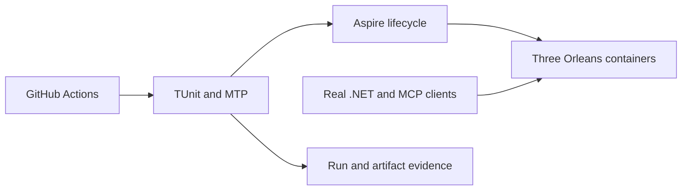
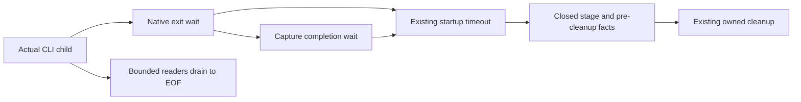

# TestInfrastructure

### Native process settlement and complete CI suite budget

REQ/AC-TEST-015 requires the local-image lifetime helpers to await already
completed original exit/stdout/stderr tasks on every observation-loop entry.
A completed reader fault immediately starts owned failure cleanup. Cleanup sends
SIGTERM, allows the existing one-second grace and kills only the original owned
tree if actual exit remains pending. Five seconds is a failed-cleanup escalation
threshold, never successful settlement: record the timeout, retry the owned kill
when necessary, await actual exit, then close only still-pending owned pipe
handles and await both original readers. Preserve the primary failure before
cleanup failures. Never release process/context/application owners while original
tasks are unsettled or use a detached continuation as settlement. Native tests
cover an already faulted reader while the child remains alive and cancellation
after actual readiness; explicit temporary-directory helpers delete only after
process settlement and preserve deletion failures.

Root joins local image cleanup in TestSuiteApplication only after actual AppHost
stop and producer/runner settlement, under a separate45-second cleanup token,
before output settlement and application disposal. Preparation output is included
only for explicit local mode. Default GitHub image selection and full RF3 gates
remain mandatory.

REQ/AC-TEST-010 also requires enough bounded GitHub job time for all three
sequential unit, scalar and recovery suites plus build/format/preflight. Exact
run37349838022 exhausted the previous30-minute job limit after both unit suites
failed and cancelled recovery. The Linux verify job receives120 minutes; no
individual native suite deadline, required check, artifact or failure predicate
is removed. A failed, timed out or cancelled suite remains failed/unqualified.

TASK-TEST-RF3-AGGREGATE-BUDGET refines REQ/AC-TEST-010 for the separate RF3
job. Run37560457057 at6816ae91 passed full native normal/scalar2767 each and
recovery235 in its verify job. Its RF3 job started02:07:28Z, the native RF3 step
started02:15:19Z and was canceled03:07:42Z near the configured60-minute job
ceiling; no original RF3 TRX was produced. The same job must also execute the
required instrumented unit/scalar/recovery/RF3 cohort and source/artifact checks.
Allow180 minutes for that aggregate job, preserving every individual deadline,
failure/cancellation predicate, required suite and artifact. This budget change
does not make an unfinished or failed run qualified or alter workload bounds.

TASK-TEST-LOCAL-CURRENT-WAVE extends REQ/AC-TEST-015 to current-image fault
waves. R183 rejected the owned local receipt before creating an AppHost because
RequestCqrsRf3ImageProof admitted only GitHub receipts. Reuse the existing
local-development selector, canonical receipt/reference checks, exclusive
GitHub/local environments and native bounded image verifier. One common local
identity read validates actual immutable COPY inputs and daemon identity before
wave composition; the existing pre-start local verifier checks all three model
annotations. Every expected node reference must equal that exact owned image.
ReadAsync selects only the validated reference; VerifyModelAsync returns the
identity from its actual pre-start verifier to a local variable in WaveStartup.
That exact returned identity supplies the post-readiness container checks. Each
pre-start read revalidates the canonical receipt/reference against the expected
map; no ambient cache, changed caller map or synthetic identity carrier applies.
After native start/readiness establishes resource creation, verify each actual
container config ID/reference under the unchanged wave deadline. Keep partial
start, stopped-voter fault, original failure and joined cleanup semantics.
The default GitHub manifest/digest path remains fail closed. Missing, mixed,
stale or forged local inputs reject; local evidence is development-only.
Root owns contract/integration/gates; Luna privately owns LocalRf3ImageIdentity,
RequestCqrsRf3ImageProof and RequestCqrsRf3WaveStartup, with a feature-local
local-image validation helper only if mandatory type limits require it.
That helper is ClusterReplication/Helpers/LocalRf3ImageSelection.cs: it owns
the existing closed selector/environment/reference/receipt validation only.
LocalRf3ImageIdentity retains native verification and model/container proof.
The existing due leader/rejoin/cold-restart and catalog mismatch whole flows
provide real Aspire SDK/MCP regressions; no fixture/model assertion qualifies
their database effects or substitutes for delivered-source Linux execution.

AC-TEST-010 requires original per-suite MTP/TRX evidence from every required
CI suite. Its Aspire caller explicitly enables `KeyLoadTests:ReportTrx=true`;
an omitted report setting, absent report, cancelled suite or failed native
runner cannot establish qualification. Run37303831451's missing full-suite
TRX receipts are retained as an evidence gap, alongside its original artifacts.

## Unified Aspire test entry

TASK-C1-LOGGER-PROVENANCE-NEGATIVE refines the existing DIAG-003/005/006
model-selection regression after the original Stage IV Linux normal/scalar
reports each passed2770/2771 and failed the same exact negative case. The local
RF3 image reader rejects GitHub provenance before C1 logger selection. Freeze
the negative matrix's exact expected rejection per row before changing source:
the deliberately enabled local-image row explicitly supplies GitHub provenance
to its unstarted builder configuration and expects the existing local-image
configuration error on every host; other incompatible rows retain the exact C1
selection error. Keep resource counts unchanged and the owned root absent,
with original failure/cleanup joins. Never clear inherited runner provenance,
mutate process environment, change a production validator, produce an image,
start Docker or broaden the expected-error set. The independent real positive
builder/build/disposal flow remains mandatory.

Existing ADR-082/117 own this options/model-control boundary; product/data/API
changes and new frontend are N/A. A Luna worker owns only the existing
UnitTests TestInfrastructure selection case and rejection helper in a private
guarded packet; root reviews, joins, runs native normal/scalar, commits/pushes
and retains fresh exact-source Linux evidence. This is model-admission evidence,
not database RF3 or a functional coverage contribution. Qualification pending.

TASK-C1-LOGGER-MODEL-CONTROL maps the native logger-control fixture to the
DIAG-003/005/006 contract in
[NativeCqrsRequestV2](ClusterRouting/NativeCqrsRequestV2.md) and ADR-082. Only its
explicit true-only selector composes the authoritative RF3 resource model and
returns after Build before RunAsync. Native logger operations and original task
joins remain real; startup/readiness/Docker/database RF3 are N/A for this control.
The ordinary ClusterFixture and Wave paths remain mandatory RF3 evidence. The
native testing wrapper owns final application disposal after reader settlement;
inherited image/provenance settings are permitted, selected workload modes reject.

`NativeLoggerModelControlSelectionTests` is a UnitTests model-isolation regression for this exact selector. It
exercises the real distributed-application builder, options admission,
`AddKeyLoad` composition, built RF3 model, owned directories, resource
annotations and joined application disposal. Incompatible selections must reject
before resources or the owned DataRoot exist. This case maps to
DIAG-003/005/006 composition isolation only; it does not start resources, observe
logger streams, execute database operations, contribute product functional
coverage, or qualify Docker/RF3. The unchanged native logger whole flows and
separate RF3 gates remain mandatory.

The rejection matrix also covers `Ephemeral=false` and a blank DataRoot. For
all rejected selections, observe the unchanged resource count and absent root
before cleanup. Preserve the primary admission/assertion failure, delete only the
unique root in `finally` if an unexpected failure created it, retain deletion
failures after the primary, then verify the root is absent. This test-only
refinement changes neither selector behavior nor product cleanup.

[ADR-074](../ADR/ADR-074-aspire-owned-test-entry.md) specifies the owner-required
single test entry and partial-start cleanup. Source and qualification are pending.

| Requirement | Acceptance | Tests / evidence |
|---|---|---|
| REQ-TEST-009: Aspire owns suite execution | AC-TEST-009: each closed suite creates one native executable with correct TUnit project/arguments/results and optional original TRX/Cobertura settings; scalar disablement applies to its runner; unknown/explicit-empty suites, invalid bounded paths, incomplete coverage settings and mixed benchmark modes reject before resources; only comparison may pass its existing native target to the child without composing outer database resources | AspireTestEntryModelTests using the actual Aspire builder; original entry-run reports |
| REQ-TEST-010: test entry preserves outcomes and bounded lifetime | AC-TEST-010: native nonzero/failed-start/missing-exit/cancel/timeout cannot count as success; stop/disposal always run; every existing CI suite and artifact remains | root source lifetime review and actual Linux CI native runner exit/status evidence |
| REQ-TEST-011: RF3 is owned once and startup failure releases resources | AC-TEST-011: outer test model contains no idle duplicate nodes; tested child AppHost owns three Docker nodes and discovered SDK/MCP endpoints; every partial start is disposed before deleting only its owned directory | real Aspire model tests, ClusterFixture source lifetime review, actual Docker RF3/recovery artifacts |

Canonical source: AppHost Features/TestInfrastructure; actual model regressions:
ComparisonTests Features/BenchmarkComparisons/UnitContracts; functional infrastructure tests remain in UnitTests Features/TestInfrastructure. Shared IntegrationTests fixture and
CI composition are root-owned joins. No public database or persisted format change.
Local entry runs are development evidence; delivered-source Linux gates remain.

## Explicit local RF3 image preparation

REQ-TEST-015 / AC-TEST-015 extends [ADR-074](../ADR/ADR-074-aspire-owned-test-entry.md)
with an explicit `KeyLoadTests:LocalRf3Image:Enabled=true` development mode,
accepted only with `Suite=rf3` and an explicit nonblank bounded development filter.
Following the owner's native-entry correction in ADR-117, image preparation is
bounded prerequisite work for the native TUnit fixtures; it cannot launch an
outer AppHost test runner or execute database workloads.
The tested child AppHost owns exactly three Docker nodes, readiness, discovered
SDK/MCP endpoints, scoped faults and complete shutdown; no idle outer cluster is
created. Unknown, non-RF3, protocol-cohort or mixed GitHub/local modes reject before
resources. Missing image configuration continues to fail closed in the default mode.

The producer builds the repository server Dockerfile using its actual effective
COPY inputs, names, modes and bytes, `.dockerignore` and pinned base digests. It
first creates an invocation-owned immutable build-context snapshot of exactly
those inputs and builds Docker from that snapshot. It validates the two context
COPY declarations separately from the exact internal `COPY --from=build` stage
copy; an unsupported Dockerfile or ignore declaration rejects before building.
Admission charges at most 20,000 input files and 512 MiB of aggregate bytes before
reading or retaining their contents; hashing and copying stream one admitted file
at a time. The captured snapshot digest binds the actual Docker build input,
including modes; before/after hashes of a mutable checkout alone are insufficient.
The producer records a bounded canonical input fingerprint, unique invocation tag, actual local
Docker image config ID and a custom input label in a separate `local-development`
receipt. A dirty working tree is identified by these inputs, never a fabricated
GitHub revision. The config ID is not a registry manifest digest. Before startup,
the child verifies receipt schema/bounds, current input fingerprint, actual image
ID/label and all three modeled tags. After startup it verifies each owned container's
actual image config ID. StartAsync schedules resources asynchronously; await the
existing native three-resource healthy readiness within the unchanged two-minute
fixture startup token before inspecting their actual config IDs. Both local-image
and native coverage started-image verification follow that readiness, and all
public SDK/MCP operations remain after verification. Do not treat host StartAsync
return as proof that Docker has created containers or add a separate retry/deadline.
Missing, oversized or malformed receipts, changed inputs,
wrong tags/labels/IDs and conflicting proof selectors fail before database effects.

Build failure prevents runner execution. Every failure/cancellation joins the
owned producer, runner and child resources. Image cleanup occurs only after owned
nodes stop, targets only this invocation's unique tag and rechecks image ID/label
before removal; no force deletion, pruning or unrelated-resource cleanup.
Cleanup validates the immutable owned receipt, tag, label, image ID and absence
of every running or stopped container using that image; a subsequent checkout
edit does not prevent cleanup of its proven owned tag. Current checkout input
validation remains mandatory before database startup. Cancellation, output-limit
failure and timeout signal only the owned native process, escalate within a
bounded grace period and join its actual exit and both original stream readers.
The context snapshot is removed after producer settlement; receipts and a bounded
original Docker build-output tail remain available for diagnosing failure.
Retain the original development receipt and native test reports. Local results cannot
qualify delivered-source Linux CI, registry image provenance or website metrics;
the existing GitHub image producer and verifiers remain mandatory and unchanged.

TASK-TEST-LOCAL-CLEANUP-COMMAND refines the same REQ/AC-TEST-015 owner contract.
`local-image-process.mjs` already selects the Docker executable; the owned-image
container query in `local-server-image.mjs` must pass only `ps` and its bounded
arguments, never a second executable token. Root repairs that command after the
actual R149 image's canonical cleanup failed. Verify the full native owned-image
prepare, identity verification, cleanup and repeated-absence cleanup operation.
Keep receipt/label/config-ID checks, zero running or stopped referencing
containers, non-force removal and all original process/reader joins. This local
tooling operation does not qualify database RF3, Linux delivery or coverage.

TASK-TEST-LOCAL-CONTEXT-REALIZATION implements this existing REQ/AC-TEST-015
snapshot and cleanup contract. Root freezes and owns the joins; unpack_atomicity
Luna owns only `scripts/Features/TestInfrastructure/local-image-context.mjs`,
the new cohesive `local-image-snapshot.mjs`, `local-server-image.mjs` and
`tests/KeyLoad.UnitTests/Features/TestInfrastructure/Cases/LocalRf3ImageContextSnapshotTests.cs`.
The reviewed R2 correction is assigned to ci_failure_evidence Luna and adds only
`scripts/Features/TestInfrastructure/local-image-process.mjs` and the cohesive
`UnitTests/Features/TestInfrastructure/Processes/LocalImageSnapshotProcess.cs`.
Admit each metadata entry and its bytes before retaining it; use bounded directory
enumeration rather than an unbounded readdir array. Track exclusive staging
ancestors for standalone COPY files separately from the unchanged canonical
digest entries. The Node regression includes that real COPY path and an actual
over-limit rejection followed by unchanged input and healthy capture.
Build-output retention uses the existing65,536-byte per-stream cap and a separate
invocation-owned `<receiptPath>.build-output.json` file with only original stdout
and stderr tail bytes encoded as base64. Write it exclusively after the original
producer and both readers settle, on success or failure, before snapshot cleanup;
retain its write failure alongside the original failure. No receipt field changes.
Only Docker build uses tail retention; introspection keeps its strict output-limit
rejection. A reader fault or signal immediately terminates only the owned child,
arms the existing kill grace and joins all original work while preserving failures.
The C# Node fixture has a60-second operation deadline,8-KiB drained output bounds,
owned-child termination and original reader/exit joining. Preserve the operation
failure with every cleanup failure; attempt both snapshots and parent cleanup.
The C# caller creates the private unique filesystem root, supplies it to Node,
and removes only that owned root after original process/readers join, including
timeout and reader-failure paths where Node cannot reach its own finally.
First admit the exact existing input metadata and limits, then stream admitted
regular files into an exclusive invocation context with no-follow/stat checks,
preserving paths and file/directory modes. Hash the bytes actually copied; retain
no unbounded array of input buffers. Build Docker only from this context, join
the original producer and readers, and remove only the owned snapshot after
settlement. Image cleanup uses original receipt/daemon identity rather than
mutable checkout bytes; startup verification still rejects changed current inputs.
The real TUnit/Node filesystem flow rejects a symlink without publishing a partial
snapshot, creates the bounded context, changes the original input, verifies the
frozen copy/digest/modes, cleans it and successfully repeats the operation. No
fake Docker, source-text tests or bound change. Root then prepares an actual
image and verifies real Aspire RF3 clients/cleanup; filesystem proof alone cannot
qualify Docker or Linux delivery. Dependencies, receipt schema, default GitHub
path and database contracts remain unchanged. Rollback removes this helper/join
as one unit and cannot admit a mutable-context build as compliant.

TASK-TEST-LOCAL-RF3-CONTRACT (root) precedes TASK-TEST-LOCAL-RF3-IMAGE
(dependency_closeout). The worker owns AppHost Features/TestInfrastructure local
settings, prerequisite and cleanup; ClusterReplication/Resources local image
selection; scripts/Features/TestInfrastructure bounded producer; separate
IntegrationTests ClusterReplication local verification and native AppHost model
regressions. Request admission belongs to Validation and invocation construction
to Execution; obsolete executable copies under Models are removed. Native
SIGTERM/kill helpers use generated LibraryImport with AllowUnsafeBlocks enabled
only in KeyLoad.AppHost.csproj and KeyLoad.IntegrationTests.csproj. This does not
enable unsafe code solution-wide or suppress analyzer diagnostics. Root owns
shared ClusterFixture/TestSuiteResources/TestSuiteApplication composition joins,
review, build, Aspire runtime evidence and delivery. Tests use the actual Aspire
builder to prove dependency ordering and absence of outer nodes; parser/input
tests cover negative cells without pretending to prove Docker creation. Real
Docker/Aspire RF3 SDK and official MCP evidence must prove image identity, three
nodes and cleanup. Frontend, production data/API changes and local comparison
mode are N/A for this infrastructure stage. Current-image proof remains
mandatory; local image preparation never skips or substitutes current-format
recovery, SDK/MCP or RF3 cases. Original acceptance remains open until its
complete required qualification exists.

### TASK-TI-RF3-IMAGE-MODE-011: preserve the default CI image path

REQ/AC-TEST-011/015 retains the two existing image-proof modes. Exact Linux
CI37462761672 on e6295 recorded121 pre-start failures because the local-only
IntegrationTests helper treated the shared server image reference as an explicit
local selector. A server reference also belongs to the default authenticated
GitHub mode and cannot select local provenance by itself.

LocalRf3ImageIdentity enters its local verification only when a local provenance
or local receipt selector is present. With both absent it leaves the default
path to the existing strict RuntimeContainerImage parsing, exact-source GitHub
receipt and modeled image checks. Preserve every local provenance/receipt/tag/
input/config-ID/membership check and reject incomplete or conflicting local
selectors. Do not add fallback proof, synthesize a receipt, accept mutable images
or change the actual Docker/Aspire RF3 topology.

Root owns this single helper predicate and its integration with the existing
ClusterFixture. Existing genuine default-CI and explicit-local RF3 operation
flows provide the positive/negative evidence; source review alone does not qualify
either mode. Renew canonical build/format and exact-source Linux SDK/official MCP
RF3 with original reports. ADR-074's existing ownership and proof contracts remain
unchanged; rollback restores only this test-harness predicate, retaining failures.

## Prompt termination on owned Aspire failure

[ADR-086](../ADR/ADR-086-aspire-terminal-failure.md) defines the private lifecycle
repair prompted by CI [37202347856](https://github.com/managedcode/KeyLoad/actions/runs/37202347856).
Its original reports show RF3 87/88 passed (one authorization assertion)
and unit 2947/2953 passed (six native CQRS cases); they do not establish an AppHost
crash. Website tests were 201/202 passed, with a real Chrome node-selection
assertion failure. Dashboard-disabled CLI warnings appeared before successful
suites too. These facts come from the original RF3, unit and site TUnit artifacts
at source `15ea5030c6fc010b29127b4b8de07bd255afc7ff`, not inferred CLI text.

| Requirement | Acceptance and evidence |
|---|---|
| REQ-TEST-012: owned terminal Aspire failures stop waiting promptly | AC-TEST-012: a runner's FailedToStart, RuntimeUnhealthy, Finished/Exited without an original exit code, or a required long-lived dependency's terminal state fails its workload without consuming the suite deadline; genuine native notification tests settle within five seconds of publication |
| REQ-TEST-013: completion and planned fault contracts remain intact | AC-TEST-013: expected WaitForCompletion exit is allowed; nonzero/missing completion exit fails; healthy/running and transient health snapshots continue waiting; no dependencies remains valid; guards are canceled and joined before intentional comparison node kill/restart assertions |
| REQ-TEST-014: original outcome, ownership and cleanup remain intact | AC-TEST-014: native runner exit codes, startup exceptions and cancellation remain failures where applicable; AppHost stopping cancels waits; every notification task is canceled/joined, existing diagnostics and stop/disposal remain; unrelated database cells are unaffected |

TASK-TEST-FAILFAST-CONTRACT (root, complete): requirements/ADR and owning source
review. TASK-TEST-FAILFAST-NATIVE (progress_runner, locally verified): only new
AppHost Features/TestInfrastructure lifecycle helpers and ComparisonTests
Features/TestInfrastructure native notification regressions. TASK-TEST-FAILFAST-JOIN
(root, after helper): TestSuiteApplication and IsolatedNativeCase integration,
CI focused selection, docs, review and exact-source validation. vector_runtime
owns read-only lifecycle review. These tasks preserve concurrent engine changes;
RF3 CQRS/authorization failures belong to their existing owner. Public database,
stored data, dependencies and topology are N/A: this is private test orchestration.
Native service tests establish notification handling, not real Docker failure
qualification; delivered Linux tests and failure artifact review remain required.

Local development evidence, 2026-10-04: the complete Release solution build has
zero warnings/errors; the full required formatter and repository governance pass.
The canonical Aspire comparison entry with `/*/*/AspireFailure*/*` reports
36/36 TUnit cases passed in 3.017 seconds, with no skipped, cancelled, timed-out
or flaky cases. The retained report is
`TestResults/aspire-failure-local3/KeyLoad.ComparisonTests-macos-net10.0.tunit-report.json`.
The existing `AspireTestEntry*` model/artifact regressions also pass 5/5 through
the same entry; their original report remains in `TestResults/aspire-failure-entry/`.
This includes genuine DCP missing-executable startup failure and native
BeforeStart failure/cancellation, preserving the original outcome and joining
tasks before cleanup. The no-lifetime case uses Aspire's real custom-resource
extension seam, `Resource, IResourceWithoutLifetime`, and native notifications;
neither native parameters nor certificate collections implement that marker in
the pinned 13.6 runtime. No database/service substitute is used. These checks
ran on macOS against the current working tree, which also contains concurrent
engine changes; they do not qualify an exact delivered Linux SHA or its complete
unit, recovery, RF3 and benchmark suites.

Status: implementation in progress. Owner: KeyLoad lead. Decision: [ADR-036](../ADR/ADR-036-orleans-foundation.md).

REQ-TEST-008 / AC-TEST-008 (TASK-RUNTIME-EVENTSOURCE-W3) coordinates the actual
global Microsoft logging EventSource across the two diagnostic suites. Listener
disposal issues a Disable command; LoggingEventSource disables its global filter
state even when another capture remains active. Exact fa80c701 Windows CI misses
ToolsCall midway through KnownMethodCategoryIsClosed. Use a single named native
TUnit NotInParallel key on McpTransportDiagnosticsTests and
GrainFailureDiagnosticsTests, declared once in a TestInfrastructure constant.
Preserve all native provider/capture/filter and privacy/error/category assertions;
no fake logging, sleeps, retries or production diagnostic change. Existing failing
category/privacy cases and all grain diagnostics are the regression matrix, with
full multi-OS GitHub execution required. Root owns this small cross-slice test
scheduling join because the shared global resource has one integration owner.
ADR039/036 existing contracts suffice; no product/API/data migration applies.

| Requirement | Acceptance and observable evidence |
|---|---|
| REQ-TEST-001: TUnit and Microsoft.Testing.Platform are the sole .NET test framework/runner. | AC-TEST-001: all test projects compile and run with TUnit; no xUnit/VSTest package or attribute remains; migrated assertions preserve every original scenario. |
| REQ-TEST-002: real RF3 tests launch Docker containers under Aspire and invoke the real .NET SDK and official MCP SDK clients. | AC-TEST-002: CI captures three independent containers, stable persisted directories, SDK/MCP success/denial flows and replica failover/rejoin. |
| REQ-TEST-003: generated lock files, local data, secrets, logs and test artifacts do not enter Git or the Docker context. | AC-TEST-003: tracked-file inventory and ignore checks reject these outputs; central NuGet versions remain pinned. |

Slice map: tests mirror their product slice; shared fixture/lifecycle infrastructure remains at test project roots. Shared CI/.gitignore/.dockerignore are integration-owned infrastructure. Production data/API/GUI: N/A, this framework migration adds no domain behavior. The Orleans/Docker boundary changes are ClusterReplication and ClusterRouting. Blobs and MCP coverage must not be reported complete from framework migration alone.

Traceability: AC-TEST-001 maps to all invoking test projects, AC-TEST-002 to IntegrationTests and ComparisonTests, AC-TEST-003 to source/ignore checks. TASK-TEST-MIGRATE and TASK-REP-VERIFY are in the execution plan. Tests run only in GitHub Actions; development builds are compilation evidence. Coverage and complexity policy cannot be claimed satisfied without measured configured gates.

TASK-RUNTIME-ARTIFACTS-W retains actual root TestResults reports from native TUnit
alongside each existing scoped report glob under REQ/AC-TEST-001/002/005 and
AC-MP-012. Run37005805424 proves the missing RF3/analyzer report retention path.
Comparison test reports use a separate comparison-test-results artifact so the
measured comparison-suite archive keeps its existing contract. The lead owns
ci.yml; no test, timeout, gate, permission, measured-report schema or ignore rule
changes. Source review and downloaded complete reports at the new exact run/job
SHA are required evidence. The artifact-path repair itself has a manual exact-CI
verification exception; it cannot convert failing or unexecuted tests to success.

TASK-RUNTIME-COMPARISON-DIAGNOSTICS-W is a failure-only refinement of
REQ/AC-TEST-002/005 and AC-MP-012 after run37005805424. Before StartAsync,
passively retain at most 128 lifecycle records for the comparison runner and its
eight direct wait resources. Only fixed resource names, native timestamps,
local observation sequence, closed state/health categories and exit code are
retained. Snapshot version/readiness are internal in the pinned native package
and remain unavailable; do not infer or reflect them. No properties,
environments, endpoints, connection strings, health
descriptions, exception text or payloads. On the existing cancellation/timeout
path, emit at most 80 lines/8KiB to test-runner stderr, preserving the original
failure even if observation or output fails. Keep this diagnostic out of measured
comparison archives and retain the eight-minute timeout and existing terminal
predicate. The worker owns only a new ComparisonResourceDiagnostics helper;
the lead owns the RealComparisonSuite join and shared documentation. The closed
receipt formatter may be a second helper to preserve type limits; lead extracts
existing evidence-directory/report-copy logic to ComparisonTestEvidenceFiles.cs
without changing path resolution or report bytes. Source privacy,
memory/task-lifetime review plus actual exact-SHA GitHub resource events are the
verification exception for an environmental failure path; no synthetic provider,
local AppHost execution or successful-workload claim is allowed.

REQ-TEST-006 / AC-TEST-006: real shared fixture ownership transfers only after
successful setup. Failure after opening a store releases it before deleting its
owned fresh directory; the same path can reopen without a leaked lock.
Existing supplied directories are rejected before acquisition or mutation, with
their files and real active owner preserved; finally cleanup follows an attempted
store disposal even when an environmental disposal failure throws. Admitted
background work is released/cancelled/observed before database disposal on every
path. CQ016's accepted contract/task graph and ADR033/032 govern source-only
changes: lead owns TestDatabase and new TestInfrastructure/FixtureLifetimeTests;
workers own real EventStreams/Messaging setup regressions and analytical task
cleanup. The lead also owns RealZoneTreeReadGateHold and the new canonical
ResourceExecution/ReadGateLifetimeTests. Original ten-second admitted-search
timeouts begin after cancellation/release attempts; final observation always
awaits actual workers and the actual gate holder before store disposal. Real
immediate/entered and repeated gate disposal cases assert subsequent real-store
usability; environmental timeout/fault branches require the supplemental source
audit rather than a synthetic injector. Actual invalid limits/event counts/batch configuration and same-path
ZoneTree reopen are independent GitHub TUnit assertions. Environmental cleanup/
coordination failures additionally require full source lifetime review; no fake
or local qualification. All existing132 methods/19 migrated roots stay preserved.

REQ-TEST-007 / AC-TEST-007 (TASK-RUNTIME-RECEIPTS-W) preserves failure evidence
from run37015193756 without making failed gates pass. Save the existing bounded
RF3 diagnostic text both as the last-failure file and as a sequential fixture-owned
receipt; cap retained individual files at32, keeping the earliest failures and
unchanged per-file privacy/line/byte caps. Bounded filenames contain only the
sequence. Actual GitHub artifacts must retain the first replica failure before
later MCP failures overwrite the last-failure view.

On comparison cleanup, stop the actual application, copy any existing complete
report files using the existing helper, then delete owned temporary data. Native
terminal state, zero exit, deadlines and all existing assertions remain required;
retained report bytes are partial evidence when the test fails. Recovery runs on
each matrix OS after successful build even if a preceding unit/style/analyzer
step fails, with normal job failure preserved and no continue-on-error. A failed
build or cancellation prevents recovery. The lead owns ci.yml, RF3 receipt helper
and RealComparisonSuite cleanup join. ADR036/035 govern the ordered source-only
rollback. Actual temporary-file IntegrationTests verify first/last receipt
preservation, the32-file ceiling and concurrent whole-file writes; source privacy
and exact-SHA GitHub first-failure/report/recovery artifacts supplement those
assertions. Environmental watch/runner failures
must not be replaced by mocks or counted as green qualification.

TASK-RUNTIME-RESTART-RECEIPT-W4 refines REQ/AC-TEST-007 after exact main
b533c80 / CI37032546228. The failed native restart attempt is currently missing
its container generation: the first receipt shows the killed old node and later
receipts show a successful restoration. Capture the public Aspire current
ResourceId, closed state/health, exit code and creation/start/stop timestamps
before Start, after its successful command and immediately after an existing
restart failure. These are sampled snapshots, not a native snapshot version or
proof of the transition which caused the failure. Native Version and readiness
internals are unavailable and must not be reflected or inferred.

The failure receipt includes the existing verified pre-kill Docker ID/start time,
closed failure stage/type, Start success and one immediate read-only Docker
inspection of ID/status/exit/OOM/start/finish/error-present. No Docker error text,
environment, properties, endpoints, credentials, arbitrary method/type text or
payload is included. Only validated native identifiers and timestamps are
retained; unknown states/types become a fixed unavailable/other marker. At most
32 earliest restart receipts plus one latest view are retained, with80-line/8KiB
UTF-8 bounds and filenames containing only the local sequence. The diagnostic
has its own three-second native-inspection deadline after the original failure.
Every path after process creation owns termination, reaping and observation of
both redirected readers, including setup, wait and reader faults. Mandatory
cleanup can extend wall time if operating-system termination is delayed; no
hard end-to-end three-second return or detached process/reader claim is allowed.
Termination checks an exit race and retries a failed live-child tree kill once;
a final live-child kill error is retained through mandatory task joining. If
the operating system permanently refuses termination, finite cleanup cannot be
guaranteed. This environmental branch needs native CI evidence or source review,
never a synthetic process failure or a passing lifecycle claim.
It releases/awaits its actual CLI process and redirected readers on cancellation,
then rethrows the original restart exception even if diagnostic inspection or
file writing fails. Existing synchronous whole-file persistence keeps its
80-line/8KiB limit; no hard three-second filesystem-latency claim or detached
writer task is allowed.
No Start, health, runtime identity, zero-exit, cancellation, timeout, retry count,
quorum, atomicity, data or cleanup assertion changes.

Root owns ContainerRuntimeControl and the closed receipt-kind join in
ClusterFailureReceipts; one disjoint worker owns only new ClusterReplication
failure-capture/projection/CLI-lifetime helpers and real temporary-file tests.
Tests first prove only selected native public snapshot fields survive with
canary properties/env/URL/state/identifier/type rejected, whole valid bounded
files preserve the first failed generation across later receipts, and32-file
retention remains exact. Native-shaped Docker records cover valid identities,
safe error-presence projection and malformed ID/state/exit/OOM/timestamp fields;
actual stream readers prove output is drained after its retained prefix is full.
Do not fake native services, Docker or process failures.
The original RF3 leader-loss/minority scenario remains the real lifecycle test;
an environmental failure branch additionally requires exact-SHA GitHub artifact
review and source lifetime/predicate comparison. If the next run succeeds, do
not claim its unexecuted failure path qualified. ADR-035/036/039 existing
privacy/lifetime contracts suffice; no product/public/dependency boundary changes.
Rollback reverts only this additive diagnostic join and its helpers/tests.

## Accepted comparison-host startup diagnostics

AC-REC-FUP-004 records the preserving W6 fixture follow-up: the exact delivered
SHA, complete GitHub job/report artifacts, native failure identities and report
hashes remain in the runtime ledger. Unit/Recovery/RF3/Comparison must all execute;
failed or unexecuted cases cannot count as green. Local development build,
formatter and governance are source validation only. Full native artifact review
and source lifetime/predicate audit cover environmental branches which cannot be
injected without prohibited service doubles. StorageRecovery owns AC-REC-FUP-003;
ClusterReplication owns AC-REC-FUP-001/002. Existing ADR035/036/033 apply.

REQ-TEST-009 / AC-TEST-009 (TASK-RUNTIME-HOST-DIAGNOSTICS-W5) refines the
private real-process AC-HOST-003/007 fixture after exact8b475d4 /
CI37042082081 repeats four Windows20-second failures. One existing deadline
covers both native exit and redirected-output drain; current failure evidence
does not distinguish them. Source configuration order is not a diagnosis.

Before the existing timeout cleanup, retain only a closed ProcessExit/OutputDrain
stage, actual available exit state/code, closed capture-task states, capped
capture lengths and boolean matches for existing static validation markers.
The receipt is at most8KiB and keeps the original TimeoutException message
prefix. No raw child output, exception text, arguments, environment, paths,
endpoints, credentials or unknown values are logged. Diagnostic observation
failure becomes a fixed unavailable marker and cannot replace the original
startup timeout or caller cancellation.

Each actual StreamReader still uses4096-character reads, retains32768 characters
maximum and drains the remainder. Synchronize partial-buffer observation; retain
the same20-second shared startup deadline and five-second cleanup behavior.
Do not add retries, serialization, sleeps, client/config reorder, product changes
or new detached work. Preserve all four configuration/ordering assertions and
the real cleanup test. Environmental failure/cancellation additionally needs
source lifetime review and the actual GitHub failure receipt; a successful run
does not qualify its unexecuted failure branch.

Slice ownership: one worker owns only ComparisonTests/Features/BenchmarkComparisons/
UnitContracts/Processes/ComparisonHostProcess.cs and new cohesive capture/diagnostic/test helpers;
root owns shared documentation and integration. New genuine native-shaped
projection/privacy and real-stream prefix/EOF cases map AC-TEST-009.1–003;
the existing real host cases map009.4. Exact delivered-SHA full GitHub
unit/recovery/RF3/comparison plus native receipt review map009.5. All tests
remain TUnit/MTP and CI-only. Existing ADR035/043 private fixture ownership,
privacy and lifetime contracts suffice; no public/data/dependency/deployment
migration is authorized. Rollback reverts only this additive private diagnostic
packet and its source docs; coverage and full goal remain unqualified.

## Platform, dependency та release qualification

### Central native TUnit admission

REQ-TEST-016 / AC-TEST-016 (TASK-GENERAL-OPTIONS-TEST-ADMISSION-001) requires
every Aspire-owned TUnit runner to receive its native `--maximum-parallel-tests`
argument from centrally bound and validated `IOptions<TestExecutionOptions>`.
`KeyLoadTests:Execution:MaximumParallelTests` defaults to8 and accepts only1–64;
zero/unlimited, negative and above-ceiling values fail before resources are added.
The eight-test default is a bounded test-runner admission policy: the original
full unit v34 run completed4061/4133 passing, with four readiness deadline failures
and native cluster startup cancellation while other compiled workloads were
active. Those observations do not establish a defect in production locks or prove
that this admission policy resolves every failure. Preserve each test's own worker
count, workload, deadline and assertions, all required suites and original exit
reports. The setting must flow to the actual runner command, including configured
non-default values; inherited TUnit environment variables cannot override that
validated command argument. This does not cap GitHub benchmark matrices or change
measurement workloads.

Native Aspire model tests map default/configured forwarding, boundary and malformed
configuration rejection to AC-TEST-016. Full native unit/scalar/recovery/RF3 and
exact-source Linux reports remain required. [ADR-113](../ADR/ADR-113-centralized-runtime-options.md)
owns the central options standard; root owns this contract, the AppHost contributor
owns Configuration/Execution/Validation/Hosting propagation and its focused model
regressions. Rollback reverts only that setting, propagation and test addition,
without changing existing runner lifetime, cleanup, suite or outcome contracts.

B3 keeps the exact task lifetime above while satisfying enabled CA1031: a private
throwing AggregateException wrapper preserves each original exception object;
the collector handles only that wrapper and adds direct inner errors. It never
flattens or drops an original empty aggregate. Raw-worker awaits retain only the
exact expected cancellation exception. CQ016's accepted B3 contract and graph
govern source review and genuine GitHub admission/cancellation regressions;
environmental error branches retain the explicit full-source audit supplement.

Актори: contributor, CI runner, release owner і evidence consumer. Source/config entry points: [canonical CI](../../.github/workflows/build-and-tests.yml), [global.json](../../global.json), [central packages](../../Directory.Packages.props), dependency survey (report removed from repository), [qualification status](../implementation/status.json). Product runtime N/A: infrastructure запускає та перевіряє справжній продукт, не підміняє його demo engine.

| Вимога | Acceptance / flows | Test / evidence mapping |
|---|---|---|
| REQ-TEST-004: versions/licenses/native dependencies та platforms зафіксовані для delivered source | AC-TEST-004: centrally pinned package/image inventory і source provenance відповідають actual restore/container; required platform jobs pass, incompatible/missing/native/license requirement explicit fail; free comparison engines не потребують Enterprise | Owner-selected Linux-only GitHub qualification; macOS local runs remain development evidence. The 2026-10-07 local inventory has50 central pins,27 project asset files and264 package/version pairs. The fresh R239 isolated restore selects all264 archives from NuGet.org; the VFS10.0.11 archive matches the exact official catalog SHA512/repository commit and the K4os1.3.8 source license is bound to its immutable release commit. There are0 unresolved package/license inventory rows. Restore and inventory alone do not qualify the native build or runtime. Original Linux receipts match central inputs but do not retain complete package-graph/archive identity. Clean delivered-source restore/native/platform qualification remains pending. |
| REQ-TEST-005: release manifest рекламує тільки перевірені capability/guarantee gates | AC-TEST-005: all required build/analyze/format/TUnit/recovery/RF3 SDK/MCP та configured coverage/complexity pass на exact delivered SHA; failures/unsupported/unconfigured remain explicit unavailable; power-loss/endurance/fault gates окремі, stable release withheld до потрібних доказів | PLANNED consolidated exact SHA/run/job/artifact release evidence для KL-041/044/080/104; [CodeQuality](CodeQuality.md), [BenchmarkComparisons](BenchmarkComparisons.md), [ResourceExecution](ResourceExecution.md) owning checks |

Negative/edge/error flows: skipped suite не passing; flaky case — failure; malformed/missing artifact, mismatched SHA/profile, unavailable engine/license/platform або test resource startup failure не замінює previous qualified history. Old CI не кваліфікує uncommitted code; test method name не є result. [ADR-031](../ADR/ADR-031-modular-all-in-one-resource-isolation.md) і [ADR-036 foundation](../ADR/ADR-036-orleans-foundation.md) фіксують topology/capability scope.

TASK-TEST-PUBLISHED-PACKAGE-IDENTITY repairs the local qualification inputs before
further native verification. Preserve the shared global cache and its original
receipts; use a task-private package directory and the unchanged repository
NuGet.Config/central pins for canonical restore. AC-TEST-PACKAGE-001 requires the
actual restored VFS10.0.11 archive to match the authoritative exact-version NuGet
catalog SHA512 and repository commit, with refreshed asset content hashes and no
local feed/project reference. Rebuild and rerun affected native whole-operation
regressions from those published inputs. A mismatch or missing package fails;
earlier local receipts remain explicitly unqualified for published dependency
identity. This changes development build inputs only; runtime contracts,
licensing decisions and dependencies remain unchanged under ADR-107/117.

Target maps: shared AppHost/CrashHost/fixtures/workflows — composition/infrastructure; business cases mirror owning canonical `Features/<SliceName>/`, TUnit/MTP — єдиний .NET framework/runner. Frontend N/A; real first-render website evidence належить BenchmarkComparisons. One integration owner owns central project/CI/resource graph; bounded test workers зберігають every assertion та join з real GitHub evidence. Нові doc files не запускають локальний продукт і не послаблюють жоден gate.
# Build and Tests boundary, owner correction 2026-10-06

REQ-TEST-PIPELINE-001: Build and Tests runs solution builds, repository checks and
KeyLoad functional analyzer/unit/scalar/recovery/RF3 tests only. Benchmark tests
are compiled in the separate KeyLoad.ComparisonTests project and executed only
by Benchmarks, including progress, entry and counter regressions.

AC-TEST-PIPELINE-001: the unit assembly discovers no BenchmarkComparisons cases;
the comparison assembly retains their test inventory and assertions; Build and
Tests invokes no comparison suite or benchmark load-generator preparation.
Benchmarks executes the transferred contracts in normal and scalar modes and
retains original TRX reports. Static workflow/project inventory review is the
explicit infrastructure-placement evidence exception; actual Aspire/TUnit
discovery and original reports verify the runtime boundary.

TASK-TEST-PIPELINE-001 moves benchmark cases and exclusive helpers;
TASK-TEST-PIPELINE-002 updates workflow callers and server-only RF3 image
preparation; TASK-TEST-PIPELINE-003 verifies compilation, discovery, unchanged
assertions, formatting and governance. The implementation contract is
[ADR-074](../ADR/ADR-074-aspire-owned-test-entry.md). No database API, persisted
format, replication or authorization contract changes.

TASK-TEST-PIPELINE-EXCLUSIVE-HELPERS completes REQ/AC-TEST-PIPELINE-001 by moving
the exclusively benchmark-consumed `TestOrchestrationConfigurationKeys.cs` and
`WorkflowDatabaseGroups.cs` into ComparisonTests
`Features/BenchmarkComparisons/UnitContracts/Contracts/` and `UnitContracts/Models/`.
Preserve their complete bytes/namespaces; remove only their two comparison-project
Compile links. `TestElapsedClock` keeps its one shared source because functional
unit cases use it. ADR-074 fixes source ownership and root/Luna join roles; source
byte/hash/reference review plus the existing canonical build/discovery gates
verify this structural continuation without artificial structure-only tests.

TASK-TEST-TUNIT-LOCAL-MEMBERSHIP implements the REQ/AC-TEST-015 prerequisite
ownership gap under ADR-117. [ADR-119](../ADR/ADR-119-tunit-owned-local-membership-image.md)
freezes the explicit native selector, per-case TUnit-owned preparation, typed
selection without global environment mutation, six-name model/runtime proof and
joined exact-tag cleanup after all database resources/locks settle. Traceability
is REQ/AC-TUNIT-ENTRY-005 to the actual six-silo membership case and native
selection/model rejection whole flows. Implementation/runtime qualification is
pending; a pre-existing external receipt is not end-to-end ownership evidence.

## Owned preparation failure diagnostics

TASK-TUNIT-LOCAL-PREPARATION-DIAGNOSTICS-008 refines REQ/AC-TEST-007/010/014/015
and REQ/AC-TUNIT-ENTRY-006 after R312 failed eight selected cases during
preparation startup. Before Build, the session registers a passive native host
logger retaining only closed category/severity/event ID/exception kind; it
never formats messages, exception text, properties, environments or endpoints.
Observe actual prerequisite notifications before Start, retain at most128
records, and emit an80-line/8192-byte failure receipt before teardown. Include
caller-token and ApplicationStopping states and actual prerequisite state/exit.
These identify cancellation provenance; an absent original cause remains
unobserved. Prime the original TestSuiteOutput subscription from actual current
resource state, then keep its existing native stream and joined cleanup. The
producer retains its original bounded build-output sidecar under its existing
contract; neither an absent stream nor a host-stop flag proves a Docker cause.
Preserve primary, diagnostic and cleanup failures together. No deadline,
selector, topology, native provider, success predicate or qualification gate
changes. Sol owns private cohesive ClusterReplication diagnostics/session and
AppHost TestInfrastructure output priming; root owns joins and native validation.

Verification requires the original failed preparation receipt and resource logs,
unchanged failure/cleanup settlement, followed by the same eight actual RF3
SDK/MCP workflows on the current owned image with complete cleanup. Source
lifetime/privacy review supplements environmental failure evidence; no fake
provider or synthetic hook qualifies startup. A successful rerun cannot erase
R312 or establish why it stopped. Runtime qualification remains pending.

## Fixture-owned preparation composition owner

TASK-TUNIT-LOCAL-PREPARATION-OWNER-009 implements REQ/AC-TEST-010/014/015 and
REQ/AC-TUNIT-ENTRY-006. The fixture uses pinned Aspire13.6's existing public
direct testing builder Create rather than the entrypoint-suspending CreateAsync.
An AppHost-owned non-inlined composition bridge ensures native stack-based DCP
metadata discovery selects KeyLoad.AppHost, then invokes unchanged AddKeyLoad.
The session records the actual native builder immediately, extracts the original
validated runner configuration, removes the recursive runner and verifies its
one-prerequisite/no-container model before Build/start. No original standalone
Program/TestSuiteApplication is resumed to wait on the removed tests-rf3 resource.
The session is the sole prerequisite execution owner. Native direct builder
disposal owns the built application after Stop and original output joining;
do not separately dispose that same application first. Keep every original
primary/cleanup failure, selector, policy, producer, receipt and tag gate.
Standalone suite behavior and the authenticated default image path are unchanged.

The pinned [native implementation](https://github.com/dotnet/aspire/blob/v13.6.0/src/Aspire.Hosting.Testing/DistributedApplicationTestingBuilder.cs)
defines direct creation, stack DCP discovery, Build and builder disposal; the
suspended factory instead resumes the original entrypoint. Root integrates and
qualifies this private AppHost Hosting bridge/session join; rollback restores
only this composition path, with no data/dependency/public API migration.
Verification must retain the unchanged R312 failure and run the same eight
actual standard RF3 SDK/MCP operations on its freshly owned image, proving
original producer exit, exact model/container identity, three-node readiness and
complete stop/reader/lock/tag cleanup. Six-silo membership and Linux gates remain
separate. This repairs a concrete competing source owner; it does not assert
R312's original stopping cause or claim an unexecuted green result.

## Explicit public Q2 rejection RF3 selection

TASK-REL-004-INNER-JOIN-PUBLIC-012-SELECTOR maps AC-REL-004-JOIN-001/003/005
and AC-QUERY-007-JOIN-001 to REQ/AC-TEST-015 and REQ/AC-TUNIT-ENTRY-006 under
ADR-118/119. Native local-image selection additionally admits exactly:

    /*/*/RelationalSqlRf3JoinRejectionTests/*

This selects the existing12 Arguments of
RejectedJoinOnFourPublicPathsPreservesRowsAndCompleteHealthyPage. Preserve the
byte-exact standard8 and six-silo1 selectors. Wildcard class names, method-only
subsets, combined classes, unsupported/mixed/inherited image configuration and
GitHub provenance reject; no default selector or tool catalog expands. Both the
native selector and fixture's closed argument reader must admit this exact
additional selector before preparation. The existing actual Node selection
workflow tests positive original TUnit/filter/environment propagation and every
existing rejection for all three selectors, plus four public12 near-miss filters
with the exact safe local-selection error. This is infrastructure evidence only.

Sol owns selector/argument admission and native selection regressions; SolNative
owns the independent public12 helper commandId correction. Every SQL CALL
configuration command carries its required outer canonical commandId for
that operation under the existing stable command identity contract.
Root joins the canonical independent R3 public12 packet and this selector and
runs all12 complete rejection operations through real SDK query/SQL and official
MCP query/SQL on the same existing owned RF3 fixture, preserving literal full
row identity/JSON/revision, no disclosure and complete healthy follow-up. Keep
original image/source verification, readiness, cancellation, process/reader
joining, locks and exact-tag cleanup. No provider, public API, storage format,
SQL language claim, default policy or qualification gate changes. Native
normal/scalar selection proof, actual12 RF3 reports and original Linux delivery
remain pending until executed; neither this selector nor source review closes
full SQL or SQL-client protocol conformance. Rollback removes this additional
selector and its assertions as one unit.

## Native fixture default-time admission, TASK-TEST-EMBEDDED-CLOCK-ORDER-001

TASK-TEST-EMBEDDED-CLOCK-ORDER-001: TestDatabase is the shared test owner of a genuine native ZoneTree DatabaseEngine. Submit without explicit time must use existing DatabaseEngine.ApplyEmbedded, which selects final business time inside the original ordered Store.Commit callback. Submission with explicit DateTimeOffset retains public Apply and its strict supplied-clock/replay/outcome semantics. Preserve the same stable operation ID, serialization, principal, errors and one real commit; no clamp, retry, mock coordinator, new gate or fenced-manager reset. This fixture composition refines TestInfrastructure actual-operation evidence (REQ/AC-TEST-010) and ADR-028 embedded clock ordering, not RF3 topology or clock qualification. NativeSagaTimeout shared PerTestSession fixture concurrently admits default CompleteSaga/CancelSaga/ConfigurePrincipal/revocation operations while native durable-job journal removal commits; pre-gate default clock sampling can therefore race the later committed instant. Existing five actual NativeSagaTimeoutFunctionalTests plus explicit stale-clock/ClockUncertain/replay tests, full normal/scalar and Linux gates remain required. Original R308 journal fences remain immutable evidence; no runtime success is claimed.

## Saga deadline construction and admission

TASK-TEST-SAGA-DEADLINE-ORDER-002 freezes CreateWaitingSaga intent: sampled now constructs dueAt, persisted CompareExchangeSaga.Deadline and identical DueWorkHint.DueAt. It is not an externally authoritative command evaluation instant. Sample deadline construction from the owning Database.EvaluationClock, preserve unchanged DueOffset/CompletionTimeout arithmetic and the exact canonical deadline/hint. Submit without explicit time selects final operation evaluation inside existing ApplyEmbedded commit admission. Never widen deadline, clamp time, retry or reset the native journal fence. Explicit-time canonical clock/replay regressions elsewhere remain unchanged. Existing five genuine NativeSagaTimeoutFunctionalTests deadline/effect/stale/revoked/completed/canceled and healthy control-job oracles remain required, along with original R317 outcomes before join.

### TASK-TEST-R382-NATIVE-OWNER-EXPIRY-001

REQ-TEST-010 / AC-TEST-010 and REQ-MSG-007 / AC-MSG-007: original R382 native failure evidence is retained. Each actual native TestCluster builder carries one private fixture-owner token in its Properties; actual ISiloBuilder.Configuration resolves only that owning fixture. A separately owned fixture cannot replace or clear another builder's owner. Register before native build/start, unregister only the same owner during its original joined cleanup; startup failures retain original failure and database cleanup failures. No new product hook, alternate coordinator, timeout or provider. Existing shared PerTestSession and owned boundary fixtures keep their actual native Orleans/ZoneTree lifetimes.

The parent expiry whole-flow advances the actual owning clock two minutes after the first committed claim. Its unchanged default30second lease has then expired. Canonical receive replay reauthorizes that lease (CommandOutcomes.ValidateCachedQueueReceive -> Messaging.Lease) and must return exact Rejected/LeaseExpired with null result; serializing that null as a recovered receipt was the test error. Assert complete outer/lane identity, typed failure, no stop error, unchanged original persisted ReceiveResult bytes, every native store byte and position, followed by fresh healthy receive. Never extend lease or parent deadline, reset clock, disable strict native validation or invent a result. Existing valid receipt replay cases remain intact. Fresh original focused normal/scalar, full native and Linux gates are required; no source-only PASS or closure.
