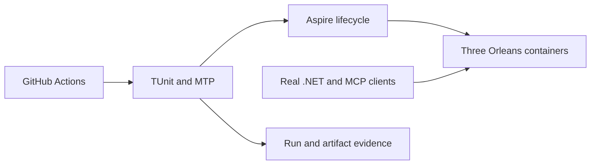
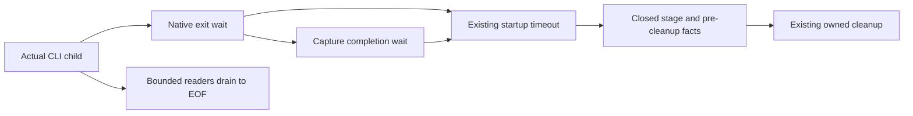

# TestInfrastructure

## Unified Aspire test entry

[ADR-074](../ADR/ADR-074-aspire-owned-test-entry.md) specifies the owner-required
single test entry and partial-start cleanup. Source and qualification are pending.

| Requirement | Acceptance | Tests / evidence |
|---|---|---|
| REQ-TEST-009: Aspire owns suite execution | AC-TEST-009: each closed suite creates one native executable with correct TUnit project/arguments/results and optional original TRX/Cobertura settings; scalar disablement applies to its runner; unknown/explicit-empty suites, invalid bounded paths, incomplete coverage settings and mixed benchmark modes reject before resources; only comparison may pass its existing native target to the child without composing outer database resources | AspireTestEntryModelTests using the actual Aspire builder; original entry-run reports |
| REQ-TEST-010: test entry preserves outcomes and bounded lifetime | AC-TEST-010: native nonzero/failed-start/missing-exit/cancel/timeout cannot count as success; stop/disposal always run; every existing CI suite and artifact remains | root source lifetime review and actual Linux CI native runner exit/status evidence |
| REQ-TEST-011: RF3 is owned once and startup failure releases resources | AC-TEST-011: outer test model contains no idle duplicate nodes; tested child AppHost owns three Docker nodes and discovered SDK/MCP endpoints; every partial start is disposed before deleting only its owned directory | real Aspire model tests, ClusterFixture source lifetime review, actual Docker RF3/recovery artifacts |

Canonical source: AppHost Features/TestInfrastructure; actual model regressions:
ComparisonTests Features/TestInfrastructure; shared IntegrationTests fixture and
CI composition are root-owned joins. No public database or persisted format change.
Local entry runs are development evidence; delivered-source Linux gates remain.

## Prompt termination on owned Aspire failure

[ADR-086](../ADR/ADR-086-aspire-terminal-failure.md) defines the private lifecycle
repair prompted by CI [37202347856](https://github.com/managedcode/KeyLoad/actions/runs/37202347856).
Its original reports show RF3 87/88 passed (cold-upgrade authorization assertion)
and unit 2947/2953 passed (six native CQRS cases); they do not establish an AppHost
crash. Website tests were 201/202 passed, with a real Chrome node-selection
assertion failure. Dashboard-disabled CLI warnings appeared before successful
suites too. These facts come from the original RF3, unit and site TUnit artifacts
at source `15ea5030c6fc010b29127b4b8de07bd255afc7ff`, not inferred CLI text.

| Requirement | Acceptance and evidence |
|---|---|
| REQ-TEST-012: owned terminal Aspire failures stop waiting promptly | AC-TEST-012: a runner's FailedToStart, RuntimeUnhealthy, Finished/Exited without an original exit code, or a required long-lived dependency's terminal state fails its workload without consuming the suite deadline; genuine native notification tests settle within five seconds of publication |
| REQ-TEST-013: completion and planned fault contracts remain intact | AC-TEST-013: expected WaitForCompletion exit is allowed; nonzero/missing completion exit fails; healthy/running and transient health snapshots continue waiting; no dependencies remains valid; guards are canceled and joined before intentional comparison node kill/restart assertions |
| REQ-TEST-014: original outcome, ownership and cleanup remain intact | AC-TEST-014: native runner exit codes, startup exceptions and cancellation remain failures where applicable; AppHost stopping cancels waits; every notification task is canceled/joined, existing diagnostics and stop/disposal remain; unrelated database cells are unaffected |

TASK-TEST-FAILFAST-CONTRACT (root, complete): requirements/ADR and owning source
review. TASK-TEST-FAILFAST-NATIVE (progress_runner, implementation): only new
AppHost Features/TestInfrastructure lifecycle helpers and ComparisonTests
Features/TestInfrastructure native notification regressions. TASK-TEST-FAILFAST-JOIN
(root, after helper): TestSuiteApplication and IsolatedNativeCase integration,
CI focused selection, docs, review and exact-source validation. vector_runtime
owns read-only lifecycle review. These tasks preserve concurrent engine changes;
RF3 CQRS/authorization failures belong to their existing owner. Public database,
stored data, dependencies and topology are N/A: this is private test orchestration.
Native service tests establish notification handling, not real Docker failure
qualification; delivered Linux tests and failure artifact review remain required.

Status: implementation in progress. Owner: KeyLoad lead. Decision: [ADR-036](../ADR/ADR-036-orleans-foundation.md).

REQ-TEST-008 / AC-TEST-008 (TASK-RUNTIME-EVENTSOURCE-W3) coordinates the actual
global Microsoft logging EventSource across the two diagnostic suites. Listener
disposal issues a Disable command; LoggingEventSource disables its global filter
state even when another capture remains active. Exact fa80c701 Windows CI misses
ToolsCall midway through KnownMethodCategoryIsClosed. Use a single named native
TUnit NotInParallel key on McpTransportDiagnosticsTests and
GrainFailureDiagnosticsTests, declared once in a TestInfrastructure constant.
Preserve all native provider/capture/filter and privacy/error/category assertions;
no fake logging, sleeps, retries or production diagnostic change. Existing failing
category/privacy cases and all grain diagnostics are the regression matrix, with
full multi-OS GitHub execution required. Root owns this small cross-slice test
scheduling join because the shared global resource has one integration owner.
ADR039/036 existing contracts suffice; no product/API/data migration applies.

| Requirement | Acceptance and observable evidence |
|---|---|
| REQ-TEST-001: TUnit and Microsoft.Testing.Platform are the sole .NET test framework/runner. | AC-TEST-001: all test projects compile and run with TUnit; no xUnit/VSTest package or attribute remains; migrated assertions preserve every original scenario. |
| REQ-TEST-002: real RF3 tests launch Docker containers under Aspire and invoke the real .NET SDK and official MCP SDK clients. | AC-TEST-002: CI captures three independent containers, stable persisted directories, SDK/MCP success/denial flows and replica failover/rejoin. |
| REQ-TEST-003: generated lock files, local data, secrets, logs and test artifacts do not enter Git or the Docker context. | AC-TEST-003: tracked-file inventory and ignore checks reject these outputs; central NuGet versions remain pinned. |

Slice map: tests mirror their product slice; shared fixture/lifecycle infrastructure remains at test project roots. Shared CI/.gitignore/.dockerignore are integration-owned infrastructure. Production data/API/GUI: N/A, this framework migration adds no domain behavior. The Orleans/Docker boundary changes are ClusterReplication and ClusterRouting. Blobs and MCP coverage must not be reported complete from framework migration alone.

Traceability: AC-TEST-001 maps to all invoking test projects, AC-TEST-002 to IntegrationTests and ComparisonTests, AC-TEST-003 to source/ignore checks. TASK-TEST-MIGRATE and TASK-REP-VERIFY are in the execution plan. Tests run only in GitHub Actions; development builds are compilation evidence. Coverage and complexity policy cannot be claimed satisfied without measured configured gates.

TASK-RUNTIME-ARTIFACTS-W retains actual root TestResults reports from native TUnit
alongside each existing scoped report glob under REQ/AC-TEST-001/002/005 and
AC-MP-012. Run37005805424 proves the missing RF3/analyzer report retention path.
Comparison test reports use a separate comparison-test-results artifact so the
measured comparison-suite archive keeps its existing contract. The lead owns
ci.yml; no test, timeout, gate, permission, measured-report schema or ignore rule
changes. Source review and downloaded complete reports at the new exact run/job
SHA are required evidence. The artifact-path repair itself has a manual exact-CI
verification exception; it cannot convert failing or unexecuted tests to success.

TASK-RUNTIME-COMPARISON-DIAGNOSTICS-W is a failure-only refinement of
REQ/AC-TEST-002/005 and AC-MP-012 after run37005805424. Before StartAsync,
passively retain at most 128 lifecycle records for the comparison runner and its
eight direct wait resources. Only fixed resource names, native timestamps,
local observation sequence, closed state/health categories and exit code are
retained. Snapshot version/readiness are internal in the pinned native package
and remain unavailable; do not infer or reflect them. No properties,
environments, endpoints, connection strings, health
descriptions, exception text or payloads. On the existing cancellation/timeout
path, emit at most 80 lines/8KiB to test-runner stderr, preserving the original
failure even if observation or output fails. Keep this diagnostic out of measured
comparison archives and retain the eight-minute timeout and existing terminal
predicate. The worker owns only a new ComparisonResourceDiagnostics helper;
the lead owns the RealComparisonSuite join and shared documentation. The closed
receipt formatter may be a second helper to preserve type limits; lead extracts
existing evidence-directory/report-copy logic to ComparisonTestEvidenceFiles.cs
without changing path resolution or report bytes. Source privacy,
memory/task-lifetime review plus actual exact-SHA GitHub resource events are the
verification exception for an environmental failure path; no synthetic provider,
local AppHost execution or successful-workload claim is allowed.

REQ-TEST-006 / AC-TEST-006: real shared fixture ownership transfers only after
successful setup. Failure after opening a store releases it before deleting its
owned fresh directory; the same path can reopen without a leaked lock.
Existing supplied directories are rejected before acquisition or mutation, with
their files and real active owner preserved; finally cleanup follows an attempted
store disposal even when an environmental disposal failure throws. Admitted
background work is released/cancelled/observed before database disposal on every
path. CQ016's accepted contract/task graph and ADR033/032 govern source-only
changes: lead owns TestDatabase and new TestInfrastructure/FixtureLifetimeTests;
workers own real EventStreams/Messaging setup regressions and analytical task
cleanup. The lead also owns RealZoneTreeReadGateHold and the new canonical
ResourceExecution/ReadGateLifetimeTests. Original ten-second admitted-search
timeouts begin after cancellation/release attempts; final observation always
awaits actual workers and the actual gate holder before store disposal. Real
immediate/entered and repeated gate disposal cases assert subsequent real-store
usability; environmental timeout/fault branches require the supplemental source
audit rather than a synthetic injector. Actual invalid limits/event counts/batch configuration and same-path
ZoneTree reopen are independent GitHub TUnit assertions. Environmental cleanup/
coordination failures additionally require full source lifetime review; no fake
or local qualification. All existing132 methods/19 migrated roots stay preserved.

REQ-TEST-007 / AC-TEST-007 (TASK-RUNTIME-RECEIPTS-W) preserves failure evidence
from run37015193756 without making failed gates pass. Save the existing bounded
RF3 diagnostic text both as the last-failure file and as a sequential fixture-owned
receipt; cap retained individual files at32, keeping the earliest failures and
unchanged per-file privacy/line/byte caps. Bounded filenames contain only the
sequence. Actual GitHub artifacts must retain the first replica failure before
later MCP failures overwrite the last-failure view.

On comparison cleanup, stop the actual application, copy any existing complete
report files using the existing helper, then delete owned temporary data. Native
terminal state, zero exit, deadlines and all existing assertions remain required;
retained report bytes are partial evidence when the test fails. Recovery runs on
each matrix OS after successful build even if a preceding unit/style/analyzer
step fails, with normal job failure preserved and no continue-on-error. A failed
build or cancellation prevents recovery. The lead owns ci.yml, RF3 receipt helper
and RealComparisonSuite cleanup join. ADR036/035 govern the ordered source-only
rollback. Actual temporary-file IntegrationTests verify first/last receipt
preservation, the32-file ceiling and concurrent whole-file writes; source privacy
and exact-SHA GitHub first-failure/report/recovery artifacts supplement those
assertions. Environmental watch/runner failures
must not be replaced by mocks or counted as green qualification.

TASK-RUNTIME-RESTART-RECEIPT-W4 refines REQ/AC-TEST-007 after exact main
b533c80 / CI37032546228. The failed native restart attempt is currently missing
its container generation: the first receipt shows the killed old node and later
receipts show a successful restoration. Capture the public Aspire current
ResourceId, closed state/health, exit code and creation/start/stop timestamps
before Start, after its successful command and immediately after an existing
restart failure. These are sampled snapshots, not a native snapshot version or
proof of the transition which caused the failure. Native Version and readiness
internals are unavailable and must not be reflected or inferred.

The failure receipt includes the existing verified pre-kill Docker ID/start time,
closed failure stage/type, Start success and one immediate read-only Docker
inspection of ID/status/exit/OOM/start/finish/error-present. No Docker error text,
environment, properties, endpoints, credentials, arbitrary method/type text or
payload is included. Only validated native identifiers and timestamps are
retained; unknown states/types become a fixed unavailable/other marker. At most
32 earliest restart receipts plus one latest view are retained, with80-line/8KiB
UTF-8 bounds and filenames containing only the local sequence. The diagnostic
has its own three-second native-inspection deadline after the original failure.
Every path after process creation owns termination, reaping and observation of
both redirected readers, including setup, wait and reader faults. Mandatory
cleanup can extend wall time if operating-system termination is delayed; no
hard end-to-end three-second return or detached process/reader claim is allowed.
Termination checks an exit race and retries a failed live-child tree kill once;
a final live-child kill error is retained through mandatory task joining. If
the operating system permanently refuses termination, finite cleanup cannot be
guaranteed. This environmental branch needs native CI evidence or source review,
never a synthetic process failure or a passing lifecycle claim.
It releases/awaits its actual CLI process and redirected readers on cancellation,
then rethrows the original restart exception even if diagnostic inspection or
file writing fails. Existing synchronous whole-file persistence keeps its
80-line/8KiB limit; no hard three-second filesystem-latency claim or detached
writer task is allowed.
No Start, health, runtime identity, zero-exit, cancellation, timeout, retry count,
quorum, atomicity, data or cleanup assertion changes.

Root owns ContainerRuntimeControl and the closed receipt-kind join in
ClusterFailureReceipts; one disjoint worker owns only new ClusterReplication
failure-capture/projection/CLI-lifetime helpers and real temporary-file tests.
Tests first prove only selected native public snapshot fields survive with
canary properties/env/URL/state/identifier/type rejected, whole valid bounded
files preserve the first failed generation across later receipts, and32-file
retention remains exact. Native-shaped Docker records cover valid identities,
safe error-presence projection and malformed ID/state/exit/OOM/timestamp fields;
actual stream readers prove output is drained after its retained prefix is full.
Do not fake native services, Docker or process failures.
The original RF3 leader-loss/minority scenario remains the real lifecycle test;
an environmental failure branch additionally requires exact-SHA GitHub artifact
review and source lifetime/predicate comparison. If the next run succeeds, do
not claim its unexecuted failure path qualified. ADR-035/036/039 existing
privacy/lifetime contracts suffice; no product/public/dependency boundary changes.
Rollback reverts only this additive diagnostic join and its helpers/tests.

## Accepted comparison-host startup diagnostics

AC-REC-FUP-004 records the preserving W6 fixture follow-up: the exact delivered
SHA, complete GitHub job/report artifacts, native failure identities and report
hashes remain in the runtime ledger. Unit/Recovery/RF3/Comparison must all execute;
failed or unexecuted cases cannot count as green. Local development build,
formatter and governance are source validation only. Full native artifact review
and source lifetime/predicate audit cover environmental branches which cannot be
injected without prohibited service doubles. StorageRecovery owns AC-REC-FUP-003;
ClusterReplication owns AC-REC-FUP-001/002. Existing ADR035/036/033 apply.

REQ-TEST-009 / AC-TEST-009 (TASK-RUNTIME-HOST-DIAGNOSTICS-W5) refines the
private real-process AC-HOST-003/007 fixture after exact8b475d4 /
CI37042082081 repeats four Windows20-second failures. One existing deadline
covers both native exit and redirected-output drain; current failure evidence
does not distinguish them. Source configuration order is not a diagnosis.

Before the existing timeout cleanup, retain only a closed ProcessExit/OutputDrain
stage, actual available exit state/code, closed capture-task states, capped
capture lengths and boolean matches for existing static validation markers.
The receipt is at most8KiB and keeps the original TimeoutException message
prefix. No raw child output, exception text, arguments, environment, paths,
endpoints, credentials or unknown values are logged. Diagnostic observation
failure becomes a fixed unavailable marker and cannot replace the original
startup timeout or caller cancellation.

Each actual StreamReader still uses4096-character reads, retains32768 characters
maximum and drains the remainder. Synchronize partial-buffer observation; retain
the same20-second shared startup deadline and five-second cleanup behavior.
Do not add retries, serialization, sleeps, client/config reorder, product changes
or new detached work. Preserve all four configuration/ordering assertions and
the real cleanup test. Environmental failure/cancellation additionally needs
source lifetime review and the actual GitHub failure receipt; a successful run
does not qualify its unexecuted failure branch.

Slice ownership: one worker owns only UnitTests/Features/BenchmarkComparisons/
ComparisonHostProcess.cs and new cohesive capture/diagnostic/test helpers;
root owns shared documentation and integration. New genuine native-shaped
projection/privacy and real-stream prefix/EOF cases map AC-TEST-009.1–003;
the existing real host cases map009.4. Exact delivered-SHA full GitHub
unit/recovery/RF3/comparison plus native receipt review map009.5. All tests
remain TUnit/MTP and CI-only. Existing ADR035/043 private fixture ownership,
privacy and lifetime contracts suffice; no public/data/dependency/deployment
migration is authorized. Rollback reverts only this additive private diagnostic
packet and its source docs; coverage and full goal remain unqualified.

## Platform, dependency та release qualification

B3 keeps the exact task lifetime above while satisfying enabled CA1031: a private
throwing AggregateException wrapper preserves each original exception object;
the collector handles only that wrapper and adds direct inner errors. It never
flattens or drops an original empty aggregate. Raw-worker awaits retain only the
exact expected cancellation exception. CQ016's accepted B3 contract and graph
govern source review and genuine GitHub admission/cancellation regressions;
environmental error branches retain the explicit full-source audit supplement.

Актори: contributor, CI runner, release owner і evidence consumer. Source/config entry points: [canonical CI](../../.github/workflows/ci.yml), [global.json](../../global.json), [central packages](../../Directory.Packages.props), [dependency survey](../implementation/dependency-survey.json), [qualification status](../implementation/status.json). Product runtime N/A: infrastructure запускає та перевіряє справжній продукт, не підміняє його demo engine.

| Вимога | Acceptance / flows | Test / evidence mapping |
|---|---|---|
| REQ-TEST-004: versions/licenses/native dependencies та platforms зафіксовані для delivered source | AC-TEST-004: centrally pinned package/image inventory і source provenance відповідають actual restore/container; required platform jobs pass, incompatible/missing/native/license requirement explicit fail; free comparison engines не потребують Enterprise | Owner-selected Linux-only GitHub qualification; macOS local runs remain development evidence. Current39-pin survey and26-project/222-package closure bind cached artifacts, licenses and provenance; clean delivered-source restore/native/platform qualification remains pending. |
| REQ-TEST-005: release manifest рекламує тільки перевірені capability/guarantee gates | AC-TEST-005: all required build/analyze/format/TUnit/recovery/RF3 SDK/MCP та configured coverage/complexity pass на exact delivered SHA; failures/unsupported/unconfigured remain explicit unavailable; power-loss/endurance/fault gates окремі, stable release withheld до потрібних доказів | PLANNED consolidated exact SHA/run/job/artifact release evidence для KL-041/044/080/104; [CodeQuality](CodeQuality.md), [BenchmarkComparisons](BenchmarkComparisons.md), [ResourceExecution](ResourceExecution.md) owning checks |

Negative/edge/error flows: skipped suite не passing; flaky case — failure; malformed/missing artifact, mismatched SHA/profile, unavailable engine/license/platform або test resource startup failure не замінює previous qualified history. Old CI не кваліфікує uncommitted code; test method name не є result. [ADR-031](../ADR/ADR-031-modular-all-in-one-resource-isolation.md) і [ADR-036 foundation](../ADR/ADR-036-orleans-foundation.md) фіксують topology/capability scope.

Target maps: shared AppHost/CrashHost/fixtures/workflows — composition/infrastructure; business cases mirror owning canonical `Features/<SliceName>/`, TUnit/MTP — єдиний .NET framework/runner. Frontend N/A; real first-render website evidence належить BenchmarkComparisons. One integration owner owns central project/CI/resource graph; bounded test workers зберігають every assertion та join з real GitHub evidence. Нові doc files не запускають локальний продукт і не послаблюють жоден gate.
