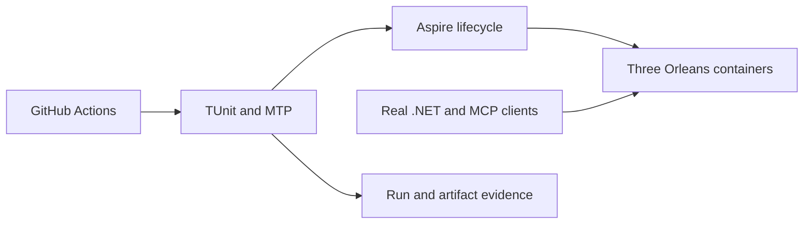

# TestInfrastructure

Status: implementation in progress. Owner: KeyLoad lead. Decision: [ADR-036](../ADR/ADR-036-orleans-foundation.md).

| Requirement | Acceptance and observable evidence |
|---|---|
| REQ-TEST-001: TUnit and Microsoft.Testing.Platform are the sole .NET test framework/runner. | AC-TEST-001: all test projects compile and run with TUnit; no xUnit/VSTest package or attribute remains; migrated assertions preserve every original scenario. |
| REQ-TEST-002: real RF3 tests launch Docker containers under Aspire and invoke the real .NET SDK and official MCP SDK clients. | AC-TEST-002: CI captures three independent containers, stable persisted directories, SDK/MCP success/denial flows and replica failover/rejoin. |
| REQ-TEST-003: generated lock files, local data, secrets, logs and test artifacts do not enter Git or the Docker context. | AC-TEST-003: tracked-file inventory and ignore checks reject these outputs; central NuGet versions remain pinned. |

Slice map: tests mirror their product slice; shared fixture/lifecycle infrastructure remains at test project roots. Shared CI/.gitignore/.dockerignore are integration-owned infrastructure. Production data/API/GUI: N/A, this framework migration adds no domain behavior. The Orleans/Docker boundary changes are ClusterReplication and ClusterRouting. Blobs and MCP coverage must not be reported complete from framework migration alone.

Traceability: AC-TEST-001 maps to all invoking test projects, AC-TEST-002 to IntegrationTests and ComparisonTests, AC-TEST-003 to source/ignore checks. TASK-TEST-MIGRATE and TASK-REP-VERIFY are in the execution plan. Tests run only in GitHub Actions; development builds are compilation evidence. Coverage and complexity policy cannot be claimed satisfied without measured configured gates.

TASK-RUNTIME-ARTIFACTS-W retains actual root TestResults reports from native TUnit
alongside each existing scoped report glob under REQ/AC-TEST-001/002/005 and
AC-MP-012. Run37005805424 proves the missing RF3/analyzer report retention path.
Comparison test reports use a separate comparison-test-results artifact so the
measured comparison-suite archive keeps its existing contract. The lead owns
ci.yml; no test, timeout, gate, permission, measured-report schema or ignore rule
changes. Source review and downloaded complete reports at the new exact run/job
SHA are required evidence. The artifact-path repair itself has a manual exact-CI
verification exception; it cannot convert failing or unexecuted tests to success.

TASK-RUNTIME-COMPARISON-DIAGNOSTICS-W is a failure-only refinement of
REQ/AC-TEST-002/005 and AC-MP-012 after run37005805424. Before StartAsync,
passively retain at most 128 lifecycle records for the comparison runner and its
eight direct wait resources. Only fixed resource names, native timestamps,
local observation sequence, closed state/health categories and exit code are
retained. Snapshot version/readiness are internal in the pinned native package
and remain unavailable; do not infer or reflect them. No properties,
environments, endpoints, connection strings, health
descriptions, exception text or payloads. On the existing cancellation/timeout
path, emit at most 80 lines/8KiB to test-runner stderr, preserving the original
failure even if observation or output fails. Keep this diagnostic out of measured
comparison archives and retain the eight-minute timeout and existing terminal
predicate. The worker owns only a new ComparisonResourceDiagnostics helper;
the lead owns the RealComparisonSuite join and shared documentation. The closed
receipt formatter may be a second helper to preserve type limits; lead extracts
existing evidence-directory/report-copy logic to ComparisonTestEvidenceFiles.cs
without changing path resolution or report bytes. Source privacy,
memory/task-lifetime review plus actual exact-SHA GitHub resource events are the
verification exception for an environmental failure path; no synthetic provider,
local AppHost execution or successful-workload claim is allowed.

REQ-TEST-006 / AC-TEST-006: real shared fixture ownership transfers only after
successful setup. Failure after opening a store releases it before deleting its
owned fresh directory; the same path can reopen without a leaked lock.
Existing supplied directories are rejected before acquisition or mutation, with
their files and real active owner preserved; finally cleanup follows an attempted
store disposal even when an environmental disposal failure throws. Admitted
background work is released/cancelled/observed before database disposal on every
path. CQ016's accepted contract/task graph and ADR033/032 govern source-only
changes: lead owns TestDatabase and new TestInfrastructure/FixtureLifetimeTests;
workers own real EventStreams/Messaging setup regressions and analytical task
cleanup. The lead also owns RealZoneTreeReadGateHold and the new canonical
ResourceExecution/ReadGateLifetimeTests. Original ten-second admitted-search
timeouts begin after cancellation/release attempts; final observation always
awaits actual workers and the actual gate holder before store disposal. Real
immediate/entered and repeated gate disposal cases assert subsequent real-store
usability; environmental timeout/fault branches require the supplemental source
audit rather than a synthetic injector. Actual invalid limits/event counts/batch configuration and same-path
ZoneTree reopen are independent GitHub TUnit assertions. Environmental cleanup/
coordination failures additionally require full source lifetime review; no fake
or local qualification. All existing132 methods/19 migrated roots stay preserved.

## Platform, dependency та release qualification

B3 keeps the exact task lifetime above while satisfying enabled CA1031: a private
throwing AggregateException wrapper preserves each original exception object;
the collector handles only that wrapper and adds direct inner errors. It never
flattens or drops an original empty aggregate. Raw-worker awaits retain only the
exact expected cancellation exception. CQ016's accepted B3 contract and graph
govern source review and genuine GitHub admission/cancellation regressions;
environmental error branches retain the explicit full-source audit supplement.

Актори: contributor, CI runner, release owner і evidence consumer. Source/config entry points: [canonical CI](../../.github/workflows/ci.yml), [global.json](../../global.json), [central packages](../../Directory.Packages.props), [dependency survey](../implementation/dependency-survey.json), [qualification status](../implementation/status.json). Product runtime N/A: infrastructure запускає та перевіряє справжній продукт, не підміняє його demo engine.

| Вимога | Acceptance / flows | Test / evidence mapping |
|---|---|---|
| REQ-TEST-004: versions/licenses/native dependencies та platforms зафіксовані для delivered source | AC-TEST-004: centrally pinned package/image inventory і source provenance відповідають actual restore/container; required platform jobs pass, incompatible/missing/native/license requirement explicit fail; free comparison engines не потребують Enterprise | GitHub restore/build/artifact inventory, required multi-OS CI jobs, comparison image/native evidence; current survey — historical source, новий snapshot qualification pending |
| REQ-TEST-005: release manifest рекламує тільки перевірені capability/guarantee gates | AC-TEST-005: all required build/analyze/format/TUnit/recovery/RF3 SDK/MCP та configured coverage/complexity pass на exact delivered SHA; failures/unsupported/unconfigured remain explicit unavailable; power-loss/endurance/fault gates окремі, stable release withheld до потрібних доказів | PLANNED consolidated exact SHA/run/job/artifact release evidence для KL-041/044/080/104; [CodeQuality](CodeQuality.md), [BenchmarkComparisons](BenchmarkComparisons.md), [ResourceExecution](ResourceExecution.md) owning checks |

Negative/edge/error flows: skipped suite не passing; flaky case — failure; malformed/missing artifact, mismatched SHA/profile, unavailable engine/license/platform або test resource startup failure не замінює previous qualified history. Old CI не кваліфікує uncommitted code; test method name не є result. [ADR-031](../ADR/ADR-031-modular-all-in-one-resource-isolation.md) і [ADR-036 foundation](../ADR/ADR-036-orleans-foundation.md) фіксують topology/capability scope.

Target maps: shared AppHost/CrashHost/fixtures/workflows — composition/infrastructure; business cases mirror owning canonical `Features/<SliceName>/`, TUnit/MTP — єдиний .NET framework/runner. Frontend N/A; real first-render website evidence належить BenchmarkComparisons. One integration owner owns central project/CI/resource graph; bounded test workers зберігають every assertion та join з real GitHub evidence. Нові doc files не запускають локальний продукт і не послаблюють жоден gate.
