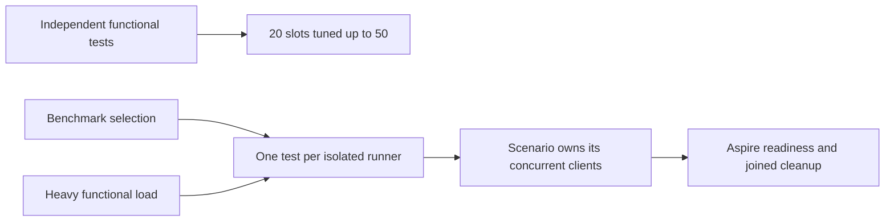

# TestInfrastructure: native TUnit CI entry

The owner correction on 2026-10-07 requires CI to run native TUnit tests after compilation. TUnit owns test outcomes and native Detailed progress. Existing TUnit fixtures start real Aspire applications and exercise discovered endpoints with the actual C# clients; benchmark workload containers also execute TUnit. Benchmarks remain exclusive to their separate pipeline.

## Functional concurrency and exclusive measurements (2026-10-09)

REQ-TUNIT-ENTRY-013: ordinary independent functional selections default to 20 native TUnit slots, with measured tuning up to 50; comparison selections execute exactly one test at a time. AC-TUNIT-ENTRY-013: execute the actual Node selector and typed AppHost selection with ordinary defaults/20/50 and comparison defaults/1; comparison overrides greater than one fail before resource startup. Direct ComparisonHost container/process entries also pass the native one-test limit. Client concurrency remains a separate workload parameter and is forwarded unchanged. Native Detailed output, original outcomes, deadlines and joined cleanup remain unchanged.

REQ-TUNIT-ENTRY-014: heavy functional ingestion/mixed-operation load cases execute exclusively, separately selected from ordinary parallel suites and coverage contributors. AC-TUNIT-ENTRY-014: native case discovery and original execution reports show no ordinary or second heavy case overlapping the selected load scenario; Aspire owns each genuine RF3 fixture and its cleanup. Independent Linux Actions jobs may overlap only with independent database/client processes, containers and volumes. Heavy correctness tests remain functional acceptance; comparative measurements remain in Benchmarks.

TASK-TUNIT-ISOLATED-MEASUREMENTS-013 has three ordered scopes: root freezes this contract and ADR-117; the scheduling worker owns `scripts/Features/TestInfrastructure/run-tests.mjs`, typed AppHost selection and complete selector regressions; root reviews/joins, runs formatting, the canonical solution build and focused native TUnit regressions. Benchmark inventory review owns read-only inspection of native worker/session serialization and workflow isolation. No packages, database APIs, persisted formats or topology changes are in scope. Rollback removes only the scheduling delta; the owner's isolation requirements remain mandatory. AC-014 and 1/10/500-client million-record ingestion qualification remain open until real complete-flow evidence exists; documentation is not execution evidence.

Local scheduling-stage verification2026-10-09: the final complete Release build
passed with zero warnings/errors; canonical formatter and governance passed.
Native TUnit executed11/11 functional selector cases and16/16 comparison/model/
direct-process entry cases with no skips. Original final TRX intervals show11
overlapping focused functional cases and one comparison case at a time. The
earlier7/11 and15/16 arrangement failures remain separate originals; their repair
omits an absent configuration key rather than binding an explicit null as zero.
This is macOS ARM64 development evidence. Current-source Linux, real heavy load,
million-record ingestion and full product coverage/CRAP qualification remain open;
no dataset/client-execution or performance claim follows from selector regressions.

REQ-TUNIT-ENTRY-001: select each functional, scalar, recovery, RF3, site or benchmark project without an outer Aspire CLI invocation. AC-TUNIT-ENTRY-001: native argument regressions verify project/filter/TRX/coverage, bounded parallelism/timeout, scalar environment and rejection of unknown/duplicate options. Actual C# TUnit client operations and measured workload timings remain unchanged.

REQ-TUNIT-ENTRY-002: native RF3 server coverage retains the original source/manifest/collector contract. AC-TUNIT-ENTRY-002: the TUnit session starts only the existing Aspire image prerequisite, propagates the original validated runner environment, removes the recursive runner, observes its original exit and joins output/application/image cleanup. Existing native coverage fixture tests and Linux RF3 coverage receipts qualify this lifecycle.

REQ-TUNIT-ENTRY-003: all actual benchmark client workload execution is a TUnit test. AC-TUNIT-ENTRY-003: the pinned Aspire load-generator image contains the ComparisonHost native TUnit executable, runs its existing C# client workloads after resource dependencies settle, asserts failure/success and retains original measurement JSON plus native TRX. Existing host startup, negative configuration, report and cleanup cases cover failures.

Implementation: [ADR-117](../../ADR/ADR-117-native-tunit-ci-entry.md), TASK-TUNIT-ENTRY-001..004. Root owns scripts/Features/TestInfrastructure, workflow joins, IntegrationTests Features/CodeQuality/Lifecycle, ComparisonHost Features/BenchmarkComparisons/Cases and associated regressions. Frontend: N/A, runner execution only. Contracts: N/A, no public database API change. Existing RF3 membership, authorization, scalar, recovery, correctness, provenance and performance requirements remain mandatory.

Verification for this editing task is compilation, native formatting, Node syntax and workflow syntax only. The owner explicitly requested no local runtime tests or infrastructure startup; Linux runtime qualification remains unproven until the original CI suites complete.

Automated traceability: AC-TUNIT-ENTRY-001 maps to `tests/KeyLoad.UnitTests/Features/TestInfrastructure/Cases/NativeTUnitSelectionTests.cs`; AC-TUNIT-ENTRY-003 maps to ComparisonHost `NativeClientWorkloadTests`, the existing real host configuration/report/cleanup cases and ComparisonTests `NativeWorkloadTestReportRetentionTests`. AC-TUNIT-ENTRY-002 maps to the existing native RF3 collector/fixture cases and complete Linux coverage cohort; no local runtime qualification was executed. Static stage evidence: [NativeTUnitVerification](NativeTUnitVerification.md).

REQ-TUNIT-ENTRY-004: the original Linux RF3 job must have a bounded aggregate scheduling budget for the complete same-image native product-coverage cohort. AC-TUNIT-ENTRY-004: the `docker-rf3` job in `.github/workflows/build-and-tests.yml` allows at most 180 minutes for its build, required RF3 suite, two full uninstrumented unit censuses, ten positive instrumented unit groups, instrumented recovery/RF3 runs, strict descriptor admission and product merge. Preserve every individual native test/session timeout, corpus, original exit code, no-skip rule, source/image identity and coverage threshold; a larger job budget does not qualify a failed or incomplete run.

TASK-TUNIT-ENTRY-005 freezes this scheduling amendment before the workflow change. The unchanged local R111 full unit census took 19 minutes 28 seconds and failed one ANN deadline; its duration is planning evidence only. The required normal/scalar census and group union execute the functional cases twice in each mode, with build, RF3, recovery and admission in the same job. The former 60-minute aggregate budget cannot be treated as a demonstrated bound for that complete cohort. Root owns the workflow join; the coverage agent may prepare a private overlay against this contract. Verification is the original successful complete Linux cohort and its native receipts, with failures and timeouts retained. Frontend and public database contracts: N/A, CI scheduling only.

REQ-TUNIT-ENTRY-005: an explicit local six-silo membership selection owns its fresh
image prerequisite and final exact-tag cleanup inside the TUnit case.
AC-TUNIT-ENTRY-005: [ADR-119](../../ADR/ADR-119-tunit-owned-local-membership-image.md)
defines the exact selector, typed handoff, source/image admission, six actual
container proof, SDK/MCP no-dispatch flow, failure joins and unchanged bounds.
TASK-TUNIT-LOCAL-MEMBERSHIP-IMAGE freezes the ordered source/test stages there.
The default GitHub route and Linux delivery gates remain mandatory.

REQ-TUNIT-ENTRY-008: original required RF3 failure diagnostics become available before the longer covered cohort completes. AC-TUNIT-ENTRY-008: after the original `rf3-required` native step finishes with success or failure, the same job uploads its unchanged original reports and already prepared source/image receipts as `docker-rf3-original-diagnostics`; a portable native `find` report-presence check includes ignored test artifacts, does not follow links, requires an actual nonempty TRX and fails before upload when none exists. This artifact is diagnostic evidence only. Complete qualification still requires the existing terminal `docker-rf3-qualification` artifact, final source/image verification, every required suite and strict coverage admission. No copied or edited report, synthetic outcome, skipped suite, changed deadline or new permission is admitted.

Authenticated [Linux run 37835972588](https://github.com/managedcode/KeyLoad/actions/runs/37835972588) retained an ordinary TRX with 118 passed and 12 failed cases, while the early diagnostic check exited 127 because the runner lacked `rg`. This establishes the report-check defect; the partial 130-case execution does not establish complete RF3 qualification or its initiating failure cause.

REQ-TUNIT-ENTRY-009: the covered RF3 fixture retains its actual admitted container-name map with the original verified running identities before application shutdown. AC-TUNIT-ENTRY-009: after the existing native Stop completes, the coverage owner inspects those same original names, requires each exact started container/image to be exited, and publishes only after original readers, collectors and application disposal settle without failures. Shutdown must not resolve application services after Stop; a missing retained identity, failed native inspection, cancellation or cleanup error remains fatal. Existing complete relational join and three join-budget SDK/official-MCP flows exercise this lifecycle as covered contributors; no mocked provider or metadata-only test can qualify it.

TASK-TUNIT-COVERED-SHUTDOWN-IDENTITY-009 maps this lifecycle refinement to REQ/AC-TEST-010/014/015 and REQ/AC-CQ-039/040/042 under ADR-117/033. Authenticated original Linux run37821315110/attempt1/source3458f6111f94e93d40334bc2cdaae008dac58a01 retains four covered ObjectDisposedException failures at ClusterFixtureApplicationShutdown's service lookup after Stop. Root owns the NativeCoverageRf3FixtureOwner and ClusterFixtureApplicationShutdown join, preserving all original Stop/disposal/error/deadline and exact-image gates. Build/source review is development evidence; the same four complete current-source covered RF3 operations and full collector/merge gates remain required.

TASK-TUNIT-EARLY-RF3-DIAGNOSTICS-008 maps this requirement to the existing native RF3 invocation and pinned artifact action in `.github/workflows/build-and-tests.yml`, under ADR-117. Root freezes the contract, adds the native step identity and diagnostic upload, reviews the workflow, then authenticates the original Linux run/attempt/source/job/artifact digest. The earlier ordinary RF3 failure is otherwise unavailable from the artifact API while the full covered cohort is still executing. Frontend and public contracts are N/A; this only shortens the failure feedback path. Rollback removes the additional diagnostic upload; all final qualification gates remain mandatory.

REQ-TUNIT-ENTRY-010: complete named task acceptance scopes run concurrently on independent Linux GitHub runners, supplementing every existing full qualification job. AC-TUNIT-ENTRY-010: `task-acceptance` in Build and Tests has eight isolated task/profile cells (KL-011, KL-014, KL-015 and KL-021; normal and scalar caller), fail-fast disabled and no dependency on another task or full RF3 completion. Each cell owns its current-source server-only image prerequisite, complete Release build, native source/DLL/PDB receipts, native filtered discovery and complete mapped operation execution. Original discovery and TRX must have exactly the declared unique case union, no missing/extra/skipped cases and all outcomes passed; report absence, nonzero native exit, source/image drift or cleanup failure denies that cell. Native Detailed output remains visible. Every TUnit fixture owns genuine Aspire readiness, actual RF3 membership, discovered endpoints, real SDK/official MCP operations and joined shutdown.

TASK-TUNIT-PARALLEL-TASK-ACCEPTANCE-010 freezes ordered ownership under ADR-117. Root owns `.github/workflows/build-and-tests.yml`, the versioned `scripts/Features/CodeQuality/task-acceptance.contract.json`, docs, status and final integration. The session agent owns private `task-acceptance.ps1` selection/discovery orchestration; the security agent owns private `task-acceptance.verify.ps1` original census/TRX admission. The scripts select and observe native TUnit processes only and cannot implement database clients or workloads. KL-011 maps its full strict-index/uniqueness scope to 13 unit/support controls, two actual recovery flows and one RF3 SDK/MCP composite flow. KL-014 maps seven real Kestrel controls and five bootstrap/interrupted RF3 flows. KL-015 maps 12 native telemetry flows, ten actual RF3 authority/bounds flows and ten native logger/model controls; controls do not count as RF3 execution. Counts are authored expectations until each cell's native discovery verifies them. The canonical contract lists the exact methods and parameterized identities; existing owning feature requirements remain authoritative.

Native progress implementation reuses `functional-coverage.native-merge.process.ps1` with an optional `ForwardToConsole=false` parameter. The task adapter enables it: the existing single stdout/stderr reader captures each admitted chunk under the unchanged shared output bound and immediately forwards that same chunk to the matching native Console writer. Existing callers keep their default behavior. Console failures enter the same initiating-failure/process/reader settlement path. No additional reader, file-polling bridge, detached task, rewritten output or synthetic progress counter is allowed; originals and native exits remain authoritative. The session agent owns the private guarded helper amendment; root reviews its canonical join.

The same REQ/AC-TUNIT-ENTRY-010 requires failure settlement to terminate the owned native process tree before invalidating its pending stdout/stderr readers. An actual unchanged-helper overflow control retained returned Dispose/Kill calls, a faulted stderr reader and an unjoined exit task; it did not publish a settled result within its existing bounds. The narrow repair swaps those two existing actions only. Actual overflow and native-deadline failures must retain their initiating exceptions and failed native exits, join all original readers/process and dispose, then complete a healthy Unicode-output continuation through the same helper. Preserve every timeout, output bound, task join and failure aggregation; this observation does not claim an unobserved runtime mechanism or database qualification.

Task tooling must participate in the original source-manifest script inventory. Root joins the guarded amendment to `functional-coverage.shared.ps1`, `functional-coverage.inventory.ps1`, `functional-coverage.production-source-manifest.ps1` and `functional-coverage.native-merge.files.ps1`. One case-sensitive closed native predicate admits exactly `task-acceptance.ps1`, `task-acceptance.verify.ps1` and `task-acceptance.contract.json` across both producers and original-manifest admission; other task-acceptance names fail. Existing functional-coverage names, `.dockerignore`, path/hash/reparse/output bounds and schema remain unchanged. Actual prepare/verify must preserve the same source/image and script roster; these files cannot be omitted from provenance or become coverage contributors.

TASK-TUNIT-EMPTY-ORIGINAL-010 repairs REQ/AC-TUNIT-ENTRY-010's original stream admission: a permitted zero-byte stdout/stderr is a non-null typed byte array with length zero and the native SHA-256 of empty bytes. PowerShell statement output enumeration must not turn it into null before hashing. Authenticated fe8e813 KL-011 scalar retained all 16 passing native cases, successful source verification and cleanup, then failed in verifier HashData on its actual empty stream; the missing acceptance receipt remains a failure. Regress the existing reader against these unchanged empty and nonempty originals, deny an empty required manifest and a changed captured original, then admit the healthy unchanged continuation. Every source/image, exact case, outcome, stream-parity and cleanup check remains mandatory; new exact-source Linux task receipts are still required.

TASK-TUNIT-ORIGINAL-REPRESENTATION-010 freezes the related original-admission repairs before joining them under REQ/AC-TUNIT-ENTRY-010 and REQ/AC-CQ-039/040. Native discovery retains its exact report class, including constructor display, separately from the canonical declared class, method, parameterized instance, UID and source identity. Original TRX must match the canonical declared class and TestMethod.name, and the exact declared instance must equal both UnitTest.name and UnitTestResult.testName. Do not strip constructor or parameter displays or substitute method names. The existing owning functional-coverage.native-merge.trx.ps1 captures result output as an actual array, including a single result; dictionary field count is not test count. Preserve every exact test ID, complete case union, native counter, successful outcome and no-skip check.

The owning task adapter must remove DOTNET_EnableHWIntrinsic through the actual native null-string API for normal callers, set exactly 0 for scalar callers, and restore the exact inherited null, empty or nonempty value in finally. Keep normal-null/scalar-0 admission strict; the original fe8 normal empty-string environment is not silently accepted. Supporting parser regressions use the unchanged authenticated 26 original selections: 25 all-pass selections with 112 cases are admitted, while the genuine two-failure scalar selection remains rejected. Copies with changed definition/result display, extra, missing, duplicate, skipped or failed cases and changed counters must be denied before the unchanged healthy original is admitted again. Original files and failed jobs remain immutable. Root owns the three-path integration, native syntax/source checks and fresh committed Linux task cohort; supporting parser/environment observations do not qualify database operations or numeric coverage.

The existing real ProductionSourceManifestOperationTests and NativeProcessSettlementFollowupTests must independently expect the three frozen task tooling names in their complete source-manifest oracle. Authenticated fe8 normal/scalar and native-source-ownership originals rejected the genuine 56-entry roster because their oracle still enumerated only 53 functional-coverage entries. Add precisely the declared task adapter, verifier and contract; unknown task-prefixed names remain rejected, and every actual file hash, bound, ordinal order, tamper denial and healthy continuation remains mandatory. Do not reduce the assertion to a count-only or producer-derived oracle.

Each job retains the existing 180-minute scheduling bound, native 30-minute unit/recovery and 60-minute RF3 selection deadlines and original fixture deadlines. Native TUnit has 20 execution slots within each cell under the owner's subsequent parallel-test correction; selected scopes run sequentially, while independently owned cases inside each scope run concurrently. Genuine shared-resource exclusions remain subject to invariant audit. Independent later selectors still run after an earlier selector fails when unchanged source/image prerequisites remain valid; original failures remain failures without retries or `continue-on-error` promotion. Source/image verification runs after all native children settle, registry cleanup retains its failures, and unchanged originals upload even on failure. Scalar disables CPU intrinsics in the native caller and in-process unit runtime; the current Docker resources do not propagate that setting, so these RF3 cells do not qualify scalar server execution. Task artifacts cannot become coverage contributors, a product descriptor, full-suite qualification or a fabricated coverage percentage. Full mandatory build/unit/scalar/recovery/RF3/coverage jobs remain unchanged.

Verification: parse the actual YAML and PowerShell, review preservation of mandatory jobs, execute all eight current committed-source Linux cells and authenticate run/attempt/SHA/job/artifact digests and original reports. Rollout is the next normal main push; rollback removes only the additive task matrix and its tooling, retaining all full jobs. No persisted data, database contract, package or production topology changes. Frontend: N/A, CI infrastructure. Status: Accepted; exact-source GitHub execution pending.

Owner clarification 2026-10-09 permits focused task iterations. REQ/AC-TUNIT-ENTRY-010 also requires a closed manual `task` choice: `all` is the default complete workflow, while KL-011/014/015/021 runs repository governance and only that task's two normal/scalar-caller cells. Trusted push/PR and manual `all` retain all full mandatory jobs and all eight task cells. A focused manual run intentionally has no full-suite or coverage qualification; its original artifacts prove only the declared task scope. Use `gh workflow run build-and-tests.yml --repo managedcode/KeyLoad --ref main -f task=KL-011` (or the other declared task) for a related-test iteration, with unchanged exact discovery, native reports, source/image and cleanup gates.

REQ-TUNIT-ENTRY-011: independent functional tests use at least 20 concurrent native TUnit slots by default, including task lanes. AC-TUNIT-ENTRY-011: actual `nativeSelection` produces `--maximum-parallel-tests 20`, typed TestExecutionOptions selects the same default, invalid explicit limits remain rejected, and existing NativeTUnitSelectionTests execute the real Node selector's success/negative/local-image flows with this argument. A selected whole-operation batch with at least 20 independent cases retains original TRX timestamps and source/image receipts to verify actual overlap. Existing true shared RF3 fixture/global diagnostic/fault ownership is audited before changing its native exclusions; increasing a runner limit alone does not prove 20 simultaneous cases or authorize shared-resource races. TASK-TUNIT-NATIVE-PARALLELISM-011 under ADR-117 maps root-owned selector/options/regression/inventory joins, coherent build and focused native execution before main push and exact-source Linux verification. No operation deadline, assertion, RF3 membership or cleanup contract changes.

REQ-TUNIT-ENTRY-006: the explicit standard RF3 Q2/schema batch also owns fresh
image preparation and cleanup through its native C# fixture. AC-TUNIT-ENTRY-006:
the exact second selector, typed handoff, three actual container identities,
eight whole operations, failure joins and source/image/cleanup bounds are frozen
in ADR-119. TASK-TUNIT-LOCAL-RF3-IMAGE-006 maps to the existing native selection
whole-process tests and these real SDK/official-MCP cases; it authorizes their
current local runtime qualification while retaining the separate Linux gate.

REQ-TUNIT-ENTRY-007: the fixture's real Docker CLI subprocess remains owned
through cancellation and failure. AC-TUNIT-ENTRY-007: every started original
process, exit wait and stdout/stderr reader settles before the helper returns
or throws; preserve the initiating cancellation and all cleanup failures, and
run a healthy native Docker inspection afterward. No detached timeout or
synthetic Docker executable qualifies this operation. TASK-TUNIT-DOCKER-JOIN-007
and its exact source/test stages are frozen in ADR-119. Local fixture evidence
does not replace the original Linux RF3 and source/image gates.

### TASK-MEMBERSHIP-NATIVE-HEALTH-MAPPING-001 (accepted source repair; runtime pending)

REQ/AC-MEMBERSHIP-002/003/008 and NativeTUnitEntry's existing fixture-owned six-silo gate require distinct native states, not generic HTTP availability. Actual local R322 failed1/1 at904.656s with zero4200-source/896-image drift. Group A native HTTP repeatedly returned404 for /health/membership-authority while AppHost WaitForAuthority kept Group B pending;15-minute initiating cancellation then canceled creation of node4-6. Original60-second DCP watch failures and secondary OfflineFileNotFound cleanup remain original separate evidence, not inferred primary causes.

Freeze before code: Server ClusterRouting Transport/ReplicaMembershipHealthEndpoints.cs maps GET /health/silo to200 only after existing OrleansNode.SiloJoined and actual published native Grains factory are present, otherwise503. GET /health/membership-authority returns200 only in validated Authority mode after existing node native join/factory publication and ReplicaMembershipAuthorityOwner.IsReady (real IMembershipTable provider published only after Group A native silo/catalog startup, and admission still open); Local/Proxy/unpublished/closed states return503. No address/catalog/credential/payload is disclosed; boolean routes return empty status only. Owner.IsReady is the same existing native authority endpoint admission gate; no replacement provider, probe/reflection, unconditionalHealthy or application-request dispatch is introduced.

Group A early authority health MUST NOT require six Active rows, or Group B's native WaitFor gate would deadlock. Existing GET /health/membership-ready remains unchanged: actual native ReadAll/proxy path, six exact Active generations/fingerprint, bounded historical rows and local membership presence. Both group database-ready routes remain503 and SDK/officialMCP deny before request-grain dispatch. AppHost dependencies and all original container/image identities, deadlines, cancellation/reader/node/storage/lock/image joins remain unchanged.

Existing real TwoRf3MembershipProfileTests.AcMembership001To003UsesOneSixSiloMembershipAndKeepsBothDatabaseGroupsClosed is the regression: native Group A authority gate permits Group B startup, independent actual six-silo fingerprint/membership and per-node silo200/membership200/data503/authorityA200-B503/publicSDK-MCP-denial oracles remain exact. Source review cannot claim the before-catalog startup observation or runtime success; those existing acceptance criteria remain required. Root owns guarded join, strict solutionbuild, fresh exact native six-silo gate and mandatory full Linux suites. No watch timeout/configuration is raised. Rollback removes both missing route mappings together with this task contract only; existing three-node readiness/ownership contracts remain unchanged.

### TASK-TUNIT-KL021-ACCEPTANCE-012: complete current read authority scopes

REQ/AC-TUNIT-ENTRY-010/011 adds KL-021 to the closed adapter/verifier contract and manual task choice. Default push/PR/manual-all retains every full mandatory job and all eight isolated task/profile cells; manual KL-021 retains governance and its two normal/scalar-caller cells only. Existing task cases, strict native-null/scalar-0 environment restoration, original stream/TRX representations, source/DLL/PDB/current-image binding, native 20, original outcome/no-skip and joined cleanup gates remain unchanged.

Traceability is architecture KL-021, REQ/AC-SESSIONREAD-001..004 and REQ/AC-FOLLOWERREAD-001..005 in DocumentStorage, ClientApi and ClusterReplication; TASK-ISO-021/REQ/AC-REP-006 owns signed read/control separation, REQ/AC-REP-004 the existing bounded native read deadline, REQ/AC-REP-001/002 terminal endpoint admission and REQ/AC-CRS-002/005 compatible-majority admission. ADR-017/036/082 retain their existing read/token/identity/cohort contracts; ADR-117 owns only this additive acceptance orchestration.

The exact contract contains twelve selectors and 113 cases per caller profile: 57 Unit (54 existing functional and 3 required ordinary controls),26 independently stored native quorum/protocol cases in the Recovery project, and30 genuine Aspire RF3 cases. Unit scopes retain 6 session-cut cases, 17 functional follower document flows, 2 ordinary follower schema controls, 29 signed probe/header/control cases including 1 ordinary stable-ordinal control, the configured read deadline, closed endpoint ReadBarrier refusal and stopped-socket majority refusal followed by healthy re-admission. The stored 26 cover actual elected 1/2/3-voter data/control cuts, malformed native authority and cancellation; they do not claim process-crash recovery. RF3 retains the full failover/minimum/invalid-token/persisted-deny-restoration flow and reachable former-leader null/original/new-minimum refusal matrix, plus all 28 follower cases across direct SDK, official MCP, Q1 SDK and Q1 official MCP. Five complete follower method selectors preserve held literal cuts, fresh credential/grant/field authority, lag/cancellation and actual lost-quorum restoration under unchanged 60-minute selection deadlines.

Root grants an immutable coherent DLL/PDB image for original native discovery; exact canonical class, native constructor display, method, parameterized instance, parameter types, UID and source range bind every declared case. Authored counts and source review are not operation outcomes. Preserve the existing 180-minute job bound, native 30/60-minute selection deadlines, original fixture bounds and genuine shared-resource exclusions. Scalar qualifies caller/in-process execution only, not unchanged Docker server intrinsics. Initial follower-document qualification leaves Q1 SELECT/AST and broader model/projection stale reads explicitly open.

Ordered stages: freeze this trace; privately compose the six owning docs/ADR/workflow/adapter/verifier/contract paths from the current guarded base, preserving pending owner joins; bind fresh native discovery and source/image receipts; root reviews syntax and unchanged full jobs, joins and commits/pushes; the task owner authenticates the two fresh Linux artifacts and repairs actual complete-flow failures. Retain original failed cohorts. No report rewriting, retry, deadline increase, classification/group change, product coverage promotion or production-readiness claim. Rollback removes only this additive KL-021 scope and its two cells; no persisted-data, public API, storage, package or production topology change. Status: Accepted implementation contract; exact-source Linux qualification pending.

### Exact storage and vector task acceptance

REQ/AC-TUNIT-ENTRY-010/011 now includes six closed task identities (KL-008/011/014/015/021/027), twelve independent normal/scalar Linux cells and the matching manual choices. This additive inventory supersedes the earlier four-task/eight-cell counts only. [StorageRecovery](../StorageRecovery.md) TASK-KL008-EXACT-NATIVE-ACCEPTANCE-003 / AC-KL008-NATIVE-001 maps all 27 genuine native unit operations, including the actual CrashHost flow. Its selected unit scope owns no Docker topology, so only KL-008 omits the Docker check, server-image preparation and image configuration. All source/image receipts, full Release compilation, original native execution/admission and independent mandatory full RF3 gates remain required.

[Search](../Search.md) TASK-KL027-EXACT-NATIVE-ACCEPTANCE-001 / AC-KL027-NATIVE-001/002 maps 27 complete vector unit cases and four ConfiguredVectorProfileRf3Tests parameterized SDK/MCP/shared-SQL operations. KL-027 keeps its own current-source server image, actual Aspire readiness, persisted policy and joined registry/fixture cleanup. Root derives exact canonical/native report classes, methods, instances, parameter types and source locations from the actual built native census before joining adapter/verifier allowlists, the existing JSON contract and workflow. [ADR-117](../../ADR/ADR-117-native-tunit-ci-entry.md) freezes the ordered ownership, rollout and rollback. Native 20, deadlines, bounds, no-skip admission, original failures and every existing full job remain unchanged. Local checks and task artifacts cannot close the mandatory complete Linux qualification or numeric coverage gates.

## TASK-KL036-NATIVE-SUPPORT-LANE-034 — additive exact two-flow selection

REQ/AC-TUNIT-ENTRY-010 and existing REQ/AC-MOVE-PARENT-LATE-NATIVE-001 plus signed native heartbeat requirements map two actual native-discovered supporting cases to additive KL036 selections. Preserve every entire original task object, all six original KL036 selections and their32 cases. Add `native-owner-late-retire-support` (Integration assembly, suite rf3, one case) and `unit-signed-heartbeat-support` (Unit assembly, one case), giving eight selections/34 cases per normal/scalar profile. The former uses actual six in-process native production owners/SAME factory-sealed operation/ApplyEmbedded; the suite token chooses its existing Integration assembly and never claims Docker RF3 quorum qualification. The latter uses actual persisted native store and signed production client/HTTP/endpoint/table flow, not a six-owner topology. Every mandatory full Unit normal/scalar, recovery/analyzer and genuine Docker/Aspire SDK/MCP RF3 gate remains independent and unchanged.

Exact native originals are r872 late-native (one discovered case) and heartbeat (three discovered cases, selecting ONLY the signed flow). Late UID is `KeyLoad.IntegrationTests.Features.ClusterRouting.PartitionMovementLateNativeOwnerTests.1.1.SameFactorySealedExpiredRetireColdRecordsMissingAuthorityThenSameMoveAndOriginalReceiptAreHealthy.1.1.0`; signed heartbeat UID is `KeyLoad.UnitTests.Features.ClusterRouting.ReplicaMembershipAuthorityHeartbeatFlowTests.1.1.NativeSignedHeartbeatPreservesFullRowRejectsWrongCallerThenHealthyContinuation.1.1.0`. Both parameterTypeFullNames arrays are empty and instance display equals exact method. Original census stdout hashes are54ad9b1baf368fe4d7a9a613007380c03fda010c6119f2ad0bb52dbfec4f7d7e anddeb40e1edee7b1d4e85c80a56cdb7d21c9dda23c5cbedc9b318492574b58961e. These are metadata originals, not runtime outcomes or current rebuilt image authority. Contract metadata retains the existing closed schema; native UID/image/source/PDB rebind remains required after full C# joins.

Both filters use exactly one four-segment native TUnit path; alternatives are never additional path segments. No verifier/key/default/parallel/child/deadline change: native20 cap, workflow180 minutes, discovery1800 seconds, Integration3600-second child bounds, actual supporting parent12-minute case deadline and original90s process/30s cleanup/60s grant contracts remain intact. HistoricalR875 actual eleven-task plan and distinct input-plan hashes are never interchanged or rewritten as proof for these additions. Ordered delivery: docs/traceability freeze→exact additive contract+private original metadata map→root source review/join/fullbuild/native census/strict rebind→actual normal/scalar operations→authenticate originals. No PASS/coverage/product readiness claim from selection or discovery.
